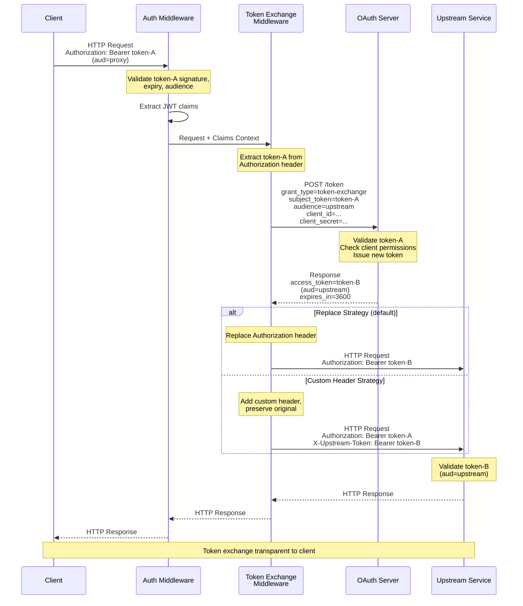

# Token exchange in thv proxy

> [!NOTE]
> This was originally [THV-2063](https://github.com/stacklok/toolhive/blob/a31891dbca93db20ff150b81f778205cb34e5e97/docs/proposals/THV-2063-token-exchange-middleware.md).

Enhancing thv proxy so that it is able to exchange the incoming token using RFC-8693 for a token that's forwarded to the back end.

## Problem statement

Per the MCP spec, the OAuth token used to authorize the access to the MCP server must be issued for the MCP server. However, the MCP server is often exposing an API where access is also authorized using OAuth \- this means that the MCP server must acquire a token meant for the backend service.

## Proposed solution

In case both the MCP server and the backend service require tickets issued by the same IDP and the IDP supports [RFC 8693](https://datatracker.ietf.org/doc/html/rfc8693) token exchange, we can exchange the internal token for an external one.

Note that other cases where the IDP represent different identity realms will be tackled separately.

## High-level design

The design can be illustrated with a flow diagram:



An important note is that for the token exchange to work, the MCP server or rather the proxy must have a client ID and often (depending on the IDP configuration) also a client secret.

## Implementation details

The core of the implementation is a new Token Exchange middleware. The middleware will use a Go module that will implement the exchange wrapped in the standard TokenSource interface. This will allow for composability with existing patterns to cache tokens such as ReuseTokenSource

The new middleware will be injected after the auth middleware to make sure the token authorizing access to the MCP server is validated.

Once the back end API token is acquired, the token is either injected into the Authorization: Bearer header or a custom header.

In the first PR, we'll run the token exchange for each request. This does not scale and needs to be addressed in subsequent patches.

## Usage examples

```shell
thv proxy my-mcp-server \
  --oidc-issuer https://keycloak.example.com/realms/myrealm \
  --oidc-client-id proxy-client \
  --oidc-client-secret proxy-secret \
  --token-exchange-url https://keycloak.example.com/realms/myrealm/protocol/openid-connect/token \
  --token-exchange-client-id exchange-client \
  --token-exchange-client-secret exchange-secret \
  --token-exchange-audience backend-service
```

```shell
thv run my-mcp-server \
  --oidc-issuer https://keycloak.example.com/realms/myrealm \
  --oidc-client-id mcp-client \
  --token-exchange-url https://keycloak.example.com/realms/myrealm/protocol/openid-connect/token \
  --token-exchange-client-id exchange-client \
  --token-exchange-client-secret exchange-secret \
  --token-exchange-audience upstream-api
```

## Operator integration

For Kubernetes deployments, token exchange configuration is exposed through the `MCPServer` CRD via the `externalAuthConfig` field.

### CRD structure

```go
type ExternalAuthConfig struct {
    Type          string                 `json:"type"`  // "tokenExchange" for now
    TokenExchange *TokenExchangeConfig   `json:"tokenExchange,omitempty"`
}

type TokenExchangeConfig struct {
    Type      string                         `json:"type"`  // "inline" or "configMap"
    Inline    *InlineTokenExchangeConfig     `json:"inline,omitempty"`
    ConfigMap *ConfigMapTokenExchangeRef     `json:"configMap,omitempty"`
}

type InlineTokenExchangeConfig struct {
    TokenURL                  string          `json:"tokenUrl"`
    ClientID                  string          `json:"clientId"`
    ClientSecretRef           *SecretKeyRef   `json:"clientSecretRef,omitempty"`
    Audience                  string          `json:"audience,omitempty"`
    Scopes                    string          `json:"scopes,omitempty"`
    ExternalTokenHeaderName   string          `json:"externalTokenHeaderName,omitempty"`
}
```

### Example

```yaml
apiVersion: toolhive.stacklok.dev/v1alpha1
kind: MCPServer
metadata:
  name: api-proxy
spec:
  image: ghcr.io/my-org/mcp-server:latest

  oidcConfig:
    type: kubernetes
    kubernetes:
      audience: toolhive

  externalAuthConfig:
    type: tokenExchange
    tokenExchange:
      type: inline
      inline:
        tokenUrl: https://keycloak.example.com/realms/myrealm/protocol/openid-connect/token
        clientId: exchange-client
        clientSecretRef:
          name: token-exchange-creds
          key: client-secret
        audience: backend-service
```

### Flow

1. User creates `MCPServer` CR with `backendTokenConfig`
2. Operator reconciles and generates deployment with appropriate CLI flags or RunConfig
3. ProxyRunner starts with token exchange middleware configured
4. Requests flow through authentication → token exchange → upstream proxy

## Future Enhancements

- **Federated Identity Token Acquisition**: Support token exchange when external IDPs have federation established with the internal IDP (e.g., Google's Workforce Identity Federation, GitHub Apps) - requires one-time federation setup and identity mapping but provides full auditability and automatic token acquisition

- **OAuth Flow for Non-Federated IDPs**: Implement a "two-headed OAuth proxy" component that drives OAuth flows against external IDPs where no federation exists - stores and refreshes per-user tokens securely to minimize repeated authentication

- **Network Wrapper for Generic MCP Servers**: Build an egress/ingress interceptor that wraps unmodified MCP servers (those only supporting single API keys) to inject per-call credentials by intercepting outgoing HTTP requests and adding authentication headers

- **Per-User Token Storage and Refresh**: Create secure token storage mechanism with automatic refresh capabilities to maintain long-lived sessions without repeated user authentication
