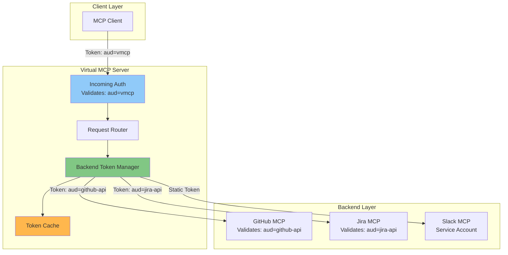
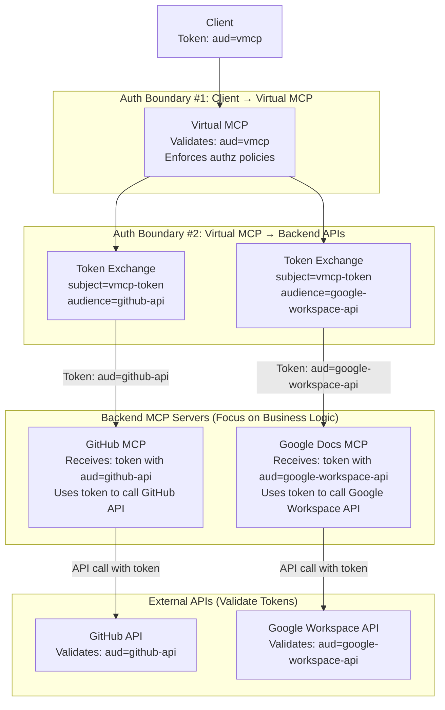
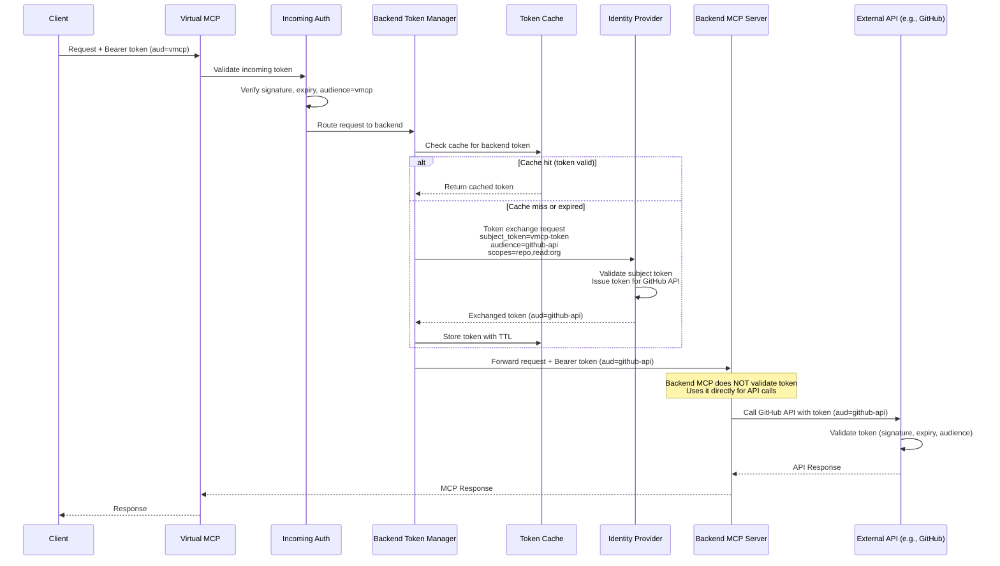

# Virtual MCP Server

> [!NOTE]
> This was originally [THV-2106](https://github.com/stacklok/toolhive/blob/a31891dbca93db20ff150b81f778205cb34e5e97/docs/proposals/THV-2106-virtual-mcp-server.md).

## Problem Statement

Organizations need to consolidate multiple MCP servers into a unified interface for complex workflows spanning multiple tools and services. Currently, clients must manage connections to individual MCP servers separately, leading to complexity in orchestration and authentication management.

## Goals

- Aggregate multiple MCP servers from a ToolHive group into a single virtual MCP server
- Enable tool namespace management and conflict resolution
- Support composite tools for multi-step workflows across backends
- Handle per-backend authentication/authorization requirements
- Maintain full MCP protocol compatibility

## Proposed Solution

### High-Level Design

The Virtual MCP Server (`thv virtual`) acts as an aggregation proxy that:
1. References an existing ToolHive group containing multiple MCP server workloads
2. Discovers and merges capabilities (tools, resources, prompts) from all workloads
3. Routes incoming MCP requests to appropriate backend workloads
4. Manages per-backend authentication with token exchange
5. Provides its own authentication boundary for client requests



---

## Key Features

#### 1. Group-Based Backend Management

Virtual MCP references a ToolHive group and automatically discovers all workloads within it:
- Leverages existing `groups.Manager` and `workloads.Manager`
- Dynamic workload discovery via `ListWorkloadsInGroup()`
- Inherits workload configurations from group

#### 2. Capability Aggregation

Merges MCP capabilities from all backends:
- **Tools**: Aggregated with namespace conflict resolution
- **Resources**: Combined from all backends
- **Prompts**: Merged with prefixing
- **Logging/Sampling**: Enabled if any backend supports it

#### 3. Tool Filtering and Overrides

Uses existing ToolHive constructs:
- **ToolsFilter**: Include only specific tools from a workload
- **ToolOverride**: Rename tools and update descriptions to avoid conflicts

#### 4. Per-Backend Authentication

Different backends may require different authentication strategies:
- **pass_through**: Forward client credentials unchanged
- **token_exchange**: Exchange incoming token for backend-specific token (RFC 8693)
- **service_account**: Use stored credentials for backend
- **header_injection**: Add authentication headers from secrets
- **mapped_claims**: Transform JWT claims for backend requirements

Example authentication flow:
```
Client → (Bearer token for Virtual MCP) → Virtual MCP
         ├→ GitHub backend (token exchanged for GitHub PAT)
         ├→ Jira backend (original token passed through)
         └→ Internal DB (service account token injected)
```

#### 5. Request Routing

Routes MCP protocol requests to appropriate backends:
- Tool calls routed based on tool-to-workload mapping
- Resource requests routed by resource namespace
- Prompt requests handled similarly
- Load balancing for duplicate capabilities

#### 6. Elicitation Support in Composite Tools

Composite tools can include elicitation steps to request additional information from users during workflow execution, following the [MCP elicitation specification](https://modelcontextprotocol.io/specification/2025-06-18/client/elicitation). This enables:

- **Interactive workflows**: Request user input between steps
- **Safety confirmations**: Require approval before destructive operations
- **Dynamic parameters**: Gather context-dependent information
- **Conditional execution**: Branch workflow based on user responses

Elicitation steps use JSON Schema to define the structure of requested data (limited to flat objects with primitive properties). The Virtual MCP server forwards elicitation requests to the client and captures responses in three forms:

- **accept**: User provided data (accessible via `{{.steps.step_id.content}}`)
- **decline**: User explicitly rejected the request
- **cancel**: User dismissed without choosing

Subsequent steps can reference elicitation results through template expansion and use the `condition` field to execute conditionally based on user responses. The `on_decline` and `on_cancel` handlers control workflow behavior for non-acceptance scenarios.

Eliciation steps will have a default timeout (to be determined) and can be configured with a timeout value. When a timeout is reached, it will be considered a **cancel** response.

---

## Authentication Architecture

Virtual MCP implements a **unified configuration model with platform-specific adapters**. The same mental model applies whether running via CLI or Kubernetes, with different serialization formats optimized for each platform.

### Two Authentication Boundaries

Virtual MCP operates with two distinct, independent authentication boundaries:

1. **Incoming Authentication** (Client → Virtual MCP)
   - **Purpose**: Validates client requests to Virtual MCP
   - **Token Audience**: `aud=vmcp`
   - **Configuration**: `incomingAuth` (K8s) / `incoming_auth` (CLI)
   - **Implementation**: Uses existing ToolHive auth middleware (OIDC, local, anonymous)

2. **Outgoing Authentication** (Virtual MCP → Backend APIs)
   - **Purpose**: Per-backend token exchange for accessing **backend services' APIs directly**
   - **Token Audience**: Backend API-specific (e.g., `aud=github-api`, `aud=google-workspace-api`)
   - **Configuration**: `outgoingAuth` (K8s) / `outgoing_auth` (CLI)
   - **Implementation**: RFC 8693 token exchange (references THV-2063)

**Important Design Decision**: The exchanged tokens are meant for the **backend APIs** (GitHub API, Jira API, Google Workspace API), not for authenticating Virtual MCP to the backend MCP servers. Backend MCP servers receive properly scoped tokens that they use directly to call upstream APIs. This means:

- **Backend MCP servers focus on business logic**, not authentication
- **Tokens have API-specific audiences** (e.g., `aud=github-api` for GitHub's REST API)
- **MCP servers pass tokens directly** to upstream API calls in the `Authorization` header
- **Security relies on network isolation** and properly scoped API tokens



### Zero-Trust Security Model

Virtual MCP adheres to a zero-trust security architecture where compromising one layer does not automatically grant access to others:

**Security Properties:**

1. **API-Level Authentication**: Backend APIs (GitHub API, Jira API, Google Workspace API) validate tokens independently. Each exchanged token has a backend API-specific audience (e.g., `aud=github-api`), ensuring the token can only be used with that specific API.

2. **Token Exchange Per Backend**: Virtual MCP performs RFC 8693 token exchange independently for each backend, requesting tokens with backend API-specific audiences. Each exchanged token is scoped only to its target API.

3. **Defense in Depth**: Even if Virtual MCP is compromised:
   - Attacker must possess a valid user token (with `aud=vmcp`) to perform exchanges
   - Backend APIs independently validate audience, expiry, and signatures
   - Each backend receives only tokens scoped for its specific API audience
   - Audit logs maintained at both Virtual MCP and backend API levels

4. **Credential Isolation**: Virtual MCP does not store long-lived credentials for backend APIs. It only stores OAuth client credentials for token exchange, which require a valid user token to be useful.

5. **Network Isolation** (Recommended): Backend MCP servers SHOULD NOT be directly accessible outside their security boundary (e.g., not exposed via public LoadBalancer). Access SHOULD be routed through Virtual MCP or authenticated ingress.

6. **MCP Server Simplicity**: Backend MCP servers focus on business logic and do not need to implement authentication/authorization. They receive pre-validated, properly scoped tokens from Virtual MCP that are ready to use with upstream APIs.

**Security Boundaries Diagram:**

```
┌─────────────────────────────────────────┐
│  Client (authenticated to Virtual MCP)  │
└──────────────┬──────────────────────────┘
               │ Auth boundary #1
               │ Token: aud=vmcp
┌──────────────▼──────────────────────────┐
│  Virtual MCP Server                      │
│  - Validates client token                │
│  - Enforces authorization policies       │
│  - Exchanges tokens per backend          │
└──┬───────────┬────────────┬──────────────┘
   │           │            │ Auth boundary #2
   │           │            │ Independent tokens per backend
┌──▼────┐  ┌───▼─────┐  ┌──▼──────┐
│GitHub │  │  Jira   │  │  Slack  │
│(MUST  │  │ (MUST   │  │ (MUST   │
│auth)  │  │ auth)   │  │ auth)   │
└───────┘  └─────────┘  └─────────┘
```

### Token Exchange Flow



### Example: Google Docs MCP Server Authentication

To clarify the authentication model, consider a Google Docs MCP server example:

**Setup:**
- Client authenticates to Virtual MCP with token (`aud=vmcp`)
- Virtual MCP configured with `outgoing_auth` for Google Docs backend
- Google Docs MCP server needs to call Google Workspace APIs

**Authentication Flow:**

1. **Client → Virtual MCP**: Client sends request with `Authorization: Bearer <token_vmcp>`
2. **Virtual MCP → IDP**: Exchanges token for Google Workspace API token:
   ```
   Token Exchange Request:
   - subject_token: <token_vmcp>
   - audience: "https://www.googleapis.com/auth/documents"
   - scopes: ["https://www.googleapis.com/auth/documents"]
   ```
3. **IDP → Virtual MCP**: Returns token with `aud=https://www.googleapis.com/auth/documents`
4. **Virtual MCP → Google Docs MCP**: Forwards request with `Authorization: Bearer <token_google_api>`
5. **Google Docs MCP → Google API**: Uses token directly to call Google Docs API
   ```
   GET https://docs.googleapis.com/v1/documents/{documentId}
   Authorization: Bearer <token_google_api>
   ```
6. **Google API**: Validates token (signature, audience, scopes) and returns document data

**Key Points:**
- The token has `aud=https://www.googleapis.com/auth/documents` (for Google's API)
- Google Docs MCP server does NOT validate the token itself
- Security relies on network isolation (Google Docs MCP not publicly accessible)
- All audit logs at Google API level show the individual user identity

---

## Configuration Schemas

### CLI Configuration (Local Deployment)

**File: `virtual-mcp-config.yaml`**

```yaml
# Virtual MCP metadata
name: "engineering-vmcp"
group: "engineering-team"  # Reference to ToolHive group

# ===== INCOMING AUTHENTICATION (Client → Virtual MCP) =====
incoming_auth:
  type: oidc  # oidc | anonymous | local
  oidc:
    issuer: "https://keycloak.example.com/realms/myrealm"
    client_id: "vmcp-client"
    client_secret_env: "VMCP_CLIENT_SECRET"  # Read from environment variable
    audience: "vmcp"  # Token must have aud=vmcp
    scopes: ["openid", "profile", "email"]

  # Optional: Authorization policies
  authz:
    type: cedar
    policies:
      - |
        permit(
          principal,
          action == Action::"tools/call",
          resource
        );

# ===== OUTGOING AUTHENTICATION (Virtual MCP → Backends) =====
outgoing_auth:
  # Configuration source (CLI only supports 'inline')
  source: inline  # inline (CLI only)

  # Default behavior for backends without explicit config
  default:
    type: pass_through  # pass_through | error

  # Per-backend authentication configurations
  backends:
    github:
      type: token_exchange
      token_exchange:
        # References THV-2063-token-exchange-middleware.md
        token_url: "https://keycloak.example.com/realms/myrealm/protocol/openid-connect/token"
        client_id: "vmcp-github-exchange"
        client_secret_env: "GITHUB_EXCHANGE_SECRET"
        audience: "github-api"  # ← Token audience for GitHub API, not github-mcp
        scopes: ["repo", "read:org"]  # ← GitHub API scopes
        subject_token_type: "access_token"  # access_token | id_token

    jira:
      type: token_exchange
      token_exchange:
        token_url: "https://keycloak.example.com/realms/myrealm/protocol/openid-connect/token"
        client_id: "vmcp-jira-exchange"
        client_secret_env: "JIRA_EXCHANGE_SECRET"
        audience: "jira-api"
        scopes: ["read:jira-work", "write:jira-work"]

    slack:
      type: service_account
      service_account:
        credentials_env: "SLACK_BOT_TOKEN"
        header_name: "Authorization"
        header_format: "Bearer {token}"

    internal-db:
      type: pass_through  # Forward client token unchanged

# ===== TOKEN CACHING =====
token_cache:
  provider: memory  # memory | redis | custom
  config:
    max_entries: 1000
    ttl_offset: "5m"  # Refresh tokens 5 minutes before expiry

# ===== TOOL AGGREGATION =====
aggregation:
  # Conflict resolution strategy
  conflict_resolution: prefix  # prefix | priority | manual

  # Conflict resolution details
  conflict_resolution_config:
    # For 'prefix' strategy: prefix format
    prefix_format: "{workload}_"  # Options: {workload}, {workload}_, custom-prefix-

    # For 'priority' strategy: explicit ordering
    # priority_order: ["github", "jira", "slack"]

    # For 'manual' strategy: must define overrides for all conflicts

  # Tool filtering and overrides (per workload)
  tools:
    - workload: "github"
      filter: ["create_pr", "merge_pr", "list_issues"]
      overrides:
        create_pr:
          name: "gh_create_pr"
          description: "Create a GitHub pull request"

    - workload: "jira"
      overrides:
        create_issue:
          name: "jira_create_issue"

# ===== OPERATIONAL SETTINGS =====
operational:
  timeouts:
    default: 30s
    per_workload:
      github: 45s

  # Failure handling
  failure_handling:
    # Backend unavailability
    health_check_interval: 30s
    unhealthy_threshold: 3  # Mark unhealthy after N failures

    # Partial failures
    partial_failure_mode: fail  # fail | best_effort

    # Circuit breaker
    circuit_breaker:
      enabled: true
      failure_threshold: 5
      timeout: 60s

# ===== COMPOSITE TOOLS (Phase 2) =====
composite_tools:
  - name: "deploy_and_notify"
    description: "Deploy PR with user confirmation and notification"
    parameters:
      type: object
      properties:
        pr_number:
          type: integer
          description: "Pull request number to deploy"
      required: ["pr_number"]

    # Workflow timeout
    timeout: "30m"

    steps:
      - id: "merge"
        tool: "github.merge_pr"
        arguments: {pr: "{{.params.pr_number}}"}

        # Per-step error handling
        on_error:
          action: "abort"  # abort | continue | retry

      - id: "confirm_deploy"
        type: "elicitation"
        message: "PR {{.params.pr_number}} merged successfully. Proceed with deployment?"
        schema:
          type: "object"
          properties:
            environment:
              type: "string"
              enum: ["staging", "production"]
        depends_on: ["merge"]

        # Elicitation timeout
        timeout: "5m"
        on_decline:
          action: "skip_remaining"
        on_cancel:
          action: "abort"

      - id: "deploy"
        tool: "kubernetes.deploy"
        arguments:
          pr: "{{.params.pr_number}}"
          environment: "{{.steps.confirm_deploy.content.environment}}"
        depends_on: ["confirm_deploy"]
        condition: "{{.steps.confirm_deploy.action == 'accept'}}"

  - name: "investigate_incident"
    description: "Gather logs and metrics from multiple sources for incident analysis"
    parameters:
      type: object
      properties:
        incident_id:
          type: string
          description: "Incident identifier"
        time_range:
          type: string
          description: "Time range for data collection"
          default: "1h"
      required: ["incident_id"]

    steps:
      - id: "fetch_app_logs"
        tool: "fetch.fetch"
        arguments:
          url: "https://logs.company.com/api/query?service=app&time={{.params.time_range}}"

      - id: "fetch_error_metrics"
        tool: "fetch.fetch"
        arguments:
          url: "https://metrics.company.com/api/errors?time={{.params.time_range}}"

      - id: "fetch_trace_data"
        tool: "fetch.fetch"
        arguments:
          url: "https://tracing.company.com/api/traces?time={{.params.time_range}}"

      - id: "fetch_infra_status"
        tool: "fetch.fetch"
        arguments:
          url: "https://monitoring.company.com/api/infrastructure/status"

      - id: "create_report"
        tool: "jira.create_issue"
        arguments:
          title: "Incident {{.params.incident_id}} Analysis"
          description: |
            Application Logs: {{.steps.fetch_app_logs.output}}
            Error Metrics: {{.steps.fetch_error_metrics.output}}
            Trace Data: {{.steps.fetch_trace_data.output}}
            Infrastructure: {{.steps.fetch_infra_status.output}}
```

**Note**: The `investigate_incident` composite tool demonstrates calling the same backend tool (`fetch`) multiple times with different static URLs to gather incident data from various monitoring sources. This pattern allows a single generic tool to be reused with different static endpoints, creating a purpose-built workflow without needing separate tools for each data source.

**CLI Usage:**

```bash
# Start Virtual MCP from config file
thv virtual --config virtual-mcp-config.yaml

# With environment variables
export VMCP_CLIENT_SECRET="..."
export GITHUB_EXCHANGE_SECRET="..."
export JIRA_EXCHANGE_SECRET="..."
export SLACK_BOT_TOKEN="..."
thv virtual --config virtual-mcp-config.yaml

# Override specific settings
thv virtual --config virtual-mcp-config.yaml \
  --port 8080 \
  --log-level debug
```

---

### Kubernetes Configuration

**New CRD: `VirtualMCPServer`**

```yaml
apiVersion: toolhive.stacklok.dev/v1alpha1
kind: VirtualMCPServer
metadata:
  name: engineering-vmcp
  namespace: default
spec:
  # Reference to ToolHive group
  groupRef:
    name: engineering-team

  # ===== INCOMING AUTHENTICATION (Client → Virtual MCP) =====
  incomingAuth:
    # Virtual MCP's own OIDC configuration
    oidcConfig:
      type: kubernetes  # kubernetes | inline | configMapRef
      kubernetes:
        audience: vmcp
        # Uses default Kubernetes OIDC discovery

    # Optional: Authorization policies
    authzConfig:
      type: inline
      inline:
        policies:
          - |
            permit(
              principal,
              action == Action::"tools/call",
              resource
            );

  # ===== OUTGOING AUTHENTICATION (Virtual MCP → Backends) =====
  outgoingAuth:
    # Configuration source
    source: discovered  # inline | discovered

    # When source=discovered:
    # Virtual MCP queries each backend's MCPServer.spec.externalAuthConfigRef
    # and uses those MCPExternalAuthConfig resources for token exchange

    # Optional: Default behavior for backends without auth config
    default:
      type: pass_through

    # Optional: Override specific backends (works in all modes)
    backends:
      slack:
        type: service_account
        serviceAccount:
          credentialsRef:
            name: slack-bot-token
            key: token
          headerName: Authorization
          headerFormat: "Bearer {token}"

  # ===== TOKEN CACHING =====
  tokenCache:
    provider: memory  # memory | redis
    memory:
      maxEntries: 1000
      ttlOffset: 5m
    # redis:
    #   address: "redis:6379"
    #   db: 0
    #   keyPrefix: "vmcp:tokens:"
    #   passwordRef:
    #     name: redis-auth
    #     key: password

  # ===== TOOL AGGREGATION =====
  aggregation:
    conflictResolution: prefix  # prefix | priority | manual

    conflictResolutionConfig:
      prefixFormat: "{workload}_"

    tools:
      - workload: github
        filter: ["create_pr", "merge_pr"]
        overrides:
          create_pr:
            name: gh_create_pr

  # ===== OPERATIONAL SETTINGS =====
  operational:
    timeouts:
      default: 30s
      perWorkload:
        github: 45s

    failureHandling:
      healthCheckInterval: 30s
      unhealthyThreshold: 3
      partialFailureMode: fail
      circuitBreaker:
        enabled: true
        failureThreshold: 5
        timeout: 60s

status:
  # Observed state
  conditions:
    - type: Ready
      status: "True"
      lastTransitionTime: "2025-10-20T10:00:00Z"
      reason: AllBackendsReady
      message: "Virtual MCP is ready and serving requests"

    - type: AuthConfigured
      status: "True"
      reason: IncomingAuthValid
      message: "Incoming authentication configured"

    - type: BackendsDiscovered
      status: "True"
      reason: DiscoveryComplete
      message: "Discovered 3 backends with authentication"

  # Discovered backend configurations (when source=discovered)
  discoveredBackends:
    - name: github
      authConfigRef: github-token-exchange
      authType: token_exchange
      status: ready
      lastHealthCheck: "2025-10-20T10:05:00Z"

    - name: jira
      authConfigRef: jira-token-exchange
      authType: token_exchange
      status: ready
      lastHealthCheck: "2025-10-20T10:05:00Z"

    - name: internal-db
      authConfigRef: null
      authType: pass_through
      status: ready
      lastHealthCheck: "2025-10-20T10:05:00Z"

  # Aggregated capabilities
  capabilities:
    toolCount: 15
    resourceCount: 3
    promptCount: 2

  # Summary
  observedGeneration: 1
  phase: Ready
  message: "Virtual MCP serving 3 backends with 15 tools"
```

**Discovery Mode Example:**

When `source: discovered`, Virtual MCP automatically discovers backend authentication configs from existing resources:

```yaml
# Backend MCPServer (existing resource)
apiVersion: toolhive.stacklok.dev/v1alpha1
kind: MCPServer
metadata:
  name: github-mcp
  labels:
    group: engineering-team  # Part of the group
spec:
  image: ghcr.io/org/github-mcp:latest
  transport: streamable-http

  # Backend's own auth config
  externalAuthConfigRef:
    name: github-token-exchange  # ← Virtual MCP discovers this

---
# MCPExternalAuthConfig (existing resource)
apiVersion: toolhive.stacklok.dev/v1alpha1
kind: MCPExternalAuthConfig
metadata:
  name: github-token-exchange
spec:
  type: tokenExchange
  tokenExchange:
    tokenUrl: https://keycloak.example.com/realms/myrealm/protocol/openid-connect/token
    clientId: github-exchange-client
    clientSecretRef:
      name: github-oauth-secret
      key: client-secret
    audience: github-api
    scopes: ["repo", "read:org"]

---
# Virtual MCP automatically uses discovered config
apiVersion: toolhive.stacklok.dev/v1alpha1
kind: VirtualMCPServer
metadata:
  name: engineering-vmcp
spec:
  groupRef:
    name: engineering-team

  incomingAuth:
    oidcConfig:
      type: kubernetes
      kubernetes:
        audience: vmcp

  outgoingAuth:
    source: discovered  # ← Discovers github-token-exchange automatically
```

## Tool Conflict Resolution

Tool name conflicts occur when multiple backends expose tools with the same name. Virtual MCP provides three resolution strategies:

### 1. Prefix Strategy (Default)

Automatically prefixes tool names with workload identifier.

**Configuration:**
```yaml
aggregation:
  conflict_resolution: prefix
  conflict_resolution_config:
    prefix_format: "{workload}_"  # Results in: github_create_pr, jira_create_pr
```

**Prefix Format Options:**
- `{workload}`: Bare workload name (e.g., `github`)
- `{workload}_`: Workload with underscore (e.g., `github_`)
- `{workload}.`: Workload with dot (e.g., `github.`)
- Custom string: Any static prefix (e.g., `backend_`)

**Behavior:**
- All tools from all backends are prefixed
- No configuration required beyond format
- Predictable, deterministic naming

### 2. Priority Strategy

First workload in priority order wins; conflicting tools from other workloads are ignored.

**Configuration:**
```yaml
aggregation:
  conflict_resolution: priority
  conflict_resolution_config:
    priority_order: ["github", "jira", "slack"]
```

**Behavior:**
- If `github` and `jira` both have `create_issue`, use GitHub's version
- Lower-priority backends' conflicting tools are dropped
- Non-conflicting tools are included from all backends
- Logs warnings for dropped tools

### 3. Manual Strategy

Requires explicit overrides for all conflicts; fails at startup if conflicts exist without overrides.

**Configuration:**
```yaml
aggregation:
  conflict_resolution: manual
  tools:
    - workload: github
      overrides:
        create_issue:
          name: gh_create_issue
    - workload: jira
      overrides:
        create_issue:
          name: jira_create_issue
```

**Behavior:**
- Startup validation checks for conflicts
- Fails with error listing unresolved conflicts
- Ensures deliberate conflict resolution
- Safest option for production

**Validation Example:**
```
Error: Unresolved tool name conflicts:
  - create_issue: [github, jira]
  - list_items: [github, jira, slack]

Use 'overrides' to resolve these conflicts when using conflict_resolution: manual
```

---

## Error Handling and Failure Modes

### Backend Unavailability

**Detection:**
- Health checks every 30s against backend MCP server
- Marks backend unhealthy after 3 consecutive failures

**Behavior:**
- Remove backend's tools from capability list
- Return error if tool call targets unavailable backend
- Log backend unavailability events

**Recovery:**
- Automatic re-inclusion when health check succeeds
- Notify monitoring systems of state change

### Partial Failures

**Configuration:**
```yaml
operational:
  failure_handling:
    partial_failure_mode: fail  # fail | best_effort
```

**Mode: `fail` (default)**
- Any backend failure causes entire request to fail
- Ensures consistent, all-or-nothing semantics
- Suitable for transactional workflows

**Mode: `best_effort`**
- Return partial results from successful backends
- Include error details for failed backends
- Suitable for read-only aggregation

### Circuit Breaker

**Purpose:** Prevent cascading failures by temporarily isolating unhealthy backends.

**Configuration:**
```yaml
operational:
  failure_handling:
    circuit_breaker:
      enabled: true
      failure_threshold: 5       # Open circuit after N failures
      timeout: 60s               # Stay open for 60s
```

**States:**
1. **Closed** (normal): All requests forwarded
2. **Open**: No requests forwarded (fail immediately)
3. **Half-Open**: Allow limited requests to test recovery

### Composite Tool Failures

**Per-Step Error Handling:**
```yaml
steps:
  - id: merge
    tool: github.merge_pr
    on_error:
      action: abort  # abort | continue | retry
      retry_count: 3
      retry_delay: 5s
```

**Actions:**
- `abort`: Stop workflow immediately, return error
- `continue`: Log error, proceed to next step
- `retry`: Retry step up to N times with delay

---

## Token Caching Architecture

Virtual MCP implements a pluggable token cache to minimize repeated token exchanges and improve performance.

### Cache Key Structure

Cache keys uniquely identify tokens based on:
- **Backend name**: Which backend this token is for (e.g., "github")
- **Subject token hash**: SHA-256 hash of the user's incoming token (for user isolation)
- **Audience**: Backend audience (e.g., "github-api")

**Key Format:** `{backend}:{hash(subject_token)}:{audience}`

This ensures proper token isolation per (user, backend) pair while maintaining privacy.

### Supported Cache Providers

**Phase 1: Memory Cache**
- In-memory LRU cache with TTL-based eviction
- No external dependencies
- Per-instance cache (not shared across replicas)
- Suitable for: CLI, single-instance K8s deployments

**Phase 2: Redis Cache**
- Distributed Redis cache for multi-instance deployments
- Shared cache across Virtual MCP replicas
- Persistent token storage (survives restarts)
- Suitable for: Multi-instance K8s deployments (HA)

**Future: Custom Cache Providers**
- Plugin architecture for custom cache implementations
- Register via configuration

### Cache Behavior

**Token Lifetime Management:**
1. Tokens cached until expiry
2. Configurable refresh offset (default: 5 minutes before expiry)
3. Expired tokens automatically evicted

**Performance Characteristics:**

| Operation | Memory Cache | Redis Cache |
|-----------|-------------|-------------|
| Cache hit | < 1ms | ~5ms (network) |
| Cache miss + exchange | 50-200ms | 50-200ms |
| Memory overhead | ~200 bytes/token | Minimal (client only) |
| Persistence | No | Yes |
| Multi-instance | No | Yes |

---

## Implementation Phases

**Phase 1 (MVP)**: Basic aggregation
- Group-based workload discovery
- Simple request routing
- Per-backend authentication strategies
- Pass-through authentication
- Token exchange support

**Phase 2**: Advanced features
- Composite tool execution
- Elicitation support in composite tools

**Phase 3**: Enterprise features
- Tool aggregation with filter and override support
- Advanced routing strategies
- Comprehensive observability
- Failover and load balancing

## Benefits

- **Simplified Client Integration**: Single MCP connection instead of multiple
- **Unified Authentication**: Handle diverse backend auth requirements centrally
- **Workflow Orchestration**: Composite tools enable cross-service workflows
- **Operational Efficiency**: Centralized monitoring and management
- **Backward Compatible**: Works with existing MCP clients and servers

## Implementation Notes

### Reusing Existing Components

The implementation will maximize reuse of existing ToolHive components:

1. **Tool Filtering**: Use existing `mcp.WithToolsFilter()` middleware
2. **Tool Overrides**: Use existing `mcp.WithToolsOverride()` middleware
3. **Groups**: Use `groups.Manager` for group operations
4. **Workloads**: Use `workloads.Manager` for workload discovery
5. **Authentication**: Extend existing auth middleware patterns
6. **Elicitation**: Implement MCP elicitation protocol for composite tool user interaction

### Token Exchange Integration (References THV-2063)

Virtual MCP builds on the token exchange middleware from THV-2063-token-exchange-middleware.md:

**Integration Points:**
- Reuses `pkg/auth/tokenexchange` implementation for RFC 8693 token exchange
- Per-backend exchange using separate `ExchangeConfig` instances
- Token caching via pluggable `TokenCache` interface
- Subject token extracted from incoming `Authorization` header

**Discovery Pattern (Kubernetes Only):**

Virtual MCP discovers backend authentication configs from `MCPExternalAuthConfig` resources referenced by each backend's `MCPServer.spec.externalAuthConfigRef` (see Kubernetes Configuration section for details). This leverages the existing controller pattern from `mcpexternalauthconfig_controller.go`.

**Unified Configuration Model:**

The platform-agnostic configuration model enables code reuse:
- **CLI Adapter**: Loads from YAML files with environment variable substitution
- **Kubernetes Adapter**: Loads from CRDs with automatic backend discovery
- **Core Logic**: Both adapters convert to the same internal model

This adapter pattern provides:
- Consistent behavior across CLI and Kubernetes
- Single test suite for business logic
- Easy addition of new platforms (Docker Swarm, Nomad, etc.)

### Composite Tool State Persistence

Composite tools with elicitation require state persistence to handle long-running workflows that span multiple user interactions.

**Phase 2 Approach (In-Memory Storage):**
- Virtual MCP maintains workflow execution state in memory
- State includes: current step, completed steps, elicitation responses, template variables
- Clean storage interface enables future migration to persistent backends

**Workflow Lifecycle:**
- Each composite tool invocation receives a unique workflow ID
- Server checkpoints state after each step completion and elicitation interaction
- Default workflow timeout: 30 minutes
- After timeout: automatic cleanup and pending elicitations treated as cancelled

**Design Rationale:**
This approach keeps implementation simple for Phase 2 while establishing patterns that can scale to distributed persistence (Redis, database) in Phase 3.

## Alternative Approaches Considered

1. **Kubernetes CRD**: More complex, requires operator changes
2. **Standalone Service**: Loses integration with ToolHive infrastructure
3. **LLM-generated backend**: Adds more randomness to the equation which is undesirable for agents.

## Open Questions

1. **Streaming responses across multiple backends** - How to merge/multiplex streaming responses from multiple backends for composite tools? Deferred to Phase 3.

2. **Backend capability caching** - Should we cache backend capabilities (tools/resources/prompts) or query dynamically on each request?
   - Cache: Better performance, may be stale
   - Dynamic: Always fresh, higher latency
   - Hybrid: Cache with TTL and invalidation on backend changes

3. **Backend rate limits** - How to handle per-backend rate limits?
   - Pass through to client (let them handle)
   - Virtual MCP enforces aggregate limits
   - Per-backend quotas with queuing

## Success Criteria

### Phase 1 (MVP)
- Aggregate multiple MCP servers from a group into single interface
- Tool conflict resolution (prefix strategy)
- Basic request routing to backend workloads
- Pass-through authentication
- Zero changes required to existing MCP servers or clients

### Phase 2 (Advanced Features)
- Per-backend token exchange (RFC 8693)
- Token caching (memory provider)
- Composite tool execution with elicitation
- Backend health checks and circuit breaker
- Kubernetes backend auth discovery

### Phase 3 (Enterprise)
- Distributed token cache (Redis)
- Multi-instance HA support
- Advanced conflict resolution (priority, manual)
- Persistent composite tool state
- Dynamic configuration updates
