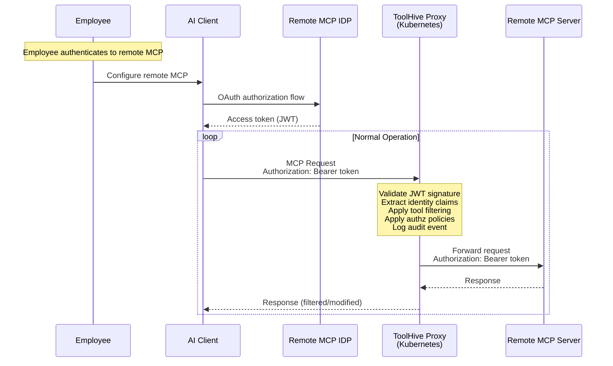
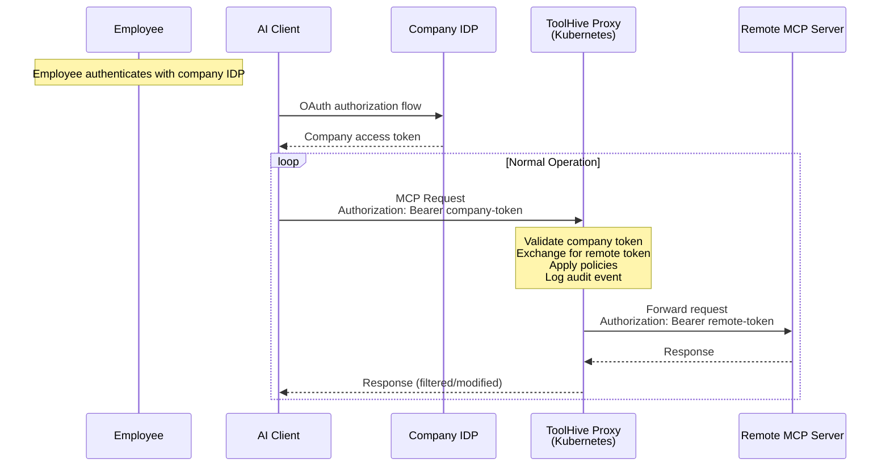

# Remote MCP Server Proxy Support in Kubernetes Operator

> [!NOTE]
> This was originally [THV-2151](https://github.com/stacklok/toolhive/blob/a31891dbca93db20ff150b81f778205cb34e5e97/docs/proposals/THV-2151-remote-mcp-proxy.md).

## Executive Summary

This proposal extends the ToolHive Kubernetes operator to support proxying remote Model Context Protocol (MCP) servers with OAuth authentication, bringing feature parity with the existing `thv run <remote-url>` CLI capability. Organizations currently lack the ability to deploy centralized remote MCP proxies in Kubernetes, preventing them from gaining visibility, applying policies, and maintaining audit logs for employee interactions with external SaaS MCP services (e.g., Salesforce MCP, GitHub MCP).

The proposed solution introduces a new `MCPRemoteProxy` Custom Resource Definition (CRD) that deploys stateless, horizontally scalable proxies in Kubernetes. These proxies validate OAuth tokens (JWT or via introspection), extract user identity from validated tokens, and apply existing ToolHive middleware for authorization policies, tool filtering, audit logging, and telemetry. The architecture supports both direct authentication (employees authenticate to remote MCP services) and optional token exchange (when IDP federation exists between company and remote service).

**Impact**: This enables enterprises to gain centralized observability and policy enforcement over external MCP usage without requiring changes to remote services or storing user credentials. The solution leverages existing ToolHive authentication, authorization, and audit infrastructure, requiring primarily integration work rather than new security primitives.

## Problem Statement

ToolHive CLI supports proxying remote MCP servers with OAuth authentication via `thv run <remote-url>`. However, the Kubernetes operator only supports container-based MCP servers. Organizations cannot deploy centralized remote MCP proxies in Kubernetes to provide observability, policy enforcement, and audit logging for external MCP services.

## Use Cases

### Enterprise Observability for SaaS MCP Servers

A company uses external MCP services (Salesforce MCP, GitHub MCP, etc.) and wants centralized visibility and control over how employees use these services.

**Requirements:**
- Observe what tools employees are calling on external MCP servers
- Filter or restrict access to specific tools
- Override tool names/descriptions for consistency
- Centralized audit logging for compliance
- Apply authorization policies based on user identity
- Centralized telemetry and monitoring

**Current Limitations:**
- Employees run `thv run` locally with no centralized visibility
- No shared policy enforcement across the organization
- Fragmented audit logs across individual CLI instances
- No way to deploy this capability in Kubernetes

**Desired State:**
- Deploy centralized proxy in Kubernetes
- All employee requests flow through proxy
- Apply consistent policies and collect unified audit logs
- High availability through Kubernetes

## Value Proposition

**For Organizations:**
- **Observability**: See what tools employees are using across all external MCPs
- **Policy Enforcement**: Apply tool filters, overrides, and authorization policies
- **Compliance**: Centralized audit trail for all external MCP interactions
- **Cost Control**: Monitor and control usage of external services
- **Simplified Management**: Deploy once vs managing many local CLI processes

**For Employees:**
- **Transparent**: Authenticate directly to external services as normal
- **Consistent**: Same access patterns for all MCPs
- **Reliable**: High availability through Kubernetes

**Technical:**
- **Feature Parity**: Bring CLI remote MCP capabilities to Kubernetes operator
- **Reuse Infrastructure**: Leverage existing authz, audit, tool filtering, telemetry

## Goals

- Enable Kubernetes operator to deploy proxies for remote MCP servers
- Extract user identity from OAuth tokens for policy enforcement
- Apply tool filtering, overrides, authorization, and audit logging
- Support optional token exchange when IDP federation exists
- Maintain stateless, horizontally scalable architecture

## Non-Goals

- Storing OAuth tokens on behalf of users
- Handling authentication flows (users authenticate directly to remote MCP)
- Supporting non-OAuth authentication methods initially

## Architecture Overview

### Base Case: Direct Authentication

Employees authenticate directly to the remote MCP server. The proxy provides observability and policy enforcement.



- Single authentication: Employee → Remote MCP
- Proxy validates JWT signature against remote IDP's JWKS
- Proxy extracts identity from validated JWT claims (sub, email, etc.)
- Proxy applies policies based on validated token identity
- Token forwarded unchanged to remote MCP for its own validation

### Optional: Token Exchange Mode

When IDP federation exists, proxy can exchange company tokens for remote tokens.



- Employee authenticates with company IDP only
- Proxy uses RFC 8693 token exchange to get remote token
- Leverages existing token exchange middleware
- No user-visible difference

### Middleware Chain

Request processing order:

1. **Authentication**: Validate JWT signature using OIDC configuration and extract claims
2. **Token Exchange** (optional): Exchange company token for remote token if configured
3. **Authorization**: Apply Cedar policies based on validated identity claims
4. **Audit**: Log request with user identity and tool info
5. **Tool Filtering**: Filter/override tools based on configuration
6. **Telemetry**: Record metrics and traces
7. **Transparent Proxy**: Forward to remote MCP server

## Design Details

### MCPRemoteProxy CRD

New custom resource for deploying remote MCP proxies:

**Base case (direct authentication):**
```yaml
apiVersion: toolhive.stacklok.dev/v1alpha1
kind: MCPRemoteProxy
metadata:
  name: salesforce-mcp
  namespace: mcp-proxies
spec:
  # Remote MCP server URL
  remoteURL: https://mcp.salesforce.com

  # REQUIRED: Validate tokens from remote MCP's IDP
  oidcConfig:
    type: inline
    inline:
      issuer: https://login.salesforce.com
      audience: mcp.salesforce.com
      # JWKS will be fetched from issuer's well-known endpoint
      # or can be explicitly set with jwksUrl

  # Authorization policies (based on validated JWT claims)
  authzConfig:
    type: configMap
    configMap:
      name: salesforce-authz
      # Policies can reference JWT claims like:
      # principal.sub, principal.email, principal.groups

  # Audit logging
  audit:
    enabled: true

  # Tool filtering and renaming
  toolConfigRef:
    name: salesforce-tools

  # Deployment configuration
  port: 8080

  resources:
    limits:
      cpu: "1"
      memory: 512Mi
    requests:
      cpu: 100m
      memory: 128Mi

status:
  phase: Running
  url: http://salesforce-mcp.mcp-proxies.svc.cluster.local:8080
  externalURL: https://mcp-proxy.company.com/salesforce
  conditions:
    - type: Ready
      status: "True"
```

**With token exchange (when federation exists):**

First, create the external auth config:
```yaml
apiVersion: toolhive.stacklok.dev/v1alpha1
kind: MCPExternalAuthConfig
metadata:
  name: salesforce-token-exchange
  namespace: mcp-proxies
spec:
  type: tokenExchange
  tokenExchange:
    token_url: https://keycloak.company.com/realms/myrealm/protocol/openid-connect/token
    client_id: exchange-client
    client_secret_ref:
      name: token-exchange-creds
      key: client-secret
    audience: mcp.salesforce.com
    scope: "mcp:read mcp:write"
```

Then reference it in the proxy:
```yaml
apiVersion: toolhive.stacklok.dev/v1alpha1
kind: MCPRemoteProxy
metadata:
  name: salesforce-mcp
  namespace: mcp-proxies
spec:
  remoteURL: https://mcp.salesforce.com

  # Company authentication (for token exchange)
  oidcConfig:
    type: inline
    inline:
      issuer: https://auth.company.com
      audience: mcp-proxy

  # Reference to token exchange configuration
  externalAuthConfigRef:
    name: salesforce-token-exchange

  # Same policies/audit/tools apply
  authzConfig:
    type: configMap
    configMap:
      name: salesforce-authz

  audit:
    enabled: true

  toolConfigRef:
    name: salesforce-tools

  port: 8080
```

### CRD Type Definitions

```go
type MCPRemoteProxySpec struct {
    RemoteURL          string                     `json:"remoteURL"`
    Port               int32                      `json:"port,omitempty"`
    Replicas           int32                      `json:"replicas,omitempty"`

    // Optional: Company OIDC for token exchange
    OIDCConfig         *OIDCConfigRef             `json:"oidcConfig,omitempty"`

    // Optional: Reference to MCPExternalAuthConfig for token exchange
    ExternalAuthConfigRef *ExternalAuthConfigRef  `json:"externalAuthConfigRef,omitempty"`

    // Policy and observability features
    AuthzConfig        *AuthzConfigRef            `json:"authzConfig,omitempty"`
    Audit              *AuditConfig               `json:"audit,omitempty"`
    ToolConfigRef      *ToolConfigRef             `json:"toolConfigRef,omitempty"`
    Telemetry          *TelemetryConfig           `json:"telemetry,omitempty"`

    Resources          *ResourceRequirements      `json:"resources,omitempty"`
}

// ExternalAuthConfigRef references an MCPExternalAuthConfig in the same namespace
type ExternalAuthConfigRef struct {
    Name string `json:"name"` // Name of the MCPExternalAuthConfig resource
}

type MCPRemoteProxyStatus struct {
    Phase              MCPRemoteProxyPhase `json:"phase,omitempty"`
    URL                string              `json:"url,omitempty"`
    ExternalURL        string              `json:"externalURL,omitempty"`
    ObservedGeneration int64               `json:"observedGeneration,omitempty"`
    Conditions         []metav1.Condition  `json:"conditions,omitempty"`
}

// Recommended condition types:
// - "Ready": Overall readiness of the proxy (includes auth configuration, JWKS availability, deployment ready)
// - "RemoteAvailable": Whether the remote MCP server is reachable
```

### Client Usage

Employees authenticate directly to the remote MCP, then configure their client to use the company proxy:

**With thv run wrapper:**
```bash
# Employee authenticates to remote MCP through the company proxy
thv run https://mcp-proxy.company.com/salesforce \
  --name salesforce \
  --remote-auth \
  --remote-auth-issuer https://login.salesforce.com \
  --remote-auth-client-id salesforce-client
```

The `thv run` command handles the OAuth flow and manages the authenticated connection. MCP clients then connect to the local endpoint that `thv run` provides.

### Authorization Policy Example

Policies can reference JWT claims from the remote token:

```cedar
// Allow all users to list tools
permit(
  principal,
  action == Action::"tools/list",
  resource
);

// Only allow specific users to call sensitive tools
permit(
  principal,
  action == Action::"tools/call",
  resource
)
when {
  principal.email like "*@company.com" &&
  resource.tool in ["read_data", "list_resources"]
};

// Deny destructive operations
forbid(
  principal,
  action == Action::"tools/call",
  resource
)
when {
  resource.tool in ["delete_resource", "modify_system"]
};
```

## Implementation Requirements

### Authentication Model

The Kubernetes proxy differs from the CLI's `thv run <remote-url>` command in how it handles authentication:

| Mode | User Authentication | Token Handling |
|------|---------------------|----------------|
| CLI (`thv run`) | Interactive OAuth flow (browser spawning) | CLI acquires and manages user tokens |
| K8s Proxy | Client authenticates independently | Proxy validates tokens from incoming requests |

The proxy supports two token handling modes:

**Direct Mode (base case):**
- Validates incoming token using JWKS or introspection
- Forwards the same token unchanged to remote MCP
- No token acquisition needed

**Token Exchange Mode (optional):**
- Validates incoming token (user authentication)
- Exchanges validated token for remote service token via RFC 8693
- Forwards exchanged token to remote MCP
- Server-to-server exchange only (no user interaction)
- May cache exchanged tokens using `oauth2.ReuseTokenSource`

Both modes remain stateless (no token storage between requests) and never perform interactive/user-facing OAuth flows.

### Authentication Middleware Integration

**Package**: `pkg/auth/middleware.go` (already exists)

Leverage existing authentication middleware for JWT validation:
- Validates JWT signature using configured OIDC issuer's JWKS
- Extracts and validates standard claims (sub, email, name, groups)
- Stores claims in request context via `auth.ClaimsContextKey{}`
- Supports both inline OIDC config and ConfigMap references
- Handles JWKS caching and periodic refresh

### Token Exchange Integration

**Package**: `pkg/auth/tokenexchange` (already exists)

Integrate existing token exchange middleware:
- Optional: only used when `externalAuthConfig.type = "tokenExchange"`
- Exchanges company token for remote token
- Replaces Authorization header with exchanged token
- Supports environment variable `TOOLHIVE_TOKEN_EXCHANGE_CLIENT_SECRET` for client secret configuration

**Critical middleware ordering**: Token exchange **must** run after authentication middleware because:
1. Token exchange reads claims from `auth.ClaimsContextKey` set by auth middleware
2. Token exchange extracts subject token from Authorization header validated by auth
3. If auth fails, token exchange should not run (fail fast)

### Kubernetes Operator

**CRD**: `cmd/thv-operator/api/v1alpha1/mcpremoteproxy_types.go`
- Define MCPRemoteProxy CRD types
- Add validation rules and defaults

**Controller**: `cmd/thv-operator/controllers/mcpremoteproxy_controller.go`
- Create Deployment running `thv-proxyrunner`
- Create Service for proxy access
- Update status with URLs

**Manifests**:
- Run `task operator-generate` to generate deepcopy methods
- Run `task operator-manifests` to generate CRD YAML
- Run `task crdref-gen` from `cmd/thv-operator` to update documentation

### ProxyRunner Implementation

**Package**: `cmd/thv-proxyrunner/app/run.go`, `pkg/runner/runner.go`

The `thv-proxyrunner` must differentiate between CLI mode (with `RemoteAuthConfig` for interactive OAuth) and proxy mode (with `OIDCConfig` for token validation).

**Implementation approach:**
- When `RemoteAuthConfig` is set, the runner performs interactive OAuth (CLI mode)
- When only `OIDCConfig` is set, the runner validates incoming tokens without performing OAuth flows (proxy mode)
- The controller builds `RunConfig` with `OIDCConfig` only, ensuring the proxy never attempts interactive authentication

**Middleware ordering:**
1. Authentication middleware (validates incoming tokens)
2. Token exchange middleware (optional, if configured)
3. Authorization middleware (applies Cedar policies)
4. Audit middleware (logs requests)
5. Tool filtering middleware (filters/overrides tools)
6. Transparent proxy (forwards to remote MCP)

### CLI Enhancement

**Package**: `pkg/runner/remote_auth.go`

**No changes needed** - This package is only for CLI active authentication mode. The K8s proxy never uses it.

## Security Considerations

### Token Handling

**No Token Storage**: Proxy never stores user tokens.

**Token Validation Model**:
- Base case: Proxy validates tokens from remote MCP IDP using JWKS endpoint
- Token exchange: Proxy validates company tokens, exchanges them for remote tokens
- Both proxy and remote MCP independently validate tokens for defense in depth

**Identity Extraction**:
- Validate JWT signature against IDP's JWKS
- Extract claims from validated JWT (sub, email, groups, etc.)
- Use validated claims for authz/audit decisions
- Pass original token to remote MCP for its own validation

### Threat Model

| Threat | Mitigation | Risk Level |
|--------|-----------|------------|
| Token interception | HTTPS required for all connections | Low |
| Spoofed identity | Proxy validates JWT signature via JWKS | Low |
| Policy bypass | All requests through middleware chain | Low |
| Proxy compromise | No token storage, limited blast radius | Low |
| Invalid JWT claims | Signature validation prevents tampering | Low |
| JWKS endpoint compromise | Certificate validation, periodic refresh | Low |

### Network Security

- HTTPS/TLS required for all connections
- Certificate validation for remote servers
- Kubernetes NetworkPolicies to restrict egress
- Optional service mesh integration

### Multi-Tenancy

The stateless architecture naturally supports multiple users sharing a single proxy deployment. Tenant isolation is achieved through token-based identity validation (each request independently verified), per-request authorization evaluation, and audit log segregation. No user data is shared between requests; only infrastructure components (JWKS cache, policy ConfigMaps, token exchange credentials) are shared across tenants

## Implementation Notes

### OIDC Configuration Context

The `oidcConfig` field validates different token issuers depending on the deployment mode:

- **Direct authentication** (no `externalAuthConfigRef`): Validates tokens from the remote MCP's IDP
- **Token exchange** (with `externalAuthConfigRef`): Validates tokens from the company's IDP before exchanging them

### Cross-Namespace References

The `externalAuthConfigRef` must reference resources in the same namespace only. Cross-namespace references are not supported for security and isolation.

## Relationship to Token Exchange Middleware

This proposal builds on the existing token exchange middleware (see `docs/proposals/token-exchange-middleware.md`).

**Integration approach:**
- Token exchange is **optional** in MCPRemoteProxy
- When disabled: Simple forwarding proxy (base case)
- When enabled: Full token exchange flow

**Configuration:**
```yaml
spec:
  # Base case: no token exchange
  remoteURL: https://mcp.salesforce.com
  authzConfig: {...}
  audit: {...}
```

```yaml
spec:
  # With token exchange (reference to MCPExternalAuthConfig)
  remoteURL: https://mcp.salesforce.com
  oidcConfig: {...}
  externalAuthConfigRef:
    name: salesforce-token-exchange
  authzConfig: {...}
  audit: {...}
```

## Error Handling

### Basic Error Scenarios

**Remote MCP Unavailable:**
- Proxy returns 503 Service Unavailable
- Kubernetes handles retry via service routing
- No special implementation needed

**Token Validation Failures:**
- Invalid token: Return 401 Unauthorized
- JWKS fetch failure: Use cached JWKS if available
- Introspection timeout: Return 401, fail closed

**Token Exchange Failures:**
- Return 401 if exchange fails
- Log error for debugging
- Client should retry with fresh token

## Performance Considerations

### Token Validation Overhead

**JWKS Caching:**
- JWKS cached for 1 hour (existing behavior)
- Shared across all requests
- Refresh on cache miss or expiry

**Introspection Caching:**
- Token introspection results cached per token
- Cache key: hash(token)
- TTL: min(token_exp, 5min)

---

## Appendix A: Handling Non-Validatable Tokens

Some remote MCP services may use opaque tokens or not expose JWKS endpoints for validation. The proxy supports multiple strategies leveraging existing ToolHive capabilities:

### Strategy 1: Token Introspection

ToolHive already has full RFC 7662 token introspection support in `pkg/auth/token.go`. When the remote service provides an introspection endpoint:

```yaml
spec:
  remoteURL: https://mcp.example.com
  oidcConfig:
    type: inline
    inline:
      issuer: https://auth.example.com
      # Use introspection instead of JWKS
      introspectionURL: https://auth.example.com/oauth2/introspect
      clientID: introspect-client
      clientSecret: # from secret reference
```

**How it works:**
- TokenValidator detects opaque tokens (non-JWT format)
- Calls introspection endpoint with client credentials
- Extracts claims from introspection response
- Proceeds with normal authz/audit using validated claims

**Existing providers:**
- Generic RFC 7662 provider (any OAuth2 server)
- Google tokeninfo provider (specialized for Google tokens)

### Strategy 2: Token Exchange with Service Account

When direct validation isn't possible, exchange user tokens for service account tokens:

```yaml
spec:
  remoteURL: https://mcp.example.com

  # Accept company tokens
  oidcConfig:
    type: inline
    inline:
      issuer: https://auth.company.com
      audience: mcp-proxy

  # Exchange for service account token
  externalAuthConfig:
    type: tokenExchange
    tokenExchange:
      tokenURL: https://auth.example.com/token
      clientID: service-client
      clientSecretRef:
        name: service-account-creds
        key: client-secret
      audience: https://mcp.example.com
      grantType: client_credentials  # Service account mode
```

**Implementation status:**
- ✅ Token exchange middleware fully implemented
- ⚠️ Needs registration in middleware factory (1-line fix)
- ⚠️ Client credentials flow needs small extension (~50 lines)

### Configuration Validation

The controller ensures secure configuration:

```go
// Validation logic in controller
if spec.OIDCConfig == nil && spec.AuthMode == "" {
    return fmt.Errorf("must specify either oidcConfig or authMode")
}

if spec.AuthMode == "passthrough" && len(spec.IdentityHeaders) == 0 {
    return fmt.Errorf("identityHeaders required for passthrough mode")
}

if spec.AuthMode == "anonymous" && spec.Namespace == "production" {
    return fmt.Errorf("anonymous mode not allowed in production namespace")
}
```

### Security Considerations for Alternative Auth Methods

| Strategy | Security Level | Use Case |
|----------|---------------|----------|
| Token Introspection | ✅ High | Production with OAuth2 servers |
| Token Exchange | ✅ High | Enterprise federation |

**Best Practices:**
1. Always prefer introspection when available
2. Use token exchange for enterprise federation
3. Implement defense in depth with authorization policies
