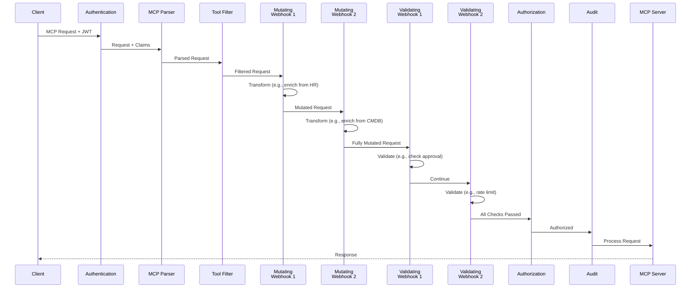

# RFC-0017: Dynamic Webhook Middleware for ToolHive

> **Note**: This was originally [THV-2300](https://github.com/stacklok/toolhive/pull/2300) in the toolhive repository.

- **Status**: Draft
- **Author(s)**: Juan Antonio Osorio (@JAORMX)
- **Created**: 2025-10-23
- **Last Updated**: 2025-10-23
- **Target Repository**: toolhive
- **Related Issues**: [toolhive#2300](https://github.com/stacklok/toolhive/pull/2300)

## Summary

This proposal introduces a dynamic webhook middleware system for ToolHive, inspired by Kubernetes' admission webhook pattern. The system enables external services to participate in the MCP request pipeline through two webhook types: **validating webhooks** (accept/deny requests) and **mutating webhooks** (transform requests). This provides a powerful extension mechanism that allows organizations to plug arbitrary systems into ToolHive's middleware chain without modifying ToolHive code.

## Problem Statement

ToolHive's current middleware architecture provides built-in middleware components (authentication, parsing, authorization, audit, etc.), but adding new functionality requires code changes to ToolHive itself. Organizations often need to:

- Integrate with external policy engines or decision systems
- Enrich requests with data from external sources (HR, CMDB, project databases)
- Log to enterprise SIEM systems with custom formats
- Apply business-specific validation rules beyond Cedar policies
- Transform requests based on organizational policies
- Integrate with ticketing or approval workflows
- Enforce rate limits using external state stores

Currently, these use cases require:
- Forking ToolHive and adding custom middleware
- Maintaining custom builds
- Complex deployment pipelines
- Difficulty upgrading to new ToolHive versions
- Duplicating organizational logic across systems

## Goals

- Enable external HTTP services to participate in MCP request processing
- Support both validation (accept/deny) and mutation (transform) use cases
- Support multiple webhook instances (multiple validating, multiple mutating)
- Maintain ToolHive's security and observability guarantees
- Follow HTTP best practices for webhook communication
- Provide clear failure mode semantics
- Integrate seamlessly with existing middleware chain
- Enable stateless, horizontally scalable architecture

## Non-Goals

- Real-time streaming or bidirectional communication (webhooks are request/response)
- Plugin systems (WASM, shared libraries, etc.)
- Message queue integration (async processing patterns)
- Built-in webhook server implementations (organizations provide their own)
- Webhook response caching (initial implementation; future enhancement)
- Circuit breaker patterns (initial implementation; future enhancement)

## Proposed Solution

Introduce two new middleware types that call external HTTP services during request processing:

1. **Validating Webhook Middleware**: Sends request metadata to external service for accept/deny decision
2. **Mutating Webhook Middleware**: Sends full request to external service for transformation

Both webhook types:
- Support multiple instances (multiple webhooks of each type can be configured)
- Operate as standard middleware in ToolHive's existing chain
- Can be configured alongside existing middleware like auth, authz, and audit
- Execute in configuration order when multiple webhooks are present

### High-Level Design



### Detailed Design

#### HTTP Protocol Design

**Design Decisions**:
- Use **POST** for both webhook types (standard HTTP method for data processing)
- Use **200 OK** with JSON body for decisions (avoid confusion between policy vs operational errors)
- Use **5xx** status codes for webhook operational errors (trigger failure policies)

**Validating Webhook Request** (POST to webhook URL):
```json
{
  "version": "v0.1.0",
  "uid": "unique-request-id-for-idempotency",
  "timestamp": "2025-10-23T10:30:00Z",
  "principal": {
    "sub": "user123",
    "email": "user@example.com",
    "name": "John Doe",
    "groups": ["engineering", "admins"],
    "claims": {
      "department": "platform",
      "role": "sre"
    }
  },
  "mcp_request": {
    "mcp_version": "2024-11-05",
    "method": "tools/call",
    "resource_id": "database_query",
    "arguments": {
      "query": "SELECT * FROM users",
      "database": "production"
    }
  },
  "context": {
    "server_name": "my-vmcp-instance",
    "backend_server": "postgres-mcp",
    "namespace": "production",
    "source_ip": "192.0.2.1",
    "transport": "sse"
  }
}
```

> **Context Fields**:
> - `server_name`: The ToolHive/vMCP instance name handling the request
> - `backend_server`: (Optional) The actual MCP server being proxied, when using vMCP
> - `namespace`: Kubernetes namespace (if applicable)
> - `source_ip`: Client IP address
> - `transport`: Connection transport type (sse, stdio, etc.)

**Validating Webhook Response** (200 OK with JSON body):
```json
{
  "version": "v0.1.0",
  "uid": "unique-request-id-for-idempotency",
  "allowed": true
}
```

**Validating Webhook Response (Denied)**:
```json
{
  "version": "v0.1.0",
  "uid": "unique-request-id-for-idempotency",
  "allowed": false,
  "code": 403,
  "message": "Production writes require approval",
  "reason": "RequiresApproval",
  "details": {
    "ticket_url": "https://tickets.example.com/PROD-1234",
    "instructions": "Please request approval from security-team"
  }
}
```

**Mutating Webhook Request** (POST to webhook URL):
```json
{
  "version": "v0.1.0",
  "uid": "unique-request-id-for-idempotency",
  "timestamp": "2025-10-23T10:30:00Z",
  "principal": {
    "sub": "user123",
    "email": "user@example.com",
    "name": "John Doe",
    "groups": ["engineering"]
  },
  "mcp_request": {
    "mcp_version": "2024-11-05",
    "jsonrpc": "2.0",
    "id": 1,
    "method": "tools/call",
    "params": {
      "name": "database_query",
      "arguments": {
        "query": "SELECT * FROM users",
        "database": "production"
      }
    }
  },
  "context": {
    "server_name": "my-vmcp-instance",
    "backend_server": "postgres-mcp",
    "namespace": "production",
    "source_ip": "192.0.2.1",
    "transport": "sse"
  }
}
```

**Mutating Webhook Response (JSONPatch)**:
```json
{
  "version": "v0.1.0",
  "uid": "unique-request-id-for-idempotency",
  "allowed": true,
  "patch_type": "json_patch",
  "patch": [
    {
      "op": "add",
      "path": "/mcp_request/params/arguments/audit_user",
      "value": "user@example.com"
    },
    {
      "op": "add",
      "path": "/mcp_request/params/arguments/department",
      "value": "engineering"
    }
  ]
}
```

> **Note**: Mutation patches are scoped to the `mcp_request` container. This prevents accidental or malicious modification of `principal`, `context`, or other immutable fields.

#### Failure Modes

Each webhook is configured with a failure policy:

- **`failure_policy: "fail"`** (Fail-Closed): Deny request on webhook error
  - Recommended for security-critical validating webhooks
  - Ensures policies are always enforced
  - Risk: availability impact if webhook is down

- **`failure_policy: "ignore"`** (Fail-Open): Allow request on webhook error
  - Recommended for non-critical webhooks and mutating webhooks
  - Maintains availability when webhook is unavailable
  - Risk: policy bypass during outages

| Scenario | Validating (fail) | Validating (ignore) | Mutating (fail) | Mutating (ignore) |
|----------|-------------------|---------------------|-----------------|-------------------|
| Network error | Deny (403) | Allow | Deny (500) | Use original |
| Timeout (408) | Deny (403) | Allow | Deny (500) | Use original |
| Webhook 5xx | Deny (403) | Allow | Deny (500) | Use original |
| Invalid JSON response | Deny (403) | Allow | Deny (500) | Use original |
| 200 {allowed: false} | Deny (403) | N/A | N/A | N/A |
| 422 | N/A | N/A | Deny (422) | Deny (422) |

#### Middleware Ordering

Webhooks are inserted at specific points in the existing middleware chain:

1. **Authentication Middleware** - Validates JWT tokens, extracts claims
2. **Token Exchange Middleware** (optional) - Exchanges tokens
3. **MCP Parser Middleware** - Parses JSON-RPC requests
4. **Tool Filter Middleware** (optional) - Filters available tools
5. **Mutating Webhook Middleware** (if configured, multiple in order) - Transforms requests
6. **Validating Webhook Middleware** (if configured, multiple in order) - Validates requests
7. **Telemetry Middleware** (optional) - OpenTelemetry instrumentation
8. **Authorization Middleware** (optional) - Cedar policy evaluation
9. **Audit Middleware** (optional) - Request logging

#### Configuration Changes

**RunConfig Configuration**:

```yaml
# Validating webhooks (multiple supported)
validating_webhooks:
  - name: external-policy
    url: https://policy.company.com/validate
    failure_policy: fail  # or "ignore"
    timeout: 5s
    signing_secret_ref:
      name: webhook-signing-secret
      key: hmac-key
    ca_bundle: |
      -----BEGIN CERTIFICATE-----
      ...
      -----END CERTIFICATE-----

  - name: rate-limiter
    url: https://ratelimit.company.com/check
    failure_policy: ignore
    timeout: 2s

# Mutating webhooks (multiple supported)
mutating_webhooks:
  - name: hr-enrichment
    url: https://hr-api.company.com/enrich
    failure_policy: ignore
    timeout: 3s

  - name: cmdb-enrichment
    url: https://cmdb-api.company.com/enrich
    failure_policy: ignore
    timeout: 3s
    client_cert: /path/to/cert.pem
    client_key: /path/to/key.pem
```

**CLI Configuration**:

```bash
# Single webhook
thv run postgres-mcp \
  --webhook-config external-policy-webhook.yaml

# Multiple webhooks
thv run postgres-mcp \
  --webhook-config external-policy-webhook.yaml \
  --webhook-config hr-enrichment-webhook.yaml \
  --webhook-config rate-limiter-webhook.yaml
```

**Kubernetes Configuration (MCPWebhookConfig CRD)**:

```yaml
apiVersion: toolhive.stacklok.dev/v1alpha1
kind: MCPWebhookConfig
metadata:
  name: company-policy-webhook
  namespace: mcp-servers
spec:
  type: validating  # or "mutating"
  url: https://policy.company.com/validate
  failure_policy: fail  # or "ignore"
  timeout: 5s
  signing_secret_ref:
    secret_name: webhook-signing-secret
    key: hmac-key
  client_cert_ref:
    secret_name: webhook-mtls-cert
    cert_key: tls.crt
    key_key: tls.key
  ca_bundle: |
    -----BEGIN CERTIFICATE-----
    ...
    -----END CERTIFICATE-----
```

## Security Considerations

### Threat Model

Webhook requests contain sensitive information:
- User identity (JWT claims: email, name, groups)
- MCP request parameters (may contain sensitive data, secrets, queries)
- System metadata (server names, namespaces, source IPs)

**Threats**:
- Information disclosure to unauthorized webhook endpoints
- Denial of service via slow or unavailable webhooks
- Trust boundary violations if webhook servers are compromised

### Authentication and Authorization

**Webhook Server Authentication**:
- **TLS/HTTPS**: Required for all webhook endpoints
- **mTLS**: Optional client certificates for mutual authentication
- **Bearer Token**: ToolHive can send bearer token in `Authorization` header

**Payload Signing (Recommended)**:
- ToolHive can sign webhook payloads using HMAC-SHA256
- Signature sent in `X-ToolHive-Signature` header
- Webhooks should verify signatures to ensure payload integrity
- Shared secret configured per-webhook via secret reference

Example headers:
```
X-ToolHive-Signature: sha256=abc123...
X-ToolHive-Timestamp: 1698057000
```

> **Note**: While mTLS authenticates the connection, payload signing provides defense-in-depth by proving the payload originated from ToolHive and wasn't tampered with. This is especially important if webhook endpoints are reachable by other internal services.

**ToolHive Authorization**:
- Webhooks run after authentication middleware (principal is validated)
- Webhooks access validated JWT claims for policy decisions
- Webhook configuration requires appropriate privileges

### Data Security

**Mitigations**:
- TLS encryption required for all webhook traffic
- Certificate validation for webhook server identity
- Audit webhook access and responses
- Limit webhook endpoints to trusted systems via network policies
- Document security requirements for webhook server operators

### Input Validation

- Webhook responses validated against expected schema
- HTTP response size limits (1MB max)
- Configurable timeouts per webhook (default: 10s, max: 30s)

### Secrets Management

- Client certificates stored securely (file paths or Kubernetes secrets)
- CA bundles for custom certificate authorities
- Bearer tokens via environment variables or secret references

### Audit and Logging

Log webhook invocations to ToolHive audit log:

```json
{
  "type": "webhook_invocation",
  "logged_at": "2025-10-23T10:30:00Z",
  "outcome": "denied",
  "component": "toolhive-webhook",
  "webhook": {
    "name": "external-policy",
    "type": "validating",
    "url": "https://policy.company.com/validate",
    "duration_ms": 150,
    "status_code": 200
  },
  "request": {
    "uid": "unique-request-id",
    "principal": "user@example.com",
    "method": "tools/call",
    "resource_id": "database_query"
  },
  "response": {
    "allowed": false,
    "reason": "RequiresApproval"
  }
}
```

### Mitigations

- Connection pooling and reuse
- Failure policies to handle unavailability
- Defense in depth: use multiple layers (webhooks + Cedar authz + audit)
- Monitor webhook behavior for anomalies

## Alternatives Considered

### Alternative 1: WASM Plugin System

- **Pros**: No network latency, sandboxed execution
- **Cons**: Complex runtime, limited language support, harder to debug
- **Why not chosen**: Higher complexity, webhooks are more universally accessible

### Alternative 2: gRPC-based Webhooks

- **Pros**: Efficient binary protocol, strong typing
- **Cons**: Requires protobuf tooling, less accessible
- **Why not chosen**: HTTP/JSON is more universally accessible and debuggable

### Alternative 3: Message Queue Integration

- **Pros**: Async processing, better handling of slow consumers
- **Cons**: Eventual consistency, complex infrastructure
- **Why not chosen**: Synchronous validation required for request pipeline

## Compatibility

### Backward Compatibility

- Webhooks are opt-in; existing deployments unaffected
- No changes to existing middleware configuration
- Gradual adoption possible

### Forward Compatibility

- Versioned protocol (`version: v0.1.0`) enables protocol evolution
- UID field enables idempotency and future features
- Extensible request/response structures

## Implementation Plan

### Phase 1: Core Implementation (MVP)
- Implement webhook middleware interfaces (`pkg/webhooks/`)
- Validating webhook support with fail-closed/fail-open
- Mutating webhook support with JSONPatch
- Multiple webhook instances support
- Optional HMAC payload signing (`X-ToolHive-Signature` header)
- CLI flags for webhook configuration
- RunConfig webhook fields
- Basic metrics and audit logging
- Documentation and examples

### Phase 2: Kubernetes Integration
- Implement MCPWebhookConfig CRD
- Add webhook_config_refs to MCPServer CRD
- Operator controller updates
- E2E tests for Kubernetes deployments

### Phase 3: Advanced Features
- Request field filtering (security)
- Full request mutation support
- Circuit breaker pattern
- Enhanced metrics and dashboards
- Webhook SDK/library for webhook authors

### Phase 4: Ecosystem and Examples
- Example webhook implementations (Go, Python, Node.js)
- Integration guides (OPA, custom policy engines, SIEMs)
- Performance benchmarking
- Best practices documentation

## Testing Strategy

- **Unit tests**: Webhook middleware, HTTP client, response parsing
- **Integration tests**: End-to-end webhook flows, failure scenarios
- **E2E tests**: Full middleware chain with webhooks
- **Performance tests**: Latency impact, connection pooling
- **Security tests**: TLS validation, timeout handling

## Documentation

- **User Documentation**:
  - Webhook concepts guide
  - Configuration guide (CLI, RunConfig, Kubernetes)
  - Writing webhook servers
  - Integration guides (OPA, SIEMs)
  - Troubleshooting

- **Developer Documentation**:
  - Webhook API specification
  - Architecture documentation
  - Example implementations

## Open Questions

1. Should we support webhook response caching in the initial implementation?
2. What should be the default timeout values?
3. Should conditional webhooks (filter by request type) be in MVP or Phase 3?

## References

- [Kubernetes Admission Webhooks](https://kubernetes.io/docs/reference/access-authn-authz/extensible-admission-controllers/)
- [Open Policy Agent](https://www.openpolicyagent.org/)
- [Envoy External Authorization](https://www.envoyproxy.io/docs/envoy/latest/api-v3/service/auth/v3/external_auth.proto)
- [JSON Patch (RFC 6902)](https://datatracker.ietf.org/doc/html/rfc6902)

---

## RFC Lifecycle

### Review History

| Date | Reviewer | Decision | Notes |
|------|----------|----------|-------|
| 2025-10-23 | - | Draft | Ported from toolhive PR #2300 |

### Implementation Tracking

| Repository | PR | Status |
|------------|-----|--------|
| toolhive | - | Pending |
