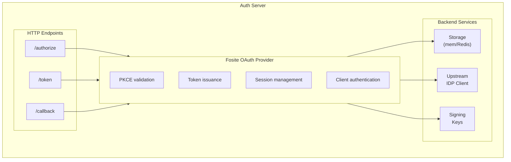
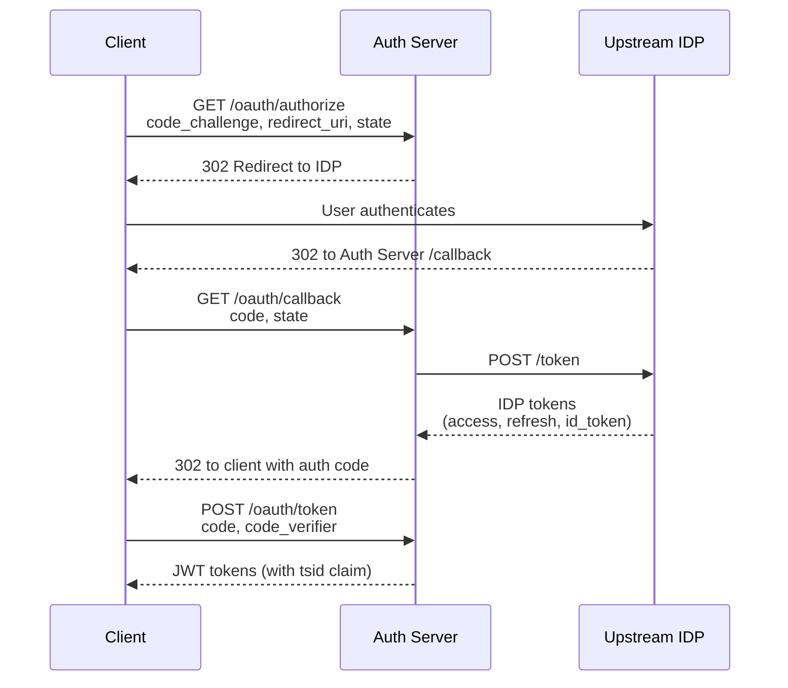

# OAuth Authorization Server Design

This document covers the implementation of the ToolHive OAuth Authorization
Server. A separate design document covers the overall backend authentication
approach and rationale.

## Problem Statement

MCP servers need to authenticate users and obtain their upstream identity for API access. The auth server must implement OAuth 2.0 flows, integrate with upstream IDPs, issue JWTs, and manage sessions with upstream tokens for later retrieval by vMCP.

## Goals

- Implement OAuth 2.0 Authorization Code Flow with PKCE (RFC 7636)
- Integrate with upstream OIDC Identity Providers
- Issue signed JWTs for authenticated sessions
- Provide dynamic client registration (RFC 7591)
- Expose OIDC discovery and JWKS endpoints
- Abstract storage for horizontal scaling (with practical implementations being in-memory or Redis)

## Non-Goals

- Full OIDC Provider certification (we implement the subset needed for MCP use case)

## Architecture Overview

The auth server is built on Fosite, a mature OAuth 2.0/OIDC library, with
custom handlers for upstream IDP integration and session management.



## Detailed Design

### 1. OAuth 2.0 Endpoints

The auth server exposes standard OAuth 2.0 and OIDC endpoints for client interaction and token management.

| Endpoint | Method | Description |
|----------|--------|-------------|
| `/oauth/authorize` | GET | Authorization endpoint - initiates flow, generates PKCE challenge |
| `/oauth/callback` | GET | Callback from upstream IDP - exchanges upstream code for tokens |
| `/oauth/token` | POST | Token endpoint - exchanges authorization code for access/refresh tokens |
| `/oauth/register` | POST | Dynamic client registration (RFC 7591) |
| `/.well-known/openid-configuration` | GET | OIDC discovery document |
| `/.well-known/jwks.json` | GET | JSON Web Key Set for token validation |

### 2. Authorization Code Flow with PKCE

All authorization flows require PKCE (S256 method) for security. The flow begins when a client redirects to `/oauth/authorize` with a code challenge.



### 3. Upstream IDP Integration

The auth server acts as a client to upstream identity providers such as Google, GitHub, and others. It fetches the IDP's discovery document, constructs authorization URLs, and exchanges codes for tokens. Each IDP is configured with an issuer URL, client ID, client secret, and requested scopes. When the user authenticates, the auth server receives the access token, refresh token, and ID token from the upstream IDP and stores them for later retrieval by vMCP or backend MCP servers.

Upstream ID tokens must be cryptographically verified before trusting their claims. The auth server fetches and caches the upstream IDP's JWKS, retrieved from the `jwks_uri` specified in the IDP's discovery document. The standard OIDC claims (`iss`, `aud`, `exp`, `iat`, `nonce`) are validated according to the OIDC specification to ensure token integrity and prevent replay attacks.

### 4. JWT Token Issuance

The auth server issues its own JWTs for client authentication. Clients present
these JWTs to ToolHive, which validates them and uses the `tsid` claim to
retrieve stored upstream IDP tokens.

**Token claims:**
```json
{
  "iss": "https://auth.toolhive.example.com",
  "sub": "user@example.com",
  "aud": "mcp-server",
  "exp": 1234567890,
  "iat": 1234567890,
  "tsid": "session-uuid-here"
}
```

JWTs are signed using ECDSA (ES256, preferred) or RSA (RS256) keys. The algorithm is auto-derived from the key type. ES256 is recommended for new deployments due to smaller signatures and faster operations; RS256 is supported for OIDC compliance per [Section 15.1](https://openid.net/specs/openid-connect-core-1_0.html#ServerMTI). Public keys are exposed via the JWKS endpoint for verification, with the OIDC discovery document dynamically advertising the configured algorithm.

### 5. Session Management

Sessions store the complete authentication state including upstream IDP tokens. The `tsid` (token session ID) in issued JWTs references these sessions.

The session data includes:
- User subject and claims from upstream ID token
- Client ID and redirect URI
- Upstream access token, refresh token, ID token
- Token expiration timestamps
- Refresh token family ID for rotation tracking

### 6. Refresh Token Rotation

Refresh tokens are rotated on each use to detect token replay attacks. When a refresh token is used, a new one is issued and the old one is invalidated. All refresh tokens in a session share a family ID, allowing the auth server to detect replay attempts—if an old refresh token is reused, the entire family is revoked, invalidating all tokens in that session. When a client refreshes its tokens, the auth server also refreshes the upstream IDP tokens if they have expired.

### 7. Token Revocation (RFC 7009) - Future

The `/oauth/revoke` endpoint will accept both access and refresh tokens and invalidate them. Revoking a refresh token cascades to invalidate all related access tokens. Optionally, revocation can also cascade to delete the stored upstream IDP tokens associated with the session.

### 8. Dynamic Client Registration (RFC 7591)

Clients can register dynamically via POST to `/oauth/register`. This returns a client ID and optional client secret.

**Registration metadata:**
- `redirect_uris`: Allowed callback URLs
- `grant_types`: Supported grant types (default: `authorization_code`, `refresh_token`)
- `response_types`: Supported response types (default: `code`)
- `client_name`: Human-readable name

### 9. Storage Abstraction

Storage is abstracted behind interfaces to support different backends. In-memory storage is suitable for development; Redis is required for production multi-replica deployments.

**Storage interfaces:**
- `AuthorizationCodeStorage`: Stores authorization codes with PKCE verifiers
- `AccessTokenStorage`: Stores access token metadata
- `RefreshTokenStorage`: Stores refresh tokens with family tracking
- `SessionStorage`: Stores complete session state including IDP tokens
- `ClientStorage`: Stores registered client configurations

## Integration

The auth server is implemented as `pkg/authserver` and can be embedded into `thv` or run standalone.

**Embedded Mode** (MVP): The auth server exposes an `http.Handler` that serves all OAuth/OIDC endpoints. This handler is mounted in the `thv` HTTP server under `/oauth/`.

**Standalone Mode** (future): The auth server can run as a separate service with its own HTTP server.

## Data Model

### Session

```go
type Session struct {
    ID              string
    Subject         string
    ClientID        string
    IDPAccessToken  string
    IDPRefreshToken string
    IDPIDToken      string
    IDPTokenExpiry  time.Time
    RefreshFamily   string
    CreatedAt       time.Time
    ExpiresAt       time.Time
}
```

### Client

```go
type Client struct {
    ID            string
    SecretHash    []byte
    RedirectURIs  []string
    GrantTypes    []string
    ResponseTypes []string
    Metadata      map[string]string
}
```

## Security Considerations

- **PKCE required**: No implicit flow; all authorization requests must include PKCE
- **State validation**: CSRF protection via state parameter
- **ID token verification**: Upstream ID tokens verified against JWKS before trusting
- **Nonce validation**: Replay protection for ID tokens
- **Secret management**: Signing keys and client secrets stored securely
- **Rate limiting**: Authentication endpoints protected against brute force

## Configuration Example

```yaml
auth_server:
  issuer: "https://auth.toolhive.example.com"

  upstream_idp:
    issuer: "https://accounts.google.com"
    client_id: "your-client-id"
    client_secret_env: "IDP_CLIENT_SECRET"
    scopes: ["openid", "profile", "email"]

  signing:
    # Optional: if omitted, a key is auto-generated and persisted to storage
    key_file: "/etc/toolhive/signing-key.pem"
    # Optional: auto-derived from key type (ES256 for EC, RS256 for RSA)
    algorithm: "ES256"

  storage:
    type: "redis"  # or "memory"
    redis:
      address: "redis:6379"

  tokens:
    access_token_lifetime: "1h"
    refresh_token_lifetime: "24h"
    authorization_code_lifetime: "10m"
```