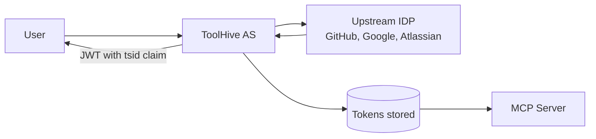
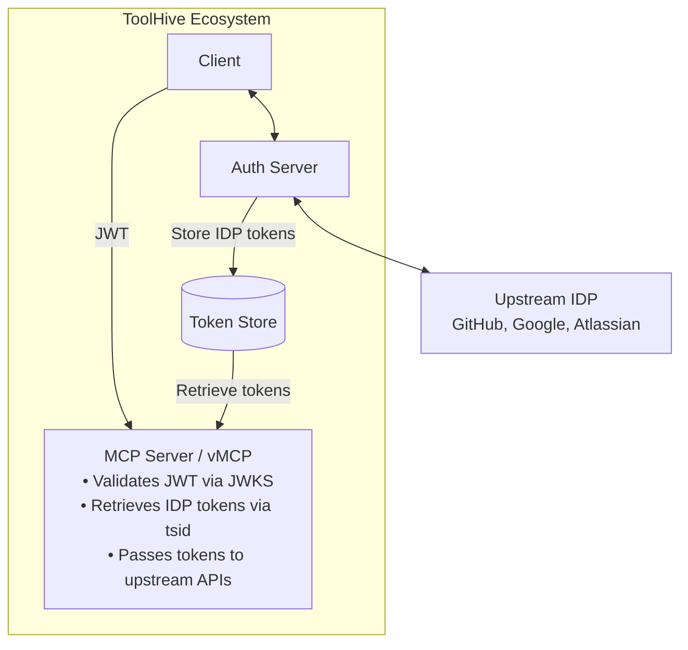

# OAuth Authorization Server for ToolHive - Overview

## Problem Statement

ToolHive MCP servers need to authenticate users via OAuth/OIDC and obtain
their upstream identity for API access. Users authenticate with upstream
Identity Providers (Google, GitHub, Atlassian, etc.) and MCP servers need to
call those upstream APIs on behalf of users.

Currently, there is no implemented way to handle user authentication to
upstream IDPs or upstream IDP token pass-through across MCP servers and vMCP.

## Why an Authorization Server?

### The Redirect URI and Client ID/Client Secret Problem

OAuth 2.0 requires pre-registered redirect URIs at each Identity Provider. Moreover
many IDPs (Google, GitHub, etc.) require manual registration of OAuth clients in order
to obtain Client ID and Client Secret.

If each user client (e.g. an IDE) were its own OAuth client, the registration
burden would be too high. Moreover, each client comes with its own redirect URI.

### How a Centralized AS Solves This

With ToolHive's Authorization Server:

### Dynamic Client Registration (RFC 7591)

MCP clients can **self-register** with ToolHive's AS via Dynamic Client Registration. This
enables self-service onboarding of clients without admin intervention.

**Note**: DCR works for clients → ToolHive AS, but not for ToolHive → upstream
IDPs (Google, GitHub, etc. require manual OAuth client registration).

**Future Enhancement**: The MCP 2025-11-25 specification recommends Client ID
Metadata Documents as the preferred client registration method over DCR. In this
approach, clients use HTTPS URLs as client identifiers (e.g.,
`https://app.example.com/oauth/client-metadata.json`) that the authorization
server fetches and validates dynamically. We will implement DCR first for the
MVP, then migrate to Client ID Metadata Documents in a later phase to align with
the MCP specification's recommended priority order.

## Use Cases

### Google Docs MCP Server
> As a user, I want to authenticate to a Google Docs MCP server and only be able to access my own documents. The MCP server should effectively impersonate me when calling Google APIs.

### GitHub MCP Server
> As a developer, I want to authenticate to a GitHub MCP server so I can create PRs, manage issues, and access repositories using my own GitHub identity and permissions.

### Multi-Backend Workflow (vMCP)
> As a platform engineer, I want to deploy vMCP so that users authenticate once and vMCP retrieves their upstream IDP tokens to pass through to multiple backend MCP servers (GitHub, Jira, Slack).

## Backend Authentication Approach

The MCP authorization spec covers authorization **to** the MCP server but not how MCP servers authenticate **to upstream services**. While RFC 8693 token exchange and federated IDPs (e.g., Google Workforce Identity Federation) work when the upstream service is in the same trust domain, many MCP servers need to access external services like GitHub, Google, or Atlassian APIs where no federation exists.

This design implements an **OAuth Authorization Server** that:
1. Authenticates users against the upstream IDP (GitHub, Google, Atlassian, etc.)
2. Stores the upstream IDP tokens
3. Issues its own JWT with a `tsid` claim linking to the stored tokens
4. Enables vMCP and MCP servers to retrieve and use the upstream tokens

**Note**: A future enhancement may add an internal company IDP hop before the external IDP, enabling enterprise identity linking. The current implementation goes directly to the external IDP.

## Goals

- Provide OAuth 2.0 for authentication to MCP servers
- Integrate with upstream OIDC Identity Providers (Google, GitHub, Atlassian, Okta, Azure AD)
- Issue signed JWTs to clients
- Integrate with Kubernetes operator via CRDs
- Enable vMCP to retrieve and pass through upstream IDP tokens
- Support Dynamic Client Registration (RFC 7591) for MCP clients
- Support both embedded and centralized deployment modes, starting with embedded

## Non-Goals

- Full OIDC Provider certification
- Acting as a general-purpose OAuth server for non-MCP use cases

## Architecture Overview

The auth server acts as an intermediary between clients and upstream IDPs, issuing its own JWTs while storing upstream tokens for later retrieval.

## Token Flow Summary

1. **Client initiates OAuth flow** - Client redirects to auth server's `/oauth/authorize` with PKCE challenge
2. **Upstream IDP authentication** - Auth server redirects to upstream IDP (GitHub, Google, etc.); user authenticates
3. **Callback and token exchange** - Auth server receives callback, exchanges code with upstream IDP
4. **JWT issuance** - Auth server issues its own JWT with `tsid` claim linking to stored IDP tokens
5. **MCP server access** - Client presents JWT to MCP server; server validates via JWKS
6. **vMCP token pass-through** - vMCP extracts `tsid`, retrieves IDP tokens, passes to backend APIs

## Deployment Modes

In the interest of ease of installation and operation, we will initially
support an embedded deployment mode where the auth server runs in the same process
as the MCP server proxy. This mode is suitable for simple MCP server deployments.

However, in the interest of scalability and security, we'll move to a centralized
or distributed deployment mode where a standalone auth server services multiple MCP
servers. This will allow for better separation of concerns and allow to secure the AS better
as well as scale it independently.

## Implementation Steps

| Step                                         | Scope                                                    |
|----------------------------------------------|----------------------------------------------------------|
| **1: MVP**                                   | Core OAuth flow, in-memory storage, K8s integration, DCR |
| **2: Persistence & Security**                | Redis storage, refresh token utilization rotation        |
| **3: vMCP Support**                          | Token pass-through middleware, session lookup            |
| **4: Productization and operationalization** | Rate limiting, Observability, Auditing                   |
| **5: Centralized Deployment**                | Standalone mode, multi-replica support                   |
