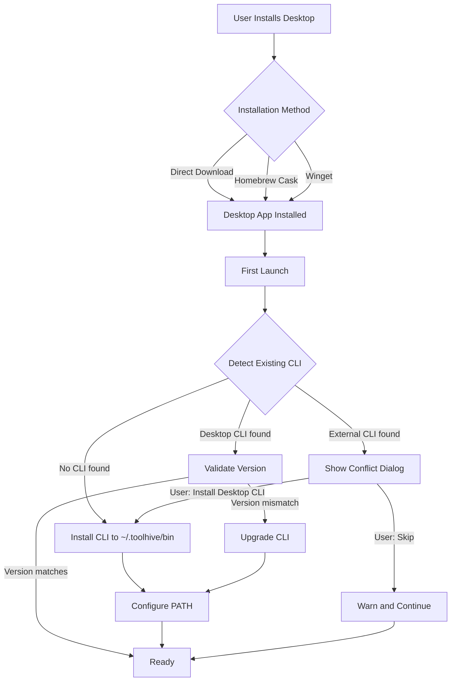
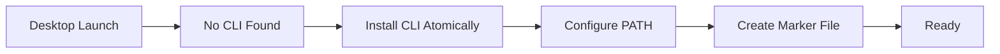

# RFC-0019: CLI and Desktop App Version Alignment

- **Status**: Draft
- **Author(s)**: @samuv
- **Created**: 2025-01-12
- **Last Updated**: 2025-01-12
- **Target Repository**: multiple (toolhive, toolhive-studio)
- **Related Issues**: [toolhive-studio#1399](https://github.com/stacklok/toolhive-studio/issues/1399)

## Summary

This RFC establishes version alignment between ToolHive CLI and ToolHive Studio (Desktop app). Because Desktop's UI is a 1:1 reflection of the `thv serve` API (currently in alpha with breaking changes expected), Desktop requires an exact CLI version for compatibility. The solution: Desktop takes ownership of CLI installation regardless of how Desktop itself was installed, ensuring version alignment while providing familiar installation methods.

## Problem Statement

### Current Behavior

- ToolHive Studio embeds a CLI binary in its application bundle
- Desktop communicates with CLI via `thv serve` (local API server)
- The `thv serve` API is in alpha; breaking changes are not guaranteed to be backward-compatible
- Desktop's UI is tightly coupled (1:1) to the API surface
- Users can independently install CLI via Homebrew, direct download, or `go install`
- Both products share the same config directory (`~/Library/Application Support/toolhive/` on macOS)
- No coordination exists between the two installations

### Who Is Affected

- **Desktop users** who want CLI access in terminal
- **CLI users** who later install Desktop
- **Users of both** who face version conflicts and API/config issues
- **Support team** debugging cross-product issues

### Why Exact Version Pinning Is Required

ToolHive's constraints are:

| Factor | ToolHive | Docker |
|--------|----------|--------|
| API stability | Alpha, breaking changes expected | Stable, backward-compatible |
| UI coupling | 1:1 reflection of API | Independent products |
| Version negotiation | None | Built-in |
| Mismatch impact | UI breaks, API errors | Graceful degradation |

Exact version pinning is necessary until:
1. The `thv serve` API exits alpha
2. A formal backward-compatibility policy is established and documented
3. API version negotiation is implemented (allowing Desktop to work with a range of CLI versions)

Even after alpha, this infrastructure remains valuable — it provides the foundation for controlled rollouts, ensures users have a working CLI, and can be relaxed to allow version ranges once compatibility guarantees exist.

### Core Conflict Scenarios

| Scenario | Problem |
|----------|---------|
| Homebrew CLI v0.6.0 exists, Desktop (bundles v0.5.1) installed | API mismatch, Desktop UI may break |
| Desktop installed first, user installs Homebrew CLI v0.6.0 | Newer CLI may expose API Desktop can't handle |
| User runs `thv` in terminal | Which binary executes? Does it match Desktop's expectations? |
| User upgrades Homebrew CLI after Desktop installed | PATH shadowing may confuse user |

### Lessons from Docker Desktop

Docker Desktop faces similar challenges with its CLI/Desktop relationship. Their experience informs our approach:

#### What Docker Does

- **Separate packages:** `brew install docker` (CLI formula) vs `brew install --cask docker-desktop` (Desktop cask)
- **CLI location changed:** Docker Desktop now installs CLI to `$HOME/.docker/bin` (user space) by default
- **PATH not auto-configured:** Users must manually add to PATH or enable "System" mode (requires admin)
- **Hard conflicts:** Installing both formula and cask causes file conflicts and installation failures
- **`conflicts_with formula:` is useless:** Homebrew deprecated this cask directive — it never actually worked

#### Why Our Approach Is Better

| Problem | Docker's Experience | ToolHive Solution |
|---------|---------------------|-------------------|
| Name confusion | Same name (`docker`) for formula and cask causes issues | Distinct names: `toolhive` (CLI) and `toolhive-studio` (Desktop) |
| Installation conflicts | Hard failures when both installed | Shadow in PATH, no file conflicts |
| CLI availability | Not in PATH by default after Desktop install | Auto-configure PATH on first launch |
| User choice complexity | "System" vs "User" mode selection | Single user-space approach, no elevation needed |
| Version alignment | API negotiation handles mismatches | Exact version required (Alpha API), Desktop manages CLI |

#### Key Insight

Docker can tolerate version mismatches because their API is stable with built-in negotiation. ToolHive cannot — yet. The `thv serve` API is in alpha with breaking changes expected, and no backward-compatibility policy exists. This justifies our stricter version control approach.

**Important:** This infrastructure is needed regardless of alpha status. Even with a stable API, we need:
- A mechanism to install CLI for Desktop users (this RFC)
- A backward-compatibility policy (separate effort)
- API version negotiation (future enhancement)

This RFC builds the foundation. Once compatibility guarantees exist, we can relax from "exact version" to "minimum version" constraints.

## Goals

- Establish clear ownership model: Desktop owns CLI when Desktop is installed
- Guarantee version alignment between Desktop and terminal CLI
- Prevent API/config incompatibilities from version mismatches
- Provide seamless terminal CLI access for Desktop users
- Support familiar installation methods (Homebrew, Winget, direct download)
- Minimize user confusion about which CLI version is active
- Enable recovery from corrupted or missing CLI installations

## Non-Goals

- Forcing CLI-only users to install Desktop
- Supporting arbitrary combinations of CLI and Desktop versions
- Building a full version manager (nvm-style)
- Enterprise/centralized deployment (future RFC)
- Linux package managers (apt, dnf) — future consideration
- API version negotiation (future consideration, requires backward-compatibility policy first)

## Proposed Solution

**Desktop Owns CLI Installation** — regardless of how Desktop was installed.

### Design Principles

1. **Desktop always uses its bundled CLI version** internally and installs that same version for terminal access
2. **Desktop never modifies external installations** (Homebrew, manual) directly, but shadows them in PATH
3. **CLI binary is bundled** inside Desktop app — no network required for installation
4. **Atomic upgrades** prevent corruption during version changes
5. **Validation on every launch** ensures CLI state is correct
6. **Clear user communication** about what's happening and why

### High-Level Design



**Key insight:** Package managers (Homebrew, Winget) distribute the Desktop app, but Desktop owns CLI installation regardless of how Desktop was installed. Package managers cannot guarantee exact versions, so Desktop must handle this itself.

## Detailed Design

### Component 1: CLI Detection and Validation

Desktop performs CLI detection **on every launch**, not just first launch.

#### Detection Locations

| Platform | Paths Checked (in order) |
|----------|--------------------------|
| macOS | `~/.toolhive/bin/thv`, `/opt/homebrew/bin/thv`, `/usr/local/bin/thv` |
| Linux | `~/.toolhive/bin/thv`, `~/.local/bin/thv`, `/usr/local/bin/thv` |
| Windows | `%LOCALAPPDATA%\ToolHive\bin\thv.exe`, `%ProgramFiles%\toolhive\thv.exe` |

#### Detection Information

For each found binary:
- Path to binary
- Version (`thv --version`)
- Checksum (SHA256)
- Source heuristic (Desktop marker, Homebrew path, manual)

#### Validation Logic (Every Launch)

```typescript
function onDesktopLaunch(): void {
    const marker = readMarkerFile();
    
    if (marker) {
        if (marker.source === "desktop") {
            const binary = checkBinary("~/.toolhive/bin/thv");
            if (!binary) {
                return reinstallCli();
            }
            if (binary.checksum !== marker.checksum) {
                return warnCorruption({ offerReinstall: true });
            }
            if (binary.version !== bundledVersion) {
                return upgradeCli();
            }
            return ready();
        } else {
            // Unexpected state, re-run detection
            return runDetection();
        }
    } else {
        return runFirstLaunchFlow();
    }
}
```

### Component 2: Installation Scenarios

#### Scenario A: Fresh Install (No Existing CLI)



**Actions:**
1. Copy bundled CLI to `~/.toolhive/bin/thv.new`
2. Verify checksum of copied binary
3. Atomic rename: `thv.new` → `thv`
4. Add `~/.toolhive/bin` to PATH via shell RC files
5. Create marker file with version and checksum

#### Scenario B: Existing Desktop-Managed CLI

Desktop detects marker file indicating it owns the CLI.

**If version matches:** Ready, no action needed.

**If version mismatch (Desktop upgraded):**
1. Copy new bundled CLI to `~/.toolhive/bin/thv.new`
2. Verify checksum
3. Atomic rename: `thv.new` → `thv`
4. Update marker file

#### Scenario C: Existing External CLI (Homebrew/Manual)

Desktop detects CLI at Homebrew or other external path, no Desktop marker.

**Dialog:**
```
┌─────────────────────────────────────────────────────────────────┐
│  Existing ToolHive CLI Detected                                 │
├─────────────────────────────────────────────────────────────────┤
│                                                                 │
│  Found: thv v0.6.0 at /opt/homebrew/bin/thv                     │
│  Desktop requires: v0.5.1 (exact version for API compatibility) │
│                                                                 │
│  The Desktop UI requires a specific CLI version because the     │
│  CLI API is in Alpha and versions are not interchangeable.      │
│                                                                 │
│  ┌─────────────────────────────────────────────────────────┐    │
│  │ ● Install Desktop CLI (recommended)                     │    │
│  │   Installs CLI v0.5.1 to ~/.toolhive/bin                │    │
│  │   This version will be used in your terminal            │    │
│  │   Your existing v0.6.0 remains at its current location  │    │
│  │                                                         │    │
│  │ ○ Skip CLI installation                                 │    │
│  │   Desktop will work using its internal CLI, but         │    │
│  │   terminal `thv` commands will use v0.6.0 which may     │    │
│  │   cause compatibility issues with Desktop's config      │    │
│  └─────────────────────────────────────────────────────────┘    │
│                                                                 │
│  [Continue]                                                     │
└─────────────────────────────────────────────────────────────────┘
```

**If user installs Desktop CLI:**
- CLI installed to `~/.toolhive/bin`
- PATH configured to prepend this directory
- External CLI remains but is shadowed

**If user skips:**
- Store "skipped" preference in marker file
- Show warning banner in Desktop (dismissible)
- Do not prompt again unless user requests from Settings

#### Scenario D: CLI Binary Missing (Was Deleted)

Desktop finds marker file but binary is missing.

**Action:** Reinstall CLI automatically, notify user:
```
"CLI was missing and has been reinstalled."
```

#### Scenario E: CLI Binary Corrupted

Desktop finds marker file, binary exists, but checksum doesn't match.

**Action:** Show warning, offer reinstall:
```
┌─────────────────────────────────────────────────────────────────┐
│  ⚠ CLI Installation Issue                                       │
├─────────────────────────────────────────────────────────────────┤
│                                                                 │
│  The CLI binary appears to be corrupted or was modified.        │
│                                                                 │
│  [Reinstall CLI]  [Continue Anyway]  [Open Settings]            │
└─────────────────────────────────────────────────────────────────┘
```

#### Scenario F: User Installs Homebrew CLI After Desktop

User has Desktop CLI installed, then runs `brew install toolhive`.

**On next Desktop launch:**
- Desktop detects both CLIs
- Desktop CLI still shadows Homebrew in PATH (no change)
- Settings panel shows: "Other CLI detected: v0.6.0 at /opt/homebrew/bin/thv (shadowed)"

**On user running `brew upgrade toolhive`:**
- Homebrew upgrades its copy
- Desktop CLI still shadows it
- User may be confused why `thv --version` shows old version

**Mitigation:** Settings panel explains PATH shadowing, links to documentation.

### Component 3: Marker File

**Location:** `~/.toolhive/.cli-source`

**Schema:**
```json
{
  "schema_version": 1,
  "source": "desktop",
  "cli_version": "0.5.1",
  "cli_checksum": "sha256:abc123...",
  "installed_at": "2025-01-09T10:30:00Z",
  "desktop_version": "1.2.0",
  "user_skipped": false,
  "skip_warning_dismissed": false
}
```

**Permissions:** `0600` (user read/write only)

### Component 4: PATH Configuration

**Installation location (no elevation required):**

| Platform | CLI Location | PATH Modification |
|----------|--------------|-------------------|
| macOS | `~/.toolhive/bin/thv` | Prepend to `.zshrc`, `.bashrc`, `.config/fish/config.fish` |
| Linux | `~/.toolhive/bin/thv` | Prepend to `.bashrc`, `.profile`, `.config/fish/config.fish` |
| Windows | `%LOCALAPPDATA%\ToolHive\bin\thv.exe` | Prepend to User PATH environment variable |

**Shell RC modifications:**

Bash/Zsh (`~/.bashrc`, `~/.zshrc`):
```bash
# Added by ToolHive Studio - do not modify this block
export PATH="$HOME/.toolhive/bin:$PATH"
# End ToolHive Studio
```

Fish (`~/.config/fish/config.fish`):
```fish
# Added by ToolHive Studio - do not modify this block
set -gx PATH $HOME/.toolhive/bin $PATH
# End ToolHive Studio
```

PowerShell (User PATH env var):
- Modified via Windows API, no RC file

**Why prepend:** To shadow any existing CLI installations when user chooses Desktop ownership.

### Component 5: Atomic CLI Installation/Upgrade

To prevent corruption from interrupted operations:

```typescript
async function installOrUpgradeCli(): Promise<void> {
    const tempPath = "~/.toolhive/bin/thv.new";
    const finalPath = "~/.toolhive/bin/thv";
    const backupPath = "~/.toolhive/bin/thv.old";
    
    // 1. Extract bundled CLI to temp path
    await extractBundledCli(tempPath);
    
    // 2. Verify checksum
    const isValid = await verifyChecksum(tempPath);
    if (!isValid) {
        await deleteFile(tempPath);
        showError("CLI verification failed");
        return;
    }
    
    // 3. Backup existing binary if present
    if (await fileExists(finalPath)) {
        await renameFile(finalPath, backupPath);
    }
    
    try {
        // 4. Atomic rename (POSIX)
        await renameFile(tempPath, finalPath);
        
        // 5. Cleanup backup
        if (await fileExists(backupPath)) {
            await deleteFile(backupPath);
        }
        
        // 6. Update marker file
        await updateMarkerFile();
    } catch (error) {
        // Restore backup on failure
        if (await fileExists(backupPath)) {
            await renameFile(backupPath, finalPath);
        }
        reportError(error);
    }
}
```

### Component 6: Settings Panel

```
┌─────────────────────────────────────────────────────────────────┐
│  Settings > CLI Management                                      │
├─────────────────────────────────────────────────────────────────┤
│                                                                 │
│  CLI Status                                                     │
│  ──────────────────────────────────────────────────────────     │
│                                                                 │
│  Desktop CLI:     ✓ Installed                                   │
│  Version:         0.5.1                                         │
│  Location:        ~/.toolhive/bin/thv                           │
│  Checksum:        ✓ Valid                                       │
│                                                                 │
│  ⚠ Other CLI detected:                                          │
│     v0.6.0 at /opt/homebrew/bin/thv (shadowed in PATH)          │
│     This version is not used when you run `thv` in terminal.    │
│     Learn more about PATH configuration →                       │
│                                                                 │
│  ──────────────────────────────────────────────────────────     │
│                                                                 │
│  PATH Status:     ✓ Configured correctly                        │
│  Active in:       zsh, bash                                     │
│                                                                 │
│  ──────────────────────────────────────────────────────────     │
│                                                                 │
│  Actions                                                        │
│  [Reinstall CLI]  [Remove CLI from PATH]  [Verify Installation] │
│                                                                 │
│  Troubleshooting                                                │
│  [View CLI Logs]  [Reset CLI Configuration]                     │
│                                                                 │
└─────────────────────────────────────────────────────────────────┘
```

### Component 7: Desktop Upgrade Behavior

| Current State | Desktop Action on Upgrade |
|---------------|---------------------------|
| Desktop CLI v0.5.1 installed | Upgrade CLI to new bundled version |
| CLI not installed (user skipped) | Prompt to install new version (once) |
| External CLI only (shadowed) | Upgrade Desktop CLI, external remains shadowed |
| CLI corrupted | Reinstall and notify user |

### Component 8: Desktop Uninstall Behavior

**Direct uninstall (manual or via Desktop UI):**
```
┌─────────────────────────────────────────────────────────────────┐
│  Uninstall ToolHive Studio                                      │
├─────────────────────────────────────────────────────────────────┤
│                                                                 │
│  Desktop installed CLI v0.5.1 to your system.                   │
│                                                                 │
│  ○ Keep CLI installed                                           │
│    CLI remains at ~/.toolhive/bin/thv                           │
│    You can continue using it or reinstall Desktop later         │
│                                                                 │
│  ○ Remove CLI                                                   │
│    Removes CLI binary and PATH configuration                    │
│    Config files in ~/.toolhive are preserved                    │
│                                                                 │
│  [Uninstall]  [Cancel]                                          │
└─────────────────────────────────────────────────────────────────┘
```

**Homebrew/Winget uninstall:**
- `brew uninstall --cask toolhive-studio` removes Desktop only
- CLI at `~/.toolhive/bin` remains (not managed by Homebrew)
- User can remove manually: `rm ~/.toolhive/bin/thv`

### Component 9: Package Manager Configuration

#### Naming Strategy

| Package | Type | Name | Rationale |
|---------|------|------|-----------|
| CLI | Homebrew Formula | `toolhive` | Short, memorable for CLI users |
| Desktop | Homebrew Cask | `toolhive-studio` | Distinct from CLI, matches app name |
| Desktop | Winget | `Stacklok.ToolHiveStudio` | Standard Winget naming convention |

**Why distinct names matter:** Docker uses `docker` for both its CLI formula and Desktop cask (now `docker-desktop`), which historically caused significant user confusion and installation failures. By using distinct names from the start, we avoid this entirely.

#### Homebrew Limitations

**`conflicts_with formula:` does not work.** Homebrew deprecated this cask directive because it was never functional. We cannot declare that `toolhive-studio` cask conflicts with `toolhive` formula at the package manager level. Instead, Desktop handles conflicts via runtime detection and user dialog.

#### Homebrew Cask (No CLI Dependency)

```ruby
cask "toolhive-studio" do
  version "1.2.0"
  sha256 "abc123def456..."

  url "https://github.com/stacklok/toolhive-studio/releases/download/v#{version}/ToolHive-Studio-#{version}-mac-universal.dmg"
  name "ToolHive Studio"
  desc "Desktop application for managing MCP servers"
  homepage "https://toolhive.dev/"

  # NO depends_on formula - Desktop manages CLI installation
  # Package managers cannot guarantee exact versions
  
  depends_on macos: ">= :monterey"

  app "ToolHive Studio.app"

  zap trash: [
    "~/Library/Application Support/toolhive-studio",
    "~/Library/Preferences/dev.toolhive.studio.plist",
    "~/Library/Caches/dev.toolhive.studio",
  ]
  
  # Note: ~/.toolhive is intentionally NOT in zap to preserve user config

  caveats <<~EOS
    ToolHive Studio manages its own CLI installation for version compatibility.
    
    On first launch, Desktop will install the CLI to ~/.toolhive/bin and
    configure your PATH automatically.
    
    If you have the CLI installed via `brew install toolhive`, Desktop's
    version will take precedence in your PATH. Your Homebrew installation
    remains unchanged but will be shadowed.
    
    To use only the Homebrew CLI, you can skip Desktop's CLI installation
    during first launch, but this may cause compatibility issues.
  EOS
end
```

#### Winget Manifest (No CLI Dependency)

```yaml
PackageIdentifier: Stacklok.ToolHiveStudio
PackageVersion: 1.2.0
PackageLocale: en-US
Publisher: Stacklok
PublisherUrl: https://stacklok.com
PackageName: ToolHive Studio
PackageUrl: https://toolhive.dev
License: Apache-2.0
ShortDescription: Desktop application for managing MCP servers
Description: |-
  ToolHive Studio provides a graphical interface for managing MCP servers.
  On first launch, Desktop will install the required CLI version to ensure
  API compatibility. The CLI API is in Alpha; exact version matching is required.
Moniker: toolhive-studio
Tags:
  - mcp
  - ai
  - developer-tools
# NO Dependencies - Desktop manages CLI installation
Installers:
  - Architecture: x64
    InstallerType: exe
    InstallerUrl: https://github.com/stacklok/toolhive-studio/releases/download/v1.2.0/ToolHive-Studio-1.2.0-win-x64.exe
    InstallerSha256: abc123def456...
    InstallerSwitches:
      Silent: /S
ManifestType: singleton
ManifestVersion: 1.6.0
```

## Security Considerations

### Threat Model

| Threat | Description | Likelihood | Impact |
|--------|-------------|------------|--------|
| Malicious CLI replacement | Attacker replaces CLI binary | Low | High |
| PATH hijacking | Attacker places malicious binary earlier in PATH | Medium | High |
| Shell RC injection | Attacker exploits Desktop's RC modification | Low | High |
| Marker file tampering | Attacker modifies ownership marker | Low | Medium |
| TOCTOU during install | Race condition during atomic rename | Very Low | Medium |

### Mitigations

| Threat | Mitigation |
|--------|------------|
| Malicious CLI replacement | Verify checksum on every launch against marker file |
| PATH hijacking | Desktop uses absolute path internally; prepend to PATH so Desktop CLI is first |
| Shell RC injection | Use exact, predictable RC format with start/end markers; validate paths |
| Marker file tampering | Validate schema, use restrictive permissions (0600), verify checksums |
| TOCTOU during install | Atomic rename operations; backup and restore on failure |

### File Permissions

| File/Directory | Permissions | Rationale |
|----------------|-------------|-----------|
| `~/.toolhive/` | 0700 | User access only |
| `~/.toolhive/bin/` | 0755 | Executable directory |
| `~/.toolhive/bin/thv` | 0755 | Executable binary |
| `~/.toolhive/.cli-source` | 0600 | Sensitive marker, user only |

### Input Validation

- CLI version strings validated against semver regex
- File paths sanitized: reject paths containing `..`, null bytes, or shell metacharacters
- Marker file JSON validated against schema before use
- Shell RC modifications use exact format, never interpolate untrusted input

## Alternatives Considered

### Alternative 1: Package Manager Dependency (Minimum Version)

Declare CLI as Homebrew/Winget dependency with minimum version constraint.

**Pros:** Familiar package manager experience
**Cons:** Package managers only support minimum version, not exact; cannot guarantee API compatibility during Alpha
**Why not chosen:** Cannot enforce exact version requirement

### Alternative 2: Desktop Never Manages CLI

Desktop only uses bundled CLI internally; user manages terminal CLI independently.

**Pros:** Clear separation, no conflicts
**Cons:** Config/API compatibility issues, user confusion, support burden
**Why not chosen:** Doesn't solve the core problem; creates worse UX

### Alternative 3: Full Version Manager (nvm-style)

Build `thvm` tool for managing multiple CLI versions.

**Pros:** Maximum flexibility
**Cons:** Massive complexity, still doesn't solve config compatibility, maintenance burden
**Why not chosen:** Overkill for problem scope

### Alternative 4: API Version Negotiation (Docker Model)

Add version negotiation to `thv serve` API, similar to Docker's approach.

**How Docker does it:** The Docker CLI and Engine perform API version negotiation at connection time, selecting the highest mutually supported version. The API is backward-compatible, so older clients work with newer daemons (with reduced functionality).

**Pros:** Would allow version ranges instead of exact pinning; graceful degradation for mismatched versions
**Cons:** Requires stabilizing API first; significant engineering investment; adds complexity to both CLI and Desktop
**Why not chosen:** This is a future enhancement, not an alternative. It requires:
1. A formal backward-compatibility policy
2. Semantic versioning discipline for the API
3. Implementation effort in both CLI and Desktop

This RFC provides the necessary foundation — Desktop-managed CLI installation — which version negotiation would build upon. The two are complementary, not mutually exclusive.

### Alternative 5: Symlinks to App Bundle

Instead of copying CLI, symlink to binary inside Desktop.app.

**Pros:** No duplication, automatic version alignment
**Cons:** CLI breaks if Desktop moved/deleted; complex on Windows; confusing when Desktop not running
**Why not chosen:** Copying is more robust and predictable

## Compatibility

### Backward Compatibility

- Existing Desktop installations continue working
- Existing CLI installations remain until user chooses Desktop ownership
- Users who previously installed CLI manually are prompted on first Desktop launch with new version

### Forward Compatibility

- Marker file includes `schema_version` for future migrations
- Shell RC modifications have clear start/end markers for future cleanup/modification
- Design accommodates future API version negotiation (post-Alpha)

### Migration Path

1. User installs new Desktop version with this feature
2. Desktop detects current state
3. User presented with appropriate dialog
4. Gradual adoption, no forced migration

## Implementation Plan

### Phase 1: Core Infrastructure

- [ ] CLI detection across all platforms
- [ ] Marker file read/write with schema validation
- [ ] Atomic CLI installation (copy, verify, rename)
- [ ] Checksum verification logic

### Phase 2: First Launch Flow

- [ ] Fresh install dialog and flow
- [ ] External CLI conflict dialog
- [ ] PATH configuration for bash, zsh
- [ ] PATH configuration for fish
- [ ] PATH configuration for Windows

### Phase 3: Ongoing Validation

- [ ] Every-launch validation logic
- [ ] Corruption detection and recovery
- [ ] Missing binary detection and reinstall
- [ ] Desktop upgrade triggers CLI upgrade

### Phase 4: Settings and Recovery

- [ ] CLI Management settings panel
- [ ] Reinstall action
- [ ] Remove CLI action
- [ ] Verify Installation action
- [ ] PATH status display

### Phase 5: Package Managers

- [ ] Submit Homebrew Cask to stacklok/homebrew-tap
- [ ] Submit Winget manifest
- [ ] Test end-to-end: `brew install --cask` → first launch → CLI installed
- [ ] Test end-to-end: `winget install` → first launch → CLI installed
- [ ] Uninstall cleanup verification

### Phase 6: Documentation

- [ ] User guide: CLI installation explained
- [ ] FAQ: Common questions about version alignment
- [ ] Troubleshooting guide
- [ ] Migration guide for existing users

### Dependencies

| Team/Component | Requirement | Status |
|----------------|-------------|--------|
| CLI team | `thv --version` outputs parseable semver | ✅ Implemented |
| CLI team | Bundled binary available for all platforms | ✅ Implemented |
| CLI team | Config schema backward compatibility commitment | ⏳ Needs agreement |
| Design team | Dialog and settings UI mockups | ⏳ Pending |
| Homebrew | Cask review (stacklok tap, no core review needed) | ⏳ After implementation |
| Winget | Manifest review | ⏳ After implementation |

## Testing Strategy

### Unit Tests

- Marker file parsing and validation
- Version comparison logic
- PATH modification generation (per shell)
- Checksum calculation and verification
- Atomic rename operations

### Integration Tests

- CLI detection on each platform
- Fresh install flow
- External CLI detection (mock Homebrew paths)
- Upgrade flow (v0.5.1 → v0.5.3)
- Corruption recovery

### End-to-End Tests

| Scenario | Expected Result |
|----------|-----------------|
| Fresh Desktop install (no CLI) | CLI installed, PATH configured, marker created |
| Desktop install + Homebrew CLI v0.6.0 | Dialog shown, Desktop CLI installed, shadows Homebrew |
| Desktop install, user skips CLI | Desktop works, warning shown, no re-prompt |
| Desktop upgrade (v1.2→v1.3, bundles v0.5.3) | CLI upgraded atomically |
| CLI binary deleted | Detected on launch, reinstalled automatically |
| CLI binary corrupted | Warning shown, reinstall offered |
| `brew install --cask toolhive-studio` | Desktop installed, first launch installs CLI |
| `brew uninstall --cask toolhive-studio` | Desktop removed, CLI remains |
| User runs `brew install toolhive` after Desktop | Desktop CLI still shadows, settings shows both |

### Platform-Specific Tests

- **macOS:** Homebrew detection at `/opt/homebrew` and `/usr/local`, zsh/bash/fish PATH
- **Linux:** Detection paths, bash/fish PATH, .profile handling
- **Windows:** Winget, User PATH environment variable

## Documentation

### User Documentation

- Getting Started: Updated with first-launch CLI installation
- Installation Guide: Homebrew, Winget, direct download paths
- FAQ: "Why does Desktop install its own CLI?"
- FAQ: "I installed CLI from Homebrew, what happens?"
- FAQ: "How do I update the CLI?"
- Troubleshooting: PATH issues, shadowed CLI, recovery steps

### Developer Documentation

- CLI detection implementation guide
- Marker file schema specification
- Adding support for new shells
- Adding support for new package managers

## Open Questions

> Resolved questions moved to "Decisions Made" section below.

1. **Config schema compatibility:** Has CLI team formally agreed to maintain backward compatibility? What's the enforcement mechanism (CI check, review process)?

2. **Future API versioning:** When `thv serve` exits Alpha, should we add version negotiation? What would trigger this transition?

## Decisions Made

| Question | Decision | Rationale |
|----------|----------|-----------|
| Which shells to support? | Bash, Zsh, Fish, PowerShell | Covers >95% of users |
| Homebrew tap vs core? | `stacklok/homebrew-tap` initially | Faster iteration; move to core later if desired |
| Silent install vs dialog? | Always show dialog on first launch | Silent modification feels invasive; transparency builds trust |
| Warn every launch if user skipped? | Warn once, store dismissal | Respect user choice; don't nag |
| Apple Silicon vs Intel? | Universal binary | Simpler distribution and cask definition |
| Symlink vs copy? | Copy binary | More robust; works when Desktop not installed |
| Package naming? | `toolhive` (CLI) / `toolhive-studio` (Desktop) | Distinct names avoid Docker-style conflicts |
| Rely on Homebrew `conflicts_with`? | No, handle in-app | Homebrew deprecated `conflicts_with formula:`; it never worked |

## References

- [Issue #1399: Change UI installer to expose CLI binary](https://github.com/stacklok/toolhive-studio/issues/1399)
- [Docker Desktop CLI Integration](https://docs.docker.com/desktop/)
- [Docker API Version Negotiation](https://docs.docker.com/reference/api/engine/)
- [Docker/Homebrew conflict issues](https://github.com/Homebrew/homebrew-cask/issues/146078) — illustrates problems with same-name formula/cask
- [Homebrew `conflicts_with formula:` deprecation](https://github.com/Homebrew/brew/pull/20499) — why we can't rely on Homebrew to prevent conflicts
- [VS Code "Install 'code' command in PATH"](https://code.visualstudio.com/docs/setup/mac)
- [Homebrew Cask Documentation](https://docs.brew.sh/Cask-Cookbook)
- [Winget Manifest Documentation](https://learn.microsoft.com/en-us/windows/package-manager/package/manifest)

---

## RFC Lifecycle

### Review History

| Date | Reviewer | Decision | Notes |
|------|----------|----------|-------|
| 2025-01-12 | @samuv | Draft | Initial submission |

### Implementation Tracking

| Repository | PR | Status |
|------------|-----|--------|
| toolhive-studio | #XXXX | Pending - CLI management |
| stacklok/homebrew-tap | #XXXX | Pending - Cask |
| winget-pkgs | #XXXX | Pending - Manifest |
