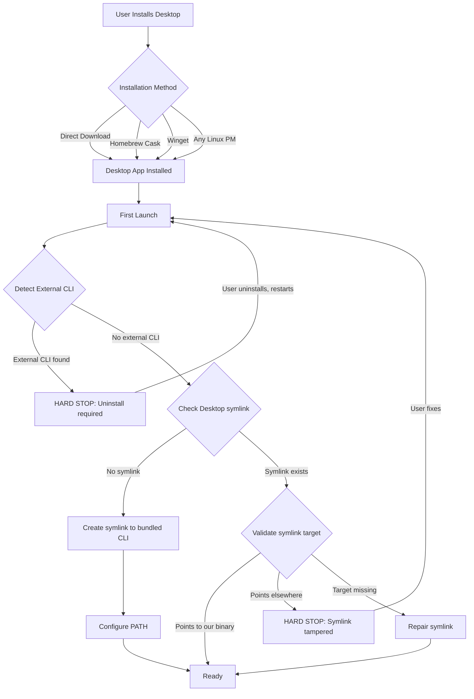
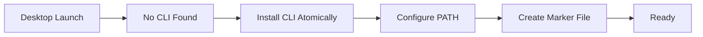

# CLI and Desktop App Version Alignment

- **Status**: Draft
- **Author(s)**: @samuv
- **Created**: 2026-01-12
- **Last Updated**: 2026-01-19
- **Target Repository**: multiple (toolhive, toolhive-studio)
- **Related Issues**: [toolhive-studio#1399](https://github.com/stacklok/toolhive-studio/issues/1399)

## Summary

This RFC establishes version alignment between ToolHive CLI and ToolHive Studio (Desktop app). Because Desktop's UI is a 1:1 reflection of the `thv serve` API (currently in alpha with breaking changes expected), Desktop requires an exact CLI version for compatibility. The solution: Desktop takes ownership of CLI installation regardless of how Desktop itself was installed, ensuring version alignment while providing familiar installation methods.

## Problem Statement

### Current Behavior

- ToolHive Studio embeds a CLI binary in its application bundle
- Desktop communicates with CLI via `thv serve` (local API server)
- The `thv serve` API is in alpha; breaking changes are not guaranteed to be backward-compatible
- Desktop's UI is tightly coupled (1:1) to the API surface
- Users can independently install CLI via Homebrew, direct download, or `go install`
- Both products share the same config directory (`~/Library/Application Support/toolhive/` on macOS)
- No coordination exists between the two installations

### Who Is Affected

- **Desktop users** who want CLI access in terminal
- **CLI users** who later install Desktop
- **Users of both** who face version conflicts and API/config issues
- **Support team** debugging cross-product issues

### Why Exact Version Pinning Is Required

The `thv serve` API is in alpha with breaking changes expected. Desktop's UI is a 1:1 reflection of this API, meaning any version mismatch causes immediate failures — not graceful degradation.

Exact version pinning is necessary until:
1. The `thv serve` API exits alpha
2. A formal backward-compatibility policy is established and documented
3. API version negotiation is implemented (allowing Desktop to work with a range of CLI versions)

Even after alpha, this infrastructure remains valuable — it provides the foundation for controlled rollouts, ensures users have a working CLI, and can be relaxed to allow version ranges once compatibility guarantees exist.

## Goals

- Establish clear ownership model: Desktop owns CLI when Desktop is installed
- Guarantee version alignment between Desktop and terminal CLI
- Prevent API/config incompatibilities from version mismatches
- Provide seamless terminal CLI access for Desktop users
- Support familiar installation methods (Homebrew, Winget, direct download)
- Minimize user confusion about which CLI version is active
- Enable recovery from corrupted or missing CLI installations

## Non-Goals

- Forcing CLI-only users to install Desktop
- Supporting arbitrary combinations of CLI and Desktop versions
- Building a full version manager (nvm-style)
- Enterprise/centralized deployment (future RFC)
- Linux package managers (apt, dnf) — future consideration
- API version negotiation (future consideration, requires backward-compatibility policy first)

## Proposed Solution

**Desktop Owns CLI Installation** — regardless of how Desktop was installed.

### Design Principles

1. **Desktop always uses its bundled CLI version** internally and symlinks to it for terminal access
2. **Desktop never modifies external installations** (Homebrew, manual) directly, but shadows them in PATH
3. **CLI binary is bundled** inside Desktop app — no network required for installation
4. **Symlink approach** provides automatic upgrades when Desktop upgrades (macOS/Linux); Windows uses copy fallback
5. **Validation on every launch** ensures symlink state is correct
6. **Clear user communication** about what's happening and why

### Tradeoffs (Symlink Approach)

| Benefit | Tradeoff |
|---------|----------|
| Automatic CLI upgrades when Desktop upgrades | CLI breaks if Desktop is moved or deleted |
| No checksum verification needed | Must handle broken symlink scenarios |
| Simpler installation logic | Windows requires copy fallback (no symlink support without admin) |
| No binary duplication | Uninstall must clean up symlink or leave it broken |

**Mitigations:**
- Desktop detects broken symlinks and offers recovery options
- Explicit uninstall flow cleans up symlink
- Windows uses copy approach, so CLI persists after Desktop removal

### High-Level Design



**Key insight:** Package managers (Homebrew, Winget) distribute the Desktop app, but Desktop owns CLI installation regardless of how Desktop was installed. Package managers cannot guarantee exact versions, so Desktop must handle this itself.

## Detailed Design

### Component 1: CLI Detection and Validation

Desktop performs CLI detection **on every launch**, not just first launch.

#### Detection Locations

| Platform | Paths Checked (in order) |
|----------|--------------------------|
| macOS | `~/.toolhive/bin/thv`, `/opt/homebrew/bin/thv`, `/usr/local/bin/thv` |
| Linux | `~/.toolhive/bin/thv`, `~/.local/bin/thv`, `/usr/local/bin/thv` |
| Windows | `%LOCALAPPDATA%\ToolHive\bin\thv.exe`, `%ProgramFiles%\toolhive\thv.exe` |

#### Detection Information

For each found binary:
- Path to binary
- Version (`thv --version`)
- Checksum (SHA256)
- Source heuristic (Desktop marker, Homebrew path, manual)

#### Validation Logic (Every Launch)

```typescript
function onDesktopLaunch(): void {
    // First, check for external CLI installations (Homebrew, Winget, manual)
    const externalCli = detectExternalCli();
    if (externalCli) {
        // HARD STOP: External CLI detected, user must resolve before continuing
        return showHardStopDialog(externalCli);
    }
    
    const marker = readMarkerFile();
    
    if (marker) {
        if (marker.source === "desktop") {
            const symlink = checkSymlink("~/.toolhive/bin/thv");
            
            if (!symlink) {
                // Symlink was deleted
                return recreateSymlink();
            }
            
            if (!symlink.targetExists) {
                // Broken symlink - Desktop was moved or deleted
                return showBrokenSymlinkDialog();
            }
            
            // HARD STOP: Symlink exists but points to unexpected location
            if (!isOurBinary(symlink.target)) {
                return showSymlinkTamperedDialog(symlink);
            }
            
            if (symlink.target !== getExpectedTarget()) {
                // Symlink points to old Desktop location (Desktop was moved)
                return updateSymlinkTarget();
            }
            
            // Symlink valid and points to current Desktop bundle
            return ready();
        } else {
            // Unexpected state, re-run detection
            return runDetection();
        }
    } else {
        return runFirstLaunchFlow();
    }
}

function detectExternalCli(): ExternalCliInfo | null {
    // Check known external locations
    const externalPaths = {
        darwin: ["/opt/homebrew/bin/thv", "/usr/local/bin/thv"],
        linux: ["/usr/local/bin/thv", "/usr/bin/thv"],
        win32: [`${process.env.ProgramFiles}\\toolhive\\thv.exe`]
    };
    
    for (const path of externalPaths[platform]) {
        if (fileExists(path)) {
            return {
                path,
                version: getVersionFromBinary(path),
                source: detectSource(path) // "homebrew", "winget", "manual"
            };
        }
    }
    return null;
}

function isOurBinary(symlinkTarget: string): boolean {
    // Verify symlink points to a path inside our Desktop app bundle
    const expectedPattern = platform === "darwin"
        ? /ToolHive Studio\.app\/Contents\/Resources\/bin\//
        : /toolhive-studio.*\/resources\/bin\//;
    
    return expectedPattern.test(symlinkTarget);
}

function checkSymlink(path: string): SymlinkInfo | null {
    if (!isSymlink(path)) return null;
    
    const target = readSymlinkTarget(path);
    return {
        path,
        target,
        targetExists: fileExists(target)
    };
}
```

### Component 2: Installation Scenarios

#### Scenario A: Fresh Install (No Existing CLI)



**Actions:**
1. Create symlink: `~/.toolhive/bin/thv` → `<Desktop.app>/Contents/Resources/bin/<arch>/thv`
2. Add `~/.toolhive/bin` to PATH via shell RC files
3. Create marker file with symlink target path

#### Scenario B: Existing Desktop-Managed CLI

Desktop detects marker file indicating it owns the CLI.

**If symlink valid:** Ready, no action needed. The symlink points to the bundled binary, so upgrades are automatic when Desktop upgrades.

**If symlink target changed (Desktop moved):**
1. Detect symlink points to old/invalid path
2. Update symlink to point to new Desktop location
3. Update marker file with new target path

#### Scenario C: Existing External CLI (Homebrew/Winget/Manual) — HARD STOP

Desktop detects CLI at Homebrew, Winget, or other external path. **This is a blocking dialog — user cannot proceed until resolved.**

**Rationale for hard stop:** Allowing mixed CLI installations causes version conflicts, config corruption, and difficult-to-debug issues. The cost of supporting this edge case outweighs the benefit.

**Dialog:**
```
┌─────────────────────────────────────────────────────────────────┐
│  ⛔ External ToolHive CLI Detected                               │
├─────────────────────────────────────────────────────────────────┤
│                                                                 │
│  Found: thv v0.6.0 at /opt/homebrew/bin/thv                     │
│  Source: Homebrew                                               │
│                                                                 │
│  ToolHive Studio cannot run while an external CLI is installed. │
│  This prevents version conflicts and configuration issues.      │
│                                                                 │
│  Please uninstall the external CLI first:                       │
│                                                                 │
│    brew uninstall toolhive                                      │
│                                                                 │
│  After uninstalling, restart ToolHive Studio.                   │
│                                                                 │
│  [Copy Uninstall Command]  [Open Documentation]  [Quit]         │
└─────────────────────────────────────────────────────────────────┘
```

**Platform-specific uninstall commands shown:**
- **Homebrew (macOS/Linux):** `brew uninstall toolhive`
- **Winget (Windows):** `winget uninstall Stacklok.ToolHive`
- **Manual:** "Remove the binary at [path]"

**User must:**
1. Quit Desktop
2. Uninstall the external CLI
3. Restart Desktop

**After uninstall:** Desktop proceeds with fresh install flow (Scenario A).

#### Scenario D: Symlink Tampered (Points to Wrong Binary) — HARD STOP

Desktop finds symlink at `~/.toolhive/bin/thv` but it points to a location outside the Desktop app bundle. **This is a blocking dialog — user cannot proceed until resolved.**

**Rationale for hard stop:** A symlink pointing to an unexpected binary is a security concern and will cause version mismatches.

**Dialog:**
```
┌─────────────────────────────────────────────────────────────────┐
│  ⛔ CLI Symlink Issue Detected                                   │
├─────────────────────────────────────────────────────────────────┤
│                                                                 │
│  The CLI symlink does not point to ToolHive Studio's binary.    │
│                                                                 │
│  Current target: /some/other/path/thv                           │
│  Expected: ToolHive Studio.app bundle                           │
│                                                                 │
│  This may indicate the symlink was modified manually or by      │
│  another application.                                           │
│                                                                 │
│  [Replace Symlink]  [Remove Symlink]  [Quit]                    │
└─────────────────────────────────────────────────────────────────┘
```

**Actions:**
- **Replace Symlink:** Remove existing symlink, create new one pointing to Desktop bundle
- **Remove Symlink:** Delete symlink, user can reinstall from Settings later
- **Quit:** Exit Desktop without changes

#### Scenario E: Symlink Missing (Was Deleted)

Desktop finds marker file but symlink is missing.

**Action:** Recreate symlink automatically, notify user:
```
"CLI symlink was missing and has been recreated."
```

#### Scenario F: Broken Symlink (Desktop Moved/Deleted)

Desktop finds marker file, symlink exists, but target is invalid (Desktop app was moved or deleted).

**Action:** Show warning with recovery options:
```
┌─────────────────────────────────────────────────────────────────┐
│  ⚠ CLI Installation Issue                                       │
├─────────────────────────────────────────────────────────────────┤
│                                                                 │
│  The CLI symlink points to a location that no longer exists.    │
│  This usually happens if ToolHive Studio was moved or deleted.  │
│                                                                 │
│  Expected: /Applications/ToolHive Studio.app                    │
│                                                                 │
│  [Locate App]  [Remove Symlink]  [Open Settings]                │
└─────────────────────────────────────────────────────────────────┘
```

#### Scenario G: User Installs Homebrew/Winget CLI After Desktop — HARD STOP

User has Desktop CLI installed, then runs `brew install toolhive` or `winget install Stacklok.ToolHive`.

**On next Desktop launch:**
- Desktop detects external CLI at Homebrew/Winget path
- **Hard stop dialog** (same as Scenario C)
- User must uninstall external CLI before Desktop will launch

**Why hard stop instead of shadowing:** While PATH shadowing technically works, it creates confusion:
- User expects `brew upgrade toolhive` to update their CLI, but it doesn't affect the active version
- Two installations to maintain, potential for config drift
- Support burden from "I upgraded but nothing changed" issues

**Prevention:** Documentation and Homebrew cask caveats warn users not to install CLI separately when using Desktop.

### Component 3: Marker File

**Location:** `~/.toolhive/.cli-source`

**Schema (macOS/Linux — symlink):**
```json
{
  "schema_version": 1,
  "source": "desktop",
  "install_method": "symlink",
  "cli_version": "0.5.1",
  "symlink_target": "/Applications/ToolHive Studio.app/Contents/Resources/bin/darwin-arm64/thv",
  "installed_at": "2026-01-09T10:30:00Z",
  "desktop_version": "1.2.0"
}
```

**Schema (Windows — copy):**
```json
{
  "schema_version": 1,
  "source": "desktop",
  "install_method": "copy",
  "cli_version": "0.5.1",
  "cli_checksum": "sha256:abc123...",
  "installed_at": "2026-01-09T10:30:00Z",
  "desktop_version": "1.2.0"
}
```

**Note:** The `user_skipped` field was removed because external CLI detection now requires a hard stop — users cannot skip this step.

**Field descriptions:**
- `install_method`: Either `"symlink"` (macOS/Linux) or `"copy"` (Windows)
- `symlink_target`: Absolute path to bundled CLI (only for symlink method)
- `cli_checksum`: SHA256 of copied binary (only for copy method)

**Permissions:** `0600` (user read/write only)

### Component 4: PATH Configuration

**Symlink locations and targets:**

| Platform | Symlink Location | Symlink Target | Install Method |
|----------|------------------|----------------|----------------|
| macOS | `~/.toolhive/bin/thv` | `/Applications/ToolHive Studio.app/Contents/Resources/bin/<arch>/thv` | Symlink |
| Linux | `~/.toolhive/bin/thv` | `<AppImage or install path>/resources/bin/<arch>/thv` | Symlink |
| Windows | `%LOCALAPPDATA%\ToolHive\bin\thv.exe` | N/A (copy from app bundle) | Copy |

**Architecture folder naming:** The `<arch>` folder uses the format `<os>-<cpu>`:
- macOS: `darwin-arm64` (Apple Silicon), `darwin-x64` (Intel)
- Linux: `linux-arm64`, `linux-x64`
- Windows: `win32-x64`, `win32-arm64`

**Note:** On macOS, if Desktop is installed to a non-standard location, the symlink target will reflect that location (e.g., `~/Applications/ToolHive Studio.app/...`).

**PATH modification (no elevation required):**

| Platform | PATH Modification |
|----------|-------------------|
| macOS | Prepend `~/.toolhive/bin` to `.zshrc`, `.bashrc`, `.config/fish/config.fish` |
| Linux | Prepend `~/.toolhive/bin` to `.bashrc`, `.profile`, `.config/fish/config.fish` |
| Windows | Prepend `%LOCALAPPDATA%\ToolHive\bin` to User PATH environment variable |

**Shell RC modifications:**

Bash/Zsh (`~/.bashrc`, `~/.zshrc`):
```bash
# Added by ToolHive Studio - do not modify this block
export PATH="$HOME/.toolhive/bin:$PATH"
# End ToolHive Studio
```

Fish (`~/.config/fish/config.fish`):
```fish
# Added by ToolHive Studio - do not modify this block
set -gx PATH $HOME/.toolhive/bin $PATH
# End ToolHive Studio
```

PowerShell (User PATH env var):
- Modified via Windows API, no RC file

**Why prepend:** To shadow any existing CLI installations when user chooses Desktop ownership.

### Component 5: Symlink CLI Installation

Symlink creation is simpler than copying because:
- No checksum verification needed (symlink points to bundled binary)
- No atomic rename dance (symlink creation is atomic on POSIX)
- Upgrades are automatic (symlink target updates when Desktop upgrades)

```typescript
async function installOrUpdateCliSymlink(): Promise<void> {
    const symlinkPath = "~/.toolhive/bin/thv";
    const targetPath = getDesktopBundledCliPath(); // e.g., /Applications/ToolHive Studio.app/Contents/Resources/bin/darwin-arm64/thv
    
    // 1. Ensure directory exists
    await ensureDirectory("~/.toolhive/bin");
    
    // 2. Verify target exists
    if (!await fileExists(targetPath)) {
        showError("Bundled CLI not found in Desktop app");
        return;
    }
    
    // 3. Remove existing symlink if present
    if (await symlinkExists(symlinkPath)) {
        await removeSymlink(symlinkPath);
    }
    
    // 4. Create symlink (atomic on POSIX)
    await createSymlink(targetPath, symlinkPath);
    
    // 5. Update marker file
    await updateMarkerFile({
        source: "desktop",
        symlink_target: targetPath,
        cli_version: await getVersionFromBinary(targetPath),
        desktop_version: getDesktopVersion()
    });
}

function getDesktopBundledCliPath(): string {
    // Platform and architecture-specific paths
    // arch examples: darwin-arm64, darwin-x64, linux-arm64, linux-x64
    const arch = `${platform}-${process.arch}`;
    
    if (platform === "darwin") {
        return path.join(getAppPath(), "Contents/Resources/bin", arch, "thv");
    } else if (platform === "linux") {
        return path.join(getAppPath(), "resources/bin", arch, "thv");
    } else {
        // Windows: fall back to copy approach (see Component 5a)
        throw new Error("Symlinks not supported on Windows");
    }
}
```

#### Component 5a: Windows Fallback (Copy Approach)

Windows symlinks require either Administrator privileges or Developer Mode enabled. To avoid this complexity, Windows uses the copy approach:

```typescript
async function installCliWindows(): Promise<void> {
    const finalPath = "%LOCALAPPDATA%\\ToolHive\\bin\\thv.exe";
    const targetPath = getDesktopBundledCliPath();
    
    // 1. Ensure directory exists
    await ensureDirectory("%LOCALAPPDATA%\\ToolHive\\bin");
    
    // 2. Copy bundled CLI
    await copyFile(targetPath, finalPath);
    
    // 3. Update marker file
    await updateMarkerFile({
        source: "desktop",
        cli_version: await getVersionFromBinary(finalPath),
        desktop_version: getDesktopVersion(),
        install_method: "copy" // Windows-specific
    });
}
```

**Note:** On Windows, Desktop upgrades must re-copy the CLI binary. This is handled in Component 7 (Desktop Upgrade Behavior).

### Component 6: Settings Panel

```
┌─────────────────────────────────────────────────────────────────┐
│  Settings > CLI Management                                      │
├─────────────────────────────────────────────────────────────────┤
│                                                                 │
│  CLI Status                                                     │
│  ──────────────────────────────────────────────────────────     │
│                                                                 │
│  Desktop CLI:     ✓ Installed                                   │
│  Version:         0.5.1                                         │
│  Location:        ~/.toolhive/bin/thv                           │
│  Checksum:        ✓ Valid                                       │
│                                                                 │
│  ⚠ Other CLI detected:                                          │
│     v0.6.0 at /opt/homebrew/bin/thv (shadowed in PATH)          │
│     This version is not used when you run `thv` in terminal.    │
│     Learn more about PATH configuration →                       │
│                                                                 │
│  ──────────────────────────────────────────────────────────     │
│                                                                 │
│  PATH Status:     ✓ Configured correctly                        │
│  Active in:       zsh, bash                                     │
│                                                                 │
│  ──────────────────────────────────────────────────────────     │
│                                                                 │
│  Actions                                                        │
│  [Reinstall CLI]  [Remove CLI from PATH]  [Verify Installation] │
│                                                                 │
│  Troubleshooting                                                │
│  [View CLI Logs]  [Reset CLI Configuration]                     │
│                                                                 │
└─────────────────────────────────────────────────────────────────┘
```

### Component 7: Desktop Upgrade Behavior

**Symlink approach simplifies upgrades:** Since the symlink points to the bundled CLI inside Desktop.app, upgrading Desktop automatically upgrades the CLI — no additional action required.

| Current State | Desktop Action on Upgrade |
|---------------|---------------------------|
| Desktop symlink exists (macOS/Linux) | No action needed — symlink automatically points to new bundled CLI |
| Desktop CLI copy exists (Windows) | Re-copy new bundled CLI to replace old version |
| CLI not installed (user skipped) | Prompt to install new version (once) |
| External CLI only (shadowed) | Create Desktop symlink, external remains shadowed |
| Symlink broken (Desktop was moved) | Update symlink to point to new location |

### Component 8: Desktop Uninstall Behavior

**Important caveat (symlink approach):** On macOS/Linux, the CLI is a symlink pointing to the Desktop app bundle. If the user uninstalls Desktop without using the proper uninstall flow, the symlink becomes broken.

**Direct uninstall (manual or via Desktop UI):**
```
┌─────────────────────────────────────────────────────────────────┐
│  Uninstall ToolHive Studio                                      │
├─────────────────────────────────────────────────────────────────┤
│                                                                 │
│  Desktop created a CLI symlink at ~/.toolhive/bin/thv           │
│                                                                 │
│  ○ Remove symlink (recommended)                                 │
│    Removes CLI symlink and PATH configuration                   │
│    Config files in ~/.toolhive are preserved                    │
│                                                                 │
│  ○ Keep symlink                                                 │
│    Warning: Symlink will be broken after uninstall              │
│    You'll see errors when running `thv` in terminal             │
│                                                                 │
│  [Uninstall]  [Cancel]                                          │
└─────────────────────────────────────────────────────────────────┘
```

**Homebrew/Winget uninstall:**
- `brew uninstall --cask toolhive-studio` removes Desktop only
- Symlink at `~/.toolhive/bin/thv` remains but becomes **broken**
- User must remove manually: `rm ~/.toolhive/bin/thv`
- Consider adding a `postflight` script to Homebrew cask to clean up symlink

**Drag-to-Trash uninstall (macOS):**
- If user drags Desktop to Trash, symlink becomes broken immediately
- Running `thv` in terminal will show: `zsh: no such file or directory: /Applications/ToolHive Studio.app/Contents/Resources/bin/darwin-arm64/thv`
- User must remove broken symlink manually or reinstall Desktop

**Windows uninstall:**
- Since Windows uses copy approach, the CLI binary persists after Desktop uninstall
- This is intentional — CLI continues working without Desktop

### Component 9: Package Manager Configuration

#### Naming Strategy

| Package | Type | Name | Rationale |
|---------|------|------|-----------|
| CLI | Homebrew Formula | `toolhive` | Short, memorable for CLI users |
| Desktop | Homebrew Cask | `toolhive-studio` | Distinct from CLI, matches app name |
| Desktop | Winget | `Stacklok.ToolHiveStudio` | Standard Winget naming convention |

**Why distinct names matter:** Using the same name for both CLI and Desktop packages causes user confusion and potential installation conflicts. Distinct names (`toolhive` vs `toolhive-studio`) make it clear which package is being installed.

#### Homebrew Limitations

**`conflicts_with formula:` does not work.** Homebrew deprecated this cask directive because it was never functional. We cannot declare that `toolhive-studio` cask conflicts with `toolhive` formula at the package manager level. Instead, Desktop handles conflicts via runtime detection and user dialog.

#### Homebrew Cask (No CLI Dependency)

```ruby
cask "toolhive-studio" do
  version "1.2.0"
  sha256 "abc123def456..."

  url "https://github.com/stacklok/toolhive-studio/releases/download/v#{version}/ToolHive-Studio-#{version}-mac-universal.dmg"
  name "ToolHive Studio"
  desc "Desktop application for managing MCP servers"
  homepage "https://toolhive.dev/"

  # NO depends_on formula - Desktop manages CLI installation
  # Package managers cannot guarantee exact versions
  
  depends_on macos: ">= :monterey"

  app "ToolHive Studio.app"

  zap trash: [
    "~/Library/Application Support/toolhive-studio",
    "~/Library/Preferences/dev.toolhive.studio.plist",
    "~/Library/Caches/dev.toolhive.studio",
  ]
  
  # Note: ~/.toolhive is intentionally NOT in zap to preserve user config

  caveats <<~EOS
    ToolHive Studio manages its own CLI installation for version compatibility.
    
    On first launch, Desktop will install the CLI to ~/.toolhive/bin and
    configure your PATH automatically.
    
    If you have the CLI installed via `brew install toolhive`, Desktop's
    version will take precedence in your PATH. Your Homebrew installation
    remains unchanged but will be shadowed.
    
    To use only the Homebrew CLI, you can skip Desktop's CLI installation
    during first launch, but this may cause compatibility issues.
  EOS
end
```

#### Winget Manifest (No CLI Dependency)

```yaml
PackageIdentifier: Stacklok.ToolHiveStudio
PackageVersion: 1.2.0
PackageLocale: en-US
Publisher: Stacklok
PublisherUrl: https://stacklok.com
PackageName: ToolHive Studio
PackageUrl: https://toolhive.dev
License: Apache-2.0
ShortDescription: Desktop application for managing MCP servers
Description: |-
  ToolHive Studio provides a graphical interface for managing MCP servers.
  On first launch, Desktop will install the required CLI version to ensure
  API compatibility. The CLI API is in Alpha; exact version matching is required.
Moniker: toolhive-studio
Tags:
  - mcp
  - ai
  - developer-tools
# NO Dependencies - Desktop manages CLI installation
Installers:
  - Architecture: x64
    InstallerType: exe
    InstallerUrl: https://github.com/stacklok/toolhive-studio/releases/download/v1.2.0/ToolHive-Studio-1.2.0-win-x64.exe
    InstallerSha256: abc123def456...
    InstallerSwitches:
      Silent: /S
ManifestType: singleton
ManifestVersion: 1.6.0
```

## Security Considerations

### Threat Model

| Threat | Description | Likelihood | Impact |
|--------|-------------|------------|--------|
| Symlink target manipulation | Attacker changes symlink to point to malicious binary | Low | High |
| PATH hijacking | Attacker places malicious binary earlier in PATH | Medium | High |
| Shell RC injection | Attacker exploits Desktop's RC modification | Low | High |
| Marker file tampering | Attacker modifies ownership marker | Low | Medium |
| Desktop app replacement | Attacker replaces Desktop.app with malicious version | Low | High |

### Mitigations

| Threat | Mitigation |
|--------|------------|
| Symlink target manipulation | Validate symlink target matches expected Desktop path; verify target is inside a code-signed app bundle (macOS) |
| PATH hijacking | Desktop uses absolute path internally; prepend to PATH so Desktop symlink is first |
| Shell RC injection | Use exact, predictable RC format with start/end markers; validate paths |
| Marker file tampering | Validate schema, use restrictive permissions (0600), verify symlink target matches marker |
| Desktop app replacement | macOS: Gatekeeper validates code signature; Windows: copy approach uses checksum verification |

### File Permissions

| File/Directory | Permissions | Rationale |
|----------------|-------------|-----------|
| `~/.toolhive/` | 0700 | User access only |
| `~/.toolhive/bin/` | 0755 | Executable directory |
| `~/.toolhive/bin/thv` | lrwxr-xr-x | Symlink (permissions on target, not symlink) |
| `~/.toolhive/.cli-source` | 0600 | Sensitive marker, user only |

**Note:** On Windows, `~/.toolhive/bin/thv.exe` is a regular file (copy) with 0755 equivalent permissions.

### Input Validation

- CLI version strings validated against semver regex
- Symlink targets validated: must point to expected path inside Desktop app bundle
- File paths sanitized: reject paths containing `..`, null bytes, or shell metacharacters
- Marker file JSON validated against schema before use
- Shell RC modifications use exact format, never interpolate untrusted input

## Alternatives Considered

### Alternative 1: Package Manager Dependency (Minimum Version)

Declare CLI as Homebrew/Winget dependency with minimum version constraint.

**Pros:** Familiar package manager experience
**Cons:** Package managers only support minimum version, not exact; cannot guarantee API compatibility during Alpha
**Why not chosen:** Cannot enforce exact version requirement

### Alternative 2: Desktop Never Manages CLI

Desktop only uses bundled CLI internally; user manages terminal CLI independently.

**Pros:** Clear separation, no conflicts
**Cons:** Config/API compatibility issues, user confusion, support burden
**Why not chosen:** Doesn't solve the core problem; creates worse UX

### Alternative 3: Full Version Manager (nvm-style)

Build `thvm` tool for managing multiple CLI versions.

**Pros:** Maximum flexibility
**Cons:** Massive complexity, still doesn't solve config compatibility, maintenance burden
**Why not chosen:** Overkill for problem scope

### Alternative 4: API Version Negotiation

Add version negotiation to `thv serve` API so Desktop can work with a range of CLI versions.

**Pros:** Would allow version ranges instead of exact pinning; graceful degradation for mismatched versions
**Cons:** Requires stabilizing API first; significant engineering investment; adds complexity to both CLI and Desktop
**Why not chosen:** This is a future enhancement, not an alternative. It requires:
1. A formal backward-compatibility policy
2. Semantic versioning discipline for the API
3. Implementation effort in both CLI and Desktop

This RFC provides the necessary foundation — Desktop-managed CLI installation — which version negotiation would build upon. The two are complementary, not mutually exclusive.

### Alternative 5: Copy Binary Instead of Symlink

Instead of symlinking to the bundled CLI, copy it to `~/.toolhive/bin/thv`.

**Pros:** CLI continues working if Desktop is moved/deleted; simpler cross-platform behavior
**Cons:** Requires re-copy on every Desktop upgrade; checksum verification needed; more complex atomic installation logic
**Why not chosen:** Symlinks provide simpler upgrade semantics — the CLI automatically updates when Desktop upgrades, with no additional logic required. The tradeoff (CLI breaking if Desktop is moved/deleted) is acceptable because:
1. Moving the Desktop app is uncommon
2. Desktop can detect and recover from broken symlinks
3. Uninstall flow can clean up the symlink

**Note:** Windows uses the copy approach as a fallback because symlinks require Administrator privileges or Developer Mode.

## Compatibility

### Backward Compatibility

- Existing Desktop installations continue working
- Existing CLI installations remain until user chooses Desktop ownership
- Users who previously installed CLI manually are prompted on first Desktop launch with new version

### Forward Compatibility

- Marker file includes `schema_version` for future migrations
- Shell RC modifications have clear start/end markers for future cleanup/modification
- Design accommodates future API version negotiation (post-Alpha)

### Migration Path

1. User installs new Desktop version with this feature
2. Desktop detects current state
3. User presented with appropriate dialog
4. Gradual adoption, no forced migration

## Implementation Plan

### Phase 1: Core Infrastructure

- [ ] CLI detection across all platforms
- [ ] Marker file read/write with schema validation (symlink and copy variants)
- [ ] Symlink creation and validation (macOS/Linux)
- [ ] Copy installation with checksum verification (Windows fallback)

### Phase 2: First Launch Flow

- [ ] Fresh install dialog and flow
- [ ] External CLI conflict dialog
- [ ] Symlink creation to bundled CLI
- [ ] PATH configuration for bash, zsh
- [ ] PATH configuration for fish
- [ ] PATH configuration for Windows

### Phase 3: Ongoing Validation

- [ ] Every-launch symlink validation logic
- [ ] Broken symlink detection and recovery dialog
- [ ] Missing symlink detection and recreation
- [ ] Symlink target update when Desktop moved
- [ ] Windows: Desktop upgrade triggers CLI re-copy

### Phase 4: Settings and Recovery

- [ ] CLI Management settings panel
- [ ] Reinstall action
- [ ] Remove CLI action
- [ ] Verify Installation action
- [ ] PATH status display

### Phase 5: Package Managers

- [ ] Submit Homebrew Cask to stacklok/homebrew-tap
- [ ] Submit Winget manifest
- [ ] Test end-to-end: `brew install --cask` → first launch → CLI installed
- [ ] Test end-to-end: `winget install` → first launch → CLI installed
- [ ] Uninstall cleanup verification

### Phase 6: Documentation

- [ ] User guide: CLI installation explained
- [ ] FAQ: Common questions about version alignment
- [ ] Troubleshooting guide
- [ ] Migration guide for existing users

### Dependencies

| Team/Component | Requirement | Status |
|----------------|-------------|--------|
| CLI team | `thv --version` outputs parseable semver | ✅ Implemented |
| CLI team | Bundled binary available for all platforms | ✅ Implemented |
| CLI team | Config schema backward compatibility commitment | ⏳ Needs agreement |
| Design team | Dialog and settings UI mockups | ⏳ Pending |
| Homebrew | Cask review (stacklok tap, no core review needed) | ⏳ After implementation |
| Winget | Manifest review | ⏳ After implementation |

## Testing Strategy

### Unit Tests

- Marker file parsing and validation (both symlink and copy schemas)
- Version comparison logic
- PATH modification generation (per shell)
- Symlink creation and validation
- Symlink target resolution
- Windows: checksum calculation and verification

### Integration Tests

- CLI detection on each platform
- Fresh install flow (symlink on macOS/Linux, copy on Windows)
- External CLI detection (mock Homebrew paths)
- Symlink validation (target exists, target missing)
- Symlink update when Desktop moved
- Windows: upgrade flow (copy replacement)

### End-to-End Tests

| Scenario | Expected Result |
|----------|-----------------|
| Fresh Desktop install (no CLI) | Symlink created, PATH configured, marker created |
| Desktop install + Homebrew CLI exists | **HARD STOP**: Dialog shown, Desktop won't launch until CLI uninstalled |
| Desktop install + Winget CLI exists | **HARD STOP**: Dialog shown, Desktop won't launch until CLI uninstalled |
| User uninstalls external CLI, restarts | Fresh install flow proceeds normally |
| Desktop upgrade (v1.2→v1.3) | No action needed — symlink already points to bundled CLI |
| Symlink deleted | Detected on launch, symlink recreated automatically |
| Symlink points to wrong binary | **HARD STOP**: Dialog shown, user must fix or remove symlink |
| Symlink broken (Desktop moved) | Warning shown, offer to locate app or remove symlink |
| Desktop moved to different location | Symlink updated to point to new location |
| `brew install --cask toolhive-studio` | Desktop installed, first launch creates symlink |
| `brew uninstall --cask toolhive-studio` | Desktop removed, **symlink broken** (known caveat) |
| Drag Desktop to Trash (macOS) | Symlink broken, user must clean up manually |
| User runs `brew install toolhive` after Desktop | **HARD STOP** on next Desktop launch |
| Windows: Desktop upgrade | CLI binary re-copied from new bundle |
| Windows: Desktop uninstall | CLI binary persists (copy approach) |
| Windows: Winget CLI exists | **HARD STOP**: Dialog shown, Desktop won't launch until CLI uninstalled |

### Platform-Specific Tests

- **macOS:** Symlink to `/Applications/ToolHive Studio.app/.../bin/darwin-arm64/thv` or `darwin-x64`, broken symlink detection, Homebrew detection at `/opt/homebrew` and `/usr/local`, zsh/bash/fish PATH
- **Linux:** Symlink to AppImage/install path with `linux-arm64` or `linux-x64` arch folder, broken symlink detection, bash/fish PATH, .profile handling
- **Windows:** Copy approach (no symlink), copy from `win32-x64` or `win32-arm64` folder, re-copy on upgrade, Winget detection, User PATH environment variable

## Documentation

### User Documentation

- Getting Started: Updated with first-launch CLI installation
- Installation Guide: Homebrew, Winget, direct download paths
- FAQ: "Why does Desktop install its own CLI?"
- FAQ: "I installed CLI from Homebrew, what happens?" (Answer: Desktop requires you to uninstall it first)
- FAQ: "How do I update the CLI?" (Answer: it updates automatically when Desktop upgrades)
- FAQ: "I moved/deleted Desktop and now `thv` doesn't work" (Answer: symlink is broken, reinstall Desktop or remove symlink)
- FAQ: "Why is Windows different?" (Answer: symlinks require admin, so we copy instead)
- Troubleshooting: PATH issues, shadowed CLI, broken symlink recovery

### Developer Documentation

- CLI detection implementation guide
- Marker file schema specification
- Adding support for new shells
- Adding support for new package managers

## Open Questions

> Resolved questions moved to "Decisions Made" section below.

1. **Config schema compatibility:** Has CLI team formally agreed to maintain backward compatibility? What's the enforcement mechanism (CI check, review process)?

2. **Future API versioning:** When `thv serve` exits Alpha, should we add version negotiation? What would trigger this transition?

## Decisions Made

| Question | Decision | Rationale |
|----------|----------|-----------|
| Which shells to support? | Bash, Zsh, Fish, PowerShell | Covers >95% of users |
| Homebrew tap vs core? | `stacklok/homebrew-tap` initially | Faster iteration; move to core later if desired |
| External CLI detected? | Hard stop, require uninstall | Prevents version conflicts, config corruption, support burden |
| Symlink points to wrong binary? | Hard stop, require fix | Security concern, prevents version mismatches |
| Allow skipping CLI install? | No | Hard stop ensures consistent environment; reduces support complexity |
| Apple Silicon vs Intel? | Separate binaries per architecture | Already building separate artifacts; symlink points to arch-specific folder (e.g., `darwin-arm64`, `darwin-x64`) |
| Symlink vs copy? | Symlink (macOS/Linux), copy (Windows) | Simpler upgrades; symlink auto-updates when Desktop upgrades; Windows fallback due to symlink restrictions |
| Package naming? | `toolhive` (CLI) / `toolhive-studio` (Desktop) | Distinct names avoid confusion and conflicts |
| Rely on Homebrew `conflicts_with`? | No, handle in-app | Homebrew deprecated `conflicts_with formula:`; it never worked |

## References

- [Issue #1399: Change UI installer to expose CLI binary](https://github.com/stacklok/toolhive-studio/issues/1399)
- [VS Code "Install 'code' command in PATH"](https://code.visualstudio.com/docs/setup/mac)
- [Homebrew Cask Documentation](https://docs.brew.sh/Cask-Cookbook)
- [Winget Manifest Documentation](https://learn.microsoft.com/en-us/windows/package-manager/package/manifest)

---

## RFC Lifecycle

### Review History

| Date | Reviewer | Decision | Notes |
|------|----------|----------|-------|
| 2026-01-12 | @samuv | Draft | Initial submission |
| 2026-01-19 | @samuv | Update | Switched to A2 symlink approach based on team feedback |

### Implementation Tracking

| Repository | PR | Status |
|------------|-----|--------|
| toolhive-studio | #XXXX | Pending - CLI management |
| stacklok/homebrew-tap | #XXXX | Pending - Cask |
| winget-pkgs | #XXXX | Pending - Manifest |
