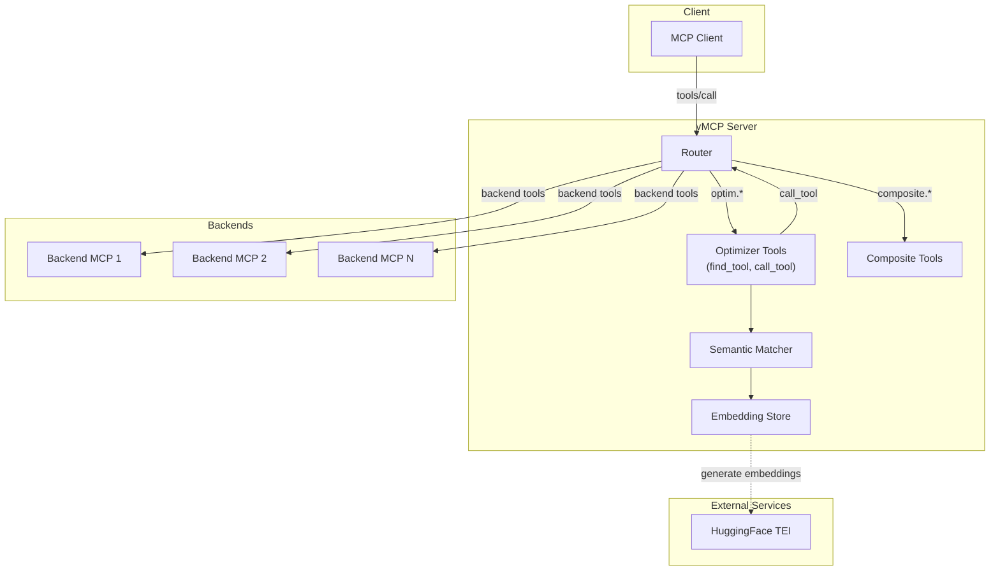
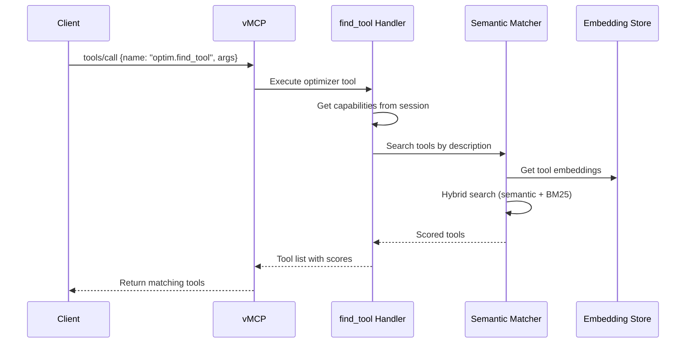
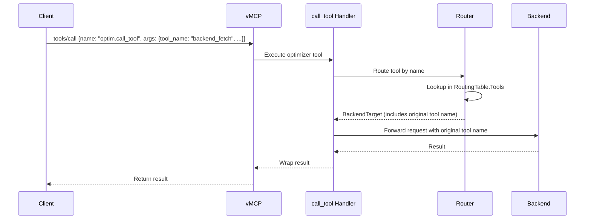

# RFC-0022: Optimizer Migration to Virtual MCP Server

- **Status**: Draft
- **Author(s)**: @ptelang, @therealnb, @aponcedeleonch
- **Created**: 2026-01-13
- **Last Updated**: 2026-01-14
- **Target Repository**: toolhive
- **Related Issues**:

## Summary

This RFC proposes migrating [MCP-Optimizer's](https://github.com/StacklokLabs/mcp-optimizer) functionality to the Virtual MCP Server (vMCP) by implementing `optim.find_tool` and `optim.call_tool` as native vMCP tools. This migration unifies the codebase, eliminates Python/Go deployment complexity, and enables optimizer functionality to leverage existing vMCP infrastructure including authentication, authorization, and observability.

## Problem Statement

### Current Behavior and Limitations

MCP-Optimizer currently exists as an independent Python MCP server that provides dynamic tool discovery and routing of requests to appropriate MCP tools. While it successfully reduces token usage by narrowing tools sent to the backend LLM, this architecture has several limitations:

- **Separate codebase**: MCP-Optimizer is written in Python while vMCP is in Go, requiring maintenance of two technology stacks
- **No infrastructure integration**: Cannot leverage ToolHive core functionalities like authentication, authorization, and observability
- **Deployment complexity**: Requires managing Python dependencies alongside the Go-based ToolHive ecosystem
- **Inconsistent security model**: Does not integrate with vMCP's two-boundary authentication model or Cedar policies

### Why This Problem Is Worth Solving

Unifying MCP-Optimizer into vMCP will:
- Reduce operational burden by eliminating a separate service
- Provide consistent security through vMCP's established auth model
- Enable better observability through existing OpenTelemetry integration
- Simplify the deployment model for Kubernetes environments

## Goals

- Implement `optim.find_tool` for semantic/keyword-based tool discovery across all backends
- Implement `optim.call_tool` for dynamic tool invocation on any backend
- Expose these as standard MCP tools that clients can call via `tools/call`
- Maintain full integration with vMCP's two-boundary authentication model
- Preserve hybrid search capability (semantic embeddings + BM25 keyword matching)
- Maintain token efficiency metrics reporting

## Non-Goals

- Cross-vMCP search: Each vMCP instance will only know its own tools
- PostgreSQL storage backend: Initially only SQLite will be supported
- Changes to vMCP's existing authentication or authorization logic
- Modifications to the composite tool or backend tool functionality

## Proposed Solution

### High-Level Design

The proposed design adds `find_tool` and `call_tool` as vMCP-owned tools that provide meta-capabilities over the backend tools. This establishes a one-to-one relationship between mcp-optimizer functionality and vMCP.



### Detailed Design

#### Tool Types in vMCP

vMCP will expose three types of tools:

| Tool Type | Description | Execution |
|-----------|-------------|-----------|
| **Backend Tools** | Discovered from backend MCP servers | Routed to specific backend |
| **Composite Tools** | Defined as DAG-based workflows | Executed within vMCP |
| **Optimizer Tools** (NEW) | `find_tool` and `call_tool` | Handled entirely by vMCP |

#### Optimizer Tools Specification

**optim.find_tool**

Purpose: Semantic and keyword-based search across all backend tools.

```go
// Input parameters
type FindToolInput struct {
    ToolDescription string `json:"tool_description"` // Natural language description
    ToolKeywords    string `json:"tool_keywords"`    // Optional space-separated keywords
}

// Output
type FindToolOutput struct {
    Tools        []ToolMatch  `json:"tools"`
    TokenMetrics TokenMetrics `json:"token_metrics"`
}

type ToolMatch struct {
    Name        string                 `json:"name"`        // Resolved tool name (e.g., "backend_fetch")
    BackendID   string                 `json:"backend_id"`  // Informational: source backend for display purposes
    Description string                 `json:"description"`
    Parameters  map[string]interface{} `json:"parameters"`
    Score       float64                `json:"score"`
}

type TokenMetrics struct {
    BaselineTokens  int     `json:"baseline_tokens"`
    ReturnedTokens  int     `json:"returned_tokens"`
    SavingsPercent  float64 `json:"savings_percent"`
}
```

**optim.call_tool**

Purpose: Dynamic invocation of any tool discovered via `find_tool`.

```go
// Input parameters
type CallToolInput struct {
    ToolName   string                 `json:"tool_name"`   // Resolved tool name from find_tool (e.g., "backend_fetch")
    Parameters map[string]interface{} `json:"parameters"`
}

// Output: Standard MCP CallToolResult
```

> **Note:** The `tool_name` parameter expects the resolved tool name as returned by `find_tool`. When using the default prefix conflict resolution strategy, tool names include the backend prefix (e.g., `backend_fetch`). The router uses this name to resolve the correct backend via the existing `RoutingTable`.

#### Request Flow

**find_tool Flow:**



**call_tool Flow:**



#### Component Changes

| Component | Change Required |
|-----------|-----------------|
| Incoming Auth | None |
| Outgoing Auth | None |
| Session Management | None |
| Discovery | None |
| Router | Minor - intercept `optim.*` prefix |
| Server | Add optimizer tool handlers |
| Config | Add optimizer enable flag |
| Storage | Add embedding storage interface |

#### Configuration Changes

**Kubernetes Configuration (CRD):**

```yaml
apiVersion: toolhive.stacklok.com/v1alpha1
kind: VirtualMCPServer
metadata:
  name: vmcp-with-optimizer
spec:
  optimizer:
    enabled: true
    storage:
      type: sqlite
    embeddings:
      provider: tei
      tei:
        endpoint: http://tei-service.default.svc.cluster.local:8080
        model: BAAI/bge-small-en-v1.5
```

**Storage Architecture:**

The initial implementation uses **ephemeral storage (`emptyDir`)** for each vMCP replica. This design ensures a 1:1 relationship between the vMCP process and its SQLite database, avoiding the complexity of concurrent database access across replicas.

The SQLite database stores tool embeddings as a **regenerable cache**, not persistent state. Embeddings are derived from backend tool descriptions fetched during session initialization and can be regenerated on-demand. On pod restart, the first session will incur a cold-start latency while embeddings are regenerated.

**Extensibility:** The storage layer will be implemented behind an interface to allow future extension to a shared PostgreSQL backend if the overhead of per-replica ephemeral databases becomes a bottleneck at scale.

#### Data Model Changes

**Embedding Storage Schema:**

```sql
CREATE TABLE tool_embeddings (
    id INTEGER PRIMARY KEY AUTOINCREMENT,
    backend_id TEXT NOT NULL,
    tool_name TEXT NOT NULL,
    tool_description TEXT NOT NULL,
    embedding BLOB NOT NULL,
    model_id TEXT NOT NULL,
    created_at TIMESTAMP DEFAULT CURRENT_TIMESTAMP,
    updated_at TIMESTAMP DEFAULT CURRENT_TIMESTAMP,
    UNIQUE(backend_id, tool_name)
);

CREATE INDEX idx_tool_embeddings_backend ON tool_embeddings(backend_id);
```

#### Embedding Generation Flow

```
1. Client initiates session
2. Discovery middleware runs
   |-- Query all backends for capabilities
   |-- Resolve conflicts (prefix/priority/manual)
   |-- Store capabilities in session

3. OnRegisterSession hook fires
   |-- Add composite tools (existing)
   |-- Generate embeddings (NEW)
   |   |-- Group tools by backend
   |   |-- For each backend (parallel):
   |   |   |-- Check which tools lack embeddings
   |   |   |-- Batch generate embeddings via TEI
   |   |   |-- Store in database
   |   |-- Wait for all backends to complete
   |-- Register optimizer tools
       |-- optim.find_tool
       |-- optim.call_tool

4. Session ready
   |-- find_tool calls use cached embeddings
```

## Security Considerations

### Threat Model

**Potential Threats:**
- Malicious tool names or descriptions attempting injection attacks during embedding generation
- Unauthorized access to tools via `call_tool` bypassing normal authorization
- Information disclosure through `find_tool` revealing tools a user shouldn't see

**Potential Attackers:**
- Malicious MCP clients attempting unauthorized tool access
- Compromised backend servers providing malicious tool metadata

### Authentication and Authorization

This design fully reuses vMCP's existing two-boundary authentication model without modifications:

**Incoming Auth (Client to vMCP):**
- Same auth middleware chain applies (`pkg/vmcp/auth/factory/incoming.go`)
- Optimizer tools receive Identity from context via `pkg/auth.IdentityFromContext(ctx)`
- Per-user tool filtering uses Identity claims

**Outgoing Auth (vMCP to Backends):**
- `call_tool` uses existing router and backend client
- Auth strategies (`pkg/vmcp/auth/strategies/`) work unchanged
- Token propagation via `identityPropagatingRoundTripper`

**Authorization:**
- `find_tool` only returns tools the user has access to (session-scoped)
- `call_tool` validates tool access before invocation
- Cedar policies apply to optimizer tools like any other vMCP tool

### Data Security

**Sensitive Data:**
- Tool embeddings (not sensitive, derived from public tool descriptions)
- Query embeddings (transient, not persisted)

**Protection Measures:**
- SQLite database stored on ephemeral volume (`emptyDir`) with appropriate file permissions; data is regenerable and non-sensitive
- No sensitive data transmitted to embedding service (only tool descriptions)

### Input Validation

**User Input:**
- `tool_description`: Free-text search query (for `find_tool`)
- `tool_keywords`: Space-separated keywords (for `find_tool`)
- `tool_name`, `parameters`: Tool name and arguments (for `call_tool`)

**Validation:**
- Input length limits enforced
- Tool names validated against session routing table
- Parameters validated against tool schema before invocation

### Secrets Management

- No new secrets introduced
- Embedding service endpoint configured via standard vMCP configuration
- Backend credentials continue to use existing vMCP secrets management

### Audit and Logging

- All optimizer tool calls logged via existing vMCP request logging
- OpenTelemetry traces include optimizer tool execution
- Failed authorization attempts logged at WARN level

### Mitigations

| Threat | Mitigation |
|--------|------------|
| Unauthorized tool access | Session-scoped capabilities, Cedar policies |
| Information disclosure | User can only search tools they have access to |
| Injection via tool descriptions | Embeddings generated server-side, descriptions sanitized |

## Alternatives Considered

### Alternative 1: Standalone Optimizer Service (Current State)

- **Description**: Keep MCP-Optimizer as a separate Python service
- **Pros**:
  - No migration effort
  - Python ecosystem for ML/embeddings
- **Cons**:
  - Dual codebase maintenance
  - No auth integration
  - Deployment complexity
- **Why not chosen**: Integration benefits outweigh keeping separate service

## Compatibility

### Backward Compatibility

- Existing vMCP configurations work unchanged (optimizer disabled by default)
- Existing composite tools and backend tools unaffected
- Clients using `find_tool` and `call_tool` must update to use `optim.` prefix

### Forward Compatibility

- Provider interface allows adding new embedding providers (vLLM, OpenAI)
- Storage interface allows adding new backends (PostgreSQL)
- Tool naming convention (`optim.*`) reserved for future optimizer features

## Implementation Plan

### Phase 1: Core Infrastructure

- Implement embedding storage interface with SQLite backend
- Implement HuggingFace TEI embedding provider
- Add configuration schema for optimizer settings
- Update router to intercept `optim.*` tool calls

### Phase 2: Tool Implementation

- Implement `optim.find_tool` handler with hybrid search
- Implement `optim.call_tool` handler with backend routing
- Add embedding generation to session initialization hook
- Implement token metrics calculation

### Phase 3: Integration and Testing

- Integration tests for optimizer tools
- End-to-end tests with sample backends
- Performance testing for embedding generation
- Documentation and examples

### Dependencies

- HuggingFace TEI deployment (external)
- SQLite (bundled with Go, no external dependency)

## Testing Strategy

- **Unit tests**: Individual components (storage, search, handlers)
- **Integration tests**: Optimizer tools with mock backends
- **End-to-end tests**: Full flow from client through optimizer to backends
- **Performance tests**: Embedding generation latency, search response time
- **Security tests**: Authorization enforcement, input validation

## Documentation

- User documentation: Optimizer configuration and usage
- API documentation: Tool schemas and examples
- Architecture documentation: Updated vMCP architecture diagrams
- Runbooks: Troubleshooting optimizer issues, TEI deployment

## Open Questions

1. Is there a way to detect tool description changes?
2. How should the system handle TEI service unavailability during session initialization?

## References

- [HuggingFace Text Embeddings Inference](https://github.com/huggingface/text-embeddings-inference)
- [vLLM Embedding Support](https://docs.vllm.ai/en/latest/)
- [MCP Optimizer](https://github.com/StacklokLabs/mcp-optimizer)

---

## RFC Lifecycle

<!-- This section is maintained by RFC reviewers -->

### Review History

| Date | Reviewer | Decision | Notes |
|------|----------|----------|-------|
| 2026-01-13 | | Draft | Initial submission |
| 2026-01-14 | | Draft | Updated based on @jerm-dro feedback |
| 2026-01-14 | | Draft | Updated based on @JAORMX feedback |

### Implementation Tracking

| Repository | PR | Status |
|------------|-----|--------|
| toolhive | 3253 | Draft |
| toolhive | 3280 | Draft |
| toolhive | 3282 | Draft |
