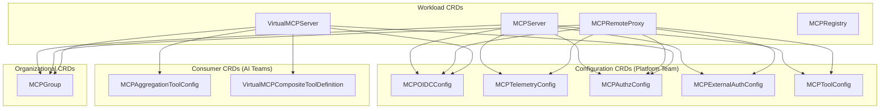
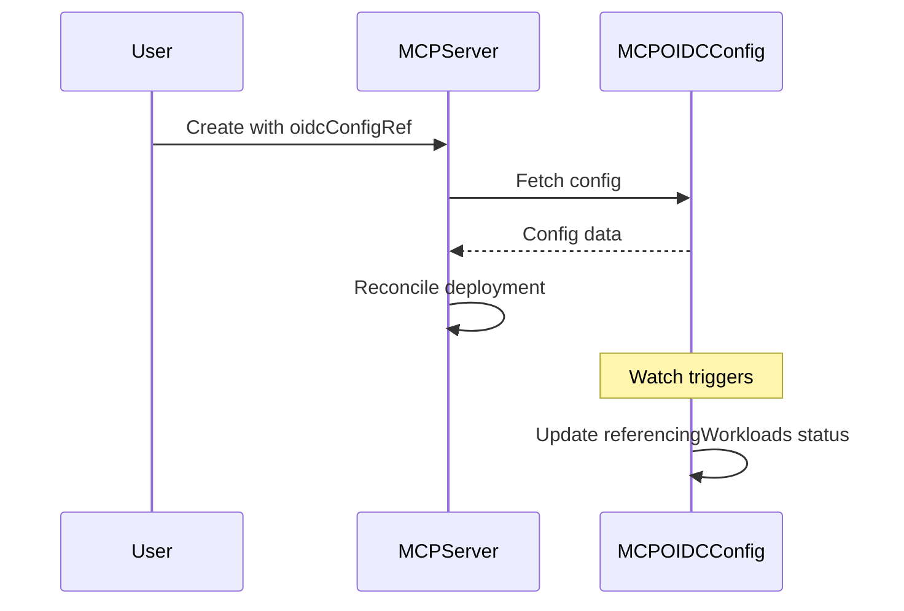

# RFC-0023: CRD v1beta1 Optimization and Configuration Extraction

- **Status**: Draft
- **Author(s)**: ToolHive Team
- **Created**: 2026-01-14
- **Last Updated**: 2026-01-14
- **Target Repository**: toolhive
- **Related Issues**: N/A
- **Related RFCs**:
  - [THV-0001](THV-0001-otel-integration-proposal.md) - OpenTelemetry integration (MCPTelemetryConfig builds on this)
  - [THV-0014](THV-0014-vmcp-k8s-aware-refactor.md) - vMCP K8s-aware refactor (VirtualMCPServer changes must align)

## Summary

This RFC proposes architectural improvements to ToolHive's Kubernetes CRDs for the v1beta1 release. The key changes include extracting shared configuration (OIDC, telemetry, authorization) into dedicated reusable CRDs, removing VirtualMCPServer's embedded `Config` field in favor of a CRD-first approach, replacing type discriminators with CEL-validated unions, and removing deprecated fields. These changes follow the successful pattern established by `MCPExternalAuthConfig` and align with Kubernetes API best practices.

## Problem Statement

ToolHive's current v1alpha1 CRDs have accumulated technical debt and architectural inconsistencies that make them harder to use and maintain:

### Configuration Duplication

OIDC, telemetry, and authorization configurations are defined inline in multiple CRDs (MCPServer, MCPRemoteProxy, VirtualMCPServer). This forces users to duplicate configuration across resources:

```yaml
# Server A - must fully specify OIDC config
apiVersion: toolhive.stacklok.dev/v1alpha1
kind: MCPServer
metadata:
  name: server-a
spec:
  oidcConfig:
    type: inline
    inline:
      issuer: https://keycloak.example.com/realms/prod
      audience: toolhive-platform
      clientId: toolhive-client
      # ... 10+ more fields

---
# Server B - must DUPLICATE the same config
apiVersion: toolhive.stacklok.dev/v1alpha1
kind: MCPServer
metadata:
  name: server-b
spec:
  oidcConfig:
    type: inline
    inline:
      issuer: https://keycloak.example.com/realms/prod  # DUPLICATED
      audience: toolhive-platform                        # DUPLICATED
      clientId: toolhive-client                          # DUPLICATED
```

**Who is affected:** Platform teams managing 10+ MCPServer resources with the same OIDC provider face significant maintenance burden. A single issuer URL change requires updating every resource.

### VirtualMCPServer Spec/Config Duplication

VirtualMCPServer embeds a platform-agnostic `config.Config` struct alongside CRD-specific fields, creating two parallel type hierarchies with TODO comments indicating unfinished migration:

```go
// TODO(jerm-dro): migrate to the Config field.
IncomingAuth *IncomingAuthConfig `json:"incomingAuth"`

// NOTE: THIS IS NOT ENTIRELY USED AND IS PARTIALLY DUPLICATED
Config config.Config `json:"config,omitempty"`
```

This creates confusion about which fields to use and prevents proper CRD validation.

### Type Discriminator Patterns

Current OIDC configuration requires both a `type` field AND the corresponding nested object:

```yaml
oidcConfig:
  type: inline        # Must set type...
  inline:             # ...AND provide the inline config
    issuer: "..."
```

The redundant `type` field adds verbosity and nothing prevents setting both `configMap` and `inline` simultaneously - validation happens at runtime rather than admission time.

### Deprecated Fields

MCPServer still includes deprecated fields (`Port`, `TargetPort`) with helper methods checking both old and new fields, adding complexity and potential for confusion.

### MCPRegistry Status Complexity

MCPRegistry has three separate phase fields (`Status.Phase`, `Status.SyncStatus.Phase`, `Status.APIStatus.Phase`), making it unclear which represents the authoritative state.

## Goals

- **Extract shared configuration into reusable CRDs**: Create MCPOIDCConfig, MCPTelemetryConfig, MCPAuthzConfig, and MCPAggregationToolConfig following the MCPExternalAuthConfig pattern
- **Remove VirtualMCPServer Config embedding**: Adopt CRD-first approach with runtime conversion to platform-agnostic types
- **Replace type discriminators with CEL-validated unions**: Cleaner YAML, immediate validation feedback
- **Remove deprecated fields**: Clean API surface for v1beta1
- **Consolidate MCPRegistry status**: Single authoritative phase with standard Kubernetes conditions
- **Add printer columns**: Better `kubectl get` output for all CRDs
- **Introduce common reference types**: Consistent `LocalObjectReference` pattern

## Non-Goals

- **Conversion webhooks**: v1alpha1 → v1beta1 is a breaking change; migration tooling will be provided instead
- **Automatic migration**: Users must manually update their resources (with tooling assistance)
- **Changes to MCPGroup**: Already simple and effective
- **Selector-based configuration scoping**: Explicit references are simpler and easier to audit
- **CRD consolidation (MCPServer + MCPRemoteProxy)**: Keep separate for clarity; share common types internally

## Proposed Solution

### High-Level Design

Extract configuration that's reused across multiple workloads into dedicated CRDs, following the pattern established by `MCPExternalAuthConfig`:

```
┌─────────────────────────────────────────────────────────────┐
│                    CURRENT STATE                            │
│  MCPServer ─────────────── inline TelemetryConfig           │
│  MCPServer ─────────────── inline OIDCConfig                │
│  MCPServer ───────ref───── MCPExternalAuthConfig (CRD) ✓    │
│  MCPServer ───────ref───── MCPToolConfig (CRD) ✓            │
└─────────────────────────────────────────────────────────────┘

┌─────────────────────────────────────────────────────────────┐
│                    PROPOSED STATE                           │
│  MCPServer ───────ref───── MCPTelemetryConfig (CRD) ✓       │
│  MCPServer ───────ref───── MCPOIDCConfig (CRD) ✓            │
│  MCPServer ───────ref───── MCPExternalAuthConfig (CRD) ✓    │
│  MCPServer ───────ref───── MCPAuthzConfig (CRD) ✓           │
│  MCPServer ───────ref───── MCPToolConfig (CRD) ✓            │
└─────────────────────────────────────────────────────────────┘
```



### Detailed Design

#### New CRD 1: MCPOIDCConfig

Shared OIDC configuration for incoming request authentication. Supports three source variants via CEL-validated union.

```yaml
apiVersion: toolhive.stacklok.dev/v1beta1
kind: MCPOIDCConfig
metadata:
  name: production-oidc
spec:
  # CEL: exactly one must be set
  kubernetesServiceAccount:
    audiences:
      - toolhive-platform
    requiredClaims:
      iss: https://kubernetes.default.svc
  # OR
  configMapRef:
    name: oidc-config
    key: oidc.json
  # OR
  inline:
    issuer: https://keycloak.example.com/realms/prod
    audience: toolhive-platform
    clientId: toolhive-client
    clientSecretRef:
      name: oidc-client-secret
      key: secret
    jwksUri: ""  # Optional, discovered from issuer
    usernameClaim: sub
    groupsClaim: groups
status:
  observedGeneration: 1
  configHash: "sha256:abc123..."
  referencingWorkloads:
    - kind: MCPServer
      name: server-a
    - kind: MCPServer
      name: server-b
  conditions:
    - type: Ready
      status: "True"
      reason: ConfigValid
      message: "OIDC configuration validated successfully"
```

**Go Types:**

```go
type MCPOIDCConfigSpec struct {
    // +kubebuilder:validation:XValidation:rule="[has(self.kubernetesServiceAccount), has(self.configMapRef), has(self.inline)].exists_one(x, x)",message="exactly one of kubernetesServiceAccount, configMapRef, or inline must be specified"

    // KubernetesServiceAccount validates K8s service account tokens
    KubernetesServiceAccount *KubernetesOIDCConfig `json:"kubernetesServiceAccount,omitempty"`

    // ConfigMapRef references OIDC config from a ConfigMap
    ConfigMapRef *ConfigMapKeyRef `json:"configMapRef,omitempty"`

    // Inline provides direct OIDC configuration
    Inline *InlineOIDCConfig `json:"inline,omitempty"`
}

type MCPOIDCConfigStatus struct {
    ObservedGeneration   int64                `json:"observedGeneration,omitempty"`
    ConfigHash           string               `json:"configHash,omitempty"`
    ReferencingWorkloads []WorkloadReference  `json:"referencingWorkloads,omitempty"`
    Conditions           []metav1.Condition   `json:"conditions,omitempty"`
}
```

#### New CRD 2: MCPTelemetryConfig

Shared observability configuration for OpenTelemetry and Prometheus. This CRD builds on the telemetry implementation established in [THV-0001](THV-0001-otel-integration-proposal.md), extracting the configuration into a reusable CRD that multiple workloads can reference.

```yaml
apiVersion: toolhive.stacklok.dev/v1beta1
kind: MCPTelemetryConfig
metadata:
  name: production-telemetry
spec:
  openTelemetry:
    enabled: true
    endpoint: otel-collector.monitoring.svc.cluster.local:4318
    protocol: http  # http | grpc
    headers:
      Authorization: "Bearer ${OTEL_TOKEN}"
    resourceAttributes:
      service.namespace: toolhive
      deployment.environment: production
    metrics:
      enabled: true
      exportInterval: 60s
    tracing:
      enabled: true
      samplingRate: "0.1"
      propagators:
        - tracecontext
        - baggage
  prometheus:
    enabled: true
    path: /metrics
    port: 9090
status:
  observedGeneration: 1
  configHash: "sha256:def456..."
  referencingWorkloads:
    - kind: MCPServer
      name: server-a
  conditions:
    - type: Ready
      status: "True"
```

#### New CRD 3: MCPAuthzConfig

Shared Cedar authorization policies.

```yaml
apiVersion: toolhive.stacklok.dev/v1beta1
kind: MCPAuthzConfig
metadata:
  name: standard-authz
spec:
  # CEL: exactly one must be set
  configMapRef:
    name: authz-policies
    key: policies.cedar
  # OR
  inline:
    policies:
      - |
        // Allow users in mcp-users group to call any tool
        permit(principal, action == Action::"tools/call", resource)
        when { principal.groups.contains("mcp-users") };
      - |
        // Deny access to admin tools unless in admin group
        forbid(principal, action == Action::"tools/call", resource)
        when {
          resource.tool.name.contains("admin") &&
          !principal.groups.contains("mcp-admins")
        };
    schema: |
      entity User {
        groups: Set<String>,
        email: String
      };
      entity Tool {
        name: String,
        backend: String
      };
status:
  observedGeneration: 1
  policyCount: 2
  referencingWorkloads:
    - kind: MCPServer
      name: server-a
  conditions:
    - type: Ready
      status: "True"
      reason: PoliciesValid
```

#### New CRD 4: MCPAggregationToolConfig

Per-workload tool filtering and overrides for VirtualMCPServer. This enables AI teams to define tool configurations that the platform team references, supporting a self-service model.

```yaml
apiVersion: toolhive.stacklok.dev/v1beta1
kind: MCPAggregationToolConfig
metadata:
  name: ai-team-tools
  namespace: mcp-platform
spec:
  tools:
    - workload: github-mcp
      # Include only these tools from this workload
      filter:
        - search_code
        - list_repos
        - create_issue
      overrides:
        search_code:
          name: github_search  # Rename for clarity
          description: "Search GitHub repositories for code"
    - workload: slack-mcp
      filter:
        - send_message
        - list_channels
    - workload: jira-mcp
      excludeAll: true  # Exclude all tools from this workload
status:
  observedGeneration: 1
  configHash: "sha256:..."
  referencingVirtualServers:
    - production-vmcp
  conditions:
    - type: Ready
      status: "True"
```

**Usage in VirtualMCPServer:**

```yaml
apiVersion: toolhive.stacklok.dev/v1beta1
kind: VirtualMCPServer
metadata:
  name: production-vmcp
spec:
  groupRef:
    name: my-group
  aggregation:
    conflictResolution: prefix
    toolConfigRef:
      name: ai-team-tools  # Reference the MCPAggregationToolConfig
```

#### VirtualMCPServer v1beta1: Remove Config Embedding

Remove the embedded `config.Config` field and define all configuration at the CRD level. The controller converts CRD types to platform-agnostic types at runtime.

**Before (v1alpha1):**

```go
type VirtualMCPServerSpec struct {
    // TODO: migrate to Config field
    IncomingAuth *IncomingAuthConfig
    OutgoingAuth *OutgoingAuthConfig
    Aggregation  *AggregationConfig
    CompositeTools []CompositeToolSpec

    // Embedded platform-agnostic config (partially duplicated)
    Config config.Config `json:"config,omitempty"`
}
```

**After (v1beta1):**

```go
type VirtualMCPServerSpec struct {
    // GroupRef references the MCPGroup containing backends
    GroupRef LocalObjectReference `json:"groupRef"`

    // IncomingAuth configures client authentication
    IncomingAuth *IncomingAuthConfig `json:"incomingAuth,omitempty"`

    // OutgoingAuth configures backend authentication
    OutgoingAuth *OutgoingAuthConfig `json:"outgoingAuth"`

    // Aggregation configures tool aggregation behavior
    Aggregation *AggregationConfig `json:"aggregation,omitempty"`

    // CompositeTools defines workflow tools (inline)
    CompositeTools []CompositeToolSpec `json:"compositeTools,omitempty"`

    // CompositeToolRefs references VirtualMCPCompositeToolDefinition resources
    CompositeToolRefs []LocalObjectReference `json:"compositeToolRefs,omitempty"`

    // ServiceType for the Service
    ServiceType corev1.ServiceType `json:"serviceType,omitempty"`

    // PodTemplateSpec for customization
    PodTemplateSpec *corev1.PodTemplateSpec `json:"podTemplateSpec,omitempty"`
}

// IncomingAuthConfig - CEL-validated
type IncomingAuthConfig struct {
    // +kubebuilder:validation:XValidation:rule="has(self.oidcConfigRef) || has(self.anonymous)",message="either oidcConfigRef or anonymous must be specified"

    // OIDCConfigRef references an MCPOIDCConfig
    OIDCConfigRef *LocalObjectReference `json:"oidcConfigRef,omitempty"`

    // Anonymous allows unauthenticated access
    Anonymous *AnonymousAuthConfig `json:"anonymous,omitempty"`

    // AuthzConfigRef references an MCPAuthzConfig
    AuthzConfigRef *LocalObjectReference `json:"authzConfigRef,omitempty"`
}
```

**Example v1beta1 VirtualMCPServer:**

```yaml
apiVersion: toolhive.stacklok.dev/v1beta1
kind: VirtualMCPServer
metadata:
  name: production-vmcp
spec:
  groupRef:
    name: my-group
  incomingAuth:
    oidcConfigRef:
      name: production-oidc
    authzConfigRef:
      name: standard-authz
  outgoingAuth:
    source: discovered
  aggregation:
    conflictResolution: prefix
    toolConfigRef:
      name: ai-team-tools
```

#### MCPServer/MCPRemoteProxy: Reference-Based Configuration

Update workload CRDs to use references instead of inline configuration.

**v1beta1 MCPServer:**

```yaml
apiVersion: toolhive.stacklok.dev/v1beta1
kind: MCPServer
metadata:
  name: github-mcp
spec:
  image: ghcr.io/github/github-mcp-server:latest
  transport: sse
  proxyPort: 8080
  mcpPort: 3000

  # References instead of inline
  oidcConfigRef:
    name: production-oidc
  authzConfigRef:
    name: standard-authz
  telemetryConfigRef:
    name: production-telemetry
  externalAuthConfigRef:
    name: github-token-exchange
  toolConfigRef:
    name: github-tools

  groupRef:
    name: my-group

  env:
    - name: GITHUB_TOKEN
      valueFrom:
        secretKeyRef:
          name: github-secret
          key: token
```

#### Deprecated Field Removal

Remove the following deprecated fields in v1beta1:

| Field | Replacement | Notes |
|-------|-------------|-------|
| `MCPServer.spec.port` | `proxyPort` | Removed |
| `MCPServer.spec.targetPort` | `mcpPort` | Removed |
| `MCPServer.spec.toolsFilter` | `toolConfigRef` | Use MCPToolConfig CRD |

#### MCPRegistry Status Consolidation

**Before:**

```yaml
status:
  phase: Ready
  syncStatus:
    phase: Completed
    lastSyncTime: "..."
  apiStatus:
    phase: Running
    url: "..."
```

**After:**

```yaml
status:
  phase: Ready
  conditions:
    - type: SyncReady
      status: "True"
      reason: SyncCompleted
      lastTransitionTime: "..."
    - type: APIReady
      status: "True"
      reason: DeploymentAvailable
  sync:
    lastSyncTime: "..."
    hash: "sha256:..."
    serverCount: 42
  api:
    url: "https://..."
    replicas: 2
    availableReplicas: 2
```

#### CEL Validation Examples

```go
// MCPOIDCConfigSpec - exactly one source
// +kubebuilder:validation:XValidation:rule="[has(self.kubernetesServiceAccount), has(self.configMapRef), has(self.inline)].exists_one(x, x)",message="exactly one of kubernetesServiceAccount, configMapRef, or inline must be specified"

// MCPServerSpec - transport/port relationship
// +kubebuilder:validation:XValidation:rule="self.transport != 'stdio' || !has(self.mcpPort)",message="mcpPort cannot be set when transport is stdio"

// IncomingAuthConfig - auth mode
// +kubebuilder:validation:XValidation:rule="has(self.oidcConfigRef) != has(self.anonymous)",message="exactly one of oidcConfigRef or anonymous must be specified"
```

#### Printer Columns

```go
// +kubebuilder:printcolumn:name="Phase",type=string,JSONPath=`.status.phase`
// +kubebuilder:printcolumn:name="URL",type=string,JSONPath=`.status.url`
// +kubebuilder:printcolumn:name="Transport",type=string,JSONPath=`.spec.transport`
// +kubebuilder:printcolumn:name="Age",type=date,JSONPath=`.metadata.creationTimestamp`
type MCPServer struct { ... }
```

Output:

```
$ kubectl get mcpservers
NAME         PHASE     URL                                    TRANSPORT   AGE
github-mcp   Running   http://github-mcp.default.svc:8080     sse         5d
slack-mcp    Running   http://slack-mcp.default.svc:8080      sse         3d
```

#### Common LocalObjectReference Type

```go
// LocalObjectReference references a resource in the same namespace
type LocalObjectReference struct {
    // Name of the referenced resource
    // +kubebuilder:validation:Required
    // +kubebuilder:validation:MinLength=1
    Name string `json:"name"`
}

// WorkloadReference identifies a workload that references this config
type WorkloadReference struct {
    Kind string `json:"kind"`
    Name string `json:"name"`
}
```

### Relationship to THV-0014 (vMCP K8s-Aware Refactor)

THV-0014 introduces discovery modes for VirtualMCPServer (`outgoingAuth.source: discovered | inline`). This RFC's changes to VirtualMCPServer are complementary:

- **IncomingAuth changes (this RFC)**: Extract OIDC and Authz config into dedicated CRDs via references
- **OutgoingAuth changes (THV-0014)**: Dynamic vs static backend discovery

The `IncomingAuthConfig` proposed here with `oidcConfigRef` and `authzConfigRef` applies regardless of the outgoing auth mode. Both RFCs should be implemented together for a cohesive v1beta1 VirtualMCPServer spec.

### Controller Reconciliation Patterns

#### Reference Resolution

When a workload CRD (MCPServer, MCPRemoteProxy, VirtualMCPServer) references a config CRD:

1. Controller watches the config CRD type
2. On workload reconcile, controller fetches referenced config
3. If config not found or not ready, workload status reflects the dependency issue
4. Config hash is stored in workload status for change detection

```go
// Example: MCPServer controller watching MCPOIDCConfig
func (r *MCPServerReconciler) SetupWithManager(mgr ctrl.Manager) error {
    return ctrl.NewControllerManagedBy(mgr).
        For(&v1beta1.MCPServer{}).
        Watches(
            &v1beta1.MCPOIDCConfig{},
            handler.EnqueueRequestsFromMapFunc(r.findMCPServersReferencingOIDCConfig),
        ).
        Complete(r)
}
```

#### Status Updates for ReferencingWorkloads

Config CRD controllers maintain the `referencingWorkloads` status field:

1. Config controller watches workload CRDs it can be referenced by
2. On workload create/update/delete, config controller updates its own status
3. Uses optimistic concurrency (retry on conflict)
4. Status is eventually consistent (not transactional)



#### Cascade Reconciliation

When a config CRD changes, all referencing workloads must reconcile:

1. Config change triggers watch on workload controllers
2. Each referencing workload is enqueued for reconciliation
3. Workload controller detects config hash change
4. Workload resources are updated with new config

**Performance consideration**: For configs referenced by many workloads (e.g., 50+ MCPServers using same OIDC config), use rate limiting and batch reconciliation to avoid API server overload.

#### Deletion Protection via Finalizers

Config CRDs use finalizers to prevent deletion while referenced:

```go
const configFinalizer = "toolhive.stacklok.dev/config-protection"

func (r *MCPOIDCConfigReconciler) Reconcile(ctx context.Context, req ctrl.Request) (ctrl.Result, error) {
    config := &v1beta1.MCPOIDCConfig{}
    if err := r.Get(ctx, req.NamespacedName, config); err != nil {
        return ctrl.Result{}, client.IgnoreNotFound(err)
    }

    if !config.DeletionTimestamp.IsZero() {
        if len(config.Status.ReferencingWorkloads) > 0 {
            // Cannot delete - still in use
            return ctrl.Result{RequeueAfter: time.Minute}, nil
        }
        // Remove finalizer, allow deletion
        controllerutil.RemoveFinalizer(config, configFinalizer)
        return ctrl.Result{}, r.Update(ctx, config)
    }

    // Add finalizer if not present
    if !controllerutil.ContainsFinalizer(config, configFinalizer) {
        controllerutil.AddFinalizer(config, configFinalizer)
        return ctrl.Result{}, r.Update(ctx, config)
    }

    // Normal reconciliation...
}
```

### CLI Mode Considerations

These CRD changes are **Kubernetes-only**. CLI mode (`thv run`) continues to use:

- Inline configuration in RunConfig JSON
- No CRD references (RunConfig is self-contained)
- Same underlying config structs (platform-agnostic types in `pkg/`)

The portability principle is maintained: a workload can be exported from K8s (with dereferenced config) and run via CLI, or vice versa.

### Proposed v1beta1 CRD Landscape

```
┌─────────────────────────────────────────────────────────────────────┐
│                      WORKLOAD CRDs (Deploy Pods)                    │
├─────────────────────────────────────────────────────────────────────┤
│  MCPServer          - Container-based MCP server + proxy            │
│  MCPRemoteProxy     - Proxy to external MCP servers                 │
│  VirtualMCPServer   - Aggregates backends into single endpoint      │
│  MCPRegistry        - Registry API server                           │
└─────────────────────────────────────────────────────────────────────┘

┌─────────────────────────────────────────────────────────────────────┐
│              CONFIGURATION CRDs (Platform Team, Reusable)           │
├─────────────────────────────────────────────────────────────────────┤
│  MCPOIDCConfig (NEW)         - OIDC/JWT authentication config       │
│  MCPTelemetryConfig (NEW)    - OpenTelemetry/Prometheus config      │
│  MCPAuthzConfig (NEW)        - Cedar authorization policies         │
│  MCPExternalAuthConfig       - Token exchange/header injection      │
│  MCPToolConfig               - Tool filtering and renaming          │
└─────────────────────────────────────────────────────────────────────┘

┌─────────────────────────────────────────────────────────────────────┐
│              CONSUMER CRDs (AI Teams, Self-Service)                 │
├─────────────────────────────────────────────────────────────────────┤
│  MCPAggregationToolConfig (NEW)      - Per-workload tool filtering  │
│  VirtualMCPCompositeToolDefinition   - Workflow definitions         │
└─────────────────────────────────────────────────────────────────────┘

┌─────────────────────────────────────────────────────────────────────┐
│                  ORGANIZATIONAL CRDs (Grouping)                     │
├─────────────────────────────────────────────────────────────────────┤
│  MCPGroup                       - Logical grouping of workloads     │
└─────────────────────────────────────────────────────────────────────┘
```

## Security Considerations

### Threat Model

**Threats addressed by this RFC:**

1. **Configuration drift**: Duplicated inline configs can drift, leading to inconsistent security postures. Shared config CRDs ensure consistency.

2. **Unauthorized config modification**: Configuration CRDs can have separate RBAC from workload CRDs, allowing platform teams to lock down auth/authz config while AI teams manage tool filtering.

3. **Secret exposure**: Configuration references (not values) are stored in CRDs. Actual secrets remain in Kubernetes Secrets with proper RBAC.

**Attack surface:**

- No change to runtime attack surface
- CRD validation at admission time reduces invalid configurations reaching controllers
- Status fields showing `referencingWorkloads` provide audit capability

### Authentication and Authorization

- **OIDC configuration**: Centralized in MCPOIDCConfig, referenced by workloads. Platform team controls who can create/modify OIDC configs via RBAC.

- **Authorization policies**: Centralized in MCPAuthzConfig. Cedar policies are validated at CRD admission time where possible.

- **RBAC model**:
  - Platform team: Full access to all CRDs
  - AI team: Read access to config CRDs, write access to MCPAggregationToolConfig and VirtualMCPCompositeToolDefinition

### Data Security

- **Sensitive data**: Client secrets stored in Kubernetes Secrets, referenced via `SecretKeyRef`
- **Config hashes**: Status includes `configHash` for change detection without exposing values
- **No secrets in CRDs**: All CRDs use references (`secretKeyRef`, `configMapRef`) rather than inline secrets

### Input Validation

- **CEL validation**: Union types validated at admission time
- **Schema validation**: kubebuilder markers enforce field constraints
- **Policy validation**: Cedar policies validated syntactically where possible

**Note on Cedar validation limitations**: CRD admission can validate Cedar policy syntax but not semantics. Policies referencing non-existent entities or using invalid attribute names will only fail at runtime when evaluated. Controllers should emit warning events for policies that fail semantic validation during reconciliation.

### Secrets Management

- **Pattern**: All secrets via `SecretKeyRef` pointing to Kubernetes Secrets
- **Rotation**: Config CRDs reference secrets by name; rotating a secret doesn't require CRD changes
- **No inline secrets**: Removed deprecated `clientSecret` field from InlineOIDCConfig

### Audit and Logging

- **ReferencingWorkloads status**: Each config CRD tracks which workloads use it
- **Controller events**: Emit events when config changes affect workloads
- **Deletion protection**: Controllers should prevent deletion of configs that are in use

### Mitigations

| Threat | Mitigation |
|--------|------------|
| Config drift | Single source of truth via shared CRDs |
| Unauthorized changes | RBAC separation between config and workload CRDs |
| Invalid config | CEL validation at admission time |
| Secret exposure | References only, never inline values |
| Orphaned configs | `referencingWorkloads` status enables cleanup tooling |

## Alternatives Considered

### Alternative 1: Selector-Based Configuration (Istio Style)

Config applies to workloads matching label selectors:

```yaml
kind: MCPOIDCConfig
spec:
  selector:
    matchLabels:
      team: backend
  issuer: https://...
```

**Pros:**
- Automatic application to matching workloads
- Reduces explicit references

**Cons:**
- Conflict resolution complexity when multiple configs match
- Harder to audit which config applies to which workload
- Implicit behavior can be confusing

**Why not chosen:** Explicit references are simpler, predictable, and easier to audit. Helm/Kustomize handle large-scale templating.

### Alternative 2: Namespace Defaults with Override

Special "default" name applies to all workloads in namespace:

```yaml
kind: MCPOIDCConfig
metadata:
  name: default  # Auto-applies to namespace
spec:
  issuer: https://...
```

**Pros:**
- Convention over configuration
- Reduces boilerplate for common case

**Cons:**
- Magic naming convention
- Inheritance rules add complexity
- Override semantics unclear

**Why not chosen:** Magic names and implicit inheritance are harder to debug and understand.

### Alternative 3: Keep Config Embedded, Add Conversion Webhooks

Maintain v1alpha1 compatibility via conversion webhooks.

**Pros:**
- Smooth migration path
- No breaking changes

**Cons:**
- Conversion webhooks add operational complexity
- Must maintain two versions indefinitely
- Doesn't address underlying architectural issues

**Why not chosen:** v1alpha1 signals instability. Breaking changes are expected and accepted. Clean v1beta1 API is better than compatibility shims.

### Alternative 4: Merge MCPServer and MCPRemoteProxy

Single `MCPWorkload` CRD with type discriminator.

**Pros:**
- Fewer CRDs to manage
- Shared code path

**Cons:**
- Different required fields (image vs URL) make validation complex
- Less clear purpose per resource
- Type discriminator pattern we're trying to eliminate elsewhere

**Why not chosen:** Keep separate for clarity; share common types internally instead.

## Compatibility

### Backward Compatibility

**This is a breaking change.** v1alpha1 to v1beta1 migration requires manual resource updates.

**What breaks:**
- Inline OIDC/telemetry/authz configs must be extracted to new CRDs
- VirtualMCPServer `config` field removed
- Deprecated fields (`port`, `targetPort`, `toolsFilter`) removed
- Type discriminator fields (`oidcConfig.type`) removed

**Migration path:**
1. Create new configuration CRDs (MCPOIDCConfig, etc.)
2. Update workload CRDs to use references
3. Remove deprecated fields
4. Delete v1alpha1 resources, apply v1beta1

### Forward Compatibility

**Extensibility points:**
- New configuration CRDs can be added following the same pattern
- New fields can be added to existing CRDs
- CEL validation rules can be extended
- Status conditions support future state tracking

### API Versioning Strategy

**v1beta1 semantics:**
- API is considered feature-complete but may have minor changes
- Fields may be added but not removed
- Validation rules may be tightened but not loosened
- No guarantee of wire-format stability until v1

**Graduation to v1:**
- Requires at least one release cycle in beta
- No breaking changes reported in beta
- Migration tooling proven effective
- Documentation complete

**v1beta1 to v1 transition:**
- Conversion webhook will be provided (unlike v1alpha1 → v1beta1)
- v1beta1 will be deprecated but supported for 2 release cycles
- v1 will be the storage version

## Implementation Plan

### Prerequisites

**Helm Chart Consolidation**: These CRD changes depend on deprecating the separate `operator-crds` Helm chart. All CRDs will be installed via the main `toolhive-operator` chart.

### Phase 1: v1beta1 API Types

Define the complete v1beta1 API surface:

**New Configuration CRDs** (with CEL validation and printer columns):
- MCPOIDCConfig
- MCPTelemetryConfig
- MCPAuthzConfig
- MCPAggregationToolConfig

**Updated Workload CRDs**:
- MCPServer: Replace inline configs with `*ConfigRef` fields, remove deprecated `port`/`targetPort`/`toolsFilter`
- MCPRemoteProxy: Replace inline configs with `*ConfigRef` fields
- VirtualMCPServer: Remove embedded `Config` field, define all fields at CRD level, use `*ConfigRef` for auth
- MCPRegistry: Consolidate status to single phase + conditions pattern

**Cleanup**:
- Remove type discriminator fields (use CEL-validated unions)
- Add printer columns to all CRDs

### Phase 2: Controller Implementation

Parallelizable work across contributors:

**Config CRD Controllers**:
- MCPOIDCConfig controller (reference tracking, finalizers)
- MCPTelemetryConfig controller
- MCPAuthzConfig controller
- MCPAggregationToolConfig controller

**Workload Controller Updates**:
- MCPServer controller: resolve config references, watch config CRDs
- MCPRemoteProxy controller: resolve config references, watch config CRDs
- VirtualMCPServer controller: reference resolution, runtime conversion to platform-agnostic types
- MCPRegistry controller: updated status reconciliation

Unit tests for all controller logic.

### Phase 3: Release

**Testing**:
- Integration tests for cross-CRD reference resolution
- E2E tests for full deployment scenarios
- Test deletion protection (finalizers)

**Migration Support**:
- Claude Code skill for manifest migration (v1alpha1 → v1beta1)
- Migration agent for bulk conversion of existing resources
- Comprehensive migration documentation

**Release Artifacts**:
- Update examples in `examples/operator/`
- Update architecture docs (`docs/arch/09-operator-architecture.md`)

### Dependencies

- Helm chart consolidation (operator-crds deprecation)
- Kubernetes 1.25+ for CEL validation

## Testing Strategy

### Unit Tests

- CRD type validation
- CEL rule evaluation
- Reference resolution logic
- Controller reconciliation logic
- Status update logic

### Integration Tests

- End-to-end CRD creation and reference resolution
- Cross-CRD dependency handling
- Deletion protection (can't delete referenced configs)
- Status propagation

### E2E Tests

- Full deployment with new CRDs
- Migration from v1alpha1 patterns
- Multi-tenant scenarios with shared configs

### Performance Tests

- Reference resolution overhead
- Status update frequency
- Controller reconciliation time with many references

### Security Tests

- RBAC separation verification
- Secret reference validation
- CEL validation bypass attempts

## Documentation

- **User documentation**: Migration guide, new CRD reference, examples
- **API documentation**: Generated from kubebuilder markers
- **Architecture documentation**: Update `docs/arch/09-operator-architecture.md`
- **Runbooks**: Troubleshooting shared config issues

## Open Questions

1. **Config deletion protection**: Should controllers block deletion of configs that are in use, or just warn?

2. **Cross-namespace references**: Should config CRDs support cross-namespace references for cluster-wide configs? Security trade-offs to consider:
   - Pro: Single OIDC config for entire cluster reduces duplication
   - Con: Requires ClusterRole for config CRD controllers to read across namespaces
   - Con: Namespace isolation boundary is weakened
   - Alternative: Use Helm/Kustomize to template identical configs per namespace

3. **Default configurations**: Should we support a "default" MCPOIDCConfig per namespace as a fallback?

4. **Validation strictness**: How strict should CEL validation be? Fail-closed or warn-only for new rules?

5. **Migration timeline**: How long should v1alpha1 be supported after v1beta1 release?

## References

- [Kubernetes Operators in 2025: Best Practices](https://outerbyte.com/kubernetes-operators-2025-guide/)
- [Operator SDK Best Practices](https://sdk.operatorframework.io/docs/best-practices/best-practices/)
- [Kubernetes Custom Resources Documentation](https://kubernetes.io/docs/concepts/extend-kubernetes/api-extension/custom-resources/)
- [Istio Security Concepts - RequestAuthentication](https://istio.io/latest/docs/concepts/security/)
- [CEL Validation in Kubernetes](https://kubernetes.io/docs/tasks/extend-kubernetes/custom-resources/custom-resource-definitions/#validation-rules)
- [Gateway API Design Principles](https://gateway-api.sigs.k8s.io/concepts/guidelines/)
- ToolHive Architecture: `docs/arch/09-operator-architecture.md`
- ToolHive vMCP Architecture: `docs/arch/10-virtual-mcp-architecture.md`

---

## RFC Lifecycle

<!-- This section is maintained by RFC reviewers -->

### Review History

| Date | Reviewer | Decision | Notes |
|------|----------|----------|-------|
| 2026-01-14 | - | Draft | Initial submission |

### Implementation Tracking

| Repository | PR | Status |
|------------|-----|--------|
| toolhive | - | Pending |
