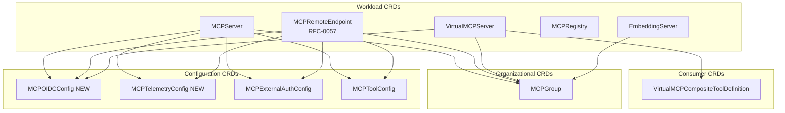

# RFC-0023: CRD v1beta1 Optimization and Configuration Extraction

- **Status**: Draft
- **Author(s)**: ToolHive Team
- **Created**: 2026-01-14
- **Last Updated**: 2026-03-18
- **Target Repository**: toolhive
- **Related Issues**:
  - [#3125](https://github.com/stacklok/toolhive/issues/3125) - Simplify VMCP Configuration
- **Related RFCs**:
  - [THV-0001](THV-0001-otel-integration-proposal.md) - OpenTelemetry integration
  - [THV-0014](THV-0014-vmcp-k8s-aware-refactor.md) - vMCP K8s-aware refactor (merged)
  - [RFC-0057](RFC-0057-mcpremoteendpoint-unified-remote-backends.md) - MCPRemoteEndpoint (deprecates MCPRemoteProxy)

## Summary

This RFC proposes improvements to ToolHive's Kubernetes CRDs for v1beta1:

1. **Extract shared OIDC and telemetry config into reusable CRDs** — following the pattern established by `MCPExternalAuthConfig`
2. **Remove deprecated fields** — `port`, `targetPort`, `toolsFilter`, `clientSecret`, `thvCABundlePath`
3. **Consolidate MCPRegistry status** — single phase derived from conditions
4. **Add CEL validation to existing unions** — `OIDCConfigRef` and `AuthzConfigRef` currently have no admission-time validation
5. **Unify CRD types with application config types** — reduce conversion bugs

These changes are a **breaking v1alpha1 → v1beta1 migration** with no conversion webhooks. Migration tooling will be provided.

## Problem Statement

### Configuration Duplication

OIDC and telemetry configurations are defined inline in multiple CRDs (MCPServer, MCPRemoteProxy, VirtualMCPServer). Platform teams managing 10+ MCPServer resources with the same OIDC provider must duplicate the full config in each resource. A single issuer URL change requires updating every resource.

```yaml
# Server A — must fully specify OIDC config
kind: MCPServer
spec:
  oidcConfig:
    type: inline
    inline:
      issuer: https://keycloak.example.com/realms/prod
      audience: toolhive-platform
      clientId: toolhive-client
      # ... 10+ more fields
---
# Server B — must DUPLICATE the same config
kind: MCPServer
spec:
  oidcConfig:
    type: inline
    inline:
      issuer: https://keycloak.example.com/realms/prod  # DUPLICATED
      audience: toolhive-platform                        # DUPLICATED
      clientId: toolhive-client                          # DUPLICATED
```

### Missing Admission-Time Validation

`OIDCConfigRef` uses a `type` discriminator field (`kubernetes`, `configMap`, `inline`) but has **no CEL validation rules** — nothing prevents setting both `configMap` and `inline` simultaneously. Validation only happens at controller reconciliation time, producing confusing error conditions instead of immediate API rejection. Compare with `MCPExternalAuthConfig` which already has CEL rules (`mcpexternalauthconfig_types.go:44-49`).

### Deprecated Fields

MCPServer includes deprecated fields with fallback helper methods:

| Field | Replacement | File:Line |
|---|---|---|
| `spec.port` | `proxyPort` | `mcpserver_types.go:96` |
| `spec.targetPort` | `mcpPort` | `mcpserver_types.go:103` |
| `spec.toolsFilter` | `toolConfigRef` | `mcpserver_types.go:175` |
| `spec.oidcConfig.inline.clientSecret` | `clientSecretRef` | `mcpserver_types.go:541` |
| `spec.oidcConfig.inline.thvCABundlePath` | `caBundleRef` | `mcpserver_types.go:553` |
| `MCPRemoteProxy.spec.port` | `proxyPort` | `mcpremoteproxy_types.go:48` |

### MCPRegistry Status Complexity

MCPRegistry has three separate phase enums:
- `Status.Phase` (`MCPRegistryPhase`: Pending/Ready/Failed/Syncing/Terminating)
- `Status.SyncStatus.Phase` (`SyncPhase`: Syncing/Complete/Failed)
- `Status.APIStatus.Phase` (`APIPhase`: NotStarted/Deploying/Ready/Unhealthy/Error)

A `DeriveOverallPhase()` method (`mcpregistry_types.go:713`) computes the top-level phase from the others. This should be replaced with standard Kubernetes conditions.

### Type Divergence Between CRD and Application Config

The CRD type `OpenTelemetryConfig` and the application type `telemetry.Config` have different shapes:

| Aspect | `telemetry.Config` (app) | CRD `OpenTelemetryConfig` |
|---|---|---|
| Structure | Flat struct | Nested (`OpenTelemetry.Metrics.*`, etc.) |
| Headers | `map[string]string` | `[]string` (key=value pairs) |
| Tracing enabled | `TracingEnabled bool` | `Tracing.Enabled bool` |
| Sampling rate | Top-level `SamplingRate` | Nested `Tracing.SamplingRate` |

This requires manual conversion code that has historically produced silent bugs ([PR #3118](https://github.com/stacklok/toolhive/pull/3118)).

## Goals

- Extract shared OIDC and telemetry configuration into reusable CRDs
- Remove deprecated fields for a clean v1beta1 API
- Consolidate MCPRegistry status to conditions-based pattern
- Add CEL validation to `OIDCConfigRef` and `AuthzConfigRef` unions
- Unify CRD and application config types where feasible
- Add printer columns to all CRDs

## Non-Goals

- **Conversion webhooks**: v1alpha1 → v1beta1 is a breaking change
- **Automatic migration**: Manual with tooling assistance
- **Changes to MCPGroup**: Already simple and effective
- **Cross-namespace references**: Same-namespace only, consistent with all existing CRDs (see [Security Considerations](#security-considerations))
- **Selector-based configuration scoping**: Explicit references are simpler
- **MCPRemoteProxy changes**: MCPRemoteProxy is being deprecated by [RFC-0057](RFC-0057-mcpremoteendpoint-unified-remote-backends.md) in favour of MCPRemoteEndpoint. Config references will be added to MCPRemoteEndpoint, not MCPRemoteProxy. MCPRemoteProxy receives no new features.

## Proposed Solution

### Overview

Extract configuration that's reused across workloads into two new CRDs:

```
CURRENT STATE (v1alpha1)                    PROPOSED STATE (v1beta1)
─────────────────────────                   ────────────────────────
MCPServer ── inline OIDCConfig              MCPServer ──ref── MCPOIDCConfig (CRD)
MCPServer ── inline TelemetryConfig         MCPServer ──ref── MCPTelemetryConfig (CRD)
MCPServer ──ref── MCPExternalAuthConfig ✓   MCPServer ──ref── MCPExternalAuthConfig ✓
MCPServer ──ref── MCPToolConfig ✓           MCPServer ──ref── MCPToolConfig ✓
```

### CRD Inventory: Before and After

**v1alpha1 (current): 9 CRDs**

| Category | CRDs |
|---|---|
| Workload | MCPServer, MCPRemoteProxy, VirtualMCPServer, MCPRegistry, EmbeddingServer |
| Configuration | MCPExternalAuthConfig, MCPToolConfig |
| Consumer | VirtualMCPCompositeToolDefinition |
| Organizational | MCPGroup |

**v1beta1 (proposed): 11 active CRDs** (+2 new, MCPRemoteProxy deprecated by RFC-0057)

| Category | CRDs | Change |
|---|---|---|
| Workload | MCPServer, **MCPRemoteEndpoint** (RFC-0057), VirtualMCPServer, MCPRegistry, EmbeddingServer | MCPRemoteProxy → MCPRemoteEndpoint |
| Configuration | MCPExternalAuthConfig, MCPToolConfig, **MCPOIDCConfig**, **MCPTelemetryConfig** | +2 new |
| Consumer | VirtualMCPCompositeToolDefinition | unchanged |
| Organizational | MCPGroup | unchanged |


```mermaid
graph TB
    subgraph "Workload CRDs"
        MCS[MCPServer]
        MRE[MCPRemoteEndpoint<br/>RFC-0057]
        VMS[VirtualMCPServer]
        MRG[MCPRegistry]
        EMB[EmbeddingServer]
    end

    subgraph "Configuration CRDs"
        OIDC[MCPOIDCConfig NEW]
        TEL[MCPTelemetryConfig NEW]
        EXT[MCPExternalAuthConfig]
        TOOL[MCPToolConfig]
    end

    subgraph "Consumer CRDs"
        CTD[VirtualMCPCompositeToolDefinition]
    end

    subgraph "Organizational CRDs"
        GRP[MCPGroup]
    end

    MCS --> OIDC
    MCS --> TEL
    MCS --> EXT
    MCS --> TOOL
    MCS --> GRP

    MRE --> OIDC
    MRE --> TEL
    MRE --> EXT
    MRE --> TOOL
    MRE --> GRP

    VMS --> OIDC
    VMS --> CTD
    VMS --> GRP

    EMB --> GRP
```

### New CRD 1: MCPOIDCConfig

Shared OIDC configuration. Supports three source variants via CEL union (no `type` discriminator — new CRDs use CEL-only validation).

**Shareable fields:**
- `issuer`, `jwksUri`, `introspectionUrl` — identity provider infrastructure
- `clientId`, `clientSecretRef` — OAuth client credentials
- `jwksAllowPrivateIP`, `insecureAllowHTTP` — security toggles
- `caBundleRef` — CA bundle for the OIDC issuer

**Per-server fields (at the reference site, NOT in MCPOIDCConfig):**
- `audience` — MUST be unique per server to prevent token replay attacks. Defaults to `{kind}/{namespace}/{name}` (e.g., `MCPServer/default/github-mcp`) if not specified, ensuring uniqueness automatically.
- `scopes` — may vary per server depending on required access

```yaml
apiVersion: toolhive.stacklok.dev/v1beta1
kind: MCPOIDCConfig
metadata:
  name: production-oidc
  namespace: mcp-platform
spec:
  # CEL: exactly one of kubernetesServiceAccount, configMapRef, or inline must be set
  inline:
    issuer: https://keycloak.example.com/realms/prod
    clientId: toolhive-client
    clientSecretRef:
      name: oidc-client-secret
      key: secret
    jwksUri: ""  # optional, discovered from issuer
status:
  observedGeneration: 1
  configHash: "sha256:abc123..."
  referencingServers:  # simple []string, matching existing MCPExternalAuthConfig pattern
    - server-a
    - server-b
  conditions:
    - type: Ready
      status: "True"
      reason: ConfigValid
```

**CEL validation rules (on `MCPOIDCConfigSpec` struct):**

```go
// +kubebuilder:validation:XValidation:rule="(has(self.kubernetesServiceAccount) ? 1 : 0) + (has(self.configMapRef) ? 1 : 0) + (has(self.inline) ? 1 : 0) == 1",message="exactly one of kubernetesServiceAccount, configMapRef, or inline must be set"
type MCPOIDCConfigSpec struct { ... }
```

**Note on existing CRDs:** `MCPExternalAuthConfig` retains its existing `type` discriminator field for backward compatibility. New CRDs use CEL-only unions.

### New CRD 2: MCPTelemetryConfig

Shared observability configuration. Uses the canonical `telemetry.Config` type from `pkg/telemetry/config.go` directly — no separate CRD-specific type.

**Shareable fields:**
- `endpoint` — collector endpoint
- `headers` — non-sensitive headers (`map[string]string`)
- `sensitiveHeaders` — credential headers via `SecretKeyRef` (e.g., OTEL auth token)
- `tracingEnabled`, `metricsEnabled`, `samplingRate`
- `insecure` — allow HTTP for collector endpoint
- `useLegacyAttributes`

**Per-server fields (at the reference site):**
- `serviceName` — MUST be unique per server for observability

```yaml
apiVersion: toolhive.stacklok.dev/v1beta1
kind: MCPTelemetryConfig
metadata:
  name: production-telemetry
  namespace: mcp-platform
spec:
  endpoint: otel-collector.monitoring.svc.cluster.local:4318
  tracingEnabled: true
  metricsEnabled: true
  samplingRate: "0.1"
  headers:
    # Non-sensitive headers only. Never put tokens here.
    X-Environment: production
  sensitiveHeaders:
    # Auth tokens via SecretKeyRef — never stored in CRD spec
    - headerName: Authorization
      valueSecretRef:
        name: otel-auth-token
        key: bearer-token
  insecure: false
status:
  observedGeneration: 1
  configHash: "sha256:def456..."
  referencingServers:
    - server-a
  conditions:
    - type: Ready
      status: "True"
```

**Why `sensitiveHeaders` instead of inline `Authorization: "Bearer ..."`:** The existing codebase pattern (`MCPExternalAuthConfig.HeaderInjectionConfig`,
`HeaderForwardConfig.AddHeadersFromSecret`) consistently uses `SecretKeyRef` for sensitive values. Storing a bearer token as a plaintext string in the CRD spec would violate this established pattern and expose credentials in etcd and `kubectl get -o yaml` output.

### Workload CRD Updates: Reference-Based Configuration

```yaml
apiVersion: toolhive.stacklok.dev/v1beta1
kind: MCPServer
metadata:
  name: github-mcp
spec:
  image: ghcr.io/github/github-mcp-server:latest
  transport: sse
  proxyPort: 8080
  mcpPort: 3000

  # OIDC with per-server audience override
  oidcConfig:
    ref:
      name: production-oidc       # same namespace only
    audience: github-mcp-server   # per-server (defaults to MCPServer/default/github-mcp if omitted)
    scopes: [openid, github:repo] # per-server

  # Telemetry with per-server service name
  telemetryConfig:
    ref:
      name: production-telemetry  # same namespace only
    serviceName: github-mcp       # per-server (required)

  # These use existing reference patterns (unchanged)
  externalAuthConfigRef:
    name: github-token-exchange
  toolConfigRef:
    name: github-tools
  groupRef:
    name: my-group
```

**Inline config remains supported** for simple deployments. Workloads can specify `oidcConfig.inline: { ... }` or `telemetryConfig.inline: { ... }` instead of `ref`. CEL rules enforce that `ref` and `inline` are mutually exclusive.

### Authorization Config

Authorization config (Cedar policies) remains inline or ConfigMap-based on the workload CRD. A dedicated `MCPAuthzConfig` CRD is **deferred** — the existing `AuthzConfigRef` with `configMapRef` already supports shared policies via ConfigMap, and Cedar policies are typically small (2-5 lines). If post-implementation feedback shows a need for a dedicated CRD, it can be added as an additive change.

The only change for authz in v1beta1 is adding CEL validation to `AuthzConfigRef` to enforce that exactly one of `configMapRef` or `inline` is set (matching the pattern added to `OIDCConfigRef`).

### Deprecated Field Removal

v1beta1 removes all deprecated fields:

| Field | Replacement | Notes |
|---|---|---|
| `MCPServer.spec.port` | `proxyPort` | Helper methods (`GetProxyPort()`) removed |
| `MCPServer.spec.targetPort` | `mcpPort` | Helper methods (`GetMcpPort()`) removed |
| `MCPServer.spec.toolsFilter` | `toolConfigRef` | Use MCPToolConfig CRD |
| `MCPRemoteProxy.spec.port` | `proxyPort` | Same pattern |
| `InlineOIDCConfig.clientSecret` | `clientSecretRef` | Plaintext secret removed |
| `InlineOIDCConfig.thvCABundlePath` | `caBundleRef` | Path-based config replaced by ConfigMap ref |

### MCPRegistry Status Consolidation

Replace three phase enums with a single phase derived from conditions:

```yaml
# v1beta1 status
status:
  phase: Ready  # derived from conditions, not independently set
  conditions:
    - type: SyncReady
      status: "True"
      reason: SyncCompleted
      lastTransitionTime: "..."
    - type: APIReady
      status: "True"
      reason: DeploymentAvailable
  sync:
    lastSyncTime: "..."
    hash: "sha256:..."
    serverCount: 42
  api:
    url: "https://..."
    replicas: 2
    availableReplicas: 2
```

Existing fields `LastManualSyncTrigger`, `LastAppliedFilterHash`, and `StorageRef` are retained in their current locations.

### Controller Reconciliation Patterns

Config CRD controllers follow the established `MCPExternalAuthConfig` pattern
(`mcpexternalauthconfig_controller.go`):

**Reference tracking:**
- Controller watches workload CRDs via `EnqueueRequestsFromMapFunc`
- On workload create/update/delete, maps event to the referenced config
- `referencingServers` status field is `[]string` (server names) — simple, matching the existing pattern (not structured `WorkloadReference` objects)

**Cascade reconciliation:**
- When config hash changes, the controller writes an annotation on each referencing workload (e.g., `toolhive.stacklok.dev/oidcconfig-hash`)
- The annotation write triggers the workload controller's reconcile loop
- This is the existing annotation-based pattern, not a pure watch-based approach

**Deletion protection:**
- Config CRDs use the same finalizer pattern as `MCPExternalAuthConfig` (`mcpexternalauthconfig_controller.go:193-237`): if `referencingServers` is non-empty, the controller blocks finalizer removal and requeus
- **Known limitation:** If the controller is down, the finalizer blocks deletion indefinitely. The resource enters `Terminating` state. Manual recovery requires editing the resource to remove the finalizer. This is documented in the operator runbook.

**Workloads must fail closed:** If a workload references an `oidcConfigRef` that does not exist or is not `Ready`, the workload controller MUST NOT deploy the workload. Set phase to `Failed` with a clear condition message. This prevents auth-bypass windows during migration or misconfiguration.

### CRD Type Unification

New CRDs use the same Go types as the application config where feasible.

**Proven pattern:** `VirtualMCPServer` already embeds `config.Config` from `pkg/vmcp/config/config.go` directly in its CRD spec
(`virtualmcpserver_types.go:68`). `VirtualMCPCompositeToolDefinition` uses inline embedding of `config.CompositeToolConfig`. Both have working deepcopy generation.

**For MCPTelemetryConfig:** The CRD spec embeds `telemetry.Config` from `pkg/telemetry/config.go` (which already has `+kubebuilder:object:generate=true` and generated deepcopy). The one breaking change is `Headers`: the app type uses `map[string]string` while the current CRD uses `[]string`. v1beta1 standardises on `map[string]string`, which is the application-native format.

**CLI-only fields** (`EnvironmentVariables`, `CustomAttributes`) in `telemetry.Config` are excluded from the CRD version via a wrapper struct that omits them with `json:"-"` tags, or by adding `+kubebuilder:validation:Optional` markers and documenting them as no-ops in CRD mode.

### CLI Mode

CRD changes are Kubernetes-only. CLI mode (`thv run`) continues to use inline configuration in RunConfig JSON. The portability principle is maintained: a workload can be exported from K8s (with dereferenced config) and run via CLI.

## Security Considerations

### Same-Namespace References Only

All existing ToolHive CRDs enforce same-namespace references:

> "Cross-namespace references are not supported for security and isolation
> reasons." — `mcpexternalauthconfig_types.go:689`, `mcpserver_types.go:179`,
> `mcpremoteproxy_types.go:87`, `toolconfig_types.go:66`

The new config CRDs (`MCPOIDCConfig`, `MCPTelemetryConfig`) follow this established policy. References do not include a `namespace` field.

**Why not cross-namespace?** Cross-namespace references create privilege escalation paths (a compromised namespace can reference another's OIDC config), require ClusterRoles (expanding blast radius), and break namespace isolation assumptions. For cluster-wide config sharing, use Helm/Kustomize to template identical config CRDs per namespace.

### Audience Uniqueness

`audience` at the reference site defaults to `{kind}/{namespace}/{name}` to prevent token replay between servers sharing the same OIDC config. If two servers in the same group specify the same audience, a token obtained for one is valid at the other. The controller SHOULD emit a Warning event when duplicate audiences are detected across workloads referencing the same
MCPOIDCConfig.

### Sensitive Data

- **No plaintext secrets in CRD specs.** Telemetry auth headers use `sensitiveHeaders` with `SecretKeyRef`, not inline string values.
- `clientSecret` removed from `InlineOIDCConfig`; use `clientSecretRef`.
- Config hashes in status for change detection without exposing values.

### RBAC Model

Config CRDs enable RBAC separation between platform teams and application teams:

- **Platform team:** Write access to MCPOIDCConfig, MCPTelemetryConfig, MCPExternalAuthConfig, MCPToolConfig
- **Application team:** Read access to config CRDs, write access to MCPServer and VirtualMCPCompositeToolDefinition

Concrete RBAC manifests will be provided in the Helm chart and documented in the operator guide.

### Migration Security

During v1alpha1 → v1beta1 migration, workloads must fail closed:

1. Create config CRDs (MCPOIDCConfig, MCPTelemetryConfig)
2. Verify they reach `Ready` state
3. Apply v1beta1 workload CRDs with references
4. Verify workloads are healthy
5. Delete v1alpha1 resources

If a workload references a config CRD that does not exist, the controller
MUST NOT deploy the workload (fail-closed, not fail-open). This prevents auth-bypass windows during partial migration.

## Alternatives Considered

### Alternative 1: Selector-Based Configuration (Istio Style)

Config applies to workloads matching label selectors. **Why not chosen:**
Conflict resolution complexity, harder to audit, implicit behaviour.

### Alternative 2: Namespace Defaults with Override

Special "default" name auto-applies to namespace. **Why not chosen:** Magic naming convention, inheritance rules add complexity.

### Alternative 3: Keep Config Embedded, Add Conversion Webhooks

Maintain v1alpha1 compatibility. **Why not chosen:** Conversion webhooks add operational complexity and don't address underlying type divergence.

### Alternative 4: Dedicated MCPAuthzConfig and MCPAggregationToolConfig CRDs

The original version of this RFC proposed 4 new CRDs. MCPAuthzConfig was dropped because the existing `AuthzConfigRef` with `configMapRef` already supports shared policies. MCPAggregationToolConfig was dropped because aggregation config is inherently per-VirtualMCPServer, not shared.

## Compatibility

### Backward Compatibility

**This is a breaking change.** v1alpha1 → v1beta1 requires manual updates.

**What breaks:**
- Inline OIDC/telemetry configs must be extracted to new CRDs or converted to the unified type format
- Deprecated fields removed
- `Headers` type changes from `[]string` to `map[string]string` on telemetry

### Migration Path

1. Create MCPOIDCConfig and MCPTelemetryConfig CRDs
2. Verify they reach `Ready` state
3. Update workload CRDs to v1beta1 with references
4. Remove deprecated fields
5. Delete v1alpha1 resources

A `thv migrate validate` CLI command will check all references are resolvable before destructive steps.

### Rollback

If v1beta1 has a critical bug:
- v1alpha1 CRD schemas can be re-applied (they are additive, not mutually exclusive with v1beta1 at the schema level)
- v1alpha1 resources must be recreated from backup
- Operators SHOULD export v1alpha1 resources before migration
- The migration validation tool includes an `export` command for backup

### API Versioning

- v1beta1 is feature-complete but may have minor additive changes
- v1beta1 → v1 will use a conversion webhook (unlike v1alpha1 → v1beta1)
- Minimum Kubernetes version: 1.29+ (CEL validation GA)

## Implementation Plan

### Phase 1: v1beta1 API Types

1. Define MCPOIDCConfig CRD types with CEL union validation
2. Define MCPTelemetryConfig CRD types using `telemetry.Config` embedding
3. Add CEL validation to existing `OIDCConfigRef` and `AuthzConfigRef`
4. Update MCPServer to v1beta1: replace inline configs with `*ConfigRef`, remove deprecated fields
5. Update MCPRemoteEndpoint (RFC-0057) to v1beta1: add config refs
6. Update VirtualMCPServer: retain embedded `config.Config`, add `oidcConfigRef`
7. Consolidate MCPRegistry status to conditions-based
8. Add printer columns to all CRDs

### Phase 2: Controller Implementation

1. MCPOIDCConfig controller (ref tracking, finalizers, cascade via annotations)
2. MCPTelemetryConfig controller (same pattern)
3. MCPServer controller: resolve config refs, watch config CRDs, add `oidcConfigHash` to status
4. MCPRemoteEndpoint controller: resolve config refs
5. VirtualMCPServer controller: resolve config refs
6. MCPRegistry controller: updated status reconciliation

### Phase 3: Release

1. Integration tests for cross-CRD reference resolution
2. E2E tests for full deployment with shared configs
3. `thv migrate validate` and `thv migrate export` CLI commands
4. Migration documentation
5. Update `docs/arch/09-operator-architecture.md`
6. Update Helm chart with config CRD templates and RBAC examples

### Dependencies

- RFC-0057 (MCPRemoteEndpoint) — config refs target MCPRemoteEndpoint, not MCPRemoteProxy
- Kubernetes 1.29+ for GA CEL validation
- Separate `operator-crds` Helm chart is retained (CRDs installed before controller for upgrade safety)

## Testing Strategy

### Unit Tests

- CRD type validation and CEL rule evaluation
- Reference resolution logic
- Controller reconciliation for both config CRDs
- Fail-closed behaviour when config ref is missing

### Integration Tests (envtest)

- Cross-CRD reference resolution (MCPServer → MCPOIDCConfig)
- Cascade reconciliation on config change
- Deletion protection (finalizer blocks delete of referenced config)
- Status propagation and config hash tracking

### E2E Tests (Chainsaw)

- Full deployment with shared OIDC config across multiple MCPServers
- Migration from v1alpha1 inline config to v1beta1 references
- Multi-team scenario: platform team manages configs, app team manages servers

### Security Tests

- Audience uniqueness warning on duplicate audiences
- Fail-closed on missing config reference (no auth-bypass window)
- Secret reference validation (no inline secrets accepted)

## Open Questions

1. **Config deletion protection mechanism:** The current MCPExternalAuthConfig uses finalizers. Should new config CRDs use the same pattern (with its stuck-resource risk when controller is down) or switch to a validating webhook? **Recommendation:** Keep finalizers for consistency with MCPExternalAuthConfig. Document manual recovery in the runbook.

2. **Cross-namespace references:** **Resolved: same-namespace only for v1beta1.** Use Helm/Kustomize to template identical configs per namespace. Cross-namespace support can be added in a future RFC with a `ReferenceGrant`-style authorization mechanism.

3. **Default configurations per namespace:** Deferred. Explicit references are simpler. Can be added as an additive change if needed.

4. **Migration timeline:** v1alpha1 will be supported for at least 2 minor releases after v1beta1 GA. v1alpha1 receives bug fixes and security patches only, no new features.

5. **`referencingServers` status size:** Using `[]string` (matching existing MCPExternalAuthConfig pattern). Each entry is ~20-40 bytes. The 1MB etcd limit means ~25,000+ entries theoretical max. This is sufficient. If usage patterns demand it, can evolve to capped list + count.

## References

- [Kubernetes API Conventions](https://github.com/kubernetes/community/blob/master/contributors/devel/sig-architecture/api-conventions.md)
- [CEL Validation in Kubernetes](https://kubernetes.io/docs/tasks/extend-kubernetes/custom-resources/custom-resource-definitions/#validation-rules)
- [Gateway API Design Principles](https://gateway-api.sigs.k8s.io/concepts/guidelines/)
- ToolHive Architecture: `docs/arch/09-operator-architecture.md`
- ToolHive vMCP Architecture: `docs/arch/10-virtual-mcp-architecture.md`

---

## RFC Lifecycle

| Date | Reviewer | Decision | Notes |
|---|---|---|---|
| 2026-01-14 | — | Draft | Initial submission |
| 2026-03-18 | Review agents | Revision | Resolved cross-namespace (same-ns only), dropped MCPAuthzConfig/MCPAggregationToolConfig, fixed telemetry token handling, aligned with RFC-0057, added fail-closed requirement, added rollback section |
