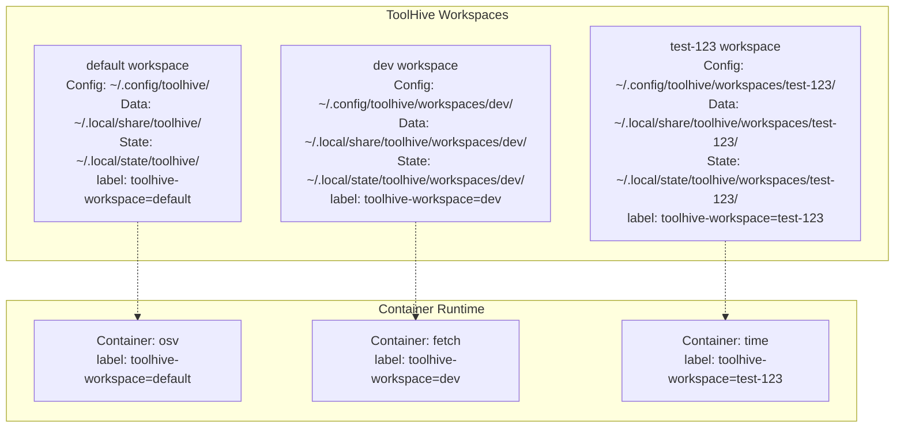

# RFC-0025: Workspace Isolation for ToolHive

- **Status**: Under Review
- **Author(s)**: Don Browne (@dmjb)
- **Created**: 2026-01-20
- **Last Updated**: 2026-01-20
- **Target Repository**: toolhive
- **Related Issues**: TBD

## Summary

This RFC proposes a workspace isolation mechanism for ToolHive that separates all state (configuration files, runtime state, containers, secrets, logs, and cache) into independent workspaces. This enables developers to run tests, development work, demos, and production workloads simultaneously on the same machine without state corruption or interference.

## Problem Statement

ToolHive relies on multiple pieces of local state to manage workloads, stored across XDG-compliant directories:
- **Configuration files**: `~/.config/toolhive/config.yaml`, `~/.config/toolhive/thvignore`
- **Runtime state**: `~/.local/state/toolhive/runconfigs/`, `~/.local/state/toolhive/groups/`
- **Workload status files**: `~/.local/share/toolhive/statuses/`
- **Container labels**: `toolhive=true` label for workload identification
- **Secrets storage**: `~/.local/share/toolhive/secrets_encrypted`
- **Logs**: `~/.local/share/toolhive/logs/`
- **Cache files**: `~/.cache/toolhive/cache/`
- **Lock files**: `.lock` files for concurrent access protection

Currently, all instances of `thv` on a machine share the same state. This creates problems for ToolHive developers who need to:
- Use ToolHive for real work (managing MCP servers for their own development)
- Run E2E tests that create/modify/delete workloads
- Test development branches that might have bugs or change state file formats
- Run demos or presentations without affecting their production environment

Any mistake in a development branch can corrupt production state. Tests that don't clean up properly leave stale containers and files. Multiple activities cannot safely coexist.

## Goals

1. **Complete state isolation**: Each workspace has its own configuration, state files, secrets, logs, cache, and container namespace
2. **Developer safety**: Enable simultaneous production use, testing, and development work without interference
3. **Backward compatibility**: Existing installations continue to work without migration (default workspace)
4. **Easy cleanup**: Delete entire workspace including all containers and files with single command
5. **Test isolation**: E2E tests can create disposable workspaces with guaranteed cleanup
6. **Simple mental model**: Workspace = isolated environment (similar to Python venv or Git worktrees)

## Non-Goals

1. **Kubernetes deployments**: K8s namespaces and separate operator deployments already provide isolation
2. **Sharing Workspaces across multiple users**: ToolHive state is per-user for API/CLI, no provision for sharing workspaces is provided.
3. **Version management**: While workspaces could help run multiple ToolHive versions, that requires additional tooling
4. **Production multi-tenancy**: Workspaces are not designed for production multi-tenant scenarios (use K8s for that)
5. **Network isolation**: Workspaces share the host network (container network isolation is a separate concern)

## Proposed Solution

### High-Level Design

A **workspace** is identified by a name (e.g., `default`, `dev`, `test-abc123`) and provides:
- Isolated directory structure for all file-based state
- Dedicated container label for filtering containers
- Separate secrets storage
- Independent configuration



### Detailed Design

#### Workspace Naming and Selection

**Workspace Names**
- Format: `[a-z0-9][-a-z0-9]*[a-z0-9]` (Kubernetes-compatible naming)
- Max length: 63 characters
- Reserved name: `default` (implicit, used when no workspace specified)
- Examples: `dev`, `test-1234`, `pr-feature-branch`, `demo`

**Selection Methods** (in order of precedence):

1. **CLI flag** (highest priority):
   ```bash
   thv --workspace=dev run github.com/modelcontextprotocol/servers/osv
   thv --workspace=test list
   ```

2. **Environment variable**:
   ```bash
   export TOOLHIVE_WORKSPACE=dev
   thv run github.com/modelcontextprotocol/servers/osv
   ```

3. **Configuration file**:
   ```bash
   thv config set workspace dev
   # Persisted in config.yaml: workspace: dev
   ```

4. **Default**: If none specified, uses `default` workspace

**Rationale**: This precedence matches standard CLI tool behavior (kubectl contexts, git config, terraform workspaces).

#### Directory Structure

ToolHive uses XDG Base Directory specification for all state. The following
shows actual paths on a typical Linux system (different base paths are used
on other operating systems, they are omitted for brevity):

**Default Workspace** (backward compatible - no path changes):
```
# Config directory (xdg.ConfigFile)
~/.config/toolhive/
├── config.yaml                           # Main configuration
├── config.yaml.lock                      # Config lock file
└── thvignore                             # Global ignore patterns

# Data directory (xdg.DataFile)
~/.local/share/toolhive/
├── statuses/                             # Workload status files
│   ├── <workload>.json
│   └── <workload>.lock
├── logs/                                 # Workload logs
│   └── <workload>.log
├── secrets_encrypted                     # Encrypted secrets storage
└── update_check_time                     # Update check timestamp

# State directory (xdg.StateHome)
~/.local/state/toolhive/
├── runconfigs/                           # Run configurations
│   └── <workload>.json
└── groups/                               # Group configurations
    └── <group>.json

# Cache directory (xdg.CacheFile)
~/.cache/toolhive/
└── cache/
    └── registry-<hash>.json              # Registry cache files
```

**Custom Workspace** (e.g., "dev"):
```
# Config directory (xdg.ConfigFile with workspace prefix)
~/.config/toolhive/workspaces/dev/
├── config.yaml
├── config.yaml.lock
└── thvignore

# Data directory (xdg.DataFile with workspace prefix)
~/.local/share/toolhive/workspaces/dev/
├── statuses/
│   ├── <workload>.json
│   └── <workload>.lock
├── logs/
│   └── <workload>.log
├── secrets_encrypted
└── update_check_time

# State directory (xdg.StateHome with workspace prefix)
~/.local/state/toolhive/workspaces/dev/
├── runconfigs/
│   └── <workload>.json
└── groups/
    └── <group>.json

# Cache directory (xdg.CacheFile with workspace prefix)
~/.cache/toolhive/workspaces/dev/
└── cache/
    └── registry-<hash>.json
```

**XDG Environment Variables**: Users can override these base directories:
- `XDG_CONFIG_HOME` (default: `~/.config`)
- `XDG_DATA_HOME` (default: `~/.local/share`)
- `XDG_STATE_HOME` (default: `~/.local/state`)
- `XDG_CACHE_HOME` (default: `~/.cache`)

**Key Decision**: The `default` workspace uses original paths without `/workspaces/default/` nesting. This ensures:
- Zero-migration upgrade path
- Existing installations work immediately
- State files remain at familiar locations
- Rollback to older versions works seamlessly

**Implementation Note**: Workspace path resolution wraps existing XDG calls:
- Default workspace: `xdg.DataFile("toolhive/statuses")` → `~/.local/share/toolhive/statuses`
- Custom workspace: `xdg.DataFile("toolhive/workspaces/dev/statuses")` → `~/.local/share/toolhive/workspaces/dev/statuses`

#### Component Changes

**New Package: `pkg/workspace/`**

```go
// pkg/workspace/context.go
package workspace

// Context represents a ToolHive workspace
type Context struct {
    Name string  // Workspace name (e.g., "dev", "default")
}

// CurrentContext returns the active workspace based on precedence:
// 1. CLI flag (--workspace)
// 2. Environment variable (TOOLHIVE_WORKSPACE)
// 3. Config file (workspace: name)
// 4. Default ("default")
func CurrentContext() (*Context, error)

// Path resolution methods - wrap XDG with workspace awareness
func (c *Context) ConfigPath(path string) (string, error)
func (c *Context) DataPath(path string) (string, error)
func (c *Context) StatePath(path string) (string, error)
func (c *Context) CachePath(path string) (string, error)

// WorkspaceInfo contains metadata about a workspace
type WorkspaceInfo struct {
    Name           string
    WorkloadCount  int       // Total workloads
    RunningCount   int       // Running workloads
    CreatedAt      time.Time
    LastUsedAt     time.Time
}

// Management functions
func List() ([]WorkspaceInfo, error)
func Create(name string) error
func Delete(name string, force bool) error
func Clean(name string) error // Stop workloads, remove containers
func Info(name string) (*WorkspaceInfo, error)
```

**Container Labels**

New label added to `pkg/labels/labels.go`:

```go
const (
    // Existing labels
    LabelToolHive     = "toolhive"          // Value: "true"
    LabelName         = "toolhive-name"     // Value: "workload-timestamp"
    LabelBaseName     = "toolhive-basename" // Value: "workload"
    LabelTransport    = "toolhive-transport"
    LabelPort         = "toolhive-port"
    LabelNetworkIsolation = "toolhive-network-isolation"
    LabelGroup        = "toolhive-group"
    LabelAuxiliary    = "toolhive-auxiliary"

    // NEW: Workspace label
    LabelWorkspace    = "toolhive-workspace" // Value: workspace name
)
```

**Label Application**:
- All containers created by ToolHive get `toolhive-workspace=<name>` label
- Container list operations filter by workspace label
- Default workspace uses `toolhive-workspace=default`

**Updated Functions**:
- `AddStandardLabels()` - Include workspace in labels
- `IsToolHiveContainer()` - Filter by toolhive=true AND toolhive-workspace=<current>
- `FormatToolHiveFilter()` - Add workspace to filter string

#### API Changes

**CLI Commands**

New `thv workspace` command with subcommands:

```bash
# List all workspaces
thv workspace list
# Output:
#   NAME      STATUS    WORKLOADS  CREATED      LAST USED
#   default   active    5          2025-01-15   2026-01-20
#   dev       inactive  2          2026-01-20   2026-01-20
#   test-123  inactive  0          2026-01-20   2026-01-20

# Show current workspace
thv workspace current
# Output: dev

# Switch workspace (updates config)
thv workspace use dev

# Create workspace explicitly (usually implicit on first use)
thv workspace create dev

# Create workspace from template (copies config from another workspace)
thv workspace create staging --template=default
# Copies config.yaml, thvignore from default workspace
# Does NOT copy: state files, secrets, logs, cache

# Show workspace details
thv workspace info dev
# Output:
#   Name:         dev
#   Status:       inactive
#   Path:         ~/.local/share/toolhive/workspaces/dev
#   Workloads:    2 (0 running, 2 stopped)
#   Created:      2026-01-20 10:30:00
#   Last Used:    2026-01-20 14:22:15

# Clean workspace (stop workloads, remove containers, keep config)
thv workspace clean dev

# Delete workspace (with confirmation prompt)
thv workspace delete test-123
# Prompt: Delete workspace 'test-123'?
#   - 2 workloads (1 running)
# Continue? [y/N]:

# Force delete without prompt
thv workspace delete test-123 --force

# Delete with lock handling
# If workspace has active locks, deletion fails by default
thv workspace delete test-123
# Error: Cannot delete workspace 'test-123': active locks detected
#   - config.yaml.lock (acquired 5 minutes ago)
#   - statuses/osv.lock (acquired 2 minutes ago)
# Use --force-unlock to override (use with caution)

# Force delete and break locks (dangerous - use only for stale locks)
thv workspace delete test-123 --force --force-unlock
```

**Global Flag**

All `thv` commands accept `--workspace` flag:

```bash
thv --workspace=dev run github.com/modelcontextprotocol/servers/osv
thv --workspace=test list
thv --workspace=dev stop osv
```

**REST API Changes**

The REST API server (`pkg/api/server.go`) will respect the workspace of the server instance:
- API server started in workspace `dev` only sees workloads in that workspace
- No cross-workspace API access (simplified security model)
- Future enhancement: Multi-workspace API with authentication/authorization

#### Workspace Templates

**Purpose**: Allow users to create new workspaces based on existing workspace configuration, reducing manual setup for common scenarios.

**Template Creation**:
```bash
# Create workspace from template
thv workspace create staging --template=default

# What gets copied:
# - config.yaml (registry URLs, OIDC settings, etc.)
# - thvignore (ignore patterns)

# What does NOT get copied:
# - State files (runconfigs/, groups/)
# - Secrets (secrets_encrypted)
# - Logs (logs/)
# - Cache (cache/)
# - Runtime state (statuses/)
```

**Implementation**:
```go
// pkg/workspace/manager.go
func CreateFromTemplate(name, template string) error {
    // 1. Validate template workspace exists
    if !workspaceExists(template) {
        return fmt.Errorf("template workspace '%s' not found", template)
    }

    // 2. Create new workspace directory structure
    if err := Create(name); err != nil {
        return err
    }

    // 3. Copy config.yaml
    srcConfig := getWorkspacePath(template, "config.yaml")
    dstConfig := getWorkspacePath(name, "config.yaml")
    if err := copyFile(srcConfig, dstConfig); err != nil {
        return err
    }

    // 4. Copy thvignore if exists
    srcIgnore := getWorkspacePath(template, "thvignore")
    if fileExists(srcIgnore) {
        dstIgnore := getWorkspacePath(name, "thvignore")
        copyFile(srcIgnore, dstIgnore) // Ignore errors (optional file)
    }

    // 5. Update workspace name in copied config
    cfg, _ := config.Load(dstConfig)
    cfg.Workspace = name
    cfg.Save()

    return nil
}
```

**Use Cases**:
- **Development**: `thv workspace create dev --template=default` to inherit registry and OIDC config
- **Testing**: `thv workspace create test-pr-123 --template=ci-base` for consistent test environments
- **Demos**: `thv workspace create demo-customer-x --template=demo-base` with pre-configured settings

**Future Enhancements**:
- Allow specifying which files to copy: `--copy=config,secrets`
- Template files in dedicated directory: `~/.config/toolhive/templates/`
- Remote templates: `--template=https://example.com/workspace-templates/dev.yaml`

#### Lock File Handling During Deletion

**Problem**: A workspace may have active lock files when user attempts deletion, indicating:
- Active `thv` operations in progress
- Stale locks from crashed processes
- Concurrent access by multiple `thv` instances

**Default Behavior**: **Fail safely**

```bash
$ thv workspace delete test-123
Error: Cannot delete workspace 'test-123': active locks detected

Active locks:
  - config.yaml.lock (acquired 5 minutes ago, PID 12345)
  - statuses/osv.lock (acquired 2 minutes ago, PID 12346)

This usually means operations are in progress. Wait for them to complete,
or use --force-unlock to break locks (use with caution for stale locks only).
```

**Force Unlock Option**: `--force-unlock`

```bash
# Break locks and delete (dangerous - only for stale locks)
$ thv workspace delete test-123 --force --force-unlock
Warning: Breaking 2 active locks. This may corrupt state if operations are in progress.
Deleted workspace 'test-123'
```

**Implementation**:
```go
// pkg/workspace/manager.go
func Delete(name string, opts DeleteOptions) error {
    // 1. Check for active locks
    locks, err := findActiveLocks(name)
    if err != nil {
        return err
    }

    if len(locks) > 0 && !opts.ForceUnlock {
        return &LockedError{
            Workspace: name,
            Locks:     locks,
            Message:   "Cannot delete workspace: active locks detected",
        }
    }

    // 2. If force-unlock, break all locks
    if opts.ForceUnlock {
        for _, lock := range locks {
            if err := breakLock(lock); err != nil {
                log.Warnf("Failed to break lock %s: %v", lock.Path, err)
            }
        }
    }

    // 3. Stop all workloads (which releases their locks)
    if err := stopAllWorkloads(name); err != nil {
        return fmt.Errorf("failed to stop workloads: %w", err)
    }

    // 4. Remove containers
    if err := removeContainers(name); err != nil {
        return fmt.Errorf("failed to remove containers: %w", err)
    }

    // 5. Delete directory structure
    return removeWorkspaceDir(name)
}

func findActiveLocks(workspace string) ([]*LockInfo, error) {
    var locks []*LockInfo
    workspaceDir := getWorkspaceDataPath(workspace)

    // Walk directory tree looking for .lock files
    filepath.Walk(workspaceDir, func(path string, info os.FileInfo, err error) error {
        if strings.HasSuffix(path, ".lock") {
            // Try to acquire lock to check if stale
            lock := lockfile.New(path)
            if err := lock.TryLock(); err != nil {
                // Lock is held - it's active
                lockInfo := &LockInfo{
                    Path:       path,
                    AcquiredAt: info.ModTime(),
                    // Try to read PID if available
                }
                locks = append(locks, lockInfo)
            } else {
                // Lock acquired = it was stale, clean it up
                lock.Unlock()
                os.Remove(path)
            }
        }
        return nil
    })

    return locks, nil
}
```

**Lock Detection Strategy**:
1. **Attempt acquisition**: Try to acquire each lock file
2. **If acquisition succeeds**: Lock was stale, remove it automatically
3. **If acquisition fails**: Lock is active, report to user
4. **Process validation**: Check if PID in lock file exists (best effort)

**Safety Guarantees**:
- Default behavior prevents data corruption from concurrent operations
- `--force-unlock` clearly marked as dangerous
- Automatic stale lock cleanup during detection
- User sees which locks are active before breaking them

#### Workspace Metadata Storage

**Metadata Types**:
1. **Created timestamp**: When workspace was first created
2. **Last used timestamp**: Last time workspace was active
3. **Workload count**: Number of workloads (running + stopped)

**Storage Strategy**: **Calculate on demand** (Phase 1)

**Rationale**:
- Simpler implementation (no metadata file to manage)
- Always accurate (no risk of stale metadata)
- Minimal performance impact (metadata only needed for `list` and `info` commands)
- No additional state to corrupt or migrate

**Implementation**:
```go
// pkg/workspace/metadata.go
type Metadata struct {
    CreatedAt  time.Time
    LastUsedAt time.Time
    Workloads  WorkloadStats
}

type WorkloadStats struct {
    Total   int
    Running int
    Stopped int
}

func GetMetadata(workspace string) (*Metadata, error) {
    meta := &Metadata{}

    // 1. Created timestamp: oldest file in workspace
    workspaceDir := getWorkspaceDataPath(workspace)
    meta.CreatedAt = getOldestFileTime(workspaceDir)

    // 2. Last used timestamp: newest file modification time
    meta.LastUsedAt = getNewestFileTime(workspaceDir)

    // 3. Workload count: count files in statuses/ and runconfigs/
    statusDir := filepath.Join(workspaceDir, "statuses")
    runConfigDir := getWorkspaceStatePath(workspace, "runconfigs")

    meta.Workloads = countWorkloads(statusDir, runConfigDir)

    return meta, nil
}

func countWorkloads(statusDir, runConfigDir string) WorkloadStats {
    stats := WorkloadStats{}

    // Count from statuses directory
    statuses, _ := filepath.Glob(filepath.Join(statusDir, "*.json"))
    for _, statusFile := range statuses {
        stats.Total++

        // Check if running by reading status
        if status := readStatus(statusFile); status == "running" {
            stats.Running++
        } else {
            stats.Stopped++
        }
    }

    return stats
}
```

**Performance Optimization**:
- Cache metadata for 1 second (avoid repeated disk scans in tight loops)
- Use goroutines for parallel metadata calculation when listing multiple workspaces

**Future Enhancement: Metadata File** (if performance becomes an issue):
```yaml
# .toolhive-workspace.yaml (optional, in workspace root)
metadata:
  created_at: 2026-01-20T10:30:00Z
  last_used_at: 2026-01-20T14:22:15Z
  workload_count: 2

# Updated by operations that modify workspace
# Allows instant metadata access without filesystem scanning
```

**When to add metadata file**:
- If `thv workspace list` becomes slow (>1s for 50 workspaces)
- If users request additional metadata (description, tags, owner)
- If metadata needs to be indexed or searched

#### Configuration Changes

**Config File Schema** (`pkg/config/config.go`)

```yaml
# New field in config.yaml
workspace: dev  # Active workspace name (default: "default")

# Existing fields remain unchanged
registry_url: https://registry.toolhive.dev
secrets:
  provider_type: encrypted
  setup_completed: true
# ... other fields
```

**Environment Variables**

- `TOOLHIVE_WORKSPACE`: Override workspace selection
- Existing variables (`TOOLHIVE_PODMAN_SOCKET`, etc.) remain unchanged

#### Data Model Changes

**Secrets Storage**

Each workspace has its own isolated secrets file:
- Default: `~/.local/share/toolhive/secrets_encrypted`
- Custom: `~/.local/share/toolhive/workspaces/<name>/secrets_encrypted`

**Implications**:
- Secrets are NOT shared between workspaces
- Users must configure secrets per workspace
- Test workspaces require separate secret setup (or use mock secrets)

**Future Enhancement**: Add `secrets.isolation_mode` config option:
- `isolated` (default): Separate secrets per workspace
- `inherit`: Read-only access to default workspace secrets
- This can be added in a future RFC if users request it

**State File Compatibility**

All state files (run configs, statuses, groups) use existing schemas. No format changes required.

#### Path Refactoring

**Affected Code Locations** (~30 files):

Replace direct `xdg.*` calls with workspace-aware paths. The `workspace.CurrentContext()` methods wrap XDG calls with workspace prefixes:

```go
// BEFORE (current code)
xdg.ConfigFile("toolhive/config.yaml")
// Returns: ~/.config/toolhive/config.yaml

// AFTER (with workspace support)
workspace.CurrentContext().ConfigPath("toolhive/config.yaml")
// Default workspace: ~/.config/toolhive/config.yaml (no prefix)
// Custom workspace "dev": ~/.config/toolhive/workspaces/dev/config.yaml
```

**Workspace Path Resolution Examples**:

```go
// Config paths (xdg.ConfigFile)
workspace.CurrentContext().ConfigPath("toolhive/config.yaml")
// default: ~/.config/toolhive/config.yaml
// dev:     ~/.config/toolhive/workspaces/dev/config.yaml

// Data paths (xdg.DataFile)
workspace.CurrentContext().DataPath("toolhive/statuses/osv.json")
// default: ~/.local/share/toolhive/statuses/osv.json
// dev:     ~/.local/share/toolhive/workspaces/dev/statuses/osv.json

// State paths (xdg.StateHome + path)
workspace.CurrentContext().StatePath("toolhive/runconfigs/osv.json")
// default: ~/.local/state/toolhive/runconfigs/osv.json
// dev:     ~/.local/state/toolhive/workspaces/dev/runconfigs/osv.json

// Cache paths (xdg.CacheFile)
workspace.CurrentContext().CachePath("toolhive/cache/registry-abc.json")
// default: ~/.cache/toolhive/cache/registry-abc.json
// dev:     ~/.cache/toolhive/workspaces/dev/cache/registry-abc.json
```

**Implementation Pattern**:

The workspace package provides methods that internally use XDG:

```go
// pkg/workspace/context.go
func (c *Context) DataPath(relativePath string) (string, error) {
    if c.Name == "default" {
        // No workspace prefix for default
        return xdg.DataFile(relativePath)
    }
    // Add workspace prefix for custom workspaces
    workspacePath := filepath.Join(
        strings.Split(relativePath, "/")[0], // e.g., "toolhive"
        "workspaces",
        c.Name,
        strings.Join(strings.Split(relativePath, "/")[1:], "/"), // rest of path
    )
    return xdg.DataFile(workspacePath)
}
```

**Files Requiring Updates**:
- `pkg/config/config.go` - Configuration paths (xdg.ConfigFile → ConfigPath)
- `pkg/state/local.go` - Run configs and groups (xdg.StateHome → StatePath)
- `pkg/workloads/statuses/file_status.go` - Status files and locks (xdg.DataFile → DataPath)
- `pkg/secrets/factory.go` - Secrets storage (xdg.DataFile → DataPath)
- `pkg/registry/provider_cached.go` - Registry cache (xdg.CacheFile → CachePath)
- `pkg/ignore/processor.go` - thvignore file (xdg.ConfigFile → ConfigPath)
- `pkg/updates/checker.go` - Update check file (xdg.DataFile → DataPath)
- `cmd/thv/app/logs.go` - Log file paths (xdg.DataFile → DataPath)
- `pkg/audit/config.go` - Audit logs if file-based (xdg.DataFile → DataPath)

(Note that PID files are omitted, they are deprecated since the status file
now stores the PID. PID files will be removed from the codebase entirely before
this work is started.)

**Container Runtime Changes**:
- `pkg/container/runtime/docker/` - Add workspace label to create/list operations
- `pkg/container/runtime/podman/` - Add workspace label to create/list operations
- `pkg/container/runtime/kubernetes/` - No changes (K8s is out of scope)

## Security Considerations

### Threat Model

**Threats Introduced**:
1. **Workspace confusion**: User might accidentally operate on wrong workspace
2. **Cross-workspace access**: Bug could allow reading state from another workspace
3. **Workspace enumeration**: Attacker could discover workspace names via filesystem
4. **Container label spoofing**: Malicious container could add ToolHive labels

**Attackers**:
- Local user with read access to ToolHive directories
- Malicious MCP server trying to escape workspace isolation
- Another process on the same machine

**Mitigations**:
1. Workspace name shown in CLI prompts and output
2. Path validation ensures no directory traversal
3. Standard Unix file permissions (0600/0750)
4. Container labels are informational only (trust container runtime security)

### Authentication and Authorization

**No changes to auth model**:
- Workspace isolation is file-based and local to the user
- Existing OIDC/OAuth authentication continues to work per workspace
- Each workspace has independent auth configuration

**Authorization**:
- Workspaces are user-scoped (no cross-user access)
- File system permissions enforce access control
- Container runtime enforces container isolation

### Data Security

**Sensitive Data**:
- Secrets stored in `secrets_encrypted` (per workspace)
- Run configs may contain environment variables
- Logs may contain sensitive data

**Protection**:
- Files use 0600 permissions (owner read/write only)
- Directories use 0750 permissions (owner rwx, group rx)
- Secrets encrypted at rest using AES-256-GCM
- No changes to existing encryption mechanisms

**Data Retention**:
- Workspaces persist until explicitly deleted
- `thv workspace delete` removes all state
- Users responsible for cleaning up test workspaces

### Input Validation

**User Input**:
- Workspace names: `[a-z0-9][-a-z0-9]*[a-z0-9]`, max 63 chars
- Path injection prevention: Reject `..`, `/`, absolute paths
- Label validation: Use existing Kubernetes label validation

**Validation Implementation**:
```go
func ValidateWorkspaceName(name string) error {
    if len(name) == 0 || len(name) > 63 {
        return fmt.Errorf("workspace name must be 1-63 characters")
    }
    if !regexp.MustCompile(`^[a-z0-9][-a-z0-9]*[a-z0-9]$`).MatchString(name) {
        return fmt.Errorf("invalid workspace name format")
    }
    if name == "." || name == ".." {
        return fmt.Errorf("invalid workspace name")
    }
    return nil
}
```

### Secrets Management

**Per-Workspace Secrets**:
- Each workspace has isolated `secrets_encrypted` file
- Secrets do NOT leak between workspaces
- Users must configure secrets for each workspace

**Implications for Testing**:
- E2E tests use test-specific secrets or mock providers
- Environment variable provider useful for CI/CD

**No changes to**:
- Encryption algorithm (AES-256-GCM)
- 1Password integration
- Environment variable provider
- Secret lifecycle

### Audit and Logging

**Audit Events**:
- Workspace creation/deletion logged (if audit enabled)
- Workspace switching logged
- File and container operations include workspace context

**Log Format**:
```json
{
  "timestamp": "2026-01-20T10:30:00Z",
  "event": "workspace.delete",
  "workspace": "test-123",
  "user": "don",
  "details": {
    "workload_count": 2
  }
}
```

### Mitigations

**Security Controls**:
1. **Input validation**: Strict workspace name validation prevents injection
2. **Path sanitization**: Workspace paths cannot escape base directories
3. **File permissions**: Standard Unix permissions (0600/0750)
4. **Label namespacing**: Container labels prefixed with `toolhive-`
5. **Isolation boundaries**: Workspaces are user-scoped only

**Attack Surface Analysis**:
- **Minimal**: Workspaces add file-based isolation, no network exposure
- **Existing controls**: Container runtime security unchanged
- **Defense in depth**: Multiple layers (filesystem, labels, runtime)

## Alternatives Considered

### Alternative 1: Docker Compose Project Names

**Description**: Use Docker Compose's project name feature to isolate containers.

**Pros**:
- Leverage existing Docker Compose tooling
- Automatic container namespacing

**Cons**:
- Requires Docker Compose as dependency
- Only solves container isolation, not file state
- Doesn't work with Podman/Colima without additional work
- Doesn't align with ToolHive's native container API usage

**Why not chosen**: Incomplete solution (files not isolated) and adds unnecessary dependency.

### Alternative 2: Environment Variable Prefix Only

**Description**: Use environment variable to change base directory (e.g., `TOOLHIVE_BASE_DIR=/tmp/dev-workspace`).

**Pros**:
- Simple implementation
- Full control over paths

**Cons**:
- No structured management (no `workspace list`, etc.)
- Users must manually create directories
- Easy to forget which workspace is active
- No cleanup automation

**Why not chosen**: Too low-level, lacks user-friendly management interface.

### Alternative 3: Docker Networks per Workspace

**Description**: Create separate Docker networks for each workspace.

**Pros**:
- Network-level isolation between workspaces
- Prevents cross-workspace container communication

**Cons**:
- Overkill for developer use case
- Adds complexity (network management)
- Doesn't solve file state isolation
- May conflict with existing network isolation feature

**Why not chosen**: Network isolation is not a goal; file and container namespace isolation is sufficient.

## Compatibility

### Backward Compatibility

**Fully backward compatible**:
- Existing installations automatically use `default` workspace
- No migration required on upgrade
- State files remain at original paths for default workspace
- CLI commands work unchanged (workspace parameter optional)

**Migration Path**:
1. User upgrades to version with workspace support
2. On first run, ToolHive detects existing state
3. Existing containers automatically tagged with `toolhive-workspace=default`
4. Config updated to set `workspace: default`
5. All commands work as before

**Opt-in Migration**:
```bash
# Check current state (shows default workspace)
thv workspace current
# Output: default

# Existing commands continue to work
thv list
thv run github.com/modelcontextprotocol/servers/osv

# Opt-in to new workspace when ready
thv --workspace=dev run ...
```

**No breaking changes**:
- API endpoints unchanged (server uses its workspace context)
- Configuration file format extended (new optional field)
- State file formats unchanged
- CLI flag names unchanged

### Forward Compatibility

**Extensibility Points**:

1. **Workspace inheritance** (future):
   ```yaml
   workspace: dev
   workspace_inherit_from: default  # Inherit config from default
   ```

2. **Secrets sharing** (future):
   ```yaml
   secrets:
     isolation_mode: inherit  # Read secrets from default workspace
   ```

3. **Multi-workspace API** (future):
   ```bash
   # API endpoint could support workspace parameter
   GET /api/v1beta/workloads?workspace=dev
   ```

4. **Workspace templates** (future):
   ```bash
   thv workspace create dev --template=default
   ```

5. **Workspace metadata** (future):
   ```yaml
   # .toolhive-workspace.yaml in workspace dir
   metadata:
     description: "Development workspace"
     created_by: "don"
     purpose: "feature-x-development"
   ```

**Design allows**:
- Adding new workspace-scoped resources
- Extending workspace management commands
- Cross-workspace operations (if needed)
- Integration with external tools (IDE plugins)

## Implementation Plan

### Phase 1: Core Infrastructure (Week 1-2)

**Goal**: Basic workspace isolation working end-to-end

**Tasks**:
1. Create `pkg/workspace/` package
   - Implement `Context` struct and path resolution
   - Implement workspace precedence logic
   - Add workspace name validation

2. Refactor XDG path usage
   - Update `pkg/config/config.go`
   - Update `pkg/state/local.go`
   - Update `pkg/workloads/statuses/file_status.go`
   - Update `pkg/secrets/factory.go`
   - Update all other XDG usage locations (~30 files)

3. Update container labels
   - Add `LabelWorkspace` to `pkg/labels/labels.go`
   - Update `AddStandardLabels()`
   - Update container filters in Docker/Podman implementations

4. Add global `--workspace` flag
   - Update `cmd/thv/app/commands.go`
   - Wire workspace context through command handlers

5. Basic testing
   - Unit tests for workspace validation
   - Unit tests for path resolution
   - Integration tests for container filtering

**Success Criteria**:
- Can run `thv --workspace=dev run ...` and see isolated state
- Containers in different workspaces don't interfere
- E2E tests can use workspace isolation

### Phase 2: Workspace Management (Week 3)

**Goal**: User-friendly workspace management commands

**Tasks**:
1. Implement `thv workspace` commands
   - `list` - Show all workspaces with metadata
   - `current` - Display active workspace
   - `use` - Switch workspace (update config)
   - `create` - Explicit workspace creation with `--template` support
   - `info` - Show workspace details
   - `clean` - Stop workloads, remove containers
   - `delete` - Remove workspace completely

2. Add workspace templates
   - Implement `CreateFromTemplate()` function
   - Copy config.yaml and thvignore from template
   - Update copied config with new workspace name
   - Add validation for template existence

3. Add workspace metadata tracking
   - Created timestamp (oldest file in workspace)
   - Last used timestamp (newest file modification)
   - Workload count (from statuses directory)
   - Implement caching (1 second TTL) for performance

4. Add lock file handling
   - Implement `findActiveLocks()` to detect active locks
   - Fail deletion by default if locks detected
   - Add `--force-unlock` flag to break stale locks
   - Automatic stale lock cleanup during detection

5. Add safety features
   - Confirmation prompts for destructive operations
   - `--force` flag to bypass prompts
   - Prevent deleting active workspace
   - Show detailed deletion impact (workload count, running status)

6. Testing
   - E2E tests for all workspace commands
   - Test workspace lifecycle (create, use, delete)
   - Test workspace templates (copy behavior, validation)
   - Test lock file handling (active locks, stale locks, force-unlock)
   - Test error cases (invalid names, missing workspaces)

**Success Criteria**:
- All workspace management commands functional
- Workspace templates working correctly (config copying)
- Safe deletion with proper confirmation and lock detection
- Metadata calculation accurate and performant
- Clear user feedback (current workspace shown)
- Lock file handling prevents corruption

### Phase 3: Migration and Polish (Week 4)

**Goal**: Production-ready with migration support

**Tasks**:
1. Implement auto-migration
   - Detect existing installations
   - Add workspace labels to existing containers
   - Set `workspace: default` in config
   - Provide user feedback during migration

2. Update documentation
   - Add workspace overview to README.md
   - Create `docs/workspaces.md` user guide
   - Update `docs/arch/` with workspace architecture
   - Generate CLI docs for `thv workspace`

3. E2E test updates
   - Update existing tests to use workspace isolation
   - Add workspace-specific test suite
   - Test migration path

4. Error handling and UX
   - Show workspace name in CLI output
   - Better error messages (e.g., "workload not found in workspace 'dev'")
   - Workspace context in log messages

5. Performance testing
   - Ensure path resolution doesn't slow down commands
   - Test with many workspaces (100+)
   - Test workspace cleanup performance

**Success Criteria**:
- Zero-friction upgrade for existing users
- Documentation complete and clear
- All E2E tests use workspace isolation
- Performance impact negligible

### Dependencies

**No external dependencies**:
- Uses existing XDG library (`github.com/adrg/xdg`)
- Uses existing container runtime abstractions
- Uses existing file locking mechanisms

**Internal dependencies**:
- Requires container runtime support (Docker/Podman/Colima)
- Requires XDG-compliant filesystem

## Testing Strategy

### Unit Tests

**Workspace Package** (`pkg/workspace/`):
- Workspace name validation
- Path resolution for each XDG directory type
- Precedence logic (flag > env > config > default)
- Edge cases (empty name, reserved names, invalid characters)

**Label Updates** (`pkg/labels/`):
- Workspace label added to standard labels
- Filter strings include workspace
- Validation for workspace labels

**Path Refactoring**:
- Each refactored package has tests for workspace-aware paths
- Test default workspace uses original paths
- Test custom workspace uses `/workspaces/<name>/` paths

### Integration Tests

**Container Isolation**:
- Create workloads in different workspaces
- Verify `thv list` only shows current workspace
- Verify container runtime filters by workspace label
- Test concurrent operations across workspaces

**File Isolation**:
- Create run configs in different workspaces
- Verify no cross-workspace file access
- Test lock files are workspace-scoped
- Test secrets isolation

### End-to-End Tests

**Workspace Lifecycle** (`test/e2e/workspace_test.go`):
```go
Describe("Workspace Management", func() {
    It("should isolate workloads between workspaces", func() {
        // Create workload in default workspace
        By("Creating workload in default workspace")
        e2e.RunThv("run", "github.com/modelcontextprotocol/servers/osv")

        // Switch to dev workspace
        By("Switching to dev workspace")
        os.Setenv("TOOLHIVE_WORKSPACE", "dev")

        // Verify workload not visible
        By("Verifying workload isolation")
        output := e2e.RunThv("list")
        Expect(output).NotTo(ContainSubstring("osv"))

        // Create workload with same name
        By("Creating workload with same name in dev workspace")
        e2e.RunThv("run", "github.com/modelcontextprotocol/servers/osv")
        Expect(output).To(ContainSubstring("osv"))
    })

    It("should delete workspace completely", func() {
        // Create workspace with workloads
        os.Setenv("TOOLHIVE_WORKSPACE", "test-delete")
        e2e.RunThv("run", "github.com/modelcontextprotocol/servers/osv")

        // Delete workspace
        output := e2e.RunThv("workspace", "delete", "test-delete", "--force")
        Expect(output).To(ContainSubstring("deleted"))

        // Verify all files removed
        path := filepath.Join(xdg.DataHome, "toolhive", "workspaces", "test-delete")
        Expect(path).NotTo(BeAnExistingFile())
    })
})
```

**API Integration** (update existing tests):
```go
BeforeEach(func() {
    // Create unique workspace per test
    workspaceName := fmt.Sprintf("test-%d", GinkgoParallelProcess())
    os.Setenv("TOOLHIVE_WORKSPACE", workspaceName)

    DeferCleanup(func() {
        cmd := exec.Command("thv", "workspace", "delete", workspaceName, "--force")
        cmd.Run()
    })

    apiServer = e2e.StartServer(config)
})
```

### Performance Tests

**Metrics to measure**:
- Command execution time with workspace resolution
- Container list operations with label filtering
- File operations (open, lock, read, write)
- Workspace metadata collection (disk usage, workload count)

**Acceptance criteria**:
- Workspace path resolution adds <10ms overhead
- Container filtering adds <50ms overhead (for 100 containers)
- Workspace list command completes in <1s (for 50 workspaces)

### Security Tests

**Validation**:
- Reject invalid workspace names (injection attempts)
- Verify path sanitization (no directory traversal)
- Test file permissions (0600 for secrets, 0750 for dirs)

**Isolation**:
- Verify no cross-workspace file access
- Verify container filters work correctly
- Test concurrent access to same workspace (lock files)

## Documentation

### User Documentation

**New Documents**:
1. **`docs/workspaces.md`** - Complete workspace guide
   - What are workspaces?
   - When to use workspaces
   - Workspace management commands
   - Example workflows (dev, testing, demo)
   - Best practices

2. **`docs/workspace-faq.md`** - Common questions
   - How do I switch workspaces?
   - Can I share secrets between workspaces?
   - How do I clean up test workspaces?
   - What happens to my existing workloads?

**Updated Documents**:
1. **`README.md`**
   - Add workspace overview section
   - Update quick start to mention default workspace
   - Add workspace examples

2. **`CONTRIBUTING.md`**
   - Add workspace best practices for developers
   - Recommend using test workspaces for E2E tests
   - Document workspace cleanup

### API Documentation

**CLI Documentation** (auto-generated via `task docs`):
- `thv_workspace.md` - Workspace command reference
- `thv_workspace_list.md`
- `thv_workspace_current.md`
- `thv_workspace_use.md`
- `thv_workspace_create.md`
- `thv_workspace_info.md`
- `thv_workspace_clean.md`
- `thv_workspace_delete.md`

**Flag Documentation**:
- Document `--workspace` global flag
- Update all command docs to mention workspace context

### Architecture Documentation

**New Documents**:
1. **`docs/arch/10-workspace-isolation.md`**
   - Workspace architecture deep dive
   - Directory structure details
   - Container label strategy
   - Path resolution logic
   - Security model

**Updated Documents**:
1. **`docs/arch/02-core-concepts.md`**
   - Add workspace as core concept
   - Update state management section

2. **`docs/arch/00-overview.md`**
   - Mention workspace isolation capability

### Runbooks

**Operational Guides**:
1. **Troubleshooting workspace issues**
   - How to recover from workspace corruption
   - How to manually clean up stale workspaces
   - How to inspect workspace state

2. **Migrating to workspaces**
   - Step-by-step migration guide
   - Rollback procedures
   - Common issues and solutions

## Open Questions

1. **Workspace inheritance**: Should custom workspaces be able to inherit configuration from the default workspace (e.g., registry URLs, OIDC settings)?
   - **Proposal**: Add this as a future enhancement if users request it
   - **For now**: Each workspace is fully independent (templates provide config copying)

2. **Workspace limits**: Should we warn or limit the number of workspaces?
   - **Concern**: Users might create many test workspaces and forget to clean up
   - **Proposal**: Add warning in `thv workspace list` if >10 workspaces exist
   - **Question**: Should we enforce a hard limit or just warn?

3. **API multi-workspace support**: Should the REST API support cross-workspace operations?
   - **Example**: `GET /api/v1beta/workspaces/dev/workloads`
   - **Proposal**: Phase 1 API is workspace-scoped; add multi-workspace API in future if needed
   - **Security concern**: Cross-workspace API requires careful authorization design

## References

- [XDG Base Directory Specification](https://specifications.freedesktop.org/basedir-spec/basedir-spec-latest.html)
- [Kubernetes Label Naming Conventions](https://kubernetes.io/docs/concepts/overview/working-with-objects/labels/#syntax-and-character-set)
- [Docker Label Filtering](https://docs.docker.com/engine/reference/commandline/ps/#filter)
- ToolHive Architecture Docs: `docs/arch/`
- ToolHive State Management: `pkg/state/`, `pkg/config/`, `pkg/workloads/statuses/`

---

## RFC Lifecycle

<!-- This section is maintained by RFC reviewers -->

### Review History

| Date | Reviewer | Decision | Notes |
|------|----------|----------|-------|
| 2026-01-20 | @dmjb | Draft | Initial submission |

### Implementation Tracking

| Repository | PR | Status |
|------------|-----|--------|
| toolhive | TBD | Not started |
