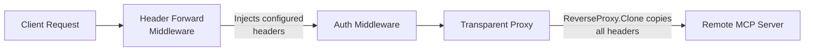

# THV-0026: Configurable Header Passthrough for Remote MCP Servers

- **Status**: Draft
- **Author(s)**: Jakub Hrozek (@jhrozek)
- **Created**: 2026-01-21
- **Last Updated**: 2026-01-23
- **Target Repository**: toolhive
- **Related Issues**: [toolhive#3316](https://github.com/stacklok/toolhive/issues/3316)

## Summary

Add server-side configuration for injecting additional HTTP headers into
requests forwarded to remote MCP servers, with support for both plaintext
and secret-backed header values.

Currently, if specific headers need to be sent to remote MCP servers, clients
must configure them individually. This approach is brittle and doesn't scale
as different MCP clients have varying configuration mechanisms, and managing
header settings across many clients is error-prone.

This RFC proposes configuring headers at the ToolHive proxy/server level,
allowing operators to specify header name-value pairs that are automatically
injected into every request to the remote server. This removes the burden
from clients and provides a single, centralized configuration point.

For sensitive header values (API keys, tokens), the feature integrates with
ToolHive's secrets manager (CLI) and Kubernetes Secrets (operator) to ensure
credentials are never stored in plaintext configuration.

## Problem Statement

### Current Behavior

ToolHive's transparent proxy (using Go's `httputil.ReverseProxy`) passes
through most HTTP headers from client requests to remote MCP servers by
default. This includes:

- Standard headers (Accept, Content-Type, etc.)
- Custom headers (X-Request-ID, X-Correlation-ID, etc.)
- Authentication headers (which are then optionally overriden by token injection or token exchange middleware)

### Affected User Scenarios

- Users proxying to remote MCP servers via `thv proxy`
- Users running remote MCP servers via `thv run http://...`
- Kubernetes operators deploying `MCPRemoteProxy` resources

## Goals

- Provide CLI flags (`--remote-forward-headers`) for `thv proxy` and `thv run` commands to inject headers
- Add `headerForward` field to the `MCPRemoteProxy` Kubernetes CRD
- Enable server-side header configuration, removing the need for client-side configuration
- Make header injection intentional, documented, and auditable
- Maintain backward compatibility with existing deployments

## Non-Goals

- Filtering or blocking headers from client requests (only adding headers)
- Modifying response headers (only request headers)
- Supporting header injection for container-based (non-remote) MCP servers
- Dynamic header values (headers are static configuration)

## Proposed Solution

### High-Level Design

The solution uses a middleware that injects configured headers into requests
before they are forwarded to the remote server. This leverages Go's
`httputil.ReverseProxy` behavior where headers on the request are cloned to
the outgoing request.



This approach follows the existing `token_injection` middleware pattern, which
sets headers on the request that are then forwarded to the backend.

### Detailed Design

#### Configuration Structure

```go
// HeaderForwardConfig defines configuration for injecting headers into requests to remote servers
type HeaderForwardConfig struct {
    // AddPlaintextHeaders is a map of header names to literal values to inject into requests.
    // WARNING: These values are stored in plaintext in the configuration.
    // For sensitive values (API keys, tokens), use AddHeadersFromSecret instead.
    AddPlaintextHeaders map[string]string `json:"addPlaintextHeaders,omitempty" yaml:"addPlaintextHeaders,omitempty"`

    // AddHeadersFromSecret is a map of header names to secret names.
    // CLI: References secrets stored in ToolHive's secrets manager.
    //      The map key is the header name, the value is the secret name.
    //      Resolved at runtime via WithSecrets().
    // K8s: See addHeadersFromSecrets in CRD (uses SecretKeyRef)
    AddHeadersFromSecret map[string]string `json:"addHeadersFromSecret,omitempty" yaml:"addHeadersFromSecret,omitempty"`
}
```

**Security Model:**
- `AddPlaintextHeaders`: Values stored as-is in RunConfig (persisted to disk). Use only for non-sensitive values.
- `AddHeadersFromSecret`: Only the secret *reference* is stored. Actual values are resolved at runtime from the secrets provider and never written to disk.

#### Restricted Headers

The middleware rejects configuration of headers that could compromise proxy behavior, violate HTTP semantics, or spoof client identity. Validation uses canonical header names and fails fast at creation time.

```go
// restrictedHeaders are headers that cannot be configured for forwarding.
// All names are in canonical form (as returned by http.CanonicalHeaderKey).
var restrictedHeaders = map[string]struct{}{
    "Host":                 {}, // Backend routing manipulation
    "Connection":           {}, // Hop-by-hop (RFC 7230 §6.1)
    "Keep-Alive":           {}, // Hop-by-hop
    "Transfer-Encoding":    {}, // Request smuggling vector
    "Te":                   {}, // Hop-by-hop (RFC 7230 §4.3)
    "Trailer":              {}, // Hop-by-hop (RFC 7230 §4.4)
    "Upgrade":              {}, // Protocol hijacking
    "Proxy-Authorization":  {}, // Hop-by-hop (RFC 7235)
    "Proxy-Authenticate":   {}, // Hop-by-hop (RFC 7235)
    "Proxy-Connection":     {}, // Non-standard hop-by-hop
    "Content-Length":        {}, // Request smuggling (CL/TE desync)
    "X-Forwarded-For":      {}, // Client identity spoofing
    "X-Forwarded-Host":     {}, // Routing confusion
    "X-Forwarded-Proto":    {}, // Protocol downgrade
    "X-Real-Ip":            {}, // Client identity spoofing
}
```

**Design rationale:**
- A **blocklist** (rather than allowlist) is used because the feature's purpose is forwarding arbitrary custom headers. An allowlist would be too restrictive and require constant updates.
- The threat model is operator misconfiguration, not adversarial input. Configuration comes from trusted operators (CLI users with filesystem access, or K8s RBAC-controlled CRD authors).
- `Authorization` is intentionally **not** blocked — it is a valid use case for static tokens via `addHeadersFromSecret`. A warning is emitted instead (see below).

**Note on `httputil.ReverseProxy`:** Go's reverse proxy strips some hop-by-hop headers from the outgoing clone, but the blocklist does not rely on this stdlib behavior. Headers like `X-Forwarded-For`, `Content-Length`, and `Host` are NOT stripped by Go's reverse proxy, so the blocklist provides defense-in-depth independent of stdlib internals.

#### Middleware Implementation

The middleware injects configured headers into every request before forwarding to the remote server. By the time the middleware runs, all secret references have been resolved to actual values (via `WithSecrets()` in CLI or env var mounting in K8s).

The function returns an error if restricted headers are configured, providing defense-in-depth independent of CLI/CRD validation.

```go
// CreateHeaderForwardMiddleware creates middleware that injects configured headers
// into requests before they are forwarded to the remote server.
// Returns an error if any configured header is in the restricted set.
func CreateHeaderForwardMiddleware(addHeaders map[string]string) (types.MiddlewareFunction, error) {
    if len(addHeaders) == 0 {
        return func(next http.Handler) http.Handler { return next }, nil
    }

    // Pre-canonicalize header names and validate against blocklist
    canonicalHeaders := make(map[string]string, len(addHeaders))
    for name, value := range addHeaders {
        canonical := http.CanonicalHeaderKey(name)
        if _, blocked := restrictedHeaders[canonical]; blocked {
            return nil, fmt.Errorf("header %q is restricted and cannot be configured for forwarding", name)
        }
        if canonical == "Authorization" {
            logger.Warnf("Header forward: configuring Authorization header directly; " +
                "ensure this does not conflict with token injection/exchange middleware")
        }
        canonicalHeaders[canonical] = value
    }

    // Log header names once at startup (never log values)
    logger.Debugf("Header forward middleware configured with headers: %v", maps.Keys(canonicalHeaders))

    return func(next http.Handler) http.Handler {
        return http.HandlerFunc(func(w http.ResponseWriter, r *http.Request) {
            for name, value := range canonicalHeaders {
                r.Header.Set(name, value)
            }
            next.ServeHTTP(w, r)
        })
    }, nil
}
```

#### Middleware Ordering

The header forward middleware is added **last** in the middleware chain, right before the proxy handler:

```
Auth Middleware → Token Injection/Exchange → Header Forward → Proxy Handler
```

This ordering ensures:
1. Headers are only injected for authenticated requests
2. Injected headers are the final state before forwarding (can't be accidentally overwritten)
3. Clear separation: all "outgoing request modification" happens at the end

#### Interaction with Token Exchange/Injection Middleware

Because header forward runs last, it will **overwrite** any header previously set by token injection or token exchange middleware. This creates a potential conflict when both are configured for the same header (e.g., `Authorization`).

To prevent silent misconfiguration, **configuration-time validation** rejects conflicting setups. This follows the existing `hasTokenExchangeMiddleware()` pattern in `pkg/transport/http.go`, which already prevents token injection from being added when token exchange is configured.

The validation checks:
- If token exchange is configured, header forward must not configure the header that token exchange targets (`Authorization` for the default/replace strategy, or the custom header name for the custom strategy).
- If token injection (OAuth token source) is configured, header forward must not configure the `Authorization` header.

Violations produce a clear startup error explaining the conflict, rather than allowing silent credential overwrites at runtime.

**Kubernetes CRD validation:** An equivalent CEL validation rule on the `MCPRemoteProxy` CRD rejects manifests that configure both `oidcConfig` (token exchange) and `headerForward` with conflicting headers.

#### Why This Works

Go's `httputil.ReverseProxy` clones the incoming request before forwarding:

```go
// Inside ReverseProxy.ServeHTTP:
outreq := req.Clone(ctx)  // All headers are copied, including those set by middleware
```

This is the same pattern used by `token_injection.go`:
```go
r.Header.Set("Authorization", fmt.Sprintf("Bearer %s", token.AccessToken))
next.ServeHTTP(w, r)  // Header reaches backend via Clone()
```

Headers set by middleware are included in the clone and forwarded to the backend.

#### CLI Changes

**Plaintext headers (non-sensitive values):**

```bash
# thv proxy
thv proxy my-server --target-uri http://api.example.com \
  --remote-forward-headers "X-Tenant-ID=tenant123" \
  --remote-forward-headers "X-Custom-Header=custom-value"

# thv run (remote)
thv run http://remote-mcp.example.com \
  --remote-forward-headers "X-Environment=production"
```

**Secret-backed headers (sensitive values):**

```bash
# First, store the secret in ToolHive's secrets manager
thv secret set my-api-key "sk-secret-value-here"

# Then reference the secret by name
thv run http://remote-mcp.example.com \
  --remote-forward-headers-secret "X-API-Key=my-api-key"

# Can combine both types
thv proxy my-server --target-uri http://api.example.com \
  --remote-forward-headers "X-Tenant-ID=tenant123" \
  --remote-forward-headers-secret "X-API-Key=my-api-key"
```

**Secret resolution flow:**
1. `--remote-forward-headers-secret "X-API-Key=my-api-key"` stores reference in RunConfig
2. RunConfig is saved to disk with reference only (e.g., `my-api-key,target=header_x_api_key`)
3. At runtime, `WithSecrets()` resolves the reference from the secrets provider
4. Actual secret value is only held in memory, never persisted

**CLI validation:**
- Restricted headers (see [Restricted Headers](#restricted-headers)) are rejected at flag parse time with a descriptive error
- If token exchange or token injection is also configured, conflicting headers are rejected at startup

#### Kubernetes CRD Changes

```yaml
apiVersion: toolhive.stacklok.io/v1alpha1
kind: MCPRemoteProxy
metadata:
  name: my-remote-proxy
spec:
  remoteURL: https://api.example.com/mcp
  oidcConfig:
    type: kubernetes
  headerForward:
    # Plaintext headers (non-sensitive values only)
    addPlaintextHeaders:
      X-Tenant-ID: "tenant123"
      X-Environment: "production"
    # Secret-backed headers (for sensitive values)
    addHeadersFromSecrets:
      - headerName: X-API-Key
        valueSecretRef:
          name: api-credentials
          key: api-key
      - headerName: X-Auth-Token
        valueSecretRef:
          name: api-credentials
          key: auth-token
---
# Referenced Kubernetes Secret
apiVersion: v1
kind: Secret
metadata:
  name: api-credentials
type: Opaque
stringData:
  api-key: "sk-secret-api-key"
  auth-token: "secret-token-value"
```

**CRD Types:**

```go
// HeaderForwardConfig defines header forward configuration for remote servers.
type HeaderForwardConfig struct {
    // AddPlaintextHeaders is a map of header names to literal values.
    // WARNING: Values are stored in plaintext. Use addHeadersFromSecrets for sensitive data.
    // +optional
    AddPlaintextHeaders map[string]string `json:"addPlaintextHeaders,omitempty"`

    // AddHeadersFromSecrets references Kubernetes Secrets for sensitive header values.
    // +optional
    AddHeadersFromSecrets []HeaderFromSecret `json:"addHeadersFromSecrets,omitempty"`
}

// HeaderFromSecret defines a header whose value comes from a Kubernetes Secret.
type HeaderFromSecret struct {
    // HeaderName is the HTTP header name (e.g., "X-API-Key")
    // +kubebuilder:validation:Required
    // +kubebuilder:validation:MinLength=1
    HeaderName string `json:"headerName"`

    // ValueSecretRef references the Secret and key containing the header value
    // +kubebuilder:validation:Required
    ValueSecretRef *SecretKeyRef `json:"valueSecretRef"`
}
```

**Secret handling:** Secrets are mounted as environment variables in the proxy pod (following the token exchange pattern). The controller validates that referenced Secrets exist during reconciliation.

#### RunConfig Changes

The `RunConfig` struct gains a new field:

```go
type RunConfig struct {
    // ... existing fields ...

    // HeaderForward contains configuration for injecting headers into requests to remote servers.
    HeaderForward *HeaderForwardConfig `json:"header_forward,omitempty" yaml:"header_forward,omitempty"`
}

// HeaderForwardConfig defines configuration for injecting headers into requests to remote servers.
type HeaderForwardConfig struct {
    // AddPlaintextHeaders contains literal header values (stored as-is).
    AddPlaintextHeaders map[string]string `json:"add_plaintext_headers,omitempty" yaml:"add_plaintext_headers,omitempty"`

    // AddHeadersFromSecret contains secret references (CLI format: "name,target=...").
    // Resolved at runtime via WithSecrets(), never persisted as plaintext.
    AddHeadersFromSecret map[string]string `json:"add_headers_from_secret,omitempty" yaml:"add_headers_from_secret,omitempty"`
}
```

**Runtime resolution in `WithSecrets()`:**

```go
// Process HeaderForward.AddHeadersFromSecret
if c.HeaderForward != nil && len(c.HeaderForward.AddHeadersFromSecret) > 0 {
    for headerName, secretRef := range c.HeaderForward.AddHeadersFromSecret {
        secretParam, err := secrets.ParseSecretParameter(secretRef)
        if err != nil {
            return c, fmt.Errorf("failed to parse header secret reference for %q: %w", headerName, err)
        }
        actualValue, err := secretManager.GetSecret(ctx, secretParam.Name)
        if err != nil {
            return c, fmt.Errorf("failed to resolve header secret %q: %w", secretParam.Name, err)
        }
        // Merge resolved secret into plaintext headers for middleware consumption
        if c.HeaderForward.AddPlaintextHeaders == nil {
            c.HeaderForward.AddPlaintextHeaders = make(map[string]string)
        }
        c.HeaderForward.AddPlaintextHeaders[headerName] = actualValue
    }
}
```

## Security Considerations

### Secrets Management

The feature provides two distinct paths for header values:

| Field | Storage | Use Case |
|-------|---------|----------|
| `addPlaintextHeaders` | Stored as-is in config | Non-sensitive values (tenant IDs, environment names) |
| `addHeadersFromSecret` | Only reference stored | Sensitive values (API keys, tokens) |

**CLI secrets flow:**
1. Secret stored in ToolHive secrets manager (`thv secret set`)
2. RunConfig stores only the reference (e.g., `my-secret,target=header_x_api_key`)
3. `WithSecrets()` resolves at runtime from encrypted storage/1Password/etc.
4. Actual value only exists in memory during execution

**Kubernetes secrets flow:**
1. Secret stored in Kubernetes Secret resource
2. CRD references Secret via `SecretKeyRef`
3. Controller mounts secret as environment variable in pod
4. Middleware reads from env var at initialization
5. Secret never appears in ConfigMaps or logs

### Authentication and Authorization

- The `Authorization` header can be configured via `addHeadersFromSecrets` for static auth
- For dynamic OAuth/OIDC, use the existing token injection middleware instead
- Header forward middleware runs **after** authentication middleware

### Input Validation

- Header names are normalized using `http.CanonicalHeaderKey()` for consistent matching
- **Restricted header blocklist**: Security-sensitive headers (see [Restricted Headers](#restricted-headers) section) are rejected at both CLI parse time and middleware creation time, preventing operators from accidentally configuring headers that could compromise proxy behavior or spoof client identity
- **Middleware conflict detection**: Configurations that would cause header forward to silently overwrite headers set by token exchange or token injection are rejected at startup (see [Interaction with Token Exchange/Injection Middleware](#interaction-with-token-exchangeinjection-middleware))
- K8s controller validates that referenced Secrets and keys exist during reconciliation
- K8s CRD uses CEL validation rules to reject restricted headers and middleware conflicts at admission time
- CLI validates secret references can be parsed before storing

### Audit and Logging

- Header names (not values) are logged at DEBUG level at startup
- Secret resolution errors are logged without exposing secret values
- No header values are ever logged

### Mitigations

1. **Explicit naming**: `addPlaintextHeaders` makes storage implications obvious
2. **Secrets integration**: First-class support for sensitive values via secrets manager
3. **No plaintext secrets in config**: Secret values never written to RunConfig or ConfigMaps
4. **Debug-only logging**: Header names only, never values
5. **Restricted header blocklist**: Prevents injection of headers that could compromise proxy behavior (hop-by-hop), enable request smuggling (`Content-Length`, `Transfer-Encoding`), or spoof client identity (`X-Forwarded-For`, `X-Real-IP`)
6. **Middleware conflict detection**: Fail-fast validation prevents silent overwrites of `Authorization` headers set by token exchange or injection middleware
7. **Authorization header warning**: When `Authorization` is configured via header forward, a startup warning is emitted to alert operators to potential middleware interactions

### Backward Compatibility

This change is fully backward compatible:

- Default behavior (no configuration) remains unchanged
- Existing deployments continue to work without modification
- The `mode` field defaults to `additive`, preserving transparent proxy behavior

### Forward Compatibility

The configuration structure supports future enhancements:

- `mode: allowlist` can be implemented later to restrict headers
- Additional fields can be added to `HeaderPassthroughConfig` as needed
- The middleware pattern allows for future header transformation features

## Documentation

- Update `thv proxy --help` with `--remote-forward-headers` flag documentation
- Update `thv run --help` with `--remote-forward-headers` flag documentation
- Add example to MCPRemoteProxy CRD reference documentation for `headerForward` field
- Document security considerations for header forwarding
