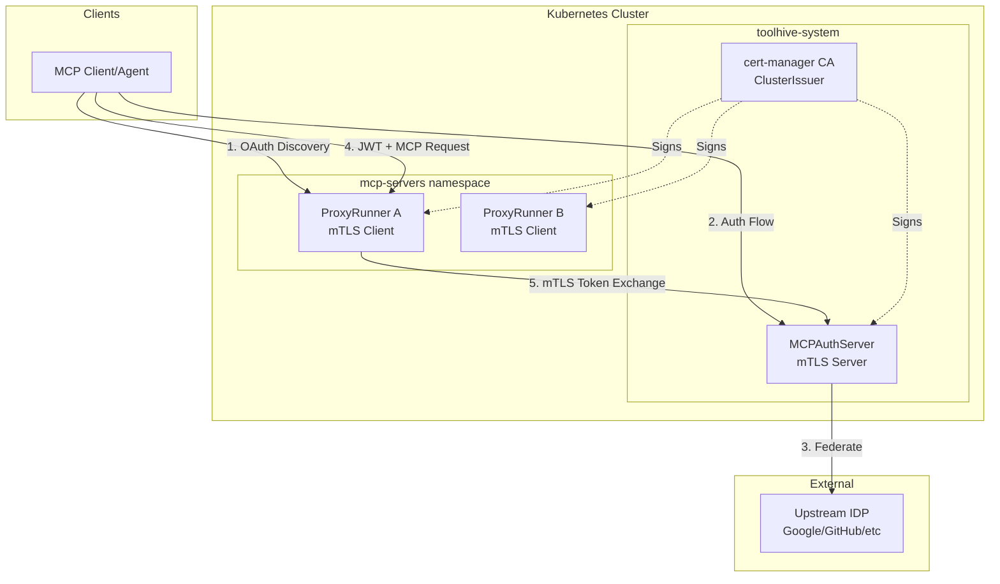

# RFC-0028: Standalone Auth Server Kubernetes Deployment

- **Status**: Draft
- **Author(s)**: Trey Grunnagle
- **Created**: 2025-01-24
- **Last Updated**: 2025-01-25
- **Target Repository**: toolhive
- **Related Issues**: [#195](https://github.com/stacklok/stacklok-epics/issues/195)

## Summary

This RFC proposes deploying `pkg/authserver` as a standalone Kubernetes service with mutual TLS (mTLS) authentication between the authserver and proxyrunner components. The design introduces a new `MCPAuthServer` CRD, adds a new `authServer` type to `MCPExternalAuthConfig` for mTLS client configuration, and implements a secure token exchange flow where proxyrunners can retrieve upstream IDP tokens from the authserver. Client certificate identity uses SPIFFE URIs for standardized workload identification.

## Problem Statement

The ToolHive authserver (`pkg/authserver/`) is a complete OAuth2/OIDC authorization server implementation built on Fosite, but it currently exists as an **unintegrated library**. While the core functionality is implemented and tested (authorization endpoints, token issuance, upstream IDP federation, PKCE support, in-memory storage), there is:

- **No deployment model**: No `cmd/thv-authserver/` entry point, no Kubernetes manifests, no CRD
- **No integration with proxyrunner**: The authserver cannot be used by MCP servers for authentication
- **No operator support**: No way to deploy or manage authserver instances via the ToolHive operator
- **No secure communication channel**: No mTLS or other mechanism for proxyrunners to securely retrieve upstream tokens

Who is affected:
- Platform operators who need centralized authentication for MCP servers in Kubernetes
- MCP server developers who need OAuth2/OIDC authentication for their tools
- Security teams requiring secure token exchange between components

Why this is worth solving:
- Enables MCP servers to authenticate users via upstream IDPs (Google, GitHub, etc.)
- Provides a centralized authentication service that multiple MCP servers can share
- Establishes secure mTLS communication for sensitive token exchange operations
- Leverages the existing, tested authserver implementation rather than building new auth infrastructure

## Goals

- Deploy authserver as a standalone Kubernetes service via a new `MCPAuthServer` CRD
- Implement mTLS authentication between proxyrunners and the authserver
- Enable secure token exchange allowing proxyrunners to retrieve upstream IDP tokens
- Integrate with cert-manager for automated certificate lifecycle management
- Support RFC 9728 OAuth Protected Resource Metadata discovery flow
- Maintain backward compatibility with existing deployments

## Non-Goals

- Implementing a distributed/persistent storage backend (Redis) - this is future work
- Multi-cluster federation or cross-cluster authentication
- Certificate revocation lists (CRL) or OCSP - mentioned as future production feature
- Custom identity providers beyond OIDC-compliant IDPs
- Direct client-to-authserver communication for token refresh (clients handle this separately)

## Proposed Solution

### High-Level Design

The solution introduces a standalone authserver deployment with mTLS securing communication between proxyrunners and the authserver.



### Detailed Design

Refer to [THV-0028-standalone-auth-server-design.md](./THV-0028-standalone-auth-server-design.md) for code snippets and additional details.

#### New MCPAuthServer CRD

A new Custom Resource Definition for deploying the authserver as a standalone service:

```yaml
apiVersion: toolhive.stacklok.dev/v1alpha1
kind: MCPAuthServer
metadata:
  name: main-authserver
  namespace: toolhive-system
spec:
  issuer: "https://mcp-authserver.toolhive-system.svc.cluster.local"
  replicas: 2
  port: 8443

  # Upstream identity providers (single IDP supported now; multiple planned for vMCP)
  upstreamIdps:
    - name: google
      type: oidc
      oidc:
        issuer: "https://accounts.google.com"
        clientId: "..."
        clientSecretRef:
          name: authserver-secrets
          key: oidc-client-secret

  # Signing keys for JWT issuance and JWKS endpoint
  # First key is active; subsequent keys advertised on JWKS for rotation
  # Key IDs (kid) computed using RFC 7638 thumbprints
  signingKeys:
    - secretRef:
        name: authserver-signing-key
        key: private.pem
      algorithm: RS256

  tls:
    serverCert:
      issuerRef:
        name: toolhive-mtls-ca
        kind: ClusterIssuer
      duration: "8760h"
      renewBefore: "720h"

    clientAuth:
      caBundle:
        configMapRef:
          name: toolhive-mtls-ca-bundle
          key: ca.crt
      # Uses SPIFFE URI format: spiffe://{trustDomain}/ns/{namespace}/mcpserver/{name}
      allowedSubjects:
        trustDomain: "toolhive.local"
        allowedNamespaces:  # Optional: restrict by namespace
          - "toolhive-system"
          - "mcp-servers"
        allowedNames:     # Optional: restrict to specific MCPServer names
          - "github-tools"
```

The MCPAuthServer controller creates:
1. **cert-manager Certificate** for server TLS
2. **Deployment** running the authserver image
3. **Service** (ClusterIP) for internal access
4. **ConfigMap** for runtime configuration
5. **ServiceAccount** for RBAC

#### MCPExternalAuthConfig Updates (authServer type)

Add a new `authServer` type to `MCPExternalAuthConfig` for configuring mTLS client certificates. This leverages the existing external auth config pattern and allows the same authserver configuration to be shared across multiple MCPServer resources.

**MCPExternalAuthConfig for authServer:**

```yaml
apiVersion: toolhive.stacklok.dev/v1alpha1
kind: MCPExternalAuthConfig
metadata:
  name: main-authserver-client
  namespace: mcp-servers
spec:
  type: authServer

  authServer:
    url: "https://mcp-authserver.toolhive-system.svc.cluster.local"

    # Controller creates cert-manager Certificate with SPIFFE URI SAN
    clientCert:
      trustDomain: "toolhive.local"
      issuerRef:
        name: toolhive-mtls-ca
        kind: ClusterIssuer

    caBundle:
      configMapRef:
        name: toolhive-mtls-ca-bundle
        key: ca.crt
```

**MCPServer referencing the authServer config:**

```yaml
apiVersion: toolhive.stacklok.dev/v1alpha1
kind: MCPServer
metadata:
  name: github-tools
  namespace: mcp-servers
spec:
  image: ghcr.io/example/github-mcp:latest

  oidcConfig:
    type: inline
    resourceUrl: "https://github-tools.example.com/"
    inline:
      issuer: "https://mcp-authserver.toolhive-system.svc.cluster.local"
      audience: "github-tools"

  # Reference the MCPExternalAuthConfig for authserver mTLS
  externalAuthConfigRef:
    name: main-authserver-client
```

The controller generates a cert-manager Certificate with:
- **CN**: `{mcpserver-name}` (human-readable for audit logs)
- **URI SAN**: `spiffe://{trustDomain}/ns/{namespace}/mcpserver/{name}`

#### OAuth Discovery Flow (RFC 9728)

Clients discover the authserver through the proxyrunner's protected resource metadata:

1. Client sends unauthenticated MCP request
2. ProxyRunner returns 401 with `WWW-Authenticate: Bearer resource_metadata="/.well-known/oauth-protected-resource"`
3. Client fetches `/.well-known/oauth-protected-resource` from proxyrunner
4. Response includes `authorization_servers` pointing to the authserver
5. Client fetches OIDC discovery from authserver
6. Client completes OAuth flow with authserver
7. Client uses issued JWT for subsequent MCP requests

#### Token Exchange Flow

When a proxyrunner needs upstream IDP tokens (e.g., to call a GitHub API):

1. Proxyrunner validates client JWT, extracts `tsid` (token session ID)
2. Proxyrunner calls authserver's `/internal/token-exchange` endpoint via mTLS
3. Authserver verifies proxyrunner's client certificate
4. Authserver validates the client JWT and retrieves stored upstream tokens
5. Authserver returns upstream access token to proxyrunner
6. Proxyrunner uses upstream token to call backend services

#### Component Changes

| Component | Changes |
|-----------|---------|
| `pkg/networking/http_client.go` | Add `WithClientCertificate()` method to `HttpClientBuilder` |
| `pkg/authserver/server/handlers/` | Add token exchange endpoint, SPIFFE ID validator, mTLS identity extraction |
| `pkg/authserver/storage/` | Add `GetUpstreamTokensForRefresh()` method |
| `pkg/auth/authserver/` | New package for proxyrunner authserver client with caching |
| `pkg/runner/config.go` | Add `AuthServerConfig` struct |
| `cmd/thv-authserver/` | New service binary entry point |
| `cmd/thv-operator/api/v1alpha1/` | New MCPAuthServer CRD, shared cert-manager types, `authServer` type added to MCPExternalAuthConfig |
| `cmd/thv-operator/controllers/` | New MCPAuthServer controller, updates to MCPExternalAuthConfig and MCPServer controllers |

**New Dependency:**
| `github.com/spiffe/go-spiffe/v2/spiffeid` | SPIFFE ID parsing and validation for mTLS client certificates |

#### API Changes

**New Token Exchange Endpoint:**

```
POST /internal/token-exchange
Content-Type: application/x-www-form-urlencoded

grant_type=urn:ietf:params:oauth:grant-type:token-exchange
subject_token={client_jwt}
subject_token_type=urn:ietf:params:oauth:token-type:jwt

Response:
{
  "access_token": "{upstream_access_token}",
  "token_type": "Bearer",
  "expires_in": 3600
}
```

**HttpClientBuilder Extension:**

```go
func (b *HttpClientBuilder) WithClientCertificate(certPath, keyPath string) *HttpClientBuilder
```

#### Configuration Changes

**RunConfig Extension:**

```json
{
  "authserver_config": {
    "url": "https://mcp-authserver.toolhive-system.svc.cluster.local",
    "client_cert_path": "/etc/toolhive/authserver-mtls/tls.crt",
    "client_key_path": "/etc/toolhive/authserver-mtls/tls.key",
    "ca_bundle_path": "/etc/toolhive/authserver-ca/ca.crt"
  }
}
```

## Security Considerations

### Threat Model

| Threat | Description | Mitigation |
|--------|-------------|------------|
| Rogue Service | Unauthorized service attempts to retrieve upstream tokens | mTLS client certificate verification with `allowedSubjects` |
| Token Theft | Attacker intercepts tokens in transit | All communication uses TLS; mTLS for sensitive token exchange |
| Session Hijacking | Compromised proxyrunner requests tokens for other sessions | Audience validation binds sessions to specific MCPServers |
| Certificate Impersonation | Attacker presents forged certificate | Certificates signed only by trusted cert-manager CA |

### Authentication and Authorization

- **Proxyrunner → Authserver**: mTLS with per-MCPServer client certificates
- **Client → Authserver**: OAuth 2.0 with PKCE
- **Certificate Identity**: SPIFFE URI SAN (`spiffe://{trustDomain}/ns/{namespace}/mcpserver/{name}`) provides standardized workload identity; CN is human-readable for audit logs
- **Subject Validation**: Configurable `allowedSubjects` restricts access by trust domain, allowed namespaces, and optionally specific MCPServer names

### Data Security

- **Upstream tokens**: Stored in authserver memory, linked to session ID (`tsid`)
- **Transit protection**: All internal communication uses mTLS
- **Token caching**: Proxyrunner caches exchanged tokens with TTL based on token expiry
- **No credential exposure**: Upstream refresh tokens never leave the authserver

### Secrets Management

| Secret | Storage | Rotation |
|--------|---------|----------|
| Server TLS certificate | Kubernetes Secret (managed by cert-manager) | Automatic via cert-manager |
| Client TLS certificates | Kubernetes Secret (managed by cert-manager) | Automatic via cert-manager |
| Upstream IDP client secret | Kubernetes Secret (referenced by CRD) | Manual rotation |
| JWT signing key | Kubernetes Secret (referenced by CRD) | Manual rotation |

### Audit and Logging

- Token exchange requests logged with proxyrunner identity (namespace, name, cert serial)
- Access denials logged with rejection reason
- Certificate validation failures logged

## Alternatives Considered

### Alternative 1: Service Mesh mTLS (Istio/Linkerd)

- **Description**: Use service mesh for mTLS instead of application-level certificates
- **Pros**: Automatic certificate management, no application changes
- **Cons**: Requires service mesh deployment, additional operational complexity, less fine-grained control over certificate subjects
- **Why not chosen**: Not all deployments use service mesh; application-level mTLS provides more control over identity binding

### Alternative 2: Shared Secret Authentication

- **Description**: Use pre-shared secrets/API keys for proxyrunner authentication
- **Pros**: Simpler implementation, no PKI required
- **Cons**: Secrets must be manually rotated, harder to audit individual proxyrunners, no cryptographic binding
- **Why not chosen**: mTLS provides stronger security guarantees and automatic rotation via cert-manager

### Alternative 3: JWT-Based Service Authentication

- **Description**: Proxyrunners use JWTs (possibly Kubernetes ServiceAccount tokens) to authenticate to authserver
- **Pros**: No additional certificates needed
- **Cons**: ServiceAccount tokens are cluster-scoped, less control over identity claims
- **Why not chosen**: mTLS provides mutual authentication and better integration with the existing certificate infrastructure

## Compatibility

### Backward Compatibility

- Existing MCPServer deployments without `externalAuthConfigRef` continue to work unchanged
- The `externalAuthConfigRef` field is optional
- Existing MCPExternalAuthConfig types (tokenExchange, headerInjection, bearerToken, unauthenticated) continue to work
- Existing proxyrunner OIDC validation continues to work (can point directly to upstream IDP or to authserver)

### Forward Compatibility

- CRD design accommodates future storage backends (Redis) via abstraction
- Certificate configuration extensible to support additional issuer types
- Token exchange endpoint follows RFC 8693 patterns for future scope expansion

## Testing Strategy

- **Unit tests**: SubjectValidator, identity extraction, token cache, HTTP client builder
- **Integration tests**: mTLS handshake, token exchange with mock authserver, certificate validation
- **End-to-end tests**: Full OAuth flow through proxyrunner to authserver, Kubernetes operator with cert-manager
- **Security tests**: Invalid certificates rejected, unauthorized namespaces denied, audience validation enforced

## Documentation

- User guide for deploying MCPAuthServer
- Configuration reference for MCPAuthServer and MCPServer CRDs
- Cert-manager integration guide (ClusterIssuer setup)
- Architecture documentation for token exchange flow
- Troubleshooting guide for mTLS issues

## Open Questions

1. Should the authserver support multiple upstream IDPs per instance, or one IDP per MCPAuthServer?

## References

- [RFC 9728: OAuth 2.0 Protected Resource Metadata](https://datatracker.ietf.org/doc/html/rfc9728)
- [RFC 8693: OAuth 2.0 Token Exchange](https://datatracker.ietf.org/doc/html/rfc8693)
- [SPIFFE: Secure Production Identity Framework for Everyone](https://spiffe.io/)
- [go-spiffe Library](https://github.com/spiffe/go-spiffe)
- [cert-manager Documentation](https://cert-manager.io/docs/)
- [Fosite OAuth2 Framework](https://github.com/ory/fosite)
- [THV-0028-standalone-auth-server-design.md](THV-0028-standalone-auth-server-design.md) - Detailed design document

---

## RFC Lifecycle

<!-- This section is maintained by RFC reviewers -->

### Review History

| Date | Reviewer | Decision | Notes |
|------|----------|----------|-------|
| 2025-01-24 | - | Draft | Initial submission |

### Implementation Tracking

| Repository | PR | Status |
|------------|-----|--------|
| toolhive | - | Pending |
