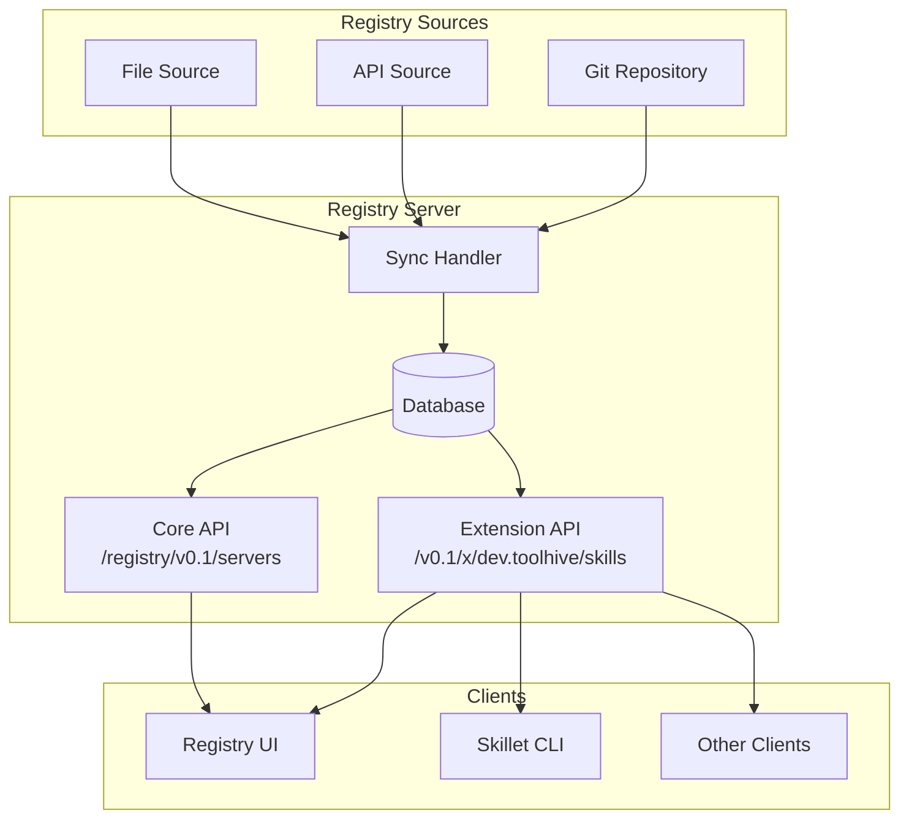

# RFC-0029: Skills Support in ToolHive Registry Server (MVP)

- **Status**: Draft
- **Author(s)**: Juan Antonio Osorio (@JAORMX)
- **Created**: 2026-01-26
- **Last Updated**: 2026-01-26
- **Target Repository**: toolhive-registry-server
- **Related Issues**: N/A

## Summary

Add Skills support to the ToolHive Registry Server, enabling discovery and cataloging of Agent Skills through the existing registry infrastructure. Skills will be integrated into subregistries alongside MCP servers, following the [Agent Skills specification](https://agentskills.io/specification) and served via upstream-compliant extension API endpoints.

## Problem Statement

### Current Limitation

ToolHive users currently have no centralized way to discover Agent Skills. While MCP servers are well-cataloged in the registry, skills exist in scattered locations with no unified discovery mechanism.

### Who is Affected

- **Development teams** struggle with onboarding because there's no unified skill catalog
- **Individual developers** cannot easily find skills relevant to their use cases
- **Organizations** lack visibility into available skills for their teams

### Why This Matters

Skills enhance AI coding assistants by providing specialized capabilities. Without centralized discovery, users must rely on word-of-mouth or manual searching, leading to duplicated effort and missed opportunities to leverage existing skills.

## Goals

- Enable skill discovery through the existing registry API using upstream-compliant extension endpoints
- Support both OCI and Git distribution methods with equal priority
- Integrate skills into subregistries alongside MCP servers, leveraging existing abstractions
- Provide basic search functionality (name/description substring matching)
- Allow system administrator curation via API (self-service through existing API mechanisms)

## Non-Goals

This MVP explicitly excludes the following features for future iterations:

- **Skill-to-MCP server dependencies** - Requires dependency resolution logic
- **Most-used/popularity metrics** - Requires usage tracking infrastructure
- **Recommended skills per MCP server** - Depends on dependency feature
- **Full-text search** - MVP uses basic substring matching
- **Skill validation/verification workflows** - Requires trust model decisions
- **Community curation** - MVP uses system administrator curation
- **Namespace ownership verification** - Requires identity/org integration

## Proposed Solution

### High-Level Design

Skills are added as a first-class resource type in the registry server, parallel to MCP servers. They are stored in the same registries and served through a new extension API that follows the upstream MCP Registry specification for extensions.



### Detailed Design

#### Data Model

The skill data model follows the [Agent Skills specification](https://agentskills.io/specification).

**Core Fields (Required):**

| Field | Type | Constraints | Description |
|-------|------|-------------|-------------|
| `namespace` | string | 3-128 chars, reverse-DNS pattern | Ownership scope (e.g., `io.github.stacklok`) |
| `name` | string | 1-64 chars, lowercase alphanumeric + hyphens | Skill identifier |
| `description` | string | 1-1024 chars | Human-readable description |
| `version` | string | Semantic version pattern | Version identifier |

**Optional Fields:**

| Field | Type | Constraints | Description |
|-------|------|-------------|-------------|
| `status` | enum | `active`, `deprecated`, `archived` | Lifecycle status (default: `active`) |
| `title` | string | max 100 chars | Human-readable display name |
| `license` | string | max 256 chars | SPDX license identifier |
| `compatibility` | string | max 500 chars | Environment requirements |
| `allowedTools` | array[string] | - | Pre-approved tools (experimental) |
| `repository` | object | - | Source repository metadata |
| `icons` | array[Icon] | - | Display icons for UI |
| `packages` | array[Package] | - | Distribution packages (OCI/Git) |
| `metadata` | object | - | Custom key-value pairs from author |
| `_meta` | object | - | Extension metadata (reverse-DNS namespacing) |

**Package Types:**

```json
// OCI Package
{
  "registryType": "oci",
  "identifier": "ghcr.io/stacklok/skills/pdf-processor:1.0.0",
  "digest": "sha256:abc123...",
  "mediaType": "application/vnd.stacklok.skillet.skill.v1"
}

// Git Package
{
  "registryType": "git",
  "url": "https://github.com/stacklok/skills.git",
  "ref": "v1.0.0",
  "commit": "abc123...",
  "subfolder": "skills/pdf-processor"
}
```

#### Database Schema Changes

The schema should follow patterns established by the existing MCP server tables, with appropriate adaptations for skills:

- **Main skill table** - Stores skill metadata including namespace, name, version, description, and optional fields. Icons and allowed_tools can be stored as JSONB columns directly in this table for simplicity (skills typically have 0-3 icons, always fetched together).
- **Skill packages table** - Stores distribution package references (OCI and Git), linked to the skill table.
- **Latest version tracking** - Mechanism to efficiently query the latest version of each skill, similar to existing server version tracking.

The implementation should include appropriate indexes for common query patterns (listing by registry, searching by name/namespace, version lookups).

#### API Changes

New endpoints follow the upstream MCP Registry extension specification using the `/v0.1/x/<namespace>/<extension>` pattern:

| Method | Endpoint | Description |
|--------|----------|-------------|
| GET | `/v0.1/x/dev.toolhive/skills` | List all skills (paginated) |
| GET | `/v0.1/x/dev.toolhive/skills/{namespace}/{name}` | Get latest version |
| GET | `/v0.1/x/dev.toolhive/skills/{namespace}/{name}/versions` | List all versions |
| GET | `/v0.1/x/dev.toolhive/skills/{namespace}/{name}/versions/{version}` | Get specific version |
| POST | `/v0.1/x/dev.toolhive/registries/{regName}/skills` | Publish skill |
| DELETE | `/v0.1/x/dev.toolhive/registries/{regName}/skills/{namespace}/{name}/versions/{version}` | Delete skill |

**Query Parameters (List endpoints):**

| Parameter | Type | Description |
|-----------|------|-------------|
| `search` | string | Filter by name/description substring |
| `namespace` | string | Filter by namespace |
| `status` | string | Filter by status (active/deprecated/archived) |
| `limit` | integer | Max results (default: 50, max: 100) |
| `cursor` | string | Pagination cursor |

**Response Format:**

```json
{
  "skills": [
    {
      "namespace": "io.github.stacklok",
      "name": "pdf-processor",
      "description": "Extract text and tables from PDF files...",
      "version": "1.0.0",
      "status": "active",
      "packages": [
        {
          "registryType": "oci",
          "identifier": "ghcr.io/stacklok/skills/pdf-processor:1.0.0"
        }
      ]
    }
  ],
  "metadata": {
    "count": 1,
    "nextCursor": "eyJuYW1lIjoicGRmLXByb2Nlc3NvciIsInZlcnNpb24iOiIxLjAuMCJ9"
  }
}
```

#### Configuration Changes

No new configuration is required. Skills are automatically enabled when present in registry files.

#### Registry File Format Changes

The registry file format is extended to include a `skills` array alongside `servers`:

```json
{
  "$schema": "...",
  "version": "1.1.0",
  "data": {
    "servers": [...],
    "skills": [
      {
        "namespace": "io.github.stacklok",
        "name": "pdf-processor",
        "description": "Extract text and tables from PDF files...",
        "version": "1.0.0",
        "packages": [
          {
            "registryType": "oci",
            "identifier": "ghcr.io/stacklok/skills/pdf-processor:1.0.0"
          }
        ]
      }
    ]
  }
}
```

The `skills` array is optional for backward compatibility.

## Security Considerations

### Threat Model

| Threat | Description | Likelihood | Impact |
|--------|-------------|------------|--------|
| Malicious skill content | Attacker publishes skill with harmful instructions | Medium | High |
| Namespace squatting | Attacker claims popular namespaces | Medium | Medium |
| Injection attacks | SQL/XSS via skill metadata fields | Low | High |
| Package URL tampering | Attacker modifies package references | Low | High |

### Authentication and Authorization

- **Read operations**: Follow existing registry auth mode (anonymous or OAuth)
- **Write operations** (POST/DELETE): Require authentication via existing OAuth/OIDC
- **No new permission models**: Reuse existing registry authorization
- **Managed registry constraint**: Only managed registries allow write operations

### Data Security

- **Skills are metadata only**: No executable content stored in the registry database
- **Package references are URLs**: Actual skill content lives in OCI registries or Git repos
- **No sensitive data**: Skills should not contain credentials or secrets
- **HTTPS required**: Icon URLs must use HTTPS

### Input Validation

| Field | Validation |
|-------|------------|
| `namespace` | Regex: `^[a-zA-Z][a-zA-Z0-9]*(?:\.[a-zA-Z][a-zA-Z0-9-]*)+$`, 3-128 chars |
| `name` | Regex: `^[a-z][a-z0-9-]{0,62}[a-z0-9]$`, 1-64 chars |
| `description` | 1-1024 chars, sanitized for XSS |
| `version` | Semantic version pattern |
| `title` | Max 100 chars |
| `license` | Max 256 chars |
| `compatibility` | Max 500 chars |
| `icon.src` | Must be HTTPS URL |
| `package.identifier` | Valid OCI reference or Git URL |

### Secrets Management

- **Not applicable**: Skills metadata does not contain secrets
- **Package access**: Clients handle authentication to OCI/Git repositories separately

### Audit and Logging

- **Skill publish events**: Log namespace, name, version, actor, timestamp
- **Skill delete events**: Log namespace, name, version, actor, timestamp
- **Failed validation**: Log attempted invalid input with sanitized details
- **Reuse existing audit infrastructure**: Follow patterns from MCP server operations

### Mitigations

| Threat | Mitigation |
|--------|------------|
| Malicious content | Content review by registry administrators; future: verification workflows |
| Namespace squatting | Future: namespace verification; MVP: admin curation |
| Injection attacks | Strict input validation, parameterized queries, output encoding |
| Package tampering | Digest verification for OCI; commit SHA for Git |

## Alternatives Considered

### Alternative 1: Separate Skills Service

- **Description**: Deploy skills as an independent microservice
- **Pros**: Independent scaling, separate deployment lifecycle
- **Cons**: Operational complexity, duplicate infrastructure, no subregistry integration
- **Why not chosen**: Adds unnecessary complexity; skills naturally fit within registry

### Alternative 2: Skills as Separate Files

- **Description**: Store skills in separate `skills.json` files, not in registry format
- **Pros**: Simpler initial implementation
- **Cons**: Doesn't leverage subregistry abstraction, skills not associated with registries
- **Why not chosen**: Loses the benefit of existing registry infrastructure

### Alternative 3: Skills in Upstream MCP Spec

- **Description**: Propose skills as part of the upstream MCP Registry specification
- **Pros**: Industry standardization
- **Cons**: Long timeline, skills not part of MCP protocol scope
- **Why not chosen**: Skills are an extension concept; use extension mechanism instead

### Alternative 4: Use `/extension/v0/` Path

- **Description**: Add skills to existing ToolHive extension API path
- **Pros**: Consistent with existing registry management endpoints
- **Cons**: Not compliant with upstream MCP Registry extension specification
- **Why not chosen**: New features should follow upstream spec patterns

## Compatibility

### Backward Compatibility

- **Fully backward compatible**: The `skills` array in registry files is optional
- **Existing registries unchanged**: Registries without skills continue to work
- **No migration required**: Existing data remains valid

### Forward Compatibility

- **Schema versioned**: Registry format version bumped to 1.1.0
- **Extensible data model**: `metadata` and `_meta` fields allow future extensions
- **API versioned**: Extension API uses versioned path (`/v0.1/x/`)

## Implementation Plan

### Phase 1: Database Schema and Queries

- Create migration `000010_add_skills.up.sql` and down migration
- Add SQL queries in `database/queries/skills.sql`
- Run `sqlc generate` to create Go types
- Unit tests for database queries

### Phase 2: Service Layer

- Create `internal/service/skill_types.go` with Go types
- Extend `RegistryService` interface with skill methods
- Implement skill methods in DB service
- Add validation logic
- Unit tests for service layer

### Phase 3: API Endpoints

- Create `internal/api/extension/x/stacklok/skills/routes.go`
- Register routes in server
- Add Swagger annotations
- Run `task docs` to regenerate OpenAPI spec
- Integration tests for API endpoints

### Phase 4: Sync Integration

- Extend registry file validator to parse skills
- Update sync handlers to process skills
- Add skills to Git, API, and File handlers
- Integration tests for sync functionality

### Dependencies

- skillet skills.json specification (already defined)
- No external dependencies required

## Documentation

- **API Documentation**: Swagger/OpenAPI spec with skill endpoints
- **User Documentation**: How to add skills to registries, query skills
- **Configuration Examples**: Registry files with skills
- **Architecture Documentation**: Update to include skills data flow

## Open Questions

1. **Namespace governance**: How should namespace ownership be verified in future phases?
2. **Skill-MCP association**: What mechanism should link skills to related MCP servers?
3. **Popularity metrics**: What telemetry infrastructure is needed for download/usage tracking?

## References

- [Agent Skills Specification](https://agentskills.io/specification)
- Skillet skills.json specification
- [MCP Registry API Extension Spec](https://github.com/modelcontextprotocol/registry/blob/main/docs/reference/api/extensions.md)
- Related RFCs:
  - THV-0004: Upstream MCP Registry Format Support
  - THV-0006: Groups in Registry
  - THV-0013: Kubernetes Registry Source Type

---

## RFC Lifecycle

<!-- This section is maintained by RFC reviewers -->

### Review History

| Date | Reviewer | Decision | Notes |
|------|----------|----------|-------|
| 2026-01-26 | @JAORMX | Draft | Initial submission |

### Implementation Tracking

| Repository | PR | Status |
|------------|-----|--------|
| toolhive-registry-server | #XXXX | Pending |
