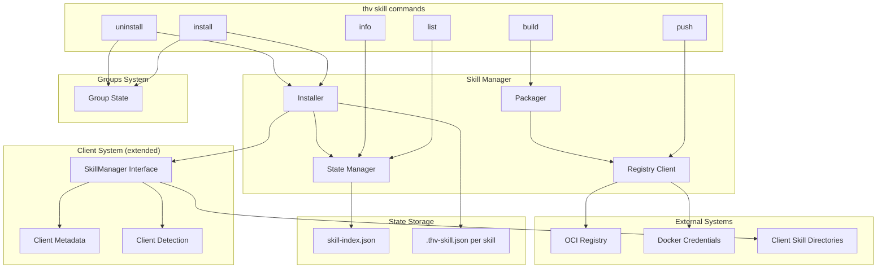

# RFC-0030: Skills Lifecycle Management in ToolHive CLI

- **Status**: Draft
- **Author(s)**: Juan Antonio Osorio (@JAORMX)
- **Created**: 2026-01-27
- **Last Updated**: 2026-01-29
- **Target Repository**: toolhive
- **Related Issues**: N/A

## Summary

This RFC proposes adding skill lifecycle management capabilities to the ToolHive CLI (`thv`), enabling users to install, remove, list, and package Agent Skills as OCI artifacts. The implementation extends ToolHive's existing `pkg/client/` infrastructure to support skills alongside MCP servers, integrates with the groups system, and ports core functionality from the Skillet tool directly into the `thv` binary.

## Problem Statement

- **No unified skill management**: Users currently juggle manual file management and separate tools (like Skillet) to manage Agent Skills, with no single source of truth.
- **No version tracking**: Skills installed manually have no metadata tracking their source, version, or installation timestamp, making upgrades impossible.
- **No visibility**: There's no way to distinguish between skills installed via a package manager versus manually created skills.
- **Team sharing challenges**: Organizations cannot easily distribute and manage skills across team members.
- **Fragmented client support**: Different AI clients have different skill directory conventions with no unified abstraction.

This was the highest-priority item (7 stars) in the January 2026 brainstorm session, with stakeholders consistently expressing the need for install/remove/list/update capabilities directly in ToolHive.

## Goals

- Enable lifecycle management of Agent Skills through dedicated `thv skill` commands
- Support installation from OCI registries with version tracking
- Distinguish between managed (installed via thv) and unmanaged (manual) skills
- Support packaging and publishing skills to any OCI-compliant registry
- Extend existing `pkg/client/` infrastructure to support skills (convergence, not duplication)
- Integrate skills with ToolHive's groups system
- Maintain backward compatibility with existing Skillet OCI artifact format

## Non-Goals

- **Auto-updates**: Automatic skill updates when registry changes (requires daemon infrastructure; post-MVP)
- **Compound skills/workflows**: Bundling multiple skills together as workflow units (separate epic)
- **Agent integration**: Managing agents alongside skills (requires additional design)
- **Skill-to-MCP dependencies**: Declaring that skills require specific MCP servers (adds complexity)
- **Telemetry/audit**: Skills are client-only constructs that bypass ToolHive's proxy (separate RFC needed)
- **Kubernetes operator integration**: Focus on CLI patterns first; K8s can follow later
- **toolhive-core library extraction**: Build inline first; extract to shared library when patterns stabilize

## Proposed Solution

### High-Level Design



### CLI Commands

All commands live under the `thv skill` namespace to avoid conflicts with existing MCP server commands.

#### `thv skill list`

Lists all installed skills (both managed and unmanaged).

```
thv skill list [flags]

Flags:
  --client string    Filter by AI client (required for filtering)
  --global           Show only global (user-wide) skills
  --local            Show only local (project-specific) skills
  --group string     Filter by group membership
  --format string    Output format: table, json, yaml (default "table")
```

**Output Example:**
```
NAME              CLIENT   SCOPE    VERSION   STATUS      GROUP         INSTALLED
commit-message    claude   global   v1.2.0    managed     development   2026-01-15
pr-review         claude   global   v1.0.0    managed     development   2026-01-10
custom-skill      claude   local    -         unmanaged   -             -
```

#### `thv skill install`

Installs a skill from an OCI registry.

```
thv skill install <reference> [flags]

Arguments:
  reference    OCI reference (e.g., ghcr.io/stacklok/skills/commit-message:v1.0.0)
               Or skill name when using -u with an already-installed skill

Flags:
  --client string    Target AI client (required)
  --global           Install globally (user-wide) (default)
  --local            Install locally (project-specific)
  --group string     Add skill to specified group
  --force            Overwrite existing unmanaged skill
  -u, --upgrade      Upgrade an already-installed skill
```

**Behavior:**
- Requires explicit `--client` selection (see rationale in Alternatives Considered)
- Pulls OCI artifact from registry
- Extracts skill files to client directory
- Creates `.thv-skill.json` metadata file
- Updates skill index
- If `--group` specified, adds skill to group state
- Reports status: `installed`, `upgraded`, or `unchanged`

**Upgrade Behavior (`-u` flag):**
- When reference is a skill name (not full OCI reference): resolves the original registry reference from `.thv-skill.json` metadata and pulls the latest tag
- When reference is a full OCI reference: installs the specified version as an upgrade
- Fails if skill is not already installed (use install without `-u` for new installations)
- Preserves group membership across upgrades

#### `thv skill uninstall`

Removes a managed skill.

```
thv skill uninstall <name> [flags]

Arguments:
  name    Skill name to remove

Flags:
  --client string    Target AI client (required)
  --global           Remove from global scope (default)
  --local            Remove from local scope
```

**Behavior:**
- Requires explicit `--client` selection
- Refuses to remove unmanaged skills
- Removes skill directory and metadata
- Updates skill index
- Removes from any group memberships

#### `thv skill info`

Shows detailed information about a skill.

```
thv skill info <name> [flags]

Arguments:
  name    Skill name or OCI reference

Flags:
  --client string    Target AI client (required for installed skills)
  --format string    Output format: table, json, yaml (default "table")
```

#### `thv skill validate`

Validates a skill directory without packaging it.

```
thv skill validate <path> [flags]

Arguments:
  path    Path to skill directory (must contain SKILL.md)

Flags:
  --format string    Output format: table, json, yaml (default "table")
```

**Validation Checks:**
- SKILL.md exists and has valid YAML frontmatter
- Required fields present (name, description)
- Name follows naming convention (`^[a-z0-9][a-z0-9-]{0,62}[a-z0-9]$`)
- Optional scripts are executable (warning if not)
- No path traversal patterns in file structure

#### `thv skill build`

Packages a skill directory into an OCI artifact.

```
thv skill build <path> [flags]

Arguments:
  path    Path to skill directory (must contain SKILL.md)

Flags:
  --tag string         Tag for the artifact (default: extracted from SKILL.md version)
  --platform strings   Target platforms (default: linux/amd64,linux/arm64)
```

**Note:** Build implicitly runs validation and fails if the skill is invalid.

#### `thv skill push`

Pushes a packaged skill to an OCI registry.

```
thv skill push <reference> [flags]

Arguments:
  reference    OCI reference including registry and tag
```

Uses Docker credentials automatically via credential helpers.

### State Management

#### Hybrid Storage Approach

**Primary Storage: Per-skill metadata file**

Each installed skill has a `.thv-skill.json` in its directory:

```json
{
  "name": "commit-message",
  "tag": "v1.2.0",
  "digest": "sha256:abc123def456...",
  "reference": "ghcr.io/stacklok/skills/commit-message:v1.2.0",
  "installed_at": "2026-01-15T10:30:00Z",
  "client": "claude",
  "scope": "global"
}
```

**Secondary Storage: Lightweight index file**

Located at `~/.local/state/toolhive/skill-index.json`:

```json
{
  "version": 1,
  "updated_at": "2026-01-27T10:30:00Z",
  "skills": {
    "commit-message:claude:global": {
      "name": "commit-message",
      "client": "claude",
      "scope": "global",
      "path": "/home/user/.claude/skills/commit-message",
      "digest": "sha256:abc123...",
      "group": "development"
    }
  }
}
```

**Rationale for Hybrid Approach:**
- Per-skill files: Graceful degradation (one corrupt file = one skill affected), portable, human-inspectable
- Index file: Fast list/filter operations without filesystem scan
- Index can be rebuilt from per-skill files on mismatch

#### Concurrency Strategy

- Per-skill files: Atomic write-rename pattern (write to `.tmp`, rename)
- Index file: Use `flock` (ToolHive already imports `github.com/gofrs/flock`)
- On conflict: Rebuild index from source of truth (per-skill files)

### Client System Convergence

ToolHive's existing `pkg/client/` system supports 23 MCP clients. We extend it for skills rather than creating separate client code.

#### Changes to Client Metadata

Extend `mcpClientConfig` with skill-specific fields:

```go
type mcpClientConfig struct {
    // Existing fields for MCP server configuration...

    // NEW: Skill-specific fields
    SupportsSkills       bool              // Whether this client supports skills
    SkillsRelPath        []string          // Relative path to skills directory
    SkillsPlatformPrefix map[string][]string // Platform-specific skill paths
}
```

#### Initial Skill Support

The following clients are supported, matching Skillet's existing implementation:

| Client | ID | Global Skills Path | Local Skills Path |
|--------|-----|-------------------|-------------------|
| Claude Code | `claude` | `~/.claude/skills/` | `.claude/skills/` |
| OpenAI Codex CLI | `codex` | `~/.codex/skills/` | `.codex/skills/` |
| GitHub Copilot | `copilot` | `~/.copilot/skills/` | `.github/skills/` |
| OpenCode | `opencode` | - | `.opencode/skill/` |

**Note:** Skills installed via Claude's plugin system (`~/.claude/plugins/cache/.../skills/`) are outside the scope of thv management. Those are managed by Claude's plugin infrastructure, not thv.

#### SkillManager Interface

```go
type SkillManager interface {
    InstallSkillToClient(ctx context.Context, skill SkillInstallRequest) error
    UninstallSkillFromClient(ctx context.Context, skillName string, client MCPClient, scope Scope) error
    ListSkillsForClient(ctx context.Context, client MCPClient) ([]InstalledSkill, error)
    GetSkillPath(client MCPClient, skillName string, scope Scope) (string, error)
    ClientSupportsSkills(client MCPClient) bool
}
```

### Groups Integration

Skills integrate with ToolHive's existing groups system:

**Group State Extension:**

```json
{
  "name": "development",
  "registered_clients": ["claude", "cursor"],
  "workloads": ["mcp-server-github", "mcp-server-slack"],
  "skills": ["commit-message", "pr-review"]
}
```

**Behavior:**
- `thv skill install --group development` adds skill to group
- `thv skill uninstall` removes skill from any groups
- `thv skill list --group <name>` shows skills installed in a group

### OCI Artifact Format

Skills are distributed as **OCI artifacts** stored in standard container registries (GHCR, ECR, Docker Hub, etc.). These are **not runnable containers** - they use OCI as a packaging and distribution format, similar to how Helm charts can be stored in OCI registries.

**Artifact Structure:**
```
OCI Image Artifact
├── Image Index (multi-platform: linux/amd64, linux/arm64)
├── Image Manifest
├── Config Blob (skill metadata stored in OCI labels)
└── Content Layer (tar.gz)
    ├── SKILL.md
    ├── scripts/
    ├── references/
    └── assets/
```

Maintains compatibility with existing Skillet format:

**Media Types:**
- Artifact Type: `application/vnd.stacklok.skillet.skill.v1`
- Config: `application/vnd.oci.image.config.v1+json`
- Layer: `application/vnd.oci.image.layer.v1.tar+gzip`

**Manifest Annotations:**
- `org.stacklok.skillet.skill.name`
- `org.stacklok.skillet.skill.description`
- `org.stacklok.skillet.skill.version`

**Reproducible Packaging:**

OCI uses content-addressable storage where every blob is identified by its SHA256 digest. For verification and supply chain security to work, the same skill content must always produce an identical digest. This requires deterministic packaging:

- Deterministic tar: sorted file entries, normalized timestamps (via `SOURCE_DATE_EPOCH`), UID/GID set to 0
- Deterministic gzip: fixed compression level, no variable header fields
- Same content always produces identical digest, enabling anyone to rebuild and verify

## Security Considerations

### Threat Model

| Threat | Description | Likelihood | Impact |
|--------|-------------|------------|--------|
| Malicious skill | User installs skill with malicious instructions | Medium | High |
| Registry compromise | Attacker pushes malicious artifact to registry | Low | High |
| Path traversal | Skill archive contains `../` paths | Medium | High |
| Symlink attack | Skill installation overwrites sensitive files via symlinks | Medium | High |
| Index corruption | Attacker corrupts skill index to hide malicious skills | Low | Medium |

### Authentication and Authorization

- **Registry authentication**: Delegates to Docker credential helpers
- **No new credentials**: Uses existing `~/.docker/config.json`
- **No privilege escalation**: Skills run with user permissions in AI client

### Data Security

- **No sensitive data stored**: Metadata contains only public information
- **Credentials never stored**: Docker credentials accessed on-demand via helpers
- **Local storage only**: State files are local to user's machine

### Input Validation

| Input | Validation | Rejection Criteria |
|-------|------------|-------------------|
| Skill name | Regex: `^[a-z0-9][a-z0-9-]{0,62}[a-z0-9]$` | Invalid characters, too long |
| OCI reference | Standard OCI reference parsing | Malformed reference |
| Archive paths | No `..`, no absolute paths, no symlinks | Path traversal attempts |
| SKILL.md | Valid YAML frontmatter | Malformed frontmatter |
| Client name | Must be in supported clients list | Unknown client |

### Secrets Management

- **No secrets stored by skill manager**: Skill metadata contains no credentials
- **Registry credentials**: Delegated to Docker credential helpers (`~/.docker/config.json`)
- **Credential helpers supported**: docker-credential-osxkeychain (macOS), docker-credential-secretservice (Linux), docker-credential-wincred (Windows)
- **No credential passthrough**: Credentials are never passed to skills or stored in skill metadata
- **Rotation**: Not applicable; credentials managed externally by Docker

### Audit and Logging

Skills are client-only constructs (files in `~/.claude/skills/`) that don't flow through ToolHive's proxy middleware. The existing audit middleware intercepts HTTP requests through the MCP proxy, which skills bypass entirely.

**Deferred to separate RFC.** A separate RFC is required to design event emission architecture for skill operations. Potential approaches include:
- Direct event emission from CLI commands to a log file
- HTTP callback to ToolHive's metrics endpoint when running
- Integration with existing audit infrastructure via a different mechanism

**Proposed skill events (for future RFC):**
- `skill_installed`, `skill_uninstalled`, `skill_upgraded`
- `skill_built`, `skill_pushed`

### Mitigations

| Threat | Mitigation |
|--------|------------|
| Malicious skill | User responsibility; future: skill signing |
| Registry compromise | Digest verification; future: Sigstore integration |
| Path traversal | Strict path validation during extraction |
| Symlink attack | Reject symlinks in archives; validate final paths |
| Index corruption | Index rebuilt from per-skill metadata files |

## Alternatives Considered

### Alternative 1: Keep Skillet Separate

- **Description**: Maintain Skillet as a separate tool, have thv invoke it
- **Pros**: Less code to port, separation of concerns
- **Cons**: Two tools to install, version coordination issues, worse UX
- **Why not chosen**: Users want single binary; integration enables better experience

### Alternative 2: SQLite for State

- **Description**: Use SQLite database instead of JSON files
- **Pros**: ACID transactions, efficient queries, handles scale
- **Cons**: New dependency (CGO or pure-Go driver), binary format, overkill for scale
- **Why not chosen**: 100s of skills doesn't justify complexity; JSON is debuggable

### Alternative 3: Single JSON State File

- **Description**: One `skills.json` tracking all skills
- **Pros**: Simple, fast reads, consistent with ToolHive patterns
- **Cons**: Corruption loses all state, concurrent write risks
- **Why not chosen**: Hybrid approach provides resilience while maintaining fast queries

### Alternative 4: Separate Skill Client Code

- **Description**: Create separate client abstraction for skills
- **Pros**: Cleaner separation, independent evolution
- **Cons**: Code duplication, divergent patterns, missed reuse opportunities
- **Why not chosen**: Extending `pkg/client/` provides unified client abstraction

### Alternative 5: Default to All Clients

- **Description**: Install to all detected clients when `--client` not specified, or auto-detect when only one client is present
- **Pros**: Simpler UX for single-client users
- **Cons**: Unexpected behavior for multi-client setups, potential for mistakes, different clients may have different skill conventions
- **Why not chosen**: Explicit selection is safer and clearer. Users working with multiple AI clients (increasingly common) benefit from explicit targeting. This follows the principle of least surprise - the command does exactly what was requested, nothing more. Skillet uses this same approach. We may reconsider this in the future based on user feedback (e.g., auto-detect when only one skill-supporting client is installed).

## Compatibility

### Backward Compatibility

- **Existing thv commands**: Unchanged; skill commands use dedicated namespace
- **Existing pkg/client/**: Extended with new fields; existing code unaffected
- **Skillet artifacts**: Full compatibility; same OCI format and media types
- **Manual skills**: Detected and listed as "unmanaged"; not modified

### Forward Compatibility

- **Index version field**: Allows schema evolution
- **Metadata version field**: Per-skill files can evolve independently
- **Extensible client metadata**: New skill-supporting clients can be added
- **Groups integration**: Skills field added to group state is optional

## Implementation Plan

### Phase 1: Core Infrastructure

- Extend client metadata with skill fields
- Implement state manager (index file + per-skill metadata)
- Port SKILL.md parser from Skillet
- Add SkillManager interface

### Phase 2: List and Info Commands

- Implement `thv skill list` command
- Implement `thv skill info` command
- Add managed vs unmanaged detection

### Phase 3: Install and Uninstall Commands

- Port OCI registry client from Skillet
- Implement `thv skill install` command
- Implement `thv skill uninstall` command
- Integrate with groups system

### Phase 4: Build and Push Commands

- Port reproducible packager from Skillet
- Implement `thv skill build` command
- Implement `thv skill push` command

### Dependencies

- ORAS library (`oras.land/oras-go/v2`) - for OCI operations
- Existing ToolHive infrastructure: `pkg/client/`, `pkg/state/`, `pkg/groups/`

## Testing Strategy

- **Unit tests**: Each component (installer, packager, state manager, client integration)
- **Integration tests**: CLI command execution with mock registry
- **E2E tests**: Full workflow with real OCI registry (GHCR)
- **Compatibility tests**: Verify Skillet artifact format compatibility
- **Security tests**: Path traversal attempts, symlink attacks, malformed archives

## Documentation

- **CLI reference**: Update `thv --help` and command documentation
- **User guide**: "Managing Agent Skills with ToolHive"
- **Migration guide**: "Migrating from Skillet to thv skill"
- **Client support matrix**: Document which clients support skills

## Open Questions

All major questions have been resolved during RFC development:

1. ~~Multi-client default behavior~~ → **Resolved: Require explicit `--client` selection**
2. ~~Group assignment integration~~ → **Resolved: Skills belong to groups via `--group` flag**
3. ~~State storage format~~ → **Resolved: Hybrid (per-skill + index file)**
4. ~~Client system convergence~~ → **Resolved: Extend pkg/client/**

## References

- [Skills Lifecycle Requirements Document](./skills-lifecycle-requirements.md)
- [Agent Skills Specification](https://agentskills.io/specification)
- [Skillet CLI](https://github.com/stacklok/skillet)
- [THV-0029: Skills Support in Registry Server](./THV-0029-skills-support-registry-server.md)
- Stakeholder meeting: January 26, 2026

---

## RFC Lifecycle

### Review History

| Date | Reviewer | Decision | Notes |
|------|----------|----------|-------|
| 2026-01-27 | - | Draft | Initial submission |

### Implementation Tracking

| Repository | PR | Status |
|------------|-----|--------|
| toolhive | - | Pending |
