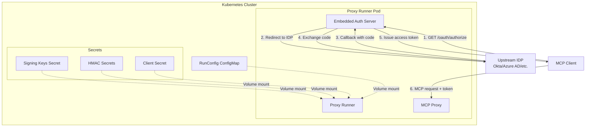

# RFC-0031: Embedded Authorization Server in Proxy Runner

- **Status**: Draft
- **Author(s)**: @tgrunnagle
- **Created**: 2026-01-27
- **Last Updated**: 2026-01-27
- **Target Repository**: toolhive
- **Related Issues**: #195

## Summary

Integrate the ToolHive authorization server (`pkg/authserver/`) into the proxy runner process for Kubernetes deployments. This enables MCP servers to have an embedded OAuth2/OIDC authorization server that authenticates users via upstream identity providers, issuing tokens that can be used to access the MCP server.

## Problem Statement

- **Current behavior**: MCP servers in Kubernetes require external authentication setup. The existing `MCPExternalAuthConfig` supports token exchange, header injection, and bearer tokens, but not a full OAuth2/OIDC authorization server for user authentication flows.

- **Who is affected**: Platform operators deploying MCP servers that need to authenticate end users via corporate identity providers (Okta, Azure AD, etc.) before granting access to MCP tools.

- **Why worth solving**: Enables secure, standards-compliant user authentication for MCP servers without requiring separate infrastructure deployment. Users can authenticate once via their corporate IDP and receive tokens to access MCP server capabilities.

## Goals

- Add a new `embeddedAuthServer` type to `MCPExternalAuthConfig` CRD
- Support signing key rotation via list of secret references (first is active, rest are on JWKS for verification)
- Support HMAC secret rotation for internal token encryption
- Support upstream identity providers (OIDC with discovery, OAuth2 with explicit endpoints)
- Mount signing keys and HMAC secrets as volumes (not environment variables) for better security
- Run the authorization server in-process with the proxy runner
- Expose OAuth2/OIDC endpoints (`/oauth/*`, `/.well-known/*`) on the proxy

## Non-Goals

- **Multi-replica support**: Memory-based storage limits to single replica (existing constraint)
- **Standalone auth server deployment**: This RFC focuses on in-process integration only
- **Multiple upstream IDPs**: Initially only one upstream provider is supported (error if multiple configured)
- **Local CLI support**: Kubernetes deployments only

---

## Proposed Solution

### High-Level Design



### Detailed Design

#### Component Changes

**1. New CRD Type: `embeddedAuthServer`**

Add to [mcpexternalauthconfig_types.go](cmd/thv-operator/api/v1alpha1/mcpexternalauthconfig_types.go):

```go
const (
    ExternalAuthTypeEmbeddedAuthServer ExternalAuthType = "embeddedAuthServer"
)
```

**2. New Controller Utility: Volume Generation**

New file [cmd/thv-operator/pkg/controllerutil/authserver.go](cmd/thv-operator/pkg/controllerutil/authserver.go):
- `GenerateAuthServerVolumes()` - Creates volume and mount configs for signing keys, HMAC secrets, and upstream client secrets
- `AddEmbeddedAuthServerConfigOptions()` - Adds auth server config to runner options

**3. New Runner Component: Embedded Auth Server Wrapper**

New file [pkg/runner/authserver.go](pkg/runner/authserver.go):
- `EmbeddedAuthServer` struct wrapping auth server lifecycle
- `NewEmbeddedAuthServer()` - Initializes from RunConfig
- `Handler()` - Returns HTTP handler for routes
- `Close()` - Cleanup resources

**4. Runner Integration**

Modify [pkg/runner/runner.go](pkg/runner/runner.go):
- Start embedded auth server in `Run()` if configured
- Mount auth server handler on transport config
- Cleanup on shutdown

**5. Transport Integration**

Modify [pkg/transport/http.go](pkg/transport/http.go):
- Add `AuthServerHandler` field to transport config
- Mount auth server routes before MCP proxy routes

#### API Changes

**New CRD Fields in MCPExternalAuthConfigSpec:**

```go
type EmbeddedAuthServerConfig struct {
    // Issuer is the issuer URL (must be https, no trailing slash)
    // +kubebuilder:validation:Required
    // +kubebuilder:validation:Pattern=`^https://[^\s/]+[^\s/]$`
    Issuer string `json:"issuer"`

    // SigningKeys for JWT signing (first is active, rest for JWKS rotation)
    // +kubebuilder:validation:Required
    // +kubebuilder:validation:MinItems=1
    // +kubebuilder:validation:MaxItems=5
    SigningKeys []SigningKeySecretRef `json:"signingKeys"`

    // HMACSecretRefs for internal token encryption (first is current, rest rotated)
    // +kubebuilder:validation:Required
    // +kubebuilder:validation:MinItems=1
    HMACSecretRefs []SecretKeyRef `json:"hmacSecretRefs"`

    // TokenLifespans configuration (optional, has defaults)
    // +optional
    TokenLifespans *TokenLifespanConfig `json:"tokenLifespans,omitempty"`

    // UpstreamProviders (currently only ONE supported; error if multiple)
    // +kubebuilder:validation:Required
    // +kubebuilder:validation:MinItems=1
    UpstreamProviders []UpstreamProviderConfig `json:"upstreamProviders"`

    // AllowedAudiences for RFC 8707 resource parameter validation
    // +optional
    AllowedAudiences []string `json:"allowedAudiences,omitempty"`
}

type SigningKeySecretRef struct {
    SecretRef SecretKeyRef `json:"secretRef"`
}

type TokenLifespanConfig struct {
    AccessTokenLifespan  string `json:"accessTokenLifespan,omitempty"`  // Default: 15m
    RefreshTokenLifespan string `json:"refreshTokenLifespan,omitempty"` // Default: 7d
    AuthCodeLifespan     string `json:"authCodeLifespan,omitempty"`     // Default: 5m
}

type UpstreamProviderConfig struct {
    Name   string              `json:"name"`
    Type   string              `json:"type"` // "oidc" or "oauth2"
    OIDC   *OIDCUpstreamConfig   `json:"oidc,omitempty"`
    OAuth2 *OAuth2UpstreamConfig `json:"oauth2,omitempty"`
}

type OIDCUpstreamConfig struct {
    IssuerURL       string        `json:"issuerUrl"`
    ClientID        string        `json:"clientId"`
    ClientSecretRef *SecretKeyRef `json:"clientSecretRef,omitempty"`
    RedirectURI     string        `json:"redirectUri"`
    Scopes          []string      `json:"scopes,omitempty"`
}

type OAuth2UpstreamConfig struct {
    AuthorizationEndpoint string        `json:"authorizationEndpoint"`
    TokenEndpoint         string        `json:"tokenEndpoint"`
    UserInfoEndpoint      string        `json:"userInfoEndpoint,omitempty"`
    ClientID              string        `json:"clientId"`
    ClientSecretRef       *SecretKeyRef `json:"clientSecretRef,omitempty"`
    RedirectURI           string        `json:"redirectUri"`
    Scopes                []string      `json:"scopes,omitempty"`
}
```

#### Configuration Changes

**RunConfig Extension** ([pkg/runner/config.go](pkg/runner/config.go)):

```go
type RunConfig struct {
    // ... existing fields ...
    EmbeddedAuthServer *EmbeddedAuthServerConfig `json:"embedded_auth_server,omitempty"`
}

type EmbeddedAuthServerConfig struct {
    Enabled              bool                    `json:"enabled"`
    Issuer               string                  `json:"issuer"`
    KeysDir              string                  `json:"keys_dir"`
    SigningKeyFile       string                  `json:"signing_key_file"`
    FallbackKeyFiles     []string                `json:"fallback_key_files,omitempty"`
    HMACSecretFiles      []string                `json:"hmac_secret_files"`
    AccessTokenLifespan  time.Duration           `json:"access_token_lifespan"`
    RefreshTokenLifespan time.Duration           `json:"refresh_token_lifespan"`
    AuthCodeLifespan     time.Duration           `json:"auth_code_lifespan"`
    AllowedAudiences     []string                `json:"allowed_audiences,omitempty"`
    UpstreamProvider     *UpstreamProviderConfig `json:"upstream_provider"`
}
```

**Example CRD:**

```yaml
apiVersion: toolhive.stacklok.dev/v1alpha1
kind: MCPExternalAuthConfig
metadata:
  name: my-auth-config
  namespace: mcp-servers
spec:
  type: embeddedAuthServer
  embeddedAuthServer:
    issuer: "https://mcp.example.com"

    signingKeys:
      - secretRef:
          name: auth-signing-key
          key: private.pem
      - secretRef:
          name: auth-signing-key-old
          key: private.pem

    hmacSecretRefs:
      - name: auth-hmac-secrets
        key: current-hmac
      - name: auth-hmac-secrets-old
        key: previous-hmac

    tokenLifespans:
      accessTokenLifespan: "15m"
      refreshTokenLifespan: "7d"
      authCodeLifespan: "5m"

    upstreamProviders:
      - name: okta
        type: oidc
        oidc:
          issuerUrl: "https://dev-123456.okta.com"
          clientId: "0oa1234567890abcdef"
          clientSecretRef:
            name: okta-client-secret
            key: secret
          redirectUri: "https://mcp.example.com/oauth/callback"
          scopes: ["openid", "profile", "email"]

    allowedAudiences:
      - "https://api.example.com"
```

#### Data Model Changes

**Volume Mount Paths:**

| Secret Type | Mount Path |
|-------------|------------|
| Signing Key (index N) | `/etc/toolhive/authserver/keys/key-{N}.pem` |
| HMAC Secret (index N) | `/etc/toolhive/authserver/hmac/hmac-{N}` |
| Upstream Client Secret | `/etc/toolhive/authserver/upstream/client-secret` |

All volumes mounted with `0400` permissions (read-only for owner).

---

## Security Considerations

### Threat Model

| Threat | Description | Likelihood | Impact |
|--------|-------------|------------|--------|
| Compromised proxy runner | Attacker gains access to process memory | Medium | Access to upstream tokens for ONE MCP server |
| Compromised auth server (standalone) | Attacker gains access to centralized auth service | Medium | Access to upstream tokens for ALL MCP servers |
| Signing key compromise | Attacker can forge JWT tokens | Low | Can impersonate any user to this MCP server |
| HMAC secret compromise | Attacker can decrypt internal tokens | Low | Can forge auth codes and refresh tokens |

### Authentication and Authorization

- Users authenticate via upstream IDP (OIDC/OAuth2)
- Auth server issues JWT access tokens with claims: `sub`, `aud`, `client_id`, `tsid` (token session ID)
- MCP server validates tokens using existing auth middleware
- PKCE (S256) required for all authorization code flows

### Data Security

- **Signing keys**: Asymmetric (RSA/ECDSA/EdDSA), private key never exposed
- **HMAC secrets**: Symmetric, used only for internal token encryption
- **Upstream tokens**: Stored in memory only, lost on pod restart
- **Data in transit**: HTTPS required for issuer URL

### Input Validation

- Issuer URL validated (https, no trailing slash)
- Redirect URIs validated per RFC 8252 (loopback only for DCR)
- Audience URIs validated per RFC 8707
- PKCE challenge method restricted to S256 only

### Secrets Management

| Secret | Storage | Rotation Support |
|--------|---------|------------------|
| Signing keys | K8s Secret → Volume | Yes, via list (first active, rest for verification) |
| HMAC secrets | K8s Secret → Volume | Yes, via list (first current, rest for decryption) |
| Upstream client secret | K8s Secret → Volume | Manual (update secret, restart pod) |

### Audit and Logging

- OAuth flow events logged at INFO level (code exchange, token issuance)
- Failed authentication attempts logged at WARN level
- No sensitive data (tokens, secrets) logged

### Mitigations

| Threat | Mitigation |
|--------|------------|
| Compromised proxy runner | **Per-workload isolation** - each MCP server has its own auth server; blast radius limited to one workload |
| Key compromise | **Key rotation** - old keys removed after token expiration; JWKS endpoint updated atomically |
| Memory exposure | **Ephemeral storage** - tokens lost on pod restart; no persistent state |
| Secret exposure | **Volume mounts** - secrets not in environment variables; restricted file permissions (0400) |

---

## Alternatives Considered

### Alternative 1: Standalone Auth Server Deployment

- **Description**: Deploy auth server as a separate K8s Deployment, accessed by proxy runners via network
- **Pros**:
  - Token isolation (upstream refresh tokens never reach proxy runner)
  - Can serve multiple MCP servers
- **Cons**:
  - Requires mTLS between auth server and proxy runners
  - Token exchange endpoint becomes additional attack surface
  - Centralized auth server = larger blast radius if compromised (ALL MCP servers' tokens)
  - Higher operational complexity
- **Why not chosen**: Worse security profile (centralized compromise affects all workloads) and higher operational burden outweigh token isolation benefit

### Alternative 2: External Auth Server Integration

- **Description**: Integrate with external OAuth2/OIDC provider directly (not self-hosted)
- **Pros**:
  - No auth server to manage
  - Leverages existing identity infrastructure
- **Cons**:
  - External IDPs don't support MCP-specific claims
  - No control over token lifespans or audiences
  - Cannot issue tokens bound to specific MCP servers
- **Why not chosen**: Need custom token issuance with MCP-specific claims and audiences

---

## Compatibility

### Backward Compatibility

- **Fully backward compatible**: New auth type added to existing enum
- Existing `tokenExchange`, `headerInjection`, `bearerToken`, `unauthenticated` types unchanged
- No migration required for existing MCPExternalAuthConfig resources

### Forward Compatibility

- **Upstream providers list**: Designed as list for future multi-IDP support (currently validated to require exactly one)
- **Signing keys list**: Supports rotation without schema changes
- **HMAC secrets list**: Supports rotation without schema changes

---

## Implementation Plan

### Phase 1: CRD Changes

- Add `EmbeddedAuthServerConfig` types to `mcpexternalauthconfig_types.go`
- Run `task operator-generate && task operator-manifests && task crdref-gen`
- Add webhook validation (ensure only one upstream provider)

### Phase 2: Controller Changes

- Create `pkg/controllerutil/authserver.go` with volume generation helpers
- Integrate volume mounting into `deploymentForMCPServer` and `deploymentForMCPRemoteProxy`
- Update RunConfig generation to include auth server config

### Phase 3: RunConfig Extension

- Add `EmbeddedAuthServerConfig` to `pkg/runner/config.go`
- Add `WithEmbeddedAuthServer()` builder option

### Phase 4: Proxy Runner Integration

- Create `pkg/runner/authserver.go` with `EmbeddedAuthServer` wrapper
- Modify `Runner.Run()` to start auth server and mount routes
- Add cleanup logic

### Phase 5: Transport Integration

- Add `AuthServerHandler` to transport config types
- Mount auth server routes in HTTP transport

### Dependencies

- Existing `pkg/authserver/` package (no changes needed)
- Existing `pkg/authserver/upstream/` for IDP integration

---

## Testing Strategy

- **Unit tests**:
  - CRD type validation
  - Volume generation for signing keys and HMAC secrets
  - RunConfig serialization/deserialization
  - Embedded auth server initialization

- **Integration tests**:
  - Controller creates correct volumes and mounts
  - RunConfig populated correctly from MCPExternalAuthConfig

- **E2E tests**:
  - Full OAuth flow: authorize → callback → token → MCP request
  - Key rotation (add fallback key, promote, remove old)
  - JWKS endpoint returns correct public keys
  - Token validation with issued tokens
  - Upstream IDP integration (mock IDP)

---

## Documentation

- User documentation: How to configure embedded auth server for MCP servers
- API documentation: MCPExternalAuthConfig CRD reference with `embeddedAuthServer` type
- Architecture documentation: Update `docs/arch/` with auth server integration
- Operational guides: Key rotation procedures, troubleshooting auth flows

---

## Open Questions

None - all design questions resolved.

---

## References

- [OAuth 2.0 RFC 6749](https://datatracker.ietf.org/doc/html/rfc6749)
- [PKCE RFC 7636](https://datatracker.ietf.org/doc/html/rfc7636)
- [Resource Indicators RFC 8707](https://datatracker.ietf.org/doc/html/rfc8707)
- [OAuth 2.0 Token Exchange RFC 8693](https://datatracker.ietf.org/doc/html/rfc8693)
- [MCP Specification - Authentication](https://modelcontextprotocol.io/specification)
- [pkg/authserver/](pkg/authserver/) - ToolHive auth server implementation
- [Fosite OAuth2 Library](https://github.com/ory/fosite)

---

## RFC Lifecycle

### Review History

| Date | Reviewer | Decision | Notes |
|------|----------|----------|-------|
| 2026-01-27 | TBD | Draft | Initial submission |

### Implementation Tracking

| Repository | PR | Status |
|------------|-----|--------|
| toolhive | TBD | Pending |
