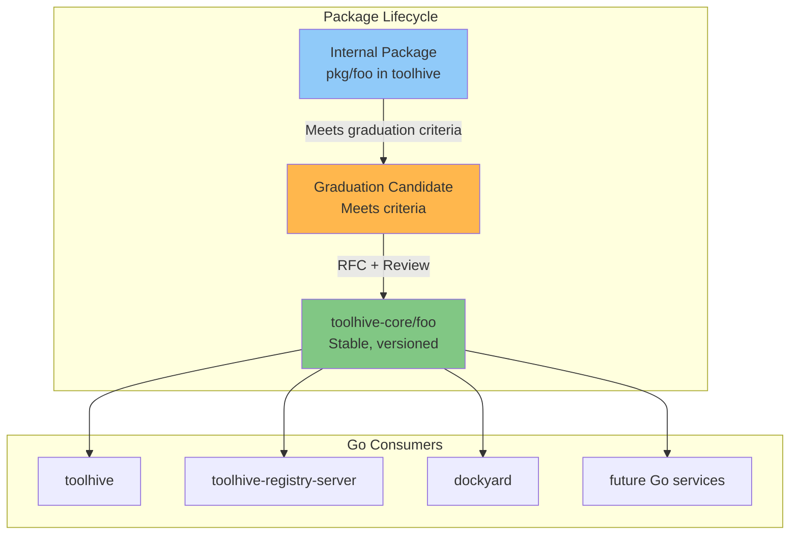

# THV-0032: ToolHive Core Shared Library with Package Graduation Criteria

- **Status**: Draft
- **Author(s)**: Juan Antonio Osorio (@JAORMX)
- **Created**: 2026-01-29
- **Last Updated**: 2026-01-30
- **Target Repository**: multiple (new repository: `toolhive-core`)
- **Related Issues**: N/A

## Summary

This RFC proposes creating a shared Go library (`toolhive-core`) to provide stable, well-tested utilities with explicit API guarantees for the ToolHive Go ecosystem. The proposal establishes formal graduation criteria for promoting packages from internal/unstable status to the shared library, enabling projects like `dockyard` (which already imports from toolhive) to depend on stable APIs without risk of unexpected breakage.

## Problem Statement

The ToolHive ecosystem spans multiple Go repositories:
- **toolhive** - Core runtime, CLI, operator, proxy-runner, virtual MCP
- **toolhive-registry** - Registry data and CLI tools
- **toolhive-registry-server** - Registry API server
- **dockyard** - Container packaging for MCP servers

> **Note**: This RFC focuses on shared library extraction. While a stable core library could eventually enable components like the operator to be versioned independently, that would require additional considerations (e.g., RunConfig format stability, API versioning) beyond the scope of this proposal.

Additionally, TypeScript projects exist (toolhive-studio, toolhive-cloud-ui) but are out of scope for a Go shared library.

**Current state of code sharing:**

| Project | Imports from toolhive | Pattern Divergence |
|---------|----------------------|-------------------|
| **dockyard** | `pkg/logger`, `pkg/container/images`, `pkg/runner` | Aligned - uses toolhive utilities |
| **toolhive-registry** | `pkg/logger`, `pkg/permissions`, `pkg/registry/*`, `pkg/container/verifier` | Aligned - heavily uses toolhive utilities |
| **toolhive-registry-server** | Only `pkg/versions` + `pkg/registry` types | Uses stdlib `log/slog` instead of toolhive's zap logger; custom error handling |

> **Future sharing opportunities**: Beyond the packages listed above, `pkg/auth` contains OAuth-related utilities (protected resource metadata, auth middleware) that could be refactored into a standalone `pkg/oauth` package. Similarly, `pkg/networking` has HTTP builder patterns and endpoint validation utilities that could benefit multiple projects.

**Current limitations:**

1. **No stability guarantees**: Projects like dockyard import toolhive's `pkg/` packages directly, but these are internal packages with no API stability commitment. A breaking change in toolhive could break dockyard unexpectedly.

2. **Pattern divergence without clear rationale**: toolhive-registry-server uses Go stdlib `log/slog` while toolhive uses zap-based logging. Both are valid choices, but there's no documented decision about when to use which approach.

3. **Unclear package maturity**: The `toolhive` repository contains 93+ packages in `pkg/`, with `logger` imported 185 times internally. Contributors and downstream consumers have no way to know which packages are stable vs. experimental.

4. **Friction for new Go projects**: When creating new ToolHive ecosystem projects, developers must decide whether to import from toolhive (risking breakage) or reimplement utilities (causing divergence).

5. **No graduation path**: There's no process for promoting battle-tested internal packages to "blessed" shared status with stability guarantees.

## Goals

- **Establish `toolhive-core`**: Create a new repository for shared, stable Go packages with explicit API stability guarantees
- **Define graduation criteria**: Formalize how packages move from internal/unstable to shared/stable
- **Provide stability guarantees**: Implement semantic versioning so downstream projects (dockyard, future services) can depend on toolhive-core without fear of breakage
- **Document architectural decisions**: Clarify when to use toolhive-core utilities vs. stdlib alternatives (e.g., zap vs. slog)
- **Enable independent versioning**: Allow the shared library to evolve on its own release cadence, decoupled from toolhive releases
- **Create a graduation path**: Provide a clear process for promoting mature internal packages to shared status

## Non-Goals

- **Migrate all packages immediately**: Only graduated packages move to `toolhive-core`
- **Break existing APIs**: The initial release must maintain compatibility with current usage
- **Force adoption**: Projects may continue using internal implementations (e.g., toolhive-registry-server can keep using slog)
- **Include domain-specific code**: Container runtime, MCP protocol, VMCP logic stay in their respective repos
- **Create a monorepo**: `toolhive-core` is a standalone library, not a consolidation of all projects
- **TypeScript/frontend utilities**: toolhive-studio and toolhive-cloud-ui are TypeScript projects and out of scope

## Proposed Solution

### High-Level Design

### Package Graduation Criteria

**Guiding Principle**: Packages graduating to `toolhive-core` must provide genuinely reusable value and be designed as reusable from the start. This means they should not be tied to the inner workings of toolhive in either their API surface or internal logic. A package that requires knowledge of toolhive internals to use correctly is not a good candidate for graduation.

Packages can graduate via two tracks depending on complexity:

#### Fast Track (Simple Packages)

For small, focused packages with minimal dependencies (e.g., `env`, `errors`, `validation`):

| Criterion | Requirement |
|-----------|-------------|
| **Production usage** | Deployed in production for ≥1 month |
| **No internal dependencies** | Cannot depend on non-graduated internal packages |
| **No global state** | No singletons, global variables for state, or `init()` side effects |
| **Test coverage** | ≥70% line coverage |
| **Documentation** | Package-level godoc |
| **Approval** | GitHub issue approved by one maintainer |

#### Standard Track (Complex Packages)

For packages with external dependencies, multiple types, or broader API surface:

| Criterion | Requirement |
|-----------|-------------|
| **Production usage** | Deployed in production for ≥2 months without breaking changes |
| **API stability** | No breaking changes in the last 2 minor releases |
| **Interface design** | Uses Go interfaces for dependency injection and testability |
| **Error handling** | Returns typed errors; no panics except for programming bugs |
| **No global state** | No singletons, global variables for state, or `init()` side effects |
| **Test coverage** | ≥70% line coverage with meaningful assertions |
| **Documentation** | Package-level godoc with usage examples |
| **Linting** | Passes `golangci-lint` with project configuration |
| **Minimal dependencies** | Only essential external dependencies |
| **No circular imports** | Must not create import cycles when extracted |
| **No internal dependencies** | Cannot depend on non-graduated internal packages |
| **Stable external deps** | External dependencies must be v1.0+ or widely adopted |
| **Sponsorship** | At least one maintainer sponsors the graduation |
| **Approval** | RFC or detailed GitHub issue reviewed and approved |

### Graduation Process

1. **Proposal**: Open a GitHub issue identifying the graduation candidate and proposed track (fast/standard)
2. **Track determination**: Maintainers confirm which track applies based on package complexity
3. **Evaluation**: Assess against the relevant track's criteria
4. **Approval**: Fast track requires one maintainer approval; standard track requires RFC or detailed issue review
5. **Extraction**: Move package to `toolhive-core` with necessary adaptations
6. **Release**: Tag a new semver release of `toolhive-core`
7. **Migration**: Update consuming projects to import from `toolhive-core`

### Stability Levels

Each package in `toolhive-core` is marked with a stability level in its godoc:

| Level | Meaning | API Guarantees |
|-------|---------|----------------|
| **Stable** | Production-ready, fully supported | No breaking changes without major version bump |
| **Beta** | Feature-complete, may have minor changes | Breaking changes possible with deprecation notice |
| **Alpha** | Experimental, subject to significant changes | No stability guarantees |

### Versioning Strategy

`toolhive-core` follows [Semantic Versioning 2.0.0](https://semver.org/):

- **Major (vX.0.0)**: Breaking API changes
- **Minor (v0.X.0)**: New features, backward-compatible
- **Patch (v0.0.X)**: Bug fixes, backward-compatible

**Release cadence**:
- Patch releases: As needed for critical fixes
- Minor releases: Monthly or when significant features graduate
- Major releases: Rare, only when breaking changes are necessary

### Initial Package Tiers

Based on analysis of the `toolhive` codebase:

#### Tier 1: Immediate Graduation Candidates

These packages meet all graduation criteria (zero ToolHive-specific coupling, well-tested, minimal dependencies) and should be included in the initial `toolhive-core` release:

| Package | Current Location | Stability | Rationale |
|---------|------------------|-----------|-----------|
| **errors** | `pkg/errors/` | Beta | HTTP-aware error handling, zero deps, 10mo stable |
| **oauth** | `pkg/oauth/` | Beta | RFC-compliant OAuth/OIDC types, fosite dep only |
| **env** | `pkg/env/` | Beta | Testable environment access, zero deps |
| **permissions** | `pkg/permissions/` | Beta | Container permission profiles, stdlib-only, security validations |
| **validation** | `pkg/validation/` | Beta | RFC 7230 HTTP header validation, security-focused |
| **versions** | `pkg/versions/` | Beta | Build metadata, User-Agent generation |
| **recovery** | `pkg/recovery/` | Beta | Panic recovery middleware, zero deps |

> **Note**: All packages start as Beta in v0.x releases. Once the library reaches v1.0.0, packages meeting all graduation criteria will be promoted to Stable.

#### Tier 2: Minor Refactoring Required

These packages have solid implementations but need minor changes to remove ToolHive-specific coupling:

| Package | Current Location | Status | Required Changes |
|---------|------------------|--------|------------------|
| **healthcheck** | `pkg/healthcheck/` | Beta | Remove unused logger import |
| **logger** | `pkg/logger/` | Beta | Remove `viper.GetBool("debug")` coupling; accept config via parameters |
| **auth/tokenexchange** | `pkg/auth/tokenexchange/` | Beta | Split core RFC 8693 logic from ToolHive middleware |
| **auth/metadata** | `pkg/auth/` (to extract) | Beta | Refactor protected resource metadata into standalone package for reuse |
| **networking** | `pkg/networking/` | Beta | Replace ToolHive logger with slog or interface |
| **lockfile** | `pkg/lockfile/` | Beta | Accept logger interface instead of importing pkg/logger |

#### Tier 3: Partial Extraction or Future Work

These packages have useful components but require significant refactoring or are too coupled:

| Package | Current Location | Status | Notes |
|---------|------------------|--------|-------|
| **labels** | `pkg/labels/` | Beta | Extract K8s validation funcs only; keep ToolHive constants |
| **secrets** | `pkg/secrets/` | Beta | Multiple providers, needs interface review |
| **transport/types** | `pkg/transport/types/` | Beta | Middleware abstraction, widely used but coupled |
| **mcp** | `pkg/mcp/` | Beta | MCP primitives, protocol-specific |
| **registry/types** | `pkg/registry/` | Beta | Registry types already imported by toolhive-registry and toolhive-registry-server |
| **container/verifier** | `pkg/container/verifier/` | Beta | Sigstore verification, already used by toolhive-registry |
| **cache** | multiple locations | Beta | Generic cache abstraction (see note below) |

> **Cache Consolidation Opportunity**: The codebase has several bespoke cache implementations that could be consolidated into a generic, configurable cache package:
> - `TokenCache` interface in `pkg/vmcp/cache/cache.go` (planned memory/Redis implementations)
> - `CachedAPIRegistryProvider` in `pkg/registry/provider_cached.go` (in-memory registry cache)
> - `DefaultManager` cache in `pkg/vmcp/discovery/manager.go` (capability discovery cache with TTL)
>
> Consolidating on a generic cache implementation would improve testability, simplify application code (e.g., the cache handles synchronization instead of requiring mutexes in each consumer), reduce cognitive load, and enable reuse of backend implementations (e.g., a Redis-backed cache could be shared across all use cases).

#### Not Recommended for Extraction

These packages are too coupled to ToolHive internals:

| Package | Reason |
|---------|--------|
| **auth** (heavy pieces) | Product-level wiring: token.go, oauth/*, remote/*, secrets/* |
| **runner**, **workloads** | Deep orchestration coupling, RunConfig migrations |
| **config** | Viper global state, ToolHive-specific env vars |
| **ignore** | Hardcoded `.thvignore`, ToolHive paths |
| **process** | Hardcoded paths, imports pkg/container/runtime |

## Security Considerations

### Threat Model

- **Supply chain attacks**: Malicious code injected into shared library affects all consumers
- **Dependency confusion**: Typosquatting or namespace confusion attacks
- **Credential exposure**: Logging or error handling inadvertently exposing secrets

### Authentication and Authorization

- No direct auth changes; auth packages remain in Tier 2/3 until fully reviewed
- Logger and error packages must not log sensitive data by default

### Data Security

- Validation package must reject inputs that could cause injection attacks
- Error wrapping must not expose internal implementation details in error messages

### Input Validation

- The `validation` package provides security-focused validation for:
  - HTTP headers (preventing header injection)
  - Resource URIs (preventing path traversal)
  - Group names (preventing null byte injection)

### Secrets Management

- Logger package must provide redaction capabilities for sensitive fields
- Error messages must not include credential values

### Audit and Logging

- All package releases are tagged and signed
- CHANGELOG documents all changes
- Security advisories published via GitHub Security Advisories

### Mitigations

| Threat | Mitigation |
|--------|------------|
| Supply chain attacks | Signed releases, dependency review, SLSA provenance |
| Dependency confusion | Use `github.com/stacklok/` namespace, Go module proxy |
| Credential exposure | Redaction functions, sensitive field markers |

## Compatibility

### Backward Compatibility

- **Initial release**: API-compatible with existing `toolhive/pkg/*` packages
- **Migration path**:
  1. Add `toolhive-core` dependency
  2. Update imports (can be automated with `gofmt -r`)
  3. Remove now-unused internal packages
- **Deprecation**: Internal packages deprecated but kept for 2 minor versions (serves as rollback window if issues arise)

### Forward Compatibility

- **Extensibility**: Interfaces allow adding implementations without breaking changes
- **Optional features**: New features use functional options pattern
- **Version constraints**: Consumers can pin to major versions for stability

## Testing Strategy

### Unit Tests

- All packages must have ≥70% coverage
- Table-driven tests for validation functions
- Mock-based tests for interface implementations

### Integration Tests

- Cross-package integration tests (e.g., validation + errors)
- Import cycle detection in CI

### Compatibility Tests

- Build `toolhive` and `dockyard` against new versions
- Automated compatibility matrix testing

### Performance Tests

- Benchmark validation functions
- Memory allocation tests for hot paths

### Security Tests

- Static analysis with `gosec`
- Dependency vulnerability scanning with `govulncheck`

## Documentation

- **README.md**: Quick start, installation, package overview
- **STABILITY.md**: Graduation criteria, stability levels explained
- **CHANGELOG.md**: All changes in keep-a-changelog format
- **Package godoc**: Usage examples, API documentation
- **Migration guide**: How to migrate from internal packages
- **Architecture docs**: Updated to reference `toolhive-core`

## Open Questions

1. **Release cadence**: Monthly minor releases, or release when ready?
2. **Tier 2 timeline**: When should we start refactoring healthcheck/tokenexchange for graduation?
3. **Logger approach**: When decoupling logger from Viper, should we use zap with config injection, switch to slog (stdlib), or provide an interface that supports both?
4. **permissions package scope**: Is `pkg/permissions` (container security profiles) generic enough for a shared library, or is it too domain-specific to ToolHive?

## References

- [Go Modules Reference](https://go.dev/ref/mod)
- [Semantic Versioning 2.0.0](https://semver.org/)
- [Keep a Changelog](https://keepachangelog.com/)
- [Go API Stability](https://go.dev/doc/modules/version-numbers)
- [SLSA Supply Chain Security](https://slsa.dev/)
- [ToolHive Architecture Documentation](https://github.com/stacklok/toolhive/tree/main/docs/arch)

---

## RFC Lifecycle

<!-- This section is maintained by RFC reviewers -->

### Review History

| Date | Reviewer | Decision | Notes |
|------|----------|----------|-------|
| 2026-01-29 | @JAORMX | Draft | Initial submission |

### Implementation Tracking

| Repository | PR | Status |
|------------|-----|--------|
| toolhive-core | N/A | Not started |
| toolhive | N/A | Not started |
| dockyard | N/A | Not started |
| toolhive-registry | N/A | Not started |
| toolhive-registry-server | N/A | Optional - may continue using slog |
