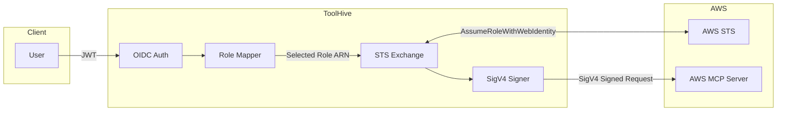

# THV-0033: AWS STS Authentication for MCP Servers

- **Status**: Draft
- **Author(s)**: Jakub Hrozek (@jhrozek)
- **Created**: 2026-01-23
- **Last Updated**: 2026-01-23
- **Target Repository**: toolhive
- **Related Issues**: N/A

## Summary

This RFC proposes AWS STS authentication for ToolHive to centralize AWS credential management for the [AWS MCP Server](https://docs.aws.amazon.com/aws-mcp/latest/userguide/what-is-mcp-server.html). The implementation exchanges OIDC tokens for temporary AWS credentials via `AssumeRoleWithWebIdentity` and signs requests with SigV4. This allows organizations to use their existing identity provider (Okta, Azure AD, etc.) to authenticate users accessing AWS MCP Server, without distributing AWS credentials to developer machines.

## Problem Statement

### Current Limitation

Organizations using AWS MCP Server face credential management challenges:

1. **Distributed Credentials**: Each developer must configure AWS credentials locally (`~/.aws/credentials`), which creates security and compliance risks
2. **No Centralized Audit**: AWS CloudTrail captures actions but correlating them with enterprise identity (Okta, Azure AD usernames) requires additional tooling

### Who Is Affected

- **Security Teams**: Cannot enforce centralized credential policies
- **Platform Teams**: Must manage AWS CLI configuration across developer machines
- **Developers**: Must maintain local AWS credentials
- **Compliance Teams**: Lack clear visibility into which enterprise user performed AWS actions

### Why It Matters

Without centralized authentication:
- Credentials are scattered across developer machines
- Audit trails require correlation between AWS and IdP logs

## Goals

1. **Centralized AWS Authentication**: Exchange OIDC tokens for AWS credentials at the ToolHive gateway
2. **Role Mapping**: Map JWT claims (groups, roles) to IAM roles with priority-based selection

## Non-Goals

1. **AWS Identity Center Integration**: SCIM provisioning and Permission Sets will be explored in a separate RFC
2. **Session Tags**: Dynamic session tags passed to STS are out of scope for MVP
3. **Role Chaining**: Cross-account assume role chains are out of scope
4. **Agent Identity Delegation**: Support for the `act` claim (RFC 7519) is documented as a future extension (see Future Extension: Cedar-Based Role Selection)

## Proposed Solution

### High-Level Design

The proposed design has three high-level steps:
1. **ToolHive validates the user's JWT** against the IdP's JWKS
2. **ToolHive selects an IAM role** based on claims and configured mappings
3. **AWS validates the token again** via the IAM role's trust policy before issuing credentials

ToolHive logs role selection and STS exchange events (user, matched claim, selected role, success/failure). The STS session name is set to the user's `sub` claim, which allows correlating ToolHive logs with CloudTrail.




### Prerequisites

AWS STS integration requires:
1. An OIDC identity provider registered in AWS IAM
2. IAM roles with trust policies configured to accept tokens from your IdP via `sts:AssumeRoleWithWebIdentity`

See [AWS OIDC Federation documentation](https://docs.aws.amazon.com/IAM/latest/UserGuide/id_roles_providers_oidc.html) and `docs/aws-sts-setup.md` for detailed configuration steps.

### Detailed Design

#### Core Components

The implementation requires:

- **Role Mapper**: Selects an IAM role based on JWT claims. When multiple claims match configured roles, the one with the lowest priority number wins. A default role is used if no claims match.

- **STS Exchanger**: Calls `AssumeRoleWithWebIdentity` to exchange the user's OIDC token for temporary AWS credentials.

- **Request Signer**: Signs outgoing requests with SigV4 using the temporary credentials.

#### Configuration

The AWS STS auth config requires:

- **Region**: AWS region for STS calls and request signing
- **Default Role ARN**: Fallback role when no claim-based mappings match
- **Role Mappings**: List of claim-to-role mappings, each with:
  - Claim value to match (e.g., a group name)
  - IAM role ARN to assume
  - Priority (lower = preferred when multiple match)
- **Role Claim**: Which JWT claim to inspect (default: `groups`)
- **Session Duration**: How long credentials are valid (900-43200 seconds)

#### Middleware

The middleware runs after OIDC authentication and before proxying to the MCP server. It:
1. Extracts the user's identity and claims from the request context
2. Selects an IAM role based on the configured mappings
3. Exchanges the bearer token for AWS credentials
4. Signs the request with SigV4
5. Forwards the signed request to the AWS MCP Server

#### CRD Extension: MCPExternalAuthConfig

```yaml
apiVersion: toolhive.stacklok.dev/v1alpha1
kind: MCPExternalAuthConfig
metadata:
  name: aws-sts-config
spec:
  type: awsSts
  awsSts:
    region: us-east-1
    service: execute-api
    roleArn: arn:aws:iam::123456789012:role/DefaultMCPRole
    roleClaim: groups
    sessionDuration: 3600
    roleMappings:
      - claim: admins
        roleArn: arn:aws:iam::123456789012:role/AdminRole
        priority: 1
      - claim: developers
        roleArn: arn:aws:iam::123456789012:role/DeveloperRole
        priority: 2
```


## Security Considerations

### Threat Model

| Threat | Mitigation |
|--------|------------|
| Credential theft | AWS credentials are temporary (1-hour default) and not persisted to disk |
| Token replay | If an attacker captures a JWT, they can only use it until it expires. STS rejects expired tokens and validates the signature against the IdP's JWKS |
| Wrong token accepted | A JWT issued for a different application could be presented. The IAM role trust policy must include an `aud` (audience) condition to reject tokens not intended for this service |
| Man-in-the-middle | SigV4 signing (required by AWS) provides request integrity. HTTPS is required for confidentiality |
| Role over-assumption | Priority-based role selection picks the lowest-privilege matching role. Sensitive roles should have explicit deny policies in their trust policy |
| Session name injection | Session names are sanitized to allowed characters and truncated to 64 chars to prevent log injection |

### Input Validation

Role ARNs, session durations (900-43200 seconds), and regions are validated against AWS formats.

### Permission Boundaries

Assumed roles should have [permission boundaries](https://docs.aws.amazon.com/IAM/latest/UserGuide/access_policies_boundaries.html) attached to limit maximum permissions. Recommended boundaries should:
- Restrict allowed AWS regions
- Deny IAM and Organizations API access
- Deny `sts:AssumeRole` to prevent role chaining

This limits the blast radius even if a role's identity policy is overly permissive.

## Alternatives Considered

### Alternative 1: AWS Identity Center Integration

Use AWS IAM Identity Center (SSO) with Permission Sets instead of direct OIDC federation.

**Pros:**
- Native AWS tooling
- Centralized permission management

**Cons:**
- Requires AWS Identity Center setup (additional AWS service)
- Less flexible for non-AWS IdPs

**Why deferred:** Adds AWS-side dependency. OIDC federation works with any compliant IdP. Will be explored in a separate RFC.

### Future Extension: Cedar-Based Role Selection

The static claim-to-role mappings can be extended with optional Cedar policies for advanced scenarios. When `role_policies` are configured, Cedar determines which roles are permitted; otherwise, the simple claim-based matching is used.

**Behavior:**
- **No `role_policies` configured** → Use priority-based claim matching (MVP behavior)
- **`role_policies` configured** → Cedar evaluates permitted roles, then select highest-priority permitted role

This supports scenarios such as:

- **Agent delegation**: When an AI agent acts on behalf of a user (via the `act` claim), the effective role should be the intersection of the user's ceiling and the agent's ceiling
- **Time-based restrictions**: Certain roles only available during business hours
- **Context-aware selection**: Different roles based on client application or request source

The agent delegation scenario illustrates how this would work:

| User | User's Role | Agent | Agent's Ceiling | Effective Role |
|------|-------------|-------|-----------------|----------------|
| Admin | AdminRole | (direct) | N/A | AdminRole |
| Admin | AdminRole | code-assistant | ReadOnlyRole | ReadOnlyRole |
| Admin | AdminRole | sre-agent | SRERole | SRERole |
| Developer | DevRole | sre-agent | SRERole | DevRole |

The `act` claim (RFC 7519) identifies the agent acting on behalf of the user:

```json
{
  "sub": "alice@company.com",
  "groups": ["admins"],
  "act": {
    "sub": "sre-agent",
    "iss": "https://agents.company.com"
  }
}
```

**Configuration with Cedar policies (optional):**

```yaml
aws_sts:
  roles:
    - name: admin
      arn: arn:aws:iam::123456789012:role/AdminRole
      priority: 1
      claim: admins  # Used for simple matching when no role_policies
    - name: sre
      arn: arn:aws:iam::123456789012:role/SRERole
      priority: 2
      claim: sre-team
    - name: readonly
      arn: arn:aws:iam::123456789012:role/ReadOnlyRole
      priority: 3
      claim: developers

  # Optional - if omitted, uses claim-based matching above
  role_policies:
    # Direct user access
    - |
      permit(principal, action, resource == Role::"admin")
      when { !context.has_actor && context.claim_groups.contains("admins") };

    # code-assistant caps everyone to readonly
    - |
      permit(principal, action, resource == Role::"readonly")
      when { context.has_actor && context.actor_sub == "code-assistant" };

    # Safety: no agent gets admin
    - |
      forbid(principal, action, resource == Role::"admin")
      when { context.has_actor };
```

**Pros:**
- Backward-compatible: simple deployments use claim matching, advanced deployments opt into Cedar
- Unified policy language (Cedar already used for MCP authz)
- Expressive (time-based, attribute-based conditions)
- Handles user×agent permission intersection cleanly

**Implementation note:** Cedar-based selection should be implemented when agent delegation becomes a requirement. The design is documented in `docs/aws-sts-agent-delegation-design.md`.

## References

- [AWS MCP Server](https://docs.aws.amazon.com/aws-mcp/latest/userguide/what-is-mcp-server.html)
- [AWS STS AssumeRoleWithWebIdentity](https://docs.aws.amazon.com/STS/latest/APIReference/API_AssumeRoleWithWebIdentity.html)
- [AWS SigV4 Signing](https://docs.aws.amazon.com/general/latest/gr/signature-version-4.html)
- [OIDC Federation with AWS](https://docs.aws.amazon.com/IAM/latest/UserGuide/id_roles_providers_oidc.html)
- [Cedar Policy Language](https://www.cedarpolicy.com/)
- [RFC 7519 - JSON Web Token](https://datatracker.ietf.org/doc/html/rfc7519)
- [RFC 8693 - OAuth 2.0 Token Exchange](https://datatracker.ietf.org/doc/html/rfc8693)
