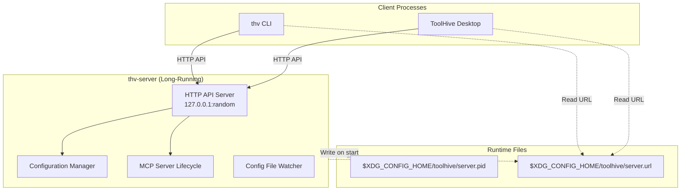
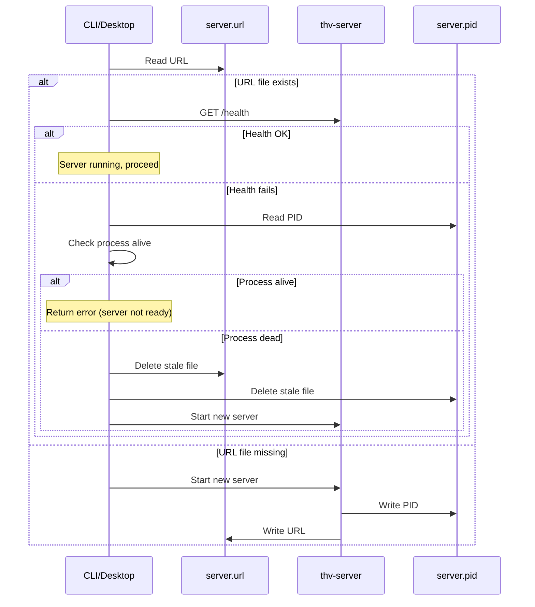

# RFC-0034: Local Long-Running Server Architecture

- **Status**: Draft
- **Author(s)**: Juan Antonio Osorio (@JAORMX), Michelangelo Mori (@blkt)
- **Created**: 2026-01-30
- **Last Updated**: 2026-01-30
- **Target Repository**: multiple (toolhive, toolhive-studio)
- **Related Issues**: TBD

## Summary

This RFC proposes separating the ToolHive CLI (`thv`) from the API server into distinct components, establishing a local long-running server architecture that enables unified configuration management and a transition path to enterprise deployments.

## Problem Statement

- ToolHive CLI and API server are tightly coupled in the same binary
- No single owner for local configuration (CLI and Desktop UI may conflict)
- Cannot reliably watch IDE configuration files for MCP server injection
- No clear architectural boundary for enterprise transition
- Configuration stored in files; no path to unified database storage

## Goals

- Separate CLI (`thv`) from API server into composable components
- CLI becomes a client of the API server
- Server becomes the single owner of all local configuration
- Enable reliable file watching for IDE integrations
- Prepare for enterprise platform transition and SQLite migration

## Non-Goals

- Modify existing API exposed by `thv serve`
- Running all workloads remotely
- Enterprise authentication (future RFC)

## Proposed Solution

### High-Level Design

### Component Separation

**CLI**: Thin client for user interaction, command parsing, and communicating with the local server via HTTP API.

**Local Server**: Long-running process responsible for MCP server lifecycle, configuration management, file watching, and serving as single source of truth for local state.

To ease distribution, CLI and Local Server should use the same binary.

### Server Lifecycle

#### Startup

The server is started by either CLI or Desktop UI, which adds the not-so implicit requirement that the components must be shipped together.

The server starts with no host/port arguments. On startup it performs the following actions in this order:

1. Binds to `127.0.0.1` on a **random available port**
2. Writes `$XDG_CONFIG_HOME/toolhive/server.url` containing the server URL (e.g., `http://127.0.0.1:52341`)
3. Writes `$XDG_CONFIG_HOME/toolhive/server.pid` containing the process ID

#### Discovery

Clients discover the server by:

1. Reading `$XDG_CONFIG_HOME/toolhive/server.url` to get the server address
2. Attempting a health check (`GET /health`)
3. If health check fails, reading `$XDG_CONFIG_HOME/toolhive/server.pid` and checking if process is alive
4. If process is alive but not responding → return error (server may be starting or hung)
5. If process is dead → clean up stale files and start new server

#### Commands

This is a possible list of new commands to use to start the long-running HTTP server.

| Command | Description |
|---------|-------------|
| `thv server start` | Start server in foreground |
| `thv server start --daemon` | Start server in background |
| `thv server stop` | Stop running server |
| `thv server status` | Show server status (URL, PID, uptime) |

CLI commands that require the server (e.g., `thv run`) automatically start it if not running.

#### Race Condition Handling

Multiple clients may attempt to start the server simultaneously. A lock file (`$XDG_CONFIG_HOME/toolhive/server.lock`) with exclusive file locking ensures only one process starts the server.

#### Graceful Shutdown

On `SIGTERM`/`SIGINT`:
1. stop accepting connections
2. complete in-flight requests (or cancel them by cancelling their `ctx`)
3. stop managed MCP servers
4. remove URL file
5. remove PID file
6. exit

### Configuration Management

The server becomes the single owner of configuration:

- All config changes go through the server API
- Server watches IDE config files (VS Code, Cursor, Claude Desktop) for MCP server changes
- Clients receive real-time updates via SSE (`GET /events`)

---

## Security Considerations

### Threat Model

| Threat | Mitigation |
|--------|------------|
| Unauthorized local access | Localhost-only binding; any local process can connect |
| Port discovery | Random port not predictable; URL file has user-only permissions (0600) |
| Stale file exploitation | PID validation before trusting URL file |

### Local Trust Model

The server operates in a single-user trust model:
- Binds exclusively to `127.0.0.1` (no network exposure)
- No authentication required (local processes assumed trusted)
- (Optional) file permissions restrict access to current user
- (Optional) listen on Unix socket on platforms supporting it

---

## Alternatives Considered

### Fixed Port

Using a fixed port (e.g., `21451`) instead of random port.

- **Pros**: Simpler discovery (no file needed), predictable
- **Cons**: Port conflicts common in developer environments
- **Why not chosen**: Random port avoids conflicts; URL file discovery is straightforward

### Unix Domain Socket

Using a Unix socket instead of TCP.

- **Pros**: Better security via filesystem permissions
- **Cons**: Different implementation for Windows, harder debugging
- **Why not chosen**: TCP is simpler cross-platform; localhost binding provides sufficient isolation

---

## Compatibility

TODO

---

## Implementation Plan

1. **Core Infrastructure**: Extract server logic, implement random port binding, PID/URL file management
2. **CLI Client**: Server discovery, auto-start logic, lock file coordination
3. **Desktop Integration**: Update toolhive-studio to use server discovery protocol
4. **Configuration Management**: File watchers, SSE events, config sync

---

## Open Questions

1. Should the server support hot-reload when the binary is updated?
2. How should multiple users on shared systems be handled (separate instances)?
3. Should authentication be optional for sensitive environments?

---

## References

- [XDG Base Directory Specification](https://specifications.freedesktop.org/basedir-spec/basedir-spec-latest.html)
- [File Locking (flock)](https://man7.org/linux/man-pages/man2/flock.2.html)

---

## RFC Lifecycle

### Review History

| Date | Reviewer | Decision | Notes |
|------|----------|----------|-------|
| 2026-01-30 | | Draft | Initial submission |
