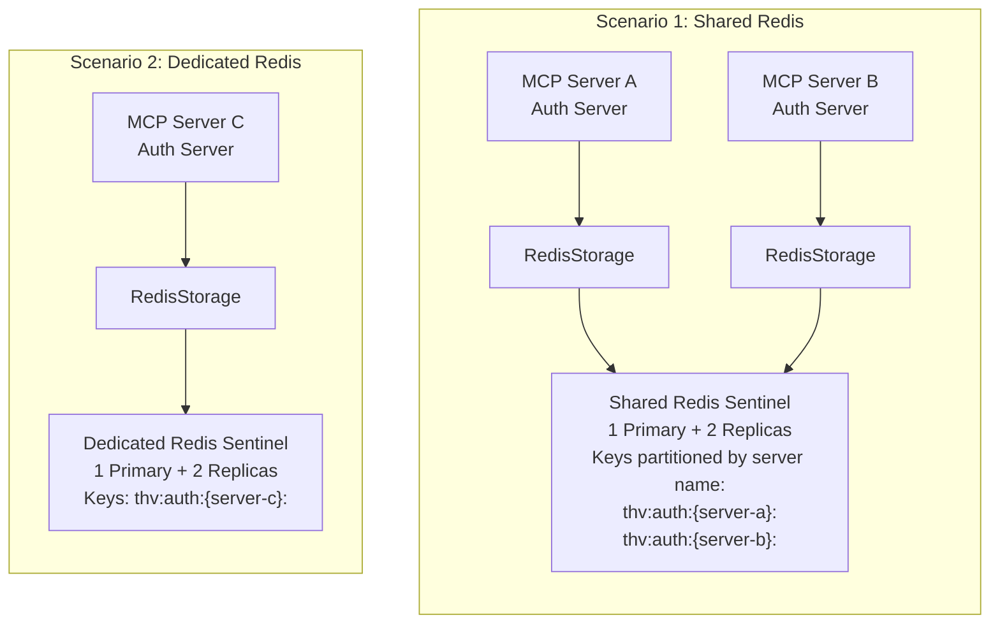

# RFC-XXXX: Redis-Backed Storage for Auth Server

- **Status**: Draft
- **Author(s)**: @tgrunnagle
- **Created**: 2026-02-02
- **Last Updated**: 2026-02-03
- **Target Repository**: toolhive
- **Related Issues**: TBD

## Summary

Add a Redis Sentinel-backed implementation of the `Storage` interface in `pkg/authserver/storage/` to enable horizontal scaling of the embedded authorization server. This allows multiple ToolHive instances to share authentication state, supporting high-availability deployments with automatic failover. The implementation uses Redis Sentinel with one primary and two replicas, authenticated via ACL users for secure production deployments.

## Problem Statement

The current auth server storage implementation (`MemoryStorage`) stores all OAuth2 tokens, authorization codes, user data, and pending authorizations in memory. This creates several limitations:

- **No horizontal scaling**: Multiple ToolHive instances cannot share authentication state
- **No persistence across restarts**: All tokens and sessions are lost when the process restarts
- **Single point of failure**: The auth server cannot be deployed in HA configuration
- **Memory pressure**: Large deployments with many clients/tokens consume significant memory

Users deploying ToolHive in production environments with high availability requirements are affected. This is particularly important for Kubernetes deployments where multiple replicas need to share state.

## Goals

- Implement a `RedisStorage` type that satisfies the `Storage` interface
- Support all existing storage operations with Redis as the backend
- Maintain compatibility with the fosite OAuth2 library interfaces
- Enable atomic operations for token creation/revocation
- Support Redis Sentinel deployment with one primary and two replicas for high availability
- Provide automatic key expiration using Redis TTL features
- Use Redis ACL authentication for secure production deployments

## Non-Goals

- Migrating existing in-memory data to Redis (cold start is acceptable)
- Supporting other distributed storage backends (PostgreSQL, etcd) in this RFC
- Implementing distributed locking beyond what Redis provides natively
- Adding Redis as a dependency for local/development use (MemoryStorage remains default)
- Redis persistence (RDB/AOF) - this implementation is memory-only
- Encryption at rest - not needed since data is memory-only with short TTLs
- Supporting standalone or cluster deployment modes - only Sentinel is supported
- Supporting other authentication methods (password-only, mTLS, IAM) - only ACL user is supported
- Custom connection pool configuration - use go-redis library defaults (may be added in future if needed)
- TLS/mTLS configuration for Redis connections - future enhancement if needed for encrypted connections

## Proposed Solution

### High-Level Design

Multiple ToolHive instances share authentication state via Redis Sentinel (1 primary + 2 replicas).

**Deployment Scenarios:**
- **Shared Redis (Scenario 1)**: Multiple MCP servers reference the same MCPExternalAuthConfig, sharing one Redis instance. Keys are partitioned by server name using hash tags (`thv:auth:{server-name}:*`) to ensure isolation.
- **Dedicated Redis (Scenario 2)**: Each MCP server has its own MCPExternalAuthConfig pointing to a dedicated Redis instance. Simpler but requires more infrastructure.



### Detailed Design

**Deployment Architecture:**
- **Deployment Mode**: Redis Sentinel only (one primary + two replicas for HA)
- **Authentication**: ACL user only (Redis 6+ required)
- **Rationale**: This opinionated approach simplifies configuration, testing, and operations while providing production-grade high availability and security

#### Component Changes

**New Files:**

1. `pkg/authserver/storage/redis.go` - Main Redis storage implementation
2. `pkg/authserver/storage/redis_test.go` - Unit tests with Redis mocking
3. `pkg/authserver/storage/redis_keys.go` - Key generation and naming conventions

**Modified Files:**

1. `pkg/authserver/storage/config.go` - Add Redis configuration type and options
2. `pkg/authserver/storage/types.go` - Add `TypeRedis` constant to `Type` enum
3. `cmd/thv-operator/api/v1alpha1/mcpexternalauthconfig_types.go` - Add `AuthServerStorageConfig`, `RedisStorageConfig`, and related CRD types

#### Redis Key Schema

Keys are namespaced and **partitioned by MCP server name** to support multi-tenancy where multiple MCP servers share the same Redis instance:

```
thv:auth:{<server_name>}:<type>:<identifier>

Key Structure:
- thv:auth:        - Global prefix (configurable via KeyPrefix)
- {<server_name>}: - MCP server name in hash tags for Redis Cluster slot routing
- <type>:          - Data type (authcode, access, refresh, etc.)
- <identifier>:    - Unique identifier (signature, user_id, etc.)
```

**Hash Tag Partitioning:**

The `{<server_name>}` syntax uses Redis hash tags to ensure all keys for a single MCP server are routed to the same cluster slot. This enables:
- **Multi-tenancy**: Multiple MCP servers can safely share one Redis instance
- **Cluster compatibility**: Related keys stay on the same shard for atomic operations
- **Isolation**: Each MCP server's data is logically separated

**Key Examples:**

```
# For MCP server "my-mcp-server":
thv:auth:{my-mcp-server}:authcode:<signature>          # Authorization codes
thv:auth:{my-mcp-server}:access:<signature>            # Access tokens
thv:auth:{my-mcp-server}:refresh:<signature>           # Refresh tokens
thv:auth:{my-mcp-server}:pkce:<signature>              # PKCE requests
thv:auth:{my-mcp-server}:client:<client_id>            # OAuth clients
thv:auth:{my-mcp-server}:user:<user_id>                # User records
thv:auth:{my-mcp-server}:provider:<provider_key>       # Provider identities
thv:auth:{my-mcp-server}:upstream:<user_id>:<provider> # Upstream tokens
thv:auth:{my-mcp-server}:pending:<internal_state>      # Pending authorizations
thv:auth:{my-mcp-server}:invalidated:<signature>       # Invalidated auth codes
thv:auth:{my-mcp-server}:jwt:<jti>                     # Client assertion JTIs

# Secondary indexes for request ID lookups (RFC 7009 revocation)
thv:auth:{my-mcp-server}:reqid:access:<request_id>     # Maps request ID -> access token signature
thv:auth:{my-mcp-server}:reqid:refresh:<request_id>    # Maps request ID -> refresh token signature
```

**Benefits of Server-Based Partitioning:**

| Benefit | Description |
|---------|-------------|
| Multi-tenancy | Multiple MCP servers share Redis without key collisions |
| Cluster routing | Hash tags ensure related keys land on same shard |
| Atomic operations | Lua scripts work correctly (same-slot requirement) |
| Key scanning | `SCAN` can filter by server: `thv:auth:{my-server}:*` |
| Data isolation | Easy to delete all data for a specific server |
| Monitoring | Metrics can be grouped by server name |

#### API Changes

New factory function and configuration:

```go
// redis.go
type RedisStorage struct {
    client redis.UniversalClient
    config RedisConfig
}

// NewRedisStorage creates a new Redis-backed storage
func NewRedisStorage(ctx context.Context, cfg RedisConfig) (*RedisStorage, error)

// Redis deployment modes
const (
    DeploymentModeSentinel = "sentinel" // Only supported mode: Sentinel with 1 primary + 2 replicas
)

// Redis authentication types
const (
    AuthTypeACLUser = "aclUser" // Only supported auth: ACL user (Redis 6+)
)

// RedisConfig holds Redis connection configuration
// Validation ensures:
// - DeploymentMode is DeploymentModeSentinel
// - AuthType is AuthTypeACLUser
// - SentinelConfig is non-nil when DeploymentMode is sentinel
// - ACLUserConfig is non-nil when AuthType is aclUser
type RedisConfig struct {
    // DeploymentMode specifies the Redis deployment mode
    // Only DeploymentModeSentinel is supported for high availability
    DeploymentMode string // Must be DeploymentModeSentinel

    // SentinelConfig holds Sentinel-specific configuration
    // Required when DeploymentMode is DeploymentModeSentinel
    SentinelConfig *SentinelConfig

    // AuthType specifies the authentication method
    // Only AuthTypeACLUser is supported for secure production deployments
    AuthType string // Must be AuthTypeACLUser

    // ACLUserConfig holds ACL user authentication configuration
    // Required when AuthType is AuthTypeACLUser
    ACLUserConfig *ACLUserConfig

    // Key partitioning - KeyPrefix is derived from server name
    // Format: thv:auth:{<server-name>}:
    // This is automatically set by the operator/runner from MCPServer name
    KeyPrefix string

    // Timeout configuration (optional, with defaults if not specified)
    // DialTimeout is the timeout for establishing new connections (default: 5s)
    DialTimeout time.Duration
    // ReadTimeout is the timeout for socket reads (default: 3s)
    ReadTimeout time.Duration
    // WriteTimeout is the timeout for socket writes (default: 3s)
    WriteTimeout time.Duration

    // Note: Connection pooling uses go-redis library defaults (10 connections per CPU)
    // Pool configuration may be exposed as a future enhancement if needed
}

// SentinelConfig holds Redis Sentinel configuration
type SentinelConfig struct {
    MasterName    string   // Name of the Redis master monitored by Sentinel
    SentinelAddrs []string // List of Sentinel host:port addresses
    DB            int      // Redis database number (default: 0)
}

// ACLUserConfig holds ACL user authentication configuration
type ACLUserConfig struct {
    Username string // ACL username
    Password string // ACL password
}
```

#### Configuration Changes

Update `storage.Config` and `storage.RunConfig`:

**Security Note:** The `RunConfig` types reference environment variables for credentials rather than storing secrets directly in configuration files. At runtime, the runner reads the specified environment variables to populate the actual credential values in the `Config` types.

```go
// config.go additions
const TypeRedis Type = "redis"

type Config struct {
    Type   Type
    Memory *MemoryConfig // existing
    Redis  *RedisConfig  // new
}

type RunConfig struct {
    Type   Type              `json:"type" yaml:"type"`
    Memory *MemoryRunConfig  `json:"memory,omitempty" yaml:"memory,omitempty"`
    Redis  *RedisRunConfig   `json:"redis,omitempty" yaml:"redis,omitempty"`
}

type RedisRunConfig struct {
    // DeploymentMode specifies the Redis deployment mode
    // Only "sentinel" is supported
    // +kubebuilder:validation:Enum=sentinel
    DeploymentMode string `json:"deploymentMode" yaml:"deploymentMode"`

    // SentinelConfig holds Sentinel-specific configuration
    // Required when deploymentMode is "sentinel"
    SentinelConfig *SentinelRunConfig `json:"sentinelConfig,omitempty" yaml:"sentinelConfig,omitempty"`

    // AuthType specifies the authentication method
    // Only "aclUser" is supported
    // +kubebuilder:validation:Enum=aclUser
    AuthType string `json:"authType" yaml:"authType"`

    // ACLUserConfig holds ACL user authentication configuration
    // Required when authType is "aclUser"
    ACLUserConfig *ACLUserRunConfig `json:"aclUserConfig,omitempty" yaml:"aclUserConfig,omitempty"`

    // KeyPrefix is automatically derived from the MCP server name
    // Format: thv:auth:{<server-name>}:
    // This ensures key partitioning for multi-tenancy in Redis Cluster
    KeyPrefix string `json:"keyPrefix" yaml:"keyPrefix"`

    // Timeout configuration (optional, defaults: DialTimeout=5s, ReadTimeout=3s, WriteTimeout=3s)
    // +optional
    DialTimeout string `json:"dialTimeout,omitempty" yaml:"dialTimeout,omitempty"`
    // +optional
    ReadTimeout string `json:"readTimeout,omitempty" yaml:"readTimeout,omitempty"`
    // +optional
    WriteTimeout string `json:"writeTimeout,omitempty" yaml:"writeTimeout,omitempty"`
}

// SentinelRunConfig holds Sentinel-specific configuration
type SentinelRunConfig struct {
    MasterName    string   `json:"masterName" yaml:"masterName"`
    SentinelAddrs []string `json:"sentinelAddrs" yaml:"sentinelAddrs"`
    DB            int      `json:"db,omitempty" yaml:"db,omitempty"`
}

// ACLUserRunConfig holds ACL user authentication configuration
// References environment variables to avoid storing secrets in config files
type ACLUserRunConfig struct {
    // UsernameEnvVar is the name of the environment variable containing the ACL username
    UsernameEnvVar string `json:"usernameEnvVar" yaml:"usernameEnvVar"`
    // PasswordEnvVar is the name of the environment variable containing the ACL password
    PasswordEnvVar string `json:"passwordEnvVar" yaml:"passwordEnvVar"`
}

// At runtime, the operator/runner reads the environment variables specified in ACLUserRunConfig
// to populate the ACLUserConfig with actual credential values
```

#### Kubernetes CRD Changes

**File:** `cmd/thv-operator/api/v1alpha1/mcpexternalauthconfig_types.go`

Update `EmbeddedAuthServerConfig` to support Redis storage:

```go
type EmbeddedAuthServerConfig struct {
    // ... Existing fields

    // Storage configures the storage backend for tokens and authorization state
    // If not specified, defaults to in-memory storage (single replica only)
    // +optional
    Storage *AuthServerStorageConfig `json:"storage,omitempty"`
}

// AuthServerStorageConfig configures the storage backend for the embedded auth server
type AuthServerStorageConfig struct {
    // Type specifies the storage backend type
    // Valid values: "memory" (default), "redis"
    // +kubebuilder:validation:Enum=memory;redis
    // +kubebuilder:default=memory
    Type string `json:"type,omitempty"`

    // Redis configures Redis storage backend
    // Required when type is "redis"
    // +optional
    Redis *RedisStorageConfig `json:"redis,omitempty"`
}

// RedisStorageConfig configures Redis connection for auth server storage
type RedisStorageConfig struct {
    // DeploymentMode specifies the Redis deployment mode
    // Only "sentinel" is supported for high availability with one primary and two replicas
    // +kubebuilder:validation:Enum=sentinel
    // +kubebuilder:default=sentinel
    DeploymentMode string `json:"deploymentMode,omitempty"`

    // SentinelConfig holds Sentinel configuration
    // Required when deploymentMode is "sentinel"
    SentinelConfig *RedisSentinelConfig `json:"sentinelConfig,omitempty"`

    // AuthType specifies the authentication method
    // Only "aclUser" is supported for secure production deployments
    // +kubebuilder:validation:Enum=aclUser
    // +kubebuilder:default=aclUser
    AuthType string `json:"authType,omitempty"`

    // ACLUserConfig configures ACL user authentication
    // Required when authType is "aclUser"
    ACLUserConfig *RedisACLUserConfig `json:"aclUserConfig,omitempty"`

    // Timeout configuration (optional, with reasonable defaults)
    // DialTimeout is the timeout for establishing new connections
    // +optional
    // +kubebuilder:default="5s"
    DialTimeout string `json:"dialTimeout,omitempty"`
    // ReadTimeout is the timeout for socket reads
    // +optional
    // +kubebuilder:default="3s"
    ReadTimeout string `json:"readTimeout,omitempty"`
    // WriteTimeout is the timeout for socket writes
    // +optional
    // +kubebuilder:default="3s"
    WriteTimeout string `json:"writeTimeout,omitempty"`
}

// Note: The operator automatically sets KeyPrefix based on the parent resource name:
// - For MCPServer "my-server": KeyPrefix = "thv:auth:{my-server}:"
// - For VirtualMCPServer "my-vmcp": KeyPrefix = "thv:auth:{my-vmcp}:"
// This ensures proper key partitioning in Redis Cluster and multi-tenant isolation.

// RedisSentinelConfig configures Redis Sentinel connection
// Deploys with one primary and two replicas for high availability
type RedisSentinelConfig struct {
    // MasterName is the name of the Redis master monitored by Sentinel
    MasterName string `json:"masterName"`

    // SentinelAddrs is a list of Sentinel host:port addresses for direct specification
    // Use this for external Redis or when you need explicit control over addresses
    // Mutually exclusive with SentinelService
    // +optional
    SentinelAddrs []string `json:"sentinelAddrs,omitempty"`

    // SentinelService enables automatic discovery of Sentinel addresses from a Kubernetes Service
    // The operator will discover sentinel pod addresses from the service endpoints
    // Use this for operator-managed Redis (simpler configuration)
    // Mutually exclusive with SentinelAddrs
    // +optional
    SentinelService *SentinelServiceRef `json:"sentinelService,omitempty"`

    // DB is the Redis database number (default: 0)
    // +kubebuilder:default=0
    DB int32 `json:"db,omitempty"`
}

// SentinelServiceRef references a Kubernetes Service for Sentinel discovery
type SentinelServiceRef struct {
    // Name of the Sentinel Service
    Name string `json:"name"`

    // Namespace of the Sentinel Service (defaults to same namespace as MCPExternalAuthConfig)
    // +optional
    Namespace string `json:"namespace,omitempty"`

    // Port of the Sentinel service (default: 26379)
    // +optional
    // +kubebuilder:default=26379
    Port int32 `json:"port,omitempty"`
}

// RedisACLUserConfig configures Redis ACL user authentication
type RedisACLUserConfig struct {
    // UsernameSecretRef references a Secret containing the Redis ACL username
    // The secret must have a key named "username"
    UsernameSecretRef *SecretKeyRef `json:"usernameSecretRef"`

    // PasswordSecretRef references a Secret containing the Redis ACL password
    // The secret must have a key named "password"
    PasswordSecretRef *SecretKeyRef `json:"passwordSecretRef"`
}
```

**Example CRD Usage:**

```yaml
apiVersion: toolhive.stacklok.com/v1alpha1
kind: MCPExternalAuthConfig
metadata:
  name: my-auth-config
spec:
  type: embeddedAuthServer
  embeddedAuthServer:
    issuer: "https://auth.example.com"
    signingKeySecretRefs:
      - name: auth-signing-key
        key: private.pem
    upstreamProviders:
      - name: github
        type: oidc
        issuer: "https://github.com"
        clientID: "my-client-id"
        clientSecretRef:
          name: github-oauth-secret
          key: client-secret
    # Storage configuration for multi-replica deployments
    # Uses Redis Sentinel with one primary and two replicas for high availability
    storage:
      type: redis
      redis:
        deploymentMode: sentinel  # Only sentinel is supported
        sentinelConfig:
          masterName: mymaster
          # Option 1: Service-based discovery (recommended for operator-managed Redis)
          sentinelService:
            name: redis-sentinel
            namespace: redis  # Optional, defaults to same namespace
            port: 26379       # Optional, defaults to 26379
          # Option 2: Direct address specification (for external Redis)
          # sentinelAddrs:
          #   - sentinel-0.redis.svc:26379
          #   - sentinel-1.redis.svc:26379
          #   - sentinel-2.redis.svc:26379
        authType: aclUser  # Only aclUser is supported
        aclUserConfig:
          usernameSecretRef:
            name: redis-credentials
            key: username
          passwordSecretRef:
            name: redis-credentials
            key: password
```

#### Redis Kubernetes Operator (Spotahome)

For provisioning Redis in Kubernetes, we recommend the **Spotahome Redis Operator** as the primary choice for this Sentinel-only implementation. Spotahome is purpose-built for Redis Sentinel with automatic failover, making it a perfect fit for this RFC's opinionated approach.

**Why an Operator over Helm Charts?**
Kubernetes operators provide continuous management and automatic failover handling, unlike Helm charts which perform one-time deployments. When a Redis primary fails, the operator actively monitors Sentinel and can trigger Kubernetes-level actions (pod restarts, service updates) to ensure seamless failover. Helm charts like Bitnami Redis are excellent for initial provisioning, but operators provide the ongoing operational intelligence needed for production high-availability deployments.

**Alternative: OpsTree Redis Operator**
For users requiring more flexibility beyond Sentinel (standalone, cluster modes), the **OpsTree Redis Operator** is a robust alternative with support for all deployment modes. See the [Alternative Redis Options](#alternative-redis-options) section below for more information.

---

##### Complete Manifests for Spotahome Redis Operator (Recommended)

**Installation:**

```bash
# Install the Spotahome operator
kubectl apply -f https://raw.githubusercontent.com/spotahome/redis-operator/master/manifests/databases.spotahome.com_redisfailovers.yaml
kubectl apply -f https://raw.githubusercontent.com/spotahome/redis-operator/master/example/operator.yaml
```

**Step 1: Create Redis Authentication Secret**

```yaml
---
# redis-secret.yaml
# Secret containing Redis ACL credentials
apiVersion: v1
kind: Secret
metadata:
  name: toolhive-redis-secret
  namespace: toolhive
type: Opaque
stringData:
  username: "toolhive-user"  # ACL username
  password: "your-secure-password-here"  # Change this! ACL password
```

Apply: `kubectl apply -f redis-secret.yaml`

---

**Step 2: Deploy Redis Sentinel with Spotahome Operator**

Spotahome uses a single `RedisFailover` CRD that configures both Redis and Sentinel:

```yaml
---
# redis-failover.yaml
# Deploys 1 primary + 2 replicas with 3 Sentinel instances
apiVersion: databases.spotahome.com/v1
kind: RedisFailover
metadata:
  name: toolhive-redis
  namespace: toolhive
spec:
  sentinel:
    replicas: 3  # Number of Sentinel instances for quorum
    resources:
      requests:
        cpu: "50m"
        memory: "64Mi"
      limits:
        cpu: "100m"
        memory: "128Mi"
  redis:
    replicas: 3  # Total: 1 primary + 2 replicas
    resources:
      requests:
        cpu: "100m"
        memory: "128Mi"
      limits:
        cpu: "500m"
        memory: "512Mi"
    storage:
      emptyDir: {}  # Memory-only: no persistence
    customConfig:
      - "save ''"  # Disable RDB snapshots
      - "appendonly no"  # Disable AOF
      # ACL configuration will be added via Secret mount
```

Apply: `kubectl apply -f redis-failover.yaml`

**Services Created:**
- Redis: `rfr-toolhive-redis.toolhive.svc.cluster.local:26379` (Sentinel service)
- Master name: `mymaster` (default, can be customized)

---

**Step 3: Configure ToolHive to Connect**

```yaml
---
# toolhive-auth-config.yaml
apiVersion: toolhive.stacklok.com/v1alpha1
kind: MCPExternalAuthConfig
metadata:
  name: my-auth-config
  namespace: toolhive
spec:
  type: embeddedAuthServer
  embeddedAuthServer:
    issuer: "https://auth.example.com"
    signingKeySecretRefs:
      - name: auth-signing-key
        key: private.pem
    upstreamProviders:
      - name: github
        type: oidc
        issuer: "https://github.com"
        clientID: "my-client-id"
        clientSecretRef:
          name: github-oauth-secret
          key: client-secret
    storage:
      type: redis
      redis:
        deploymentMode: sentinel
        sentinelConfig:
          masterName: mymaster
          # Service-based discovery (Spotahome creates this service)
          sentinelService:
            name: rfr-toolhive-redis
            namespace: toolhive
        authType: aclUser
        aclUserConfig:
          usernameSecretRef:
            name: toolhive-redis-secret
            key: username
          passwordSecretRef:
            name: toolhive-redis-secret
            key: password
```

---

##### Alternative Redis Options

Other options for provisioning Redis Sentinel in Kubernetes:

- **OpsTree Redis Operator** ([GitHub](https://github.com/OT-CONTAINER-KIT/redis-operator)) - Full-featured operator supporting all deployment modes (standalone, cluster, sentinel, replication). Choose this if you need flexibility beyond Sentinel-only deployments.

- **Bitnami Redis Helm Chart** ([GitHub](https://github.com/bitnami/charts/tree/main/bitnami/redis)) - Not an operator, but widely used for quick provisioning via Helm. Supports Sentinel mode but lacks the continuous management and automatic failover handling that operators provide.

- **Redis Enterprise Operator** ([Redis.io](https://redis.io/docs/latest/operate/kubernetes/)) - Commercial option with advanced features. Requires Redis Enterprise license.

#### Data Model Changes

All stored types will be serialized to JSON. The `fosite.Requester` interface requires special handling:

```go
// Serializable wrapper for fosite.Requester
type storedRequest struct {
    ClientID      string            `json:"client_id"`
    RequestedAt   time.Time         `json:"requested_at"`
    Scopes        []string          `json:"scopes"`
    GrantedScopes []string          `json:"granted_scopes"`
    Form          url.Values        `json:"form"`
    Session       json.RawMessage   `json:"session"` // Session-specific serialization
    RequestID     string            `json:"request_id"`
    ExpiresAt     time.Time         `json:"expires_at"`
}
```

#### Implementation Details

**Sentinel Address Discovery:**

When `sentinelService` is specified, the operator discovers Sentinel addresses at deployment time:

```go
// In operator controller
func resolveSentinelAddrs(ctx context.Context, sentinelService *SentinelServiceRef, namespace string) ([]string, error) {
    // Get the Service
    svc, err := k8sClient.CoreV1().Services(sentinelService.Namespace or namespace).Get(ctx, sentinelService.Name, metav1.GetOptions{})

    // Get Endpoints for the Service
    endpoints, err := k8sClient.CoreV1().Endpoints(svc.Namespace).Get(ctx, svc.Name, metav1.GetOptions{})

    // Extract addresses from endpoints
    var addrs []string
    port := sentinelService.Port or 26379
    for _, subset := range endpoints.Subsets {
        for _, addr := range subset.Addresses {
            addrs = append(addrs, fmt.Sprintf("%s:%d", addr.IP, port))
        }
    }
    return addrs, nil
}
```

The resolved addresses are passed to the runner's `RedisRunConfig.SentinelConfig.SentinelAddrs` field. This happens at pod creation/update time, so sentinel address changes require a pod restart.

**Atomic Operations:**

Use Redis transactions (MULTI/EXEC) and Lua scripts for operations that modify multiple keys. Hash tags ensure related keys are on the same shard:

```go
// Example: Token revocation by request ID
// All keys use same hash tag {serverName} so they're on the same shard
func (s *RedisStorage) RevokeAccessToken(ctx context.Context, requestID string) error {
    // Lua script for atomic lookup + delete
    // Keys are partitioned by server name: thv:auth:{serverName}:...
    script := redis.NewScript(`
        local sig = redis.call('GET', KEYS[1])
        if sig then
            redis.call('DEL', KEYS[2]..sig)
            redis.call('DEL', KEYS[1])
            return 1
        end
        return 0
    `)
    // s.key() generates: thv:auth:{serverName}:<type>:<id>
    return script.Run(ctx, s.client,
        []string{s.key("reqid:access", requestID), s.key("access", "")},
    ).Err()
}

// Key generation using pre-computed KeyPrefix
func (s *RedisStorage) key(dataType, identifier string) string {
    // KeyPrefix already includes hash tag: thv:auth:{serverName}:
    // Final format: thv:auth:{serverName}:<type>:<identifier>
    return fmt.Sprintf("%s%s:%s", s.config.KeyPrefix, dataType, identifier)
}

// KeyPrefix derivation (done once at startup by operator/runner)
func DeriveKeyPrefix(serverName string) string {
    // Format: thv:auth:{<server-name>}:
    // Hash tag {serverName} ensures Redis Cluster slot routing
    return fmt.Sprintf("thv:auth:{%s}:", serverName)
}
```

**TTL Handling:**

Leverage Redis SETEX/PSETEX for automatic expiration:

```go
func (s *RedisStorage) CreateAccessTokenSession(ctx context.Context, signature string, requester fosite.Requester) error {
    data, err := s.serializeRequester(requester)
    if err != nil {
        return err
    }

    ttl := s.getExpirationFromRequester(requester, fosite.AccessToken)

    pipe := s.client.TxPipeline()
    pipe.Set(ctx, s.key("access", signature), data, ttl)
    pipe.Set(ctx, s.key("reqid:access", requester.GetID()), signature, ttl)
    _, err = pipe.Exec(ctx)
    return err
}
```

**Session Deserialization:**

The `session` parameter in Get methods is used as a prototype for deserialization:

```go
func (s *RedisStorage) GetAccessTokenSession(ctx context.Context, signature string, session fosite.Session) (fosite.Requester, error) {
    data, err := s.client.Get(ctx, s.key("access", signature)).Bytes()
    if errors.Is(err, redis.Nil) {
        return nil, storage.ErrNotFound
    }
    if err != nil {
        return nil, err
    }

    return s.deserializeRequester(data, session)
}
```

## Security Considerations

### Threat Model

- **Compromised Redis instance**: Attacker gains access to all OAuth tokens and user data
- **Network interception**: Token data intercepted in transit to Redis
- **Key enumeration**: Attacker attempts to discover valid tokens via key scanning

### Authentication and Authorization

**Redis ACL User Authentication (Redis 6+):**

This implementation exclusively uses Redis ACL users for secure production deployments:

- **Dedicated user with limited permissions**: No FLUSHALL, CONFIG, SHUTDOWN access
- **Per-application credentials**: Enables credential rotation without downtime
- **Recommended ACL setup** (customize based on your security requirements):
  ```bash
  # Minimum required commands for storage operations
  ACL SETUSER toolhive on >password ~thv:auth:* +get +set +del +expire +psetex +scan +eval +evalsha -@all

  # Explanation:
  # - on: Enable the user
  # - >password: Set the password (replace with actual password)
  # - ~thv:auth:*: Restrict access to keys matching this pattern only
  # - +get +set +del +expire +psetex: Allow required Redis commands for storage operations
  # - +scan: Allow SCAN for key enumeration (used for cleanup/debugging)
  # - +eval +evalsha: Allow Lua scripts for atomic operations
  # - -@all: Deny all other command categories by default
  ```

  **Note**: Adjust the ACL configuration based on your organization's security policies. Consider:
  - Removing `+scan` if key enumeration is a concern (may impact debugging)
  - Adding monitoring/auditing commands if your security team requires them
  - Using separate ACL users for different environments (dev/staging/prod)

**Authorization via Redis ACLs:**
- **Allowed commands**: GET, SET, DEL, EXPIRE, PSETEX, SCAN, EVAL, EVALSHA (required for storage operations)
- **Key pattern restriction**: `~thv:auth:*` (only allow access to auth-related keys)
- **Blocked commands**: FLUSHALL, FLUSHDB, CONFIG, SHUTDOWN, DEBUG (deny all admin commands via `-@all`)
- **Credential rotation**: ACL users support rotation without downtime by creating new user, updating config, then removing old user

### Data Security

**Memory-Only Operation:**
This implementation uses Redis in memory-only mode (no RDB/AOF persistence). Data is lost on Redis restart, which is acceptable for OAuth tokens:
- Access tokens: 1 hour TTL (users re-authenticate)
- Refresh tokens: 30 day TTL (re-issued from upstream IDP)
- Auth codes: 10 minute TTL (re-request authorization)

**In Transit:**
- TLS/mTLS support for Redis connections is planned as a future enhancement
- Until then, deploy Redis within the same secure network as the auth server pods
- Use Kubernetes Network Policies to restrict Redis access to authorized pods only

**Sensitive Data Stored:**
- Access tokens, refresh tokens, upstream IDP tokens (sensitive)
- PKCE verifiers, authorization codes (short-lived, sensitive)
- User IDs, client IDs (identifiers, not secrets)

**Data Retention:**
- Automatic cleanup via Redis TTL - no explicit deletion needed
- Expired data automatically purged by Redis

### Input Validation

- All keys are constructed from validated internal data (signatures, UUIDs)
- No direct user input is used in key construction
- JSON serialization handles escaping automatically

### Secrets Management

- **ACL credentials**: Must come from Kubernetes Secrets referenced via `usernameSecretRef` and `passwordSecretRef` in CRD
- **Connection strings**: Never log with embedded passwords; credentials are injected at runtime
- **Credential rotation**: ACL users support rotation without downtime:
  1. Create new ACL user in Redis with new credentials
  2. Update K8s Secret with new username/password
  3. ToolHive pods will pick up new credentials on restart
  4. Remove old ACL user from Redis after all pods are updated

### Audit and Logging

- Log Redis connection events (connect, disconnect, reconnect)
- Log storage operation failures at WARN level
- Do not log token values or session data

### Mitigations

| Threat | Mitigation |
|--------|------------|
| Compromised Redis | Network isolation (K8s network policies), ACL users with limited permissions, key pattern restrictions |
| Credential theft | ACL users enable rotation without downtime; credentials stored in K8s Secrets |
| Network interception | Deploy Redis in same secure network; use Kubernetes Network Policies for pod-level access control (TLS planned as future enhancement) |
| Key enumeration | Non-guessable signatures (cryptographically random); ACL key pattern restrictions (`~thv:auth:*`) |
| Data breach | Short TTLs minimize exposure window (1h access, 30d refresh); memory-only means no persistent data to steal |
| Privilege escalation | ACL restricts to minimal command set (GET, SET, DEL, EXPIRE, SCAN, EVAL); no admin commands allowed |
| Redis failover | Sentinel automatic failover with quorum of 2; ToolHive reconnects automatically on primary change |

## Alternatives Considered

### Alternative 1: PostgreSQL Backend

- **Description**: Use PostgreSQL for token storage
- **Pros**: ACID transactions, existing infrastructure in many deployments
- **Cons**: Higher latency, more complex schema management, requires migrations
- **Why not chosen**: Redis better suited for ephemeral token storage with TTLs

### Alternative 2: etcd Backend

- **Description**: Use etcd for distributed token storage
- **Pros**: Native K8s integration, strong consistency
- **Cons**: Not designed for high-throughput token storage, limited TTL support
- **Why not chosen**: Redis has better performance characteristics for this use case

### Alternative 3: Embedded Distributed Cache (Hazelcast, etc.)

- **Description**: Embed a distributed cache library
- **Pros**: No external dependency
- **Cons**: Complex cluster management, increased binary size, operational complexity
- **Why not chosen**: Redis is widely deployed and well-understood operationally

## Compatibility

### Backward Compatibility

- **Fully backward compatible**: MemoryStorage remains the default
- **No migration required**: New deployments can opt-in to Redis
- **Configuration-based selection**: Storage type selected via config

### Forward Compatibility

- Key schema includes version prefix option for future migrations
- Serialization format (JSON) is extensible
- Interface-based design allows adding new backends

## Implementation Plan

### Phase 1: Core Implementation

- Implement `RedisStorage` struct with all `Storage` interface methods
- Add Redis configuration types
- Implement key generation utilities
- Add connection health checking

### Phase 2: Testing

- Unit tests with Redis mocking (go-redis mock or miniredis)
- Integration tests against real Redis (can use testcontainers)
- Add Redis storage to existing integration test matrix

### Phase 3: Documentation & Configuration

- Document Redis Sentinel configuration with ACL user authentication
- Add example configurations for Sentinel deployment (1 primary + 2 replicas)
- Update architecture documentation

### Phase 4: Operator CRD Updates

- Add `AuthServerStorageConfig`, `RedisStorageConfig`, and related types to CRD
- Update EmbeddedAuthServerConfig to include `storage` field
- Run `task operator-generate` and `task operator-manifests`
- Update controller in `pkg/controllerutil/authserver.go` to pass Redis config to runner and implement Sentinel service discovery
- Add validation webhooks for Redis configuration:
  - Exactly one of `sentinelAddrs` or `sentinelService` must be specified in `RedisSentinelConfig`
  - Validate that timeout values are valid durations (e.g., "5s", "100ms")
  - Validate that `deploymentMode` is "sentinel" and `authType` is "aclUser"

### Phase 5: Operator Integration Testing

- Test with Spotahome Redis Operator (Sentinel mode with 1 primary + 2 replicas)
- Verify Secret mounting for ACL user credentials
- Verify automatic failover behavior when primary fails

### Dependencies

- `github.com/redis/go-redis/v9` - Redis client library
- `github.com/alicebob/miniredis/v2` - In-memory Redis for testing (test dependency only)

## Testing Strategy

- **Unit tests**: Mock Redis client, test serialization/deserialization, key generation
- **Integration tests**: Real Redis via testcontainers, full Storage interface compliance
- **End-to-end tests**: OAuth flows with Redis storage backend
- **Performance tests**: Token creation/retrieval latency, concurrent access patterns
- **Security tests**: ACL authentication enforcement, network policy validation

## Documentation

- **User documentation**: Redis Sentinel configuration guide with ACL user authentication in docs/
- **API documentation**: GoDoc for RedisStorage and RedisConfig
- **Architecture documentation**: Update `docs/arch/` with Redis Sentinel storage backend
- **Operator documentation**:
  - CRD reference for `AuthServerStorageConfig` and `RedisStorageConfig`
  - Redis Sentinel deployment guide (OpsTree, Spotahome, Bitnami)
  - Example manifests for Sentinel mode (1 primary + 2 replicas)
  - ACL user setup and credential rotation procedures
- **Runbooks**: Redis Sentinel operational guide (monitoring, troubleshooting, failover scenarios, ACL management)

## Design Decisions

### Connection Pooling
**Decision**: Use go-redis library defaults (10 connections per CPU) without exposing configuration options initially.

**Rationale**:
- Library defaults are suitable for most deployments
- Reduces configuration complexity
- Can be exposed as a future enhancement if high-traffic deployments require tuning

### Retry Logic for Sentinel Failover
**Decision**: Rely on go-redis built-in retry and Sentinel failover handling without additional application-level retry logic.

**Rationale**:
- go-redis automatically detects Sentinel failover and reconnects to the new primary
- The library handles connection pooling and retry internally
- Adding application-level retry would duplicate existing functionality
- Failover typically completes in seconds (with Sentinel quorum of 2)
- Short-lived OAuth tokens (1h access, 30d refresh) minimize impact of transient failures
- Clients can retry failed OAuth requests at the application layer if needed

### Redis ACL Configuration
**Decision**: Provide documented ACL examples with guidance for customization rather than prescriptive commands.

**Rationale**:
- Security requirements vary by organization (compliance, auditing, monitoring needs)
- Prescriptive ACL commands may be too restrictive or too permissive for some deployments
- Documented examples with explanations help users understand the minimum required permissions
- Users can customize based on their security policies (e.g., removing SCAN for stricter environments)
- Allows flexibility for future command additions without breaking existing deployments

## References

- [ToolHive Storage Architecture](pkg/authserver/storage/doc.go) - Current storage documentation
- [fosite OAuth2 Library](https://github.com/ory/fosite) - OAuth2 implementation
- [Redis Data Types](https://redis.io/docs/data-types/) - Redis documentation
- [go-redis Client](https://github.com/redis/go-redis) - Recommended Redis client
- [Redis Security Best Practices](https://redis.io/docs/latest/operate/oss_and_stack/management/security/) - Official Redis security guide
- [Redis ACL Documentation](https://redis.io/docs/latest/operate/oss_and_stack/management/security/acl/) - ACL configuration
- [Redis TLS Documentation](https://redis.io/docs/latest/operate/rs/security/encryption/tls/enable-tls/) - TLS setup guide
- [AWS ElastiCache IAM Auth](https://docs.aws.amazon.com/AmazonElastiCache/latest/red-ug/auth-iam.html) - IAM authentication for ElastiCache
- [Spotahome Redis Operator](https://github.com/spotahome/redis-operator) - Recommended: Kubernetes operator for Redis Sentinel with automatic failover
- [OpsTree Redis Operator](https://github.com/OT-CONTAINER-KIT/redis-operator) - Alternative: Kubernetes operator for Redis (all deployment modes)
- [OpsTree Redis Operator Docs](https://ot-container-kit.github.io/redis-operator/guide/setup.html) - Setup and configuration guide for OpsTree
- [Bitnami Redis Helm Chart](https://github.com/bitnami/charts/tree/main/bitnami/redis) - Alternative: Helm chart for Redis deployments (non-operator)
- [RFC 6749](https://tools.ietf.org/html/rfc6749) - OAuth 2.0 Authorization Framework
- [RFC 7009](https://tools.ietf.org/html/rfc7009) - OAuth 2.0 Token Revocation

---

## RFC Lifecycle

### Review History

| Date | Reviewer | Decision | Notes |
|------|----------|----------|-------|
| 2026-02-02 | TBD | Draft | Initial draft |

### Implementation Tracking

| Repository | PR | Status |
|------------|-----|--------|
| toolhive | TBD | Not Started |
