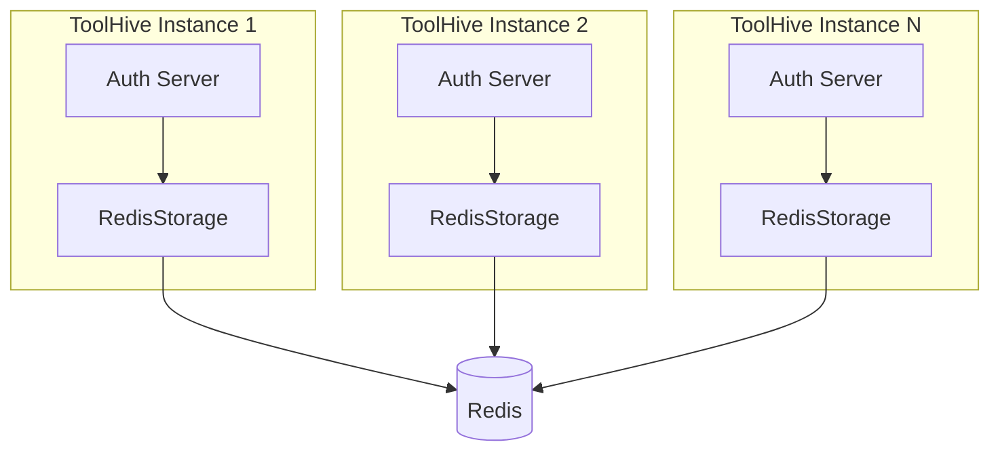

# RFC-XXXX: Redis-Backed Storage for Auth Server

- **Status**: Draft
- **Author(s)**: TBD (@github-handle)
- **Created**: 2026-02-02
- **Last Updated**: 2026-02-02
- **Target Repository**: toolhive
- **Related Issues**: TBD

## Summary

Add a Redis-backed implementation of the `Storage` interface in `pkg/authserver/storage/` to enable horizontal scaling of the embedded authorization server. This allows multiple ToolHive instances to share authentication state, supporting high-availability deployments.

## Problem Statement

The current auth server storage implementation (`MemoryStorage`) stores all OAuth2 tokens, authorization codes, user data, and pending authorizations in memory. This creates several limitations:

- **No horizontal scaling**: Multiple ToolHive instances cannot share authentication state
- **No persistence across restarts**: All tokens and sessions are lost when the process restarts
- **Single point of failure**: The auth server cannot be deployed in HA configuration
- **Memory pressure**: Large deployments with many clients/tokens consume significant memory

Users deploying ToolHive in production environments with high availability requirements are affected. This is particularly important for Kubernetes deployments where multiple replicas need to share state.

## Goals

- Implement a `RedisStorage` type that satisfies the `Storage` interface
- Support all existing storage operations with Redis as the backend
- Maintain compatibility with the fosite OAuth2 library interfaces
- Enable atomic operations for token creation/revocation
- Support configurable Redis connection options (standalone, Sentinel, Cluster)
- Provide automatic key expiration using Redis TTL features

## Non-Goals

- Migrating existing in-memory data to Redis (cold start is acceptable)
- Supporting other distributed storage backends (PostgreSQL, etcd) in this RFC
- Implementing distributed locking beyond what Redis provides natively
- Adding Redis as a dependency for local/development use (MemoryStorage remains default)
- Redis persistence (RDB/AOF) - this implementation is memory-only
- Encryption at rest - not needed since data is memory-only with short TTLs

## Proposed Solution

### High-Level Design



### Detailed Design

#### Component Changes

**New Files:**

1. `pkg/authserver/storage/redis.go` - Main Redis storage implementation
2. `pkg/authserver/storage/redis_test.go` - Unit tests with Redis mocking
3. `pkg/authserver/storage/redis_keys.go` - Key generation and naming conventions

**Modified Files:**

1. `pkg/authserver/storage/config.go` - Add Redis configuration type and options
2. `pkg/authserver/storage/types.go` - Add `TypeRedis` constant to `Type` enum

#### Redis Key Schema

Keys are namespaced and **partitioned by MCP server name** to support multi-tenancy where multiple MCP servers share the same Redis instance:

```
thv:auth:{<server_name>}:<type>:<identifier>

Key Structure:
- thv:auth:        - Global prefix (configurable via KeyPrefix)
- {<server_name>}: - MCP server name in hash tags for Redis Cluster slot routing
- <type>:          - Data type (authcode, access, refresh, etc.)
- <identifier>:    - Unique identifier (signature, user_id, etc.)
```

**Hash Tag Partitioning:**

The `{<server_name>}` syntax uses Redis hash tags to ensure all keys for a single MCP server are routed to the same cluster slot. This enables:
- **Multi-tenancy**: Multiple MCP servers can safely share one Redis instance
- **Cluster compatibility**: Related keys stay on the same shard for atomic operations
- **Isolation**: Each MCP server's data is logically separated

**Key Examples:**

```
# For MCP server "my-mcp-server":
thv:auth:{my-mcp-server}:authcode:<signature>          # Authorization codes
thv:auth:{my-mcp-server}:access:<signature>            # Access tokens
thv:auth:{my-mcp-server}:refresh:<signature>           # Refresh tokens
thv:auth:{my-mcp-server}:pkce:<signature>              # PKCE requests
thv:auth:{my-mcp-server}:client:<client_id>            # OAuth clients
thv:auth:{my-mcp-server}:user:<user_id>                # User records
thv:auth:{my-mcp-server}:provider:<provider_key>       # Provider identities
thv:auth:{my-mcp-server}:upstream:<user_id>:<provider> # Upstream tokens
thv:auth:{my-mcp-server}:pending:<internal_state>      # Pending authorizations
thv:auth:{my-mcp-server}:invalidated:<signature>       # Invalidated auth codes
thv:auth:{my-mcp-server}:jwt:<jti>                     # Client assertion JTIs

# Secondary indexes for request ID lookups (RFC 7009 revocation)
thv:auth:{my-mcp-server}:reqid:access:<request_id>     # Maps request ID -> access token signature
thv:auth:{my-mcp-server}:reqid:refresh:<request_id>    # Maps request ID -> refresh token signature
```

**Benefits of Server-Based Partitioning:**

| Benefit | Description |
|---------|-------------|
| Multi-tenancy | Multiple MCP servers share Redis without key collisions |
| Cluster routing | Hash tags ensure related keys land on same shard |
| Atomic operations | Lua scripts work correctly (same-slot requirement) |
| Key scanning | `SCAN` can filter by server: `thv:auth:{my-server}:*` |
| Data isolation | Easy to delete all data for a specific server |
| Monitoring | Metrics can be grouped by server name |

#### API Changes

New factory function and configuration:

```go
// redis.go
type RedisStorage struct {
    client redis.UniversalClient
    config RedisConfig
}

// NewRedisStorage creates a new Redis-backed storage
func NewRedisStorage(ctx context.Context, cfg RedisConfig) (*RedisStorage, error)

// RedisConfig holds Redis connection configuration
type RedisConfig struct {
    // Standalone mode
    Addr string
    DB   int

    // Sentinel mode
    MasterName    string
    SentinelAddrs []string

    // Cluster mode
    ClusterAddrs []string

    // Authentication (multiple options for production flexibility)
    // Option 1: ACL User (Redis 6+ recommended for production)
    Username string // ACL username (leave empty for 'default' user)
    Password string // ACL password or legacy AUTH password

    // Option 2: TLS Client Certificates (mTLS)
    TLSConfig *tls.Config // Includes client cert for mTLS auth

    // Option 3: Cloud IAM (for managed Redis services)
    // AWS ElastiCache IAM auth, Azure AD, GCP IAM
    IAMAuthEnabled bool
    IAMAuthFunc    func(ctx context.Context) (string, error) // Returns short-lived token

    // Key partitioning - KeyPrefix is derived from server name
    // Format: thv:auth:{<server-name>}:
    // This is automatically set by the operator/runner from MCPServer name
    KeyPrefix string

    // Common options
    DialTimeout  time.Duration
    ReadTimeout  time.Duration
    WriteTimeout time.Duration
    PoolSize     int
}
```

#### Configuration Changes

Update `storage.Config` and `storage.RunConfig`:

```go
// config.go additions
const TypeRedis Type = "redis"

type Config struct {
    Type   Type
    Memory *MemoryConfig // existing
    Redis  *RedisConfig  // new
}

type RunConfig struct {
    Type   Type              `json:"type" yaml:"type"`
    Memory *MemoryRunConfig  `json:"memory,omitempty" yaml:"memory,omitempty"`
    Redis  *RedisRunConfig   `json:"redis,omitempty" yaml:"redis,omitempty"`
}

type RedisRunConfig struct {
    // Connection
    Addr          string   `json:"addr" yaml:"addr"`
    DB            int      `json:"db,omitempty" yaml:"db,omitempty"`
    MasterName    string   `json:"masterName,omitempty" yaml:"masterName,omitempty"`
    SentinelAddrs []string `json:"sentinelAddrs,omitempty" yaml:"sentinelAddrs,omitempty"`
    ClusterAddrs  []string `json:"clusterAddrs,omitempty" yaml:"clusterAddrs,omitempty"`

    // Authentication - supports multiple methods
    // Method 1: ACL User credentials (Redis 6+ recommended)
    Username string `json:"username,omitempty" yaml:"username,omitempty"` // ACL username
    Password string `json:"password,omitempty" yaml:"password,omitempty"` // ACL password

    // Method 2: TLS with optional mTLS
    TLSEnabled     bool   `json:"tlsEnabled,omitempty" yaml:"tlsEnabled,omitempty"`
    TLSCertFile    string `json:"tlsCertFile,omitempty" yaml:"tlsCertFile,omitempty"`     // Client cert for mTLS
    TLSKeyFile     string `json:"tlsKeyFile,omitempty" yaml:"tlsKeyFile,omitempty"`       // Client key for mTLS
    TLSCACertFile  string `json:"tlsCACertFile,omitempty" yaml:"tlsCACertFile,omitempty"` // CA cert for server verification
    TLSSkipVerify  bool   `json:"tlsSkipVerify,omitempty" yaml:"tlsSkipVerify,omitempty"` // Skip server cert verification (not for prod)

    // Method 3: Cloud IAM authentication
    IAMAuthEnabled bool   `json:"iamAuthEnabled,omitempty" yaml:"iamAuthEnabled,omitempty"`
    IAMProvider    string `json:"iamProvider,omitempty" yaml:"iamProvider,omitempty"` // "aws", "azure", "gcp"

    // KeyPrefix is automatically derived from the MCP server name
    // Format: thv:auth:{<server-name>}:
    // This ensures key partitioning for multi-tenancy in Redis Cluster
    // Users should NOT set this manually in most cases - it's populated by the operator
    // +optional
    KeyPrefix string `json:"keyPrefix,omitempty" yaml:"keyPrefix,omitempty"`
}
```

#### Kubernetes CRD Changes

**File:** `cmd/thv-operator/api/v1alpha1/mcpexternalauthconfig_types.go`

Update `EmbeddedAuthServerConfig` to support Redis storage:

```go
type EmbeddedAuthServerConfig struct {
    // Issuer is the issuer identifier for this authorization server
    Issuer string `json:"issuer"`

    // SigningKeySecretRefs references Kubernetes Secrets containing signing keys
    SigningKeySecretRefs []SecretKeyRef `json:"signingKeySecretRefs,omitempty"`

    // HMACSecretRefs references Kubernetes Secrets for signing auth codes/refresh tokens
    HMACSecretRefs []SecretKeyRef `json:"hmacSecretRefs,omitempty"`

    // TokenLifespans configures token validity durations
    TokenLifespans *TokenLifespanConfig `json:"tokenLifespans,omitempty"`

    // UpstreamProviders configures upstream Identity Provider connections
    UpstreamProviders []UpstreamProviderConfig `json:"upstreamProviders"`

    // Storage configures the storage backend for tokens and authorization state
    // If not specified, defaults to in-memory storage (single replica only)
    // +optional
    Storage *AuthServerStorageConfig `json:"storage,omitempty"`
}

// AuthServerStorageConfig configures the storage backend for the embedded auth server
type AuthServerStorageConfig struct {
    // Type specifies the storage backend type
    // Valid values: "memory" (default), "redis"
    // +kubebuilder:validation:Enum=memory;redis
    // +kubebuilder:default=memory
    Type string `json:"type,omitempty"`

    // Redis configures Redis storage backend
    // Required when type is "redis"
    // +optional
    Redis *RedisStorageConfig `json:"redis,omitempty"`
}

// RedisStorageConfig configures Redis connection for auth server storage
type RedisStorageConfig struct {
    // Mode specifies Redis deployment mode
    // Valid values: "standalone", "sentinel", "cluster"
    // +kubebuilder:validation:Enum=standalone;sentinel;cluster
    // +kubebuilder:default=standalone
    Mode string `json:"mode,omitempty"`

    // Standalone configuration (when mode is "standalone")
    // +optional
    Standalone *RedisStandaloneConfig `json:"standalone,omitempty"`

    // Sentinel configuration (when mode is "sentinel")
    // +optional
    Sentinel *RedisSentinelConfig `json:"sentinel,omitempty"`

    // Cluster configuration (when mode is "cluster")
    // +optional
    Cluster *RedisClusterConfig `json:"cluster,omitempty"`

    // Auth configures authentication to Redis
    // +optional
    Auth *RedisAuthConfig `json:"auth,omitempty"`

    // TLS configures TLS settings for Redis connection
    // +optional
    TLS *RedisTLSConfig `json:"tls,omitempty"`

    // KeyPrefix override - normally auto-derived from MCPServer/VirtualMCPServer name
    // Format when auto-derived: thv:auth:{<server-name>}:
    // Only set this if you need a custom prefix (not recommended)
    // +optional
    KeyPrefix string `json:"keyPrefix,omitempty"`
}

// Note: The operator automatically sets KeyPrefix based on the parent resource name:
// - For MCPServer "my-server": KeyPrefix = "thv:auth:{my-server}:"
// - For VirtualMCPServer "my-vmcp": KeyPrefix = "thv:auth:{my-vmcp}:"
// This ensures proper key partitioning in Redis Cluster and multi-tenant isolation.

// RedisStandaloneConfig configures a standalone Redis connection
type RedisStandaloneConfig struct {
    // Host is the Redis server hostname or IP
    Host string `json:"host"`

    // Port is the Redis server port (default: 6379)
    // +kubebuilder:default=6379
    Port int32 `json:"port,omitempty"`

    // DB is the Redis database number (default: 0)
    // +kubebuilder:default=0
    DB int32 `json:"db,omitempty"`
}

// RedisSentinelConfig configures Redis Sentinel connection
type RedisSentinelConfig struct {
    // MasterName is the name of the Redis master monitored by Sentinel
    MasterName string `json:"masterName"`

    // SentinelAddrs is a list of Sentinel host:port addresses
    SentinelAddrs []string `json:"sentinelAddrs"`

    // DB is the Redis database number (default: 0)
    // +kubebuilder:default=0
    DB int32 `json:"db,omitempty"`
}

// RedisClusterConfig configures Redis Cluster connection
type RedisClusterConfig struct {
    // Addrs is a list of cluster node host:port addresses
    Addrs []string `json:"addrs"`
}

// RedisAuthConfig configures Redis authentication
type RedisAuthConfig struct {
    // Type specifies the authentication method
    // Valid values: "password", "acl" (username+password), "mtls"
    // +kubebuilder:validation:Enum=password;acl;mtls
    // +kubebuilder:default=password
    Type string `json:"type,omitempty"`

    // PasswordSecretRef references a Secret containing the Redis password
    // The secret must have a key named "password"
    // Used when type is "password" or "acl"
    // +optional
    PasswordSecretRef *SecretKeyRef `json:"passwordSecretRef,omitempty"`

    // UsernameSecretRef references a Secret containing the Redis ACL username
    // The secret must have a key named "username"
    // Used when type is "acl"
    // +optional
    UsernameSecretRef *SecretKeyRef `json:"usernameSecretRef,omitempty"`
}

// RedisTLSConfig configures TLS for Redis connection
type RedisTLSConfig struct {
    // Enabled controls whether TLS is used for Redis connections
    Enabled bool `json:"enabled"`

    // SecretRef references a Secret containing TLS certificates
    // For mTLS: must contain "tls.crt", "tls.key", and optionally "ca.crt"
    // For server verification only: must contain "ca.crt"
    // +optional
    SecretRef *corev1.LocalObjectReference `json:"secretRef,omitempty"`

    // InsecureSkipVerify disables server certificate verification
    // WARNING: Only use for testing. Not recommended for production.
    // +optional
    InsecureSkipVerify bool `json:"insecureSkipVerify,omitempty"`
}
```

**Example CRD Usage:**

```yaml
apiVersion: toolhive.stacklok.com/v1alpha1
kind: MCPExternalAuthConfig
metadata:
  name: my-auth-config
spec:
  type: embeddedAuthServer
  embeddedAuthServer:
    issuer: "https://auth.example.com"
    signingKeySecretRefs:
      - name: auth-signing-key
        key: private.pem
    upstreamProviders:
      - name: github
        type: oidc
        issuer: "https://github.com"
        clientID: "my-client-id"
        clientSecretRef:
          name: github-oauth-secret
          key: client-secret
    # NEW: Storage configuration for multi-replica deployments
    storage:
      type: redis
      redis:
        mode: standalone
        standalone:
          host: redis.default.svc.cluster.local
          port: 6379
        auth:
          type: acl
          usernameSecretRef:
            name: redis-credentials
            key: username
          passwordSecretRef:
            name: redis-credentials
            key: password
        tls:
          enabled: true
          secretRef:
            name: redis-tls-certs
```

**Redis Sentinel Example:**

```yaml
storage:
  type: redis
  redis:
    mode: sentinel
    sentinel:
      masterName: mymaster
      sentinelAddrs:
        - sentinel-0.redis.svc:26379
        - sentinel-1.redis.svc:26379
        - sentinel-2.redis.svc:26379
    auth:
      type: password
      passwordSecretRef:
        name: redis-auth
        key: password
    tls:
      enabled: true
      secretRef:
        name: redis-ca
```

**Redis Cluster Example:**

```yaml
storage:
  type: redis
  redis:
    mode: cluster
    cluster:
      addrs:
        - redis-0.redis.svc:6379
        - redis-1.redis.svc:6379
        - redis-2.redis.svc:6379
    auth:
      type: acl
      usernameSecretRef:
        name: redis-acl
        key: username
      passwordSecretRef:
        name: redis-acl
        key: password
```

#### Redis Kubernetes Operator (OpsTree)

For provisioning Redis in Kubernetes, we recommend the **OpsTree Redis Operator** for its support of all deployment modes (standalone, cluster, sentinel, replication).

**Installation:**

```bash
# Install the operator
helm repo add ot-helm https://ot-container-kit.github.io/helm-charts/
helm repo update
helm install redis-operator ot-helm/redis-operator --namespace redis-operator --create-namespace
```

---

##### Complete Manifests for OpsTree Redis Operator

**Step 1: Create Redis Authentication Secret**

```yaml
---
# redis-secret.yaml
# Secret containing Redis password for ACL authentication
apiVersion: v1
kind: Secret
metadata:
  name: toolhive-redis-secret
  namespace: toolhive
type: Opaque
stringData:
  password: "your-secure-password-here"  # Change this!
```

Apply: `kubectl apply -f redis-secret.yaml`

---

**Step 2a: Redis Standalone (Memory-Only)**

For single-instance deployments without persistence:

```yaml
---
# redis-standalone.yaml
apiVersion: redis.redis.opstreelabs.in/v1beta2
kind: Redis
metadata:
  name: toolhive-redis
  namespace: toolhive
spec:
  kubernetesConfig:
    image: quay.io/opstree/redis:v7.2
    imagePullPolicy: IfNotPresent
    resources:
      requests:
        cpu: "100m"
        memory: "128Mi"
      limits:
        cpu: "500m"
        memory: "512Mi"
    # Reference the authentication secret
    redisSecret:
      name: toolhive-redis-secret
      key: password
  # Memory-only: no storage section
  # Disable persistence via Redis config
  redisConfig:
    additionalRedisConfig: |
      save ""
      appendonly no
  # Optional: Prometheus metrics
  redisExporter:
    enabled: true
    image: quay.io/opstree/redis-exporter:v1.44.0
    resources:
      requests:
        cpu: "50m"
        memory: "64Mi"
      limits:
        cpu: "100m"
        memory: "128Mi"
```

Service will be available at: `toolhive-redis.toolhive.svc.cluster.local:6379`

---

**Step 2b: Redis Cluster (Memory-Only, HA)**

For high-availability deployments with sharding:

```yaml
---
# redis-cluster.yaml
apiVersion: redis.redis.opstreelabs.in/v1beta2
kind: RedisCluster
metadata:
  name: toolhive-redis-cluster
  namespace: toolhive
spec:
  clusterSize: 3  # Number of leader nodes (total pods = clusterSize * 2 for leader+follower)
  clusterVersion: v7
  kubernetesConfig:
    image: quay.io/opstree/redis:v7.2
    imagePullPolicy: IfNotPresent
    resources:
      requests:
        cpu: "100m"
        memory: "128Mi"
      limits:
        cpu: "500m"
        memory: "512Mi"
    # Reference the authentication secret
    redisSecret:
      name: toolhive-redis-secret
      key: password
  # Memory-only: no storage section, disable persistence
  redisLeader:
    redisConfig:
      additionalRedisConfig: |
        save ""
        appendonly no
  redisFollower:
    redisConfig:
      additionalRedisConfig: |
        save ""
        appendonly no
  # Optional: Prometheus metrics
  redisExporter:
    enabled: true
    image: quay.io/opstree/redis-exporter:v1.44.0
```

Cluster service: `toolhive-redis-cluster.toolhive.svc.cluster.local:6379`

---

**Step 2c: Redis Replication with Sentinel (Memory-Only, HA)**

For high-availability with automatic failover via Sentinel:

```yaml
---
# redis-replication.yaml
apiVersion: redis.redis.opstreelabs.in/v1beta2
kind: RedisReplication
metadata:
  name: toolhive-redis-replication
  namespace: toolhive
spec:
  clusterSize: 3  # 1 leader + 2 followers
  kubernetesConfig:
    image: quay.io/opstree/redis:v7.2
    imagePullPolicy: IfNotPresent
    resources:
      requests:
        cpu: "100m"
        memory: "128Mi"
      limits:
        cpu: "500m"
        memory: "512Mi"
    redisSecret:
      name: toolhive-redis-secret
      key: password
  # Memory-only: disable persistence
  redisConfig:
    additionalRedisConfig: |
      save ""
      appendonly no
---
# redis-sentinel.yaml
apiVersion: redis.redis.opstreelabs.in/v1beta2
kind: RedisSentinel
metadata:
  name: toolhive-redis-sentinel
  namespace: toolhive
spec:
  clusterSize: 3  # Number of Sentinel instances
  kubernetesConfig:
    image: quay.io/opstree/redis-sentinel:v7.2
    imagePullPolicy: IfNotPresent
    resources:
      requests:
        cpu: "50m"
        memory: "64Mi"
      limits:
        cpu: "100m"
        memory: "128Mi"
    redisSecret:
      name: toolhive-redis-secret
      key: password
  redisSentinelConfig:
    redisReplicationName: toolhive-redis-replication
    masterGroupName: mymaster
    quorum: "2"
```

Sentinel service: `toolhive-redis-sentinel.toolhive.svc.cluster.local:26379`

---

**Step 3: TLS Configuration (Optional)**

For encrypted connections, create TLS secrets and enable TLS:

```yaml
---
# redis-tls-secret.yaml
# Create using: kubectl create secret generic toolhive-redis-tls \
#   --from-file=ca.crt=ca.crt \
#   --from-file=tls.crt=redis.crt \
#   --from-file=tls.key=redis.key \
#   -n toolhive
apiVersion: v1
kind: Secret
metadata:
  name: toolhive-redis-tls
  namespace: toolhive
type: kubernetes.io/tls
data:
  ca.crt: <base64-encoded-ca-cert>
  tls.crt: <base64-encoded-server-cert>
  tls.key: <base64-encoded-server-key>
---
# redis-standalone-tls.yaml
apiVersion: redis.redis.opstreelabs.in/v1beta2
kind: Redis
metadata:
  name: toolhive-redis
  namespace: toolhive
spec:
  kubernetesConfig:
    image: quay.io/opstree/redis:v7.2
    imagePullPolicy: IfNotPresent
    resources:
      requests:
        cpu: "100m"
        memory: "128Mi"
      limits:
        cpu: "500m"
        memory: "512Mi"
    redisSecret:
      name: toolhive-redis-secret
      key: password
  TLS:
    ca: ca.crt
    cert: tls.crt
    key: tls.key
    secret:
      secretName: toolhive-redis-tls
  redisConfig:
    additionalRedisConfig: |
      save ""
      appendonly no
      tls-port 6379
      port 0
      tls-auth-clients yes
```

---

**Step 4: Configure ToolHive to Connect**

Example MCPExternalAuthConfig referencing the OpsTree-provisioned Redis:

```yaml
---
# toolhive-auth-config.yaml
apiVersion: toolhive.stacklok.com/v1alpha1
kind: MCPExternalAuthConfig
metadata:
  name: my-auth-config
  namespace: toolhive
spec:
  type: embeddedAuthServer
  embeddedAuthServer:
    issuer: "https://auth.example.com"
    signingKeySecretRefs:
      - name: auth-signing-key
        key: private.pem
    upstreamProviders:
      - name: github
        type: oidc
        issuer: "https://github.com"
        clientID: "my-client-id"
        clientSecretRef:
          name: github-oauth-secret
          key: client-secret
    storage:
      type: redis
      redis:
        mode: standalone  # or "sentinel" or "cluster"
        standalone:
          host: toolhive-redis.toolhive.svc.cluster.local
          port: 6379
        auth:
          type: password
          passwordSecretRef:
            name: toolhive-redis-secret
            key: password
        # For TLS-enabled Redis:
        # tls:
        #   enabled: true
        #   secretRef:
        #     name: toolhive-redis-tls
```

For Sentinel mode:

```yaml
    storage:
      type: redis
      redis:
        mode: sentinel
        sentinel:
          masterName: mymaster
          sentinelAddrs:
            - toolhive-redis-sentinel-0.toolhive-redis-sentinel-headless.toolhive.svc:26379
            - toolhive-redis-sentinel-1.toolhive-redis-sentinel-headless.toolhive.svc:26379
            - toolhive-redis-sentinel-2.toolhive-redis-sentinel-headless.toolhive.svc:26379
        auth:
          type: password
          passwordSecretRef:
            name: toolhive-redis-secret
            key: password
```

---

##### Alternative Redis Operators

Other options for provisioning Redis in Kubernetes (not covered in detail):

- **Spotahome Redis Operator** ([GitHub](https://github.com/spotahome/redis-operator)) - Focused on Sentinel HA with automatic failover. Good choice if you only need Sentinel mode.

- **Bitnami Redis Helm Chart** ([GitHub](https://github.com/bitnami/charts/tree/main/bitnami/redis)) - Not an operator, but widely used for simpler deployments. Quick setup via Helm.

- **Redis Enterprise Operator** ([Redis.io](https://redis.io/docs/latest/operate/kubernetes/)) - Commercial option with advanced features. Requires Redis Enterprise license.

#### Data Model Changes

All stored types will be serialized to JSON. The `fosite.Requester` interface requires special handling:

```go
// Serializable wrapper for fosite.Requester
type storedRequest struct {
    ClientID      string            `json:"client_id"`
    RequestedAt   time.Time         `json:"requested_at"`
    Scopes        []string          `json:"scopes"`
    GrantedScopes []string          `json:"granted_scopes"`
    Form          url.Values        `json:"form"`
    Session       json.RawMessage   `json:"session"` // Session-specific serialization
    RequestID     string            `json:"request_id"`
    ExpiresAt     time.Time         `json:"expires_at"`
}
```

#### Implementation Details

**Atomic Operations:**

Use Redis transactions (MULTI/EXEC) and Lua scripts for operations that modify multiple keys. Hash tags ensure related keys are on the same shard:

```go
// Example: Token revocation by request ID
// All keys use same hash tag {serverName} so they're on the same shard
func (s *RedisStorage) RevokeAccessToken(ctx context.Context, requestID string) error {
    // Lua script for atomic lookup + delete
    // Keys are partitioned by server name: thv:auth:{serverName}:...
    script := redis.NewScript(`
        local sig = redis.call('GET', KEYS[1])
        if sig then
            redis.call('DEL', KEYS[2]..sig)
            redis.call('DEL', KEYS[1])
            return 1
        end
        return 0
    `)
    // s.key() generates: thv:auth:{serverName}:<type>:<id>
    return script.Run(ctx, s.client,
        []string{s.key("reqid:access", requestID), s.key("access", "")},
    ).Err()
}

// Key generation using pre-computed KeyPrefix
func (s *RedisStorage) key(dataType, identifier string) string {
    // KeyPrefix already includes hash tag: thv:auth:{serverName}:
    // Final format: thv:auth:{serverName}:<type>:<identifier>
    return fmt.Sprintf("%s%s:%s", s.config.KeyPrefix, dataType, identifier)
}

// KeyPrefix derivation (done once at startup by operator/runner)
func DeriveKeyPrefix(serverName string) string {
    // Format: thv:auth:{<server-name>}:
    // Hash tag {serverName} ensures Redis Cluster slot routing
    return fmt.Sprintf("thv:auth:{%s}:", serverName)
}
```

**TTL Handling:**

Leverage Redis SETEX/PSETEX for automatic expiration:

```go
func (s *RedisStorage) CreateAccessTokenSession(ctx context.Context, signature string, requester fosite.Requester) error {
    data, err := s.serializeRequester(requester)
    if err != nil {
        return err
    }

    ttl := s.getExpirationFromRequester(requester, fosite.AccessToken)

    pipe := s.client.TxPipeline()
    pipe.Set(ctx, s.key("access", signature), data, ttl)
    pipe.Set(ctx, s.key("reqid:access", requester.GetID()), signature, ttl)
    _, err = pipe.Exec(ctx)
    return err
}
```

**Session Deserialization:**

The `session` parameter in Get methods is used as a prototype for deserialization:

```go
func (s *RedisStorage) GetAccessTokenSession(ctx context.Context, signature string, session fosite.Session) (fosite.Requester, error) {
    data, err := s.client.Get(ctx, s.key("access", signature)).Bytes()
    if errors.Is(err, redis.Nil) {
        return nil, storage.ErrNotFound
    }
    if err != nil {
        return nil, err
    }

    return s.deserializeRequester(data, session)
}
```

## Security Considerations

### Threat Model

- **Compromised Redis instance**: Attacker gains access to all OAuth tokens and user data
- **Network interception**: Token data intercepted in transit to Redis
- **Key enumeration**: Attacker attempts to discover valid tokens via key scanning

### Authentication and Authorization

**Production Authentication Methods (in order of preference):**

1. **Redis ACL Users (Redis 6+)** - Recommended for production
   - Create dedicated user with limited permissions (no FLUSHALL, CONFIG, SHUTDOWN)
   - Per-application users enable credential rotation without downtime
   - Example: `ACL SETUSER toolhive on >password ~thv:auth:* +get +set +del +expire +scan`

2. **mTLS (Mutual TLS)** - For high-security environments
   - Client certificate authentication in addition to or instead of password
   - Both server and client authenticate each other during TLS handshake
   - Recommended for fintech, healthcare, and compliance-driven deployments

3. **Cloud IAM Authentication** - For managed Redis services
   - AWS ElastiCache supports IAM authentication (short-lived tokens)
   - Azure Cache for Redis supports Azure AD authentication
   - Eliminates static credentials entirely

4. **Legacy Password (AUTH command)** - Acceptable for development only
   - Single shared password, no fine-grained permissions
   - Cannot rotate without downtime
   - Not recommended for production

**Authorization via Redis ACLs:**
- Restrict to only required commands: GET, SET, DEL, EXPIRE, PSETEX, SCAN, EVAL
- Restrict to key patterns: `~thv:auth:*`
- Block dangerous commands: FLUSHALL, FLUSHDB, CONFIG, SHUTDOWN, DEBUG

### Data Security

**Memory-Only Operation:**
This implementation uses Redis in memory-only mode (no RDB/AOF persistence). Data is lost on Redis restart, which is acceptable for OAuth tokens:
- Access tokens: 1 hour TTL (users re-authenticate)
- Refresh tokens: 30 day TTL (re-issued from upstream IDP)
- Auth codes: 10 minute TTL (re-request authorization)

**In Transit:**
- Require TLS for all Redis connections in production
- mTLS recommended for cross-datacenter communication

**Sensitive Data Stored:**
- Access tokens, refresh tokens, upstream IDP tokens (sensitive)
- PKCE verifiers, authorization codes (short-lived, sensitive)
- User IDs, client IDs (identifiers, not secrets)

**Data Retention:**
- Automatic cleanup via Redis TTL - no explicit deletion needed
- Expired data automatically purged by Redis

### Input Validation

- All keys are constructed from validated internal data (signatures, UUIDs)
- No direct user input is used in key construction
- JSON serialization handles escaping automatically

### Secrets Management

- **ACL credentials**: Should come from environment variables or secret managers (Vault, AWS Secrets Manager, K8s Secrets)
- **TLS certificates**: Mount from K8s Secrets or cert-manager; never embed in config files
- **IAM credentials**: Use instance profiles, workload identity, or service accounts - no static credentials
- **Connection strings**: Never log with embedded passwords; use separate credential injection
- **Credential rotation**: ACL users support rotation without downtime; plan for periodic rotation

### Audit and Logging

- Log Redis connection events (connect, disconnect, reconnect)
- Log storage operation failures at WARN level
- Do not log token values or session data

### Mitigations

| Threat | Mitigation |
|--------|------------|
| Compromised Redis | Network isolation, ACL users with limited permissions, mTLS, key pattern restrictions |
| Credential theft | ACL users enable rotation; mTLS uses certificates; IAM eliminates static credentials |
| Network interception | TLS required for production; mTLS for high-security |
| Key enumeration | Non-guessable signatures (cryptographically random); ACL key pattern restrictions |
| Data breach | Short TTLs minimize exposure window; memory-only means no persistent data to steal |
| Privilege escalation | ACL restricts to minimal command set; no admin commands allowed |

## Alternatives Considered

### Alternative 1: PostgreSQL Backend

- **Description**: Use PostgreSQL for token storage
- **Pros**: ACID transactions, existing infrastructure in many deployments
- **Cons**: Higher latency, more complex schema management, requires migrations
- **Why not chosen**: Redis better suited for ephemeral token storage with TTLs

### Alternative 2: etcd Backend

- **Description**: Use etcd for distributed token storage
- **Pros**: Native K8s integration, strong consistency
- **Cons**: Not designed for high-throughput token storage, limited TTL support
- **Why not chosen**: Redis has better performance characteristics for this use case

### Alternative 3: Embedded Distributed Cache (Hazelcast, etc.)

- **Description**: Embed a distributed cache library
- **Pros**: No external dependency
- **Cons**: Complex cluster management, increased binary size, operational complexity
- **Why not chosen**: Redis is widely deployed and well-understood operationally

## Compatibility

### Backward Compatibility

- **Fully backward compatible**: MemoryStorage remains the default
- **No migration required**: New deployments can opt-in to Redis
- **Configuration-based selection**: Storage type selected via config

### Forward Compatibility

- Key schema includes version prefix option for future migrations
- Serialization format (JSON) is extensible
- Interface-based design allows adding new backends

## Implementation Plan

### Phase 1: Core Implementation

- Implement `RedisStorage` struct with all `Storage` interface methods
- Add Redis configuration types
- Implement key generation utilities
- Add connection health checking

### Phase 2: Testing

- Unit tests with Redis mocking (go-redis mock or miniredis)
- Integration tests against real Redis (can use testcontainers)
- Add Redis storage to existing integration test matrix

### Phase 3: Documentation & Configuration

- Document Redis configuration options
- Add example configurations for standalone, Sentinel, and Cluster modes
- Update architecture documentation

### Phase 4: Operator CRD Updates

- Add `AuthServerStorageConfig`, `RedisStorageConfig`, and related types to CRD
- Update EmbeddedAuthServerConfig to include `storage` field
- Run `task operator-generate` and `task operator-manifests`
- Update controller in `pkg/controllerutil/authserver.go` to pass Redis config to runner
- Add validation webhooks for Redis configuration

### Phase 5: Operator Integration Testing

- Test with Spotahome Redis Operator (Sentinel mode)
- Test with OpsTree Redis Operator (Cluster mode)
- Test with Bitnami Helm chart (standalone mode)
- Verify Secret mounting for credentials and TLS certs

### Dependencies

- `github.com/redis/go-redis/v9` - Redis client library
- `github.com/alicebob/miniredis/v2` - In-memory Redis for testing (test dependency only)

## Testing Strategy

- **Unit tests**: Mock Redis client, test serialization/deserialization, key generation
- **Integration tests**: Real Redis via testcontainers, full Storage interface compliance
- **End-to-end tests**: OAuth flows with Redis storage backend
- **Performance tests**: Token creation/retrieval latency, concurrent access patterns
- **Security tests**: TLS verification, AUTH enforcement

## Documentation

- **User documentation**: Redis configuration guide in docs/
- **API documentation**: GoDoc for RedisStorage and RedisConfig
- **Architecture documentation**: Update `docs/arch/` with storage backend options
- **Operator documentation**:
  - CRD reference for `AuthServerStorageConfig` and `RedisStorageConfig`
  - Redis operator deployment guide (Spotahome, OpsTree, Bitnami)
  - Example manifests for standalone, Sentinel, and Cluster modes
- **Runbooks**: Redis operational guide (monitoring, troubleshooting, failover scenarios)

## Open Questions

1. Should we implement connection pooling configuration, or use library defaults?
2. How should we handle Redis failover scenarios (Sentinel) - retry logic in storage layer?
3. What is the GitHub issue number to link to this RFC?

## References

- [ToolHive Storage Architecture](pkg/authserver/storage/doc.go) - Current storage documentation
- [fosite OAuth2 Library](https://github.com/ory/fosite) - OAuth2 implementation
- [Redis Data Types](https://redis.io/docs/data-types/) - Redis documentation
- [go-redis Client](https://github.com/redis/go-redis) - Recommended Redis client
- [Redis Security Best Practices](https://redis.io/docs/latest/operate/oss_and_stack/management/security/) - Official Redis security guide
- [Redis ACL Documentation](https://redis.io/docs/latest/operate/oss_and_stack/management/security/acl/) - ACL configuration
- [Redis TLS Documentation](https://redis.io/docs/latest/operate/rs/security/encryption/tls/enable-tls/) - TLS setup guide
- [AWS ElastiCache IAM Auth](https://docs.aws.amazon.com/AmazonElastiCache/latest/red-ug/auth-iam.html) - IAM authentication for ElastiCache
- [OpsTree Redis Operator](https://github.com/OT-CONTAINER-KIT/redis-operator) - Kubernetes operator for Redis (all modes)
- [OpsTree Redis Operator Docs](https://ot-container-kit.github.io/redis-operator/guide/setup.html) - Setup and configuration guide
- [Spotahome Redis Operator](https://github.com/spotahome/redis-operator) - Alternative: Kubernetes operator for Redis Sentinel
- [Bitnami Redis Helm Chart](https://github.com/bitnami/charts/tree/main/bitnami/redis) - Alternative: Helm chart for Redis deployments
- [RFC 6749](https://tools.ietf.org/html/rfc6749) - OAuth 2.0 Authorization Framework
- [RFC 7009](https://tools.ietf.org/html/rfc7009) - OAuth 2.0 Token Revocation

---

## RFC Lifecycle

### Review History

| Date | Reviewer | Decision | Notes |
|------|----------|----------|-------|
| 2026-02-02 | TBD | Draft | Initial draft |

### Implementation Tracking

| Repository | PR | Status |
|------------|-----|--------|
| toolhive | TBD | Not Started |
