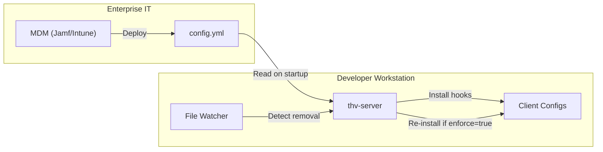

# RFC-0036: Skills Observability via Client Hooks

- **Status**: Draft
- **Author(s)**: Juan Antonio Osorio (@JAORMX)
- **Created**: 2026-02-03
- **Last Updated**: 2026-02-03
- **Target Repository**: toolhive
- **Related Issues**: N/A

## Summary

This RFC proposes adding client hook management to ToolHive CLI, enabling OpenTelemetry-based observability for agent skill execution. ToolHive will install and manage hooks in supported AI clients that capture skill invocation telemetry and forward it to the existing `pkg/telemetry/` infrastructure for OTLP export. A client-specific shim architecture normalizes the different hook formats into a unified telemetry pipeline. Primary support targets Claude Code and Cursor, with Windsurf and Cline as stretch goals.

## Problem Statement

- **No visibility into skill usage**: Organizations have no insight into how agent skills are being used, their invocation frequency, success rates, or usage patterns.
- **Client-native telemetry is insufficient**: Clients like Claude Code emit telemetry indicating a tool was called, but not *which* skill was invoked—skills appear as generic "Skill" tool calls.
- **No audit trail for skills**: Enterprise compliance teams cannot audit skill execution without building custom solutions.
- **Skill developers lack feedback**: Developers creating skills have no data on how their skills are actually being used in the field.
- **Fragmented hook formats**: Each AI client (Claude Code, Cursor, Windsurf, Cline) has its own hook JSON format, making unified observability challenging.
- **Highest-priority stakeholder request**: Skills observability was a 7-star priority item (tied for highest) in the January 2026 brainstorm session.

This MVP focuses exclusively on **OpenTelemetry-based telemetry**. Audit logging, alerting, policy enforcement, and other capabilities are explicitly deferred to future iterations.

## Goals

- Enable OpenTelemetry-based telemetry for skill execution via ToolHive-managed hooks
- Capture pre-tool and post-tool execution events for skills
- Provide skill-specific metrics including skill name, execution status, and timing
- Establish a client-independent hook processing pipeline with client-specific shims
- Support multiple AI clients with different hook formats
  - **Primary**: Claude Code, Cursor
  - **Stretch goals**: Windsurf, Cline
- Ensure ToolHive controls hook installation and maintenance (not user-managed)
- Reuse existing ToolHive telemetry infrastructure (`pkg/telemetry/`)

**Success criteria**: Administrators can install ToolHive hooks with a single command, and skill execution telemetry flows to their OpenTelemetry backend with visibility into which skills are called, how often, and their outcomes.

## Non-Goals

- **Audit logging**: NIST SP 800-53 compliant audit events require additional design for identity, compliance formatting, and the "who did what when where" semantics. Will be addressed in a follow-up RFC.
- **Policy enforcement**: Using hooks to approve/deny skill execution based on organizational policies. All four clients support blocking hooks, but it requires Cedar policy integration and additional authorization design.
- **Alerting**: Real-time alerting when skills perform suspicious actions ("Sysdig for skills"). Requires significant additional infrastructure.
- **User identity tracking**: Capturing which user invoked a skill. Single-player desktop mode has no user identity; enterprise integration requires OIDC/SSO work first.
- **Configuration drift detection (standalone mode)**: In standalone mode, monitoring if users uninstall hooks is not supported. Server-managed mode (see [THV-0034](https://github.com/stacklok/toolhive-rfcs/pull/34)) enables drift detection via file watching.
- **GitHub Copilot support**: GitHub Copilot has no hooks API and only provides built-in telemetry to Microsoft servers.
- **Kubernetes deployment**: Hook installation in K8s contexts. Focus on CLI patterns first.

## Proposed Solution

### High-Level Design

```mermaid
flowchart TB
    subgraph Clients["AI Clients"]
        CLAUDE[Claude Code]
        CURSOR[Cursor]
        WINDSURF[Windsurf]
        CLINE[Cline]
    end

    subgraph HookFormats["Client Hook Formats"]
        CF1["Claude: session_id, tool_name, tool_input"]
        CF2["Cursor: conversation_id, tool_name, tool_input (escaped!)"]
        CF3["Windsurf: trajectory_id, tool_info.mcp_tool_name"]
        CF4["Cline: taskId, preToolUse.toolName"]
    end

    subgraph THV["ToolHive Hook System"]
        subgraph CLI["thv hook commands"]
            INSTALL[install]
            UNINSTALL[uninstall]
            STATUS[status]
        end

        subgraph Runtime["thv hook handle"]
            DETECT[Client Detection]
            subgraph Shims["Client Shims"]
                SHIM_CLAUDE[Claude Shim]
                SHIM_CURSOR[Cursor Shim]
                SHIM_WINDSURF[Windsurf Shim]
                SHIM_CLINE[Cline Shim]
            end
            UNIFIED[Unified HookEvent]
            RESPONSE[Client Response Writer]
            EMITTER[Telemetry Emitter]
        end
    end

    subgraph Telemetry["pkg/telemetry"]
        OTLP[OTLP Exporter]
        PROM[Prometheus Metrics]
    end

    CLAUDE --> CF1 --> SHIM_CLAUDE
    CURSOR --> CF2 --> SHIM_CURSOR
    WINDSURF --> CF3 --> SHIM_WINDSURF
    CLINE --> CF4 --> SHIM_CLINE

    SHIM_CLAUDE --> UNIFIED
    SHIM_CURSOR --> UNIFIED
    SHIM_WINDSURF --> UNIFIED
    SHIM_CLINE --> UNIFIED

    UNIFIED --> EMITTER
    UNIFIED --> RESPONSE

    EMITTER --> OTLP
    EMITTER --> PROM

    RESPONSE -->|"exit 0"| CLAUDE
    RESPONSE -->|'{"permission":"allow"}'| CURSOR
    RESPONSE -->|"exit 0"| WINDSURF
    RESPONSE -->|'{"cancel":false}'| CLINE

    INSTALL --> CLAUDE
    INSTALL --> CURSOR
    INSTALL --> WINDSURF
    INSTALL --> CLINE
```

### Supported Clients

| Client | Priority | Hooks API | Session ID | Tool Name Location | Response Format | Platform |
|--------|----------|-----------|------------|-------------------|-----------------|----------|
| **Claude Code** | Primary | Full (12 events) | `session_id` | `tool_name` | Exit code only | All |
| **Cursor** | Primary | Full (6 events) | `conversation_id` | `tool_name` | `{"permission":"allow"}` | All |
| **Windsurf** | Stretch | Full (11 events) | `trajectory_id` | `tool_info.mcp_tool_name` | Exit code only | All |
| **Cline** | Stretch | Full (7 events) | `taskId` | `preToolUse.toolName` | `{"cancel":false}` | macOS/Linux |

**Notes**:
- **Primary clients** (Claude Code, Cursor) will be implemented in the initial release
- **Stretch goal clients** (Windsurf, Cline) will be implemented if time permits
- GitHub Copilot is explicitly unsupported—it has no hooks API, only built-in telemetry sent to Microsoft servers

### Operating Modes

Hook management supports two modes. **Server-managed mode is the target architecture** for enterprise deployments; standalone mode exists only as a transitional implementation while ToolHive migrates to the long-running server architecture ([THV-0034](https://github.com/stacklok/toolhive-rfcs/pull/34)).

#### Standalone Mode (Transitional)

> **Note**: Standalone mode is a temporary implementation. Once THV-0034 lands, server-managed mode becomes the standard and standalone mode may be deprecated.

When the ToolHive server is not running, the CLI operates directly on client configuration files:

```
thv hook install --client claude
    ↓
CLI writes directly to ~/.claude/settings.json
```

**Limitations:**
- No drift detection—if a user removes hooks, ToolHive won't know
- No centralized configuration—each machine must be configured individually
- No auto-installation—requires explicit `thv hook install` invocation
- Not suitable for enterprise deployments at scale

**Use case**: Individual developers or early adopters before THV-0034 is available.

#### Server-Managed Mode (Target Architecture)

When the ToolHive local server is running, hook management is fully automated:



**Capabilities:**
- **Centralized configuration**: IT deploys `config.yml` via MDM; server handles the rest
- **Auto-installation**: Server installs hooks on startup based on configuration
- **Drift detection**: Server watches client config files for unauthorized changes
- **Auto-remediation**: If `enforce: true`, server re-installs hooks when users remove them
- **Zero-touch for developers**: Developers don't need to run any commands

**Enterprise Deployment Flow:**
1. IT deploys `~/.config/toolhive/config.yml` with `hooks.enabled: true` via MDM
2. IT ensures ToolHive server runs at login (LaunchAgent or login script)
3. Server reads config, installs hooks to configured clients
4. Server watches for drift and remediates as configured
5. Telemetry flows to enterprise OTLP endpoint

#### Server API Endpoints

The server exposes hook management via the standard ToolHive API pattern:

| Method | Endpoint | Description |
|--------|----------|-------------|
| `POST` | `/api/v1beta/hooks/install` | Install hooks for specified client(s) |
| `DELETE` | `/api/v1beta/hooks/uninstall` | Remove hooks from specified client(s) |
| `GET` | `/api/v1beta/hooks/status` | Get hook installation status across clients |

**Install Request/Response:**
```json
// POST /api/v1beta/hooks/install
{ "client": "claude", "force": false }

// Response
{
  "client": "claude",
  "status": "installed",
  "location": "~/.claude/settings.json",
  "events": ["PreToolUse", "PostToolUse", "PostToolUseFailure"]
}
```

**Status Response:**
```json
// GET /api/v1beta/hooks/status
{
  "hooks": [
    {
      "client": "claude",
      "installed": true,
      "location": "~/.claude/settings.json",
      "drift_detected": false
    }
  ]
}
```

#### Configuration Schema

Hook behavior is configured in `~/.config/toolhive/config.yml` (deployed by enterprise IT):

```yaml
hooks:
  # Enable hook management
  enabled: true

  # Which clients to manage: claude, cursor, windsurf, cline
  clients:
    - claude
    - cursor

  # Install hooks automatically when server starts
  auto_install: true

  # Re-install hooks if user removes them (requires file watcher)
  enforce: true

otel:
  endpoint: https://otel.company.com
  headers:
    x-api-key: ${TOOLHIVE_OTEL_API_KEY}
  sampling-rate: 0.1
```

### CLI Commands

All commands live under the `thv hook` namespace.

#### `thv hook install`

Installs ToolHive hooks into specified client(s).

```
thv hook install [flags]

Flags:
  --client string    Target AI client: claude, cursor, windsurf, cline, or all (required)
  --force            Overwrite existing hooks configuration
```

**Behavior:**
- Detects client installation using existing `pkg/client/` infrastructure
- Writes hook configuration to client-specific location
- Configures hooks to invoke `thv hook handle --client <name>` subprocess
- Reports status: `installed`, `updated`, or `already-installed`

**Example:**
```bash
$ thv hook install --client claude
✓ Installed ToolHive hooks for Claude Code
  Location: ~/.claude/settings.json
  Events: PreToolUse, PostToolUse, PostToolUseFailure

$ thv hook install --client all
✓ Installed ToolHive hooks for Claude Code
✓ Installed ToolHive hooks for Cursor
✓ Installed ToolHive hooks for Windsurf
✓ Installed ToolHive hooks for Cline
```

#### `thv hook uninstall`

Removes ToolHive hooks from specified client(s).

```
thv hook uninstall [flags]

Flags:
  --client string    Target AI client: claude, cursor, windsurf, cline, or all (required)
```

**Behavior:**
- Removes ToolHive hook configuration from client settings
- Preserves any non-ToolHive hooks the user may have configured
- Reports status: `uninstalled` or `not-installed`

#### `thv hook status`

Shows hook installation status across clients.

```
thv hook status [flags]

Flags:
  --format string    Output format: table, json, yaml (default "table")
```

**Output Example:**
```
CLIENT        STATUS      EVENTS                                      LOCATION
claude        installed   PreToolUse,PostToolUse,PostToolUseFailure   ~/.claude/settings.json
cursor        installed   beforeMCPExecution,stop                     ~/.cursor/hooks.json
windsurf      installed   pre_mcp_tool_use,post_mcp_tool_use          ~/.codeium/windsurf/hooks.json
cline         installed   PreToolUse,PostToolUse                      ~/Documents/Cline/Hooks/
```

#### `thv hook handle` (Internal)

Internal command invoked by client hooks. Not intended for direct user invocation.

```
thv hook handle --client <name>
```

**Behavior:**
1. Reads hook event JSON from stdin
2. Selects appropriate client shim based on `--client` flag
3. Parses client-specific format into unified `HookEvent`
4. Emits telemetry via `pkg/telemetry/`
5. Writes client-specific "allow" response to stdout
6. Exits successfully (observational only, never blocks)

**Error Handling:**
- Parsing failures are logged but do not cause the hook to fail
- Telemetry emission is best-effort and non-blocking
- The hook always writes an "allow" response to avoid blocking the AI client
- Timeouts in the hook subprocess are handled gracefully

### Client Hook Configurations

#### Claude Code Configuration

**Location**: `~/.claude/settings.json`

```json
{
  "hooks": {
    "PreToolUse": [
      {
        "matcher": "Skill",
        "hooks": [
          {
            "type": "command",
            "command": "thv hook handle --client claude",
            "timeout": 5
          }
        ]
      }
    ],
    "PostToolUse": [
      {
        "matcher": "Skill",
        "hooks": [
          {
            "type": "command",
            "command": "thv hook handle --client claude",
            "async": true,
            "timeout": 10
          }
        ]
      }
    ],
    "PostToolUseFailure": [
      {
        "matcher": "Skill",
        "hooks": [
          {
            "type": "command",
            "command": "thv hook handle --client claude",
            "async": true,
            "timeout": 10
          }
        ]
      }
    ]
  }
}
```

**Input format** (stdin):
```json
{
  "session_id": "abc123",
  "tool_name": "Skill",
  "tool_input": { "skill_name": "commit-message", ... },
  "tool_response": { ... },
  "hook_event_name": "PostToolUse",
  "transcript_path": "/path/to/transcript.jsonl",
  "cwd": "/project"
}
```

**Response**: Exit code 0 (no JSON required)

#### Cursor Configuration

**Location**: `.cursor/hooks.json` (project) or `~/.cursor/hooks.json` (global)

```json
{
  "version": 1,
  "hooks": {
    "beforeMCPExecution": [
      {
        "command": "thv hook handle --client cursor"
      }
    ],
    "stop": [
      {
        "command": "thv hook handle --client cursor"
      }
    ]
  }
}
```

**Input format** (stdin):
```json
{
  "conversation_id": "uuid-string",
  "generation_id": "uuid-string",
  "hook_event_name": "beforeMCPExecution",
  "tool_name": "mcp_tool_name",
  "tool_input": "{\"param1\": \"value1\"}",
  "workspace_roots": ["/project"]
}
```

**IMPORTANT**: Cursor's `tool_input` is an **escaped JSON string**, not a native object. The shim must double-parse it.

**Response**: Must return JSON
```json
{"permission": "allow"}
```

#### Windsurf Configuration

**Locations** (merged in order):
- System: `/Library/Application Support/Windsurf/hooks.json` (macOS)
- User: `~/.codeium/windsurf/hooks.json`
- Project: `.windsurf/hooks.json`

```json
{
  "hooks": {
    "pre_mcp_tool_use": [
      {
        "command": "thv hook handle --client windsurf",
        "show_output": false
      }
    ],
    "post_mcp_tool_use": [
      {
        "command": "thv hook handle --client windsurf",
        "show_output": false
      }
    ]
  }
}
```

**Input format** (stdin):
```json
{
  "agent_action_name": "pre_mcp_tool_use",
  "trajectory_id": "conv-123abc",
  "execution_id": "exec-456def",
  "timestamp": "2025-02-03T10:30:45.123Z",
  "tool_info": {
    "mcp_server_name": "github",
    "mcp_tool_name": "create_issue",
    "mcp_tool_arguments": { "owner": "org", "repo": "repo" }
  }
}
```

**Response**: Exit code 0 (no JSON required)

#### Cline Configuration

**Locations**:
- Global: `~/Documents/Cline/Hooks/PreToolUse` (executable script)
- Project: `.clinerules/hooks/PreToolUse` (executable script)

Unlike other clients, Cline uses **executable files named after the hook type**, not JSON config.

**Hook script** (`~/Documents/Cline/Hooks/PreToolUse`):
```bash
#!/bin/bash
exec thv hook handle --client cline
```

**Input format** (stdin):
```json
{
  "clineVersion": "3.36.0",
  "hookName": "PreToolUse",
  "timestamp": "2025-02-03T10:30:45.123Z",
  "taskId": "task-123",
  "workspaceRoots": ["/project"],
  "preToolUse": {
    "toolName": "write_to_file",
    "parameters": { "path": "/file.ts", "content": "..." }
  }
}
```

**Response**: Must return JSON
```json
{"cancel": false}
```

**Platform limitation**: Cline hooks only work on macOS and Linux (not Windows). On Windows, `thv hook install --client cline` will print a warning and skip installation:

```
⚠ Cline hooks are not supported on Windows (macOS/Linux only)
  Skipping Cline hook installation
```

### Client Shim Architecture

Each client has a shim that normalizes its hook format to a unified event structure. Shims are responsible for:

1. **Parsing**: Converting client-specific JSON into the unified `HookEvent` format
2. **Response writing**: Generating the client-specific "allow" response (JSON or exit code)
3. **Event mapping**: Translating client event names to normalized event types

#### Unified Event Format

All shims normalize client-specific formats to a common `HookEvent` structure containing:

| Field | Type | Description |
|-------|------|-------------|
| `Timestamp` | time | When the event occurred |
| `EventType` | enum | `PreToolUse`, `PostToolUse`, or `PostToolUseFailure` |
| `Client` | string | Which client: `claude`, `cursor`, `windsurf`, `cline` |
| `SessionID` | string | Client session/conversation identifier |
| `ToolName` | string | The tool being invoked (e.g., "Skill") |
| `SkillName` | string | The specific skill name (extracted from tool input) |
| `SkillVersion` | string | Skill version if available |
| `Status` | enum | `success`, `failure`, or empty (pre-execution) |
| `DurationMs` | int64 | Execution duration in milliseconds (post-execution only) |
| `ErrorMessage` | string | Error details if status is failure |

#### Field Mapping by Client

| Unified Field | Claude Code | Cursor | Windsurf | Cline |
|---------------|-------------|--------|----------|-------|
| `SessionID` | `session_id` | `conversation_id` | `trajectory_id` | `taskId` |
| `EventType` | `hook_event_name` | `hook_event_name` | `agent_action_name` | `hookName` |
| `ToolName` | `tool_name` | `tool_name` | `tool_info.mcp_tool_name` | `preToolUse.toolName` |
| `ToolInput` | `tool_input` (object) | `tool_input` (escaped string!) | `tool_info.mcp_tool_arguments` | `preToolUse.parameters` |
| `Error` | `error` | N/A | N/A | N/A |

#### Shim Implementation Details

Each shim handles the unique characteristics of its client's hook format:

**Claude Code Shim:**
- Parses `session_id`, `tool_name`, `tool_input`, `tool_response`, `error`, and `hook_event_name` fields
- Extracts skill name from `tool_input` when `tool_name` is "Skill"
- Determines execution status from presence of `error` (failure) or `tool_response` (success)
- Writes no response (exit code 0 is sufficient for Claude)

**Cursor Shim:**
- Parses `conversation_id`, `generation_id`, `hook_event_name`, `tool_name`, and `tool_input` fields
- **Critical quirk**: `tool_input` is an escaped JSON string, not a native object—requires double-parsing
- First parses the outer JSON structure, then parses the `tool_input` string value as JSON
- Extracts skill name from the nested parsed tool parameters
- Writes `{"permission":"allow"}` JSON response (required by Cursor)

**Windsurf Shim:**
- Parses `agent_action_name`, `trajectory_id`, `execution_id`, `timestamp`, and nested `tool_info` object
- Tool information is nested: `tool_info.mcp_server_name`, `tool_info.mcp_tool_name`, `tool_info.mcp_tool_arguments`
- Extracts skill name from `mcp_tool_arguments` if present
- Writes no response (exit code 0 is sufficient for Windsurf)

**Cline Shim:**
- Parses `clineVersion`, `hookName`, `timestamp`, `taskId`, and event-specific nested objects
- Pre-tool events have `preToolUse.toolName` and `preToolUse.parameters`
- Post-tool events have `postToolUse.toolName`, `postToolUse.result`, `postToolUse.success`, and `postToolUse.executionTimeMs`
- Provides native execution duration tracking (only client with this)
- Writes `{"cancel":false}` JSON response (required by Cline)

### Telemetry Data Model

#### Trace Attributes

```
service.name: toolhive-hooks
service.version: <toolhive-version>

# Skill-specific attributes
skill.name: commit-message
skill.version: v1.2.0
skill.client: claude|cursor|windsurf|cline
skill.status: success|failure|denied
skill.duration_ms: 1234

# Session context
session.id: abc123def456
```

#### Metrics

| Metric | Type | Labels | Description |
|--------|------|--------|-------------|
| `toolhive_skill_invocations_total` | Counter | skill_name, client, status | Total skill invocations |
| `toolhive_skill_duration_seconds` | Histogram | skill_name, client | Skill execution duration |
| `toolhive_skill_denials_total` | Counter | skill_name, client | Skills denied by user |

**Example Prometheus output:**
```prometheus
# HELP toolhive_skill_invocations_total Total number of skill invocations
# TYPE toolhive_skill_invocations_total counter
toolhive_skill_invocations_total{skill_name="commit-message",client="claude",status="success"} 42
toolhive_skill_invocations_total{skill_name="pr-review",client="cursor",status="success"} 15
toolhive_skill_invocations_total{skill_name="code-review",client="windsurf",status="success"} 8
toolhive_skill_invocations_total{skill_name="test-gen",client="cline",status="failure"} 3

# HELP toolhive_skill_duration_seconds Skill execution duration in seconds
# TYPE toolhive_skill_duration_seconds histogram
toolhive_skill_duration_seconds_bucket{skill_name="commit-message",client="claude",le="0.1"} 10
toolhive_skill_duration_seconds_bucket{skill_name="commit-message",client="claude",le="0.5"} 35
toolhive_skill_duration_seconds_bucket{skill_name="commit-message",client="claude",le="1.0"} 42
```

### Telemetry Configuration

Hooks telemetry reuses the existing `pkg/telemetry/` configuration:

```bash
# Environment variables (same as existing thv telemetry)
TOOLHIVE_OTEL_ENABLED=true
TOOLHIVE_OTEL_ENDPOINT=https://api.honeycomb.io
TOOLHIVE_OTEL_HEADERS="x-honeycomb-team=your-api-key"

# Or via thv config
thv config set telemetry.enabled true
thv config set telemetry.endpoint https://api.honeycomb.io
```

The hook handler reads telemetry configuration from the standard ToolHive config locations.

### Cardinality Considerations

Skill names are included in metrics despite cardinality concerns because:

1. **Essential value**: Skill name is the primary dimension for understanding usage
2. **Bounded cardinality**: Organizations typically have 10-100 skills, not thousands
3. **Development spikes are temporary**: Development/testing may cause spikes, but storage lifetime limits mitigate costs
4. **Future: configurable limits**: Can add optional cardinality limits if needed

## Security Considerations

### Threat Model

| Threat | Description | Likelihood | Impact |
|--------|-------------|------------|--------|
| Malicious hook replacement | Attacker modifies hook config to intercept data | Low | High |
| Telemetry data exfiltration | Sensitive skill inputs exposed via telemetry | Medium | Medium |
| Hook command injection | Malicious skill name causes command injection | Low | High |
| Denial of service | Hook causes agent to hang or crash | Low | Medium |
| Cross-client confusion | Wrong shim parses input, causing data corruption | Low | Low |

### Authentication and Authorization

- **No new authentication**: Hook handler runs as local user
- **Telemetry auth**: Delegates to existing OTLP endpoint authentication (headers)
- **No privilege escalation**: Hooks run with same permissions as the AI client
- **Client validation**: `--client` flag is validated against known client list

### Data Security

- **Skill inputs not logged**: Only skill name, version, status, and timing are captured
- **No sensitive data in metrics**: Metrics contain only skill metadata, not content
- **Optional input logging**: Can be enabled for debugging but off by default
- **Local-only by default**: Data only leaves the machine when OTLP endpoint is configured
- **Raw input stored temporarily**: For debugging only, never sent to telemetry backend

### Input Validation

| Input | Validation | Rejection Criteria |
|-------|------------|-------------------|
| Client name | Must be in allowed list | Unknown client |
| Event type | Must be valid hook event for client | Invalid event |
| Skill name | Sanitized for metric labels | Invalid characters |
| JSON input | Size limits (1MB), schema validation | Malformed or oversized |
| Cursor tool_input | Double-parse escaped JSON safely | Invalid nested JSON |

### Secrets Management

- **No secrets stored by hooks**: Hook configuration contains no credentials
- **OTLP credentials**: Managed via existing `pkg/telemetry/` patterns
- **Environment isolation**: Hook handler inherits environment from client, filtered

### Audit and Logging

- **Telemetry is observational**: Hook events are telemetry, not audit logs
- **Future audit RFC**: Full audit logging (who/what/when/where) requires separate design
- **Debug logging**: Hook handler logs to stderr for troubleshooting (visible in client verbose mode)

### Mitigations

| Threat | Mitigation |
|--------|------------|
| Malicious hook replacement | ToolHive validates hook config on status check |
| Telemetry data exfiltration | No skill inputs in default telemetry |
| Hook command injection | No shell interpolation; direct exec |
| Denial of service | Timeouts, async hooks, graceful failure |
| Cross-client confusion | Explicit `--client` flag, schema validation per client |

## Enterprise Deployment

Enterprise IT deploys hook-based observability by deploying two artifacts to developer workstations:

1. **Configuration file** (`~/.config/toolhive/config.yml`) - defines hook and telemetry settings
2. **Server auto-start** - ensures ToolHive server runs at user login

### What IT Deploys

**Configuration file:**

```yaml
# ~/.config/toolhive/config.yml
hooks:
  enabled: true
  clients: [claude, cursor]
  auto_install: true
  enforce: true

otel:
  endpoint: https://otel.company.com:4318
  headers:
    x-api-key: ${TOOLHIVE_OTEL_API_KEY}
  sampling-rate: 0.1
```

**Server auto-start:**

IT configures the ToolHive server to start at user login using their platform's standard mechanisms:
- **macOS**: LaunchAgent in `/Library/LaunchAgents/`
- **Linux**: systemd user service
- **Windows**: Startup folder or scheduled task

### What ToolHive Does

Once deployed, the ToolHive server handles everything automatically:

1. Reads configuration on startup
2. Installs hooks to configured AI clients
3. Watches for configuration drift (if `enforce: true`)
4. Re-installs hooks if users remove them
5. Emits telemetry to the configured OTLP endpoint

**Developers don't need to run any commands**—hook management is invisible to them.

### Verification

IT can verify deployment via:
- Telemetry presence in the OTLP backend (skill invocation metrics appearing)
- MDM compliance checks on config file presence
- Remote `thv hook status` execution (if remote management tooling supports it)

## Compatibility

### Backward Compatibility

- **Existing thv commands**: Unchanged; hook commands use dedicated namespace
- **Existing telemetry**: `pkg/telemetry/` extended with new metrics, existing metrics unchanged
- **Existing client configs**: Hook installation preserves existing hooks

### Forward Compatibility

- **Event type extensibility**: New hook events can be added without schema breaks
- **Client extensibility**: New clients can be supported by adding shims
- **Telemetry evolution**: New metrics/spans can be added without breaking existing
- **Shim versioning**: Shims can handle multiple versions of client hook formats

## Implementation Plan

### Phase 1: Core Infrastructure

- Add `thv hook` command namespace
- Implement `ClientShim` interface and unified `HookEvent` format
- Create Claude Code shim (most mature client)
- Implement hook configuration management for Claude Code
- Add basic telemetry emission (counters only)

### Phase 2: Cursor Support & Full Telemetry

- Implement Cursor shim (handle escaped JSON quirk)
- Add histogram metrics for duration
- Implement trace spans for skill invocations
- Add telemetry configuration (sampling, custom attributes)
- Integration tests with mock OTLP backend

### Phase 3: Stretch Goal - Additional Clients

- Implement Windsurf shim
- Implement Cline shim (handle executable-based config)
- Add Windows detection for Cline (warn and skip)
- Add `--client all` support
- Cross-client integration tests

### Phase 4: Polish and Documentation

- Add `thv hook status` comprehensive reporting
- Error handling improvements
- User documentation and tutorials
- Grafana dashboard examples

### Dependencies

- Existing `pkg/telemetry/` infrastructure
- Existing `pkg/client/` for client detection
- OpenTelemetry Go SDK (already a dependency)

## Testing Strategy

- **Unit tests**: Each shim's parsing logic, field mapping, response generation
- **Unit tests**: Escaped JSON handling (Cursor quirk)
- **Integration tests**: Hook installation/uninstallation per client
- **Integration tests**: End-to-end telemetry emission with mock collector
- **E2E tests**: Real client installations with actual hook invocations
- **Manual tests**: Verify telemetry in Honeycomb/Jaeger/Prometheus

## Documentation

- **CLI reference**: `thv hook --help` and subcommand documentation
- **User guide**: "Enabling Skills Observability with ToolHive"
- **Architecture doc**: Hook system design in `docs/arch/`
- **Client-specific guides**: Setup instructions per client
- **Grafana dashboard examples**: Sample dashboards for skill metrics

## Open Questions

1. **Skill name extraction**: How do we reliably identify skill invocations vs regular MCP tool calls across different clients? The tool name is typically "Skill" but we need to extract the actual skill name from `tool_input`. Need to validate extraction logic with real skill invocations across all clients.

2. **THV-0034 dependency**: Should this RFC block on THV-0034 (long-running server), or should we implement standalone mode first and migrate later? Standalone mode has significant limitations for enterprise use.

3. **Enforcement behavior**: When `enforce: true` and a user removes hooks, should the server re-install immediately, or wait until next server restart? Immediate re-installation may frustrate users; delayed enforcement may leave gaps in telemetry.

4. **ToolHive Studio integration**: Should ToolHive Studio expose hook management in its UI? If so, should it be a simple toggle or provide more granular control?

## References

- [Skills Observability Requirements Document](https://docs.google.com/document/d/1hA108Abv3-duG84PKoHGEo9qKJZRvll6K66qzKV5XS0/edit)
- [THV-0034: Local Long-Running Server Architecture](https://github.com/stacklok/toolhive-rfcs/pull/34)
- [Claude Code Hooks Documentation](https://docs.anthropic.com/en/docs/claude-code/hooks)
- [Cursor Hooks Documentation](https://docs.cursor.com/context/rules#hooks)
- [Windsurf Cascade Hooks](https://docs.codeium.com/windsurf/cascade#hooks)
- [Cline Hooks Reference](https://docs.cline.bot/features/hooks)
- [THV-0001: OpenTelemetry Integration](./THV-0001-otel-integration-proposal.md)
- [THV-0030: Skills Lifecycle Management](./THV-0030-skills-lifecycle-management.md)
- [ToolHive Telemetry Package](https://github.com/stacklok/toolhive/tree/main/pkg/telemetry)
- [ToolHive API Package](https://github.com/stacklok/toolhive/tree/main/pkg/api)
- Stakeholder brainstorm: January 21, 2026
- Design meeting: January 28, 2026

---

## RFC Lifecycle

### Review History

| Date | Reviewer | Decision | Notes |
|------|----------|----------|-------|
| 2026-02-03 | - | Draft | Initial submission |
| 2026-02-03 | - | Draft | Added multi-client shim architecture (Claude, Cursor, Windsurf, Cline) |
| 2026-02-03 | - | Draft | Claude Code + Cursor as primary; Windsurf + Cline as stretch goals |
| 2026-02-03 | - | Draft | Added Operating Modes (standalone vs server-managed), Enterprise Deployment section, Server API endpoints |

### Implementation Tracking

| Repository | PR | Status |
|------------|-----|--------|
| toolhive | - | Pending |
