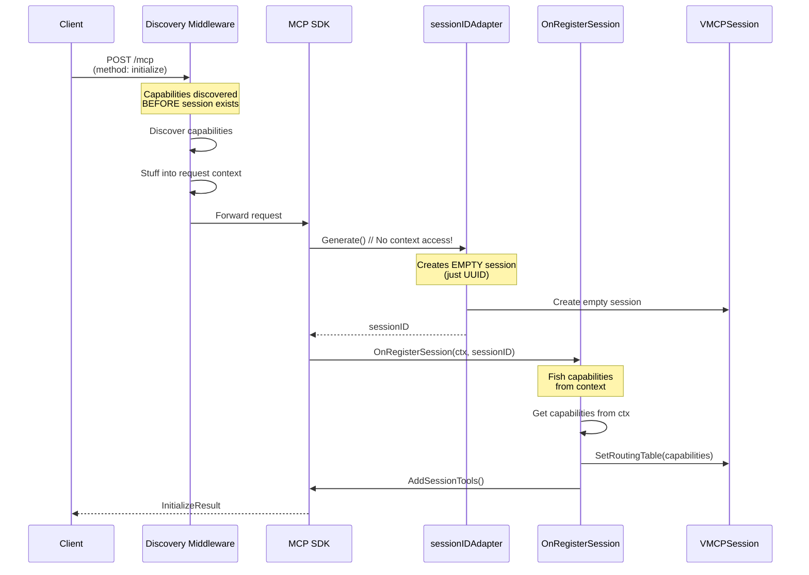
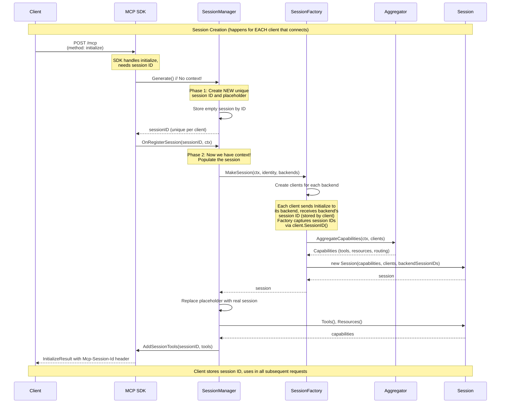
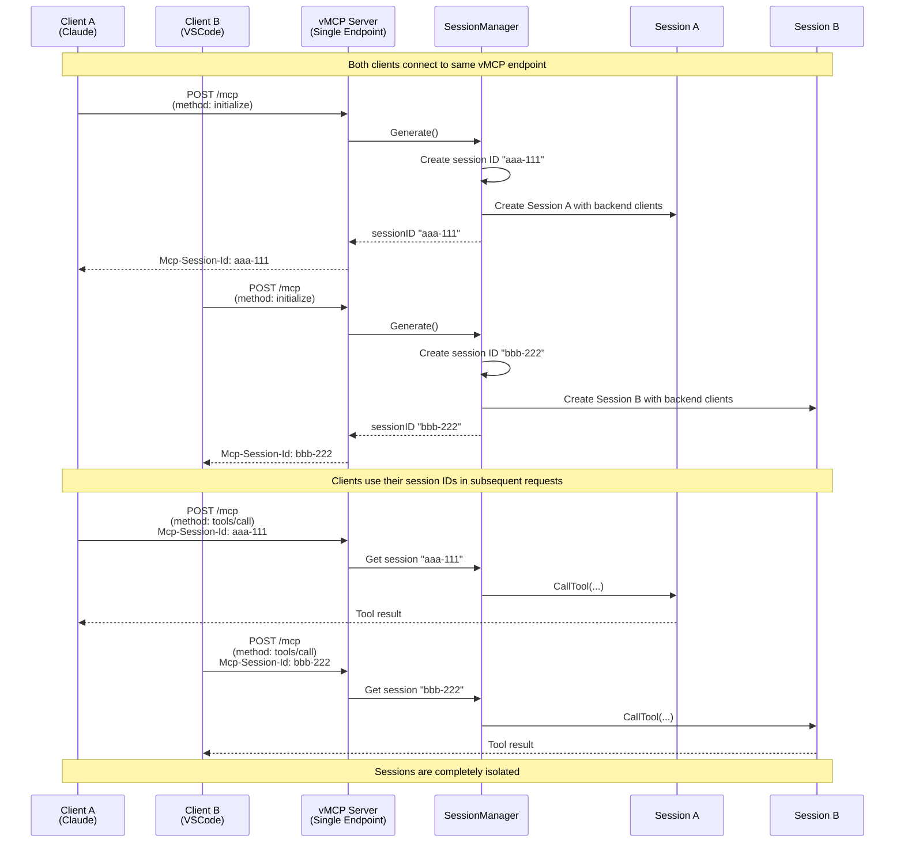

# THV-0038: Session-Scoped Architecture for vMCP

- **Status**: Draft
- **Author(s)**: @yrobla, @jerm-dro
- **Created**: 2026-02-04
- **Last Updated**: 2026-02-16
- **Target Repository**: toolhive
- **Related Issues**: [toolhive#3062](https://github.com/stacklok/toolhive/issues/3062)

## Summary

Refactor vMCP session architecture around three core components: `Session` (domain object with behavior), `SessionFactory` (creates fully-formed sessions), and `SessionManager` (bridges domain logic to MCP SDK protocol). This separates session creation (domain logic) from SDK integration (protocol concerns) and integrates with the existing pluggable session storage architecture.

**Multi-client session model**: One vMCP instance serves multiple clients (e.g., Claude Desktop, VSCode, Cursor) via a single HTTP endpoint. Each client that sends an `InitializeRequest` gets a unique session ID (per MCP Streamable HTTP protocol). Sessions are created dynamically when clients connect, not pre-created at startup. Each session owns its own backend clients for complete isolation.

Restructuring the session management enables:

- **Client reuse throughout the session**: Backend clients are created once during session initialization, reused for all requests within that session, and closed during cleanup, enabling stateful workflows (e.g., Playwright browser sessions, database transactions)
- **Integration testing without full server**: Test session capabilities and routing logic in isolation without spinning up the complete vMCP server
- **Simplified feature extensions**: Add capabilities like optimizer-in-vmcp and capability refresh through interface decoration, since protocol concerns are decoupled from how capabilities are calculated

## Terminology

This RFC uses the following terms consistently:

| Term | Definition | Example |
|------|------------|---------|
| **Backend** | A deployed MCP server instance that vMCP aggregates | Filesystem MCP server, Playwright MCP server |
| **Backend workload** | Same as "backend" - the deployment unit | Used interchangeably with "backend" |
| **MCP server** | Generic term for any MCP-compliant server | Can refer to vMCP itself or a backend |
| **vMCP session** | Client-to-vMCP session identified by vMCP's session ID | Session created when Claude Desktop initializes with vMCP |
| **Backend session** | vMCP-to-backend session identified by backend's session ID | Session between vMCP's client and a Playwright backend |
| **Backend client** | MCP client instance connecting vMCP to one backend | Instance of `mcp-go/client.Client` |
| **Session-scoped** | Resources that live for the duration of a vMCP session | Backend clients created at init, closed at session expiration |
| **Session ID** | Unique identifier for a vMCP session (UUID) | Returned in `Mcp-Session-Id` header |

**Key distinction**: A single **vMCP session** owns multiple **backend clients**, each potentially maintaining its own **backend session** with the respective backend MCP server.

## Problem Statement

### The Symptom: Per-Request Client Lifecycle

The current `httpBackendClient` implementation creates and closes MCP clients on every request. Each method (`CallTool`, `ReadResource`, `GetPrompt`, `ListCapabilities`) follows the same pattern:

1. Create a new client via `clientFactory()`
2. Defer client closure with `c.Close()`
3. Initialize the client with MCP handshake
4. Perform the requested operation
5. Close the client when the function returns

This creates multiple problems:

1. **Connection Overhead**: Every tool call incurs TCP handshake, TLS negotiation, and MCP protocol initialization overhead
2. **State Loss**: Backends maintaining stateful contexts (Playwright browser sessions, database transactions) lose state between requests
3. **Redundant Initialization**: Capability discovery establishes which backends exist, but clients are recreated for every request
4. **Resource Waste**: Repeated client creation/destruction wastes CPU and bandwidth

### The Root Cause: Scattered Session Architecture

The per-request client pattern is a symptom of a deeper architectural problem: **session concerns are scattered throughout the codebase without clear encapsulation**.

#### Current Architecture Problems

**1. Session Creation is Tangled with SDK Integration**

Session construction is spread across middleware, adapters, and hooks—tightly coupled to the MCP SDK's lifecycle callbacks:

- **Discovery middleware** triggers capability discovery before the session exists, then stuffs results into request context ([discovery/middleware.go](https://github.com/stacklok/toolhive/blob/main/pkg/vmcp/discovery/middleware.go))
- **Session ID adapter** creates an empty session when the SDK calls `Generate()`, with no access to discovered capabilities ([session_adapter.go](https://github.com/stacklok/toolhive/blob/main/pkg/vmcp/server/session_adapter.go))
- **OnRegisterSession hook** fishes capabilities back out of context and populates the session ([server.go](https://github.com/stacklok/toolhive/blob/main/pkg/vmcp/server/server.go))

This creates cognitive load: to understand "how does a session get created?", you must trace through middleware, adapter callbacks, SDK hooks, and context threading across multiple files.

**2. VMCPSession is a Passive Data Container, Not a Domain Object**

The existing `VMCPSession` is a passive data container with getters and setters (e.g., `SetRoutingTable()`, `SetTools()`), not an object with encapsulated behavior.

**Problems with this approach:**

- **Data written in one place, read in another**: Routing table set in `OnRegisterSession`, but read by router via context, not from the session object
- **No single source of truth**: Session state scattered across context values, `VMCPSession` struct, and transport layer's `StreamableSession`
- **Objects don't do anything**: Router, handler factory, and backend client are separate stateless components operating on data pulled from context

**3. Routing Logic is Context-Based, Not Session-Based**

The current design routes requests via **context**, not session object lookup:

- Middleware stuffs capabilities into context before SDK sees request ([discovery/middleware.go](https://github.com/stacklok/toolhive/blob/main/pkg/vmcp/discovery/middleware.go))
- Router is stateless - extracts routing table from context on every request ([router/default_router.go](https://github.com/stacklok/toolhive/blob/main/pkg/vmcp/router/default_router.go)) by reading capabilities from context
- Handler factory uses router to find backend target, then calls shared backend client ([adapter/handler_factory.go](https://github.com/stacklok/toolhive/blob/main/pkg/vmcp/server/adapter/handler_factory.go))

**Flow**: `request → middleware (stuff ctx) → handler → router (read ctx) → backend client`

There's no `sessions.Load(sessionID)` - routing data flows through context. The backend client is shared across all sessions and creates new MCP connections per request.

**4. Hard to Create Session-Scoped Resources**

Because session construction is tangled with SDK lifecycle hooks and routing logic flows through context instead of session objects, it's difficult to create objects with session lifetimes (like persistent MCP clients). This is the immediate problem we're solving, but it's symptomatic of the larger architectural issue.

### Consequences

These architectural problems have cascading effects:

1. **Client lifecycle complexity**: Per-request client creation is the path of least resistance when you can't easily create session-scoped resources
2. **Missing integration tests**: Can't create sessions without spinning up the whole vMCP server ([toolhive#2852](https://github.com/stacklok/toolhive/issues/2852))
3. **Difficult feature additions**: Adding optimizer-in-vmcp ([PR #3517](https://github.com/stacklok/toolhive/pull/3517), [PR #3312](https://github.com/stacklok/toolhive/pull/3312)) required extensive changes to `server.go` hooks
4. **Capability refresh complexity**: Refreshing session capabilities requires coordinating updates across middleware, router, and SDK registration ([PR #3642 discussion](https://github.com/stacklok/toolhive/pull/3642#issuecomment-3861182622))

### Affected Parties

- **vMCP Server Performance**: Every tool call creates/closes connections, multiplying latency by the number of requests
- **Backend Servers**: Repeated connection churn increases load on backend MCP servers
- **Stateful Backends**: Backends relying on persistent state (Playwright, databases) lose context between calls
- **Developers**: Scattered session concerns make the codebase hard to understand, test, and extend
- **Feature Development**: Adding session-related features (optimizer, capability refresh) requires changes across multiple layers

## Goals

1. **Encapsulate Session Behavior**: Introduce a `Session` interface as a domain object that owns its resources, encapsulates routing logic, and manages its own lifecycle
2. **Decouple Session Creation from SDK Wiring**: Separate the concern of *building a session* (domain logic) from *integrating with the MCP SDK* (protocol concerns) using a `SessionFactory` interface
3. **Session-Scoped Client Lifecycle**: Move MCP backend client lifecycle from per-request to session-scoped, enabling stateful workflows
4. **Simplify Testing**: Enable unit and integration tests of session logic without requiring a full vMCP server
5. **Enable Future Features**: Make it straightforward to add features like optimizer-in-vmcp, capability refresh, and connection warming through clean interfaces

## Non-Goals

- **Rewrite All Session Types**: Initial focus is on `VMCPSession`; other session types (ProxySession, SSESession) remain unchanged except for interface compliance
- **Replace Existing Session Storage Architecture**: This RFC **builds on** the existing `transportsession.Manager` and `Storage` interface ([PR #1989](https://github.com/stacklok/toolhive/pull/1989), [PR #1677](https://github.com/stacklok/toolhive/pull/1677), [PR #1770](https://github.com/stacklok/toolhive/pull/1770), [PR #1771](https://github.com/stacklok/toolhive/pull/1771)) rather than creating a parallel storage path. Session storage continues to use the pluggable `Storage` interface designed for Redis/Valkey support.
- **Connection Pooling Within Clients**: Individual MCP clients may internally pool connections, but that's outside this RFC's scope
- **Multi-Session Client Sharing**: Clients remain session-scoped and are not shared across sessions
- **Lazy Capability Discovery**: Capability discovery remains eager and static (i.e., done once at session creation, current behavior)
- **Client Versioning**: Handling MCP protocol version negotiation is out of scope
- **Transparent Horizontal Scaling**: Session-scoped MCP clients are held in Go process memory and cannot be serialized to Redis/Valkey. While session metadata can be stored in pluggable backends ([Issue #2417](https://github.com/stacklok/toolhive/issues/2417)), the MCP client objects themselves are in-process only. **Horizontal scaling of vMCP instances requires sticky sessions** (session affinity at load balancer). Transparent failover across instances is out of scope (clients must be recreated on instance switch, acceptable one-time cost).

## Proposed Solution

### Current State: Tangled Flow

**Today's session creation** is scattered across middleware, adapter, and hooks:



**Problems:** No single component owns session creation. To understand how a session is created, you must trace through:
1. Discovery middleware (triggers discovery, stores in context)
2. SessionIDAdapter (creates empty session)
3. OnRegisterSession hook (populates session from context)

This makes testing difficult (can't create sessions without full server) and adding features complex (optimizer-in-vmcp required extensive server.go changes).

---

### Proposed Design

This RFC proposes restructuring around three core components:

1. **Session**: A domain object that owns its resources (clients), encapsulates routing logic, and manages its own lifecycle
2. **SessionFactory**: Creates fully-formed sessions with all dependencies (capability discovery, client initialization, resource allocation)
3. **SessionManager**: Bridges domain logic (Session/SessionFactory) to MCP SDK protocol, using the existing `transportsession.Manager` for storage

#### Multi-Client Session Model

**One vMCP instance serves multiple clients**, each with their own isolated session:

```
┌─────────────┐
│ Client A    │──┐
│ (Claude)    │  │
└─────────────┘  │     ┌────────────────────────────┐
                 │     │  vMCP Server               │
┌─────────────┐  ├────→│  Endpoint: /mcp            │
│ Client B    │──┤     │  (Streamable HTTP)         │
│ (VSCode)    │  │     └────────────────────────────┘
└─────────────┘  │              │
                 │              ├─ Session aaa-111 (Client A's session)
┌─────────────┐  │              ├─ Session bbb-222 (Client B's session)
│ Client C    │──┘              └─ Session ccc-333 (Client C's session)
│ (Cursor)    │
└─────────────┘
```

**How sessions are created per the MCP Streamable HTTP protocol:**

- vMCP exposes **one HTTP endpoint** (e.g., `POST /mcp`) per [MCP Streamable HTTP spec](https://spec.modelcontextprotocol.io/specification/2025-06-18/basic/transports/)
- **All JSON-RPC methods** (`initialize`, `tools/call`, `resources/read`, etc.) go to the **same endpoint**
  - Method specified in JSON-RPC body, not URL path
  - Example: `POST /mcp` with body `{"jsonrpc": "2.0", "method": "initialize", ...}`
- **Each client** that sends an `InitializeRequest` triggers creation of a **new unique session**
- The server returns a unique session ID via the `Mcp-Session-Id` header
- Clients include their session ID in the `Mcp-Session-Id` header on all subsequent requests
- **Sessions are created dynamically when clients connect**, not pre-created at vMCP startup
- Each session owns its own backend clients (no sharing between sessions)

**vMCP session vs backend sessions** (see [Terminology](#terminology) for definitions):

Clients interact with a **single vMCP session ID** (e.g., `aaa-111`), but vMCP internally manages **multiple backend session IDs**—one per backend MCP server. vMCP maintains an explicit `[vMCP_session_id] -> {backend_id: backend_session_id}` mapping for observability (logging, metrics, health checks, debugging).

**Key behaviors**:
- Client objects include backend session IDs in request headers (MCP protocol requirement)
- vMCP tracks backend session IDs separately (production observability requirement)
- Each vMCP session owns isolated backend clients and session mappings

For detailed lifecycle management (initialization, runtime, re-initialization, cleanup), see [Backend Session ID Lifecycle Management](#3-session-implementation).

**Proposed session creation flow (per client, two-phase pattern due to SDK constraints):**



**Key Flow (two-phase creation per client):**

This flow executes **independently for each client** that connects to vMCP:

1. **Client sends Initialize**: Client (e.g., Claude Desktop, VSCode) sends `POST /mcp` with JSON-RPC method `initialize` to vMCP endpoint
2. **Phase 1 - Generate unique session ID**: SDK calls `Generate()` (no context) → SessionManager creates a **new unique session ID** (e.g., UUID), stores empty placeholder, returns ID
3. **Phase 2 - Build full session**: SDK calls `OnRegisterSession(sessionID, ctx)` (has context) → SessionManager calls `SessionFactory.MakeSession()` to create fully-formed session with:
   - Backend client initialization (one client per backend, each performs MCP `initialize` handshake with its backend; backends respond with their own session IDs which are stored by the client)
   - Capability discovery (tools, resources, prompts) using the initialized clients
   - Routing table construction
4. **Replace placeholder**: SessionManager replaces empty placeholder with fully-formed session
5. **Register capabilities**: SDK registers session's tools/resources via `AddSessionTools()`
6. **Return session ID to client**: Client receives `InitializeResult` with `Mcp-Session-Id: <unique-id>` header

**Critical point**: When Client A and Client B both send Initialize requests:
- Client A triggers `Generate()` → gets session ID `aaa-111` → gets Session A with its own backend clients
- Client B triggers `Generate()` → gets session ID `bbb-222` → gets Session B with its own backend clients
- Sessions are **completely isolated** - no shared state, no shared clients

**Why two phases?** The SDK's `Generate()` has no context parameter (see "SDK Interface Constraint" section below), so we cannot create fully-formed sessions until `OnRegisterSession` hook provides request context.

#### Multi-Client Isolation

To illustrate how multiple clients get isolated sessions:



**Key points:**
- **Single endpoint serves all clients**: All clients POST to the same `/mcp` endpoint
- **Unique session per Initialize**: Each `InitializeRequest` creates a new session with unique ID
- **Session isolation**: Session A and Session B have separate backend clients, routing tables, and state
- **Session ID routing**: `Mcp-Session-Id` header routes requests to the correct session

#### Session Routing Mechanism (How vMCP Associates Requests to Sessions)

**Critical question**: With a single endpoint (`POST /mcp`) serving multiple clients, how does vMCP know which session each request belongs to?

**Answer**: The `Mcp-Session-Id` HTTP header (per [MCP Streamable HTTP spec](https://spec.modelcontextprotocol.io/specification/2025-06-18/basic/transports/)).

**Step-by-step flow:**

1. **Initialize request (no session yet)**:
   ```http
   POST /mcp
   Content-Type: application/json
   # NO Mcp-Session-Id header

   {"jsonrpc": "2.0", "method": "initialize", ...}
   ```

   vMCP logic:
   ```go
   // Request has NO Mcp-Session-Id header → This is initialization
   sessionID := sessionManager.Generate()  // Create new session "aaa-111"

   // Return session ID to client
   w.Header().Set("Mcp-Session-Id", sessionID)  // "aaa-111"
   w.Write(initializeResult)
   ```

2. **Client receives and stores session ID**:
   ```http
   HTTP/1.1 200 OK
   Mcp-Session-Id: aaa-111   # ← Client stores this
   Content-Type: application/json

   {"result": {...}}
   ```

3. **Subsequent request (with session ID)**:
   ```http
   POST /mcp
   Mcp-Session-Id: aaa-111   # ← Client includes stored ID
   Content-Type: application/json

   {"jsonrpc": "2.0", "method": "tools/call", "params": {...}}
   ```

   vMCP logic:
   ```go
   // Request HAS Mcp-Session-Id header → Look up existing session
   sessionID := r.Header.Get("Mcp-Session-Id")  // "aaa-111"

   session := sessionStorage.Get(sessionID)  // Retrieve Session A
   if session == nil {
       return Error("session not found or expired")
   }

   // Route to session's backend
   result := session.CallTool(ctx, toolName, args)
   w.Write(result)
   ```

**How vMCP determines request type:**

| Scenario | `Mcp-Session-Id` Header | vMCP Action |
|----------|------------------------|-------------|
| **First Initialize** | ❌ Not present | `Generate()` → Create new session → Return new ID |
| **Subsequent call** | ✅ Present (e.g., `aaa-111`) | `Get(sessionID)` → Retrieve session → Route request |
| **Invalid session ID** | ✅ Present but expired/invalid | Return `404 Session Not Found` |
| **Re-initialize after expire** | ❌ Not present (client deleted ID) | `Generate()` → Create new session |

**Session storage and lookup:**

```go
type SessionManager struct {
    sessionStorage *transportsession.Manager  // Maps sessionID → Session
}

func (sm *SessionManager) HandleRequest(r *http.Request, w http.ResponseWriter) {
    // Parse JSON-RPC request
    var req struct {
        JSONRPC string      `json:"jsonrpc"`
        Method  string      `json:"method"`
        Params  interface{} `json:"params"`
        ID      interface{} `json:"id"`
    }
    json.NewDecoder(r.Body).Decode(&req)

    sessionID := r.Header.Get("Mcp-Session-Id")

    if sessionID == "" {
        // No session ID → Must be Initialize request
        if req.Method != "initialize" {
            http.Error(w, "Session required", 400)
            return
        }
        newSessionID := sm.Generate()
        // ... handle initialization ...
        w.Header().Set("Mcp-Session-Id", newSessionID)
        return
    }

    // Session ID present → Look up existing session
    session := sm.sessionStorage.Get(sessionID)
    if session == nil {
        http.Error(w, "Session not found or expired", 404)
        return
    }

    // Route request to session based on JSON-RPC method
    switch req.Method {
    case "tools/call":
        result := session.CallTool(req.Params)
    case "resources/read":
        result := session.ReadResource(req.Params)
    case "prompts/get":
        result := session.GetPrompt(req.Params)
    default:
        http.Error(w, "Unknown method", 400)
    }
}
```

**Parallel clients (completely independent):**

```
Time T0: Both clients send Initialize (no session headers)
  Client A → POST /mcp (no header) → Generate() → Session "aaa-111"
  Client B → POST /mcp (no header) → Generate() → Session "bbb-222"

Time T1: Both clients make tool calls (with their session headers)
  Client A → POST /mcp (Mcp-Session-Id: aaa-111) → Get("aaa-111") → Session A
  Client B → POST /mcp (Mcp-Session-Id: bbb-222) → Get("bbb-222") → Session B
```

**Sessions never collide** because:
- ✅ Session IDs are UUIDs (globally unique)
- ✅ Each Generate() call creates NEW unique ID
- ✅ Clients explicitly include their session ID in header
- ✅ vMCP maps requests to sessions via header lookup

**This is standard MCP Streamable HTTP protocol behavior** - vMCP doesn't invent this mechanism, it follows the spec.

### Terminology Clarification

This RFC uses the following terms consistently:

- **Session creation**: Building a fully-formed session with all resources (domain concern) - handled by `SessionFactory`
- **SDK wiring**: Integrating sessions with the MCP SDK lifecycle callbacks and tool/resource registration (protocol concern) - handled by `SessionManager`
- **Domain object**: An object that encapsulates business logic and owns its resources, not just a data container
- **Backend client**: An MCP client connected to a specific backend workload (instance of `mcp-go/client.Client`)
- **Session-scoped**: Resources that live for the duration of a session (created on init, closed on expiration)

### Key Architectural Changes

**1. Session as a Domain Object**

Today's `VMCPSession` is a passive data container with getters and setters (e.g., `SetRoutingTable()`, `RoutingTable()`), not an object with encapsulated behavior.

Proposed `Session` interface is an active domain object that owns backend clients and encapsulates routing logic:

```go
type Session interface {
    // Identity and metadata
    ID() string
    Identity() *auth.Identity

    // Capabilities - returns discovered tools/resources for this session
    Tools() []Tool
    Resources() []Resource
    Prompts() []Prompt

    // Backend session tracking - for observability and debugging
    BackendSessions() map[string]string  // Returns map of backendID -> backendSessionID

    // MCP operations - routing logic is encapsulated here
    CallTool(ctx context.Context, name string, arguments map[string]any) (*ToolResult, error)
    ReadResource(ctx context.Context, uri string) (*ResourceResult, error)
    GetPrompt(ctx context.Context, name string, arguments map[string]any) (*PromptResult, error)

    // Lifecycle
    Close() error
}
```

Instead of exposing internal state through setters, it provides behavior methods like `CallTool()` that look up the target in the routing table and invoke the appropriate backend client.

**2. Decoupling Session Creation from SDK Wiring**

Today: Session construction is spread across middleware (discovery), adapter callbacks (`Generate()`), and SDK hooks (`OnRegisterSession`).

Proposed: Clean separation:
- **SessionFactory**: Builds complete sessions (discovery + client initialization + routing setup)
- **SessionManager**: Bridges between `SessionFactory` (domain) and MCP SDK (protocol) by:
  - Implementing `SessionIdManager` interface (`Generate`, `Validate`, `Terminate`)
  - Converting domain types to SDK types (Session's `Tools()` → `[]mcp.Tool`)
  - Registering capabilities with SDK via `server.AddTool()`, `server.AddResource()`, `server.AddPrompt()`
  - Creating handlers that delegate to `session.CallTool()`, `session.ReadResource()`, `session.GetPrompt()`
  - See example in [`pkg/vmcp/server/server.go` (injectCapabilities)](https://github.com/stacklok/toolhive/blob/main/pkg/vmcp/server/server.go)

**3. Pre-initialized Backend Clients**

Clients are created once during `SessionFactory.MakeSession()` and owned by the session. The same client used for capability discovery becomes the session-scoped client (no redundant connections).

### Detailed Design

#### 1. Core Interfaces

**Session Interface** - A domain object representing an active MCP session:

```go
// Session represents an active MCP session with all its capabilities and resources.
// This is a pure domain object - no protocol concerns. Can be tested without spinning up a server.
type Session interface {
    // Identity and metadata
    ID() string
    Identity() *auth.Identity

    // Capabilities - returns discovered tools/resources for this session
    Tools() []Tool
    Resources() []Resource
    Prompts() []Prompt

    // Backend session tracking - for observability and debugging
    BackendSessions() map[string]string  // Returns map of backendID -> backendSessionID

    // MCP operations - routing logic is encapsulated here
    CallTool(ctx context.Context, name string, arguments map[string]any) (*ToolResult, error)
    ReadResource(ctx context.Context, uri string) (*ResourceResult, error)
    GetPrompt(ctx context.Context, name string, arguments map[string]any) (*PromptResult, error)

    // Lifecycle
    Close() error
}
```

**Key behaviors:**
- **Owns backend clients**: Session stores pre-initialized MCP clients in an internal map
- **Encapsulates routing**: `CallTool()` looks up tool in routing table, routes to correct backend client
- **Manageable lifetime**: `Close()` cleans up clients and any other resources. The SessionManager/caller is decoupled from what exactly happens on close()
- **Thread-safe**: Internal RWMutex protects access to internal data structures (routing table, client map, closed flag). For normal request-handling paths, locks are acquired only while reading/mutating state, then released before invoking client methods so network I/O happens outside the critical section. Methods like `Tools()`, `Resources()`, `Prompts()` return defensive copies to prevent caller mutations. Internal maps and slices are never exposed directly. **Coordination with Close()**: Checking `ctx.Done()` before invoking a client is insufficient on its own—`Close()` could cancel the context and destroy the client between the check and the call (TOCTOU race). The correct pattern is a **`sync.WaitGroup` (in-flight counter)**: each operation increments the counter before invoking a client method and decrements it on return; `Close()` sets an atomic "closed" flag first (so new operations are rejected immediately), then waits for the counter to reach zero before closing clients. This ensures in-flight operations complete safely without holding locks during network I/O on those steady-state call paths. Helper flows such as backend (re)initialization may still perform client creation while holding a lock until they are refactored to follow the same pattern. (See "Client Closed Mid-Request" in Error Handling for details.) Proper encapsulation may allow removal of mutexes elsewhere (e.g., SessionManager, current VMCPSession) since state is now owned by the Session

**Separation of concerns**: The Session interface focuses on domain logic (capabilities, routing, client ownership). This RFC builds on the existing pluggable session storage architecture ([PR #1989](https://github.com/stacklok/toolhive/pull/1989)) which provides `Storage` interface and `Manager` for Redis/Valkey support.

**Dual-layer architecture** (detailed in section "Session Architecture and Serializability"):
- **Metadata layer** (serializable): Session ID, timestamps, identity reference - stored via `transportsession.Manager` + `Storage` interface (supports `LocalStorage` today, `RedisStorage` in future)
- **Runtime layer** (in-memory only): MCP client objects, routing table, capabilities - cannot be serialized due to TCP connections and goroutines

**Lifecycle management**: Sessions are stored via `transportsession.Manager.AddSession()` and expire based on configured TTL. Proper cleanup requires calling `session.Close()` to release backend client connections before removing from storage. The existing `Storage.DeleteExpired()` implementation only removes metadata without calling `Close()`, which would leak connections. This RFC updates the storage layer to call `Close()` before deletion, ensuring complete resource cleanup (see Implementation Plan Phase 3).

**Horizontal scaling**: Session metadata can be in Redis/Valkey, but MCP clients are in-process only. Horizontal scaling requires sticky sessions (session affinity at load balancer) to ensure requests route to the instance holding the client objects. Without sticky sessions, clients must be recreated on instance switch (acceptable one-time cost per [Issue #2417](https://github.com/stacklok/toolhive/issues/2417)).

**SessionFactory Interface** - Creates fully-formed sessions:

```go
// SessionFactory creates fully-formed sessions from configuration and runtime inputs.
type SessionFactory interface {
    // MakeSession constructs a session with all its dependencies.
    // This is where capability discovery, client creation, and resource allocation happen.
    MakeSession(
        ctx context.Context,
        identity *auth.Identity,
        backends []Backend,
    ) (Session, error)
}
```

**Responsibilities:**
- Creates MCP clients for all backends (owns client lifecycle)
- Passes clients to aggregator to discover capabilities
- Constructs session with routing table, tools, resources, and the same pre-initialized clients
- Returns fully-formed session ready for use

#### 2. SessionFactory Implementation

**Implementation approach** (`pkg/vmcp/session/factory.go`):

The default factory implementation follows this pattern:

1. **Create MCP clients and capture backend session IDs**: Initialize clients for each backend **in parallel**
   - Factory creates one client per backend using existing client factory
   - **Client initialization includes MCP handshake**: Each client sends `InitializeRequest` to its backend, and the backend responds with capabilities and its own `Mcp-Session-Id`. The client stores the session ID for protocol compliance (includes it in subsequent request headers).
   - **Capture backend session IDs**: Factory also captures each backend's session ID (via `client.SessionID()`) for observability, storing them in a map to pass to the session
   - **Performance requirement**: Use parallel initialization (e.g., `errgroup` with bounded concurrency) to avoid sequential latency accumulation. Connection initialization (TCP handshake + TLS negotiation + MCP protocol handshake) can take tens to hundreds of milliseconds per backend depending on network latency and backend responsiveness. With 20 backends, sequential initialization could easily exceed acceptable session creation latency.
   - **Bounded concurrency**: Limit parallel goroutines (e.g., 10 concurrent initializations) to avoid resource exhaustion. This limit is **per-session-creation** (not global), implemented as a semaphore inside the factory. It should be a configurable vMCP server-level parameter (e.g., `max_backend_init_concurrency`, default: 10). Operators with many backends on a fast private network can raise it; resource-constrained deployments or backends with expensive initialization should lower it. A global limit across concurrent session creations is not necessary — the per-session semaphore already bounds the worst case per event.
   - **Per-backend timeout**: Apply context timeout (e.g., 5s per backend) so one slow backend doesn't block session creation
   - **Partial initialization**: If some backends fail, log warnings and continue with successfully initialized backends (failed backends not added to clients map)
   - Clients are connection-ready and stateful (each maintains its backend session for protocol use)

2. **Capability discovery**: Pass clients to `aggregator.AggregateCapabilities(ctx, clients)`
   - Aggregator uses provided clients to query capabilities (tools, resources, prompts) from each backend
   - Resolves conflicts using configured strategy (prefix, priority, manual)
   - Returns aggregated capabilities (routing table, tools, resources, prompts)
   - Aggregator does NOT own client lifecycle - just uses them for queries

3. **Return fully-formed session**: Construct session with all dependencies
   - Session ID (UUID)
   - User identity
   - Routing table (maps tool names to backend workload IDs)
   - Tools, resources, prompts (aggregated from backends)
   - Pre-initialized clients map (keyed by workload ID) - same clients used for discovery
   - Backend session IDs map (keyed by workload ID) - captured from `client.SessionID()` calls

**Key Design Decision**: Clients are created once and threaded through: factory → aggregator → session. This eliminates redundant connection setup (TCP handshake + TLS + MCP initialization) while maintaining separation of concerns.

**Example: Factory capturing backend session IDs**:

```go
func (f *defaultSessionFactory) MakeSession(ctx context.Context, identity *auth.Identity, backends []Backend) (Session, error) {
    clients := make(map[string]*Client)
    backendSessions := make(map[string]string)  // NEW: Track backend session IDs

    // Create clients in parallel (simplified for brevity)
    for _, backend := range backends {
        client, err := f.clientFactory.CreateClient(ctx, backend, identity)
        if err != nil {
            log.Warn("Failed to initialize backend %s: %v", backend.ID, err)
            continue
        }

        clients[backend.ID] = client

        // Capture backend session ID for observability
        if sessionID := client.SessionID(); sessionID != "" {
            backendSessions[backend.ID] = sessionID
            log.Debug("Backend %s initialized with session %s", backend.ID, sessionID)
        }
    }

    // Aggregate capabilities using the clients
    capabilities, err := f.aggregator.AggregateCapabilities(ctx, clients)
    if err != nil {
        return nil, fmt.Errorf("capability aggregation failed: %w", err)
    }

    // Create session with clients AND backend session IDs
    return &defaultSession{
        vmcpSessionID:   uuid.New().String(),
        identity:        identity,
        clients:         clients,
        backendSessions: backendSessions,  // Pass the captured session IDs
        routingTable:    capabilities.RoutingTable,
        tools:           capabilities.Tools,
        resources:       capabilities.Resources,
        prompts:         capabilities.Prompts,
    }, nil
}
```

**Updated Aggregator Interface**:

The aggregator interface takes clients as input instead of creating them internally:

```go
AggregateCapabilities(ctx context.Context, clients map[string]*Client) (*AggregationResult, error)
```

**Rationale**: Separates client lifecycle (factory's concern) from capability discovery (aggregator's concern).

#### 3. Session Implementation

**Internal structure** (`pkg/vmcp/session/default_session.go`):

The default session implementation stores:
- **vMCP session ID** and user identity (this is the session ID clients use)
- Routing table mapping tool/resource names to backend workload IDs
- Discovered capabilities (tools, resources, prompts)
- Pre-initialized backend clients map (keyed by workload ID)
- **Backend session IDs map** (keyed by workload ID) - explicit `[vMCP_session_id] -> [backend_session_ids]` mapping
  - Stored separately from client objects for observability and lifecycle management
  - Captured during client initialization when backends return `Mcp-Session-Id` headers
  - Used for: logging, metrics, health checks, debugging, and explicit session cleanup
  - Updated when clients are re-initialized (e.g., after backend session expiration)
- RWMutex for thread-safe access (read lock for queries/calls, write lock for Close)

**Backend session ID lifecycle management:**

The session maintains an explicit mapping of `[vMCP_session_id] -> {backend_id: backend_session_id}` throughout its lifetime:

1. **Initialization** (`SessionFactory.MakeSession()`):
   - Factory creates clients for each backend (which send `InitializeRequest`)
   - Backends respond with `Mcp-Session-Id` headers
   - Factory captures session IDs and passes them to session constructor
   - Session stores the mapping: `backendSessions[backendID] = sessionID`

2. **Runtime operations** (`CallTool`, `ReadResource`):
   - Client objects include backend session IDs in request headers (handled by MCP client library)
   - vMCP uses stored session IDs for logging, metrics, and observability
   - Example log: `"Calling tool 'create_pr' on backend 'github' (backend_session: abc-123)"`

3. **Re-initialization** (when backend session expires):
   - Detect expiration via 404/"session expired" error
   - Create new client (sends new `InitializeRequest`)
   - Backend responds with new `Mcp-Session-Id`
   - Update mapping: `backendSessions[backendID] = newSessionID`
   - Log: `"Backend 'github' session re-initialized: old=abc-123, new=def-456"`

4. **Cleanup** (`Close()`):
   - Iterate through all clients and call `Close()`
   - Closing clients implicitly terminates backend sessions (connection close)
   - Clear backend session mapping: `backendSessions = nil`
   - Log: `"Closed vMCP session xyz-789 with N backend sessions"`

5. **Observability uses**:
   - Health endpoints: `GET /health` returns active backend sessions per vMCP session
   - Metrics: Track backend session churn rate, re-initialization frequency
   - Debugging: Associate tool call errors with specific backend sessions
   - Audit logs: Record which backend sessions were used for compliance

**Method behaviors:**

- **`CallTool(ctx, name, args)`**: Looks up tool in routing table to find target backend, retrieves pre-initialized client from map, calls backend with original (un-prefixed) tool name. Tool names may be prefixed for conflict resolution (e.g., `github__create_pr`), but backend receives original name (`create_pr`).

- **`ReadResource(ctx, uri)`**: Similar routing pattern - consults routing table, uses pre-initialized client.

- **`Close()`**: Acquires write lock, iterates through all clients, calls `Close()` on each, collects errors, returns combined error.

**Thread safety**: Read operations (CallTool, ReadResource) use read locks; Close uses write lock.

**Session lifecycle**: Sessions own backend clients for their lifetime:
- **Session creation**: `SessionFactory.MakeSession()` creates backend clients during initialization
- **Mid-session failures**: If backend client call fails, error is returned to the caller. Session remains active.
- **Session continuity**: Session remains active even if individual backend calls fail. Other backends continue operating normally.
- **No automatic recovery**: Sessions do not attempt to recreate failed clients. Client must handle errors (retry, use different tool, or reinitialize session).

#### 4. Storage Integration and Distributed Deployment

**Building on existing architecture**: This RFC integrates with the existing pluggable session storage layer ([PR #1989](https://github.com/stacklok/toolhive/pull/1989), [Issue #2417](https://github.com/stacklok/toolhive/issues/2417)). The existing architecture provides:
- `Storage` interface with pluggable backends (`LocalStorage` today, `RedisStorage` in future)
- `transportsession.Manager` for session lifecycle management
- JSON serialization for session metadata

**The fundamental constraint**: MCP clients contain active TCP connections and goroutine state that **cannot be serialized**. This is a technical limitation, not an implementation choice. You cannot persist a live TCP connection to Redis.

**The solution: Dual-layer model**

Sessions are split into two layers with different lifecycles:

| Layer | Contents | Storage | Lifetime |
|-------|----------|---------|----------|
| **Metadata** | vMCP session ID, timestamps, identity reference, backend IDs list | Serializable to Redis/Valkey via `Storage` interface | Persists across vMCP restarts, shared across instances |
| **Runtime** | MCP client objects, backend session IDs map (`backendID -> sessionID`), routing table, capabilities, closed flag | In-process memory only | Lives only while vMCP instance is running |

**How it works**:
- The behavior-oriented `Session` embeds `transportsession.Session` (metadata layer) and owns MCP clients (runtime layer)
- Sessions are stored via `transportsession.Manager.AddSession()` which uses the pluggable `Storage` interface
- When `RedisStorage` is implemented, metadata automatically persists to Redis, clients remain in-memory
- No parallel storage path—all sessions go through the same `Storage` interface

**Distributed deployment implications**:

With **sticky sessions** (recommended):
- Load balancer routes client to same vMCP instance → clients stay warm, optimal performance
- Session metadata in Redis (shared), clients in-memory (per-instance)

Without sticky sessions (graceful degradation):
- Request routes to different vMCP instance → that instance loads metadata from Redis
- **Clients must be recreated** (connection initialization overhead: TCP + TLS + MCP handshake, varies with network conditions)
- Subsequent requests to same instance reuse recreated clients
- Trade-off: horizontal scaling flexibility vs temporary performance impact on instance switch

**Implementation detail**: See Phase 1 in Implementation Plan for how `defaultSession` struct composes `transportsession.Session` (metadata) with runtime state (clients map, routing table).

#### 5. Wiring into the MCP SDK

##### SDK Interface Constraint

⚠️ **Critical Design Constraint**: The MCP SDK's `SessionIdManager` interface has a limitation:

```go
// From mark3labs/mcp-go SDK
type SessionIdManager interface {
    Generate() string  // ← No context parameter!
    Validate(sessionID string) (isTerminated bool, err error)
    Terminate(sessionID string) (isNotAllowed bool, err error)
}
```

**Problem**: `Generate()` has no context, so it cannot access:
- Request context (for identity, backends, etc.)
- Discovered capabilities from middleware
- Authentication information

**The Challenge**: Due to the SDK's `Generate()` lacking context access, we cannot create fully-formed sessions in a single step. While not ideal, the well-encapsulated `Session` interface we're introducing makes it straightforward to swap out the SDK for a more ergonomic implementation in the future—this is a key benefit of decoupling domain logic from protocol concerns.

**Implementation Approach**:

Since `Generate()` lacks context access, we use a two-phase creation pattern:

1. **Phase 1 - Session ID generation**: `Generate()` creates session ID, stores empty session placeholder
2. **Phase 2 - Session population**: `OnRegisterSession` hook retrieves backends and identity from request context and calls `SessionFactory.MakeSession()` to create the fully-formed session, then replaces the placeholder

This hybrid approach:
- Works with SDK as-is (no unsafe patterns like goroutine-local storage)
- Reuses existing discovery middleware and context-passing patterns
- Enables incremental migration without blocking on upstream changes

**Note**: While we could contribute a patch to mark3labs/mcp-go adding `Generate(ctx context.Context) string`, this would block implementation and isn't necessary—the two-phase pattern is pragmatic and maintains safety.

##### SessionManager Design

**SessionManager** (`pkg/vmcp/server/session_manager.go`) bridges domain logic to SDK protocol, coordinating three components:
1. `SessionFactory` - Creates fully-formed sessions with initialized clients
2. `transportsession.Manager` - Handles session storage via pluggable `Storage` interface ([PR #1989](https://github.com/stacklok/toolhive/pull/1989))
3. MCP SDK's `SessionIdManager` - Lifecycle hooks for session creation/termination

**Key insight**: By delegating storage to `transportsession.Manager`, SessionManager automatically supports pluggable backends (LocalStorage today, RedisStorage in future) without creating a parallel storage path.

**Session lifecycle flow**:

```
Client Request
    ↓
Generate() → Create empty placeholder → sessionStorage.AddSession() → Return session ID
    ↓
OnRegisterSession hook → factory.MakeSession() → Wrap in transportsession.Session → sessionStorage.AddSession() → SDK registers tools
    ↓
CallTool request → sessionStorage.Get(sessionID) → Extract behavior session → session.CallTool() → Return result
    ↓
Terminate() → sessionStorage.Get() → session.Close() → sessionStorage.Delete()
```

**Implementation structure**:
```go
type sessionManager struct {
    factory        SessionFactory
    sessionStorage *transportsession.Manager  // Delegates to Storage interface
}

// Constructor accepts pluggable storage backend
func NewSessionManager(factory SessionFactory, storage transportsession.Storage) *sessionManager
```

**Core operations** (implements SDK's `SessionIdManager`):
- `Generate()` - Creates empty session, stores via `sessionStorage.AddSession()`, returns ID (phase 1 of two-phase pattern)
- `CreateSession(ctx, identity, backends)` - Calls `factory.MakeSession()`, stores fully-formed session (phase 2, called by `OnRegisterSession` hook)
- `Validate(sessionID)` - Checks session exists via `sessionStorage.Get()`
- `Terminate(sessionID)` - Loads session, calls `Close()` on clients, removes via `sessionStorage.Delete()`
- `GetAdaptedTools(sessionID)` - Loads session, converts domain types to SDK format, creates handlers that delegate to `session.CallTool()`

**Benefits of using `transportsession.Manager`**:
- Pluggable storage works automatically (just pass `RedisStorage` instead of `LocalStorage` to constructor)
- TTL management handled by existing `sessionStorage.Get()` which calls `Touch()`
- No parallel storage path—consistent with all other session types
- Expiration cleanup works uniformly (updated to call `session.Close()` before deletion)

#### 5. Migration from Current Architecture

**Phase 1**: Introduce interfaces and new implementation alongside existing code
- **Note**: Phase 1 will be done incrementally across multiple PRs if necessary, reusing existing implementation pieces. This allows us to introduce the bulk of the code without having to worry about refactoring the existing system.

**Phase 2**: Update server initialization to use new SessionManager
**Phase 3**: Remove old discovery middleware and httpBackendClient patterns
**Phase 4**: Clean up deprecated code paths

Details in Implementation Plan section below.

#### 6. Error Handling

**Session Creation Failures**:

With the two-phase creation pattern:

1. **`Generate()` phase**: Creates empty session (UUID only), always succeeds
   - Stores empty session in map
   - Returns session ID to SDK
   - SDK sends `Mcp-Session-Id` header in `InitializeResult`

2. **`OnRegisterSession` hook phase**: Calls `SessionFactory.MakeSession()` - failure possible here
   - If `MakeSession()` fails completely (e.g., all backends unreachable):
     - Log error with session ID and failure details
     - Create session with **empty capabilities** (no tools, resources, or prompts)
     - SDK registers empty capability list, client sees "no tools available"
     - Keep session in map (allows graceful handling without special error checks)
   - Client experience:
     - Session exists but has no capabilities
     - Client can query session but sees empty tool list
     - Client may delete session and re-initialize, or backend recovery may populate capabilities later

**Rationale**: The two-phase creation pattern (empty session + populate via hook) is necessary because the SDK's `Generate()` must return a session ID. Additionally, the SDK's `OnRegisterSession` hook does not allow returning an error, so failures during `MakeSession()` cannot be propagated directly. Instead of storing initialization errors that require checks in every method (`InitError()` pattern is error-prone - easy to forget checks when adding new methods), we create sessions with empty capabilities. Failed backends don't advertise tools/resources, so clients never try to call them.

**Error messages for empty-capability sessions**: If a client attempts to call a tool on a session with empty capabilities (due to complete initialization failure), the session returns a clear error:
- **NOT**: "Tool not found" (misleading - implies tool doesn't exist in general)
- **INSTEAD**: "No tools available: all backends failed to initialize during session setup. Check backend health and retry." (accurate and actionable)

This is simpler and safer than requiring defensive `InitError()` checks throughout the codebase.

**Partial Backend Initialization**:

If some backends fail during `MakeSession()`:
- Log warnings for failed backends
- Continue with successfully initialized backends
- Session creation succeeds with partial backend set
- Failed backends are not added to the clients map
- Subsequent tool calls to failed backends return "no client found for backend X"
- Health monitoring marks failed backends as unhealthy (existing behavior)

**Tool Call Failures**:

If a tool call fails after successful session creation:
- Return error to client (existing behavior)
- Client remains usable for subsequent requests
- Health monitoring tracks backend health (existing behavior)
- See "Mid-Session Backend Failures" below for recovery strategies

**Mid-Session Backend Failures**:

⚠️ **Critical scenario**: A session successfully initialized with 5 backend clients, but during the session lifetime, one backend crashes, times out, or terminates its connection while the other 4 backends remain healthy.

**Example**:
```
Session ABC-123 (30 minutes old):
  ✅ Backend 1 (filesystem) - HEALTHY
  ❌ Backend 2 (database)   - CRASHED (connection lost)
  ✅ Backend 3 (browser)    - HEALTHY
  ✅ Backend 4 (slack)      - HEALTHY
  ✅ Backend 5 (github)     - HEALTHY

Client calls tool on Backend 2 → Connection error
```

**Question**: Should the entire session be terminated, or can it continue with the remaining healthy backends?

**Proposed Strategy: Simple Error Propagation**

The session **continues operating** with remaining backends. If a backend client fails, the error is returned to the client.

**Implementation approach**:

```go
func (s *Session) CallTool(ctx context.Context, name string, arguments map[string]any) (*ToolResult, error) {
    backend := s.routingTable.Lookup(name)
    client := s.clients[backend.ID]

    // Call backend client - if it fails, return the error
    result, err := client.CallTool(ctx, name, arguments)
    if err != nil {
        return nil, fmt.Errorf("backend %s call failed: %w", backend.ID, err)
    }

    return result, nil
}
```

**Behavior summary**:

| Failure Type | Session Behavior | Client Action |
|--------------|------------------|---------------|
| **Single backend crashes** | Session continues with other backends | Returns error for that backend, client can retry or use other tools |
| **Multiple backends fail** | Session continues with remaining healthy backends | Returns errors for failed backends |
| **All backends fail** | Session remains active but all tool calls fail | Client should delete session and reinitialize |
| **Backend times out** | Return timeout error, mark backend unhealthy | Client can retry or switch to different tool |
| **Backend terminates (graceful)** | Detect via connection close, mark unavailable | Client receives error, can retry later |
| **Backend terminates (crash)** | Detect on next call (connection error) | Client receives error indicating backend unavailable |

**Benefits of this approach**:
1. ✅ **Session resilience** - One backend failure doesn't kill entire session
2. ✅ **Simplicity** - No automatic retry/recovery logic complexity
3. ✅ **Stateful workflows preserved** - Healthy backends (e.g., browser session) remain unaffected
4. ✅ **Clear error messages** - Client knows exactly which backend failed

**Client experience**:
- **Call to failed backend**: Returns clear error "backend X unavailable: connection lost"
- **Retry behavior**: Client decides whether to retry, switch tools, or reinitialize
- **Other backends**: Continue working normally, unaffected by single backend failure

**Alternative considered: Fail entire session**
- ❌ Requires client to reinitialize (loses all state)
- ❌ Kills healthy backend connections (e.g., browser session with open tabs)
- ❌ No automatic recovery (client must manually retry)
- ❌ Poor user experience (disrupts workflow)

**Implementation timing**: Implementation Plan Phase 1 (error propagation only - no recovery logic).

**Client Closed Mid-Request**:

Race condition exists: session may be terminated while a request is in flight:
- Session `Close()` closes all backend clients
- **Race scenario**: RWMutex serializes access but doesn't fully prevent using closed clients—even with a `closed` flag check, there's a window between checking the flag (under read lock) and actually invoking the client method where `Close()` could complete
- **Timing issue**: Thread A checks `closed == false` → releases read lock → Thread B calls `Close()` (acquires write lock, closes clients, sets `closed = true`) → Thread A invokes client method on closed client
- In-flight requests receive "client closed" error from MCP library when this race occurs

**Mitigation strategy**:

- **Context cancellation**: Session has a context that's cancelled on `Close()`
  - `CallTool()` checks `ctx.Done()` before using client
  - If cancelled, return "session closed" error without touching client
  - Acceptable race window: client might get "connection closed" error in rare cases
- **Graceful error handling**: MCP client library handles `Close()` on active connections gracefully (returns errors)
- **TTL extension**: Session storage extends TTL on every request (via existing `Get()` call which touches session), reducing likelihood of expiration during active use

**Backend MCP Server Session Expiration**:

⚠️ **Critical scenario**: Backend MCP servers have their **own session management** independent of vMCP. The backend might expire its session while vMCP's session is still active.

**Example**:
```
vMCP Session ABC-123 (created 30 minutes ago, TTL: 60 min) ✅
  ├─ vMCP Backend Client 1 → Backend MCP Server 1
  │    vMCP side: Connection alive, client reused ✅
  │    Backend side: Session expired (10 min TTL) ❌
  │
  │  Client calls tool → Backend returns:
  │  HTTP 404 "session not found" or
  │  JSON-RPC error "session expired"
```

**Root cause**: Backend MCP servers can:
- Have shorter session TTLs than vMCP (e.g., backend: 10 min, vMCP: 30 min)
- Restart and lose all session state
- Terminate sessions due to inactivity
- Use different session management strategies

**Problem**: vMCP's client holds a reference to a **dead backend session**. The connection is alive, but the backend doesn't recognize the session ID.

**Proposed Solution: Automatic Backend Session Re-initialization**

When vMCP detects backend session expiration (404 or "session expired" error), automatically re-initialize with that backend:

```go
func (s *Session) CallTool(ctx context.Context, name string, arguments map[string]any) (*ToolResult, error) {
    backend := s.routingTable.Lookup(name)

    // Hold RLock only while reading from shared state; release before network I/O.
    s.mu.RLock()
    client := s.clients[backend.ID]
    s.mu.RUnlock()

    result, err := client.CallTool(ctx, name, arguments)

    // Detect backend session expiration
    if isSessionExpiredError(err) {  // 404 or "session not found"
        log.Warn("Backend %s session expired, re-initializing", backend.ID)

        // Re-initialize the backend session (acquires write lock internally).
        if reinitErr := s.reinitializeBackend(ctx, backend.ID); reinitErr != nil {
            return nil, fmt.Errorf("failed to reinitialize backend %s: %w",
                backend.ID, reinitErr)
        }

        // Retry the operation once with the re-initialized session.
        // No further retries: if the new session also fails, surface the error
        // immediately to avoid infinite loops or resource exhaustion.
        // Re-read under RLock: reinitializeBackend replaced the client under write lock.
        s.mu.RLock()
        client = s.clients[backend.ID]
        s.mu.RUnlock()

        result, err = client.CallTool(ctx, name, arguments)
        if err != nil {
            return nil, fmt.Errorf("backend %s failed after re-initialization: %w",
                backend.ID, err)
        }
        return result, nil
    }

    return result, err
}

func (s *Session) reinitializeBackend(ctx context.Context, backendID string) error {
    s.mu.Lock()
    defer s.mu.Unlock()

    backend := s.getBackendConfig(backendID)

    // Close old client (with expired backend session)
    if oldClient := s.clients[backendID]; oldClient != nil {
        oldClient.Close()
    }

    // Create NEW client (triggers new Initialize handshake with backend)
    // This sends InitializeRequest to backend MCP server
    newClient, err := s.clientFactory.CreateClient(ctx, backend, s.identity)
    if err != nil {
        return fmt.Errorf("client creation failed: %w", err)
    }

    // Backend responds with new session ID (in Mcp-Session-Id header)
    // The client stores it for subsequent requests (protocol requirement)

    // Capture the new backend session ID for observability
    newBackendSessionID := newClient.SessionID()  // Assuming client exposes this method

    // Update session state
    oldSessionID := s.backendSessions[backendID]
    s.backendSessions[backendID] = newBackendSessionID
    s.clients[backendID] = newClient

    log.Info("Backend %s session re-initialized: old=%s, new=%s",
        backendID, oldSessionID, newBackendSessionID)
    return nil
}
```

**Flow**: Detect expiration (404/"session expired") → Close old client → Create new client (new backend session) → Update mapping → Retry operation.

**Trade-offs**:

⚠️ **State loss on backend**: Re-initialization creates a **new backend session**, losing any stateful context:
- **Playwright backends**: Browser tabs, cookies, auth state lost
- **Database backends**: Open transactions, temporary tables lost
- **File system backends**: Working directory, file handles lost

**Mitigation strategies for stateful backends**:

⚠️ **Problem**: Stateful backends (Playwright, databases) lose state on re-initialization. Most stateful resources (browser tabs, open transactions) cannot be serialized and restored.

**Mitigations (best effort)**:

1. **Optional keepalive** (prevents expiration):
   - vMCP can periodically call low-cost operations on backends (e.g., `ping`, `listCapabilities`)
   - Extends backend session TTL while vMCP session is active
   - **Limitation**: Not all MCP servers support ping/low-cost operations
   - **Approach**: Best effort - attempt keepalive, gracefully handle backends that don't support it
   - **Configuration**: Enable per backend, configurable interval (default: 5 min)

   The preferred keepalive method is the MCP spec-defined `ping` protocol request, which is side-effect-free and supported by all compliant servers; explicit tool calls should only be used as a fallback. Keepalive failures must not affect healthy sessions — after N consecutive failures the feature should be disabled for that backend, with a periodic probe to re-enable on recovery. Keepalive should default to disabled for stateless backends or where TTL alignment already covers the session lifetime. The keepalive goroutine must hold the backend lock to avoid races with session re-initialization. Operators should be able to observe keepalive health via per-backend metrics covering attempt counts, failure reasons, and auto-disable events.

2. **Session TTL alignment**:
   - Configure backend session TTLs longer than vMCP session TTL
   - Reduces likelihood of backend expiration during active vMCP session

3. **Graceful state loss**:
   - When backend session expires, vMCP re-initializes automatically
   - Return warning in tool result metadata: `backend_reinitialized: true`
   - Client can decide whether to continue or restart workflow

**Fundamental limitations**:
- Some state cannot be preserved (browser DOM, active transactions)
- Keepalive depends on backend support (best effort)
- Re-initialization is unavoidable on backend restart

**Flow comparison**:

| Scenario | vMCP Session | Backend Session | Behavior |
|----------|--------------|-----------------|----------|
| **Backend session expires** | ✅ Active | ❌ Expired | Automatic re-init, retry succeeds, backend state lost |
| **Backend server crashes** | ✅ Active | ❌ Gone | Automatic reconnect, retry succeeds (if backend recovered) |
| **vMCP session expires** | ❌ Expired | ✅ Active | Client must re-initialize vMCP session (top-level) |
| **Both sessions active** | ✅ Active | ✅ Active | Normal operation, state preserved |

**Implementation timing**: Phase 2 (automatic backend session re-initialization with state loss awareness).

**Session Not Found (vMCP-level)**:

If client uses expired/invalid vMCP session ID:
- Return clear error: "session not found" or "session expired"
- Client should re-initialize via `POST /mcp` with `initialize` method to create new vMCP session

## Security Considerations

### Threat Model

No new security boundaries are introduced. This is a refactoring of existing session and client lifecycle management to encapsulate behavior in well-defined interfaces.

### Authentication & Authorization

**Incoming Authentication (Client → vMCP)**: No changes
- Validate incoming token (existing)
- Store identity in session (existing)

**Outgoing Authentication (vMCP → Backend)**: Timing changes, not mechanism
- Credentials resolved during session creation instead of per-request
- Uses existing `OutgoingAuthRegistry` (same code path)
- Identity context passed to `SessionFactory.MakeSession()`

**Credential Lifecycle Considerations**:

⚠️ **Short-lived credentials**: With session-scoped clients, short-lived outgoing credentials (e.g., expiring OAuth tokens) resolved at client creation could become stale mid-session.

**Mitigation strategies**:

**Phase 1 (initial implementation)**:
1. **Automatic client recreation on auth failure**: Detect 401/403 errors from backend calls, automatically recreate client with fresh credentials from `OutgoingAuthRegistry`, retry the operation with safeguards:
   - **Retry limit**: Maximum 3 attempts per operation to prevent infinite retry loops
   - **Exponential backoff**: Initial 100ms delay, doubling on each retry (100ms, 200ms, 400ms) to avoid overwhelming backends
   - **Circuit breaker integration**: Report auth failures to existing health monitor; if backend exceeds threshold (e.g., 5 failures in 60s), open circuit to prevent cascading failures
   - **Audit logging**: Log each retry attempt with session ID, backend ID, and attempt number for debugging
   - This handles token expiration gracefully without requiring new sessions while preventing resource exhaustion from misconfigured backends
   - **Concurrent recreation**: If multiple requests for the same backend trigger recreation simultaneously, only one recreation attempt should proceed (e.g., using `singleflight`); others wait and reuse the result. Without this, a burst of concurrent requests on an expired credential creates a thundering herd of recreation attempts.
   - **Latency**: Auth-failure retries add non-trivial latency due to backoff delays. This overhead should be documented and surfaced in traces.
   - **Proactive refresh**: Where credentials carry an explicit expiry (e.g., JWT `exp` claim, OAuth token response `expires_in`), the client SHOULD schedule recreation slightly before expiry rather than waiting for a 401. This eliminates the retry cost entirely for known-expiry credentials.
2. **Session TTL alignment**: Set session TTL (typically 30 minutes) shorter than expected credential lifetime to reduce stale credential exposure.

**Recommended approach (Phase 2 enhancement)**:
- **Modify `identityPropagatingRoundTripper`** (`pkg/vmcp/client/client.go`): Instead of capturing identity/credentials at client creation time, read identity from the request context on each operation. This ensures each backend call picks up the latest credentials dynamically, eliminating stale credential issues entirely.

For initial implementation, we assume most backends use long-lived credentials (API keys, client certificates), and Phase 1's automatic recreation on auth failure is sufficient.

### Session Hijacking Prevention

⚠️ **Session hijacking risk**: Session IDs are passed via HTTP header (`Mcp-Session-Id`). If a session ID leaks (network sniffing, logs, stolen from client), an attacker could potentially use the session to access backends with the victim's credentials.

**Current state**: Sessions store identity (`auth.Identity`) but the RFC does not currently specify session binding to prevent hijacking. This is a **security gap** that should be addressed.

**Recommended mitigations**:

**Required for production deployment**:
1. **Session binding to authentication token**:
   - Store a cryptographic hash of the original authentication token (e.g., `SHA256(bearerToken)`) in the session during creation
   - On each request, validate that the current auth token hash matches the session's bound token hash
   - If mismatch, reject with "session authentication mismatch" error and terminate session
   - This prevents stolen session IDs from being used with different credentials

2. **TLS-only enforcement**:
   - Require TLS for all vMCP connections (prevent session ID interception)
   - Already enforced in production deployments, but document as requirement

3. **Short session TTL**:
   - Default 30-minute TTL limits exposure window for stolen session IDs
   - Already specified in design, reinforces hijacking mitigation

**Optional enhancements**:
- **mTLS client certificate binding**: If using mTLS, bind session to client certificate fingerprint for stronger binding
- **IP address validation**: Optionally validate client IP hasn't changed (breaks mobile clients, proxies - use with caution)
- **Session rotation**: Periodically rotate session IDs (e.g., every 10 minutes) to limit stolen session lifetime

**Implementation timing**: Token hash binding is **required** for Implementation Plan Phase 2 (SessionManager implementation) - this is a **blocking requirement** before production rollout. Without this mitigation, session hijacking is possible. Implementation: Store `tokenHash` in session metadata, validate on each request via middleware.

### Data Protection

**Session Isolation**: Each session has its own client map. No cross-session data leakage risk.

**Connection Security**: TLS configuration and certificate validation remain unchanged.

### Concurrency & Resource Safety

**Client Usage During Cleanup**:
- Race condition exists: request may use client while session is being closed
- **Mitigation**: Context cancellation + graceful error handling
  - Session storage extends TTL on every request (reduces race window)
  - Operations check context cancellation before using clients
  - MCP client library handles `Close()` on active connections gracefully (returns errors)
  - Handlers catch and handle "client closed" errors appropriately
  - See "Error Handling → Client Closed Mid-Request" for detailed implementation

**Resource Exhaustion & DoS Protection**:

⚠️ **Connection multiplication**: Session-scoped clients create N sessions × M backends = N×M backend connections. At scale (e.g., 500 sessions × 20 backends = 10,000 connections), this can lead to resource exhaustion or DoS.

**Required mitigations**:
1. **Max concurrent sessions limit**: Implement configurable limit on active sessions (e.g., `TOOLHIVE_MAX_SESSIONS=1000`).
   - **Behavior when limit reached**: Immediately reject new `InitializeRequest` with HTTP 503 Service Unavailable and a `Retry-After` header (e.g., 30 seconds) so clients can back off without guessing
   - **Error response**: `{"error": {"code": -32000, "message": "Maximum concurrent sessions exceeded. Please try again later or contact administrator."}}`
   - **Client experience**: Client should retry with exponential backoff using the `Retry-After` hint, or notify the user
   - **No queueing**: Requests are rejected immediately (not queued) to prevent resource exhaustion. A short queue would not meaningfully help under sustained overload and adds complexity; the `Retry-After` header gives clients the retry signal instead
   - **No load metrics in response**: Do not expose current session counts in error responses — this leaks system state that could help attackers time requests
2. **Per-client session limits**: Track sessions per client identity/IP, enforce per-client limits (e.g., 10 sessions per client) to prevent single client from exhausting resources
3. **Aggressive session TTL**: Default 30-minute TTL with idle timeout (e.g., 5 minutes of inactivity) to reclaim unused sessions faster
4. **Connection pooling consideration**: Future enhancement to share connections across sessions for same backend+identity combination (out of scope for this RFC but noted for future work)

**Monitoring**:
- Expose metrics: `vmcp_active_sessions`, `vmcp_backend_connections_total`, `vmcp_sessions_rejected_total`
- Alert on: high session count, connection exhaustion, rejected sessions

**Implementation**: Add max sessions limit in Phase 2 (SessionManager tracks active session count, rejects new sessions when limit reached).

### Secrets Management

**Storage and Retrieval**: Outgoing auth secrets are retrieved via `OutgoingAuthRegistry` during client creation. The timing changes (session init vs first request) but the mechanism and storage are identical.

**Credential Lifetime**: While session objects don't directly store secrets, they hold initialized backend clients that **do** retain credentials in memory (bearer tokens, API keys, mTLS key material, Authorization headers). This is the same as current behavior—clients have always held credentials during their lifetime. Key safeguards:

- **Scoped lifetime**: Credentials held only for session duration (typically 30 minutes with TTL)
- **No persistence**: Credentials never written to disk, only in process memory
- **Client cleanup**: `Session.Close()` closes all clients, allowing credential cleanup by MCP client library
- **Existing protections**: MCP client library handles credential redaction in logs and error messages (inherited behavior)

**Security trade-off**: Moving from per-request clients to session-scoped clients **significantly increases credential exposure window**:
- **Before**: Credentials in memory for milliseconds to seconds (duration of single request)
- **After**: Credentials in memory for minutes (duration of session, typically 30 minutes)

This trade-off is acceptable because:
- **Still in-process memory**: Credentials remain in process memory (not persisted to disk), same as before
- **Session TTL limits window**: Configurable TTL (default 30 minutes) bounds exposure duration
- **Performance benefit**: Eliminates per-request authentication overhead, enables stateful workflows
- **Mitigations available**:
  - 401/403 detection with automatic client recreation reduces stale credential lifetime
  - Can set shorter session TTLs for backends with sensitive credentials
  - Future enhancement: Per-request credential resolution (modify `identityPropagatingRoundTripper`)

This is a **deliberate trade-off** prioritizing performance and functionality while maintaining reasonable security boundaries.

### Audit Logging

**New Log Event**: Add audit log entry for client initialization during session setup:
```json
{
  "event": "backend_client_initialized",
  "session_id": "sess-123",
  "workload_id": "github-mcp",
  "timestamp": "2026-02-04T10:30:00Z"
}
```

**Existing Events Unchanged**: Tool call logs, authentication logs, and session lifecycle logs remain the same.

## Compatibility

### Backward Compatibility

**External APIs**: No breaking changes.
- The `/vmcp/v1/*` HTTP API remains unchanged
- Clients see identical behavior (tools, resources, prompts work the same way)
- Session lifecycle (initialize, tool calls, expiration) unchanged from client perspective

**Internal APIs**:

⚠️ **Breaking Changes**:

1. **New `Session` interface replaces passive data container pattern**:
   - Old: `VMCPSession` with getters/setters (`SetRoutingTable()`, `RoutingTable()`)
   - New: `Session` interface with behavior methods (`CallTool()`, `Close()`)
   - **Impact**: Code that directly accesses `VMCPSession` fields or calls setters must migrate
   - **Migration**: Update callsites to use `Session` interface methods instead

2. **Session creation flow changes**:
   - Old: Discovery middleware → context → `OnRegisterSession` hook → session population
   - New: `SessionFactory.MakeSession()` → fully-formed session
   - **Impact**: Code that relies on `OnRegisterSession` hook timing or context-based capability passing must migrate
   - **Migration**: Move logic into `SessionFactory` or `Session` implementation

3. **Backend client retrieval changes**:
   - Old: `httpBackendClient` creates clients per-request via `clientFactory()`
   - New: Session owns clients, retrieved via `session.CallTool()` (encapsulated)
   - **Impact**: Direct users of `httpBackendClient` must migrate (though most code should use `Session` interface)
   - **Migration**: Replace direct backend client calls with session method calls

**Migration Path**:
- Phase 1: Introduce new interfaces alongside existing code
- Phase 2: Update server initialization to use new `SessionManager` and `SessionFactory`
- Phase 3: Migrate callsites from old patterns to new `Session` interface
- Phase 4: Remove deprecated code (old `httpBackendClient` pattern, discovery middleware)

**No external packages affected**: All changes are internal to ToolHive.

### Forward Compatibility

The interface-based design enables future enhancements:

**Session Features**:
- **Capability refresh**: `Session.RefreshCapabilities()` method for updating tools/resources mid-session
- **Eager session pre-initialization**: Pre-create MCP clients (including the full `InitializeRequest` handshake) for known backends during idle time, so the first user request to a new session does not pay the initialization latency cost
- **Health-based initialization**: Skip unhealthy backends in `SessionFactory.MakeSession()`
- **Credential refresh**: Add token refresh hooks in session implementation

### Decorator Pattern and Extensibility

The Session interface enables clean feature composition through the decorator pattern. External components and features can be integrated by wrapping the base session implementation (see Appendix A for the optimizer integration example).

**Potential decorators**:
- **Caching layer**: Cache tool results for repeated calls
- **Rate limiting**: Enforce per-session rate limits
- **Audit logging**: Log all tool calls with detailed context
- **Capability refresh**: Re-discover capabilities and update routing table (simplified vs [PR #3642](https://github.com/stacklok/toolhive/pull/3642))

**Testing Benefits** (addresses [toolhive#2852](https://github.com/stacklok/toolhive/issues/2852)):

With the Session interface, you can unit test session routing logic without spinning up a server:

**Test approach**: Create a session instance directly with a mock client, configure the routing table with test data, call `session.CallTool()` with a prefixed tool name, and verify the session routes to the correct backend client with the original (un-prefixed) tool name.

**Before this RFC**: Testing session behavior required spinning up the full vMCP server with HTTP handlers, SDK integration, discovery middleware, and context threading.

**After this RFC**: Session is a testable domain object. Instantiate it directly with mocked dependencies (clients, routing table), test the routing and client delegation logic in isolation.

## Alternatives Considered

### Alternative: Rely on Backend MCP Server Session Management

**Approach**: Instead of vMCP managing session-scoped clients, rely entirely on backend MCP servers to manage their own stateful sessions via the [MCP Streamable HTTP transport session management](https://spec.modelcontextprotocol.io/specification/2025-06-18/basic/transports/).

**How it would work**:
- Each backend MCP server returns `Mcp-Session-Id` header during initialization
- Backend manages its own session state (browser tabs, transactions, etc.)
- vMCP passes through session IDs without managing backend client lifecycle
- Backend responsible for session persistence and resumption

**Why not chosen**:

1. **Inconsistent backend support**: Not all MCP servers implement stateful sessions or session persistence. The MCP protocol makes sessions optional, and many backends are stateless (REST APIs, simple tools).

2. **Protocol moving toward stateless-by-default**: The MCP community is actively working on [making the protocol stateless by default](https://github.com/modelcontextprotocol/modelcontextprotocol/issues/1442) to improve scalability and resilience. Relying on backend statefulness goes against this direction.

3. **vMCP-specific aggregation needs**: vMCP aggregates multiple backends with capability discovery, conflict resolution, and routing logic that requires vMCP-level session management. Backend sessions don't help with vMCP's aggregation layer.

4. **No guarantees for stateful backends**: Even backends that support sessions (like Playwright) may not persist state across restarts or provide resumption capabilities. vMCP would still need fallback mechanisms.

5. **Complex coordination**: Managing per-backend session lifecycles (different TTLs, expiration strategies, restart behaviors) across multiple backends would be more complex than managing a single vMCP session with owned clients.

6. **Scaling challenges**: Per [MCP scaling discussions](https://github.com/modelcontextprotocol/modelcontextprotocol/discussions/102), stateful connections create bottlenecks for load balancing and enterprise deployments. vMCP sessions with sticky load balancing are more practical.

**Conclusion**: Backend session management doesn't solve vMCP's core problems (per-request client creation, aggregation complexity). The proposed vMCP-level session architecture provides consistent behavior regardless of backend capabilities, with optional keepalive as best-effort mitigation for backends that do support stateful sessions.

## Implementation Plan

This implementation introduces new interfaces and gradually migrates from the current architecture to the proposed design. Phases 1-2 are purely additive (ensuring low risk and easy rollback), while Phase 3 switches over and removes old code.

### Phase 1: Introduce Core Interfaces and Factory

**Goal**: Create the `Session` and `SessionFactory` interfaces and provide working implementations, but do not wire them up to the existing system yet (purely additive, no changes to existing flows).

**New Files**:
- `pkg/vmcp/session/session.go` - Define `Session` interface
- `pkg/vmcp/session/factory.go` - Define `SessionFactory` interface and `defaultSessionFactory` implementation
- `pkg/vmcp/session/default_session.go` - Implement `defaultSession` with client ownership and routing logic

**Implementation Details**:

The `defaultSession` implementation:
- **Embeds `transportsession.Session`** for metadata layer (ID, Type, Touch, GetData)
- **Owns backend clients** in an internal map (runtime layer)
- **Tracks backend session IDs** in a separate map for observability
- **Implements both interfaces**: storage-oriented `transportsession.Session` + behavior-oriented vMCP `Session`

When `SessionFactory.MakeSession()` runs:
1. Create and initialize one MCP client per backend **in parallel** (with bounded concurrency, per-backend timeouts)
2. Capture backend session IDs from clients (via `client.SessionID()`) for observability
3. Pass clients to aggregator to discover capabilities from all backends
4. Create `transportsession.Session` for metadata layer (ID, timestamps)
5. Return behavior-oriented session that embeds transport session + owns clients map + backend session IDs map

**Testing**:
- Unit tests for `Session` interface methods (CallTool, ReadResource, Close)
- Unit tests for `SessionFactory.MakeSession()` with mocked aggregator and client factory
- Test parallel client initialization with timeouts
- Test partial backend initialization (some backends fail, session still created)
- Test session closure closes all clients
- Test composition: verify session implements both `transportsession.Session` and behavior-oriented `Session` interfaces

**Files Modified**: None (purely additive)

### Phase 2: Wire Up New Code Path Behind Feature Flag

**Goal**: Implement the new ideal code path using `SessionManager` + `SessionFactory` + `Session`, but hide it behind a `sessionManagementV2` config flag (defaults to disabled). Do not attempt to migrate/refactor existing code - write fresh ideal implementation.

**New Files**:
- `pkg/vmcp/server/session_manager.go` - Implement `SessionManager` bridging domain (Session) to protocol (SDK), **delegates storage to `transportsession.Manager`**
- `pkg/vmcp/config/config.go` - Add `sessionManagementV2` feature flag (defaults to `false`)

**Feature Flag Integration**:
Add conditional logic in server/hooks/middleware to toggle between old and new behavior:

```go
if config.SessionManagementV2 {
    // New code path: Use SessionFactory + Session interface + transportsession.Manager
    localStorage := transportsession.NewLocalStorage()  // or RedisStorage in future
    sessionManager := NewSessionManager(sessionFactory, localStorage)
    server.WithSessionIdManager(sessionManager)
    // ... new hooks using sessionManager.GetAdaptedTools()
} else {
    // Old code path: Existing VMCPSession + httpBackendClient + discovery middleware
    // ... existing code unchanged
}
```

**Key methods in SessionManager** (see "SessionManager Design" section in Detailed Design for full behavior):
- Uses `transportsession.Manager` internally (NOT a separate `sync.Map`)
- `Generate() string` - Creates empty session via `sessionStorage.AddSession()`, returns ID (two-phase creation pattern)
- `Terminate(sessionID) (bool, error)` - Loads session via `sessionStorage.Get()`, calls `Close()`, removes via `sessionStorage.Delete()`
- `GetAdaptedTools(sessionID) []mcp.Tool` - Loads session via `sessionStorage.Get()`, converts tools to SDK format with handlers
- `CreateSession(ctx, identity, backends) (string, error)` - Called from `OnRegisterSession` hook, creates session via factory, stores via `sessionStorage.AddSession()`

**Testing**:
- Integration tests with feature flag enabled: Create session via `SessionManager.Generate()`, verify session stored
- Test tool handler routing: Call tool, verify session's `CallTool()` is invoked
- Test session termination: Call `Terminate()`, verify session closed
- Test SDK integration: Initialize session via `POST /mcp` (method: `initialize`), verify tools registered
- Verify old code path still works when flag is disabled (no regressions)

**Security (blocking for production rollout)**:
- Implement token hash binding during `CreateSession()`: store `SHA256(bearerToken)` in the session, validate on each subsequent request, reject with "session authentication mismatch" and terminate on mismatch (see Security Considerations → Session Hijacking Prevention). This must be completed before the feature flag is enabled in any production environment.

**Files Modified**:
- `pkg/vmcp/server/server.go` - Add conditional logic based on `sessionManagementV2` flag
- `pkg/vmcp/server/hooks.go` - Add conditional logic for new vs old session registration

**Rationale**: Writing new ideal code behind a feature flag is easier than incrementally refactoring tangled existing code. Once validated, we can delete the old code path entirely (Phase 3) rather than spending cycles on gradual migration.

### Phase 3: Validate, Switch Over, and Delete Old Code

**Goal**: Validate the new code path, flip the default to enabled, and delete the old implementation entirely (no gradual migration).

**Validation and rollout**:
1. Enable `sessionManagementV2` flag in CI to validate new code path
2. Change `sessionManagementV2` default from `false` to `true` and release
3. Let it bake in production and fix any bugs that arise
4. Monitor metrics: session creation latency, tool call latency, connection counts, error rates

**Cleanup** (after successful bake period with no rollbacks):
- Remove old `VMCPSession` data container implementation (replaced by `defaultSession`)
- Remove old discovery middleware context-passing pattern (replaced by `SessionFactory`)
- Remove old `httpBackendClient` per-request creation pattern (replaced by session-owned clients)
- Remove feature flag and conditional logic (only new code path remains)

**Testing**:
- End-to-end tests: Full vMCP workflow with multiple backends
- Verify backend state preservation across tool calls (e.g., Playwright browser session maintains context)
- High-throughput tests: Verify no connection leaks and client reuse under sustained concurrent load. Success criteria: connection count and heap allocation remain stable above a post-warmup baseline with no unbounded growth. Verify using connection-count metrics and memory profiling.
- Session expiration test: Verify TTL cleanup closes all clients

**Files Modified**:
- `pkg/vmcp/server/server.go` - Remove old code path and feature flag conditionals
- `pkg/vmcp/discovery/middleware.go` - Delete (replaced by SessionFactory)
- `pkg/vmcp/client/client.go` - Remove `httpBackendClient` (replaced by Session ownership)
- `pkg/transport/session/manager.go` - Update `DeleteExpired()` to call `session.Close()` before removing from storage (fixes resource leak). Because the storage layer operates on the `Session` interface (which has no `Close()` method), use an optional interface check: `if closer, ok := sess.(io.Closer); ok { closer.Close() }`. This avoids adding `Close()` to the base interface (which would require all existing session types to implement it) while still dispatching cleanup to sessions that carry resources.
- Delete old `VMCPSession` implementation files

**Rationale**: Once the new code path is validated, delete the old code entirely rather than maintaining both paths. This avoids technical debt and ongoing maintenance burden.

### Phase 4: Add Observability

**Goal**: Add comprehensive observability for session lifecycle (cleanup is done in Phase 3).

**Observability**:
- Add audit log events for session creation with backend initialization results
  ```json
  {
    "event": "session_created",
    "session_id": "sess-123",
    "backends_initialized": 3,
    "backends_failed": 1,
    "backend_sessions": {
      "github": "backend-sess-abc",
      "slack": "backend-sess-def",
      "playwright": "backend-sess-ghi"
    },
    "failed_backends": ["database"]
  }
  ```
- Add metrics:
  - `vmcp_session_backend_init_duration_seconds` (histogram by backend)
  - `vmcp_session_backend_init_success_total` (counter by backend)
  - `vmcp_session_backend_init_failure_total` (counter by backend, with reason label)
  - `vmcp_session_tool_call_duration_seconds` (histogram, shows latency improvement)
- Add distributed traces spanning session creation → first tool call

**Testing**:
- Verify audit logs contain session ID and backend initialization status
- Verify metrics show client init success/failure rates per backend
- Verify traces show reduced latency for subsequent tool calls (no handshake overhead)

**Files Modified**:
- `pkg/vmcp/session/default_session.go` - Add telemetry hooks
- `pkg/vmcp/session/factory.go` - Add audit logging

### Dependencies

- Existing capability aggregation (`pkg/vmcp/aggregator`)
- Existing client factory (`pkg/vmcp/client`)
- Existing health monitoring system
- MCP SDK (`mark3labs/mcp-go`)

### Rollback Plan

Each phase is independently testable and can be rolled back:

- **Phase 1**: New interfaces unused, no behavior change. Can be safely ignored or deleted.
- **Phase 2**: Feature flag `sessionManagementV2` defaults to `false`, old code path still active. No behavior change unless flag is explicitly enabled.
- **Phase 3**: Can toggle `sessionManagementV2` back to `false` to revert to old code path. Once old code is deleted, rollback requires redeploying Phase 2 code.
- **Phase 4**: Observability additions are purely additive, no rollback needed.

### Testing Strategy

**Unit Tests** (each phase):
- Session interface methods (CallTool, ReadResource, Close, BackendSessions)
- SessionFactory capability discovery and client initialization
- Backend session ID capture during client initialization
- Backend session ID updates during re-initialization
- SessionManager SDK integration (Generate, Terminate)
- Error handling (partial initialization, client closed, session not found)

**Integration Tests** (Phase 2+):
- Session creation via `POST /mcp` with `initialize` method
- Tool calls routed to correct backends via session
- Session expiration triggers client closure
- Multiple tool calls reuse same clients (no reconnection overhead)

**End-to-End Tests** (Phase 3+):
- Full vMCP workflow with multiple backends
- Backend state preservation across tool calls (Playwright browser context, database transaction)
- High-throughput scenarios (verify no connection leaks, reduced latency)
- Session lifecycle (create, use, expire, cleanup)

**Future Enhancement: Multi-Client Conformance Test Suite** (Not implemented in this RFC):

A comprehensive test suite to validate multi-client session behavior would be valuable, but this is better suited at the **MCP protocol level** rather than vMCP-specific implementation:

- **Ideal approach**: Contribute to MCP specification with standardized multi-client conformance tests
  - Test suite validates that servers correctly handle multiple concurrent clients
  - Each client gets unique session ID via `Mcp-Session-Id` header
  - Sessions are properly isolated (no cross-contamination)
  - Session lifecycle (init, use, expire, cleanup) works correctly per client
  - Would benefit the entire MCP ecosystem, not just vMCP

- **vMCP reuse**: Once MCP protocol-level test suite exists, vMCP can:
  - Run the conformance suite against vMCP implementation
  - Extend with vMCP-specific scenarios (aggregation, routing, backend failures)
  - Ensure vMCP behaves as a compliant MCP server

- **Current approach**: Phase 3 E2E tests cover multi-client behavior sufficiently for initial implementation. Protocol-level test suite can be contributed later as ecosystem matures.

## Documentation

**Architecture Documentation** (in `toolhive` repository):
- Update `docs/arch/10-virtual-mcp-architecture.md`:
  - Add section on session architecture with `Session` interface and `SessionFactory`
  - Document the separation between domain logic (session creation) and protocol concerns (SDK wiring)
  - Add sequence diagram showing new session creation flow: HTTP `/initialize` → `SessionFactory.MakeSession()` → `SessionManager.Generate()` → SDK registration
  - Document client lifecycle: created during session init, reused for all requests, closed on session expiration
- Update `docs/arch/02-core-concepts.md`:
  - Add "Session" as a core concept with its responsibilities (owns clients, encapsulates routing, manages lifecycle)
  - Clarify that sessions are domain objects, not just data containers

**Code Documentation**:
- Add package-level comments to `pkg/vmcp/session/` explaining that Session is a domain object (owns clients, encapsulates routing, manages lifecycle) and SessionFactory creates fully-formed sessions
- Document `Session` interface methods with usage examples
- Document `SessionFactory.MakeSession()` with capability discovery and client initialization details

**Developer Guides**:
- Add "Session Architecture" guide explaining:
  - How sessions are created (SessionFactory)
  - How sessions integrate with SDK (SessionManager)
  - How to test session logic without spinning up a server
  - How to decorate Session interface (e.g., optimizer-in-vmcp pattern)

**Operational Guides**:
- Update troubleshooting guide:
  - Debugging session creation failures
  - Investigating backend initialization errors
  - Understanding "no client found" errors
- Document observability:
  - Audit logs: `session_created` event with backend init status
  - Metrics: `vmcp_session_backend_init_duration_seconds`, `vmcp_session_tool_call_duration_seconds`
  - Traces: Session creation span → first tool call span (shows reduced latency)
- Add runbook for investigating client initialization failures

## References

- [MCP Specification](https://modelcontextprotocol.io/specification) - Model Context Protocol specification
- [MCP Streamable HTTP Transport](https://spec.modelcontextprotocol.io/specification/2025-06-18/basic/transports/) - Streamable HTTP transport specification including session management via `Mcp-Session-Id` header
- [toolhive#3062](https://github.com/stacklok/toolhive/issues/3062) - Original issue: Per-request client creation overhead
- [toolhive#2417](https://github.com/stacklok/toolhive/issues/2417) - Session storage architecture and dual-layer model (metadata vs runtime state)
- [toolhive#2852](https://github.com/stacklok/toolhive/issues/2852) - Missing integration tests below server level
- [mark3labs/mcp-go SDK](https://github.com/mark3labs/mcp-go) - MCP Go SDK used for backend clients
- [Virtual MCP Architecture Documentation](https://github.com/stacklok/toolhive/blob/main/docs/arch/10-virtual-mcp-architecture.md) - Current vMCP architecture
- **Session Storage Architecture PRs** (existing pluggable storage this RFC builds on):
  - [toolhive#1677](https://github.com/stacklok/toolhive/pull/1677) - Foundation for pluggable session storage
  - [toolhive#1770](https://github.com/stacklok/toolhive/pull/1770) - Session storage layer enhancements
  - [toolhive#1771](https://github.com/stacklok/toolhive/pull/1771) - Additional session storage improvements
  - [toolhive#1989](https://github.com/stacklok/toolhive/pull/1989) - Session management infrastructure with `Storage` interface and `Manager` for Redis/Valkey support
- **vMCP Feature PRs**:
  - [toolhive#3517](https://github.com/stacklok/toolhive/pull/3517) - Optimizer-in-vMCP implementation (motivates Session interface design)
  - [toolhive#3312](https://github.com/stacklok/toolhive/pull/3312) - Optimizer-in-vMCP changes to server.go
  - [toolhive#3642](https://github.com/stacklok/toolhive/pull/3642) - Discussion on session capability refresh (simplified by Session encapsulation)

---

## Appendix A: Optimizer Integration

The session architecture directly enables integration of the MCP Optimizer into vMCP. Per [stacklok-epics#201](https://github.com/stacklok/stacklok-epics/issues/201), the standalone optimizer will be migrated into vMCP to address production requirements:
- Support searching over ~150 tools with reasonable latency (<5s cold start)
- Production-grade reliability (standalone optimizer crashes with 3+ servers, 20+ tools)

### Integration Approach

The optimizer will be integrated as a `Session` decorator that wraps the base session implementation. This decorator:
- Stores a reference to the inner `Session` and maintains an in-memory vector database of tool embeddings
- Implements the `Session` interface
- Intercepts `CallTool()`:
  - If tool name is `"find_tool"`, performs semantic search over `inner.Tools()` and returns matching tools
  - If tool name is `"call_tool"`, delegates to appropriate backend via `inner.CallTool()` with the target tool name
  - Otherwise, delegates directly to `inner.CallTool()`
- Delegates all other methods (`Tools()`, `Resources()`, `Close()`) directly to the inner session

This decorator pattern allows the optimizer to be added without modifying core session logic or SDK integration, demonstrating how the Session interface enables clean feature composition.

---

## RFC Lifecycle

<!-- This section is maintained by RFC reviewers -->

### Review History

| Date | Reviewer | Decision | Notes |
|------|----------|----------|-------|
| 2026-02-04 | @yrobla, @jerm-dro | Draft | Initial submission |
| 2026-02-09 | @jerm-dro, Copilot | Under Review | Addressed PR #38 comments |
| 2026-02-12 | @jerm-dro, @ChrisJBurns | Under Review | Major revisions: Integrated with existing transportsession.Manager architecture, added dual-layer storage model, addressed security concerns (session hijacking, credential exposure, resource exhaustion), clarified error handling (removed InitError pattern), added parallel client initialization, simplified SessionManager design |
| 2026-02-16 | @yrobla, Claude Sonnet 4.5 | Under Review | Multi-client session clarifications: Added explicit multi-client session model section, documented session routing mechanism via Mcp-Session-Id header, added mid-session backend failure handling with automatic recovery and circuit breaker, addressed backend MCP server session expiration with optional keepalive (best effort), added "Alternatives Considered" section explaining why not relying on backend session management, added future enhancement for MCP-level multi-client conformance test suite, clarified single endpoint serves multiple isolated sessions per MCP Streamable HTTP spec |

### Implementation Tracking

| Repository | PR | Status |
|------------|-----|--------|
| toolhive | - | Pending |
