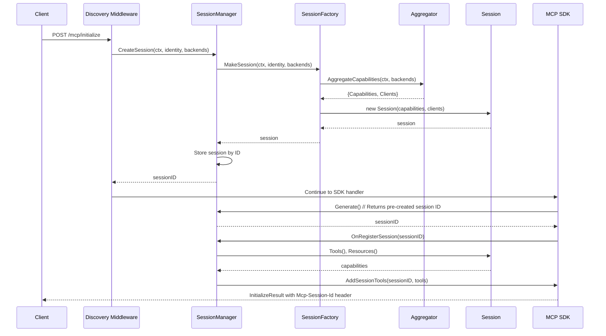

# THV-0038: Session-Scoped MCP Client Lifecycle Management

- **Status**: Draft
- **Author(s)**: @yrobla, @jerm-dro
- **Created**: 2026-02-04
- **Last Updated**: 2026-02-09
- **Target Repository**: toolhive
- **Related Issues**: [toolhive#3062](https://github.com/stacklok/toolhive/issues/3062)

## Summary

Refactor vMCP session architecture to encapsulate behavior in well-defined interfaces (`Session` and `SessionFactory`), decoupling session creation (domain logic) from SDK integration (protocol concerns). This restructuring naturally enables session-scoped MCP client lifecycle management, where clients are created once during initialization, reused throughout the session, and closed during cleanup. The new architecture simplifies testing, reduces connection overhead, enables stateful backend workflows, and makes future features (optimizer-in-vmcp, capability refresh) straightforward to implement through interface decoration.

## Problem Statement

### The Symptom: Per-Request Client Lifecycle

The current `httpBackendClient` implementation creates and closes MCP clients on every request. Each method (`CallTool`, `ReadResource`, `GetPrompt`, `ListCapabilities`) follows the same pattern:

1. Create a new client via `clientFactory()`
2. Defer client closure with `c.Close()`
3. Initialize the client with MCP handshake
4. Perform the requested operation
5. Close the client when the function returns

This creates multiple problems:

1. **Connection Overhead**: Every tool call incurs TCP handshake, TLS negotiation, and MCP protocol initialization overhead
2. **State Loss**: Backends maintaining stateful contexts (Playwright browser sessions, database transactions) lose state between requests
3. **Redundant Initialization**: Capability discovery establishes which backends exist, but clients are recreated for every request
4. **Resource Waste**: Repeated client creation/destruction wastes CPU and bandwidth

### The Root Cause: Scattered Session Architecture

The per-request client pattern is a symptom of a deeper architectural problem: **session concerns are scattered throughout the codebase without clear encapsulation**.

#### Current Architecture Problems

**1. Session Creation is Tangled with SDK Integration**

Session construction is spread across middleware, adapters, and hooks—tightly coupled to the MCP SDK's lifecycle callbacks:

- **Discovery middleware** triggers capability discovery before the session exists, then stuffs results into request context ([discovery/middleware.go](https://github.com/stacklok/toolhive/blob/main/pkg/vmcp/discovery/middleware.go#L109-L110))
- **Session ID adapter** creates an empty session when the SDK calls `Generate()`, with no access to discovered capabilities ([session_adapter.go](https://github.com/stacklok/toolhive/blob/main/pkg/vmcp/server/session_adapter.go#L50-L71))
- **OnRegisterSession hook** fishes capabilities back out of context and populates the session ([server.go](https://github.com/stacklok/toolhive/blob/main/pkg/vmcp/server/server.go#L777-L850))

This creates cognitive load: to understand "how does a session get created?", you must trace through middleware, adapter callbacks, SDK hooks, and context threading across multiple files.

**2. VMCPSession is a Passive Data Container, Not a Domain Object**

The existing `VMCPSession` is a struct with getters and setters, not an object with encapsulated behavior:

```go
type VMCPSession struct {
    routingTable *vmcp.RoutingTable
    tools        []vmcp.Tool
    mu           sync.RWMutex
}

func (s *VMCPSession) SetRoutingTable(rt *vmcp.RoutingTable) { ... }
func (s *VMCPSession) RoutingTable() *vmcp.RoutingTable      { ... }
```

Problems with this approach:

- **Data written in one place, read in another**: Routing table set in `OnRegisterSession`, but read by router via context, not from the session object
- **No single source of truth**: Session state scattered across context values, `VMCPSession` struct, and transport layer's `StreamableSession`
- **Objects don't do anything**: Router, handler factory, and backend client are separate stateless components operating on data pulled from context

**3. Routing Logic is Context-Based, Not Session-Based**

The current design routes requests via **context**, not session object lookup:

- Middleware stuffs capabilities into context before SDK sees request ([discovery/middleware.go:109-110](https://github.com/stacklok/toolhive/blob/main/pkg/vmcp/discovery/middleware.go#L109-L110))
- Router is stateless - extracts routing table from context on every request ([router/default_router.go:54](https://github.com/stacklok/toolhive/blob/main/pkg/vmcp/router/default_router.go#L54)):
  ```go
  capabilities, ok := discovery.DiscoveredCapabilitiesFromContext(ctx)
  target := capabilities.RoutingTable.Tools[toolName]
  ```
- Handler factory uses router to find backend target, then calls shared backend client ([adapter/handler_factory.go:103-125](https://github.com/stacklok/toolhive/blob/main/pkg/vmcp/server/adapter/handler_factory.go#L103-L125))

**Flow**: `request → middleware (stuff ctx) → handler → router (read ctx) → backend client`

There's no `sessions.Load(sessionID)` - routing data flows through context. The backend client is shared across all sessions and creates new MCP connections per request.

**4. Hard to Create Session-Scoped Resources**

Because session construction is tangled with SDK lifecycle hooks and routing logic flows through context instead of session objects, it's difficult to create objects with session lifetimes (like persistent MCP clients). This is the immediate problem we're solving, but it's symptomatic of the larger architectural issue.

### Consequences

These architectural problems have cascading effects:

1. **Client lifecycle complexity**: Per-request client creation is the path of least resistance when you can't easily create session-scoped resources
2. **Missing integration tests**: Can't create sessions without spinning up the whole vMCP server ([toolhive#2852](https://github.com/stacklok/toolhive/issues/2852))
3. **Difficult feature additions**: Adding optimizer-in-vmcp ([PR #3517](https://github.com/stacklok/toolhive/pull/3517), [PR #3312](https://github.com/stacklok/toolhive/pull/3312)) required extensive changes to `server.go` hooks
4. **Capability refresh complexity**: Refreshing session capabilities requires coordinating updates across middleware, router, and SDK registration ([PR #3642 discussion](https://github.com/stacklok/toolhive/pull/3642#issuecomment-3861182622))

### Affected Parties

- **vMCP Server Performance**: Every tool call creates/closes connections, multiplying latency by the number of requests
- **Backend Servers**: Repeated connection churn increases load on backend MCP servers
- **Stateful Backends**: Backends relying on persistent state (Playwright, databases) lose context between calls
- **Developers**: Scattered session concerns make the codebase hard to understand, test, and extend
- **Feature Development**: Adding session-related features (optimizer, capability refresh) requires changes across multiple layers

## Goals

1. **Encapsulate Session Behavior**: Introduce a `Session` interface as a domain object that owns its resources, encapsulates routing logic, and manages its own lifecycle
2. **Decouple Session Creation from SDK Wiring**: Separate the concern of *building a session* (domain logic) from *integrating with the MCP SDK* (protocol concerns) using a `SessionFactory` interface
3. **Session-Scoped Client Lifecycle**: Move MCP backend client lifecycle from per-request to session-scoped, enabling stateful workflows
4. **Simplify Testing**: Enable unit and integration tests of session logic without requiring a full vMCP server
5. **Enable Future Features**: Make it straightforward to add features like optimizer-in-vmcp, capability refresh, and connection warming through clean interfaces

## Non-Goals

- **Rewrite All Session Types**: Initial focus is on `VMCPSession`; other session types (ProxySession, SSESession) remain unchanged except for interface compliance
- **Connection Pooling Within Clients**: Individual MCP clients may internally pool connections, but that's outside this RFC's scope
- **Multi-Session Client Sharing**: Clients remain session-scoped and are not shared across sessions
- **Lazy Backend Discovery**: Backend discovery remains eager (current behavior)
- **Client Versioning**: Handling MCP protocol version negotiation is out of scope

## Proposed Solution

### High-Level Design

This RFC proposes restructuring session architecture around two key interfaces:

1. **SessionFactory**: Creates fully-formed sessions with all dependencies (capability discovery, client initialization, resource allocation)
2. **Session**: A domain object that owns its resources, encapsulates routing logic, and manages its own lifecycle



**Key Flow:**
1. Discovery middleware intercepts initialize request, calls `SessionManager.CreateSession()`
2. SessionManager uses SessionFactory to create fully-formed session (capabilities + clients)
3. Session stored before SDK sees request
4. SDK calls `Generate()` which returns pre-created session ID
5. SDK registers session's tools/resources via `OnRegisterSession` hook

### Terminology Clarification

This RFC uses the following terms consistently:

- **Session creation**: Building a fully-formed session with all resources (domain concern) - handled by `SessionFactory`
- **SDK wiring**: Integrating sessions with the MCP SDK lifecycle callbacks and tool/resource registration (protocol concern) - handled by `SessionManager`
- **Domain object**: An object that encapsulates business logic and owns its resources, not just a data container
- **Backend client**: An MCP client connected to a specific backend workload (instance of `mcp-go/client.Client`)
- **Session-scoped**: Resources that live for the duration of a session (created on init, closed on expiration)

### Key Architectural Changes

**1. Session as a Domain Object**

Today's `VMCPSession` is a passive data container:
```go
// Current: passive data container
type VMCPSession struct {
    routingTable *vmcp.RoutingTable
    tools        []vmcp.Tool
}
func (s *VMCPSession) SetRoutingTable(rt *vmcp.RoutingTable) { ... }
func (s *VMCPSession) RoutingTable() *vmcp.RoutingTable      { ... }
```

Proposed `Session` interface is an active domain object:
```go
// Proposed: active domain object
type Session interface {
    ID() string
    Tools() []Tool
    Resources() []Resource

    // Routing logic encapsulated here
    CallTool(ctx context.Context, name string, arguments map[string]any) (*ToolResult, error)
    ReadResource(ctx context.Context, uri string) (*ResourceResult, error)
    GetPrompt(ctx context.Context, name string, arguments map[string]any) (*PromptResult, error)

    Close() error
}
```

**2. Decoupling Session Creation from SDK Wiring**

Today: Session construction is spread across middleware (discovery), adapter callbacks (`Generate()`), and SDK hooks (`OnRegisterSession`).

Proposed: Clean separation:
- **SessionFactory**: Builds complete sessions (discovery + client initialization + routing setup)
- **SessionManager**: Bridges between `SessionFactory` (domain) and MCP SDK (protocol)

**3. Pre-initialized Backend Clients**

Clients are created once during `SessionFactory.MakeSession()` and owned by the session. The same client used for capability discovery becomes the session-scoped client (no redundant connections).

### Detailed Design

#### 1. Core Interfaces

**Session Interface** - A domain object representing an active MCP session:

```go
// Session represents an active MCP session with all its capabilities and resources.
// This is a pure domain object - no protocol concerns. Can be tested without spinning up a server.
type Session interface {
    // Identity and metadata
    ID() string
    Identity() *auth.Identity

    // Capabilities - returns discovered tools/resources for this session
    Tools() []Tool
    Resources() []Resource
    Prompts() []Prompt

    // MCP operations - routing logic is encapsulated here
    CallTool(ctx context.Context, name string, arguments map[string]any) (*ToolResult, error)
    ReadResource(ctx context.Context, uri string) (*ResourceResult, error)
    GetPrompt(ctx context.Context, name string, arguments map[string]any) (*PromptResult, error)

    // Lifecycle
    Close() error
}
```

**Key behaviors:**
- **Owns backend clients**: Session stores pre-initialized MCP clients in an internal map
- **Encapsulates routing**: `CallTool()` looks up tool in routing table, routes to correct backend client
- **Manages lifecycle**: `Close()` iterates through all clients and closes them
- **Thread-safe**: All methods protected by mutex for concurrent access

**SessionFactory Interface** - Creates fully-formed sessions:

```go
// SessionFactory creates fully-formed sessions from configuration and runtime inputs.
type SessionFactory interface {
    // MakeSession constructs a session with all its dependencies.
    // This is where capability discovery, client creation, and resource allocation happen.
    MakeSession(
        ctx context.Context,
        identity *auth.Identity,
        backends []Backend,
    ) (Session, error)
}
```

**Responsibilities:**
- Calls aggregator to discover capabilities from all backends
- Receives both capabilities AND initialized clients from aggregator (reuse for efficiency)
- Constructs session with routing table, tools, resources, clients
- Returns fully-formed session ready for use

#### 2. SessionFactory Implementation

**Implementation approach** (`pkg/vmcp/session/factory.go`):

The default factory implementation follows this pattern:

1. **Single-pass discovery**: Call `aggregator.AggregateCapabilities(ctx, backends)`
   - Aggregator creates MCP clients for each backend
   - Queries capabilities (tools, resources, prompts) from each backend
   - Resolves conflicts using configured strategy (prefix, priority, manual)
   - Returns both aggregated capabilities AND initialized clients

2. **Client reuse**: Use clients from aggregator (don't create new ones)
   - Avoids redundant TCP handshake + TLS negotiation + MCP initialization
   - Clients used for discovery are already working and initialized

3. **Return fully-formed session**: Construct session with all dependencies
   - Session ID (UUID)
   - User identity
   - Routing table (maps tool names to backend workload IDs)
   - Tools, resources, prompts (aggregated from all backends)
   - Pre-initialized clients map (keyed by workload ID)

**Key Design Decision**: The aggregator returns both capabilities and clients together. This enables the factory to pass initialized clients directly to the session without additional connection overhead.

**Updated Aggregator Return Type**:
```go
type AggregationResult struct {
    RoutingTable *RoutingTable
    Tools        []Tool
    Resources    []Resource
    Prompts      []Prompt
    Clients      map[string]*Client  // ← Initialized clients from discovery
}
```

**Performance impact**: Reusing discovery clients eliminates ~100-500ms of connection overhead per backend (depending on network latency and TLS handshake time).

#### 3. Session Implementation

**Internal structure** (`pkg/vmcp/session/default_session.go`):

```go
type defaultSession struct {
    id           string
    identity     *auth.Identity
    routingTable *RoutingTable
    tools        []Tool
    resources    []Resource
    prompts      []Prompt
    clients      map[string]*Client // backendID -> client
    mu           sync.RWMutex
}
```

**Method behaviors:**

- **`CallTool(ctx, name, args)`**:
  1. Look up tool in routing table to find target backend workload ID
  2. Retrieve pre-initialized client from `clients` map
  3. Call `client.CallTool(ctx, originalToolName, args)` on backend
  4. Return result or error

  **Key**: Tool names may be prefixed (e.g., `github__create_pr`), but backend receives original name (`create_pr`)

- **`ReadResource(ctx, uri)`**: Similar pattern - route via routing table, use pre-initialized client

- **`Close()`**:
  1. Lock session (exclusive access)
  2. Iterate through all clients in `clients` map
  3. Call `Close()` on each client
  4. Collect errors and return combined error if any failures
  5. Set `clients` to nil

**Thread safety**: All methods use mutex (`sync.RWMutex`) for concurrent access. Read operations (CallTool, ReadResource) use read lock, Close uses write lock.

#### 4. Wiring into the MCP SDK

##### SDK Interface Constraint

⚠️ **Critical Design Constraint**: The MCP SDK's `SessionIdManager` interface has a limitation:

```go
// From mark3labs/mcp-go SDK
type SessionIdManager interface {
    Generate() string  // ← No context parameter!
    Validate(sessionID string) (isTerminated bool, err error)
    Terminate(sessionID string) (isNotAllowed bool, err error)
}
```

**Problem**: `Generate()` has no context, so it cannot access:
- Request context (for identity, backends, etc.)
- Discovered capabilities from middleware
- Authentication information

**Current workaround**: The existing `sessionIDAdapter.Generate()` creates an **empty session** (just a UUID), then `OnRegisterSession` hook populates it later. This is the "tangled flow" we're trying to fix.

**Proposed Solution**: Discovery middleware creates the session, SDK retrieves the ID:

**Flow**:
1. **Discovery middleware** (has context) calls `SessionManager.CreateSession(ctx, identity, backends)`
2. SessionManager uses SessionFactory to create fully-formed session and stores it
3. SessionManager stores session ID in request context: `ctx = WithSessionID(ctx, sessionID)`
4. Request proceeds to SDK
5. **SDK calls `Generate()`** (no context) on SessionManager
6. SessionManager retrieves session ID from thread-local storage or goroutine-local context (set by middleware)
7. Returns the session ID - session is already fully initialized and stored

**Implementation Options**:

The SDK constraint requires one of these approaches:

**Option A: Hybrid approach (minimal changes to current flow)**
- Discovery middleware discovers capabilities and stores in context (current behavior)
- `Generate()` creates session ID, stores empty session
- `OnRegisterSession` hook retrieves capabilities from context and calls `SessionFactory.MakeSession()`
- Replace empty session with fully-formed session in SessionManager
- **Pros**: Works with SDK as-is, minimal risk
- **Cons**: Still uses context-passing and hook pattern (not fully encapsulated)

**Option B: Custom HTTP middleware wrapper**
- Add HTTP middleware before SDK handler that has access to request context
- Middleware calls `SessionManager.CreateSession(ctx, identity, backends)` to create fully-formed session
- Stores session ID in request-scoped storage (e.g., goroutine-local or HTTP request metadata)
- SDK calls `Generate()` which retrieves pre-created session ID from request-scoped storage
- **Pros**: Session fully created before SDK sees request, better encapsulation
- **Cons**: Requires careful goroutine/request scoping, potential race conditions

**Option C: Fork/patch SDK** (not recommended)
- Modify mark3labs/mcp-go SDK to pass context to `Generate(ctx context.Context)`
- **Pros**: Clean interface, no workarounds
- **Cons**: Upstream dependency, maintenance burden, delays implementation

**Recommended**: **Option A** for Phase 1-2 implementation (pragmatic), consider **Option B** for Phase 3-4 (better encapsulation).

##### SessionManager Design

**SessionManager** (`pkg/vmcp/server/session_manager.go`) bridges domain logic to SDK protocol:

```go
type SessionManager struct {
    factory  SessionFactory
    sessions sync.Map // map[string]Session
}
```

**Key responsibilities:**

1. **Session creation**: `CreateSession(ctx, identity, backends)` - Used by discovery middleware
   - Calls `factory.MakeSession()` to build fully-formed session
   - Stores session in map
   - Returns session ID (or error if creation fails)

2. **SDK lifecycle** (implements `SessionIdManager`):
   - `Generate() string` - Returns session ID (pre-created or newly created depending on option)
   - `Validate(sessionID) (bool, error)` - Checks if session exists
   - `Terminate(sessionID) (bool, error)` - Loads session, calls `Close()`, removes from map

3. **SDK adaptation**:
   - `GetAdaptedTools(sessionID)` - Converts session's tools to SDK format
   - Creates tool handlers that delegate to `session.CallTool()`
   - Wraps results in SDK types (`mcp.ToolResult`)

**Handler pattern**: Tool handlers are closures that:
- Load session from map by ID
- Validate request arguments (type assertions)
- Call `session.CallTool()` with validated args
- Convert domain result to SDK format
- Return MCP-formatted response

**SDK Registration Flow**:
1. Create SessionManager with SessionFactory
2. Pass to SDK as `WithSessionIdManager(sessionManager)`
3. In `OnRegisterSession` hook: register tools via `sessionManager.GetAdaptedTools(sessionID)`

#### 5. Migration from Current Architecture

**Phase 1**: Introduce interfaces and new implementation alongside existing code
**Phase 2**: Update server initialization to use new SessionManager
**Phase 3**: Remove old discovery middleware and httpBackendClient patterns
**Phase 4**: Clean up deprecated code paths

Details in Implementation Plan section below.

#### 6. Error Handling

**Session Creation Failures**:

If `SessionFactory.MakeSession()` fails completely (e.g., all backends unreachable):
- `SessionManager.Generate()` logs error and returns empty string `""`
- SDK interprets empty session ID as failure (will not send `Mcp-Session-Id` header in response)
- Client receives MCP initialization response without session ID, knows initialization failed
- Client must retry initialization or report error to user

**Rationale**: The SDK's `SessionIdManager.Generate()` interface returns `string`, not `(string, error)`. Returning an empty string is the signal for failure. This matches the existing `sessionIDAdapter` behavior (see `pkg/vmcp/server/session_adapter.go:64`).

**Partial Backend Initialization**:

If some backends fail during `MakeSession()`:
- Log warnings for failed backends
- Continue with successfully initialized backends
- Session creation succeeds with partial backend set
- Failed backends are not added to the clients map
- Subsequent tool calls to failed backends return "no client found for backend X"
- Health monitoring marks failed backends as unhealthy (existing behavior)

**Tool Call Failures**:

If a tool call fails after successful session creation:
- Return error to client (existing behavior)
- Client remains usable for subsequent requests
- No automatic client re-initialization (clients live for session lifetime)
- Health monitoring tracks backend health (existing behavior)

**Client Closed Mid-Request**:

Race condition exists: session may be terminated while a request is in flight:
- Session `Close()` closes all backend clients
- In-flight requests receive "client closed" error from MCP library
- Mitigation: Session `Touch()` extends TTL on every request, reducing race window
- Future enhancement: Add reference counting to delay `Close()` until in-flight requests complete

**Session Not Found**:

If client uses expired/invalid session ID:
- Return clear error: "session not found" or "session expired"
- Client should re-initialize via `/mcp/initialize` endpoint to create new session

## Security Considerations

### Threat Model

No new security boundaries are introduced. This is a refactoring of existing session and client lifecycle management to encapsulate behavior in well-defined interfaces.

### Authentication & Authorization

**Incoming Authentication (Client → vMCP)**: No changes
- Validate incoming token (existing)
- Store identity in session (existing)

**Outgoing Authentication (vMCP → Backend)**: Timing changes, not mechanism
- Credentials resolved during session creation instead of per-request
- Uses existing `OutgoingAuthRegistry` (same code path)
- Identity context passed to `SessionFactory.MakeSession()`

**Credential Lifecycle Considerations**:

⚠️ **Short-lived credentials**: With session-scoped clients, short-lived outgoing credentials (e.g., expiring OAuth tokens) resolved at client creation could become stale mid-session.

**Mitigation strategies** (implementation details for future work):
1. **Per-request header injection**: Resolve credentials fresh for each request, inject into MCP client headers
2. **Token refresh hooks**: Backend client library refreshes tokens automatically (if supported by `mcp-go`)
3. **Client recreation on auth failure**: Detect 401/403 errors, recreate client with refreshed credentials
4. **Session TTL alignment**: Set session TTL shorter than credential lifetime

For initial implementation, we assume:
- Most backends use long-lived credentials (API keys, client certificates)
- Session TTLs (typically 30 minutes) are shorter than credential lifetimes
- Per-request credential resolution is future enhancement if needed

### Data Protection

**Session Isolation**: Each session has its own client map. No cross-session data leakage risk.

**Connection Security**: TLS configuration and certificate validation remain unchanged.

### Concurrency & Resource Safety

**Client Usage During Cleanup**:
- Race condition exists: request may use client while session is being closed
- Mitigation: Session `Touch()` extends TTL on every request, reducing race window
- MCP client library handles `Close()` on active connections gracefully (returns errors)
- Handlers should catch and handle "client closed" errors appropriately
- Future Enhancement: Add reference counting to delay `Close()` until all in-flight requests complete

### Secrets Management

**Storage and Retrieval**: Outgoing auth secrets are retrieved via `OutgoingAuthRegistry` during client creation. The timing changes (session init vs first request) but the mechanism and storage are identical. No secrets are stored in session objects—only references to auth configurations.

### Audit Logging

**New Log Event**: Add audit log entry for client initialization during session setup:
```json
{
  "event": "backend_client_initialized",
  "session_id": "sess-123",
  "workload_id": "github-mcp",
  "timestamp": "2026-02-04T10:30:00Z"
}
```

**Existing Events Unchanged**: Tool call logs, authentication logs, and session lifecycle logs remain the same.

## Alternatives Considered

### Alternative 1: Keep Per-Request Pattern with Connection Pooling

**Approach**: Continue creating/closing clients per request but add a connection pool underneath to reuse TCP connections.

**Pros**:
- Minimal changes to existing code
- Reduces TCP handshake overhead

**Cons**:
- Doesn't address MCP protocol initialization overhead (still happens per request)
- Doesn't solve state preservation problem (each request still gets fresh MCP client)
- Authentication still resolved and validated per request
- Adds complexity at wrong layer

**Decision**: Rejected. This addresses symptoms but not the root cause.

### Alternative 2: Lazy Client Creation on First Use

**Approach**: Create clients on first tool call to a backend, then store in session for reuse.

**Pros**:
- Avoids creating clients for unused backends
- Delays initialization until needed

**Cons**:
- First tool call to each backend still has initialization latency
- More complex state management (need to track which clients exist)
- Doesn't leverage existing capability discovery phase
- Inconsistent performance (first vs subsequent calls)

**Decision**: Rejected. Complexity outweighs benefits. Capability discovery already knows which backends exist.

### Alternative 3: Global Client Cache Across Sessions

**Approach**: Share clients across all sessions using a global cache, keyed by backend + auth identity.

**Pros**:
- Maximum connection reuse
- Lowest initialization overhead

**Cons**:
- **State Pollution**: Backend state (Playwright contexts, DB transactions) would leak across sessions
- **Security Risk**: Potential for cross-session data exposure if keying is incorrect
- **Complexity**: Requires complex cache eviction, client sanitization, and identity tracking
- **Violates Session Isolation**: Sessions should be independent

**Decision**: Rejected. Session isolation is a core requirement for vMCP. The security and complexity risks outweigh performance gains.

## Compatibility

### Backward Compatibility

**External APIs**: No breaking changes.
- The `/vmcp/v1/*` HTTP API remains unchanged
- Clients see identical behavior (tools, resources, prompts work the same way)
- Session lifecycle (initialize, tool calls, expiration) unchanged from client perspective

**Internal APIs**:

⚠️ **Breaking Changes**:

1. **New `Session` interface replaces passive data container pattern**:
   - Old: `VMCPSession` with getters/setters (`SetRoutingTable()`, `RoutingTable()`)
   - New: `Session` interface with behavior methods (`CallTool()`, `Close()`)
   - **Impact**: Code that directly accesses `VMCPSession` fields or calls setters must migrate
   - **Migration**: Update callsites to use `Session` interface methods instead

2. **Session creation flow changes**:
   - Old: Discovery middleware → context → `OnRegisterSession` hook → session population
   - New: `SessionFactory.MakeSession()` → fully-formed session
   - **Impact**: Code that relies on `OnRegisterSession` hook timing or context-based capability passing must migrate
   - **Migration**: Move logic into `SessionFactory` or `Session` implementation

3. **Backend client retrieval changes**:
   - Old: `httpBackendClient` creates clients per-request via `clientFactory()`
   - New: Session owns clients, retrieved via `session.CallTool()` (encapsulated)
   - **Impact**: Direct users of `httpBackendClient` must migrate (though most code should use `Session` interface)
   - **Migration**: Replace direct backend client calls with session method calls

**Migration Path**:
- Phase 1: Introduce new interfaces alongside existing code
- Phase 2: Update server initialization to use new `SessionManager` and `SessionFactory`
- Phase 3: Migrate callsites from old patterns to new `Session` interface
- Phase 4: Remove deprecated code (old `httpBackendClient` pattern, discovery middleware)

**No external packages affected**: All changes are internal to ToolHive.

### Forward Compatibility

The interface-based design enables future enhancements:

**Session Features**:
- **Capability refresh**: `Session.RefreshCapabilities()` method for updating tools/resources mid-session
- **Connection warming**: Pre-connect to backends during idle time
- **Health-based initialization**: Skip unhealthy backends in `SessionFactory.MakeSession()`
- **Credential refresh**: Add token refresh hooks in session implementation

**Decorators and Composition**:

The `Session` interface enables clean feature composition through decoration. This addresses complexity issues seen in previous feature additions:

**Example: Optimizer-in-vMCP** (simplified approach vs [PR #3517](https://github.com/stacklok/toolhive/pull/3517)):
```go
// sessionWithOptimizer implements Session interface
// It only exposes find_tool and call_tool, with semantic search over underlying tools
type sessionWithOptimizer struct {
    inner Session
    vectorDB *VectorDB  // In-memory semantic search index
}

func (s *sessionWithOptimizer) CallTool(ctx context.Context, name string, args map[string]any) (*ToolResult, error) {
    // If tool is "find_tool", perform semantic search over s.inner.Tools()
    if name == "find_tool" {
        return s.semanticSearch(args["query"].(string))
    }

    // Otherwise delegate to underlying session
    return s.inner.CallTool(ctx, name, args)
}

// Assert that sessionWithOptimizer implements Session interface
var _ Session = (*sessionWithOptimizer)(nil)
```

**Benefits**:
1. **No SDK integration concerns**: Optimizer doesn't touch MCP protocol, just implements `Session` interface
2. **Testable**: Write unit tests for optimizer without spinning up vMCP server
3. **Minimal cognitive load**: Familiar decorator pattern, clear separation of concerns

**Example: Session Capability Refresh** (simplified vs [PR #3642](https://github.com/stacklok/toolhive/pull/3642)):
```go
func (s *defaultSession) RefreshCapabilities(ctx context.Context) error {
    // Re-discover capabilities from backends
    capabilities, err := s.aggregator.AggregateCapabilities(ctx, s.backends)
    if err != nil {
        return err
    }

    // Update session state (encapsulated, no middleware coordination needed)
    s.mu.Lock()
    defer s.mu.Unlock()
    s.routingTable = capabilities.RoutingTable
    s.tools = capabilities.Tools

    // Note: SDK tool registration would need separate refresh mechanism
    // but session state update is simple and encapsulated
    return nil
}
```

**Other Decoration Examples**:
- **Caching layer**: Wrap session to cache tool results for repeated calls
- **Rate limiting**: Wrap session to enforce per-session rate limits
- **Audit logging**: Wrap session to log all tool calls with detailed context
- **Circuit breaker**: Wrap session to implement circuit breaker pattern per backend

**Testing**:
- Unit test session logic without spinning up full vMCP server
- Mock `Session` interface for testing code that depends on sessions
- Integration test `SessionFactory` with fake backends

## Implementation Plan

This implementation introduces new interfaces and gradually migrates from the current architecture to the proposed design. All phases are additive until Phase 4, ensuring low risk and easy rollback.

### Phase 1: Introduce Core Interfaces and Factory

**Goal**: Establish the `Session` and `SessionFactory` interfaces and provide a working implementation without changing existing flows.

**New Files**:
- `pkg/vmcp/session/session.go` - Define `Session` interface
- `pkg/vmcp/session/factory.go` - Define `SessionFactory` interface and `defaultSessionFactory` implementation
- `pkg/vmcp/session/default_session.go` - Implement `defaultSession` with client ownership and routing logic

**Implementation Details**:
```go
// Session interface with behavior methods (not just getters/setters)
type Session interface {
    ID() string
    Tools() []Tool
    CallTool(ctx context.Context, name string, arguments map[string]any) (*ToolResult, error)
    // ... other methods
    Close() error
}

// SessionFactory creates fully-formed sessions
type SessionFactory interface {
    MakeSession(ctx context.Context, identity *auth.Identity, backends []Backend) (Session, error)
}

// defaultSession owns clients and encapsulates routing
type defaultSession struct {
    id           string
    routingTable *RoutingTable
    clients      map[string]*Client
    // ...
}
```

**Key Design**: The `defaultSession` owns backend clients. When `SessionFactory.MakeSession()` runs:
1. Aggregate capabilities from all backends
2. Create and initialize one MCP client per backend
3. Return session with pre-initialized clients map

**Testing**:
- Unit tests for `Session` interface methods (CallTool, ReadResource, Close)
- Unit tests for `SessionFactory.MakeSession()` with mocked aggregator and client factory
- Test partial backend initialization (some backends fail, session still created)
- Test session closure closes all clients

**Files Modified**: None (purely additive)

### Phase 2: Introduce SessionManager and Wire to SDK

**Goal**: Create `SessionManager` that uses `SessionFactory` and implements the SDK's `SessionIdManager` interface.

**New Files**:
- `pkg/vmcp/server/session_manager.go` - Implement `SessionManager` bridging domain (Session) to protocol (SDK)

**Core structure**:
```go
type SessionManager struct {
    factory  SessionFactory
    sessions sync.Map // map[string]Session
}
```

**Key methods** (see "Wiring into the MCP SDK" section in Detailed Design for full behavior):
- `Generate() string` - Creates session via factory or returns pre-created ID
- `Terminate(sessionID) (bool, error)` - Closes session, removes from map
- `GetAdaptedTools(sessionID) []mcp.Tool` - Converts session tools to SDK format
- `CreateSession(ctx, identity, backends) (string, error)` - Used by discovery middleware

**Integration steps**:
1. Create `SessionManager` with `SessionFactory` dependency
2. Pass to SDK as `WithSessionIdManager(sessionManager)`
3. In `OnRegisterSession` hook: register tools via `GetAdaptedTools()`
4. For SDK constraint workarounds, see "SDK Interface Constraint" in Detailed Design

**Testing**:
- Integration tests: Create session via `SessionManager.Generate()`, verify session stored
- Test tool handler routing: Call tool, verify session's `CallTool()` is invoked
- Test session termination: Call `Terminate()`, verify session closed
- Test SDK integration: Initialize session via HTTP `/mcp/initialize`, verify tools registered

**Files Modified**:
- `pkg/vmcp/server/server.go` - Add SessionManager creation and wiring

### Phase 3: Migrate Existing Code to Use Session Interface

**Goal**: Update callsites to use the new `Session` interface instead of accessing `VMCPSession` directly or using `httpBackendClient`.

**Changes**:
- Remove discovery middleware's context-passing pattern (capabilities no longer passed via context)
- Remove `httpBackendClient` per-request client creation pattern (session owns clients now)
- Update any code that called `VMCPSession.SetRoutingTable()` / `SetTools()` to use `Session` interface methods

**Testing**:
- End-to-end tests: Full vMCP workflow with multiple backends
- Verify backend state preservation across tool calls (e.g., Playwright browser session maintains context)
- High-throughput tests: Verify no connection leaks, clients reused across tool calls
- Session expiration test: Verify TTL cleanup closes all clients

**Files Modified**:
- `pkg/vmcp/discovery/middleware.go` - Remove context-based capability passing (deprecated by SessionFactory)
- `pkg/vmcp/client/client.go` - Remove `httpBackendClient` per-request creation (deprecated by Session ownership)
- Any code directly accessing `VMCPSession` fields - Migrate to `Session` interface

### Phase 4: Cleanup and Observability

**Goal**: Remove deprecated code and add observability for session lifecycle.

**Cleanup**:
- Remove old `VMCPSession` data container implementation (replaced by `defaultSession`)
- Remove old discovery middleware hooks (replaced by `SessionFactory`)
- Remove old `httpBackendClient` patterns (replaced by session-owned clients)

**Observability**:
- Add audit log events for session creation with backend initialization results
  ```json
  {
    "event": "session_created",
    "session_id": "sess-123",
    "backends_initialized": 3,
    "backends_failed": 1
  }
  ```
- Add metrics:
  - `vmcp_session_backend_init_duration_seconds` (histogram by backend)
  - `vmcp_session_backend_init_success_total` (counter by backend)
  - `vmcp_session_backend_init_failure_total` (counter by backend, with reason label)
  - `vmcp_session_tool_call_duration_seconds` (histogram, shows latency improvement)
- Add distributed traces spanning session creation → first tool call

**Testing**:
- Verify audit logs contain session ID and backend initialization status
- Verify metrics show client init success/failure rates per backend
- Verify traces show reduced latency for subsequent tool calls (no handshake overhead)

**Files Modified**:
- `pkg/vmcp/session/default_session.go` - Add telemetry hooks
- `pkg/vmcp/session/factory.go` - Add audit logging

### Dependencies

- Existing capability aggregation (`pkg/vmcp/aggregator`)
- Existing client factory (`pkg/vmcp/client`)
- Existing health monitoring system
- MCP SDK (`mark3labs/mcp-go`)

### Rollback Plan

Each phase is independently testable and can be rolled back:

- **Phase 1**: New interfaces unused, no behavior change
- **Phase 2**: SessionManager wired but old code paths still present
- **Phase 3**: Can revert to Phase 2 state (both implementations coexist)
- **Phase 4**: Can keep deprecated code if needed (cleanup optional)

### Testing Strategy

**Unit Tests** (each phase):
- Session interface methods (CallTool, ReadResource, Close)
- SessionFactory capability discovery and client initialization
- SessionManager SDK integration (Generate, Terminate)
- Error handling (partial initialization, client closed, session not found)

**Integration Tests** (Phase 2+):
- Session creation via HTTP `/mcp/initialize` endpoint
- Tool calls routed to correct backends via session
- Session expiration triggers client closure
- Multiple tool calls reuse same clients (no reconnection overhead)

**End-to-End Tests** (Phase 3+):
- Full vMCP workflow with multiple backends
- Backend state preservation across tool calls (Playwright browser context, database transaction)
- High-throughput scenarios (verify no connection leaks, reduced latency)
- Session lifecycle (create, use, expire, cleanup)

## Documentation

**Architecture Documentation** (in `toolhive` repository):
- Update `docs/arch/10-virtual-mcp-architecture.md`:
  - Add section on session architecture with `Session` interface and `SessionFactory`
  - Document the separation between domain logic (session creation) and protocol concerns (SDK wiring)
  - Add sequence diagram showing new session creation flow: HTTP `/initialize` → `SessionFactory.MakeSession()` → `SessionManager.Generate()` → SDK registration
  - Document client lifecycle: created during session init, reused for all requests, closed on session expiration
- Update `docs/arch/02-core-concepts.md`:
  - Add "Session" as a core concept with its responsibilities (owns clients, encapsulates routing, manages lifecycle)
  - Clarify that sessions are domain objects, not just data containers

**Code Documentation**:
- Add package-level comments to `pkg/vmcp/session/`:
  ```go
  // Package session provides the core Session domain object and SessionFactory
  // for vMCP. Sessions own backend MCP clients, encapsulate routing logic,
  // and manage their own lifecycle.
  //
  // Key interfaces:
  //   - Session: Domain object representing an active MCP session
  //   - SessionFactory: Creates fully-formed sessions with all dependencies
  //
  // The SessionManager bridges between Session (domain) and the MCP SDK (protocol).
  ```
- Document `Session` interface methods with usage examples
- Document `SessionFactory.MakeSession()` with capability discovery and client initialization details

**Developer Guides**:
- Add "Session Architecture" guide explaining:
  - How sessions are created (SessionFactory)
  - How sessions integrate with SDK (SessionManager)
  - How to test session logic without spinning up a server
  - How to decorate Session interface (e.g., optimizer-in-vmcp pattern)

**Operational Guides**:
- Update troubleshooting guide:
  - Debugging session creation failures
  - Investigating backend initialization errors
  - Understanding "no client found" errors
- Document observability:
  - Audit logs: `session_created` event with backend init status
  - Metrics: `vmcp_session_backend_init_duration_seconds`, `vmcp_session_tool_call_duration_seconds`
  - Traces: Session creation span → first tool call span (shows reduced latency)
- Add runbook for investigating client initialization failures

## Open Questions

Most major design questions have been resolved during RFC review. One implementation detail requires resolution:

1. ~~Should clients be created eagerly or lazily?~~ → **Resolved: Eager initialization during `SessionFactory.MakeSession()`**
2. ~~How should session concerns be organized?~~ → **Resolved: Encapsulate in `Session` interface (domain object), separate from SDK wiring (`SessionManager`)**
3. ~~What happens if backend client initialization fails during session creation?~~ → **Resolved: Log warning, continue with partial initialization, failed backends not in clients map**
4. ~~Should we share clients across sessions for efficiency?~~ → **Resolved: No, session isolation is critical (prevents state leakage, security risks)**
5. ~~How to handle short-lived credentials with session-scoped clients?~~ → **Resolved: Document limitation, provide mitigation strategies (per-request header injection, token refresh hooks), assume most backends use long-lived credentials for initial implementation**
6. ~~How should client closure be triggered?~~ → **Resolved: Session owns clients, `Session.Close()` called on expiration/termination via `SessionManager.Terminate()`**
7. **How to work around SDK `Generate()` having no context parameter?** → **Requires resolution during Phase 2 implementation**
   - SDK's `SessionIdManager.Generate()` has no context, cannot access identity/backends directly
   - Three options documented: (A) Hybrid with OnRegisterSession hook, (B) Custom HTTP middleware wrapper, (C) Fork SDK
   - **Recommendation**: Start with Option A (pragmatic), evaluate Option B for better encapsulation
   - See "SDK Interface Constraint" section in Detailed Design for full analysis

## References

- [MCP Specification](https://modelcontextprotocol.io/specification/2025-06-18) - Model Context Protocol specification
- [toolhive#3062](https://github.com/stacklok/toolhive/issues/3062) - Original issue: Per-request client creation overhead
- [toolhive#2852](https://github.com/stacklok/toolhive/issues/2852) - Missing integration tests below server level
- [mark3labs/mcp-go SDK](https://github.com/mark3labs/mcp-go) - MCP Go SDK used for backend clients
- [Virtual MCP Architecture Documentation](https://github.com/stacklok/toolhive/blob/main/docs/arch/10-virtual-mcp-architecture.md) - Current vMCP architecture
- Related PRs in ToolHive:
  - [toolhive#1989](https://github.com/stacklok/toolhive/pull/1989) - Session management infrastructure (provides storage and cleanup hooks)
  - [toolhive#3517](https://github.com/stacklok/toolhive/pull/3517) - Optimizer-in-vMCP implementation (motivates Session interface design)
  - [toolhive#3312](https://github.com/stacklok/toolhive/pull/3312) - Optimizer-in-vMCP changes to server.go
  - [toolhive#3642](https://github.com/stacklok/toolhive/pull/3642) - Discussion on session capability refresh (simplified by Session encapsulation)

---

## RFC Lifecycle

<!-- This section is maintained by RFC reviewers -->

### Review History

| Date | Reviewer | Decision | Notes |
|------|----------|----------|-------|
| 2026-02-04 | @yrobla, @jerm-dro | Draft | Initial submission |

### Implementation Tracking

| Repository | PR | Status |
|------------|-----|--------|
| toolhive | - | Pending |
