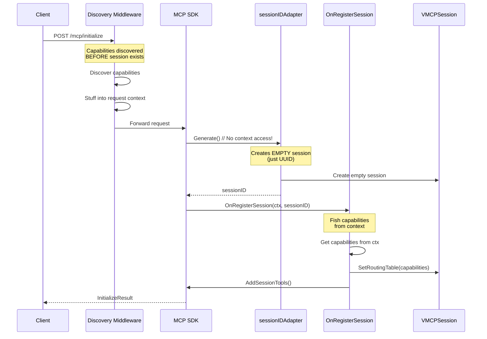
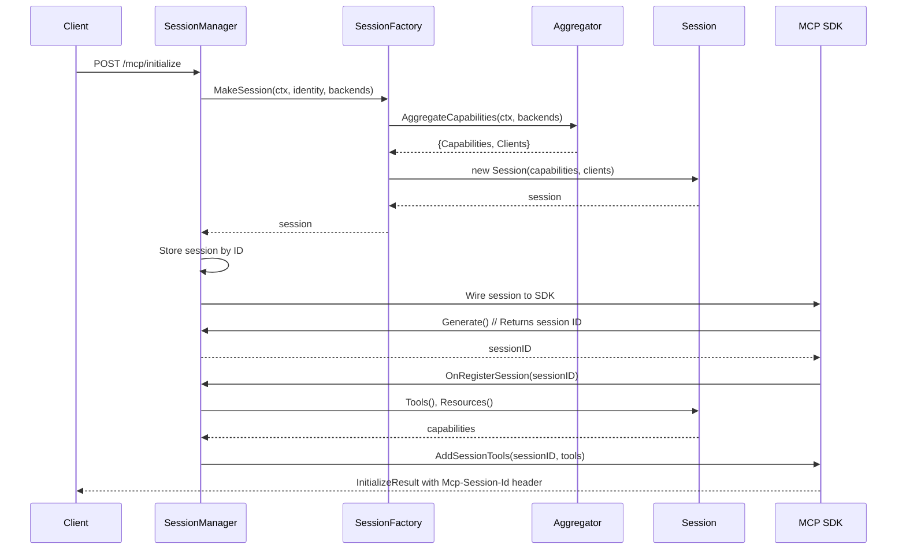

# THV-0038: Session-Scoped Architecture for vMCP

- **Status**: Draft
- **Author(s)**: @yrobla, @jerm-dro
- **Created**: 2026-02-04
- **Last Updated**: 2026-02-09
- **Target Repository**: toolhive
- **Related Issues**: [toolhive#3062](https://github.com/stacklok/toolhive/issues/3062)

## Summary

Refactor vMCP session architecture to encapsulate behavior in well-defined interfaces (`Session` and `SessionFactory`), decoupling session creation (domain logic) from SDK integration (protocol concerns).

Restructuring the session management enables:

- **Client reuse throughout the session**: Clients are created once during initialization, reused for all requests, and closed during cleanup, enabling stateful workflows (e.g., Playwright browser sessions, database transactions)
- **Integration testing without full server**: Test session capabilities and routing logic in isolation without spinning up the complete vMCP server
- **Simplified feature extensions**: Add capabilities like optimizer-in-vmcp and capability refresh through interface decoration, since protocol concerns are decoupled from how capabilities are calculated

## Problem Statement

### The Symptom: Per-Request Client Lifecycle

The current `httpBackendClient` implementation creates and closes MCP clients on every request. Each method (`CallTool`, `ReadResource`, `GetPrompt`, `ListCapabilities`) follows the same pattern:

1. Create a new client via `clientFactory()`
2. Defer client closure with `c.Close()`
3. Initialize the client with MCP handshake
4. Perform the requested operation
5. Close the client when the function returns

This creates multiple problems:

1. **Connection Overhead**: Every tool call incurs TCP handshake, TLS negotiation, and MCP protocol initialization overhead
2. **State Loss**: Backends maintaining stateful contexts (Playwright browser sessions, database transactions) lose state between requests
3. **Redundant Initialization**: Capability discovery establishes which backends exist, but clients are recreated for every request
4. **Resource Waste**: Repeated client creation/destruction wastes CPU and bandwidth

### The Root Cause: Scattered Session Architecture

The per-request client pattern is a symptom of a deeper architectural problem: **session concerns are scattered throughout the codebase without clear encapsulation**.

#### Current Architecture Problems

**1. Session Creation is Tangled with SDK Integration**

Session construction is spread across middleware, adapters, and hooks—tightly coupled to the MCP SDK's lifecycle callbacks:

- **Discovery middleware** triggers capability discovery before the session exists, then stuffs results into request context ([discovery/middleware.go](https://github.com/stacklok/toolhive/blob/main/pkg/vmcp/discovery/middleware.go))
- **Session ID adapter** creates an empty session when the SDK calls `Generate()`, with no access to discovered capabilities ([session_adapter.go](https://github.com/stacklok/toolhive/blob/main/pkg/vmcp/server/session_adapter.go))
- **OnRegisterSession hook** fishes capabilities back out of context and populates the session ([server.go](https://github.com/stacklok/toolhive/blob/main/pkg/vmcp/server/server.go))

This creates cognitive load: to understand "how does a session get created?", you must trace through middleware, adapter callbacks, SDK hooks, and context threading across multiple files.

**2. VMCPSession is a Passive Data Container, Not a Domain Object**

The existing `VMCPSession` is a passive data container with getters and setters (e.g., `SetRoutingTable()`, `SetTools()`), not an object with encapsulated behavior.

**Problems with this approach:**

- **Data written in one place, read in another**: Routing table set in `OnRegisterSession`, but read by router via context, not from the session object
- **No single source of truth**: Session state scattered across context values, `VMCPSession` struct, and transport layer's `StreamableSession`
- **Objects don't do anything**: Router, handler factory, and backend client are separate stateless components operating on data pulled from context

**3. Routing Logic is Context-Based, Not Session-Based**

The current design routes requests via **context**, not session object lookup:

- Middleware stuffs capabilities into context before SDK sees request ([discovery/middleware.go](https://github.com/stacklok/toolhive/blob/main/pkg/vmcp/discovery/middleware.go))
- Router is stateless - extracts routing table from context on every request ([router/default_router.go](https://github.com/stacklok/toolhive/blob/main/pkg/vmcp/router/default_router.go)) by reading capabilities from context
- Handler factory uses router to find backend target, then calls shared backend client ([adapter/handler_factory.go](https://github.com/stacklok/toolhive/blob/main/pkg/vmcp/server/adapter/handler_factory.go))

**Flow**: `request → middleware (stuff ctx) → handler → router (read ctx) → backend client`

There's no `sessions.Load(sessionID)` - routing data flows through context. The backend client is shared across all sessions and creates new MCP connections per request.

**4. Hard to Create Session-Scoped Resources**

Because session construction is tangled with SDK lifecycle hooks and routing logic flows through context instead of session objects, it's difficult to create objects with session lifetimes (like persistent MCP clients). This is the immediate problem we're solving, but it's symptomatic of the larger architectural issue.

### Consequences

These architectural problems have cascading effects:

1. **Client lifecycle complexity**: Per-request client creation is the path of least resistance when you can't easily create session-scoped resources
2. **Missing integration tests**: Can't create sessions without spinning up the whole vMCP server ([toolhive#2852](https://github.com/stacklok/toolhive/issues/2852))
3. **Difficult feature additions**: Adding optimizer-in-vmcp ([PR #3517](https://github.com/stacklok/toolhive/pull/3517), [PR #3312](https://github.com/stacklok/toolhive/pull/3312)) required extensive changes to `server.go` hooks
4. **Capability refresh complexity**: Refreshing session capabilities requires coordinating updates across middleware, router, and SDK registration ([PR #3642 discussion](https://github.com/stacklok/toolhive/pull/3642#issuecomment-3861182622))

### Affected Parties

- **vMCP Server Performance**: Every tool call creates/closes connections, multiplying latency by the number of requests
- **Backend Servers**: Repeated connection churn increases load on backend MCP servers
- **Stateful Backends**: Backends relying on persistent state (Playwright, databases) lose context between calls
- **Developers**: Scattered session concerns make the codebase hard to understand, test, and extend
- **Feature Development**: Adding session-related features (optimizer, capability refresh) requires changes across multiple layers

## Goals

1. **Encapsulate Session Behavior**: Introduce a `Session` interface as a domain object that owns its resources, encapsulates routing logic, and manages its own lifecycle
2. **Decouple Session Creation from SDK Wiring**: Separate the concern of *building a session* (domain logic) from *integrating with the MCP SDK* (protocol concerns) using a `SessionFactory` interface
3. **Session-Scoped Client Lifecycle**: Move MCP backend client lifecycle from per-request to session-scoped, enabling stateful workflows
4. **Simplify Testing**: Enable unit and integration tests of session logic without requiring a full vMCP server
5. **Enable Future Features**: Make it straightforward to add features like optimizer-in-vmcp, capability refresh, and connection warming through clean interfaces

## Non-Goals

- **Rewrite All Session Types**: Initial focus is on `VMCPSession`; other session types (ProxySession, SSESession) remain unchanged except for interface compliance
- **Replace Existing Session Storage Architecture**: This RFC **builds on** the existing `transportsession.Manager` and `Storage` interface ([PR #1989](https://github.com/stacklok/toolhive/pull/1989), [PR #1677](https://github.com/stacklok/toolhive/pull/1677), [PR #1770](https://github.com/stacklok/toolhive/pull/1770), [PR #1771](https://github.com/stacklok/toolhive/pull/1771)) rather than creating a parallel storage path. Session storage continues to use the pluggable `Storage` interface designed for Redis/Valkey support.
- **Connection Pooling Within Clients**: Individual MCP clients may internally pool connections, but that's outside this RFC's scope
- **Multi-Session Client Sharing**: Clients remain session-scoped and are not shared across sessions
- **Lazy Capability Discovery**: Capability discovery remains eager and static (i.e., done once at session creation, current behavior)
- **Client Versioning**: Handling MCP protocol version negotiation is out of scope
- **Transparent Horizontal Scaling**: Session-scoped MCP clients are held in Go process memory and cannot be serialized to Redis/Valkey. While session metadata can be stored in pluggable backends ([Issue #2417](https://github.com/stacklok/toolhive/issues/2417)), the MCP client objects themselves are in-process only. **Horizontal scaling of vMCP instances requires sticky sessions** (session affinity at load balancer). Transparent failover across instances is out of scope (clients must be recreated on instance switch, acceptable one-time cost).

## Proposed Solution

### Current State: Tangled Flow

**Today's session creation** is scattered across middleware, adapter, and hooks:



**Problems:** No single component owns session creation. To understand how a session is created, you must trace through:
1. Discovery middleware (triggers discovery, stores in context)
2. SessionIDAdapter (creates empty session)
3. OnRegisterSession hook (populates session from context)

This makes testing difficult (can't create sessions without full server) and adding features complex (optimizer-in-vmcp required extensive server.go changes).

---

### Proposed Design

This RFC proposes restructuring around two key interfaces:

1. **SessionFactory**: Creates fully-formed sessions with all dependencies (capability discovery, client initialization, resource allocation)
2. **Session**: A domain object that owns its resources, encapsulates routing logic, and manages its own lifecycle

**Proposed session creation flow:**



**Key Flow:**
1. Initialize request triggers `SessionManager` to create session via `SessionFactory`
2. SessionFactory creates clients, passes them to aggregator for capability discovery
3. SessionFactory returns fully-formed session (capabilities + pre-initialized clients)
4. Session stored in SessionManager before SDK registration
5. SDK calls `Generate()` which returns the session ID
6. SDK registers session's tools/resources via `OnRegisterSession` hook

### Terminology Clarification

This RFC uses the following terms consistently:

- **Session creation**: Building a fully-formed session with all resources (domain concern) - handled by `SessionFactory`
- **SDK wiring**: Integrating sessions with the MCP SDK lifecycle callbacks and tool/resource registration (protocol concern) - handled by `SessionManager`
- **Domain object**: An object that encapsulates business logic and owns its resources, not just a data container
- **Backend client**: An MCP client connected to a specific backend workload (instance of `mcp-go/client.Client`)
- **Session-scoped**: Resources that live for the duration of a session (created on init, closed on expiration)

### Key Architectural Changes

**1. Session as a Domain Object**

Today's `VMCPSession` is a passive data container with getters and setters (e.g., `SetRoutingTable()`, `RoutingTable()`), not an object with encapsulated behavior.

Proposed `Session` interface is an active domain object that owns backend clients and encapsulates routing logic:

```go
type Session interface {
    // Identity and metadata
    ID() string
    Identity() *auth.Identity

    // Capabilities - returns discovered tools/resources for this session
    Tools() []Tool
    Resources() []Resource
    Prompts() []Prompt

    // MCP operations - routing logic is encapsulated here
    CallTool(ctx context.Context, name string, arguments map[string]any) (*ToolResult, error)
    ReadResource(ctx context.Context, uri string) (*ResourceResult, error)
    GetPrompt(ctx context.Context, name string, arguments map[string]any) (*PromptResult, error)

    // Lifecycle
    Close() error
}
```

Instead of exposing internal state through setters, it provides behavior methods like `CallTool()` that look up the target in the routing table and invoke the appropriate backend client.

**2. Decoupling Session Creation from SDK Wiring**

Today: Session construction is spread across middleware (discovery), adapter callbacks (`Generate()`), and SDK hooks (`OnRegisterSession`).

Proposed: Clean separation:
- **SessionFactory**: Builds complete sessions (discovery + client initialization + routing setup)
- **SessionManager**: Bridges between `SessionFactory` (domain) and MCP SDK (protocol) by:
  - Implementing `SessionIdManager` interface (`Generate`, `Validate`, `Terminate`)
  - Converting domain types to SDK types (Session's `Tools()` → `[]mcp.Tool`)
  - Registering capabilities with SDK via `server.AddTool()`, `server.AddResource()`, `server.AddPrompt()`
  - Creating handlers that delegate to `session.CallTool()`, `session.ReadResource()`, `session.GetPrompt()`
  - See example in [`pkg/vmcp/server/server.go` (injectCapabilities)](https://github.com/stacklok/toolhive/blob/main/pkg/vmcp/server/server.go)

**3. Pre-initialized Backend Clients**

Clients are created once during `SessionFactory.MakeSession()` and owned by the session. The same client used for capability discovery becomes the session-scoped client (no redundant connections).

### Detailed Design

#### 1. Core Interfaces

**Session Interface** - A domain object representing an active MCP session:

```go
// Session represents an active MCP session with all its capabilities and resources.
// This is a pure domain object - no protocol concerns. Can be tested without spinning up a server.
type Session interface {
    // Identity and metadata
    ID() string
    Identity() *auth.Identity

    // Capabilities - returns discovered tools/resources for this session
    Tools() []Tool
    Resources() []Resource
    Prompts() []Prompt

    // MCP operations - routing logic is encapsulated here
    CallTool(ctx context.Context, name string, arguments map[string]any) (*ToolResult, error)
    ReadResource(ctx context.Context, uri string) (*ResourceResult, error)
    GetPrompt(ctx context.Context, name string, arguments map[string]any) (*PromptResult, error)

    // Lifecycle
    Close() error
}
```

**Key behaviors:**
- **Owns backend clients**: Session stores pre-initialized MCP clients in an internal map
- **Encapsulates routing**: `CallTool()` looks up tool in routing table, routes to correct backend client
- **Manageable lifetime**: `Close()` cleans up clients and any other resources. The SessionManager/caller is decoupled from what exactly happens on close()
- **Thread-safe**: All methods protected by internal RWMutex for concurrent access to prevent data races on internal state. Read operations (Tools, Resources, Prompts, CallTool, ReadResource, GetPrompt) use read locks; write operations (Close) use write locks. Methods like `Tools()`, `Resources()`, `Prompts()` return defensive copies (not references to internal slices) to prevent caller mutations. Internal maps and slices are never exposed directly. Note: The RWMutex prevents data races but does not prevent `CallTool()` from using a closed client after `Close()` completes—the session implementation must track closed state explicitly (see "Client Closed Mid-Request" in Error Handling). Proper encapsulation may allow removal of mutexes elsewhere (e.g., SessionManager, current VMCPSession) since state is now owned by the Session

**Separation of concerns**: The Session interface focuses on domain logic (capabilities, routing, client ownership). This RFC builds on the existing pluggable session storage architecture ([PR #1989](https://github.com/stacklok/toolhive/pull/1989)) which provides `Storage` interface and `Manager` for Redis/Valkey support. The architecture uses a **dual-layer model** (detailed in section "Session Architecture and Serializability"):
- **Metadata layer** (serializable): Session ID, timestamps, identity reference - stored via `transportsession.Manager` + `Storage` interface (supports `LocalStorage` today, `RedisStorage` in future)
- **Runtime layer** (in-memory only): MCP client objects, routing table, capabilities - cannot be serialized due to TCP connections and goroutines

**Important notes**:
- The existing `Storage.DeleteExpired()` only removes from storage without calling `Close()`, which would leak backend client connections. As part of this RFC, the session storage layer must be updated to call `session.Close()` before removing expired sessions from storage.
- **Horizontal scaling**: Session metadata can be in Redis/Valkey, but MCP clients are in-process only. Horizontal scaling requires sticky sessions (session affinity at load balancer) to ensure requests route to the instance holding the client objects. Without sticky sessions, clients must be recreated on instance switch (acceptable one-time cost per [Issue #2417](https://github.com/stacklok/toolhive/issues/2417)).

**SessionFactory Interface** - Creates fully-formed sessions:

```go
// SessionFactory creates fully-formed sessions from configuration and runtime inputs.
type SessionFactory interface {
    // MakeSession constructs a session with all its dependencies.
    // This is where capability discovery, client creation, and resource allocation happen.
    MakeSession(
        ctx context.Context,
        identity *auth.Identity,
        backends []Backend,
    ) (Session, error)
}
```

**Responsibilities:**
- Creates MCP clients for all backends (owns client lifecycle)
- Passes clients to aggregator to discover capabilities
- Constructs session with routing table, tools, resources, and the same pre-initialized clients
- Returns fully-formed session ready for use

#### 2. SessionFactory Implementation

**Implementation approach** (`pkg/vmcp/session/factory.go`):

The default factory implementation follows this pattern:

1. **Create MCP clients**: Initialize clients for each backend **in parallel**
   - Factory creates one client per backend using existing client factory
   - **Performance requirement**: Use parallel initialization (e.g., `errgroup` with bounded concurrency) to avoid sequential latency accumulation. With 20 backends at 100-500ms each, sequential would mean 2-10 seconds of session creation latency.
   - **Bounded concurrency**: Limit parallel goroutines (e.g., 10 concurrent initializations) to avoid resource exhaustion
   - **Per-backend timeout**: Apply context timeout (e.g., 5s per backend) so one slow backend doesn't block session creation
   - **Partial initialization**: If some backends fail, log warnings and continue with successfully initialized backends (failed backends not added to clients map)
   - Clients are connection-ready but not yet used

2. **Capability discovery**: Pass clients to `aggregator.AggregateCapabilities(ctx, clients)`
   - Aggregator uses provided clients to query capabilities (tools, resources, prompts) from each backend
   - Resolves conflicts using configured strategy (prefix, priority, manual)
   - Returns aggregated capabilities (routing table, tools, resources, prompts)
   - Aggregator does NOT own client lifecycle - just uses them for queries

3. **Return fully-formed session**: Construct session with all dependencies
   - Session ID (UUID)
   - User identity
   - Routing table (maps tool names to backend workload IDs)
   - Tools, resources, prompts (aggregated from backends)
   - Pre-initialized clients map (keyed by workload ID) - same clients used for discovery

**Key Design Decision**: Clients are created once by the factory and threaded through: factory → aggregator (for discovery) → session (for reuse). This avoids redundant connection setup while maintaining clean separation of concerns (factory owns client creation, aggregator only queries capabilities).

**Updated Aggregator Interface**:

The aggregator interface takes clients as input instead of creating them internally:

```go
AggregateCapabilities(ctx context.Context, clients map[string]*Client) (*AggregationResult, error)
```

**Rationale**: Separates client lifecycle (factory's concern) from capability discovery (aggregator's concern). The factory creates clients once, passes them to aggregator for discovery, then passes same clients to session for reuse.

**Performance impact**: Reusing discovery clients eliminates redundant connection setup (TCP handshake + TLS negotiation + MCP initialization), saving ~100-500ms per backend depending on network conditions.

#### 3. Session Implementation

**Internal structure** (`pkg/vmcp/session/default_session.go`):

The default session implementation stores:
- Session ID and user identity
- Routing table mapping tool/resource names to backend workload IDs
- Discovered capabilities (tools, resources, prompts)
- Pre-initialized backend clients map (keyed by workload ID)
- RWMutex for thread-safe access (read lock for queries/calls, write lock for Close)

**Method behaviors:**

- **`CallTool(ctx, name, args)`**: Looks up tool in routing table to find target backend, retrieves pre-initialized client from map, calls backend with original (un-prefixed) tool name. Tool names may be prefixed for conflict resolution (e.g., `github__create_pr`), but backend receives original name (`create_pr`).

- **`ReadResource(ctx, uri)`**: Similar routing pattern - consults routing table, uses pre-initialized client.

- **`Close()`**: Acquires write lock, iterates through all clients, calls `Close()` on each, collects errors, returns combined error.

**Thread safety**: Read operations (CallTool, ReadResource) use read locks; Close uses write lock.

#### 4. Session Architecture and Serializability

**Dual-Layer Session Model**: This RFC builds on the existing session storage architecture introduced in [PR #1989](https://github.com/stacklok/toolhive/pull/1989) and [Issue #2417](https://github.com/stacklok/toolhive/issues/2417), which established a pluggable `Storage` interface designed for Redis/Valkey externalization. The session architecture follows a **two-layer model**:

**Layer 1: Metadata (Serializable)** - Managed by `transportsession.Manager` + `Storage` interface:
- Session ID (string)
- Session type (string)
- Creation timestamp
- Last access timestamp (TTL tracking)
- User identity reference
- Backend workload IDs list
- **Stored via**: `pkg/transport/session/storage.Storage` interface (`Store`, `Load`, `Delete`, `DeleteExpired`, `Close`)
- **Backends**: `LocalStorage` (in-memory `sync.Map`) today, `RedisStorage` in future
- **Serialization**: JSON format already implemented in `pkg/transport/session/serialization.go`

**Layer 2: Runtime State (In-Memory Only)** - Managed by behavior-oriented `Session`:
- Pre-initialized MCP client objects (contain TCP connections, goroutines)
- Routing table (tool/resource name → backend workload ID mapping)
- Discovered capabilities (tools, resources, prompts)
- Closed state flag
- **Cannot be serialized**: MCP clients contain active TCP connections and goroutine state that cannot be persisted

**Composition Model**: How the two layers relate:

```go
// Existing storage-oriented session interface (pkg/transport/session/session.go)
type Session interface {
    ID() string
    Type() string
    Touch() time.Time
    GetData() any
}

// New behavior-oriented vMCP session implementation
type vmcpSession struct {
    // Metadata layer - embeds transportsession.Session
    transportSession transportsession.Session  // provides ID(), Type(), Touch(), GetData()

    // Runtime layer - behavior and clients
    identity       *auth.Identity
    routingTable   map[string]string  // tool name → backend ID
    capabilities   []Tool
    clients        map[string]*mcp.Client  // backend ID → MCP client
    closed         bool
    mu             sync.RWMutex
}

// Implements both interfaces
func (s *vmcpSession) ID() string { return s.transportSession.ID() }
func (s *vmcpSession) Type() string { return s.transportSession.Type() }
func (s *vmcpSession) Touch() time.Time { return s.transportSession.Touch() }
func (s *vmcpSession) GetData() any { return s.transportSession.GetData() }

func (s *vmcpSession) CallTool(ctx, name, args) (*ToolResult, error) { /* behavior */ }
// ... other behavior methods
```

**Integration with `transportsession.Manager`**: The behavior-oriented `Session` is stored in `transportsession.Manager` (which uses the pluggable `Storage` interface), NOT in a separate `sync.Map`. This ensures:
- Redis/Valkey support works automatically when `RedisStorage` is implemented
- No parallel storage path that bypasses the existing architecture
- Consistent TTL management and expiration across all session types

**Distributed Deployment Considerations** ([Issue #2417](https://github.com/stacklok/toolhive/issues/2417)):

1. **With sticky sessions (recommended)**:
   - Load balancer routes client to same vMCP instance for session lifetime
   - Session metadata in Redis (shared), clients in-memory (per-instance)
   - Optimal performance: clients reused across requests

2. **Without sticky sessions (graceful degradation)**:
   - Request may route to different vMCP instance
   - New instance loads session metadata from Redis
   - **Clients must be recreated** (one-time initialization cost ~100-500ms per backend)
   - Subsequent requests to same instance reuse clients
   - Acceptable trade-off: horizontal scaling with temporary perf hit on instance switch

**Serializability constraints**: Only session metadata can be stored in Redis/Valkey. Runtime state (MCP clients) cannot be serialized due to TCP connections and goroutines. This is a **fundamental technical limitation**, not an implementation choice.

#### 5. Wiring into the MCP SDK

##### SDK Interface Constraint

⚠️ **Critical Design Constraint**: The MCP SDK's `SessionIdManager` interface has a limitation:

```go
// From mark3labs/mcp-go SDK
type SessionIdManager interface {
    Generate() string  // ← No context parameter!
    Validate(sessionID string) (isTerminated bool, err error)
    Terminate(sessionID string) (isNotAllowed bool, err error)
}
```

**Problem**: `Generate()` has no context, so it cannot access:
- Request context (for identity, backends, etc.)
- Discovered capabilities from middleware
- Authentication information

**The Challenge**: Due to the SDK's `Generate()` lacking context access, we cannot create fully-formed sessions in a single step. While not ideal, the well-encapsulated `Session` interface we're introducing makes it straightforward to swap out the SDK for a more ergonomic implementation in the future—this is a key benefit of decoupling domain logic from protocol concerns.

**Implementation Approach**:

Since `Generate()` lacks context access, we use a two-phase creation pattern:

1. **Phase 1 - Session ID generation**: `Generate()` creates session ID, stores empty session placeholder
2. **Phase 2 - Session population**: `OnRegisterSession` hook retrieves backends and identity from request context and calls `SessionFactory.MakeSession()` to create the fully-formed session, then replaces the placeholder

This hybrid approach:
- Works with SDK as-is (no unsafe patterns like goroutine-local storage)
- Reuses existing discovery middleware and context-passing patterns
- Enables incremental migration without blocking on upstream changes

**Note**: While we could contribute a patch to mark3labs/mcp-go adding `Generate(ctx context.Context) string`, this would block implementation and isn't necessary—the two-phase pattern is pragmatic and maintains safety.

##### SessionManager Design

**SessionManager** (`pkg/vmcp/server/session_manager.go`) bridges domain logic (behavior-oriented `Session`) to SDK protocol. It **delegates session storage to the existing `transportsession.Manager`**, which uses the pluggable `Storage` interface ([PR #1989](https://github.com/stacklok/toolhive/pull/1989)).

**Architecture**:
```go
type sessionManager struct {
    factory         SessionFactory
    sessionStorage  *transportsession.Manager  // Uses Storage interface
}

func NewSessionManager(factory SessionFactory, storage transportsession.Storage) *sessionManager {
    return &sessionManager{
        factory:        factory,
        sessionStorage: transportsession.NewManagerWithStorage(storage),
    }
}
```

**Key responsibilities:**

1. **Session creation**: `CreateSession(ctx, identity, backends)` - Used by discovery middleware
   - Calls `factory.MakeSession()` to build fully-formed behavior-oriented session
   - Wraps session in `transportsession.Session` (metadata layer)
   - Stores via `sessionStorage.AddSession()` (uses `Storage` interface)
   - Returns session ID (or error if creation fails)

2. **SDK lifecycle** (implements `SessionIdManager`):
   - `Generate() string` - Creates empty session placeholder, stores via `sessionStorage.AddSession()`, returns session ID (phase 1 of two-phase creation)
   - `Validate(sessionID) (bool, error)` - Checks if session exists via `sessionStorage.Get(sessionID)`
   - `Terminate(sessionID) (bool, error)` - Loads session via `sessionStorage.Get()`, calls `Close()` on behavior-oriented session, removes via `sessionStorage.Delete()`

3. **SDK adaptation**:
   - `GetAdaptedTools(sessionID)` - Loads session via `sessionStorage.Get()`, converts tools to SDK format
   - Creates tool handlers that delegate to `session.CallTool()`
   - Wraps results in SDK types (`mcp.ToolResult`)

**Why use `transportsession.Manager` instead of `sync.Map`?**
- **Pluggable storage**: Automatically supports `LocalStorage` (in-memory) and future `RedisStorage` (distributed) without code changes
- **No parallel storage path**: All sessions go through the same `Storage` interface, avoiding architectural debt
- **Consistent TTL**: `sessionStorage.Get()` automatically extends TTL via `Touch()` (existing behavior)
- **Expiration cleanup**: `sessionStorage.DeleteExpired()` (updated to call `session.Close()` before deletion) works uniformly

**Handler pattern**: Tool handlers are closures that:
- Load session from `sessionStorage` by ID
- Extract behavior-oriented session from metadata layer (`GetData()`)
- Validate request arguments (type assertions)
- Call `session.CallTool()` with validated args
- Convert domain result to SDK format
- Return MCP-formatted response

**SDK Registration Flow**:
1. Construct SessionManager with factory and storage: `sessionManager := NewSessionManager(sessionFactory, localStorage)`
2. Pass SessionManager to SDK: `WithSessionIdManager(sessionManager)`
3. In `OnRegisterSession` hook: register tools via `sessionManager.GetAdaptedTools(sessionID)`

**Redis/Valkey support**: When `RedisStorage` is implemented, just pass it to `NewSessionManager()` instead of `LocalStorage`. Session metadata goes to Redis, runtime state (clients) remains in-memory. No other changes needed.

#### 5. Migration from Current Architecture

**Phase 1**: Introduce interfaces and new implementation alongside existing code
- **Note**: Phase 1 will be done incrementally across multiple PRs if necessary, reusing existing implementation pieces. This allows us to introduce the bulk of the code without having to worry about refactoring the existing system.

**Phase 2**: Update server initialization to use new SessionManager
**Phase 3**: Remove old discovery middleware and httpBackendClient patterns
**Phase 4**: Clean up deprecated code paths

Details in Implementation Plan section below.

#### 6. Error Handling

**Session Creation Failures**:

With the two-phase creation pattern:

1. **`Generate()` phase**: Creates empty session (UUID only), always succeeds
   - Stores empty session in map
   - Returns session ID to SDK
   - SDK sends `Mcp-Session-Id` header in `InitializeResult`

2. **`OnRegisterSession` hook phase**: Calls `SessionFactory.MakeSession()` - failure possible here
   - If `MakeSession()` fails completely (e.g., all backends unreachable):
     - Log error with session ID and failure details
     - Create session with **empty capabilities** (no tools, resources, or prompts)
     - SDK registers empty capability list, client sees "no tools available"
     - Keep session in map (allows graceful handling without special error checks)
   - Client experience:
     - Session exists but has no capabilities
     - Client can query session but sees empty tool list
     - Client may delete session and re-initialize, or backend recovery may populate capabilities later

**Rationale**: The two-phase creation pattern (empty session + populate via hook) is necessary because the SDK's `Generate()` must return a session ID. Additionally, the SDK's `OnRegisterSession` hook does not allow returning an error, so failures during `MakeSession()` cannot be propagated directly. Instead of storing initialization errors that require checks in every method (`InitError()` pattern is error-prone - easy to forget checks when adding new methods), we create sessions with empty capabilities. Failed backends don't advertise tools/resources, so clients never try to call them. This is simpler and safer than requiring defensive `InitError()` checks throughout the codebase.

**Partial Backend Initialization**:

If some backends fail during `MakeSession()`:
- Log warnings for failed backends
- Continue with successfully initialized backends
- Session creation succeeds with partial backend set
- Failed backends are not added to the clients map
- Subsequent tool calls to failed backends return "no client found for backend X"
- Health monitoring marks failed backends as unhealthy (existing behavior)

**Tool Call Failures**:

If a tool call fails after successful session creation:
- Return error to client (existing behavior)
- Client remains usable for subsequent requests
- No automatic client re-initialization (clients live for session lifetime)
- Health monitoring tracks backend health (existing behavior)

**Client Closed Mid-Request**:

Race condition exists: session may be terminated while a request is in flight:
- Session `Close()` closes all backend clients
- **Race scenario**: RWMutex serializes access but doesn't prevent using closed clients—`CallTool()` can acquire a read lock after `Close()` completes and attempt to use a closed client
- In-flight requests receive "client closed" error from MCP library
- **Required mitigation**: Session implementation must track a `closed` flag; `CallTool()`, `ReadResource()`, and `GetPrompt()` check this flag under read lock before using clients, returning "session closed" error if true
- **Additional mitigation**: Session storage layer extends TTL on every request (via existing `Get()` call which touches session), reducing race window
- Future enhancement: Add reference counting to delay `Close()` until in-flight requests complete

**Session Not Found**:

If client uses expired/invalid session ID:
- Return clear error: "session not found" or "session expired"
- Client should re-initialize via `/mcp/initialize` endpoint to create new session

## Security Considerations

### Threat Model

No new security boundaries are introduced. This is a refactoring of existing session and client lifecycle management to encapsulate behavior in well-defined interfaces.

### Authentication & Authorization

**Incoming Authentication (Client → vMCP)**: No changes
- Validate incoming token (existing)
- Store identity in session (existing)

**Outgoing Authentication (vMCP → Backend)**: Timing changes, not mechanism
- Credentials resolved during session creation instead of per-request
- Uses existing `OutgoingAuthRegistry` (same code path)
- Identity context passed to `SessionFactory.MakeSession()`

**Credential Lifecycle Considerations**:

⚠️ **Short-lived credentials**: With session-scoped clients, short-lived outgoing credentials (e.g., expiring OAuth tokens) resolved at client creation could become stale mid-session.

**Mitigation strategies**:

**Phase 1 (initial implementation)**:
1. **Automatic client recreation on auth failure**: Detect 401/403 errors from backend calls, automatically recreate client with fresh credentials from `OutgoingAuthRegistry`, retry the operation. This handles token expiration gracefully without requiring new sessions.
2. **Session TTL alignment**: Set session TTL (typically 30 minutes) shorter than expected credential lifetime to reduce stale credential exposure.

**Recommended approach (Phase 2 enhancement)**:
- **Modify `identityPropagatingRoundTripper`** (`pkg/vmcp/client/client.go`): Instead of capturing identity/credentials at client creation time, read identity from the request context on each operation. This ensures each backend call picks up the latest credentials dynamically, eliminating stale credential issues entirely.

**Alternative approaches** (for reference):
- **Manual token refresh**: Use `mcp-go`'s `OAuthHandler.RefreshToken()` to refresh OAuth tokens when they expire (note: mcp-go provides refresh capability but does not do it automatically - requires explicit calls)
- **Per-request header injection**: Resolve credentials fresh for each request, inject into MCP client headers

For initial implementation, we assume most backends use long-lived credentials (API keys, client certificates), and Phase 1's automatic recreation on auth failure is sufficient.

### Session Hijacking Prevention

⚠️ **Session hijacking risk**: Session IDs are passed via HTTP header (`Mcp-Session-Id`). If a session ID leaks (network sniffing, logs, stolen from client), an attacker could potentially use the session to access backends with the victim's credentials.

**Current state**: Sessions store identity (`auth.Identity`) but the RFC does not currently specify session binding to prevent hijacking. This is a **security gap** that should be addressed.

**Recommended mitigations**:

**Phase 1 (required for production)**:
1. **Session binding to authentication token**:
   - Store a cryptographic hash of the original authentication token (e.g., `SHA256(bearerToken)`) in the session during creation
   - On each request, validate that the current auth token hash matches the session's bound token hash
   - If mismatch, reject with "session authentication mismatch" error and terminate session
   - This prevents stolen session IDs from being used with different credentials

2. **TLS-only enforcement**:
   - Require TLS for all vMCP connections (prevent session ID interception)
   - Already enforced in production deployments, but document as requirement

3. **Short session TTL**:
   - Default 30-minute TTL limits exposure window for stolen session IDs
   - Already specified in design, reinforces hijacking mitigation

**Phase 2 (optional enhancements)**:
- **mTLS client certificate binding**: If using mTLS, bind session to client certificate fingerprint for stronger binding
- **IP address validation**: Optionally validate client IP hasn't changed (breaks mobile clients, proxies - use with caution)
- **Session rotation**: Periodically rotate session IDs (e.g., every 10 minutes) to limit stolen session lifetime

**Implementation**: Add token hash binding in Phase 2 SessionManager implementation. Store `tokenHash` in session metadata, validate on each request via middleware.

### Data Protection

**Session Isolation**: Each session has its own client map. No cross-session data leakage risk.

**Connection Security**: TLS configuration and certificate validation remain unchanged.

### Concurrency & Resource Safety

**Client Usage During Cleanup**:
- Race condition exists: request may use client while session is being closed
- Mitigation: Session storage layer extends TTL on every request (via existing `Get()` call which touches session), reducing race window
- MCP client library handles `Close()` on active connections gracefully (returns errors)
- Handlers should catch and handle "client closed" errors appropriately
- Future Enhancement: Add reference counting to delay `Close()` until all in-flight requests complete

**Resource Exhaustion & DoS Protection**:

⚠️ **Connection multiplication**: Session-scoped clients create N sessions × M backends = N×M backend connections. At scale (e.g., 500 sessions × 20 backends = 10,000 connections), this can lead to resource exhaustion or DoS.

**Required mitigations**:
1. **Max concurrent sessions limit**: Implement configurable limit on active sessions (e.g., `TOOLHIVE_MAX_SESSIONS=1000`). Return clear error when limit reached: "maximum concurrent sessions exceeded, try again later"
2. **Per-client session limits**: Track sessions per client identity/IP, enforce per-client limits (e.g., 10 sessions per client) to prevent single client from exhausting resources
3. **Aggressive session TTL**: Default 30-minute TTL with idle timeout (e.g., 5 minutes of inactivity) to reclaim unused sessions faster
4. **Connection pooling consideration**: Future enhancement to share connections across sessions for same backend+identity combination (out of scope for this RFC but noted for future work)

**Monitoring**:
- Expose metrics: `vmcp_active_sessions`, `vmcp_backend_connections_total`, `vmcp_sessions_rejected_total`
- Alert on: high session count, connection exhaustion, rejected sessions

**Implementation**: Add max sessions limit in Phase 2 (SessionManager tracks active session count, rejects new sessions when limit reached).

### Secrets Management

**Storage and Retrieval**: Outgoing auth secrets are retrieved via `OutgoingAuthRegistry` during client creation. The timing changes (session init vs first request) but the mechanism and storage are identical.

**Credential Lifetime**: While session objects don't directly store secrets, they hold initialized backend clients that **do** retain credentials in memory (bearer tokens, API keys, mTLS key material, Authorization headers). This is the same as current behavior—clients have always held credentials during their lifetime. Key safeguards:

- **Scoped lifetime**: Credentials held only for session duration (typically 30 minutes with TTL)
- **No persistence**: Credentials never written to disk, only in process memory
- **Client cleanup**: `Session.Close()` closes all clients, allowing credential cleanup by MCP client library
- **Existing protections**: MCP client library handles credential redaction in logs and error messages (inherited behavior)

**Security trade-off**: Moving from per-request clients to session-scoped clients **significantly increases credential exposure window**:
- **Before**: Credentials in memory for milliseconds (duration of single request ~100-500ms)
- **After**: Credentials in memory for minutes (duration of session, typically 30 minutes)

This trade-off is acceptable because:
- **Still in-process memory**: Credentials remain in process memory (not persisted to disk), same as before
- **Session TTL limits window**: Configurable TTL (default 30 minutes) bounds exposure duration
- **Performance benefit**: Eliminates per-request authentication overhead, enables stateful workflows
- **Mitigations available**:
  - 401/403 detection with automatic client recreation reduces stale credential lifetime
  - Can set shorter session TTLs for backends with sensitive credentials
  - Future enhancement: Per-request credential resolution (modify `identityPropagatingRoundTripper`)

This is a **deliberate trade-off** prioritizing performance and functionality while maintaining reasonable security boundaries.

### Audit Logging

**New Log Event**: Add audit log entry for client initialization during session setup:
```json
{
  "event": "backend_client_initialized",
  "session_id": "sess-123",
  "workload_id": "github-mcp",
  "timestamp": "2026-02-04T10:30:00Z"
}
```

**Existing Events Unchanged**: Tool call logs, authentication logs, and session lifecycle logs remain the same.

## Alternatives Considered

### Alternative 1: Keep Per-Request Pattern with Connection Pooling

**Approach**: Continue creating/closing clients per request but add a connection pool underneath to reuse TCP connections.

**Pros**:
- Minimal changes to existing code
- Reduces TCP handshake overhead

**Cons**:
- Doesn't address MCP protocol initialization overhead (still happens per request)
- Doesn't solve state preservation problem (each request still gets fresh MCP client)
- Authentication still resolved and validated per request
- Adds complexity at wrong layer

**Decision**: Rejected. This addresses symptoms but not the root cause.

### Alternative 2: Lazy Client Creation on First Use

**Approach**: Create clients on first tool call to a backend, then store in session for reuse.

**Pros**:
- Avoids creating clients for unused backends
- Delays initialization until needed

**Cons**:
- First tool call to each backend still has initialization latency
- More complex state management (need to track which clients exist)
- Doesn't leverage existing capability discovery phase
- Inconsistent performance (first vs subsequent calls)

**Decision**: Rejected. Complexity outweighs benefits. Capability discovery already knows which backends exist.

### Alternative 3: Global Client Cache Across Sessions

**Approach**: Share clients across all sessions using a global cache, keyed by backend + auth identity.

**Pros**:
- Maximum connection reuse
- Lowest initialization overhead

**Cons**:
- **State Pollution**: Backend state (Playwright contexts, DB transactions) would leak across sessions
- **Security Risk**: Potential for cross-session data exposure if keying is incorrect
- **Complexity**: Requires complex cache eviction, client sanitization, and identity tracking
- **Violates Session Isolation**: Sessions should be independent

**Decision**: Rejected. Session isolation is a core requirement for vMCP. The security and complexity risks outweigh performance gains.

## Compatibility

### Backward Compatibility

**External APIs**: No breaking changes.
- The `/vmcp/v1/*` HTTP API remains unchanged
- Clients see identical behavior (tools, resources, prompts work the same way)
- Session lifecycle (initialize, tool calls, expiration) unchanged from client perspective

**Internal APIs**:

⚠️ **Breaking Changes**:

1. **New `Session` interface replaces passive data container pattern**:
   - Old: `VMCPSession` with getters/setters (`SetRoutingTable()`, `RoutingTable()`)
   - New: `Session` interface with behavior methods (`CallTool()`, `Close()`)
   - **Impact**: Code that directly accesses `VMCPSession` fields or calls setters must migrate
   - **Migration**: Update callsites to use `Session` interface methods instead

2. **Session creation flow changes**:
   - Old: Discovery middleware → context → `OnRegisterSession` hook → session population
   - New: `SessionFactory.MakeSession()` → fully-formed session
   - **Impact**: Code that relies on `OnRegisterSession` hook timing or context-based capability passing must migrate
   - **Migration**: Move logic into `SessionFactory` or `Session` implementation

3. **Backend client retrieval changes**:
   - Old: `httpBackendClient` creates clients per-request via `clientFactory()`
   - New: Session owns clients, retrieved via `session.CallTool()` (encapsulated)
   - **Impact**: Direct users of `httpBackendClient` must migrate (though most code should use `Session` interface)
   - **Migration**: Replace direct backend client calls with session method calls

**Migration Path**:
- Phase 1: Introduce new interfaces alongside existing code
- Phase 2: Update server initialization to use new `SessionManager` and `SessionFactory`
- Phase 3: Migrate callsites from old patterns to new `Session` interface
- Phase 4: Remove deprecated code (old `httpBackendClient` pattern, discovery middleware)

**No external packages affected**: All changes are internal to ToolHive.

### Forward Compatibility

The interface-based design enables future enhancements:

**Session Features**:
- **Capability refresh**: `Session.RefreshCapabilities()` method for updating tools/resources mid-session
- **Connection warming**: Pre-connect to backends during idle time
- **Health-based initialization**: Skip unhealthy backends in `SessionFactory.MakeSession()`
- **Credential refresh**: Add token refresh hooks in session implementation

### Decorator Pattern and Extensibility

The Session interface enables clean feature composition through the decorator pattern. External components and features can be integrated by wrapping the base session implementation (see Appendix A for the optimizer integration example).

**Potential decorators**:
- **Caching layer**: Cache tool results for repeated calls
- **Rate limiting**: Enforce per-session rate limits
- **Audit logging**: Log all tool calls with detailed context
- **Capability refresh**: Re-discover capabilities and update routing table (simplified vs [PR #3642](https://github.com/stacklok/toolhive/pull/3642))

**Testing Benefits** (addresses [toolhive#2852](https://github.com/stacklok/toolhive/issues/2852)):

With the Session interface, you can unit test session routing logic without spinning up a server:

**Test approach**: Create a session instance directly with a mock client, configure the routing table with test data, call `session.CallTool()` with a prefixed tool name, and verify the session routes to the correct backend client with the original (un-prefixed) tool name.

**Before this RFC**: Testing session behavior required spinning up the full vMCP server with HTTP handlers, SDK integration, discovery middleware, and context threading.

**After this RFC**: Session is a testable domain object. Instantiate it directly with mocked dependencies (clients, routing table), test the routing and client delegation logic in isolation.

## Implementation Plan

This implementation introduces new interfaces and gradually migrates from the current architecture to the proposed design. Phases 1-2 are purely additive (ensuring low risk and easy rollback), while Phase 3 switches over and removes old code.

### Phase 1: Introduce Core Interfaces and Factory

**Goal**: Create the `Session` and `SessionFactory` interfaces and provide working implementations, but do not wire them up to the existing system yet (purely additive, no changes to existing flows).

**New Files**:
- `pkg/vmcp/session/session.go` - Define `Session` interface
- `pkg/vmcp/session/factory.go` - Define `SessionFactory` interface and `defaultSessionFactory` implementation
- `pkg/vmcp/session/default_session.go` - Implement `defaultSession` with client ownership and routing logic

**Implementation Details**:

The `defaultSession` implementation:
- **Embeds `transportsession.Session`** for metadata layer (ID, Type, Touch, GetData)
- **Owns backend clients** in an internal map (runtime layer)
- **Implements both interfaces**: storage-oriented `transportsession.Session` + behavior-oriented vMCP `Session`

When `SessionFactory.MakeSession()` runs:
1. Create and initialize one MCP client per backend **in parallel** (with bounded concurrency, per-backend timeouts)
2. Pass clients to aggregator to discover capabilities from all backends
3. Create `transportsession.Session` for metadata layer (ID, timestamps)
4. Return behavior-oriented session that embeds transport session + owns clients map (same clients used for discovery)

**Testing**:
- Unit tests for `Session` interface methods (CallTool, ReadResource, Close)
- Unit tests for `SessionFactory.MakeSession()` with mocked aggregator and client factory
- Test parallel client initialization with timeouts
- Test partial backend initialization (some backends fail, session still created)
- Test session closure closes all clients
- Test composition: verify session implements both `transportsession.Session` and behavior-oriented `Session` interfaces

**Files Modified**: None (purely additive)

### Phase 2: Wire Up New Code Path Behind Feature Flag

**Goal**: Implement the new ideal code path using `SessionManager` + `SessionFactory` + `Session`, but hide it behind a `sessionManagementV2` config flag (defaults to disabled). Do not attempt to migrate/refactor existing code - write fresh ideal implementation.

**New Files**:
- `pkg/vmcp/server/session_manager.go` - Implement `SessionManager` bridging domain (Session) to protocol (SDK), **delegates storage to `transportsession.Manager`**
- `pkg/vmcp/config/config.go` - Add `sessionManagementV2` feature flag (defaults to `false`)

**Feature Flag Integration**:
Add conditional logic in server/hooks/middleware to toggle between old and new behavior:

```go
if config.SessionManagementV2 {
    // New code path: Use SessionFactory + Session interface + transportsession.Manager
    localStorage := transportsession.NewLocalStorage()  // or RedisStorage in future
    sessionManager := NewSessionManager(sessionFactory, localStorage)
    server.WithSessionIdManager(sessionManager)
    // ... new hooks using sessionManager.GetAdaptedTools()
} else {
    // Old code path: Existing VMCPSession + httpBackendClient + discovery middleware
    // ... existing code unchanged
}
```

**Key methods in SessionManager** (see "SessionManager Design" section in Detailed Design for full behavior):
- Uses `transportsession.Manager` internally (NOT a separate `sync.Map`)
- `Generate() string` - Creates empty session via `sessionStorage.AddSession()`, returns ID (two-phase creation pattern)
- `Terminate(sessionID) (bool, error)` - Loads session via `sessionStorage.Get()`, calls `Close()`, removes via `sessionStorage.Delete()`
- `GetAdaptedTools(sessionID) []mcp.Tool` - Loads session via `sessionStorage.Get()`, converts tools to SDK format with handlers
- `CreateSession(ctx, identity, backends) (string, error)` - Called from `OnRegisterSession` hook, creates session via factory, stores via `sessionStorage.AddSession()`

**Testing**:
- Integration tests with feature flag enabled: Create session via `SessionManager.Generate()`, verify session stored
- Test tool handler routing: Call tool, verify session's `CallTool()` is invoked
- Test session termination: Call `Terminate()`, verify session closed
- Test SDK integration: Initialize session via HTTP `/mcp/initialize`, verify tools registered
- Verify old code path still works when flag is disabled (no regressions)

**Files Modified**:
- `pkg/vmcp/server/server.go` - Add conditional logic based on `sessionManagementV2` flag
- `pkg/vmcp/server/hooks.go` - Add conditional logic for new vs old session registration

**Rationale**: Writing new ideal code behind a feature flag is easier than incrementally refactoring tangled existing code. Once validated, we can delete the old code path entirely (Phase 3) rather than spending cycles on gradual migration.

### Phase 3: Validate, Switch Over, and Delete Old Code

**Goal**: Validate the new code path, flip the default to enabled, and delete the old implementation entirely (no gradual migration).

**Validation and rollout**:
1. Enable `sessionManagementV2` flag in CI to validate new code path
2. Change `sessionManagementV2` default from `false` to `true` and release
3. Let it bake in production and fix any bugs that arise
4. Monitor metrics: session creation latency, tool call latency, connection counts, error rates

**Cleanup** (after successful bake period with no rollbacks):
- Remove old `VMCPSession` data container implementation (replaced by `defaultSession`)
- Remove old discovery middleware context-passing pattern (replaced by `SessionFactory`)
- Remove old `httpBackendClient` per-request creation pattern (replaced by session-owned clients)
- Remove feature flag and conditional logic (only new code path remains)

**Testing**:
- End-to-end tests: Full vMCP workflow with multiple backends
- Verify backend state preservation across tool calls (e.g., Playwright browser session maintains context)
- High-throughput tests: Verify no connection leaks, clients reused across tool calls
- Session expiration test: Verify TTL cleanup closes all clients

**Files Modified**:
- `pkg/vmcp/server/server.go` - Remove old code path and feature flag conditionals
- `pkg/vmcp/discovery/middleware.go` - Delete (replaced by SessionFactory)
- `pkg/vmcp/client/client.go` - Remove `httpBackendClient` (replaced by Session ownership)
- `pkg/transport/session/manager.go` - Update `DeleteExpired()` to call `session.Close()` before removing from storage (fixes resource leak)
- Delete old `VMCPSession` implementation files

**Rationale**: Once the new code path is validated, delete the old code entirely rather than maintaining both paths. This avoids technical debt and ongoing maintenance burden.

### Phase 4: Add Observability

**Goal**: Add comprehensive observability for session lifecycle (cleanup is done in Phase 3).

**Observability**:
- Add audit log events for session creation with backend initialization results
  ```json
  {
    "event": "session_created",
    "session_id": "sess-123",
    "backends_initialized": 3,
    "backends_failed": 1
  }
  ```
- Add metrics:
  - `vmcp_session_backend_init_duration_seconds` (histogram by backend)
  - `vmcp_session_backend_init_success_total` (counter by backend)
  - `vmcp_session_backend_init_failure_total` (counter by backend, with reason label)
  - `vmcp_session_tool_call_duration_seconds` (histogram, shows latency improvement)
- Add distributed traces spanning session creation → first tool call

**Testing**:
- Verify audit logs contain session ID and backend initialization status
- Verify metrics show client init success/failure rates per backend
- Verify traces show reduced latency for subsequent tool calls (no handshake overhead)

**Files Modified**:
- `pkg/vmcp/session/default_session.go` - Add telemetry hooks
- `pkg/vmcp/session/factory.go` - Add audit logging

### Dependencies

- Existing capability aggregation (`pkg/vmcp/aggregator`)
- Existing client factory (`pkg/vmcp/client`)
- Existing health monitoring system
- MCP SDK (`mark3labs/mcp-go`)

### Rollback Plan

Each phase is independently testable and can be rolled back:

- **Phase 1**: New interfaces unused, no behavior change. Can be safely ignored or deleted.
- **Phase 2**: Feature flag `sessionManagementV2` defaults to `false`, old code path still active. No behavior change unless flag is explicitly enabled.
- **Phase 3**: Can toggle `sessionManagementV2` back to `false` to revert to old code path. Once old code is deleted, rollback requires redeploying Phase 2 code.
- **Phase 4**: Observability additions are purely additive, no rollback needed.

### Testing Strategy

**Unit Tests** (each phase):
- Session interface methods (CallTool, ReadResource, Close)
- SessionFactory capability discovery and client initialization
- SessionManager SDK integration (Generate, Terminate)
- Error handling (partial initialization, client closed, session not found)

**Integration Tests** (Phase 2+):
- Session creation via HTTP `/mcp/initialize` endpoint
- Tool calls routed to correct backends via session
- Session expiration triggers client closure
- Multiple tool calls reuse same clients (no reconnection overhead)

**End-to-End Tests** (Phase 3+):
- Full vMCP workflow with multiple backends
- Backend state preservation across tool calls (Playwright browser context, database transaction)
- High-throughput scenarios (verify no connection leaks, reduced latency)
- Session lifecycle (create, use, expire, cleanup)

## Documentation

**Architecture Documentation** (in `toolhive` repository):
- Update `docs/arch/10-virtual-mcp-architecture.md`:
  - Add section on session architecture with `Session` interface and `SessionFactory`
  - Document the separation between domain logic (session creation) and protocol concerns (SDK wiring)
  - Add sequence diagram showing new session creation flow: HTTP `/initialize` → `SessionFactory.MakeSession()` → `SessionManager.Generate()` → SDK registration
  - Document client lifecycle: created during session init, reused for all requests, closed on session expiration
- Update `docs/arch/02-core-concepts.md`:
  - Add "Session" as a core concept with its responsibilities (owns clients, encapsulates routing, manages lifecycle)
  - Clarify that sessions are domain objects, not just data containers

**Code Documentation**:
- Add package-level comments to `pkg/vmcp/session/` explaining that Session is a domain object (owns clients, encapsulates routing, manages lifecycle) and SessionFactory creates fully-formed sessions
- Document `Session` interface methods with usage examples
- Document `SessionFactory.MakeSession()` with capability discovery and client initialization details

**Developer Guides**:
- Add "Session Architecture" guide explaining:
  - How sessions are created (SessionFactory)
  - How sessions integrate with SDK (SessionManager)
  - How to test session logic without spinning up a server
  - How to decorate Session interface (e.g., optimizer-in-vmcp pattern)

**Operational Guides**:
- Update troubleshooting guide:
  - Debugging session creation failures
  - Investigating backend initialization errors
  - Understanding "no client found" errors
- Document observability:
  - Audit logs: `session_created` event with backend init status
  - Metrics: `vmcp_session_backend_init_duration_seconds`, `vmcp_session_tool_call_duration_seconds`
  - Traces: Session creation span → first tool call span (shows reduced latency)
- Add runbook for investigating client initialization failures

## Open Questions

Most major design questions have been resolved during RFC review. One architectural question requires design during implementation:

1. ~~Should clients be created eagerly or lazily?~~ → **Resolved: Eager initialization during `SessionFactory.MakeSession()`**
2. ~~How should session concerns be organized?~~ → **Resolved: Encapsulate in `Session` interface (domain object), separate from SDK wiring (`SessionManager`)**
3. ~~What happens if backend client initialization fails during session creation?~~ → **Resolved: Log warning, continue with partial initialization, failed backends not in clients map**
4. ~~Should we share clients across sessions for efficiency?~~ → **Resolved: No, session isolation is critical (prevents state leakage, security risks)**
5. ~~How to handle short-lived credentials with session-scoped clients?~~ → **Resolved: Document limitation, provide mitigation strategies (per-request header injection, token refresh hooks), assume most backends use long-lived credentials for initial implementation**
6. ~~How should client closure be triggered?~~ → **Resolved: Session owns clients, `Session.Close()` called on expiration/termination via `SessionManager.Terminate()`**
7. ~~How to work around SDK `Generate()` having no context parameter?~~ → **Resolved: Use two-phase creation pattern**
   - SDK's `SessionIdManager.Generate()` has no context parameter
   - Solution: Two-phase pattern where `Generate()` creates empty session, then `OnRegisterSession` hook calls `SessionFactory.MakeSession()` to populate it
   - Works with SDK as-is, no unsafe patterns (e.g., goroutine-local storage)
   - See "SDK Interface Constraint" section in Detailed Design for details

8. **How does this architecture work with inter-session state like circuit breakers and health checks?** → **Requires design during Phase 1-2 implementation**
   - **Current state**: Circuit breaker and health monitoring exist at backend level (across all sessions) in `pkg/vmcp/health`
   - **Challenge**: Clients are now session-scoped, but circuit breaker state must be shared across sessions
   - **Proposed approach**:
     - Circuit breaker and health check state remains at **backend/aggregator level** (inter-session, shared state)
     - During `SessionFactory.MakeSession()`, consult health monitor to exclude unhealthy/circuit-broken backends
     - Individual sessions don't maintain circuit breaker state - they call through to a shared health monitor service
     - When a tool call fails, session delegates error reporting to the health monitor which updates shared circuit breaker state
     - Existing health monitoring system (`pkg/vmcp/health`) continues tracking backend health independently of sessions
   - **Recommended approach for mid-session backend failures**:
     - **Track backend health in session state**: When a tool call to a backend fails (connection error, timeout, etc.), mark that backend as unhealthy in session-local state
     - **Return clean errors**: If a backend is marked unhealthy, subsequent calls to that backend return "backend unavailable" error immediately without attempting connection
     - **Lazy reconnection**: On tool call to an unhealthy backend, check global health monitor to see if backend has recovered. If recovered, attempt to recreate client lazily and mark backend healthy again
     - This avoids checking global health state on every call (performance) while allowing sessions to recover from transient failures
   - **Implementation details**: Defer to Phase 1-2 implementation, leverage existing health monitoring patterns where possible

## References

- [MCP Specification](https://modelcontextprotocol.io/specification/2025-06-18) - Model Context Protocol specification
- [toolhive#3062](https://github.com/stacklok/toolhive/issues/3062) - Original issue: Per-request client creation overhead
- [toolhive#2417](https://github.com/stacklok/toolhive/issues/2417) - Session storage architecture and dual-layer model (metadata vs runtime state)
- [toolhive#2852](https://github.com/stacklok/toolhive/issues/2852) - Missing integration tests below server level
- [mark3labs/mcp-go SDK](https://github.com/mark3labs/mcp-go) - MCP Go SDK used for backend clients
- [Virtual MCP Architecture Documentation](https://github.com/stacklok/toolhive/blob/main/docs/arch/10-virtual-mcp-architecture.md) - Current vMCP architecture
- **Session Storage Architecture PRs** (existing pluggable storage this RFC builds on):
  - [toolhive#1677](https://github.com/stacklok/toolhive/pull/1677) - Foundation for pluggable session storage
  - [toolhive#1770](https://github.com/stacklok/toolhive/pull/1770) - Session storage layer enhancements
  - [toolhive#1771](https://github.com/stacklok/toolhive/pull/1771) - Additional session storage improvements
  - [toolhive#1989](https://github.com/stacklok/toolhive/pull/1989) - Session management infrastructure with `Storage` interface and `Manager` for Redis/Valkey support
- **vMCP Feature PRs**:
  - [toolhive#3517](https://github.com/stacklok/toolhive/pull/3517) - Optimizer-in-vMCP implementation (motivates Session interface design)
  - [toolhive#3312](https://github.com/stacklok/toolhive/pull/3312) - Optimizer-in-vMCP changes to server.go
  - [toolhive#3642](https://github.com/stacklok/toolhive/pull/3642) - Discussion on session capability refresh (simplified by Session encapsulation)

---

## Appendix A: Optimizer Integration

The session architecture directly enables integration of the MCP Optimizer into vMCP. Per [stacklok-epics#201](https://github.com/stacklok/stacklok-epics/issues/201), the standalone optimizer will be migrated into vMCP to address production requirements:
- Support searching over ~150 tools with reasonable latency (<5s cold start)
- Production-grade reliability (standalone optimizer crashes with 3+ servers, 20+ tools)

### Integration Approach

The optimizer will be integrated as a `Session` decorator that wraps the base session implementation. This decorator:
- Stores a reference to the inner `Session` and maintains an in-memory vector database of tool embeddings
- Implements the `Session` interface
- Intercepts `CallTool()`:
  - If tool name is `"find_tool"`, performs semantic search over `inner.Tools()` and returns matching tools
  - If tool name is `"call_tool"`, delegates to appropriate backend via `inner.CallTool()` with the target tool name
  - Otherwise, delegates directly to `inner.CallTool()`
- Delegates all other methods (`Tools()`, `Resources()`, `Close()`) directly to the inner session

This decorator pattern allows the optimizer to be added without modifying core session logic or SDK integration, demonstrating how the Session interface enables clean feature composition.

---

## RFC Lifecycle

<!-- This section is maintained by RFC reviewers -->

### Review History

| Date | Reviewer | Decision | Notes |
|------|----------|----------|-------|
| 2026-02-04 | @yrobla, @jerm-dro | Draft | Initial submission |
| 2026-02-09 | @jerm-dro, Copilot | Under Review | Addressed PR #38 comments |

### Implementation Tracking

| Repository | PR | Status |
|------------|-----|--------|
| toolhive | - | Pending |
