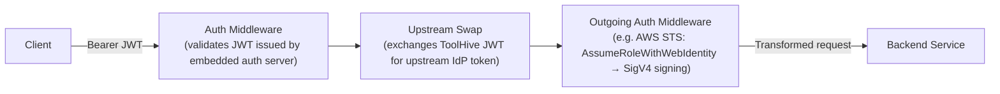

# RFC-0050: Dedicated Auth Server Reference for MCP Resources

- **Status**: Draft
- **Author(s)**: @tgrunnagle
- **Created**: 2026-03-06
- **Last Updated**: 2026-04-07
- **Target Repository**: toolhive
- **Related Issues**: https://github.com/stacklok/stacklok-epics/issues/256

## Summary

Add an `authServerRef` field to both `MCPServerSpec` and `MCPRemoteProxySpec` that references an `MCPExternalAuthConfig` of `type: embeddedAuthServer`. This separates the embedded authorization server — an *incoming* authentication concern — from the `externalAuthConfigRef` field, which can then be used exclusively for *outgoing* auth types (token exchange, AWS STS credential signing, bearer token injection, etc.). The immediate motivation is enabling the embedded auth server alongside AWS STS request signing on `MCPRemoteProxy`, but the design generalizes: any outgoing auth type on `externalAuthConfigRef` can be combined with the embedded auth server once they occupy separate fields. Existing usage of `type: embeddedAuthServer` via `externalAuthConfigRef` is maintained for backward compatibility, but the new `authServerRef` is the preferred path.

## Problem Statement

The ToolHive proxy runner middleware pipeline supports two conceptually distinct authentication layers:

1. **Incoming auth** (the embedded authorization server): an OAuth 2.0/OIDC server that authenticates MCP clients, manages sessions, and issues signed JWTs. This is a *server-side* concern — it governs who can call the MCP endpoint.
2. **Outgoing auth** (token exchange, AWS STS credential signing, bearer token injection, header injection, etc.): middleware that transforms or replaces credentials on requests forwarded to a backend. This is a *client-side* concern — it governs how the proxy authenticates to upstream services.

These layers are designed to compose: the embedded auth server produces a JWT that downstream outgoing auth middleware can consume (e.g., AWS STS calls `AssumeRoleWithWebIdentity` with it). However, the Kubernetes operator CRD model conflates both layers into a single field.

Both `MCPServerSpec` and `MCPRemoteProxySpec` accept a single `externalAuthConfigRef` pointing to an `MCPExternalAuthConfig` resource, whose `type` field is strictly mutually exclusive (enforced by CEL admission rules). Because the embedded auth server is one of these types, it competes with outgoing auth types for the same slot. A user who wants to:
- Use the embedded OAuth server to authenticate MCP clients, **and**
- Configure any outgoing auth type (AWS STS credential signing, token exchange, bearer token injection, etc.) on the same resource

...cannot do so today. They must choose one or the other.

This is a modeling problem, not a runtime limitation. The proxy runner's `RunConfig` already supports `EmbeddedAuthServerConfig` and outgoing auth configs (e.g., `AWSStsConfig`, `TokenExchangeConfig`) as independent fields. The CRD layer simply has no way to populate both.

The most immediate use case is deploying an `MCPRemoteProxy` in front of an AWS-backed service (e.g., Amazon Bedrock, AWS Lambda) with both embedded OAuth 2.0 client authentication and SigV4 request signing. But the same limitation applies to any combination of the embedded auth server with token exchange, bearer token injection, or other outgoing auth types.

## Goals

- Separate the embedded auth server into a dedicated `authServerRef` field on both `MCPServerSpec` and `MCPRemoteProxySpec`, reflecting its distinct role as an incoming auth concern
- Enable the embedded auth server to be configured alongside any outgoing auth type on `externalAuthConfigRef` (the immediate use case is AWS STS, but the design is not STS-specific)
- Keep the change backwards-compatible: existing `MCPExternalAuthConfig` resources with `type: embeddedAuthServer` referenced via `externalAuthConfigRef` continue to work unchanged
- Remain consistent with the existing `MCPExternalAuthConfig` reference pattern used throughout the operator
- Require no changes to the proxy runner or its `RunConfig` — all changes are confined to the CRD and reconciler layers

## Non-Goals

- Changes to the CLI-mode toolhive (`thv run`) or its configuration model
- Deprecating or removing `ExternalAuthTypeEmbeddedAuthServer` from `MCPExternalAuthConfig`
- Deprecating or removing any existing outgoing auth types from `MCPExternalAuthConfig`
- Introducing webhooks or admission controllers (validation remains at reconcile time, consistent with existing operator patterns)

## Proposed Solution

### High-Level Design

Add a new optional `authServerRef` field to both `MCPServerSpec` and `MCPRemoteProxySpec` that references an `MCPExternalAuthConfig` of `type: embeddedAuthServer`. This gives the embedded auth server its own dedicated slot, leaving `externalAuthConfigRef` free for outgoing auth types. The two fields can be set independently:

| Field | Purpose | Supported types |
|-------|---------|-----------------|
| `authServerRef` | Incoming client authentication | `embeddedAuthServer` |
| `externalAuthConfigRef` | Outgoing backend credential handling | `awsSts`, `tokenExchange`, `headerInjection`, `bearerToken`, `unauthenticated`, `upstreamInject` (and `embeddedAuthServer` for backward compat) |

When both are set on an `MCPServer` or `MCPRemoteProxy`, the operator generates a `RunConfig` with both the embedded auth server and the outgoing auth middleware populated. For example, with AWS STS as the outgoing auth type:



`authServerRef` provides a cleaner alternative to using `externalAuthConfigRef` for `type: embeddedAuthServer` (though the old path remains supported).

The `authServerRef` is typed as a Kubernetes `TypedLocalObjectReference` with a hardcoded `kind` of `MCPExternalAuthConfig` and `apiGroup` of `toolhive.stacklok.com`. Using `TypedLocalObjectReference` rather than `ExternalAuthConfigRef` leaves room for a future dedicated auth server CRD — at that point, users would simply change the `kind` in their reference without any structural API changes. The operator validates at reconcile time that the referenced resource is `type: embeddedAuthServer`.

### Detailed Design

#### API Changes

**`MCPServerSpec`** and **`MCPRemoteProxySpec`** each gain one new optional field:

```go
// AuthServerRef optionally references a resource that configures an embedded
// OAuth 2.0/OIDC authorization server to authenticate MCP clients and issue
// signed JWTs.
//
// Currently, the only supported kind is MCPExternalAuthConfig (with type:
// embeddedAuthServer). Using TypedLocalObjectReference allows a future
// dedicated auth server CRD to be referenced here without an API change —
// users would simply update the kind field.
//
// This is the preferred way to configure the embedded auth server. The
// existing externalAuthConfigRef field with type: embeddedAuthServer
// continues to work for backward compatibility, but authServerRef should
// be used for new configurations.
//
// When set alongside externalAuthConfigRef (e.g. type: awsSts on an
// MCPRemoteProxy), the operator generates a RunConfig with both
// EmbeddedAuthServerConfig and the outgoing auth config populated,
// enabling the proxy runner's middleware pipeline to apply both layers.
//
// If both authServerRef and externalAuthConfigRef are set with type:
// embeddedAuthServer, the controller will return a validation error.
//
// The referenced resource must exist in the same namespace.
//
// +optional
AuthServerRef *corev1.TypedLocalObjectReference `json:"authServerRef,omitempty"`
```

At reconcile time, the controller validates that:
1. `authServerRef.APIGroup` is `toolhive.stacklok.com` (or empty, defaulting to the same)
2. `authServerRef.Kind` is `MCPExternalAuthConfig` (the only supported kind today)
3. The referenced `MCPExternalAuthConfig` has `type: embeddedAuthServer`

**`MCPServerStatus`** gains one new field for change detection:

```go
// AuthServerConfigHash is the hash of the referenced authServerRef spec,
// used to detect configuration changes and trigger reconciliation.
// +optional
AuthServerConfigHash string `json:"authServerConfigHash,omitempty"`
```

**`MCPRemoteProxyStatus`** gains one new field for change detection:

```go
// AuthServerConfigHash is the hash of the referenced authServerRef spec,
// used to detect configuration changes and trigger reconciliation.
// +optional
AuthServerConfigHash string `json:"authServerConfigHash,omitempty"`
```

#### Component Changes

**`cmd/thv-operator/pkg/controllerutil/authserver.go`**

Add a new exported function that resolves an `authServerRef` reference and appends the corresponding `RunConfigBuilderOption`:

```go
// AddAuthServerRefOptions resolves an authServerRef (TypedLocalObjectReference),
// validates the kind and type, and appends the corresponding RunConfigBuilderOption.
// Returns an error if the referenced resource is not a supported kind, is not
// type:embeddedAuthServer, or cannot be fetched.
//
// This function is used by both MCPServer and MCPRemoteProxy reconcilers
// to handle the new authServerRef field independently of externalAuthConfigRef.
func AddAuthServerRefOptions(
    ctx context.Context,
    c client.Client,
    namespace string,
    mcpServerName string,
    authServerRef *corev1.TypedLocalObjectReference,
    oidcConfig *oidc.OIDCConfig,
    options *[]runner.RunConfigBuilderOption,
) error {
    if authServerRef == nil {
        return nil
    }

    // Validate the referenced kind — only MCPExternalAuthConfig is supported today
    if authServerRef.Kind != "MCPExternalAuthConfig" {
        return fmt.Errorf(
            "authServerRef.kind must be %q, got %q",
            "MCPExternalAuthConfig", authServerRef.Kind,
        )
    }

    externalAuthConfig, err := GetExternalAuthConfigByName(ctx, c, namespace, authServerRef.Name)
    if err != nil {
        return fmt.Errorf("failed to get MCPExternalAuthConfig for authServerRef: %w", err)
    }
    if externalAuthConfig.Spec.Type != mcpv1alpha1.ExternalAuthTypeEmbeddedAuthServer {
        return fmt.Errorf(
            "authServerRef must reference an MCPExternalAuthConfig of type %q, got %q",
            mcpv1alpha1.ExternalAuthTypeEmbeddedAuthServer, externalAuthConfig.Spec.Type,
        )
    }
    // Reuses the existing AddEmbeddedAuthServerConfigOptions logic
    return AddEmbeddedAuthServerConfigOptions(ctx, c, namespace, mcpServerName, externalAuthConfig, oidcConfig, options)
}
```

This function validates the `Kind` field (future-proofing for a dedicated CRD), then delegates to the existing `AddEmbeddedAuthServerConfigOptions` after type validation, so no logic is duplicated.

**`cmd/thv-operator/controllers/mcpserver_runconfig.go`**

After the existing `AddExternalAuthConfigOptions` call, add conflict detection and `authServerRef` resolution:

```go
// Validate: authServerRef and externalAuthConfigRef must not both configure
// an embedded auth server
if m.Spec.AuthServerRef != nil && m.Spec.ExternalAuthConfigRef != nil {
    extAuthConfig, err := ctrlutil.GetExternalAuthConfigByName(
        ctx, r.Client, m.Namespace, m.Spec.ExternalAuthConfigRef.Name,
    )
    if err != nil {
        return nil, fmt.Errorf("failed to get MCPExternalAuthConfig for conflict check: %w", err)
    }
    if extAuthConfig.Spec.Type == mcpv1alpha1.ExternalAuthTypeEmbeddedAuthServer {
        return nil, fmt.Errorf(
            "authServerRef and externalAuthConfigRef cannot both configure an embedded auth server; "+
                "use authServerRef for embedded auth server configuration",
        )
    }
}

// Add embedded auth server config from authServerRef if present
if err := ctrlutil.AddAuthServerRefOptions(
    ctx, r.Client, m.Namespace, m.Name, m.Spec.AuthServerRef, oidcConfig, &options,
); err != nil {
    return nil, fmt.Errorf("failed to process authServerRef: %w", err)
}
```

**`cmd/thv-operator/controllers/mcpremoteproxy_runconfig.go`**

Same conflict detection and `authServerRef` resolution logic as `mcpserver_runconfig.go`. Because `MCPRemoteProxy` supports both `authServerRef` (embedded auth server) and `externalAuthConfigRef` (e.g., `type: awsSts`) simultaneously, the conflict check only triggers when `externalAuthConfigRef` is also `type: embeddedAuthServer`:

```go
// Validate: authServerRef and externalAuthConfigRef must not both configure
// an embedded auth server
if m.Spec.AuthServerRef != nil && m.Spec.ExternalAuthConfigRef != nil {
    extAuthConfig, err := ctrlutil.GetExternalAuthConfigByName(
        ctx, r.Client, m.Namespace, m.Spec.ExternalAuthConfigRef.Name,
    )
    if err != nil {
        return nil, fmt.Errorf("failed to get MCPExternalAuthConfig for conflict check: %w", err)
    }
    if extAuthConfig.Spec.Type == mcpv1alpha1.ExternalAuthTypeEmbeddedAuthServer {
        return nil, fmt.Errorf(
            "authServerRef and externalAuthConfigRef cannot both configure an embedded auth server; "+
                "use authServerRef for embedded auth server configuration",
        )
    }
}

// Add embedded auth server config from authServerRef if present
if err := ctrlutil.AddAuthServerRefOptions(
    ctx, r.Client, m.Namespace, m.Name, m.Spec.AuthServerRef, oidcConfig, &options,
); err != nil {
    return nil, fmt.Errorf("failed to process authServerRef: %w", err)
}
```

**`cmd/thv-operator/controllers/mcpexternalauthconfig_controller.go`**

Update the `ReferencingServers` listing logic to also include `MCPServer` and `MCPRemoteProxy` resources that reference the config via `authServerRef` (in addition to the existing `externalAuthConfigRef` check). When the config hash changes, the controller already annotates all referencing servers to trigger reconciliation — extending that list to cover `authServerRef` ensures changes to the embedded auth server config propagate correctly.

#### Runner Layer Impact

**No changes required.** The proxy runner's `RunConfig` (`pkg/runner/config.go`) already supports both `EmbeddedAuthServerConfig` and `AWSStsConfig` simultaneously as independent optional fields. The `PopulateMiddlewareConfigs()` function already generates the correct middleware pipeline when both are present. The reconciler changes above produce exactly the same `RunConfig` output — they simply read the embedded auth server config from the new `authServerRef` field instead of (or in addition to) the `externalAuthConfigRef` field.

This is confirmed by examining the `RunConfig` struct which has independent fields:
```go
EmbeddedAuthServerConfig *authserver.RunConfig `json:"embedded_auth_server_config,omitempty"`
AWSStsConfig             *awssts.Config         `json:"aws_sts_config,omitempty"`
```

And the middleware pipeline builder (`PopulateMiddlewareConfigs`) which processes each config independently.

#### Configuration Changes

**Example 1: MCPRemoteProxy with embedded auth server + AWS STS (the primary new use case)**

```yaml
apiVersion: toolhive.stacklok.com/v1alpha1
kind: MCPRemoteProxy
metadata:
  name: my-aws-remote-proxy
spec:
  transport: streamable-http
  remoteServerURL: https://bedrock.us-east-1.amazonaws.com/model/invoke

  oidcConfig:
    issuer: https://auth.example.com
    audience: my-remote-proxy
    resourceURL: https://proxy.example.com

  # Incoming auth: embedded OAuth 2.0 server authenticates MCP clients (NEW FIELD)
  authServerRef:
    kind: MCPExternalAuthConfig
    name: my-embedded-auth-server

  # Outgoing auth: sign requests to the AWS backend with role-specific credentials
  externalAuthConfigRef:
    name: my-aws-sts-config
---
apiVersion: toolhive.stacklok.com/v1alpha1
kind: MCPExternalAuthConfig
metadata:
  name: my-embedded-auth-server
spec:
  type: embeddedAuthServer
  embeddedAuthServer:
    issuer: https://auth.example.com
    upstreamProviders:
      - name: corporate-oidc
        type: oidc
        oidcConfig:
          issuerURL: https://idp.example.com
          clientID: my-client-id
---
apiVersion: toolhive.stacklok.com/v1alpha1
kind: MCPExternalAuthConfig
metadata:
  name: my-aws-sts-config
spec:
  type: awsSts
  awsSts:
    region: us-east-1
    fallbackRoleArn: arn:aws:iam::123456789012:role/mcp-default-role
    roleMappings:
      - claim: admins
        roleArn: arn:aws:iam::123456789012:role/mcp-admin-role
        priority: 0
    roleClaim: groups
    sessionNameClaim: sub
    sessionDuration: 3600
```

**Example 2: MCPServer with embedded auth server (new preferred path)**

```yaml
apiVersion: toolhive.stacklok.com/v1alpha1
kind: MCPServer
metadata:
  name: my-mcp-server
spec:
  image: ghcr.io/example/mcp-server:latest
  transport: streamable-http

  # Preferred: use authServerRef for embedded auth server
  authServerRef:
    kind: MCPExternalAuthConfig
    name: my-embedded-auth-server
```

**Example 3: MCPServer with embedded auth server (backward-compatible, still works)**

```yaml
apiVersion: toolhive.stacklok.com/v1alpha1
kind: MCPServer
metadata:
  name: my-mcp-server
spec:
  image: ghcr.io/example/mcp-server:latest
  transport: streamable-http

  # Legacy path: still works, but authServerRef is preferred
  externalAuthConfigRef:
    name: my-embedded-auth-server
```

## Security Considerations

### Threat Model

The proposed change introduces no new attack surfaces beyond what `ExternalAuthTypeAWSSts` and `ExternalAuthTypeEmbeddedAuthServer` already expose via `MCPExternalAuthConfig`. By keeping both configurations in separate `MCPExternalAuthConfig` resources, existing RBAC policies that control who can read or modify auth configurations continue to apply without change.

Potential threats remain the same as the existing auth paths:
- **Role escalation**: a misconfigured `roleMappings` could grant excessive AWS permissions. Mitigated by IAM policy controls on the role itself (independent of ToolHive).
- **JWT claim manipulation**: if an attacker can forge JWT claims (e.g., `groups`), they could influence role selection. Mitigated by the embedded auth server signing keys protecting JWT integrity.

### Authentication and Authorization

- The AWS STS middleware executes **after** the auth middleware has validated the incoming JWT. The authenticated identity is always established before role selection occurs.
- Kubernetes RBAC controls who can create/modify `MCPExternalAuthConfig` resources containing IAM role ARNs, separate from who can modify the `MCPServer` or `MCPRemoteProxy` resources themselves.

### Data Security

- `AWSStsConfig` contains no secrets — only region, service name, IAM role ARNs, and claim field names. These are stored in the `MCPExternalAuthConfig` spec (etcd), consistent with existing usage of `type: awsSts`.
- AWS temporary credentials produced by `AssumeRoleWithWebIdentity` are used in-memory to sign a single request and are never persisted.

### Input Validation

- **Role ARN**: the existing `awssts` package validates ARN format (`arn:aws:iam::<12-digit-account>:role/<name>`).
- **Session duration**: the existing CEL rules on `MCPExternalAuthConfig.spec.awsSts` already constrain to [900, 43200] seconds.
- **Type mismatch**: the controller validates at reconcile time that `authServerRef` points to `type: embeddedAuthServer`. A misconfigured reference surfaces as a condition on the resource's status.
- **Conflict detection**: if both `authServerRef` and `externalAuthConfigRef` are set with `type: embeddedAuthServer`, the controller returns a validation error.

### Secrets Management

No new secrets are introduced. The AWS SDK uses standard credential chain resolution (IRSA / pod identity) for the initial STS call; no static credentials are required. The embedded auth server's signing keys and HMAC secrets continue to be referenced via `SecretKeyRef` in the `MCPExternalAuthConfig` resource.

### Audit and Logging

- The proxy runner already logs AWS STS middleware activity (role selection, session name) at DEBUG level.
- The proxy runner already logs embedded auth server activity at DEBUG level.
- Reconciliation errors (e.g., type mismatch, dual embedded auth server conflict) surface as conditions on the resource status, visible via `kubectl describe`.

### Mitigations

- Reconcile-time type validation prevents `authServerRef` from silently pointing to a non-embedded-auth-server config.
- Conflict detection prevents `authServerRef` and `externalAuthConfigRef` from both configuring an embedded auth server on the same resource.
- Change propagation via the `MCPExternalAuthConfig` controller ensures auth server config updates are picked up by all referencing `MCPServer` and `MCPRemoteProxy` resources.

## Alternatives Considered

### Alternative 1: Add `awsStsConfigRef` to `MCPServerSpec`

Add a separate `awsStsConfigRef` field `MCPRemoteProxySpec` that references an `MCPExternalAuthConfig` of `type: awsSts`.

- **Pros**: Directly solves the combined auth problem; mirrors the `externalAuthConfigRef` pattern.
- **Cons**: Doesn't address the conceptual conflation of embedded auth server with outgoing auth types in `externalAuthConfigRef`.
- **Why not chosen**: The embedded auth server is the common element across both server and proxy resource types, so extracting it to a dedicated field is more natural and keeps AWS STS where it belongs (on remote proxies).

### Alternative 2: Allow Multiple `ExternalAuthConfigRef` Entries

Replace the single `externalAuthConfigRef` with a list, allowing one ref per conceptual layer.

- **Pros**: General solution applicable to all auth type combinations.
- **Cons**: Breaking API change to the existing field; complex validation to prevent incompatible combinations; significant controller refactoring.
- **Why not chosen**: Disproportionate scope for the specific use case.

### Alternative 3: Composite Type in `MCPExternalAuthConfig`

Add a new `type: embeddedAuthServerWithAwsSts` or allow optional `awsStsConfig` alongside `embeddedAuthServerConfig` in the same `MCPExternalAuthConfig` resource.

- **Pros**: Single resource to manage for the combined configuration.
- **Cons**: Changes the fundamental type model of `MCPExternalAuthConfig` (breaking its "one type, one config" invariant); conflates incoming and outgoing auth concerns.
- **Why not chosen**: Violates the design invariant of `MCPExternalAuthConfig` and makes the resource semantics harder to reason about.

## Compatibility

### Backward Compatibility

This change is fully backwards-compatible:
- The new `authServerRef` field on `MCPServerSpec` and `MCPRemoteProxySpec` is optional (`omitempty`). Existing resources are unaffected.
- The new `authServerConfigHash` field on `MCPServerStatus` and `MCPRemoteProxyStatus` is optional. No existing status consumers are broken.
- Existing `MCPExternalAuthConfig` resources with `type: embeddedAuthServer` referenced via `externalAuthConfigRef` continue to work unchanged. No deprecation is introduced.
- Existing `MCPExternalAuthConfig` resources with `type: awsSts` referenced via `externalAuthConfigRef` continue to work unchanged.
- No changes to the `MCPExternalAuthConfig` CRD or its CEL validation rules.
- No changes to `RunConfig`, the proxy runner, or the middleware pipeline.

### Forward Compatibility

The `authServerRef` pattern cleanly separates the embedded auth server concern. If other incoming auth types emerge in the future, the same dedicated-ref approach can be extended. The `externalAuthConfigRef` field remains available for outgoing auth types like `awsSts`, `tokenExchange`, `headerInjection`, and `bearerToken`.

## Implementation Plan

### Phase 1: CRD, Controller Changes, and Unit Tests

- Add `AuthServerRef *corev1.TypedLocalObjectReference` to `MCPServerSpec` in `cmd/thv-operator/api/v1alpha1/mcpserver_types.go`
- Add `AuthServerConfigHash string` to `MCPServerStatus` in the same file
- Add `AuthServerRef *corev1.TypedLocalObjectReference` to `MCPRemoteProxySpec` in `cmd/thv-operator/api/v1alpha1/mcpremoteproxy_types.go`
- Add `AuthServerConfigHash string` to `MCPRemoteProxyStatus` in the same file
- Add `AddAuthServerRefOptions()` to `cmd/thv-operator/pkg/controllerutil/authserver.go`
- Update `cmd/thv-operator/controllers/mcpserver_runconfig.go` to resolve `authServerRef`, add conflict validation (both fields pointing to embedded auth server), and update `AuthServerConfigHash` in status
- Update `cmd/thv-operator/controllers/mcpremoteproxy_runconfig.go` with the same `authServerRef` resolution and conflict validation logic
- Update the `externalAuthConfigHandler` watch handler in `cmd/thv-operator/controllers/mcpremoteproxy_controller.go` (`SetupWithManager`) to also match `MCPRemoteProxy` resources where `authServerRef.Name` equals the changed `MCPExternalAuthConfig` name (currently only matches on `externalAuthConfigRef.Name`)
- Add a corresponding `authServerRef.Name` match check to the `externalAuthConfigHandler` watch handler in `cmd/thv-operator/controllers/mcpserver_controller.go` (`SetupWithManager`), so that changes to an `MCPExternalAuthConfig` referenced via `authServerRef` trigger `MCPServer` reconciliation
- Update `cmd/thv-operator/controllers/mcpexternalauthconfig_controller.go` to include `authServerRef` in `findReferencingMCPServers`, `findReferencingWorkloads`, and reconciliation-trigger annotations for both `MCPServer` and `MCPRemoteProxy`
- Run `task gen` to regenerate CRD YAML and deepcopy functions
- Unit tests for `AddAuthServerRefOptions` (type validation, nil ref, error paths) in `cmd/thv-operator/pkg/controllerutil/`
- Unit tests for the conflict validation path (both `authServerRef` and `externalAuthConfigRef` set to `type: embeddedAuthServer`) in `mcpserver_runconfig.go` and `mcpremoteproxy_runconfig.go`
- Unit tests for the combined `authServerRef` + `externalAuthConfigRef` (type: awsSts) path in `mcpremoteproxy_runconfig.go`
- Unit tests for the updated `ReferencingServers` listing logic in the MCPExternalAuthConfig controller

### Phase 2: E2E Testing

E2E tests in a new `test/e2e/thv-operator/authserver/` directory (Ginkgo/Gomega, following existing patterns in `test/e2e/thv-operator/virtualmcp/`):

**MCPServer tests:**
- Create an `MCPServer` with `authServerRef` pointing to an `MCPExternalAuthConfig` of `type: embeddedAuthServer`; verify the backend reaches `Running` phase and the generated ConfigMap contains `embedded_auth_server_config`
- Create an `MCPServer` with both `authServerRef` and `externalAuthConfigRef` both pointing to `type: embeddedAuthServer` configs; verify the controller sets an error condition on `MCPServerStatus` (conflict detection)
- Create an `MCPServer` with `authServerRef` pointing to an `MCPExternalAuthConfig` of a non-`embeddedAuthServer` type (e.g., `unauthenticated`); verify the controller sets an error condition (type mismatch)
- Verify backward compatibility: create an `MCPServer` with `externalAuthConfigRef` pointing to `type: embeddedAuthServer` (no `authServerRef`); verify it continues to work and reaches `Running` phase

**MCPRemoteProxy tests:**
- Create an `MCPRemoteProxy` with `authServerRef` pointing to `type: embeddedAuthServer`; verify the proxy reaches `Running` phase and the generated ConfigMap contains `embedded_auth_server_config`
- Create an `MCPRemoteProxy` with `authServerRef` (type: embeddedAuthServer) and `externalAuthConfigRef` (type: awsSts); verify the generated ConfigMap contains both `embedded_auth_server_config` and `aws_sts_config` (the primary combined use case)
- Create an `MCPRemoteProxy` with both `authServerRef` and `externalAuthConfigRef` both pointing to `type: embeddedAuthServer` configs; verify the controller sets an error condition on `MCPRemoteProxyStatus` (conflict detection)
- Create an `MCPRemoteProxy` with `authServerRef` pointing to a non-`embeddedAuthServer` type; verify the controller sets an error condition (type mismatch)
- Verify backward compatibility: create an `MCPRemoteProxy` with `externalAuthConfigRef` pointing to `type: embeddedAuthServer` (no `authServerRef`); verify it continues to work

### Phase 3: Documentation

- Update `docs/arch/09-operator-architecture.md` to describe the new `authServerRef` field and its relationship to `externalAuthConfigRef`
- Update operator CRD reference documentation
- Update the `stacklok/docs-website` repository to document the new `authServerRef` field, the combined embedded auth server + outgoing auth configuration pattern, and updated YAML examples for `MCPServer` and `MCPRemoteProxy`

### Dependencies

None. The proxy runner's `RunConfig` already supports both `EmbeddedAuthServerConfig` and `AWSStsConfig` simultaneously; no changes to `pkg/runner/` are required. The existing `AddEmbeddedAuthServerConfigOptions` function in `cmd/thv-operator/pkg/controllerutil/authserver.go` is reused by the new `AddAuthServerRefOptions` function.

## Testing Strategy

- **Unit tests**: `AddAuthServerRefOptions`, conflict validation, combined auth server + outgoing auth RunConfig generation, `ReferencingServers` listing logic update (all in Phase 1)
- **E2E tests**: operator-level Ginkgo tests in `test/e2e/thv-operator/authserver/` verifying `authServerRef` happy path, conflict detection, type mismatch, and backward compatibility (Phase 2)
- **Security tests**: type-mismatch and conflict error conditions on resource status

## Documentation

- `docs/arch/09-operator-architecture.md`: describe the `spec.authServerRef` field and its role in the auth pipeline
- Operator CRD reference (auto-generated): regenerated via `task gen` + `task docs`
- `stacklok/docs-website`: update operator authentication documentation to cover the combined embedded auth server + AWS STS configuration pattern on `MCPRemoteProxy`

## References

- [AWS STS AssumeRoleWithWebIdentity](https://docs.aws.amazon.com/STS/latest/APIReference/API_AssumeRoleWithWebIdentity.html)
- [AWS SigV4 Signing](https://docs.aws.amazon.com/general/latest/gr/signature-version-4.html)
- [RFC 7523 — JWT Profile for OAuth 2.0 Client Authentication](https://datatracker.ietf.org/doc/html/rfc7523)
- [ToolHive proxy runner middleware pipeline](../../pkg/runner/middleware.go)
- [MCPExternalAuthConfig type definitions](../../cmd/thv-operator/api/v1alpha1/mcpexternalauthconfig_types.go)

---

## RFC Lifecycle

<!-- This section is maintained by RFC reviewers -->

### Review History

| Date | Reviewer | Decision | Notes |
|------|----------|----------|-------|
| 2026-03-06 | TBD | Under Review | Initial submission |
| 2026-04-06 | TBD | Revision | Reworked: authServerRef replaces awsStsConfigRef approach |

### Implementation Tracking

| Repository | PR | Status |
|------------|-----|--------|
| toolhive | TBD | Pending |
