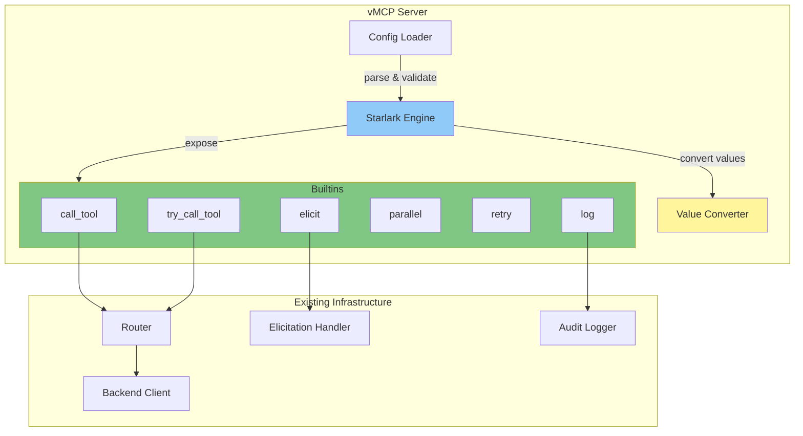
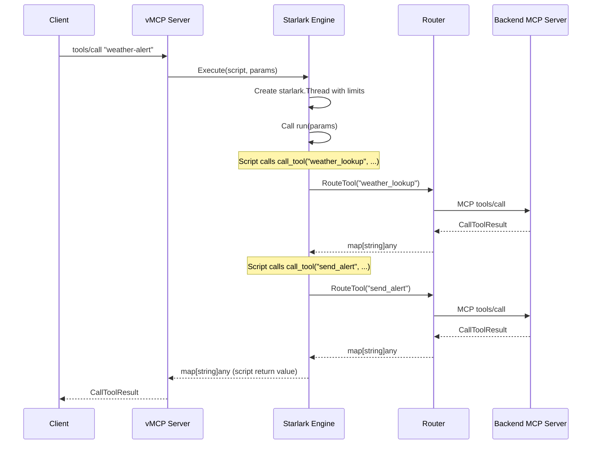

# THV-0051: Starlark Scripted Tools for vMCP

- **Status**: Draft
- **Author(s)**: @jerm-dro
- **Created**: 2026-03-06
- **Last Updated**: 2026-03-06
- **Target Repository**: toolhive
- **Related Issues**: N/A

## Summary

Replace vMCP's declarative composite tools system (DAG + Go templates) with a Starlark scripting engine that lets users define multi-step tool workflows as Python-like scripts. The new system runs in parallel with the existing composite tools during a migration period, then replaces it entirely.

## Problem Statement

The current composite tools system (`pkg/vmcp/composer/`) uses a declarative YAML-based approach: workflows are defined as a list of steps with `dependsOn` edges forming a DAG, Go `text/template` expressions for data flow, and per-step `onError` configuration for error handling. This works for simple linear or fan-out workflows but hits hard limits as workflow complexity grows:

- **No iteration**: There is no way to loop over a result set (e.g., "for each item returned by tool A, call tool B"). The DAG model requires steps to be statically declared at definition time.
- **Limited conditional logic**: The `condition` field evaluates a template to `true`/`false` to skip a step entirely, but there is no if/else branching where different steps execute on different branches.
- **Awkward data transformation**: Go templates are designed for text rendering, not data manipulation. Extracting a field from a JSON object, building a new map, or doing string formatting requires fighting the template syntax. Only three custom functions exist (`json`, `quote`, `fromJson`).
- **`skip_remaining` is incomplete**: The elicitation `skip_remaining` action is documented but does not actually skip remaining steps (noted in code comments).
- **High implementation complexity for limited expressiveness**: The composer package is ~3,500 lines of Go across the DAG executor, template expander, output constructor, elicitation handler, state store, and validation — yet the resulting user-facing expressiveness is quite constrained.

Users who need workflows beyond "call A then B then C" are stuck, and the declarative model cannot be extended to cover these cases without effectively reinventing a programming language inside YAML.

## Goals

- Provide a scripting model for vMCP tool workflows that supports iteration, conditional branching, dynamic tool dispatch, parallel execution, and data transformation
- Maintain the security properties of the existing system: sandboxed execution, resource limits, no arbitrary I/O
- Run as a parallel system alongside existing composite tools during migration
- Preserve the existing CRD and CLI config surface area (users still define tools in YAML/CRDs, but the workflow body is a script instead of a step list)
- Keep the builtin API small and auditable
- **Long-term**: Enable agents to dynamically compose and submit Starlark scripts to vMCP for execution, allowing agents to build their own multi-step workflows at runtime. This is out of scope for this RFC and would need its own design (trust boundaries, submission API, per-agent sandboxing limits), but the choice of Starlark as a sandboxed scripting language makes this feasible in a way that a declarative YAML DSL never could.

## Non-Goals

- General-purpose scripting for ToolHive beyond vMCP composite tools (e.g., this is not a plugin system for the CLI or operator)
- Replacing the MCP protocol layer or transport handling
- Async/background workflow execution (synchronous request-response model is retained)
- A visual workflow editor or GUI-based tool builder
- Supporting multiple scripting languages (Starlark only; no Lua, JS, etc.)

## Why Starlark

### Why it fits

[Starlark](https://github.com/google/starlark-go) is a dialect of Python designed by Google for embedded use in large systems (Bazel, Buck2, Tilt, Cirrus CI). It is purpose-built for exactly this use case: safe, deterministic scripting embedded in a Go host application.

| Property | Starlark | Current system |
|----------|----------|---------------|
| Iteration | `for` loops, list comprehensions | Not possible |
| Conditionals | `if`/`elif`/`else` | Template `condition` (skip only) |
| Data transformation | Native dicts, lists, string methods | Go `text/template` with 3 custom funcs |
| Dynamic dispatch | Call any exposed builtin based on runtime values | Static step graph only |
| Parallel execution | Host-controlled via `parallel()` builtin | DAG level-based parallelism |
| Error handling | Result objects + halt-on-error builtins | Per-step `onError` YAML config |
| Sandboxing | No I/O, no imports, no OS access by design | N/A (declarative, no execution) |

### Why not something else

**Risor** ([github.com/risor-io/risor](https://github.com/risor-io/risor)): A Go-native scripting language with access to portions of the Go stdlib. More expressive than Starlark (has try/catch, goroutines, full module system). However, its Go stdlib access is a security liability — we would need to audit and strip every module. Risor is also a younger project with a smaller community. The extra expressiveness (classes, exceptions, goroutines) is unnecessary for tool orchestration scripts.

**Tengo** ([github.com/d5/tengo](https://github.com/d5/tengo)): Fast embedded scripting language for Go. Custom syntax that is neither Python nor Go — users would need to learn a new language. Smaller community and ecosystem than Starlark. No significant advantage over Starlark for this use case.

**Goja** ([github.com/nicktrav/goja](https://github.com/nicktrav/goja)): JavaScript (ES5.1+) interpreter in Go. Full JS semantics are overkill and introduce a large attack surface (prototype pollution, `eval`, etc.). Sandboxing JS properly is notoriously difficult.

**Expr** ([github.com/expr-lang/expr](https://github.com/expr-lang/expr)): Expression language, not a scripting language. No loops, no multi-statement programs, no function definitions. Useful for conditions and filters but cannot replace a workflow engine.

**Lua (via GopherLua)**: Viable alternative with good sandboxing, but less familiar syntax than Python. Starlark's Python-like syntax lowers the barrier for users who already know Python.

### Known Starlark limitations and mitigations

| Limitation | Impact | Mitigation |
|------------|--------|------------|
| **No try/except** | Cannot catch errors from builtins using language-level exceptions | Two-builtin pattern: `call_tool()` halts on error, `try_call_tool()` returns error info. See [Error Handling](#error-handling-design) section. |
| **No classes** | Cannot define custom types in scripts | Not needed — workflows operate on dicts and lists. Go-side structs are exposed as Starlark structs. |
| **No while loops** (unless `AllowGlobalReassign` is set) | Cannot write unbounded loops | Enable via `syntax.FileOptions`. Also enforce execution step limits as a safety net. |
| **No standard library** | No `os`, `sys`, `re`, etc. | By design — we provide only the builtins we want. String methods are built-in (`str.split()`, `str.upper()`, etc.). We provide `json.encode()`/`json.decode()` via the `starlark-go` json module. |
| **Go data interop is verbose** | Converting between Go `map[string]any` and Starlark dicts requires explicit conversion code | Write a bidirectional conversion layer once (`starlarkToGo`, `goToStarlark`). Use the [starlight](https://github.com/starlight-go/starlight) wrapper library if conversion boilerplate becomes excessive. |
| **No recursion by default** | Recursive helper functions fail | Enable via `syntax.FileOptions{Recursion: true}`. Enforce call depth limits. |
| **Module system (`load`) requires host support** | Scripts cannot import shared code without a custom loader | Implement a `load` handler that resolves from a configurable library path. See [Code Reuse](#code-reuse) section. |
| **Not Turing complete by default** | `for` only iterates finite sequences | With `AllowRecursion` + `while` enabled, scripts become Turing complete. Execution step limits prevent runaway scripts. |

### License compatibility

Starlark-go is licensed under **BSD 3-Clause**, which is fully compatible with ToolHive's Apache 2.0 license. No attribution or copyleft concerns.

### Future extensibility concerns

Could Starlark block features we might want later?

| Future feature | Feasible in Starlark? |
|---|---|
| Calling tools conditionally based on runtime data | Yes — native `if`/`else` |
| Fan-out over result lists | Yes — `for` loops, `parallel()` builtin |
| Approval gates / human-in-the-loop | Yes — `elicit()` builtin |
| Persisting state across workflow invocations | Yes — expose a `kv_get`/`kv_set` builtin backed by a state store |
| Calling external HTTP APIs | Possible — expose a `http_get`/`http_post` builtin (but carefully scoped) |
| Sub-workflow composition | Yes — `load()` for shared functions, or a `run_workflow()` builtin |
| Streaming/async tool calls | Difficult — Starlark execution is synchronous. Would need to be modeled as `poll()` or callback patterns. Acceptable tradeoff since MCP tool calls are request-response. |
| Type checking / static analysis | Limited — Starlark is dynamically typed. Could lint scripts for common errors (undefined variables, wrong arg counts) at load time using `resolve` package. |
| Debugging / step-through execution | Possible — Starlark threads support step callbacks. Could emit trace events per statement. |

The only case where Starlark is genuinely limiting is **streaming/async execution**, which is not a current requirement and would be architecturally complex regardless of scripting language.

## Proposed Solution

### High-Level Design



The Starlark engine is a new package (`pkg/vmcp/starlark/`) that:

1. Loads and validates Starlark scripts at config time
2. Exposes a fixed set of Go-implemented builtins to scripts
3. Executes scripts in response to MCP `tools/call` requests
4. Converts between Go and Starlark value representations
5. Enforces resource limits (execution steps, timeouts, output size)

It reuses existing infrastructure: the router for tool dispatch, the backend client for MCP calls, the elicitation handler for user interaction, and the audit logger for observability.

### Examples

> **Dict vs struct access in Starlark**
>
> The examples below use two access patterns:
> - **`foo["bar"]`** (dict indexing) — used for tool results. Backend tool output is a Go `map[string]any` converted to a Starlark dict. Accessing a missing key raises an error; use `foo.get("bar", default)` for optional fields.
> - **`foo.bar`** (attribute access) — used for builtin return values. `try_call_tool` and `elicit` return Starlark structs with fixed fields (`.ok`, `.error`, `.output`, `.action`, `.content`). These are not dicts — you cannot index them with `["bar"]`.
>
> Rule of thumb: data from backends is a dict, data from builtins is a struct.

#### Working with structured data from tool results

When a backend tool returns structured content (via MCP's `structuredContent` field), the engine converts it to a native Starlark dict. Fields are accessed directly:

```python
def run(params):
    # call_tool returns a dict when the backend provides structuredContent
    user = call_tool("get_user", {"id": params["user_id"]})

    # Access nested fields directly — no parsing needed
    full_name = user["first_name"] + " " + user["last_name"]
    email = user["contact"]["email"]

    # Filter, transform, build new structures
    active_roles = [r for r in user["roles"] if r["status"] == "active"]
    role_names = [r["name"] for r in active_roles]

    return {
        "name": full_name,
        "email": email,
        "active_roles": role_names,
        "is_admin": "admin" in role_names,
    }
```

#### Returning structured data

A script's return value (a dict) becomes the MCP `CallToolResult` sent to the client. vMCP sets the result's `structuredContent` to the returned dict and also generates a text representation in the `content` array for clients that don't support structured content:

```python
def run(params):
    orders = call_tool("list_orders", {"customer_id": params["customer_id"]})

    total = 0
    for order in orders["items"]:
        total += order["amount"]

    # This dict becomes structuredContent in the MCP response.
    # vMCP also generates a text content item with a JSON serialization
    # for backward compatibility with clients that only read content[].
    return {
        "customer_id": params["customer_id"],
        "order_count": len(orders["items"]),
        "total_amount": total,
        "currency": orders["currency"],
    }
```

The MCP client receives:

```json
{
    "structuredContent": {
        "customer_id": "cust_123",
        "order_count": 3,
        "total_amount": 450.00,
        "currency": "USD"
    },
    "content": [
        {
            "type": "text",
            "text": "{\"customer_id\": \"cust_123\", \"order_count\": 3, ...}"
        }
    ]
}
```

#### Handling JSON-as-string from legacy MCP servers

Older MCP servers that predate structured content support return tool results as a JSON string inside a `content[0].text` field. The engine surfaces this as a dict with a single `"text"` key. Use `json.decode()` to parse it:

```python
load("json.star", "json")

def run(params):
    # Legacy server returns: content: [{type: "text", text: '{"temp": 72, "unit": "F"}'}]
    # The engine converts this to: {"text": '{"temp": 72, "unit": "F"}'}
    raw = call_tool("legacy_weather", {"city": params["city"]})

    # Parse the JSON string into a usable dict
    weather = json.decode(raw["text"])

    return {
        "city": params["city"],
        "temperature": weather["temp"],
        "unit": weather["unit"],
    }
```

#### Fan-out with parallel

Call the same tool for each item in a list concurrently using the `parallel` builtin:

```python
def run(params):
    # Build a list of zero-argument callables, one per city.
    # Each lambda captures its own copy of `city` via the default argument.
    lookups = [
        lambda city=city: call_tool("weather_lookup", {"city": city})
        for city in params["cities"]
    ]

    # Execute all lookups concurrently (up to 10 in parallel).
    # Results are returned in the same order as the input list.
    results = parallel(lookups)

    # Post-process: find cities with extreme heat
    alerts = []
    for i, city in enumerate(params["cities"]):
        if results[i]["temperature"] > 35:
            alerts.append(city)

    if alerts:
        call_tool("send_alert", {
            "message": "Extreme heat in: " + ", ".join(alerts),
            "severity": "high",
        })

    return {"results": results, "alerts": alerts}
```

#### Error handling patterns

A single workflow showing `call_tool` (halt on error), `try_call_tool` (handle errors), and `retry` (transient failures):

```python
def run(params):
    # 1. call_tool: halt on error (the default, safe path).
    #    If get_account fails, the entire workflow stops and the
    #    client receives a failed CallToolResult with the error.
    account = call_tool("get_account", {"id": params["account_id"]})

    # 2. try_call_tool: optional enrichment that may fail.
    #    We don't want a missing credit score to block the workflow.
    credit = try_call_tool("get_credit_score", {"ssn": account["ssn"]})
    credit_score = credit.output["score"] if credit.ok else None

    # 3. retry: call an external API that has transient failures.
    #    Retries up to 3 times with exponential backoff starting at 2s.
    risk = retry(
        lambda: call_tool("risk_assessment", {
            "account": account,
            "credit_score": credit_score,
        }),
        max_attempts=3,
        delay="2s",
    )

    return {
        "account_id": params["account_id"],
        "risk_level": risk["level"],
        "credit_available": credit.ok,
        "credit_score": credit_score,
    }
```

#### Elicitation (human-in-the-loop)

Prompt the user for a decision mid-workflow using the MCP elicitation protocol:

```python
def run(params):
    analysis = call_tool("analyze_transaction", {
        "transaction_id": params["transaction_id"],
    })

    if analysis["risk_score"] > 80:
        # Ask the user whether to proceed. elicit() never halts —
        # it returns the user's decision as a struct.
        decision = elicit(
            "High-risk transaction detected (score: %d). Approve?" % analysis["risk_score"],
            schema={
                "type": "object",
                "properties": {
                    "reason": {"type": "string", "description": "Reason for decision"},
                },
            },
        )

        if decision.action == "decline":
            call_tool("flag_transaction", {
                "transaction_id": params["transaction_id"],
                "reason": decision.content.get("reason", "Declined by reviewer"),
            })
            return {"status": "declined", "reason": decision.content.get("reason", "")}

        if decision.action == "cancel":
            return {"status": "cancelled"}

        # decision.action == "accept" — fall through to processing

    result = call_tool("process_transaction", {
        "transaction_id": params["transaction_id"],
    })

    return {"status": "processed", "result": result}
```

### Detailed Design

#### Configuration Model

Scripted tools are defined alongside (or instead of) existing composite tools in the vMCP config:

```yaml
# CLI YAML config
scriptedTools:
  - name: "weather-alert"
    description: "Check weather and send alerts for extreme temperatures"
    parameters:
      type: object
      properties:
        cities:
          type: array
          items:
            type: string
      required: ["cities"]
    output:
      type: object
      properties:
        results:
          type: array
    timeout: "5m"
    script: |
      def run(params):
          results = []
          for city in params["cities"]:
              weather = call_tool("weather_lookup", {"city": city})
              if weather["temperature"] > 35:
                  call_tool("send_alert", {
                      "message": "Extreme heat in " + city,
                      "severity": "high",
                  })
              results.append({"city": city, "weather": weather})
          return {"results": results}
```

Or referencing an external script:

```yaml
scriptedTools:
  - name: "weather-alert"
    description: "Check weather and send alerts for extreme temperatures"
    parameters:
      type: object
      properties:
        cities:
          type: array
          items:
            type: string
      required: ["cities"]
    output:
      type: object
      properties:
        results:
          type: array
    timeout: "5m"
    scriptFile: "workflows/weather-alert.star"
```

For Kubernetes, a new CRD `VirtualMCPScriptedToolDefinition` mirrors this:

```yaml
apiVersion: toolhive.stacklok.com/v1alpha1
kind: VirtualMCPScriptedToolDefinition
metadata:
  name: weather-alert
spec:
  name: "weather-alert"
  description: "Check weather and send alerts for extreme temperatures"
  parameters:
    type: object
    properties:
      cities:
        type: array
        items:
          type: string
    required: ["cities"]
  output:
    type: object
    properties:
      results:
        type: array
  timeout: "5m"
  script: |
    def run(params):
        results = []
        for city in params["cities"]:
            weather = call_tool("weather_lookup", {"city": city})
            if weather["temperature"] > 35:
                call_tool("send_alert", {
                    "message": "Extreme heat in " + city,
                    "severity": "high",
                })
            results.append({"city": city, "weather": weather})
        return {"results": results}
```

Config types in `pkg/vmcp/config/config.go`:

```go
// ScriptedToolConfig defines a tool implemented as a Starlark script.
type ScriptedToolConfig struct {
    // Name is the MCP tool name exposed to clients.
    Name string `json:"name" yaml:"name"`

    // Description is the human-readable tool description.
    Description string `json:"description" yaml:"description"`

    // Parameters is the JSON Schema for tool input.
    Parameters json.RawMessage `json:"parameters,omitempty" yaml:"parameters,omitempty"`

    // Output is the JSON Schema for tool output (optional, for tools/list).
    Output json.RawMessage `json:"output,omitempty" yaml:"output,omitempty"`

    // Timeout is the maximum execution time for the script.
    Timeout string `json:"timeout,omitempty" yaml:"timeout,omitempty"`

    // Script is the inline Starlark source code. Mutually exclusive with ScriptFile.
    Script string `json:"script,omitempty" yaml:"script,omitempty"`

    // ScriptFile is a path to an external .star file. Mutually exclusive with Script.
    ScriptFile string `json:"scriptFile,omitempty" yaml:"scriptFile,omitempty"`
}
```

#### Error Handling Design

Starlark has no `try`/`except`. Error handling uses a two-builtin pattern where the common case is concise and the complex case is explicit:

**`call_tool(name, args)`** — halts on error (the default, safe path):

```python
def run(params):
    # If weather_lookup fails, the entire workflow halts.
    # The Go engine catches the Starlark error and returns it as a
    # failed MCP tool call result to the client.
    weather = call_tool("weather_lookup", {"city": params["city"]})
    return {"temp": weather["temperature"]}
```

When `call_tool` encounters a backend error (transport failure or `IsError=true` on the MCP result), the Go builtin returns a Go error to the Starlark interpreter, which halts execution. The engine catches this and returns a failed `CallToolResult` to the MCP client.

**`try_call_tool(name, args)`** — returns error info (opt-in for error handling):

```python
def run(params):
    result = try_call_tool("optional_enrichment", {"id": params["id"]})
    enrichment = result.output if result.ok else {"source": "fallback"}

    core = call_tool("core_operation", params)
    core["enrichment"] = enrichment
    return core
```

Returns a Starlark struct:

| Field | Type | Description |
|-------|------|-------------|
| `ok` | `bool` | `True` if the tool call succeeded |
| `error` | `string` or `None` | Error message on failure |
| `output` | `dict` or `None` | Tool output on success |

**`retry(fn, max_attempts=3, delay="1s")`** — retry with exponential backoff:

```python
def run(params):
    # Retries up to 3 times with exponential backoff starting at 1s.
    # Halts if all attempts fail.
    result = retry(lambda: call_tool("flaky_api", params), max_attempts=3, delay="1s")
    return result
```

The Go implementation uses the same `cenkalti/backoff/v5` library as the current composer. The `fn` argument must be a zero-argument Starlark callable. If `fn` uses `call_tool` and it fails, the Starlark error is caught by `retry`, which re-invokes `fn`. If `fn` uses `try_call_tool`, `retry` checks `result.ok` to determine success.

**`elicit(message, schema)`** — never halts, returns user decision:

```python
def run(params):
    analysis = call_tool("analyze", {"data": params["data"]})

    if analysis["needs_review"]:
        decision = elicit(
            "Review needed. Approve processing?",
            schema={"type": "object", "properties": {"reason": {"type": "string"}}},
        )

        if decision.action == "decline":
            return {"status": "declined", "reason": decision.content.get("reason", "")}
        if decision.action == "cancel":
            return {"status": "cancelled"}
        # action == "accept", continue

    return call_tool("process", {"data": params["data"]})
```

Returns a Starlark struct:

| Field | Type | Description |
|-------|------|-------------|
| `action` | `string` | `"accept"`, `"decline"`, or `"cancel"` |
| `content` | `dict` or `None` | User-provided data (only on accept) |

This replaces the current `onDecline`/`onCancel` YAML config with explicit script logic.

#### Complete Builtin API

| Builtin | Signature | On failure | Returns |
|---------|-----------|------------|---------|
| `call_tool` | `call_tool(name, args)` | Halts workflow | `dict` (tool output) |
| `try_call_tool` | `try_call_tool(name, args)` | Returns error info | `struct(ok, error, output)` |
| `retry` | `retry(fn, max_attempts=3, delay="1s")` | Halts after all attempts | Return value of `fn` |
| `elicit` | `elicit(message, schema={})` | Never halts | `struct(action, content)` |
| `parallel` | `parallel(fns)` | Halts if any fn halts | `list` of return values |
| `log` | `log(message)` | Never halts | `None` |

**`parallel(fns)`** executes a list of zero-argument callables concurrently on the Go side using `errgroup`:

```python
def run(params):
    def lookup(city):
        return lambda: call_tool("weather_lookup", {"city": city})

    results = parallel([lookup(c) for c in params["cities"]])
    return {"forecasts": results}
```

The Go implementation:
- Extracts each Starlark callable from the list
- Executes each in a separate goroutine via `errgroup` (not Starlark threads — avoids Starlark's thread-safety complexity)
- Each goroutine gets its own `starlark.Thread` with the same builtins
- A semaphore limits concurrency (default: 10, matching current DAG executor)
- If any callable halts (via `call_tool` error), the errgroup cancels remaining goroutines
- Returns results in the same order as the input list

#### Code Reuse

Starlark's `load()` statement enables sharing helper functions across scripts:

```python
# In weather-alert.star
load("helpers.star", "format_alert", "severity_for_temp")

def run(params):
    weather = call_tool("weather_lookup", {"city": params["city"]})
    severity = severity_for_temp(weather["temperature"])
    if severity != "none":
        msg = format_alert(params["city"], weather, severity)
        call_tool("send_alert", {"message": msg, "severity": severity})
    return weather
```

```python
# In helpers.star (shared library)
def severity_for_temp(temp):
    if temp > 40:
        return "critical"
    if temp > 35:
        return "high"
    if temp > 30:
        return "warning"
    return "none"

def format_alert(city, weather, severity):
    return "%s: %s alert — %d°C" % (city, severity, weather["temperature"])
```

The Go-side `load` handler:

1. Resolves module names relative to a configurable library path (default: `workflows/lib/` or a ConfigMap in K8s)
2. Caches loaded modules to avoid re-parsing
3. Detects import cycles
4. Only allows loading `.star` files — no dynamic module names, no absolute paths
5. Loaded modules have access to the same builtins (`call_tool`, `elicit`, etc.) as the main script, enabling reusable sub-workflows

For Kubernetes, shared libraries are stored in ConfigMaps referenced by the `VirtualMCPServer`:

```yaml
apiVersion: toolhive.stacklok.com/v1alpha1
kind: VirtualMCPServer
spec:
  scriptedToolLibraries:
    - configMapRef:
        name: workflow-helpers
  scriptedToolRefs:
    - name: weather-alert
```

#### Starlark Engine Implementation

New package: `pkg/vmcp/starlark/`

```
pkg/vmcp/starlark/
├── engine.go          # Core engine: load, validate, execute scripts
├── builtins.go        # Go implementations of call_tool, elicit, etc.
├── convert.go         # Bidirectional Go ↔ Starlark value conversion
├── loader.go          # Module loader for load() statements
├── limits.go          # Resource limit enforcement
└── engine_test.go     # Tests
```

Core engine interface:

```go
// Engine executes Starlark scripted tools.
type Engine interface {
    // LoadScript parses and validates a Starlark script, returning a handle
    // for later execution. Called at config load time.
    LoadScript(ctx context.Context, name string, source string) (Script, error)

    // Execute runs a loaded script's run() function with the given parameters.
    // Called per MCP tools/call request.
    Execute(ctx context.Context, script Script, params map[string]any) (map[string]any, error)
}

// Script is a validated, ready-to-execute Starlark program.
type Script interface {
    // Name returns the tool name.
    Name() string

    // Validate checks that the script defines a run(params) function
    // and that all load() dependencies are resolvable.
    Validate() error
}
```

Execution flow per `tools/call` request:



#### Resource Limits

| Limit | Default | Configurable | Enforcement mechanism |
|-------|---------|-------------|----------------------|
| Execution steps | 1,000,000 | Yes | `thread.SetMaxExecutionSteps()` |
| Workflow timeout | 30 minutes | Yes (per-tool `timeout`) | `context.WithTimeout` on the thread |
| Per-tool-call timeout | 5 minutes | No (matches current) | `context.WithTimeout` per `call_tool` |
| Output size | 10 MB | No | Check serialized result size |
| Parallel concurrency | 10 | No | Semaphore in `parallel()` |
| Load depth | 10 | No | Cycle detection in loader |
| Elicitation timeout | 10 minutes | No (matches current) | Timeout in `elicit()` builtin |
| Script source size | 1 MB | No | Check at config load time |

Execution step counting is Starlark's native mechanism — it increments a counter per bytecode instruction and halts with an error when the limit is reached. This prevents infinite loops regardless of whether `while` or recursion is enabled.

#### Server Integration

The engine integrates at the same points as the current composer, but with a simpler adapter:

```go
// In pkg/vmcp/server/server.go

// During initialization (alongside existing workflow engine setup):
if len(s.config.ScriptedTools) > 0 || len(s.config.ScriptedToolRefs) > 0 {
    starlarkEngine, err := starlark.NewEngine(starlark.EngineConfig{
        Router:             s.router,
        BackendClient:      s.backendClient,
        ElicitationHandler: s.elicitationHandler,
        Auditor:            s.auditor,
        LibraryPaths:       s.config.ScriptedToolLibraries,
    })
    // Load and validate all scripts at startup
    for _, tool := range s.config.ScriptedTools {
        script, err := starlarkEngine.LoadScript(ctx, tool.Name, tool.Script)
        // ...
    }
}

// During session capability injection:
// Scripted tools are converted to ServerTool entries with handlers that call
// starlarkEngine.Execute(). Same pattern as current composerWorkflowExecutor.
```

The Starlark engine works with both V1 and V2 session management because, like the current composer, it sits behind the handler factory — the session management layer only sees a `ServerTool` with a handler function.

#### Value Conversion

The conversion layer (`convert.go`) handles bidirectional mapping:

| Go type | Starlark type |
|---------|--------------|
| `string` | `starlark.String` |
| `int`, `int64`, `float64` | `starlark.Int`, `starlark.Float` |
| `bool` | `starlark.Bool` |
| `nil` | `starlark.None` |
| `map[string]any` | `starlark.Dict` |
| `[]any` | `starlark.List` |

The conversion is recursive with a depth limit (matching the current 100-level limit). Unknown Go types are converted to their string representation.

### API Changes

#### New Config Fields

On `VirtualMCPServerSpec`:

```go
// ScriptedTools defines tools implemented as inline Starlark scripts.
ScriptedTools []ScriptedToolConfig `json:"scriptedTools,omitempty"`

// ScriptedToolRefs references VirtualMCPScriptedToolDefinition resources.
ScriptedToolRefs []ScriptedToolRef `json:"scriptedToolRefs,omitempty"`

// ScriptedToolLibraries references ConfigMaps containing shared .star files.
ScriptedToolLibraries []ConfigMapRef `json:"scriptedToolLibraries,omitempty"`
```

#### New CRD

`VirtualMCPScriptedToolDefinition` — mirrors `VirtualMCPCompositeToolDefinition` but with a `script` field instead of `steps`.

#### No Changes To

- MCP protocol handling
- `tools/list` / `tools/call` wire format
- Authentication or authorization middleware
- Backend client or router interfaces
- Existing `compositeTools` / `compositeToolRefs` config fields (preserved during migration)

### Configuration Changes

New Starlark-specific options on the vMCP config:

```yaml
starlarkConfig:
  maxExecutionSteps: 1000000   # default
  enableRecursion: true        # default: true
  enableWhile: true            # default: true
  libraryPaths:                # for CLI mode
    - "workflows/lib/"
```

## Security Considerations

### Threat Model

| Threat | Description | Severity |
|--------|-------------|----------|
| **Denial of service via infinite loop** | A script with `while True` or deep recursion consumes CPU indefinitely | High |
| **Resource exhaustion via memory** | A script builds very large data structures in a loop | High |
| **Tool call amplification** | A script calls backend tools in a tight loop, overwhelming backends | Medium |
| **Data exfiltration via builtins** | A script uses `call_tool` to send sensitive data to an attacker-controlled backend | Medium |
| **Supply chain via shared libraries** | A malicious `.star` file in a shared library is loaded by multiple workflows | Medium |
| **Script injection** | User input embedded directly into a script body | Low (scripts are admin-defined, not user-defined) |

### Authentication and Authorization

No changes. Cedar authz middleware operates at the HTTP layer before scripts execute. A client must be authorized to call the scripted tool (Cedar evaluates against the tool name). The scripts themselves run with the vMCP server's identity when calling backend tools — the same trust model as current composite tools.

### Data Security

- Scripts cannot access the filesystem, network, or environment variables
- Scripts cannot access Go-side state beyond what is passed as `params` and returned by builtins
- Tool call results from backends are the only external data scripts can access
- Output is validated against the declared output JSON Schema before returning to the client

### Input Validation

- Scripts are parsed and validated at config load time (syntax errors caught early)
- The `run(params)` entry point is verified to exist
- `params` are validated against the declared JSON Schema before script execution
- Builtin arguments are validated in Go (e.g., `call_tool` checks tool name is a non-empty string)

### Secrets Management

Scripts have no access to secrets. Backend authentication (OAuth tokens, API keys) is handled by the outgoing auth layer, which operates at the backend client level below the script's view.

### Audit and Logging

Each builtin call emits a structured log event:

- `call_tool` / `try_call_tool`: tool name, args (redacted if sensitive), duration, success/failure
- `elicit`: message, action taken, duration
- `parallel`: number of functions, concurrency used, duration
- `retry`: attempt count, final outcome

The existing audit infrastructure (`pkg/vmcp/audit/`) is reused. Scripts can also call `log()` to emit custom audit messages.

### Mitigations

| Threat | Mitigation |
|--------|-----------|
| Infinite loop / recursion | Execution step limit (default 1M steps), context timeout |
| Memory exhaustion | Execution step limit acts as indirect memory bound; monitor memory usage at the Go level |
| Tool call amplification | Per-script timeout, future: per-user rate limiting (same TODO as current composer) |
| Data exfiltration | Backend tools are defined by admins, not scripts. Scripts can only call tools that exist in the routing table. Cedar policies control which tools are available. |
| Supply chain (shared libs) | Libraries are loaded from admin-controlled paths only (no user-supplied paths). Same trust model as the main script — the admin controls both. |
| Script injection | Scripts are defined by administrators in YAML/CRDs, not by end users. Input parameters are passed as structured data, not string-interpolated into script source. |

## Alternatives Considered

### Alternative 1: Extend the existing declarative system

Add `for` loops, `if`/`else`, and better expressions to the YAML step model.

- **Pros**: No new dependency, backward compatible
- **Cons**: Effectively reinventing a programming language inside YAML. Every new feature (loops, variables, expressions) requires new YAML syntax, Go parsing code, and validation logic. The result would be worse than a real scripting language in every dimension: harder to read, harder to write, harder to test, harder to debug.
- **Why not chosen**: This is the path the current system is already on, and it has reached its limits.

### Alternative 2: Use Go `text/template` with custom functions

Enhance the existing Go template system with more functions and control structures.

- **Pros**: No new dependency, templates are already used
- **Cons**: Go templates are designed for text rendering, not programming. Adding loops and conditionals to templates creates an unreadable mess. Error handling in templates is extremely limited. No debuggability.
- **Why not chosen**: Same fundamental limitation as Alternative 1 — wrong tool for the job.

### Alternative 3: Use Risor instead of Starlark

Risor is a Go-native scripting language with richer features (try/catch, goroutines, Go stdlib access).

- **Pros**: More expressive, has exception handling, familiar Go-like stdlib
- **Cons**: Go stdlib access is a security risk requiring extensive auditing. Younger project with smaller community. Extra features (goroutines, classes) are unnecessary complexity. Less battle-tested for embedded sandboxed use.
- **Why not chosen**: Starlark's restrictions are features for our use case. We want a language where the only side effects are the builtins we provide.

### Alternative 4: WebAssembly (Wasm) plugins

Allow workflows to be written in any language compiled to Wasm.

- **Pros**: Language-agnostic, strong sandboxing via Wasm runtime
- **Cons**: Massive complexity increase (Wasm runtime, host function bindings, memory management). Poor developer experience (compile step, no REPL, opaque errors). Overkill for tool orchestration scripts. Significant binary size increase from Wasm runtime.
- **Why not chosen**: The problem is orchestrating tool calls, not running arbitrary compute. Starlark is the right level of abstraction.

## Compatibility

### Backward Compatibility

Fully backward compatible. The existing `compositeTools` and `compositeToolRefs` config fields continue to work unchanged. The new `scriptedTools` and `scriptedToolRefs` fields are additive.

Both systems can coexist in the same vMCP instance — a server can have both composite tools and scripted tools, as long as tool names don't conflict.

### Migration Path

1. **Phase 1**: Ship scripted tools as a parallel system. Both composite and scripted tools work.
2. **Phase 2**: Deprecate composite tools. Log a warning when `compositeTools` config is used.
3. **Phase 3**: Remove composite tools code.

### Forward Compatibility

The Starlark engine is designed to be extensible:

- New builtins can be added without breaking existing scripts
- The `load()` mechanism supports shared libraries that can evolve independently
- The `ScriptedToolConfig` struct can gain new fields (e.g., `env`, `permissions`) without breaking existing configs
- Starlark's `syntax.FileOptions` allows enabling new language features in the future

## Implementation Plan

### Phase 1: Core engine and builtins

- New package `pkg/vmcp/starlark/` with engine, builtins, value conversion
- Implement `call_tool`, `try_call_tool`, `log` builtins
- Config model changes (`ScriptedToolConfig`)
- Server integration (handler registration for both V1 and V2 sessions)
- Unit tests for engine, builtins, and conversion layer
- Validation: script parsing, `run()` function check, timeout parsing

### Phase 2: Advanced builtins and code reuse

- Implement `parallel`, `retry`, `elicit` builtins
- Module loader for `load()` statements
- K8s CRD: `VirtualMCPScriptedToolDefinition`
- ConfigMap-based library loading for K8s
- Telemetry instrumentation (trace spans per builtin call)
- E2E tests with real backend tool calls

### Phase 3: Cleanup

- Remove `pkg/vmcp/composer/` package
- Remove `VirtualMCPCompositeToolDefinition` CRD
- Remove composite tool config fields
- Update architecture documentation

### Dependencies

- `go.starlark.net/starlark` — Starlark interpreter (BSD 3-Clause)
- `go.starlark.net/lib/json` — JSON encode/decode for Starlark (same module)
- `go.starlark.net/starlarkstruct` — Struct type for builtin return values (same module)
- No other new dependencies required

## Testing Strategy

- **Unit tests**: Engine execution, each builtin in isolation, value conversion, module loading, resource limit enforcement, error handling paths (halt vs return)
- **Integration tests**: Full script execution with mock router and backend client
- **End-to-end tests**: Scripted tool invocation via MCP client → vMCP → real backends
- **Security tests**: Execution step limit enforcement, timeout enforcement, script size limits, `load()` path traversal prevention
- **Performance tests**: Compare script execution overhead vs current DAG executor for equivalent workflows

## Documentation

- Architecture documentation: Update `docs/arch/10-virtual-mcp-architecture.md` with scripted tools section
- User guide: How to write scripted tools, builtin reference, examples
- Migration guide: Converting composite tools YAML to Starlark scripts
- CRD reference: `VirtualMCPScriptedToolDefinition` spec
- CLI documentation: Updated `task docs` output
- Docs website: Update toolhive-docs with scripted tools user guide and builtin reference

## Open Questions

1. ~~**What is the naming convention if we eventually deprecate the "composite" terminology?**~~ **Resolved**: Scripted and composite tools can be used interchangeably. The terms refer to the same concept — the implementation mechanism (declarative YAML vs Starlark script) is an implementation detail, not a user-facing distinction.

## References

- [Starlark Language Specification](https://github.com/bazelbuild/starlark/blob/master/spec.md)
- [starlark-go Implementation](https://github.com/google/starlark-go)
- [starlark-go Implementation Notes](https://github.com/google/starlark-go/blob/master/doc/impl.md) (FileOptions, non-standard features)
- [MCP Specification](https://modelcontextprotocol.io/specification)
- [Current composite tools implementation](https://github.com/stacklok/toolhive/tree/main/pkg/vmcp/composer)
- [Starlark in Bazel](https://bazel.build/rules/language)
- [Starlark in Cirrus CI](https://cirrus-ci.org/guide/programming-tasks/) (example of embedded Starlark with custom builtins)
- [starlight Go wrapper](https://github.com/starlight-go/starlight) (Starlark ↔ Go struct mapping library)

---

## RFC Lifecycle

<!-- This section is maintained by RFC reviewers -->

### Review History

| Date | Reviewer | Decision | Notes |
|------|----------|----------|-------|
| 2026-03-06 | @jeremydrouillard | Draft | Initial submission |

### Implementation Tracking

| Repository | PR | Status |
|------------|-----|--------|
| toolhive | TBD | Not started |
