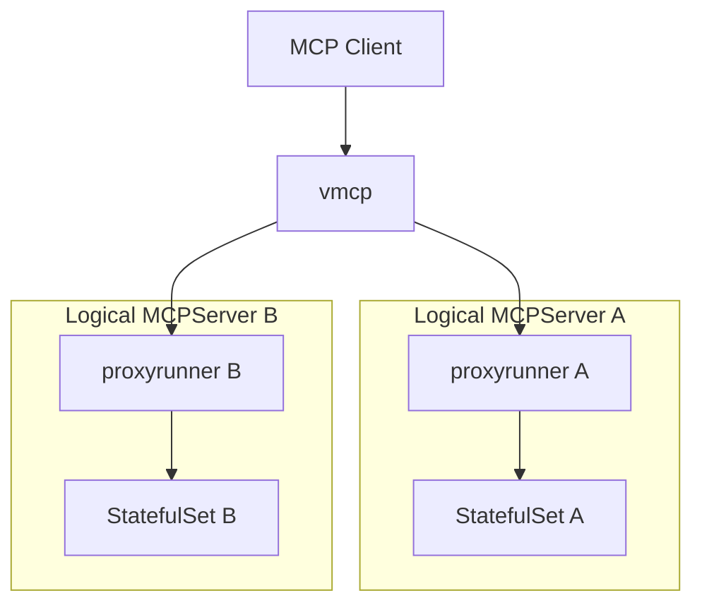
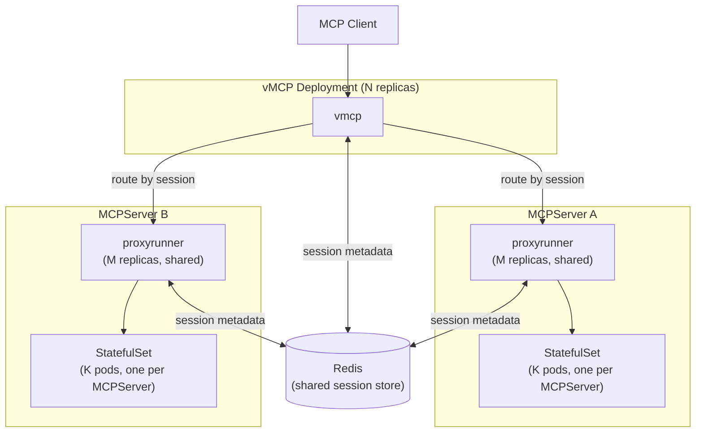

# THV-0051: Manual Horizontal Scaling for vMCP and Proxy Runner

- **Status**: Draft
- **Author(s)**: Jeremy Drouillard (@jerm-dro)
- **Created**: 2026-03-04
- **Last Updated**: 2026-03-07
- **Target Repository**: toolhive
- **Related Issues**:
  - [toolhive#3986](https://github.com/stacklok/toolhive/pull/3986) - Enable sticky sessions on operator-created Services
  - [toolhive#3992](https://github.com/stacklok/toolhive/pull/3992) - Add ClusterIP service with SessionAffinity for MCP server backend
  - [THV-0038](https://github.com/stacklok/toolhive-rfcs/blob/main/rfcs/THV-0038-session-scoped-client-lifecycle.md) - Session-Scoped Client Lifecycle for vMCP
  - [toolhive#1589](https://github.com/stacklok/toolhive/issues/1589) - Scaling stdio within k8s.

## Summary

ToolHive's `vmcp` and `thv-proxyrunner` components cannot currently be scaled horizontally because both hold session state in process-local memory. This RFC defines an approach to enable safe horizontal scale-out of these components by externalizing session state to a shared Redis store and implementing session-aware routing at each layer.

---

## 1. Background

### 1.1 Deployment Architecture

In Kubernetes mode, ToolHive deploys MCP servers using a two-tier model:



The **operator** (`thv-operator`) watches `MCPServer` and `VirtualMCPServer` CRDs and reconciles them into Kubernetes resources. For each `MCPServer`, the operator creates:
- A **Deployment** running `thv-proxyrunner` — which proxies traffic to the MCP server backend
- A **StatefulSet** running the actual MCP server image, created and managed by the proxyrunner via Kubernetes server-side apply
- A **Service** exposing the proxyrunner to clients (or to vMCP)

All replicas of a proxyrunner Deployment share a **single StatefulSet** — on startup, every replica independently applies the same StatefulSet spec using server-side apply with a shared field manager (`toolhive-container-manager`), converging on the same desired state without leader election.

**Replica configurability today**: Neither `MCPServer` nor `VirtualMCPServer` CRDs expose a `replicas` field. Both the proxyrunner Deployment and the vMCP Deployment are created with a hardcoded replica count of 1. The StatefulSet created by the proxyrunner is also hardcoded to 1 pod. See §2 for the constraints this creates.

The **Virtual MCP Server** (`vmcp`) sits above the proxyrunner tier. It presents a unified MCP endpoint to external clients, discovers backends from an `MCPGroup`, aggregates their capabilities, and routes inbound tool calls to the appropriate backend proxyrunner.

### 1.2 Session Management Infrastructure

#### Transport-Layer Sessions (proxyrunner)

The proxyrunner implements session tracking via `pkg/transport/session`. Each MCP session is represented as a `Session` object stored in a `Storage` backend. The `Storage` interface was designed from the outset to support pluggable backends:

```go
type Storage interface {
    Store(ctx context.Context, session Session) error
    Load(ctx context.Context, id string) (Session, error)
    Delete(ctx context.Context, id string) error
    DeleteExpired(ctx context.Context, before time.Time) error
    Close() error
}
```

Today, only `LocalStorage` (in-process memory map) is implemented. The `Storage` interface is the extension point this RFC targets.

#### vMCP Session-Scoped Architecture (THV-0038)

[THV-0038](https://github.com/stacklok/toolhive-rfcs/blob/main/rfcs/THV-0038-session-scoped-client-lifecycle.md) refactored vMCP's session management to introduce explicit session lifecycle: backend HTTP clients are created once at session initialization, reused for all requests within the session, and closed on expiry. The resulting `MultiSession` interface owns the routing table for that session (which tool belongs to which backend), as well as live backend connections.

The `session.go` documentation in the codebase is explicit about the distributed scaling trade-off:

> **Distributed deployment note**: Because MCP clients cannot be serialised, horizontal scaling requires sticky sessions (session affinity at the load balancer). Without sticky sessions, a request routed to a different vMCP instance must recreate backend clients (one-time cost per re-route). This is an accepted trade-off.
>
> A `MultiSession` uses a two-layer storage model:
> - **Runtime layer** (in-process only): backend HTTP connections, routing table, and capability lists. These cannot be serialized and are lost when the process exits. Sessions are therefore node-local.
> - **Metadata layer** (serializable): connected backend IDs, and backend session IDs are written to the embedded `transportsession.Session` so that pluggable `transportsession.Storage` backends (e.g. Redis) can persist them.

This two-layer design is the key insight for this RFC: we can persist enough metadata to route any request to the correct pod, even if we cannot migrate the full session runtime.

#### Auth Server Storage (THV-0035)

ToolHive already uses Redis as an external storage backend for the embedded auth server's session and token state (see `MCPExternalAuthConfig.storage.redis`). This establishes Redis as a proven dependency in the ToolHive Kubernetes ecosystem and provides a reference for how to configure and connect to Redis from operator-managed pods.

### 1.3 Client IP Affinity (Current Workaround)

Two recent PRs implement a short-term mitigation:

- **[#3986](https://github.com/stacklok/toolhive/pull/3986)** sets `SessionAffinity: ClientIP` on all operator-created Services (for `MCPServer`, `MCPRemoteProxy`, and `VirtualMCPServer`). This causes kube-proxy to consistently route traffic from the same client IP to the same pod.
- **[#3992](https://github.com/stacklok/toolhive/pull/3992)** adds a dedicated ClusterIP Service (with `SessionAffinity: ClientIP`) for the MCP server StatefulSet backend, so the proxyrunner's connections to the backend are also sticky.

Client IP affinity reduces — but does not eliminate — session breakage. It fails when:
- Multiple clients share an IP (NAT, corporate proxy, load balancer)
- A pod is replaced (rolling update, crash recovery) and kube-proxy routes to a new pod
- The operator scales out and the new pod becomes the affinity target for existing clients
- vMCP itself is deployed behind a load balancer that masks client IPs

This approach is a useful stopgap but is not a foundation for intentional horizontal scaling.

### 1.4 The Inherent Constraint of Stateful Backends

MCP servers that use `stdio` transport are inherently stateful: the MCP protocol conversation is a single long-lived stdin/stdout stream between the proxyrunner and the container. This state cannot be shared or transferred between proxyrunner instances — the stream lives or dies with the process.

**A `stdio` backend couples itself to a specific proxyrunner process**: the proxyrunner is the only process attached to the MCP server container's stdin/stdout, and that attachment is exclusive and non-transferable. This coupling is why proxyrunners cannot be made fully fungible (stateless, interchangeable replicas where any replica can handle any request) as long as `stdio` transport is supported. Removing or isolating `stdio` support would be a prerequisite for a fully fungible proxyrunner design; that is a larger architectural change out of scope for this RFC.

Even for `SSE` and `streamable-http` transports, where the backend MCP server speaks HTTP, individual backend connections carry session-specific negotiated state (e.g., the `Mcp-Session-Id` assigned by the backend server and known only to the proxyrunner that initialized the session).

This is a structural constraint of the MCP protocol, not a ToolHive implementation choice, and it shapes the solution described in this RFC.


---

## 2. Problems

The fundamental problem is that **all requests within an MCP session must be handled by the same process**, at every layer of the stack. Today, with single-replica deployments at each layer, this is automatic. With multiple replicas, it is not. In reality, the only hard constraint is that the underlying MCPServer backend receives all requests for its initialized sessions.

### 2.1 vMCP: Session-to-Pod Affinity

When `vmcp` runs with more than one replica, an inbound request carrying an `Mcp-Session-Id` may be routed by the Kubernetes Service to any vMCP pod. The pod that receives it may not have the session in its local `Storage`, which means:

1. It cannot look up the routing table (which tool → which proxyrunner)
2. It cannot reuse the backend HTTP clients associated with the session
3. It would have to re-initialize the session from scratch — a destructive operation that creates entirely new backend sessions, discards all in-progress state, and requires the client to restart its workflow.


This applies equally to SSE and streamable-http sessions.

### 2.2 Current Scaling Limitations

#### Multiple vMCP replicas

The `VirtualMCPServer` CRD has no `replicas` field. The operator creates the vMCP Deployment with a hardcoded replica count of 1 and there is no declarative way to change it. vMCP therefore runs as a single pod today, and the session affinity problem described in §2.1 is not yet encountered in practice — but it will be as soon as operators need to scale vMCP for availability or load.

#### Multiple proxyrunner replicas per MCPServer

The `MCPServer` CRD has no `replicas` field. The operator creates the proxyrunner Deployment with a hardcoded replica count of 1. The reconciler enforces this: attempting to scale the Deployment (e.g., via `kubectl scale`) is overwritten by the next reconcile cycle. There is therefore no supported path to run multiple proxyrunner replicas for a single `MCPServer` today, regardless of transport.

#### Multiple pods in the backend StatefulSet

The proxyrunner hardcodes the StatefulSet to 1 pod; there is no CRD field to configure it. A user can attach an HPA directly to the StatefulSet outside of the operator's control, and it will create multiple pods — but without session-aware routing, requests are distributed across pods that do not share session state, producing `400 Bad Request: No valid session ID provided` errors. This failure mode was directly observed: a user's HPA experiment on an MCP server StatefulSet caused replicas to scale to three pods, and the error rate spiked immediately. This triggered the client-IP affinity mitigations in §1.3 and motivates the long-term solution in this RFC.

The correct scaling unit for the backend is the proxyrunner+StatefulSet pair (§3.1), not the StatefulSet alone.


### 2.3 The Same Problem at Both Layers

SSE and streamable-http share the same class of horizontal scalability problem:

| Transport | Session Carrier | Affected Layers |
|-----------|----------------|-----------------|
| `stdio` | Process stdin/stdout (unshareable) | Proxyrunner (cannot scale) |
| `sse` | `Mcp-Session-Id` header / SSE connection | vMCP + proxyrunner |
| `streamable-http` | `Mcp-Session-Id` header | vMCP + proxyrunner |

For `stdio`, each proxyrunner holds an exclusive stdin/stdout attachment to a single MCP server container. While it is technically possible to run multiple proxyrunner replicas each attached to their own container, this does not help: `stdio` servers do not support concurrent sessions within a single process, so each container handles exactly one session at a time. Horizontal scaling is about increasing concurrency; `stdio` is fundamentally not designed for it. Scaling `stdio`-backed servers for higher session concurrency would require a different approach (e.g., a pool of single-session containers assigned per client), which is out of scope for this RFC.

For `SSE` and `streamable-http`, the session exists as a logical identifier (`Mcp-Session-Id`) that can be tracked in external storage. Routing by session ID is possible if the right metadata is externalized.

---

## 3. Scope

### 3.1 In Scope

- **CRD replica fields**: Add explicit replica configuration to both CRDs so users can declaratively set the desired scale without bypassing the operator:
  - `VirtualMCPServer.spec.replicas` — number of vMCP Deployment pods.
  - `MCPServer.spec.replicas` — number of proxyrunner Deployment pods (capped at 1 for `stdio` transport).
  - `MCPServer.spec.backendReplicas` — number of pods in the shared MCP server StatefulSet. There is exactly **one StatefulSet per `MCPServer`**, shared by all proxyrunner replicas (see §3.2).
- **Operator reconciler changes**: The operator must respect and preserve the new replica fields rather than hardcoding 1. The reconciler must stop overwriting manually-set replica counts.
- **Horizontal scale-out of `vmcp`**: Multiple vMCP replicas should be able to serve any request, regardless of which replica initialized the session. vMCP reads session routing metadata from shared storage to determine which sub-sessions to use for each underlying `MCPServer`.
- **Horizontal scale-out of `thv-proxyrunner`**: A single `MCPServer` is backed by multiple proxyrunner replicas sharing one StatefulSet. Session metadata in shared storage allows any replica to look up which backend pod a given session belongs to.
- **Transport coverage**: `SSE` and `streamable-http` transports at both layers.
- **Manual scale-out without session disruption**: Changing replica counts in either CRD must not disrupt existing sessions. New requests may be routed to new replicas; existing sessions continue to route via the pod that initialized them.
- **Safe vMCP scale-in**: When a vMCP replica is removed, sessions previously handled by it can be served by remaining replicas using session metadata from Redis. vMCP scale-in is safe because the session runtime can be reconstructed from persisted metadata. Another in-scope dimension of scale-in safety is allowing a grace period for inflight requests on finishing pods to be completed.
- **Proxyrunner scale-in (non-`stdio`)**: For `sse` and `streamable-http` transports, removing a proxyrunner replica is an in-scope operation. Sessions on the removed pod are re-hydrated on other pods when they receive a request. `stdio`-transport proxyrunner scale-in is out of scope (the stdin/stdout attachment cannot be transferred. Another in-scope dimension of scale-in safety is allowing a grace period for inflight requests on finishing pods to be completed.
- **Enabling future auto-scaling**: The session storage mechanism is the prerequisite for HPAs and KEDA-based auto-scaling. This RFC does not define auto-scaling policy, but the design must not preclude it.

### 3.2 Out of Scope

- **`stdio` transport scaling**: The proxyrunner's attachment to the MCP container's stdin/stdout is inherently single-process. Horizontal scaling of stdio-backed servers requires re-initializing the container session and is out of scope for this RFC.
- **Smart Routing at vMCP**: We've previously discussed having vMCP route requests to the same underlying proxyrunner that's previously serviced the session. While this may be useful long term to reduce Redis load and reduce latency, it's not strictly necessary in the short term. vMCP will continue to send requests through k8s Service associated with the proxyrunner.
- **One StatefulSet per MCPServer (shared)**: The design maintains exactly one StatefulSet per `MCPServer`. All proxyrunner replicas for a given `MCPServer` share that single StatefulSet, converging on the same spec via server-side apply. Each proxyrunner replica routes its sessions to specific pods within the shared StatefulSet. Note: a 1:1 ratio (one StatefulSet per proxyrunner replica) could be a future direction if enabling `stdio` horizontal scaling were desired, since each proxyrunner would then have its own dedicated backend.
- **Moving MCP server deployment out of the proxyrunner**: The proxyrunner remains responsible for creating, managing, and proxying to the MCP server StatefulSet. Changing this responsibility boundary (e.g., having vMCP manage backends directly) is desirable long-term but is more work and out of scope. Discussed in detail [here](https://github.com/stacklok/toolhive-rfcs/blob/main/rfcs/THV-0003-toolhive-kubernetes-architecture-improvement.md).
- **Auto-scaling policy**: How to trigger scale-out (HPA metrics, KEDA event sources, custom metrics) is deferred to a follow-on RFC. This RFC makes auto-scaling possible; it does not specify when or how to do it.
- **Backend StatefulSet scale-in**: Removing pods from the `MCPServer` StatefulSet (reducing `spec.backendReplicas`) is always disruptive — the backend session state lives in the removed process and cannot be reconstructed. Graceful drain of backend pods is out of scope for this RFC.
- **Session Hijack Prevention at MCPServer**: This capability will continue to work within vMCP, but it will not also be added to MCPServer.

### 3.3 Scaling Summary

| Component | CRD Field | Scale Out | Scale In |
|-----------|-----------|-----------|---------|
| **vMCP** (`VirtualMCPServer`) | `spec.replicas` | No disruption — new replicas serve new sessions; existing sessions rerouted via Redis | No disruption — remaining replicas pick up sessions from Redis metadata |
| **proxyrunner** (`MCPServer`, non-`stdio`) | `spec.replicas` | No disruption — new replicas share the existing StatefulSet and handle new sessions; existing sessions remain pinned to their originating replica | No disruption - Sessions on the removed pods can be restored on other pods. `stdio` scale-in not supported. |
| **backend** (`MCPServer` StatefulSet) | `spec.backendReplicas` | New pods available for new sessions; proxyrunner routes sessions to specific pods via Redis | **Disruptive** — backend session state on the removed pod is lost and cannot be reconstructed |

---

## 4. High-Level Solution

The solution externalizes session metadata to a shared Redis store at each layer, and introduces session-aware routing logic so that any replica can handle a request by locating the pod that owns the session.

### 4.1 Architecture Overview



### 4.2 What Gets Stored in Redis

Two categories of session metadata are externalized. Neither contains sensitive data; both contain only identifiers and pod addressing information needed for routing.

#### vMCP Session Record

Written by the vMCP pod when a session is initialized (on `initialize` request). Used by any vMCP replica to enable session reuse across vMCPs. 

A vMCP session spans multiple backends (one per `MCPServer` in the `MCPGroup`). The record therefore carries a `backends` array — one entry per backend connection — alongside top-level identity metadata.

```
Key:   vmcp:session:{mcp-session-id}
TTL:   Configurable (default: matches vMCP session TTL)
Value: {
  "session_id":   "...",            // Mcp-Session-Id assigned to client
  // additional fields for session hijack prevention are not pictured.
  "created_at":   "...",
  "updated_at":   "...",
  "backends": [
    {
      "backend_id":         "...",  // MCPServer workload ID
      "backend_session_id": "..."  // Mcp-Session-Id assigned by the backend server
    }
  ]
}
```

#### proxyrunner Session Record

Written by the proxyrunner pod when it initializes a backend session. Serves one purposes: maps a session ID to the backend pod that owns it, enabling routing on a cache miss; 
```
Key:   proxyrunner:{mcpserver-name}:session:{session-id}
TTL:   Configurable (default: matches proxyrunner session TTL)
Value: {
  "session_id":   "...",            // session ID (Mcp-Session-Id)
  "backend_pod":  "...",            // which StatefulSet pod hosts this session
  "backend_url":  "http://...",     // pod-DNS URL of the backend pod
  "created_at":   "...",
  "updated_at":   "..."
}
```

### 4.3 Request Routing at Each Layer

#### vMCP Routing

A vMCP session spans multiple backends; each backend has its own underlying connection and `backend_session_id`. When vMCP receives a request, it first identifies the target backend from the routing table (which tool/resource/prompt → which `MCPServer`), then sends the request with `Mcp-Session-Id=$backend_session_id` to the k8s service for the `MCPServer`.

1. **No `Mcp-Session-Id`** (new session / `initialize`): Initialize connections to all backends in the `MCPGroup`. Record the session in Redis with a `backends` array containing each backend's proxyrunner pod URL and assigned `backend_session_id`. Proceed normally.
2. **Known `Mcp-Session-Id`** (session in local storage): Reuse the initialized clients with sub-session IDs already bound.
3. **Unknown `Mcp-Session-Id`** (not in local storage, found in Redis): Reconstruct the session runtime from the `backends` array in Redis. Then route as in case 2. This is a one-time cost on first contact after re-route.
4. **Unknown `Mcp-Session-Id`** (not in Redis): Return `400 Bad Request` — client must re-initialize.

Cases 3 handles the "request hits wrong vMCP pod" scenario without re-initializing the session from the client's perspective.

#### proxyrunner Routing

The proxyrunner's sole routing concern is: given a session ID, which backend pod handles it? vMCP is responsible for ensuring each request has a valid session id. With shared storage:

1. **Known session** (exists in local storage): Route to the backend pod (existing behavior).
2. **Unknown session** (not in local storage): Look up in Redis.
   - Found: Route to the `backend_url` from the Redis record.
   - Not found: Return `400 Bad Request`.

### 4.4 Redis Configuration

Redis is an opt-in external dependency. When not configured, both vMCP and proxyrunner fall back to local in-memory storage (current behavior), with single-replica semantics.

Configuration is consistent with the existing pattern from THV-0035 (auth server Redis storage):

**For vMCP** (`VirtualMCPServer` CRD):

```yaml
apiVersion: toolhive.stacklok.dev/v1alpha1
kind: VirtualMCPServer
spec:
  replicas: 3                    # new field: vMCP Deployment pod count
  sessionStorage:
    provider: redis
    redis:
      address: "redis:6379"
      db: 0
      keyPrefix: "vmcp:session:"
      passwordRef:
        name: redis-auth
        key: password
```

**For proxyrunner** (`MCPServer` CRD):

```yaml
apiVersion: toolhive.stacklok.dev/v1alpha1
kind: MCPServer
spec:
  replicas: 3                    # new field: proxyrunner Deployment pod count (capped at 1 for stdio)
  backendReplicas: 2             # new field: StatefulSet pod count (one StatefulSet per MCPServer)
  sessionStorage:
    provider: redis
    redis:
      address: "redis:6379"
      db: 0
      keyPrefix: "proxyrunner:"
      passwordRef:
        name: redis-auth
        key: password
```

When `provider` is omitted or set to `memory`, existing local-storage behavior is preserved.


---

## 5. Requirements

The following requirements define the success criteria for this RFC.

### 5.1 vMCP Requirements

- **R-VMCP-1**: Any incoming MCP request can be handled by any vMCP pod. vMCP reads session metadata from the shared session store to locate the correct sub-session ID and uses that in the request to the downstream proxyrunner.
- **R-VMCP-2**: vMCP writes session metadata to the shared session store when a new session is initialized. The record includes the `backends` array with each backend's workload ID and backend-assigned session ID.
- **R-VMCP-3**: vMCP session metadata TTL in Redis must match or exceed the vMCP session TTL. Redis entries are refreshed on session activity.
- **R-VMCP-4**: When Redis is not configured, vMCP operates with local in-memory storage and single-replica semantics (no behavioral regression).
- **R-VMCP-5**: Adding vMCP replicas must not disrupt existing sessions.
- **R-VMCP-6**: vMCP sends requests to the k8s service for the MCPServer. Assuming SSE or Streamable HTTP, the session should remain usable regardless which proxyrunner receives the request.
- **R-VMCP-7**: vMCP has a limit on the number of in-memory sessions. Once hit, LRU caching removes the least active session from the in-memory state.

### 5.2 proxyrunner Requirements

- **R-PR-1**: The proxyrunner routes all requests within a session to the backend pod that initialized the session.
- **R-PR-2**: The proxyrunner writes session metadata (session ID, backend pod name, backend pod URL) to the shared session store when a new backend session is initialized.
- **R-PR-3**: The proxyrunner reads session metadata from the shared session store on a cache miss (session not in local memory) and routes accordingly.
- **R-PR-4**: The number of backend StatefulSet replicas (MCPServer pods) per proxyrunner is configurable in the `MCPServer` CRD spec. The proxyrunner uses session-aware routing to distribute sessions across its backends.
- **R-PR-5**: Multiple proxyrunner replicas serve a single `MCPServer`. vMCP is responsible for routing each session's requests to the correct proxyrunner replica.
- **R-PR-6**: When Redis is not configured, the proxyrunner operates with local in-memory storage and single-replica semantics (no behavioral regression).
- **R-PR-7**: proxyrunner has a limit on the number of in-memory sessions. Once hit, LRU caching removes the least active session from the in-memory state.

### 5.3 Operator Requirements

- **R-OP-1**: When session storage is configured on a `VirtualMCPServer` or `MCPServer`, the operator injects the Redis connection configuration into the vMCP or proxyrunner pods (credentials from Secrets, address/db from CRD spec).
- **R-OP-2**: Scaling out a `VirtualMCPServer` or proxyrunner `Deployment` replica count must not require changes to other resources (no cascading operator reconciliation for scale events).
- **R-OP-3**: The operator adds explicit replica fields to both CRDs: `VirtualMCPServer.spec.replicas` (vMCP pod count), `MCPServer.spec.replicas` (proxyrunner pod count, capped at 1 for `stdio` transport), and `MCPServer.spec.backendReplicas` (StatefulSet pod count). The reconciler must respect these fields and must not overwrite them. There is exactly one StatefulSet per `MCPServer`; `spec.backendReplicas` controls the pod count within that StatefulSet.
- **R-OP-4**: if a user decides not to specify any replicas in the CRDs, whatever they set it to manually using kubectl scale --replicas=3 rs/foo or even if they use something like HPA, the Operator should not overwrite that field as we are not explicitly telling it to reconcile it.


### 5.4 Deployment Requirements

- **R-DEP-1**: A single Redis instance (or Redis Sentinel / Cluster configuration) can be shared between vMCP session storage and proxyrunner session storage, as long as key prefixes are distinct.
- **R-DEP-2**: Redis is an optional dependency. ToolHive must remain deployable without Redis, with single-replica semantics.
- **R-DEP-3**: Manual scale-out of vMCP or proxyrunner (e.g., `kubectl scale deployment`) must not cause session disruption for active sessions.
- **R-DEP-4**: Scale-in of backend StatefulSet pods (`spec.backendReplicas` decrease) is inherently disruptive — the backend session state lives in the removed process and cannot be reconstructed on another pod. Documentation must clearly state this. Graceful drain of backend pods is out of scope for this RFC. Proxyrunner scale-in (non-`stdio`) is an accepted, in-scope operation where no session loss is the expected outcome.
- **R-DEP-5**: scaling in either the vMCP or the proxyrunner should not cause requests to fail. There should be a graceful shutdown of the finishing pods so inflight requests can be completed.
- **R-DEP-6**: Redis must eventually garbage collect unused sessions. A long TTL that is refreshed when sessions are used is a viable solution here.

### 5.5 Security Requirements

- **R-SEC-1**: vMCP's session hijack prevention mechanism continues to function. A session initialized on one vMCP pod cannot be hijacked by a request hitting another vMCP pod.

---

## 6. Required Changes

This section catalogs the concrete code changes needed to implement the design described above, organized by component and mapped back to the requirements in §5.

### 6.1 CRD and Operator Changes

#### RC-1: Add replica and session storage fields to `MCPServer` CRD

**File**: `cmd/thv-operator/api/v1alpha1/mcpserver_types.go`

Add three new fields to `MCPServerSpec`:

- `Replicas *int32` — proxyrunner Deployment pod count. When nil, the operator omits `spec.replicas` from the Deployment, allowing external scaling (kubectl scale, HPA) to set the value freely. The reconciler caps this at 1 for `stdio` transport.
- `BackendReplicas *int32` — StatefulSet pod count for the MCP server backend. When nil, omitted from the StatefulSet spec (same defer-to-external behavior). Passed to the proxyrunner via RunConfig so it can apply the value during server-side apply.
- `SessionStorage *SessionStorageConfig` — optional Redis connection configuration for externalizing session state. Uses a new shared type (`SessionStorageConfig`) with `provider` (memory|redis) and a `redis` sub-struct containing `address`, `db`, `keyPrefix`, and `passwordRef` (SecretKeyRef).

**Current state**: No replica or session storage fields exist. Replicas are hardcoded to 1 in `deploymentForMCPServer()`. The `ReadyReplicas` status field already exists.

**Satisfies**: R-OP-3, R-PR-6, R-DEP-2

#### RC-2: Add replica and session storage fields to `VirtualMCPServer` CRD

**File**: `cmd/thv-operator/api/v1alpha1/virtualmcpserver_types.go`

Add two new fields to `VirtualMCPServerSpec`:

- `Replicas *int32` — vMCP Deployment pod count. When nil, the operator omits `spec.replicas` from the Deployment, allowing external scaling to set the value freely.
- `SessionStorage *SessionStorageConfig` — same shared type as in RC-1. Optional Redis connection configuration for externalizing vMCP session state.

**Current state**: No replica or session storage fields exist. Replicas are hardcoded to 1 in `deploymentForVirtualMCPServer()`.

**Satisfies**: R-OP-3, R-VMCP-4, R-DEP-2

#### RC-3: Update `MCPServer` reconciler to respect replica fields

**File**: `cmd/thv-operator/controllers/mcpserver_controller.go`

Two changes in `deploymentForMCPServer()` and the reconcile loop:

- **Deployment creation**: When `spec.replicas` is non-nil, use that value for `Spec.Replicas` instead of hardcoded `int32(1)`. When nil, omit `Spec.Replicas` from the Deployment spec entirely (Kubernetes defaults to 1, but external tooling like HPA can set it freely without being overwritten).
- **Stdio cap enforcement**: The existing logic (~line 392) that caps `stdio` Deployments to 1 replica remains. If `spec.replicas > 1` and `spec.transport == "stdio"`, the reconciler should reject or cap it with a status condition explaining why.
- **BackendReplicas passthrough**: Add `spec.backendReplicas` to the proxyrunner's RunConfig (serialized into the ConfigMap). The proxyrunner reads this value and uses it in its server-side apply of the StatefulSet instead of hardcoded 1.
- **Session storage validation**: If `spec.replicas > 1` and `spec.sessionStorage` is not configured (or set to `memory`), the reconciler should reject the configuration with a status condition warning that multi-replica deployments require external session storage to avoid silent session failures.

**Current state**: `deploymentForMCPServer()` hardcodes `replicas := int32(1)`. The update path already preserves `Spec.Replicas` (does not overwrite on reconcile). Stdio cap enforcement already exists. RunConfig has no `backendReplicas` field.

**Satisfies**: R-OP-3, R-OP-4, R-DEP-3

#### RC-4: Update `VirtualMCPServer` reconciler to respect replica field

**File**: `cmd/thv-operator/controllers/virtualmcpserver_deployment.go`

- **Deployment creation**: When `spec.replicas` is non-nil, use that value for `Spec.Replicas` instead of hardcoded `int32(1)`. When nil, omit `Spec.Replicas` entirely.
- The update path already preserves `Spec.Replicas` (does not overwrite on reconcile) — no change needed there.
- **Session storage validation**: If `spec.replicas > 1` and `spec.sessionStorage` is not configured (or set to `memory`), the reconciler should reject the configuration with a status condition warning that multi-replica deployments require external session storage to avoid silent session failures.

**Current state**: `deploymentForVirtualMCPServer()` hardcodes `replicas := int32(1)`.

**Satisfies**: R-OP-3, R-OP-4, R-VMCP-5

#### RC-5: Inject Redis configuration into proxyrunner and vMCP pods

**Files**: `cmd/thv-operator/controllers/mcpserver_controller.go`, `cmd/thv-operator/controllers/virtualmcpserver_deployment.go`

When `spec.sessionStorage` is configured with `provider: redis`, the operator must inject the Redis connection details into the pod:

- **Address, DB, keyPrefix**: Added to the RunConfig (proxyrunner) or vmcp config ConfigMap (vMCP) so they are available at startup.
- **Password**: Injected as an environment variable sourced from the `passwordRef` SecretKeyRef (e.g., `THV_SESSION_REDIS_PASSWORD`). This follows the established pattern used for OIDC client secrets and token exchange secrets.

When `sessionStorage` is not set or `provider` is `memory`, no Redis-related config is injected.

**Current state**: No session storage config injection exists. The env-var-from-SecretKeyRef pattern is already used for OIDC and auth server credentials. A comment in `buildEnvVarsForVmcp` explicitly notes this extension point: _"Other secrets (Redis passwords, service account credentials) may be added here in the future."_

**Satisfies**: R-OP-1, R-DEP-1, R-DEP-2

### 6.2 Transport Session Layer Changes

#### RC-6: Implement Redis `Storage` backend for `pkg/transport/session`

**File**: New file `pkg/transport/session/storage_redis.go`

Implement the `Storage` interface backed by Redis:

- `Store`: Serialize the session to JSON (using the existing `serializeSession` function already prepared in `serialization.go`) and write to Redis with the configured key prefix and TTL. Each `Store` call sets (or resets) the key's TTL, so actively-used sessions are kept alive.
- `Load`: Read from Redis, deserialize via `deserializeSession`, and return the `Session`. Returns `ErrSessionNotFound` when the key does not exist.
- `Delete`: Remove the key from Redis.
- `DeleteExpired`: No-op — Redis TTLs handle expiry natively.
- `Close`: Close the Redis client connection.

The constructor accepts the Redis connection config (address, password, DB, key prefix) and returns a `Storage` interface. The serialization layer persists only the metadata fields (ID, type, timestamps, metadata map) — not runtime state like live HTTP connections or message channels. This is consistent with the two-layer model described in the RFC: the metadata layer is serializable; the runtime layer is node-local.

**TTL refresh for garbage collection**: Today, `session.Manager.Get()` calls `Touch()` on the session, which updates `UpdatedAt`. After touching, the manager must call `Storage.Store()` to persist the updated timestamp back to Redis — this resets the key's TTL. Sessions that are never accessed will naturally expire via Redis TTL, providing garbage collection without an explicit cleanup loop. The TTL value should match the session TTL configured on the manager.

**Current state**: Only `LocalStorage` (in-process `sync.Map`) exists. `serialization.go` contains `serializeSession`/`deserializeSession` functions marked as unused, explicitly tagged for Phase 4 Redis/Valkey support.

**Satisfies**: R-PR-2, R-PR-3, R-PR-6, R-VMCP-2, R-VMCP-4, R-DEP-6

#### RC-7: Wire storage backend selection into `session.Manager`

**File**: `pkg/transport/session/manager.go`

Add a constructor or factory function that selects the `Storage` backend based on configuration:

- When Redis config is provided: create `RedisStorage` (from RC-6) and pass it to `NewManagerWithStorage`.
- When no Redis config is provided: use `NewLocalStorage()` (existing default behavior via `NewManager`).

`NewManagerWithStorage(ttl, factory, storage)` already exists as the extension point — this change wires it into the startup path for both vMCP and proxyrunner based on the injected session storage configuration.

**Current state**: `NewManager(ttl, factory)` always creates `NewLocalStorage()`. `NewManagerWithStorage` exists but is never called in production code.

**Satisfies**: R-PR-6, R-VMCP-4, R-DEP-2

### 6.3 vMCP Changes

#### RC-8: Persist vMCP session metadata to Redis on session creation

**File**: `pkg/vmcp/session/factory.go`

In `defaultMultiSessionFactory.makeSession()`, after backend initialization and routing table construction, the factory already writes metadata keys (`MetadataKeyBackendIDs`, `MetadataKeyTokenHash`, `MetadataKeyTokenSalt`) to the embedded `transportsession.Session`. This metadata is what gets persisted when the `session.Manager` calls `Storage.Store()`.

The change: ensure the `backends` array described in §4.2 is fully represented in the session metadata. Specifically, each backend's `workload_id` and `backend_session_id` must be written as serializable metadata so that Redis contains enough information for another vMCP pod to reconstruct the session routing (RC-9).

Today, `MetadataKeyBackendIDs` stores connected backend IDs, and `backendSessions` (workload ID → backend session ID) is held in the `defaultMultiSession` struct but is not written to the metadata map. The `backend_session_id` values must be added to the metadata layer.

**Current state**: `backendSessions map[string]string` is a field on `defaultMultiSession` but is not persisted to the metadata map. Only `MetadataKeyBackendIDs` (a comma-separated list of connected workload IDs) is written.

**Satisfies**: R-VMCP-2, R-VMCP-3

#### RC-9: Reconstruct vMCP sessions from Redis on cache miss

**Files**: `pkg/vmcp/server/sessionmanager/session_manager.go`, `pkg/vmcp/session/factory.go`

When a vMCP pod receives a request with an `Mcp-Session-Id` that is not in its local `session.Manager`, it must attempt to load the session from Redis and reconstruct the runtime layer. This is case 3 from §4.3 (vMCP routing).

Add a `RestoreSession` method to the `MultiSessionFactory` interface (implemented on `defaultMultiSessionFactory`). Unlike `MakeSession` which performs full initialization (sends `initialize` to all backends), `RestoreSession` accepts the persisted session metadata and reconstructs the runtime layer:

1. `session.Manager.Get(id)` returns not-found from local storage.
2. Load the session record from Redis via the `Storage` interface. The record contains the `backends` array (workload IDs and backend session IDs) plus hijack-prevention metadata (token hash, token salt).
3. Call `factory.RestoreSession(ctx, sessionID, metadata)` which:
   - Re-creates backend HTTP connections by calling the `backendConnector` for each backend in the array, passing the existing `backend_session_id` so the proxyrunner knows this is a resumed session (not a new `initialize`).
   - Rebuilds the routing table from the newly-fetched backend capabilities.
   - Re-applies the `HijackPreventionDecorator` using the persisted token hash/salt.
4. Store the reconstructed `MultiSession` in the local `session.Manager` for subsequent requests.

This is a one-time cost per session per pod — after reconstruction, subsequent requests use the local in-memory session.

**Current state**: `session.Manager.Get()` only checks local storage. There is no fallback to Redis or any reconstruction logic. The factory's `MakeSession` always performs full initialization (sends `initialize` to all backends). No `RestoreSession` method exists.

**Satisfies**: R-VMCP-1, R-VMCP-5, R-VMCP-6

#### RC-10: Add LRU eviction to vMCP in-memory session cache

**File**: `pkg/vmcp/server/sessionmanager/session_manager.go`

Add a configurable upper bound on the number of `MultiSession` objects held in local memory. When the limit is reached, the least-recently-used session is evicted from the local `session.Manager` (its backend connections are closed). The session metadata remains in Redis, so a future request for the evicted session triggers reconstruction via `factory.RestoreSession` (RC-9).

This prevents unbounded memory growth when a vMCP pod handles many sessions over time — especially important when sessions are reconstructed from Redis after scale-in events route traffic from removed pods.

**Current state**: No eviction policy exists. All sessions remain in memory until TTL expiry.

**Satisfies**: R-VMCP-7

#### RC-16: Update Redis metadata when backend sessions expire within a vMCP session

**Files**: `pkg/vmcp/session/default_session.go`, `pkg/vmcp/server/sessionmanager/session_manager.go`

When an individual backend session within a `MultiSession` expires or is lost (e.g., the proxyrunner returns an error indicating the backend session is no longer valid, or the backend connection is closed), the vMCP must update the session's `backends` array in Redis to reflect the change. Without this, another vMCP pod reconstructing the session via `factory.RestoreSession` (RC-9) would attempt to reconnect to a backend session that no longer exists, causing unnecessary errors and latency.

This means backend removal/expiry must trigger a write-back of the updated metadata to the `session.Manager` (which persists to Redis via `Storage.Store()`). The `backendSessions` map and `MetadataKeyBackendIDs` must both be updated atomically with the local state change.

**Current state**: Backend session failures are handled locally (the connection is removed or the call returns an error), but no metadata is updated. Since sessions are only held in-memory today, there is no external state to synchronize.

**Satisfies**: R-VMCP-1, R-VMCP-2

### 6.4 Proxyrunner Changes

#### RC-11: Make StatefulSet replica count configurable in proxyrunner

**File**: `pkg/container/kubernetes/client.go`

In `DeployWorkload()`, the StatefulSet is created via server-side apply with `WithReplicas(1)` hardcoded. Change this to read the `backendReplicas` value from the RunConfig (passed through from the CRD via RC-3). When the value is nil/absent, omit `WithReplicas` from the apply configuration so that the proxyrunner does not own the `replicas` field — allowing external tooling (HPA, kubectl scale) to manage it without being overwritten on the next server-side apply cycle.

All proxyrunner replicas for a given `MCPServer` share the same StatefulSet and use the same field manager (`toolhive-container-manager`), so they converge on the same desired replica count without conflict.

**Current state**: `WithReplicas(1)` is hardcoded. The proxyrunner has no mechanism to receive a desired backend replica count.

**Satisfies**: R-OP-3 (backend replicas), R-PR-4

#### RC-12: Add session-aware routing to backend pods in proxyrunner

**Files**: `pkg/transport/proxy/streamable/streamable_proxy.go`, `pkg/transport/proxy/httpsse/http_proxy.go`, `pkg/transport/proxy/transparent/transparent_proxy.go`

Today, each proxy type forwards all requests to a single `targetURI` (the headless service DNS name). With multiple StatefulSet pods, the proxy must route to the specific pod that owns the session.

Changes:

- **On session initialization** (`initialize` request or first SSE connection): The proxyrunner selects a backend pod (e.g., round-robin or least-connections across StatefulSet pods) and records the mapping `session_id → backend_pod + backend_url` in Redis (per the record format in §4.2). The `backend_url` uses the StatefulSet pod's stable DNS name (e.g., `http://<name>-<ordinal>.<headless-svc>.<ns>.svc.cluster.local:<port>`).
- **On subsequent requests**: Look up the session in local memory first. On cache miss, query Redis for the `backend_url`. Route the request to that specific pod URL instead of the headless service.
- **On session not found** (neither local nor Redis): Return `400 Bad Request`.

This requires the proxy layer to support per-request target URL override rather than always using the fixed `targetURI`. The transparent proxy (`httputil.ReverseProxy`) can achieve this by setting the `Director` function to rewrite the target per-request based on session lookup. The SSE and streamable proxies need analogous routing logic.

**Current state**: All three proxy types route to a single `targetURI` set at startup. No per-session routing exists. Session IDs are tracked only for client correlation (SSE) or request/response matching (streamable), not for backend pod selection.

**Satisfies**: R-PR-1, R-PR-2, R-PR-3, R-PR-4

#### RC-13: Add LRU eviction to proxyrunner in-memory session cache

**Files**: `pkg/transport/proxy/streamable/streamable_proxy.go`, `pkg/transport/proxy/httpsse/http_proxy.go`

Same pattern as RC-10 but for the proxyrunner layer. Add a configurable upper bound on in-memory sessions. When the limit is reached, the least-recently-used session is evicted from local memory. The session metadata remains in Redis, so a subsequent request for the evicted session triggers a Redis lookup (RC-12) and routes to the correct backend pod.

**Current state**: No eviction policy exists. All sessions remain in memory until TTL expiry.

**Satisfies**: R-PR-7

### 6.5 Operational Changes

#### RC-14: Graceful shutdown for vMCP and proxyrunner pods

**Files**: `pkg/vmcp/server/server.go`, `cmd/thv-proxyrunner/main.go` (or equivalent entrypoint), operator Deployment specs

When a pod is terminated (scale-in, rolling update), in-flight requests must be allowed to complete rather than being dropped. Two changes:

- **SIGTERM handling**: Both vMCP and proxyrunner must handle SIGTERM by stopping acceptance of new requests and draining in-flight requests before exiting. For vMCP, the `AdmissionQueue` already provides `CloseAndDrain()` which blocks until in-flight operations complete — this mechanism needs to be wired into the shutdown signal handler for each active session. For the proxyrunner, a similar drain of active proxy connections is needed.
- **`terminationGracePeriodSeconds`**: The operator should set an appropriate value on the pod spec for both vMCP and proxyrunner Deployments (default Kubernetes value is 30s, which may need to be increased for long-running MCP tool calls).

**Current state**: No explicit graceful shutdown handling for scale-in scenarios. The `AdmissionQueue.CloseAndDrain()` exists on `defaultMultiSession` but is only called during explicit session `Close()`, not during pod-level shutdown.

**Satisfies**: R-DEP-5

### 6.6 Security Changes

#### RC-15: Persist hijack-prevention state for cross-pod session validation

**File**: `pkg/vmcp/session/factory.go`, `pkg/vmcp/session/hijack_prevention_decorator.go`

The `HijackPreventionDecorator` binds a session to a token via HMAC-SHA256(secret, salt || token). The `boundTokenHash` and `tokenSalt` are already written to the session metadata map (`MetadataKeyTokenHash`, `MetadataKeyTokenSalt`), so they are persisted to Redis via RC-6/RC-8.

When `factory.RestoreSession` (RC-9) reconstructs a session on a different vMCP pod, it must:

- Read `tokenHash` and `tokenSalt` from the persisted metadata.
- Re-apply the `HijackPreventionDecorator` with those values so that the same token-binding validation runs on the new pod.
- The HMAC secret must be consistent across all vMCP replicas. Today, the secret is passed to the factory via `WithHMACSecret`. All replicas of the same `VirtualMCPServer` Deployment share the same pod spec and therefore the same secret — no additional change is needed for secret distribution.

**Current state**: Token hash and salt are already persisted in session metadata. The decorator is applied at session creation but there is no path to re-apply it during session reconstruction. The HMAC secret is already consistent across replicas (same Deployment spec).

**Satisfies**: R-SEC-1
