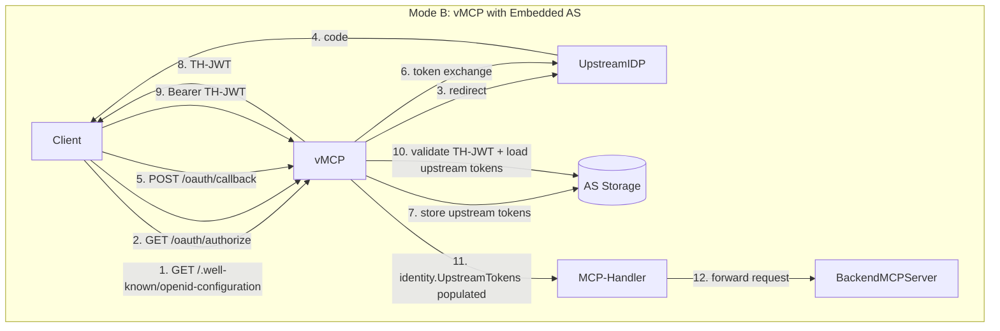

# RFC-0053: Embedded Auth Server in vMCP

- **Status**: Draft
- **Author(s)**: tgrunnagle
- **Created**: 2026-03-10
- **Last Updated**: 2026-03-10
- **Target Repository**: toolhive
- **Related Issues**: https://github.com/stacklok/stacklok-epics/issues/251
- **Depends On**: RFC-0052 (multi-upstream IDP support)

## Summary

vMCP currently delegates authentication entirely to external OIDC providers — the operator configures an external issuer URL in `IncomingAuth.OIDCConfig`, and clients must already hold a valid token from that issuer. This RFC proposes adding an optional embedded OAuth authorization server to vMCP. When enabled, the AS acts as the OIDC issuer for incoming clients: it drives users through one or more upstream IDPs, accumulates their tokens, and issues a ToolHive JWT. The OIDC middleware then validates that TH-JWT via self-referencing OIDC discovery and eagerly loads the upstream tokens into `identity.UpstreamTokens`, where outgoing auth strategies can use them. Existing behavior for an external OIDC issuer is unchanged.

## Problem Statement

### No Unified Auth Flow

vMCP today requires clients to obtain upstream IDP tokens externally before connecting. There is no mechanism for vMCP to orchestrate the auth flow itself: redirect clients through IDPs, collect their tokens, and issue a session-scoped TH-JWT. Clients that need tokens from multiple IDPs (e.g., GitHub and a corporate OIDC provider) must acquire them through separate, out-of-band flows.

### Upstream Tokens Are Inaccessible to Outgoing Auth

Even if upstream tokens were somehow obtained, vMCP has no unified, per-request mechanism to make them available to the outgoing auth layer. The `upstream_inject` strategy (which would inject an upstream provider token into backend requests as a Bearer token) has no source to draw from. The identity struct carries only the incoming JWT; the upstream tokens that back it are unreachable.

### Who Is Affected

- Platform operators who want vMCP to manage the auth flow for their clients, rather than relying on clients to acquire upstream tokens externally.
- Developers building vMCP backends that require access tokens from upstream providers (e.g., GitHub tools, corporate STS).

## Goals

- Enable an embedded AS inside vMCP that acts as the OIDC issuer for incoming clients.
- Allow the AS to be configured with one or more upstream IDPs (depends on RFC-0052 for multi-upstream support).
- Wire the embedded AS's OAuth/OIDC endpoints at the same origin as the vMCP server so OIDC discovery works as a loopback.
- Extend the incoming OIDC auth middleware to eagerly load upstream tokens from the AS's storage into `identity.UpstreamTokens` when validating TH-JWTs (depends on RFC-0052).
- Add Kubernetes CRD support via `VirtualMCPServerSpec.AuthServerConfig *ExternalAuthConfigRef` referencing an `MCPExternalAuthConfig` of type `embeddedAuthServer`.
- Add corresponding `Config.AuthServer *AuthServerConfig` in `pkg/vmcp/config/config.go` for the YAML/CLI path.
- Enforce cross-cutting validation rules so misconfigured `issuer`, `audience`, and `upstream_inject` provider references fail fast at startup and at operator reconciliation.
- Maintain byte-for-byte backward compatibility.

## Non-Goals

- **Outgoing auth upstream token injection** (`upstream_inject` strategy): Using the upstream tokens loaded into `identity.UpstreamTokens` to authenticate outgoing backend requests is deferred to a follow-up RFC. This RFC wires the plumbing; the strategy consuming it comes later.
- **Hot-reload of AS configuration**: AS config changes require a pod restart. Rolling updates are the Kubernetes mechanism for this.
- **Multi-upstream IDP support**: Multi-provider accumulation is defined by RFC-0052. This RFC depends on RFC-0052 and does not re-specify that behavior.
- **CLI-path upstream token swap**: The `pkg/auth/upstreamswap` middleware (used by the proxy runner) is unaffected by this RFC.
- **Step-up auth signaling**: Deferred to a separate RFC.

## Proposed Solution

### High-Level Design

vMCP operates in two modes:

| Component | Mode A (no AS) | Mode B (with AS) |
|-----------|----------------|------------------|
| `Config.AuthServer` | `nil` | `*AuthServerConfig` with embedded AS config |
| Strategy registry | `unauthenticated`, `header_injection`, `token_exchange` | Same 3 (upstream_inject deferred) |
| `identity.Token` value | External IDP JWT | TH-JWT (AS-issued) |
| `identity.UpstreamTokens` | `nil` | `map[string]*UpstreamTokens` keyed by provider name (loaded by auth middleware) |
| `identity.Claims["tsid"]` | Absent | Present (session ID linking to upstream token storage) |
| AS HTTP routes | Not mounted | `/oauth/*`, `/.well-known/{openid-configuration,oauth-authorization-server,jwks.json}` |
| OIDC discovery | External IDP | Self-referencing loopback to embedded AS |

**Invariant**: Mode A behavior is byte-for-byte identical to today. The `AuthServer` field is optional with `omitempty`. When nil, no AS code paths execute.



### Detailed Design

#### Config Model Changes (`pkg/vmcp/config/config.go`)

```go
type Config struct {
    // ... existing fields unchanged ...

    // AuthServer configures the embedded OAuth authorization server.
    // When nil, vMCP operates without an auth server (Mode A).
    // When present, enables upstream token management (Mode B).
    // +optional
    AuthServer *AuthServerConfig `json:"authServer,omitempty" yaml:"authServer,omitempty"`
}

// AuthServerConfig wraps the auth server's RunConfig for vMCP.
// +kubebuilder:object:generate=true
type AuthServerConfig struct {
    // RunConfig is the embedded auth server configuration.
    RunConfig *authserver.RunConfig `json:"runConfig" yaml:"runConfig"`
}
```

`AuthServerConfig` and `IncomingAuthConfig` are intentionally independent config sections. The semantic link — that when the AS is the incoming auth provider its issuer must match `IncomingAuth.OIDC.Issuer` — is enforced by validation rules V-04 and V-07 (see Validation Rules section), not by config nesting. This keeps the separation of concerns clear: the AS is an independent server component used by both auth boundaries.

#### CRD Changes (`cmd/thv-operator/api/v1alpha1/`)

**Move `ExternalAuthConfigRef`**: The `ExternalAuthConfigRef` struct is currently defined in `mcpserver_types.go`. It should be moved to `mcpexternalauthconfig_types.go`, where it is semantically co-located with `MCPExternalAuthConfig`, the resource it references. All existing uses in `mcpserver_types.go` continue to work via the same package.

**New field on `VirtualMCPServerSpec`**:

```go
// VirtualMCPServerSpec defines the desired state of VirtualMCPServer
type VirtualMCPServerSpec struct {
    // ... existing fields unchanged ...

    // AuthServerConfig references an MCPExternalAuthConfig resource that configures
    // the embedded OAuth authorization server for this VirtualMCPServer.
    // The referenced MCPExternalAuthConfig must be of type "embeddedAuthServer" and
    // must exist in the same namespace.
    // When set, vMCP operates in Mode B: the embedded AS acts as the OIDC issuer for
    // incoming clients and accumulates upstream IDP tokens during authorization.
    // IncomingAuth.OIDCConfig.Inline.Issuer must match the AS's configured issuer.
    // +optional
    AuthServerConfig *ExternalAuthConfigRef `json:"authServerConfig,omitempty"`
}
```

**Validation in `VirtualMCPServer.Validate()`**:

Add a new `validateAuthServerConfig` method called from `Validate()`:

```go
func (r *VirtualMCPServer) validateAuthServerConfig() error {
    if r.Spec.AuthServerConfig == nil {
        return nil
    }
    if r.Spec.AuthServerConfig.Name == "" {
        return fmt.Errorf("spec.authServerConfig.name is required when authServerConfig is set")
    }
    // Runtime cross-resource validation (type check, issuer consistency) is
    // performed by the operator reconciler which can resolve the referenced CRD.
    return nil
}
```

Cross-resource validation (verifying the referenced `MCPExternalAuthConfig` is of type `embeddedAuthServer`, and that `IncomingAuth.OIDCConfig.Issuer` matches the AS issuer) is performed by the operator reconciler, not in `Validate()`, because it requires resolving the referenced CRD.

#### Operator Reconciler Changes

The deployment controller for `VirtualMCPServer` gains auth server validation during reconciliation:

1. If `spec.authServerConfig` is set, resolve the referenced `MCPExternalAuthConfig`.
2. Verify the resolved config is of type `embeddedAuthServer` (surface as status condition `AuthServerConfigValid` if not).
3. Extract the AS `Issuer` from the resolved `EmbeddedAuthServerConfig`.
4. Verify `spec.incomingAuth.oidcConfig.inline.issuer` matches the AS issuer (V-04). Surface as status condition.
5. Pass the resolved `EmbeddedAuthServerConfig` to the converter, which translates it to `authserver.RunConfig` for the vMCP pod's YAML config. The converter derives `allowedAudiences` from `spec.incomingAuth.oidcConfig.inline.audience` (see CRD-to-Config Conversion section). Verify that audience is non-empty as a defense-in-depth check.

Invalid configurations produce a `Failed` phase with a descriptive condition message, preventing deployment until corrected.

#### CRD-to-Config Conversion (`cmd/thv-operator/pkg/vmcpconfig/converter.go`)

The converter gains a new resolution step: when `spec.authServerConfig` is set, it resolves the referenced `MCPExternalAuthConfig`, extracts the `EmbeddedAuthServerConfig`, converts it to `authserver.RunConfig`, and populates `config.AuthServer.RunConfig`. This follows the same pattern as existing OIDC and outgoing auth resolution.

**`allowedAudiences` is not a field on `EmbeddedAuthServerConfig` in the CRD.** The `MCPExternalAuthConfig` spec intentionally omits `allowedAudiences` because the correct value is not known at the time the `MCPExternalAuthConfig` is authored — it depends on the `VirtualMCPServer` that will reference it. Instead, the converter derives the `allowedAudiences` value from the referencing `VirtualMCPServer`:

```go
// In converter: derive AllowedAudiences from the VirtualMCPServer's incoming auth audience
if vmcp.Spec.IncomingAuth != nil &&
    vmcp.Spec.IncomingAuth.OIDCConfig != nil &&
    vmcp.Spec.IncomingAuth.OIDCConfig.Inline != nil {
    runConfig.AllowedAudiences = []string{vmcp.Spec.IncomingAuth.OIDCConfig.Inline.Audience}
}
```

This means that in the Kubernetes path, V-07 (audience consistency) is structurally satisfied by construction — the converter sets `allowedAudiences` to exactly the audience the OIDC middleware will validate against. The reconciler still checks this post-conversion for defense-in-depth (e.g., if the audience field is empty). In the YAML path, `allowedAudiences` remains an explicit field in `authserver.RunConfig` and V-07 is an active startup-time check.

#### Server Wiring (`cmd/vmcp/app/commands.go`)

```go
cfg, err := loadAndValidateConfig(configPath)
// validation includes V-01..V-07 for static backends

// Step 1: Conditional AS creation
var authServer *runner.EmbeddedAuthServer
if cfg.AuthServer != nil {
    authServer, err = runner.NewEmbeddedAuthServer(ctx, cfg.AuthServer.RunConfig)
    if err != nil {
        return fmt.Errorf("failed to create embedded auth server: %w", err)
        // Hard failure — no silent fallback to Mode A
    }
    defer authServer.Close()
}

// Step 2: Pass AS handler to server config (nil if no AS)
var authServerHandler http.Handler
if authServer != nil {
    authServerHandler = authServer.Handler()
}
serverCfg.AuthServerHandler = authServerHandler
```

Note: Upstream tokens are accessed by outgoing auth strategies via `identity.UpstreamTokens` (populated by the OIDC auth middleware after TH-JWT validation).

#### HTTP Route Mounting (`pkg/vmcp/server/server.go`)

The AS endpoints must be **unauthenticated** (clients call them to obtain tokens, so they cannot yet hold a token) and served at the same origin as the AS issuer URL.

**Breaking change from current code**: The existing `mux.Handle("/.well-known/", wellKnownHandler)` catch-all at `server.go:493` swallows all `/.well-known/` paths. It must be replaced with an explicit registration for `/.well-known/oauth-protected-resource` only. This is a non-breaking behavioral change — the current handler only serves `oauth-protected-resource`; all other `/.well-known/` paths return 404 today.

Route table after this change:

```
Unauthenticated (mounted on mux directly):
  /health, /ping, /readyz, /status, /api/backends/health   (existing)
  /metrics                                                  (existing, if telemetry)
  /.well-known/oauth-protected-resource                     (existing, RFC 9728 — explicit path)
  /.well-known/openid-configuration                         (NEW, AS only, Mode B)
  /.well-known/oauth-authorization-server                   (NEW, AS only, Mode B)
  /.well-known/jwks.json                                    (NEW, AS only, Mode B)
  /oauth/                                                   (NEW, AS only, Mode B)

Authenticated (auth middleware wraps the handler):
  / (catch-all)                                             (MCP endpoint)
```

Implementation:

```go
// pkg/vmcp/server/server.go — in Handler()

// Auth server endpoints (conditional, unauthenticated)
if s.config.AuthServerHandler != nil {
    mux.Handle("/oauth/", s.config.AuthServerHandler)
    mux.Handle("/.well-known/openid-configuration", s.config.AuthServerHandler)
    mux.Handle("/.well-known/oauth-authorization-server", s.config.AuthServerHandler)
    mux.Handle("/.well-known/jwks.json", s.config.AuthServerHandler)
}

// RFC 9728 Protected Resource Metadata — explicit path (replaces catch-all)
if wellKnownHandler := auth.NewWellKnownHandler(s.config.AuthInfoHandler); wellKnownHandler != nil {
    mux.Handle("/.well-known/oauth-protected-resource", wellKnownHandler)
    mux.Handle("/.well-known/oauth-protected-resource/", wellKnownHandler)
}
```

The server `Config` struct gains:

```go
// AuthServerHandler is the HTTP handler for the embedded auth server's
// OAuth/OIDC endpoints. nil when no auth server is configured (Mode A).
AuthServerHandler http.Handler
```

#### Self-Referencing OIDC Discovery

When Mode B is active, `IncomingAuth.OIDCConfig.Issuer` points to the vMCP server itself (e.g., `http://vmcp-service:4483`). The OIDC middleware's `TokenValidator` will call `{issuer}/.well-known/openid-configuration` which is a loopback to the same server process.

This works because:
- Go's HTTP server processes requests concurrently; the loopback request is handled by a different goroutine.
- `TokenValidator` uses lazy OIDC discovery (deferred to first token validation, not server startup) with exponential backoff retry.
- By the time any client presents a TH-JWT for validation, the AS discovery endpoint is already serving.

To prevent the OIDC middleware from blocking on a private loopback IP, `IncomingAuth.OIDCConfig` must set `jwksAllowPrivateIP: true` (for in-cluster use, the vMCP service IP is a cluster-internal IP).

#### Identity.UpstreamTokens Population

This mechanism is defined by RFC-0052 and is a dependency of this RFC. In summary:

1. A client authenticates through the AS, which issues a TH-JWT containing a `tsid` (token session ID) claim.
2. The client presents the TH-JWT to vMCP's MCP endpoint.
3. The OIDC middleware validates the TH-JWT via the AS's JWKS endpoint (loopback).
4. After successful validation, the middleware extracts the `tsid` claim and calls `storage.GetUpstreamTokensAllProviders(ctx, tsid)`.
5. The result — a `map[string]*storage.UpstreamTokens` keyed by provider name — is stored in `identity.UpstreamTokens`.
6. Downstream components (outgoing auth strategies, composite tool workflows) access upstream tokens via `identity.UpstreamTokens["provider-name"]`.

**Nil behavior in Mode A**: When `AuthServer` is nil, the TH-JWT path never executes (incoming JWTs come from an external IDP and carry no `tsid`). `identity.UpstreamTokens` remains nil. Outgoing strategies that require upstream tokens will fail with a descriptive error (see validation rules below); strategies that do not require them are unaffected.

#### Validation Rules

The `pkg/vmcp/config` validator gains cross-cutting validation for auth server integration. These rules apply to statically-configured backends only; dynamically-discovered backends (`outgoingAuth.source: discovered`) are the operator reconciler's responsibility.

| ID | Rule | Severity | When checked | Rationale |
|----|------|----------|--------------|-----------|
| V-01 | `upstream_inject` strategy configured but no AS present | Error | Startup (static), Operator reconciler (dynamic) | `upstream_inject` requires `identity.UpstreamTokens` which is only populated when the AS is active. |
| V-02 | `upstream_inject` provider name not in AS upstream config | Error | Startup (static), Operator reconciler (dynamic) | Typo or config drift. Every request would fail with `ErrUpstreamTokenNotFound`. |
| V-03 | `token_exchange` strategy with AS as incoming auth provider | Warning | Startup (static) | Subject token semantics change from TH-JWT to upstream front-door token. Backend STS must trust the upstream IDP, not the TH-AS. |
| V-04 | AS `issuer` ≠ `incomingAuth.oidcConfig.inline.issuer` | Error | Startup (static), Operator reconciler | OIDC middleware validates the JWT `iss` claim against the configured issuer. Mismatch causes 100% token rejection at runtime. |
| V-05 | AS config fails internal validation | Error | Startup (static) | `NewEmbeddedAuthServer` resolves `RunConfig → Config` and calls `Config.Validate()`. Invalid configs surface at startup. |
| V-06 | `upstream_inject` provider name is empty | Error | Startup (static) | Structural validation. |
| V-07 | `incomingAuth.oidcConfig.inline.audience` not in AS `allowedAudiences` | Error | Startup (YAML path only); K8s path satisfied by construction | In the K8s path, the converter derives `allowedAudiences` from `incomingAuth.oidcConfig.inline.audience`, so they are always consistent. In the YAML path, they are explicit and must match. |

Implementation — new `validateAuthServerIntegration(cfg *Config) error` called from `Validate()`:

```go
func (v *DefaultValidator) validateAuthServerIntegration(cfg *Config) error {
    asConfigured := cfg.AuthServer != nil && cfg.AuthServer.RunConfig != nil
    asIsIncomingAuth := asConfigured &&
        cfg.IncomingAuth != nil &&
        cfg.IncomingAuth.Type == IncomingAuthTypeOIDC &&
        cfg.IncomingAuth.OIDC != nil &&
        cfg.IncomingAuth.OIDC.Issuer == cfg.AuthServer.RunConfig.Issuer

    // V-04: Issuer consistency (only when both OIDC issuer and AS are configured)
    if asConfigured &&
        cfg.IncomingAuth != nil &&
        cfg.IncomingAuth.Type == IncomingAuthTypeOIDC &&
        cfg.IncomingAuth.OIDC != nil &&
        cfg.IncomingAuth.OIDC.Issuer != "" &&
        cfg.AuthServer.RunConfig.Issuer != "" &&
        cfg.IncomingAuth.OIDC.Issuer != cfg.AuthServer.RunConfig.Issuer {
        return fmt.Errorf(
            "incomingAuth.oidc.issuer %q does not match authServer.runConfig.issuer %q; "+
                "when using the embedded auth server as the OIDC provider, these must be identical",
            cfg.IncomingAuth.OIDC.Issuer, cfg.AuthServer.RunConfig.Issuer)
    }

    // V-07: Audience consistency (only when AS is the incoming auth provider)
    if asIsIncomingAuth {
        audience := cfg.IncomingAuth.OIDC.Audience
        if !containsString(cfg.AuthServer.RunConfig.AllowedAudiences, audience) {
            return fmt.Errorf(
                "incomingAuth.oidc.audience %q is not in authServer.runConfig.allowedAudiences %v; "+
                    "the AS cannot issue tokens with the expected audience",
                audience, cfg.AuthServer.RunConfig.AllowedAudiences)
        }
    }

    strategies := collectAllBackendStrategies(cfg.OutgoingAuth)

    for backendName, strategy := range strategies {
        switch strategy.Type {
        case authtypes.StrategyTypeUpstreamInject:
            // V-01
            if !asConfigured {
                return fmt.Errorf(
                    "outgoingAuth backend %q uses upstream_inject but no authServer is configured",
                    backendName)
            }
            // V-06
            if strategy.UpstreamInject == nil || strategy.UpstreamInject.ProviderName == "" {
                return fmt.Errorf(
                    "outgoingAuth backend %q upstream_inject requires a non-empty providerName",
                    backendName)
            }
            // V-02
            if !hasUpstreamProvider(cfg.AuthServer.RunConfig, strategy.UpstreamInject.ProviderName) {
                return fmt.Errorf(
                    "outgoingAuth backend %q references upstream provider %q which is not in "+
                        "authServer.runConfig.upstreams",
                    backendName, strategy.UpstreamInject.ProviderName)
            }
        case authtypes.StrategyTypeTokenExchange:
            // V-03
            if asIsIncomingAuth {
                slog.Warn(
                    "token_exchange with embedded AS: subject token will be the upstream "+
                        "front-door token, not the TH-JWT; ensure the backend STS trusts the upstream IDP",
                    "backend", backendName,
                )
            }
        }
    }

    return nil
}
```

#### Example Configuration

```yaml
# Mode B: vMCP with embedded auth server (YAML path)
authServer:
  runConfig:
    issuer: "http://vmcp-service.my-namespace.svc.cluster.local:4483"
    upstreams:
      - name: corporate-idp
        type: oidc
        oidc_config:
          issuer_url: "https://sso.corp.example.com"
          client_id: "vmcp-prod"
          client_secret_env_var: "CORP_IDP_CLIENT_SECRET"
    allowed_audiences:
      - "http://vmcp-service.my-namespace.svc.cluster.local:4483"
    storage:
      type: memory  # use redis for production

incomingAuth:
  type: oidc
  oidc:
    issuer: "http://vmcp-service.my-namespace.svc.cluster.local:4483"  # V-04: must match authServer.runConfig.issuer
    audience: "http://vmcp-service.my-namespace.svc.cluster.local:4483"  # V-07: must be in allowed_audiences
    jwksAllowPrivateIP: true  # required for in-cluster loopback
```

Kubernetes CRD path:

```yaml
apiVersion: toolhive.stacklok.io/v1alpha1
kind: MCPExternalAuthConfig
metadata:
  name: vmcp-auth-server
  namespace: my-namespace
spec:
  type: embeddedAuthServer
  embeddedAuthServer:
    issuer: "http://vmcp-service.my-namespace.svc.cluster.local:4483"
    # allowedAudiences is NOT configured here — it is derived by the operator
    # converter from the referencing VirtualMCPServer's IncomingAuth.OIDCConfig.Audience.
    upstreamProviders:
      - name: corporate-idp
        type: oidc
        oidcConfig:
          issuerUrl: "https://sso.corp.example.com"
          clientId: "vmcp-prod"
          clientSecretRef:
            name: corp-idp-secret
            key: client-secret
    storage:
      type: redis
      redis:
        sentinelConfig:
          masterName: mymaster
          sentinelService:
            name: redis-sentinel
        aclUserConfig:
          usernameSecretRef:
            name: redis-auth
            key: username
          passwordSecretRef:
            name: redis-auth
            key: password
---
apiVersion: toolhive.stacklok.io/v1alpha1
kind: VirtualMCPServer
metadata:
  name: my-vmcp
  namespace: my-namespace
spec:
  authServerConfig:
    name: vmcp-auth-server       # must be type embeddedAuthServer (validated by reconciler)
  incomingAuth:
    type: oidc
    oidcConfig:
      type: inline
      inline:
        issuer: "http://vmcp-service.my-namespace.svc.cluster.local:4483"
        audience: "http://vmcp-service.my-namespace.svc.cluster.local:4483"
        jwksAllowPrivateIP: true
  config:
    groupRef: my-mcp-group
```

#### File Changes

| File | Change |
|------|--------|
| `pkg/vmcp/config/config.go` | Add `AuthServer *AuthServerConfig` to `Config`; add `AuthServerConfig` struct |
| `pkg/vmcp/config/validator.go` | Add `validateAuthServerIntegration`; extend `validateBackendAuthStrategy` for `upstream_inject` V-01/V-06; add `collectAllBackendStrategies`, `hasUpstreamProvider` helpers |
| `pkg/vmcp/config/zz_generated.deepcopy.go` | Regenerate |
| `cmd/vmcp/app/commands.go` | Conditional AS creation; pass `AuthServerHandler` to server config |
| `pkg/vmcp/server/server.go` | Add `AuthServerHandler` to server `Config`; mount AS routes conditionally; replace `/.well-known/` catch-all with explicit path registrations |
| `cmd/thv-operator/api/v1alpha1/mcpserver_types.go` | Remove `ExternalAuthConfigRef` struct definition (moved) |
| `cmd/thv-operator/api/v1alpha1/mcpexternalauthconfig_types.go` | Add `ExternalAuthConfigRef` struct definition (moved from `mcpserver_types.go`) |
| `cmd/thv-operator/api/v1alpha1/virtualmcpserver_types.go` | Add `AuthServerConfig *ExternalAuthConfigRef` to `VirtualMCPServerSpec`; add `validateAuthServerConfig` method |
| `cmd/thv-operator/pkg/vmcpconfig/converter.go` | Resolve `spec.authServerConfig` ref → `AuthServerConfig.RunConfig` during CRD conversion |
| `cmd/thv-operator/controllers/virtualmcpserver_controller.go` | Add auth server cross-resource validation (type check, issuer/audience consistency) |

## Security Considerations

### Threat Model

**Threat 1: Auth server impersonation**. An attacker who can intercept requests to the AS's `/oauth/authorize` endpoint could redirect users to a malicious IDP. Mitigation: the AS is deployed inside the cluster, only accessible via the vMCP service. TLS between client and vMCP is enforced by the ingress/service mesh layer.

**Threat 2: Token leakage from AS storage**. Upstream tokens stored in the AS's session storage (memory or Redis) are sensitive credentials. A compromised Redis instance or process memory dump could expose tokens. Mitigation: Redis storage uses ACL user authentication (no anonymous access), TLS transport (enforced by the operator), and short-lived access tokens. Memory storage is ephemeral and process-isolated.

**Threat 3: Session fixation via TSID**. If an attacker could guess or fix the TSID in a TH-JWT, they could claim another user's upstream tokens. Mitigation: TSIDs are cryptographically random (128-bit), generated by the AS. The auth middleware also verifies that the `sub` claim in the TH-JWT matches the user ID recorded in the token store for that session.

**Threat 4: SSRF via issuer URL**. The OIDC middleware performs HTTP requests to the configured issuer URL for OIDC discovery. A misconfigured issuer pointing to an internal service could be exploited. Mitigation: `jwksAllowPrivateIP: false` is the default (private IPs rejected); Mode B requires explicitly setting `jwksAllowPrivateIP: true`, which is documented as an in-cluster-only setting.

**Threat 5: Issuer/audience mismatch bypass**. If V-04 or V-07 are not enforced, TH-JWTs issued by the AS could be rejected by the OIDC middleware (denial of service) or accepted with the wrong audience (privilege escalation). Mitigation: V-04 and V-07 are startup-time errors (hard failure, no fallback). The operator reconciler enforces them before deployment.

### Authentication and Authorization

The embedded AS mediates both auth boundaries:
- **Incoming**: Clients authenticate through the AS (upstream IDP → TH-JWT). The OIDC middleware validates TH-JWTs.
- **Outgoing**: Upstream tokens accumulated during the AS auth flow are loaded into `identity.UpstreamTokens` and consumed by outgoing auth strategies (in a follow-up RFC).

Authorization (Cedar policies) is unchanged. The identity's `sub` and `claims` fields are set from the TH-JWT, where those values are derived from the **first configured upstream IDP** (the "front-door" provider). When a corporate IDP is in use, it should be listed first in `upstreamProviders` so that it becomes the canonical identity source; Cedar policies referencing `sub` or `claims` evaluate against that provider's identity.

### Data Security

- Upstream tokens (access tokens, refresh tokens, ID tokens) are stored in AS session storage keyed by `(sessionID, providerName)`. Tokens are not logged, not included in error messages, and not transmitted in URL parameters.
- TH-JWTs carry a `tsid` claim (session ID) but no upstream token material.
- Signing keys for TH-JWTs should be stored in Kubernetes Secrets (`signingKeySecretRefs`), not auto-generated (which produces ephemeral keys invalidated on restart).
- HMAC secrets for authorization codes and refresh tokens should similarly use `hmacSecretRefs`.

### Input Validation

- The AS `issuer` URL is validated by `Config.Validate()` (must be a valid HTTP(S) URL, no query/fragment/trailing slash per RFC 8414).
- V-04 and V-07 perform string-exact comparison of issuer and audience. URL normalization is not applied; operators must use the exact same string in both the AS config and the incoming auth config (see Known Limitations).
- Upstream provider configs are validated by `authserver.Config.Validate()` invoked inside `NewEmbeddedAuthServer`.

### Secrets Management

- Upstream IDP `clientSecret` values must use `clientSecretRef` (Kubernetes Secret reference), not inline values. The CRD does not expose an inline secret field for upstream providers.
- Signing keys and HMAC secrets should be rotated by adding a new entry to `signingKeySecretRefs` / `hmacSecretRefs` (the first entry is current; older entries are used for verification only).
- Old sessions automatically become invalid after the refresh token lifespan.

### Audit and Logging

- AS startup and shutdown are logged at DEBUG level.
- Authorization code and token endpoint calls are logged by the AS at DEBUG level (no token values in log fields).
- Auth middleware token validation outcomes (success, rejection reason) are logged at DEBUG level.
- No token values, client secrets, or signing key material appear in any log output.

### Mitigations

| Threat | Mitigation |
|--------|-----------|
| Token leakage from storage | Redis ACL auth + TLS (required); memory storage process-isolated |
| Session fixation | Cryptographically random TSIDs; subject binding validated by middleware |
| SSRF via issuer URL | `jwksAllowPrivateIP: false` default; explicit opt-in required |
| Issuer/audience mismatch | V-04 and V-07 as startup-time hard errors; operator reconciler validation |
| Expired token injection | Auth middleware checks `ExpiresAt` before populating `identity.UpstreamTokens` |

## Alternatives Considered

### Alternative 1: UpstreamTokenSource Adapter

Pass an `UpstreamTokenSource` interface from the AS to `discoverBackends`, which would pass it to the outgoing auth strategy factory. Strategies would call `upstreamTokenSource.GetUpstreamTokens(ctx, tsid, providerName)` at request time.

**Pros**: Lazy token lookup (only fetches when needed); clean separation between AS and strategy.

**Cons**: Requires passing a dependency through several layers. Makes unit testing harder (mock the interface vs. populate the identity). Inconsistent with how RFC-0052 populates `identity.UpstreamTokens` for the auth middleware layer.

**Why not chosen**: RFC-0052 already establishes the pattern of loading upstream tokens into `identity.UpstreamTokens` at auth middleware time. Using `identity.UpstreamTokens` in outgoing strategies is consistent with this pattern and avoids adding a new interface dependency to the strategy factory. The token lookup cost (one Redis/memory read per request) is incurred at auth time regardless of which strategies are used, so lazy lookup provides no practical performance benefit.

### Alternative 2: Embed AS config directly in VirtualMCPServerSpec

Rather than referencing an `MCPExternalAuthConfig` CRD, embed `EmbeddedAuthServerConfig` directly as `spec.authServer.embeddedAuthServer`.

**Pros**: Simpler — one resource instead of two. No cross-namespace reference concern.

**Cons**: Inconsistent with the existing pattern where `MCPServer` references `MCPExternalAuthConfig` for its embedded AS config. The `MCPExternalAuthConfig` resource is already designed to be the canonical holder of auth server configuration. Duplicating the schema would require maintaining two parallel type hierarchies.

**Why not chosen**: Reusing `ExternalAuthConfigRef` → `MCPExternalAuthConfig` keeps the CRD surface consistent. Operators already understand this pattern from `MCPServer.spec.externalAuthConfigRef`. The `MCPExternalAuthConfig` resource can also be shared across multiple `VirtualMCPServer` resources if needed.

### Alternative 3: Separate `VirtualMCPAuthServer` CRD

Create a new CRD specifically for vMCP auth server configuration, separate from `MCPExternalAuthConfig`.

**Pros**: Could carry vMCP-specific fields (e.g., explicit issuer override based on the vMCP service URL).

**Cons**: Adds a new CRD to the operator. `MCPExternalAuthConfig` with `type: embeddedAuthServer` already provides all needed configuration fields. Adding a third resource for what is essentially the same configuration schema creates unnecessary complexity.

**Why not chosen**: The constraint that `type` must be `embeddedAuthServer` (validated by the reconciler) is sufficient to ensure the referenced config is appropriate for this use case.

## Compatibility

### Backward Compatibility

Mode A (no AS) behavior is preserved exactly:
- `Config.AuthServer` is `omitempty` and optional — existing configs that do not include it continue to work without changes.
- `VirtualMCPServerSpec.AuthServerConfig` is optional — existing `VirtualMCPServer` resources continue to work without changes.
- All code paths gated on `cfg.AuthServer != nil` or `s.config.AuthServerHandler != nil` are not entered when AS is absent.
- The change from `mux.Handle("/.well-known/", ...)` catch-all to explicit `/.well-known/oauth-protected-resource` registration is non-breaking: the only path currently served by that catch-all handler is `oauth-protected-resource`; all other `/.well-known/` paths return 404 in both old and new code.

**Moving `ExternalAuthConfigRef`**: This is a struct definition move within the same Go package (`v1alpha1`). The struct is exported; all existing references by package-qualified name (e.g., `v1alpha1.ExternalAuthConfigRef`) are unaffected. No API surface changes.

### Forward Compatibility

- The `AuthServer` config field is extensible: `AuthServerConfig` wraps `authserver.RunConfig`, which already supports multiple upstreams (after RFC-0052), multiple storage backends, and configurable token lifespans.
- The `upstream_inject` strategy, the principal consumer of `identity.UpstreamTokens`, is intentionally deferred to allow the middleware and identity contract to be validated before building outgoing strategies on top.
- When the outgoing auth RFC lands, it adds a new strategy to the existing `OutgoingAuthRegistry` without changing this RFC's components.

## Implementation Plan

### Phase 1: Foundation (no runtime behavior change)

- Move `ExternalAuthConfigRef` from `mcpserver_types.go` to `mcpexternalauthconfig_types.go`.
- Add `AuthServerConfig *ExternalAuthConfigRef` to `VirtualMCPServerSpec`.
- Add `validateAuthServerConfig()` structural validation in `VirtualMCPServer.Validate()`.
- Add `AuthServer *AuthServerConfig` to `pkg/vmcp/config/config.go`.
- Regenerate `zz_generated.deepcopy.go`.
- No runtime change — the new fields are optional and unused by the server.

### Phase 2: Server wiring

- Conditional AS creation in `cmd/vmcp/app/commands.go`.
- Add `AuthServerHandler` to server `Config` in `pkg/vmcp/server/server.go`.
- Mount AS HTTP routes conditionally; replace `/.well-known/` catch-all.
- End-to-end smoke test: start vMCP with Mode B config, confirm `/.well-known/openid-configuration` returns AS metadata.

### Phase 3: Startup validation

- Add `validateAuthServerIntegration` to `pkg/vmcp/config/validator.go`.
- Add `collectAllBackendStrategies`, `hasUpstreamProvider`, `containsString` helpers.
- Unit tests for all V-01..V-07 validation rules.

### Phase 4: Operator reconciler

- Resolve `spec.authServerConfig` ref in the `VirtualMCPServer` controller.
- Cross-resource validation: type check, V-04, V-07.
- New status condition `AuthServerConfigValid`.
- CRD-to-config converter updates.
- E2E test: Ginkgo/Gomega test (in `test/e2e/`) that creates `MCPExternalAuthConfig` + `VirtualMCPServer`, verifies deployment and the `AuthServerConfigValid` condition using `Eventually`.

### Dependencies

- **RFC-0052** (multi-upstream IDP): Required for `identity.UpstreamTokens` population by the OIDC auth middleware. The AS wiring (Phases 1–2) can be developed in parallel with RFC-0052, but integration testing of the full flow requires both.
- `pkg/authserver/runner.EmbeddedAuthServer`: Already implemented for the proxy runner. No new AS implementation work needed.

## Testing Strategy

### Unit Tests

**`pkg/vmcp/config/` — Validator**: Table-driven Ginkgo `DescribeTable` tests for `validateAuthServerIntegration`, one `Entry` per validation rule (V-01..V-07). Separate entries covering nil `AuthServer` (Mode A passes all checks) and a valid Mode B config.

**`cmd/thv-operator/api/v1alpha1/` — CRD Validation**: Tests for `validateAuthServerConfig` covering empty `name` rejection and nil-pointer safety.

**`pkg/vmcp/server/` — Route Mounting**: HTTP handler tests (using `httptest.NewRecorder`) verifying:
- Mode A: `/.well-known/openid-configuration` and `/oauth/` return 404; `/.well-known/oauth-protected-resource` returns the correct RFC 9728 response.
- Mode B: AS routes are served by the `AuthServerHandler`; `/.well-known/oauth-protected-resource` continues to be served; unauthenticated requests to the MCP catch-all return 401.

### E2E Tests

In `test/e2e/`, using the Ginkgo + Gomega style (`Describe`/`Context`/`It`, `By()`, `Eventually()`):

**`test/e2e/vmcp_authserver_test.go`** — positive cases:
- Mode B: Start vMCP with an embedded AS config. Verify `/.well-known/openid-configuration` returns a valid OIDC discovery document with the correct `issuer` and a non-empty `jwks_uri`.
- Mode B: Verify that unauthenticated requests to the MCP endpoint return 401 (the auth middleware is still active).
- Mode A: Start vMCP without an AS config. Verify `/.well-known/openid-configuration` returns 404.

**`test/e2e/vmcp_authserver_test.go`** — negative/validation cases:
- Issuer mismatch (`authServer.runConfig.issuer` ≠ `incomingAuth.oidc.issuer`) → vMCP process exits with a non-zero code and stderr containing the V-04 error message.
- `upstream_inject` backend with no `authServer` → process exits with the V-01 error message.
- `upstream_inject` referencing an unknown provider → process exits with the V-02 error message.

## Documentation

- Update `docs/arch/09-operator-architecture.md`: new `VirtualMCPServerSpec.AuthServerConfig` field and operator reconciliation steps.
- Update `docs/arch/02-core-concepts.md`: Mode A / Mode B distinction for vMCP auth.
- Add vMCP auth server guide to `docs/`: configuration walkthrough, example YAML, troubleshooting the self-referencing OIDC discovery.
- Update generated CRD documentation (`task docs`).

## Decisions

The following design questions were resolved during RFC review:

1. **Issuer URL in Kubernetes** — **Explicit only.** The operator requires the issuer to be set explicitly in `MCPExternalAuthConfig.embeddedAuthServer.issuer`. The reconciler validates that `spec.incomingAuth.oidcConfig.inline.issuer` matches the configured value (V-04) and surfaces a descriptive error if they differ, but it does not attempt to derive or auto-populate the issuer.

2. **Redis TLS enforcement** — **Service mesh only.** `RedisStorageConfig` does not expose TLS fields in the CRD. Encryption in transit is the responsibility of the cluster service mesh (e.g., Istio, Linkerd). This keeps the CRD surface minimal and consistent with existing Redis usage in the operator.

3. **Redirect URI** — **Always operator-supplied.** The `redirectUri` field in `UpstreamProviderConfig` must be set explicitly by the operator. The operator knows their ingress hostname and the OAuth client registration; the reconciler does not attempt to derive or auto-populate this value.

## References

- [RFC 8414: OAuth 2.0 Authorization Server Metadata](https://datatracker.ietf.org/doc/html/rfc8414)
- [RFC 9728: OAuth 2.0 Protected Resource Metadata](https://datatracker.ietf.org/doc/html/rfc9728)

---

## RFC Lifecycle

<!-- This section is maintained by RFC reviewers -->

### Review History

| Date | Reviewer | Decision | Notes |
|------|----------|----------|-------|
| 2026-03-10 | | Under Review | Initial submission |

### Implementation Tracking

| Repository | PR | Status |
|------------|-----|--------|
| toolhive | | Pending |
