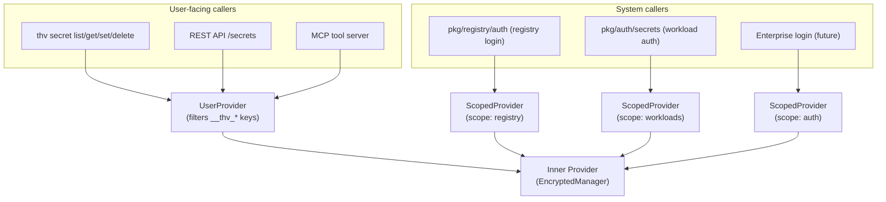

# RFC-56: Scoped Secret Store for System-Managed Tokens

- **Status**: Draft
- **Author(s)**: @amirejaz
- **Created**: 2026-03-17
- **Last Updated**: 2026-03-18
- **Target Repository**: toolhive
- **Related Issues**: [toolhive#4192](https://github.com/stacklok/toolhive/issues/4192)

## Summary

Introduce a `ScopedProvider` and `UserProvider` wrapper layer in `pkg/secrets/` that
isolates system-managed authentication tokens (registry OAuth tokens, workload auth
tokens, future enterprise login tokens) from user-managed secrets. System tokens are
stored under a reserved `__thv_<scope>_` key prefix and are invisible to user-facing
commands. This is a prerequisite for enterprise CLI/Desktop login (where OAuth session
tokens must be stored securely and in isolation from user workload secrets).

## Problem Statement

ToolHive's secret management uses a flat keyspace — all secrets share the same
namespace in the backing store. The following system-managed tokens are currently
stored alongside user-managed secrets and are visible via `thv secret list`:

| Key pattern | Source |
|---|---|
| `REGISTRY_OAUTH_<hex>` | `thv registry login` refresh tokens |
| `OAUTH_CLIENT_SECRET_<workload>` | Remote workload OAuth client secrets |
| `BEARER_TOKEN_<workload>` | Remote workload bearer tokens |
| `OAUTH_REFRESH_TOKEN_<workload>` | Remote workload OAuth refresh tokens |

This creates several problems:

- **Confusing UX**: Users see internal system tokens when listing their secrets,
  making it hard to identify their own workload secrets.
- **Accidental breakage**: A user can delete or overwrite a token that an active
  workload depends on, causing it to silently fail.
- **No isolation between concerns**: Registry login tokens and workload auth tokens
  share the same namespace with no logical separation.
- **Prerequisite for enterprise login**: The upcoming enterprise CLI/Desktop login
  feature (OAuth session tokens) cannot safely store tokens in the current flat
  store without exposing them to users.

All users of ToolHive with registry login or remote workload authentication configured
are affected today. Enterprise users will additionally be affected once CLI/Desktop
login is implemented.

## Goals

- Introduce a `ScopedProvider` wrapper that transparently namespaces system-managed
  keys under a reserved prefix, invisible to user-facing commands.
- Introduce a `UserProvider` wrapper that filters system keys from user-facing
  operations and rejects attempts to read or write reserved keys with a clear error.
- Define named scopes for each system concern: `registry`, `workloads`, `auth`.
- Add factory helpers so callers use the correct provider type without knowing the
  internal prefix format.
- Migrate existing system-managed keys to the scoped namespace on first startup to
  avoid breaking existing installations.
- Reserve the `auth` scope for future enterprise CLI/Desktop login tokens.
- Provide an admin escape hatch (`--system` flag) for emergency system token management.

## Non-Goals

- Multi-tenancy or per-workload secret ACLs (isolation is at the system vs. user
  boundary only, not between individual workloads).
- Encryption-at-rest improvements (the backing store is unchanged).
- Supporting scoped providers on top of the `EnvironmentType` provider (system tokens
  must never come from environment variables).
- The enterprise CLI/Desktop login implementation itself (tracked separately).
- Any changes to how user-managed secrets are stored or structured.

## Proposed Solution

### High-Level Design

Two new wrapper types are introduced in `pkg/secrets/scoped.go`:



All wrappers delegate to the same underlying `Provider` (e.g. `EncryptedManager`).
The key transformation is transparent to callers — they always pass bare names.

### Detailed Design

#### Key Prefix Format

System-managed keys use a double-underscore-wrapped prefix with the scope encoded
directly in the key name, avoiding any path separator characters:

```
__thv_<scope>_<name>

Examples:
  __thv_registry_REGISTRY_OAUTH_a1b2c3d4
  __thv_workloads_BEARER_TOKEN_github-app
  __thv_workloads_OAUTH_CLIENT_SECRET_my-server
  __thv_auth_access_token          (future)
  __thv_auth_refresh_token         (future)
```

The `__thv_` prefix is chosen because:
- **No path separators**: Avoids conflicts with external secret store path parsing
  (e.g. 1Password uses `/` as a vault path separator).
- **Convention**: `__` prefix is a widely understood "internal/reserved" signal
  (analogous to Python dunder methods and C reserved identifiers).
- **Collision-resistant**: No user key would naturally start with `__thv_` — and
  `UserProvider` enforces this by rejecting any attempt to create such a key.
- **Human-readable**: The scope is visible when inspecting the backing store directly.

#### Scope Constants

```go
const (
    // SystemKeyPrefix is the top-level prefix for all system-managed keys.
    SystemKeyPrefix = "__thv_"

    // ScopeRegistry is for registry OAuth refresh tokens (thv registry login).
    ScopeRegistry = "registry"

    // ScopeWorkloads is for remote workload auth tokens (OAuth client secrets,
    // bearer tokens, OAuth refresh tokens managed by pkg/auth/secrets).
    ScopeWorkloads = "workloads"

    // ScopeAuth is reserved for enterprise CLI/Desktop login tokens.
    ScopeAuth = "auth"
)

// full key format: "__thv_" + scope + "_" + name
// e.g. scopedKey("registry", "REGISTRY_OAUTH_abc") → "__thv_registry_REGISTRY_OAUTH_abc"
```

#### Component Changes

**New file: `pkg/secrets/scoped.go`**

`ScopedProvider` — for system callers:
- `GetSecret/SetSecret/DeleteSecret` transparently prefix the key: `__thv_<scope>_<name>`.
  Callers always pass bare names; the prefix is invisible to them.
- `ListSecrets` returns only entries in the scope, with prefix stripped (bare names to callers).
- `Cleanup` uses `BulkDeleteKeys` (see below) to remove only keys in this scope,
  leaving all other secrets untouched.
- `Capabilities` delegates to inner.

`UserProvider` — for user-facing callers:
- `GetSecret/SetSecret/DeleteSecret` reject any name starting with `__thv_` and
  return `ErrReservedKeyName` without calling the inner provider.
- `ListSecrets` silently filters out entries whose `Key` starts with `__thv_`.
- `Cleanup` uses `BulkDeleteKeys` to remove only non-system keys (keys not starting
  with `__thv_`), leaving system tokens untouched.
- `Capabilities` delegates to inner.

**New methods on `EncryptedManager`**

These methods are not part of the `Provider` interface — they are `EncryptedManager`-
specific and used only by the migration helper and the bulk cleanup operations:

```go
// BulkRenameKeys renames multiple keys atomically under a single file lock.
// For each (oldKey, newKey) pair it stores the new key then deletes the old key
// in the in-memory map (Store-before-Delete to preserve concurrent reader visibility),
// then calls updateFile() exactly once. A crash before the write completes leaves
// the file in the pre-migration state — safe to retry on next startup.
func (e *EncryptedManager) BulkRenameKeys(renames map[string]string) error

// BulkDeleteKeys deletes multiple keys atomically under a single file lock,
// then calls updateFile() exactly once.
func (e *EncryptedManager) BulkDeleteKeys(keys []string) error
```

**Thread safety guarantee**: Every call to `updateFile()` in `EncryptedManager` is
inside a `WithFileLock` closure. There are exactly three existing call sites
(`SetSecret`, `DeleteSecret`, `Cleanup`) and all three are lock-guarded. The new
`BulkRenameKeys` and `BulkDeleteKeys` methods follow the same pattern.
`updateFile()` is a private method so no external caller can invoke it outside a lock.

**New factory helpers in `pkg/secrets/factory.go`**

```go
// CreateScopedSecretProvider returns a provider for system-managed tokens in the
// given scope. Does NOT apply the FallbackProvider wrapper — system tokens must
// not fall back to environment variables. Returns an error if managerType is
// EnvironmentType (system tokens cannot be sourced from env vars).
func CreateScopedSecretProvider(managerType ProviderType, scope string) (Provider, error)

// CreateUserSecretProvider returns a provider for user-managed secrets.
// Wraps with UserProvider to filter out and block access to system-reserved keys.
func CreateUserSecretProvider(managerType ProviderType) (Provider, error)
```

**New migration helper: `pkg/secrets/migration.go`**

On first startup after upgrade, scan the backing store for keys matching legacy
system patterns and rename them to the scoped equivalents using `BulkRenameKeys`
— a single atomic file write for the entire migration.

```go
// MigrateSystemKeys scans for legacy unscoped system keys and renames them to
// their scoped equivalents in a single atomic BulkRenameKeys call. Safe to call
// on every startup — exits early if migration has already run (guarded by a
// config flag). The Store-before-Delete ordering within BulkRenameKeys ensures
// concurrent readers always see the value under at least one key during migration.
func MigrateSystemKeys(ctx context.Context, provider *EncryptedManager, configProvider config.Provider) error
```

Legacy key patterns and their target scopes:

| Legacy key pattern | Target scope | Example result |
|---|---|---|
| `REGISTRY_OAUTH_*` | `registry` | `__thv_registry_REGISTRY_OAUTH_a1b2c3` |
| `OAUTH_CLIENT_SECRET_*` | `workloads` | `__thv_workloads_OAUTH_CLIENT_SECRET_foo` |
| `BEARER_TOKEN_*` | `workloads` | `__thv_workloads_BEARER_TOKEN_foo` |
| `OAUTH_REFRESH_TOKEN_*` | `workloads` | `__thv_workloads_OAUTH_REFRESH_TOKEN_foo` |

**Transparency of prefix to on-disk config and state files**: `ScopedProvider` is
transparent — callers always pass bare names; the prefix is added/stripped at the
provider boundary. For example, `CachedRefreshTokenRef: "REGISTRY_OAUTH_abc"` stored
in the config file remains unchanged after migration. The call
`scopedProvider.GetSecret(ctx, "REGISTRY_OAUTH_abc")` transparently maps to
`inner.GetSecret(ctx, "__thv_registry_REGISTRY_OAUTH_abc")` — exactly where the
migrated value lives. No config or state file updates are needed.

**Admin escape hatch**: For emergency cases (leaked token, orphaned token from a
failed workload delete), `thv secret list --system` and `thv secret delete --system`
will be added. These use the `ScopedProvider` directly and are documented as
advanced/emergency commands, not part of the normal user workflow.

#### Complete Call-Site Categorisation

All call sites that create a secrets provider must be updated to use the correct
factory function. The complete mapping is:

**User-managed (→ `CreateUserSecretProvider`):**

| Call site | Notes |
|---|---|
| `cmd/thv/app/secret.go` `getSecretsManager()` | All 5 secret subcommands |
| `cmd/thv/app/config_buildauthfile.go` (4 calls) | `BUILD_AUTH_FILE_*` keys are user-initiated via `thv config set-build-auth-file` |
| `cmd/thv/app/config_buildenv.go:127` | User-defined build env secrets |
| `cmd/thv/app/header_flags.go:119` | User-defined header secrets |
| `pkg/runner/protocol.go` `resolveBuildAuthFilesFromSecrets` | Reads user-set `BUILD_AUTH_FILE_*` keys |
| `pkg/runner/runner.go` | User-defined `RunConfig.Secrets` resolution |
| `pkg/workloads/manager.go` `validateSecretParameters` | User secret validation |
| `pkg/api/v1/secrets.go` `getSecretsManager()` | REST API secrets endpoint |
| `pkg/mcp/server/list_secrets.go` | MCP tool server |
| `pkg/mcp/server/set_secret.go` | MCP tool server |

**System-managed (→ `CreateScopedSecretProvider`):**

| Call site | Scope | Notes |
|---|---|---|
| `pkg/auth/secrets/secrets.go` `GetSecretsManager()` | `ScopeWorkloads` | Covers `ProcessSecret` (which calls `GetSecretsManager()` internally) and all workload auth token storage |
| `pkg/registry/factory.go` `resolveTokenSource()` | `ScopeRegistry` | Runner path registry auth |
| `cmd/thv/app/registry_login.go:77` | `ScopeRegistry` | CLI registry login path — stores OAuth refresh tokens |

`ProcessSecretWithProvider` takes an injected provider (used in tests) and is
already covered by updating `GetSecretsManager()`.

## Security Considerations

### Threat Model

- **Accidental exposure**: System tokens (OAuth refresh tokens, client secrets)
  are currently visible to any user who runs `thv secret list`. This RFC removes
  that visibility.
- **Accidental deletion**: A user can currently delete a workload's OAuth token by
  name. `UserProvider` blocks this via `ErrReservedKeyName`.
- **Prefix collision attack**: A user could try to craft a key like
  `__thv_registry_foo` via `thv secret set`. `UserProvider.SetSecret` rejects
  this with `ErrReservedKeyName`.

### No Raw Backing Store Access

`EncryptedManager` is only constructed in `factory.go` and returned as the `Provider`
interface. No external caller holds a direct `*EncryptedManager` reference after
construction — all access goes through `ScopedProvider` or `UserProvider` wrapper
methods. This means every `GetSecret` call goes through the prefix translation layer
by construction; there is no code path that can read the raw backing store with an
old flat key name after migration.

### Data Security

- No new data is transmitted or stored outside the existing backing store.
- The scope prefix is stored in plaintext as part of the key name (same as today —
  the encrypted provider encrypts values, not key names).
- The migration uses `BulkRenameKeys` which performs a single atomic file write.
  A crash before the write completes leaves the file in the pre-migration state —
  safe to retry. A crash after the write but before the config migration flag is
  set causes the migration to run again on next startup, which is safe because
  `BulkRenameKeys` is idempotent for already-migrated keys.

### Thread Safety

`BulkRenameKeys` acquires a single `WithFileLock` for the entire operation.
Every `updateFile()` call in `EncryptedManager` is inside a `WithFileLock` closure
(confirmed: all three existing call sites are lock-guarded; `updateFile()` is
private). Within `BulkRenameKeys`, `Store(newKey)` is called before `Delete(oldKey)`
so concurrent readers via `GetSecret` (which reads from the thread-safe `syncmap.Map`)
always see the value under at least one key — there is no not-found window.

### Secrets Management

- This RFC does not change how secret values are stored or encrypted.
- The `ScopeAuth` constant is reserved but not used in this RFC. The enterprise
  login implementation will use it.

### Audit and Logging

- The migration logs each key rename at DEBUG level (key name only, never value).
- `ErrReservedKeyName` errors are surfaced to the user via the normal error path.

## Alternatives Considered

### Alternative 1: Separate storage file for system tokens

Use a second encrypted file (`secrets_auth_encrypted`) exclusively for system tokens.

- **Pro**: True file-level isolation.
- **Con**: Two files, two keyring passwords, more complex setup wizard.
- **Why not chosen**: The key-prefix approach achieves the same user-visible
  isolation with far less complexity.

### Alternative 2: Single system scope (no named scopes)

Use a single `__thv_` namespace for all system tokens without sub-scopes.

- **Pro**: Simpler — one constant.
- **Con**: Registry tokens and workload tokens are co-mingled; no extensibility.
- **Why not chosen**: Named scopes cost one string constant each and provide
  meaningful isolation and debuggability at negligible cost.

### Alternative 3: Slash-separated prefix (`thv_sys/<scope>/`)

Use `thv_sys/registry/REGISTRY_OAUTH_abc` instead of `__thv_registry_REGISTRY_OAUTH_abc`.

- **Pro**: Visually hierarchical.
- **Con**: Conflicts with 1Password's vault path separator (`/`), which would break
  key parsing if the scoped provider is ever backed by 1Password.
- **Why not chosen**: `__thv_<scope>_` eliminates the conflict by construction
  without restricting which provider types can be used as the backing store.

### Alternative 4: CLI-layer filtering only

Filter system keys only in `cmd/thv/app/secret.go`.

- **Pro**: Minimal change.
- **Con**: Filter must be duplicated in the API layer, MCP server, and any future surface.
- **Why not chosen**: `UserProvider` enforces the filter for any caller that uses
  `CreateUserSecretProvider`, making it impossible to accidentally expose system keys.

## Compatibility

### Backward Compatibility

This change is not backward compatible for existing installations. The migration
helper in `pkg/secrets/migration.go` addresses this by atomically renaming legacy
keys using `BulkRenameKeys` on first startup. Migration must ship simultaneously
with the caller changes (Phases 3, 4, and 5).

### Forward Compatibility

- New system token types can be added by introducing a new scope constant and
  using `CreateScopedSecretProvider` with that scope — no changes to `ScopedProvider`
  or `UserProvider` needed.
- The enterprise login implementation uses `ScopeAuth` out of the box.
- The `UserProvider` filter (`strings.HasPrefix(key, "__thv_")`) automatically
  covers any new scope without code changes.

## Implementation Plan

### Phase 1: Core types (no behavior change)

- Add `pkg/secrets/scoped.go` — `ScopedProvider`, `UserProvider`, scope constants, `ErrReservedKeyName`
- Add `pkg/secrets/scoped_test.go` — unit tests for both types
- No wiring changes; safe to merge independently

### Phase 2: Factory helpers and bulk EncryptedManager methods

- Add `BulkRenameKeys` and `BulkDeleteKeys` to `EncryptedManager` in `pkg/secrets/encrypted.go`
- Add `CreateScopedSecretProvider` and `CreateUserSecretProvider` to `pkg/secrets/factory.go`
- Update `pkg/secrets/factory_test.go` and `pkg/secrets/encrypted_test.go`
- No callers changed yet; safe to merge independently

### Phase 3: System callers (simultaneous with Phases 4 and 5)

- `pkg/auth/secrets/secrets.go` → `GetSecretsManager()` uses `ScopeWorkloads`
- `pkg/registry/factory.go` → `resolveTokenSource()` uses `ScopeRegistry`
- `cmd/thv/app/registry_login.go:77` → uses `ScopeRegistry`

### Phase 4: User callers (simultaneous with Phases 3 and 5)

- `cmd/thv/app/secret.go`, `pkg/api/v1/secrets.go`
- `cmd/thv/app/config_buildauthfile.go` (4 calls)
- `cmd/thv/app/config_buildenv.go`, `cmd/thv/app/header_flags.go`
- `pkg/runner/protocol.go`, `pkg/runner/runner.go`, `pkg/workloads/manager.go`
- `pkg/mcp/server/list_secrets.go`, `set_secret.go`

### Phase 5: Key migration (simultaneous with Phases 3 and 4)

- Add `pkg/secrets/migration.go` with `MigrateSystemKeys`
- Call migration at startup before any provider is used for reads
- Guard with config flag to run exactly once

### Phase 6: Admin escape hatch

- Add `--system` flag to `thv secret list` and `thv secret delete`
- Document as advanced/emergency commands

### Dependencies

- Phases 3, 4, and 5 must ship in the same PR to avoid a window where existing
  system keys are unreachable.
- The enterprise login implementation (separate RFC/issue) depends on `ScopeAuth`
  being available — satisfied after Phase 1.

## Testing Strategy

- **Unit tests**: Table-driven tests for `ScopedProvider` and `UserProvider` covering
  all methods, edge cases (empty results, error propagation, scope filtering).
- **Unit tests**: `BulkRenameKeys` and `BulkDeleteKeys` — verify atomicity, correct
  key selection, store-before-delete ordering, idempotency.
- **Unit tests**: `MigrateSystemKeys` with a mock `EncryptedManager` — verify each
  legacy pattern is renamed correctly, migration is idempotent, config flag is set.
- **Integration tests**: `UserProvider`-wrapped `EncryptedManager` does not list
  scoped keys; `ScopedProvider` does not list user keys.
- **E2E tests**: `thv secret list` after `thv registry login` does not show
  `REGISTRY_OAUTH_*` keys.

## Documentation

- Update `docs/arch/` with a note on the two-tier secret model (user vs. system).
- Update CLI help text for `thv secret list` to clarify it shows user-managed
  secrets only.
- Document `thv secret list --system` and `thv secret delete --system` as
  advanced/emergency commands.

## Open Questions

1. Should `MigrateSystemKeys` be called unconditionally on every startup (with an
   early-exit if already migrated) or only when the relevant commands are first used?
   The unconditional approach is simpler and less error-prone.

## References

- [toolhive#4192](https://github.com/stacklok/toolhive/issues/4192) — Implementation tracking issue
- [stacklok-enterprise-platform#103](https://github.com/stacklok/stacklok-enterprise-platform/issues/103) — Enterprise secret isolation issue
- [stacklok-enterprise-platform#69](https://github.com/stacklok/stacklok-enterprise-platform/issues/69) — Enterprise CLI/Desktop login (consumer of ScopeAuth)
- `pkg/secrets/fallback.go` — Pattern reference for provider wrapper implementation
- `pkg/secrets/encrypted.go` — EncryptedManager implementation details

---

## RFC Lifecycle

<!-- This section is maintained by RFC reviewers -->

### Review History

| Date | Reviewer | Decision | Notes |
|------|----------|----------|-------|
| 2026-03-17 | @amirejaz | Draft | Initial submission |
| 2026-03-18 | @amirejaz | Draft | Address review feedback: key prefix (`__thv_`), bulk migration, UserProvider.Cleanup, thread safety, complete call-site table, admin escape hatch |

### Implementation Tracking

| Repository | PR | Status |
|------------|-----|--------|
| toolhive | TBD | In Progress |
