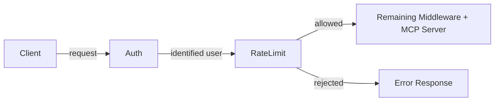

# RFC-0057: Rate Limiting for MCP Servers

- **Status**: Draft
- **Author(s)**: Jeremy Drouillard (@jerm-dro)
- **Created**: 2026-03-18
- **Last Updated**: 2026-03-19
- **Target Repository**: toolhive
- **Related Issues**: None

## Summary

Enable rate limiting for `MCPServer` and `VirtualMCPServer`, supporting per-user and global limits at both the server and individual operation level. Rate limits are configured declaratively on the resource spec and enforced by a new middleware in the middleware chain, with Redis as the shared counter backend.

## Problem Statement

ToolHive currently has no mechanism to limit the rate of requests flowing through its proxy layer. This creates several risks for administrators:

1. **Noisy-neighbor problem**: A single authenticated user can consume unbounded resources, degrading the experience for all other users of a shared MCP server.
2. **Downstream overload**: Aggregate traffic spikes — even when no single user is misbehaving — can overwhelm the upstream MCP server or the external services it depends on (APIs with their own rate limits, databases, etc.).
3. **Agent data exfiltration**: AI agents can invoke tools in tight loops to export large volumes of data. Without per-tool or per-user limits, there is no mechanism to cap this behavior.

These risks grow as ToolHive deployments move to shared, multi-user Kubernetes environments. Without rate limiting, cluster administrators have no knob to turn between "fully open" and "take the server offline."

**Scope**: This RFC targets Kubernetes-based deployments of ToolHive.

## Goals

- Allow administrators to configure **per-user** rate limits so that no single user can monopolize a server.
- Allow administrators to configure **global** rate limits so that total throughput stays within safe bounds for downstream services.
- Allow administrators to configure rate limits **per tool**, **per prompt**, or **per resource**, so that expensive or externally-constrained operations can have tighter limits than the server default.
- Provide a consistent configuration experience across `MCPServer` and `VirtualMCPServer` resources.
- Enforce rate limits in the existing proxy middleware chain with minimal latency overhead.
- Support correct enforcement across multiple replicas using Redis as the shared counter backend.

## Non-Goals

- **Adaptive / auto-tuning rate limits**: Automatically adjusting limits based on observed load or downstream health signals. Limits are static and administrator-configured.
- **Cost or billing integration**: Tracking usage for billing purposes. This is purely a protective mechanism.
- **Request queuing or throttling**: Requests that exceed the limit are rejected, not queued.

## Proposed Solution

### High-Level Design

Rate limiting is implemented as a new middleware in ToolHive's middleware chain. When a request arrives, the middleware checks the applicable limits (global, per-user, per-operation) and either allows the request to proceed or returns an appropriate error response.



The rate limit middleware sits after authentication (so user identity is available) and before the rest of the middleware chain.

**Request unit**: One token corresponds to one incoming `tools/call`, `prompts/get`, or `resources/read` invocation at the proxy. Other MCP methods (`tools/list`, `prompts/list`, `resources/list`, etc.) are not rate-limited — the motivation is to cap excessive use of operations that do real work, not to restrict discovery or listing. For `VirtualMCPServer`, rate limiting applies to incoming traffic only; outgoing calls to backends are not independently limited.

Rate limit counters are stored in Redis, which ToolHive already depends on. This ensures accurate enforcement across multiple replicas in horizontally-scaled deployments.

### Configuration

Rate limits are configured via a `rateLimiting` field on the server spec. The same structure applies to both `MCPServer` and `VirtualMCPServer`.

#### Server-Level Limits

```yaml
apiVersion: toolhive.stacklok.dev/v1alpha1
kind: MCPServer
metadata:
  name: my-server
spec:
  # ... existing fields ...
  rateLimiting:
    # Global limit: total requests across all users
    global:
      capacity: 1000
      refillPeriodSeconds: 60

    # Per-user limit: applied independently to each authenticated user
    perUser:
      capacity: 100
      refillPeriodSeconds: 60
```

**Validation**: Per-user rate limits require authentication to be enabled. If `perUser` limits are configured with anonymous inbound auth, the server will raise an error at startup.

#### Per-Operation Limits

Individual tools, prompts, or resources can have their own limits that supplement the server-level defaults. Per-operation limits can be either global or per-user:

```yaml
spec:
  rateLimiting:
    perUser:
      capacity: 100
      refillPeriodSeconds: 60

    tools:
      - name: "expensive_search"
        perUser:
          capacity: 10
          refillPeriodSeconds: 60
      - name: "shared_resource"
        global:
          capacity: 50
          refillPeriodSeconds: 60

    prompts:
      - name: "generate_report"
        perUser:
          capacity: 5
          refillPeriodSeconds: 60

    resources:
      - name: "large_dataset"
        global:
          capacity: 20
          refillPeriodSeconds: 60
```

When an operation-level limit is defined, it is enforced **in addition to** any server-level limits. A request must pass all applicable limits.

The `tools`, `prompts`, and `resources` lists all follow the same structure — each entry specifies an operation name and either a `global` or `perUser` limit (or both).

#### VirtualMCPServer

The same `rateLimiting` configuration is available on `VirtualMCPServer`. Server-level `perUser` limits are based on the user identity at ingress (e.g. the `sub` claim of an OIDC token) and are shared across all backends — they cap the user's total usage of the vMCP, not per-backend. Per-operation limits target specific backend operations by name (e.g. `backend_a/costly_tool`), so those are inherently scoped to a single backend.

```yaml
apiVersion: toolhive.stacklok.dev/v1alpha1
kind: VirtualMCPServer
metadata:
  name: my-vmcp
spec:
  config:
    rateLimiting:
      perUser:
        capacity: 200
        refillPeriodSeconds: 60
      tools:
        - name: "backend_a/costly_tool"
          perUser:
            capacity: 5
            refillPeriodSeconds: 60

      prompts:
        - name: "backend_b/heavy_prompt"
          global:
            capacity: 30
            refillPeriodSeconds: 60
```

### Algorithm: Token Bucket

Rate limits are enforced using a **token bucket** algorithm. The configuration maps directly onto it:

- `capacity` = bucket capacity (maximum tokens)
- `refillPeriodSeconds` = time in seconds to fully refill the bucket from zero
- Refill rate = `capacity / refillPeriodSeconds` tokens per second

Each token represents a single allowed request. The bucket starts full, refills at a steady rate, and each incoming request consumes one token. When the bucket is empty, requests are rejected.

Per-user limits work identically — each user gets their own bucket, keyed by identity. Redis keys follow a structure like:

- Global: `thv:rl:{server}:global`
- Global per-tool: `thv:rl:{server}:global:tool:{toolName}`
- Global per-prompt: `thv:rl:{server}:global:prompt:{promptName}`
- Global per-resource: `thv:rl:{server}:global:resource:{resourceName}`
- Per-user: `thv:rl:{server}:user:{userId}`
- Per-user per-tool: `thv:rl:{server}:user:{userId}:tool:{toolName}`
- Per-user per-prompt: `thv:rl:{server}:user:{userId}:prompt:{promptName}`
- Per-user per-resource: `thv:rl:{server}:user:{userId}:resource:{resourceName}`

Each bucket is stored as a Redis hash with two fields: token count and last refill timestamp. Refill is lazy — there is no background process. When a request arrives, an atomic Lua script calculates how many tokens should have accumulated since the last access based on elapsed time, adds them (capped at capacity), and then attempts to consume one. This ensures no race conditions across replicas. Keys auto-expire when inactive, so no garbage collection is needed.

Storage is **O(1) per counter** (two fields per hash). For example, 500 users with 10 per-operation limits = 5,000 hashes — negligible for Redis.

**Burst behavior**: An idle user accumulates tokens up to the bucket capacity. This means they can send a full burst of `capacity` requests at once after a period of inactivity. This is intentional — it handles legitimate traffic spikes — but administrators should understand it when setting capacity.

### Redis Unavailability

If Redis is unreachable, the middleware **fails open** — all requests are allowed through. This ensures a Redis hiccup does not become a full MCP outage. When this occurs, the middleware emits a structured log entry and increments a `rate_limit_redis_unavailable` metric so that operators can detect and alert on Redis health independently.

### Rejection Behavior

When a request is rate-limited, the middleware returns an MCP-appropriate error response. The middleware includes a `Retry-After` value computed as `1 / refill_rate` from the most restrictive bucket that caused the rejection. This value is a **best-effort lower bound**, not a guarantee — particularly for global limits, where other users may consume the next available token before this client retries.

## Security Considerations

### Threat Model

| Threat | Likelihood | Impact | Mitigation |
|--------|-----------|--------|------------|
| Redis key injection via crafted operation names | Medium | High | Validate and sanitize operation names before constructing Redis keys. Reject names containing key-separator characters. |
| Redis as single point of compromise | Low | High | Require Redis authentication and TLS. Reuse the existing Redis security posture established in [THV-0035](./THV-0035-auth-server-redis-storage.md). |
| Rate limit bypass via identity spoofing | Low | Medium | Rate limiting relies on upstream auth middleware. It is only as strong as the authentication layer. |
| Denial of service via Redis exhaustion | Low | Medium | Keys auto-expire when inactive. Storage is O(1) per counter, bounding memory usage. |
| Unauthenticated DoS | Medium | High | Rate limiting sits after the auth middleware, so unauthenticated requests are rejected before reaching rate limit evaluation. Global limits only count authenticated traffic. |

### Data Security

No sensitive data is stored in Redis — only token counts and last-refill timestamps. User IDs appear in Redis key names but carry no additional PII.

### Input Validation

Operation names used to construct Redis keys must be validated and sanitized to prevent key injection. Names should be checked against a strict allowlist of characters (alphanumeric, hyphens, underscores, forward slashes for vMCP backend-prefixed names).

### Audit and Logging

Rate-limit rejections are logged with user identity, operation name, and which limit was hit (global, per-user, per-operation). Token counts and refill timestamps are not included in log output.

## Alternatives Considered

### Sliding Window Log

The original proposal used a sliding window log algorithm, which tracks each request timestamp in a sorted set and counts entries within the window. This was replaced with a **token bucket** for the following reasons:

- **Burst handling**: Token bucket naturally allows legitimate bursts after idle periods, while sliding window enforces a strict ceiling regardless of usage pattern.
- **Simpler storage**: Token bucket requires a single Redis hash (two fields) per counter, compared to a sorted set with one entry per request for sliding window — significantly less memory under high throughput.
- **Atomic operations**: The token bucket check-and-decrement is a single Lua script operating on two fields, reducing Redis round-trip complexity.

## References

- [THV-0017: Dynamic Webhook Middleware](./THV-0017-dynamic-webhook-middleware.md) — mentions rate limiting as an external webhook use case
- [THV-0047: Horizontal Scaling for vMCP and Proxy Runner](./THV-0047-vmcp-proxyrunner-horizontal-scaling.md) — relevant to distributed rate limiting concerns
- [THV-0035: Auth Server Redis Storage](./THV-0035-auth-server-redis-storage.md) — existing Redis dependency
- [IETF RFC 6585](https://tools.ietf.org/html/rfc6585) — HTTP 429 Too Many Requests status code

---

## RFC Lifecycle

<!-- This section is maintained by RFC reviewers -->

### Review History

| Date | Reviewer | Decision | Notes |
|------|----------|----------|-------|
| 2026-03-18 | @jerm-dro | Draft | Initial submission |

### Implementation Tracking

| Repository | PR | Status |
|------------|-----|--------|
| toolhive | TBD | Not started |
