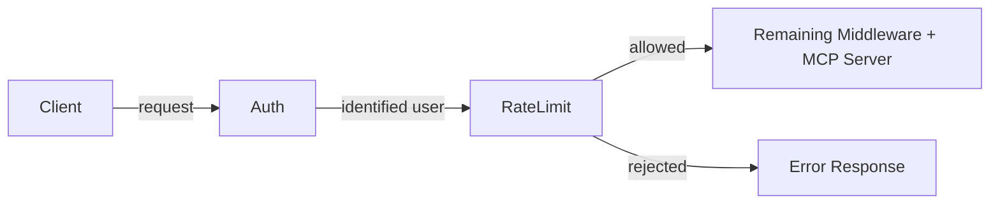

# RFC-0057: Rate Limiting for MCP Servers

- **Status**: Draft
- **Author(s)**: Jeremy Drouillard (@JAYD3V)
- **Created**: 2026-03-18
- **Last Updated**: 2026-03-18
- **Target Repository**: toolhive
- **Related Issues**: None

## Summary

Add configurable rate limiting to ToolHive's proxy layer, supporting per-user and global limits at both the server and individual tool level. Rate limits are configured declaratively on `MCPServer` and `VirtualMCPServer` resources and enforced by a new middleware in the proxy chain, with Redis as the shared counter backend.

## Problem Statement

ToolHive currently has no mechanism to limit the rate of requests flowing through its proxy layer. This creates two distinct risks for operators:

1. **Noisy-neighbor problem**: A single authenticated user can consume unbounded resources, degrading the experience for all other users of a shared MCP server.
2. **Downstream overload**: Aggregate traffic spikes — even when no single user is misbehaving — can overwhelm the upstream MCP server or the external services it depends on (APIs with their own rate limits, databases, etc.).

These risks grow as ToolHive deployments move from single-user local setups to shared, multi-user Kubernetes environments. Without rate limiting, operators have no knob to turn between "fully open" and "take the server offline."

## Goals

- Allow operators to configure **per-user** rate limits so that no single user can monopolize a server.
- Allow operators to configure **global** rate limits so that total throughput stays within safe bounds for downstream services.
- Allow operators to configure rate limits **per tool**, **per prompt**, or **per resource**, so that expensive or externally-constrained operations can have tighter limits than the server default.
- Provide a consistent configuration experience across `MCPServer` and `VirtualMCPServer` resources.
- Enforce rate limits in the existing proxy middleware chain with minimal latency overhead.
- Support correct enforcement across multiple replicas using Redis as the shared counter backend.

## Non-Goals

- **Adaptive / auto-tuning rate limits**: Automatically adjusting limits based on observed load or downstream health signals. Limits are static and operator-configured.
- **Cost or billing integration**: Tracking usage for billing purposes. This is purely a protective mechanism.
- **Request queuing or throttling**: Requests that exceed the limit are rejected, not queued.
- **Rate limiting at the vMCP routing layer**: Limits are applied at the individual server proxy, not at the vMCP aggregation/routing level.

## Proposed Solution

### High-Level Design

Rate limiting is implemented as a new middleware in ToolHive's proxy chain. When a request arrives, the middleware checks the applicable limits (global, per-user, per-operation) and either allows the request to proceed or returns an appropriate error response.



The rate limit middleware sits after authentication (so user identity is available) and before the rest of the middleware chain.

Rate limit counters are stored in Redis, which ToolHive already depends on. This ensures accurate enforcement across multiple replicas in horizontally-scaled deployments.

### Configuration

Rate limits are configured via a `rateLimiting` field on the server spec. The same structure applies to both `MCPServer` and `VirtualMCPServer`.

#### Server-Level Limits

```yaml
apiVersion: toolhive.stacklok.dev/v1alpha1
kind: MCPServer
metadata:
  name: my-server
spec:
  # ... existing fields ...
  rateLimiting:
    # Global limit: total requests across all users
    global:
      requestsPerWindow: 1000
      windowSeconds: 60

    # Per-user limit: applied independently to each authenticated user
    perUser:
      requestsPerWindow: 100
      windowSeconds: 60
```

**Validation**: Per-user rate limits require authentication to be enabled. If `perUser` limits are configured with anonymous inbound auth, the server will raise an error at startup.

#### Per-Operation Limits

Individual tools, prompts, or resources can have their own limits that supplement the server-level defaults. Per-operation limits can be either global or per-user:

```yaml
spec:
  rateLimiting:
    perUser:
      requestsPerWindow: 100
      windowSeconds: 60

    tools:
      - name: "expensive_search"
        perUser:
          requestsPerWindow: 10
          windowSeconds: 60
      - name: "shared_resource"
        global:
          requestsPerWindow: 50
          windowSeconds: 60

    prompts:
      - name: "generate_report"
        perUser:
          requestsPerWindow: 5
          windowSeconds: 60

    resources:
      - name: "large_dataset"
        global:
          requestsPerWindow: 20
          windowSeconds: 60
```

When an operation-level limit is defined, it is enforced **in addition to** any server-level limits. A request must pass all applicable limits.

The `tools`, `prompts`, and `resources` lists all follow the same structure — each entry specifies an operation name and either a `global` or `perUser` limit (or both).

#### VirtualMCPServer

The same `rateLimiting` configuration is available on `VirtualMCPServer`. Limits configured here apply to the proxied traffic for each backend server independently.

```yaml
apiVersion: toolhive.stacklok.dev/v1alpha1
kind: VirtualMCPServer
metadata:
  name: my-vmcp
spec:
  config:
    rateLimiting:
      perUser:
        requestsPerWindow: 200
        windowSeconds: 60
      tools:
        - name: "backend_a/costly_tool"
          perUser:
            requestsPerWindow: 5
            windowSeconds: 60
      prompts:
        - name: "backend_b/heavy_prompt"
          global:
            requestsPerWindow: 30
            windowSeconds: 60
```

### Windowing

We plan to use a simple, approximate windowing approach for the initial implementation. Exact enforcement at window boundaries is not a goal — the intent is protection against sustained overuse, not precise metering.

Common approaches include fixed window counters, sliding window counters, and token buckets. Each trades off simplicity, memory usage, and burst behavior differently. We will select an approach during implementation that is straightforward and good enough for the use cases described above.

If you have strong opinions on windowing algorithm choice, please raise them during review.

The configuration schema (`requestsPerWindow` + `windowSeconds`) is intentionally minimal and can map onto any of these algorithms without changing the operator-facing API.

### Rejection Behavior

When a request is rate-limited, the middleware returns an MCP-appropriate error response. The response should include enough information for the client to understand what happened and when to retry (e.g., a `Retry-After` hint).

## Open Questions

1. **Redis unavailability**: How should the middleware behave if Redis is unreachable? Fail open (allow all requests) or fail closed (reject all requests)?

## References

- [THV-0017: Dynamic Webhook Middleware](./THV-0017-dynamic-webhook-middleware.md) — mentions rate limiting as an external webhook use case
- [THV-0047: Horizontal Scaling for vMCP and Proxy Runner](./THV-0047-vmcp-proxyrunner-horizontal-scaling.md) — relevant to distributed rate limiting concerns
- [THV-0035: Auth Server Redis Storage](./THV-0035-auth-server-redis-storage.md) — existing Redis dependency
- [IETF RFC 6585](https://tools.ietf.org/html/rfc6585) — HTTP 429 Too Many Requests status code

---

## RFC Lifecycle

<!-- This section is maintained by RFC reviewers -->

### Review History

| Date | Reviewer | Decision | Notes |
|------|----------|----------|-------|
| 2026-03-18 | @JAYD3V | Draft | Initial submission |

### Implementation Tracking

| Repository | PR | Status |
|------------|-----|--------|
| toolhive | TBD | Not started |
