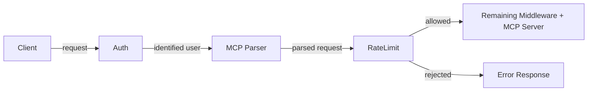

# RFC-0057: Rate Limiting for MCP Servers

- **Status**: Draft
- **Author(s)**: Jeremy Drouillard (@jerm-dro)
- **Created**: 2026-03-18
- **Last Updated**: 2026-03-19
- **Target Repository**: toolhive
- **Related Issues**: None

## Summary

Enable rate limiting for `MCPServer` and `VirtualMCPServer`, supporting per-user and global limits at both the server and individual operation level. Rate limits are configured declaratively on the resource spec and enforced by a new middleware in the middleware chain, with Redis as the shared counter backend.

## Problem Statement

ToolHive currently has no mechanism to limit the rate of requests flowing through its proxy layer. This creates several risks for administrators:

1. **Noisy-neighbor problem**: A single authenticated user can consume unbounded resources, degrading the experience for all other users of a shared MCP server.
2. **Downstream overload**: Aggregate traffic spikes — even when no single user is misbehaving — can overwhelm the upstream MCP server or the external services it depends on (APIs with their own rate limits, databases, etc.).
3. **Agent data exfiltration**: AI agents can invoke tools in tight loops to export large volumes of data. Without per-tool or per-user limits, there is no mechanism to cap this behavior.

These risks grow as ToolHive deployments move to shared, multi-user Kubernetes environments. Without rate limiting, cluster administrators have no knob to turn between "fully open" and "take the server offline."

**Scope**: This RFC targets Kubernetes-based deployments of ToolHive.

## Goals

- Allow administrators to configure **per-user** rate limits so that no single user can monopolize a server.
- Allow administrators to configure **global** rate limits so that total throughput stays within safe bounds for downstream services.
- Allow administrators to configure rate limits **per tool**, **per prompt**, or **per resource**, so that expensive or externally-constrained operations can have tighter limits than the server default.
- Provide a consistent configuration experience across `MCPServer` and `VirtualMCPServer` resources.
- Enforce rate limits in the existing proxy middleware chain with minimal latency overhead.
- Support correct enforcement across multiple replicas using Redis as the shared counter backend.

## Non-Goals

- **Adaptive / auto-tuning rate limits**: Automatically adjusting limits based on observed load or downstream health signals. Limits are static and administrator-configured.
- **Cost or billing integration**: Tracking usage for billing purposes. This is purely a protective mechanism.
- **Request queuing or throttling**: Requests that exceed the limit are rejected, not queued.
- **Rate limiting for `completion/complete`**: Completions can be high-frequency but are not a primary risk vector. Can be added in a follow-up if needed.

## Proposed Solution

### High-Level Design

Rate limiting is implemented as a new middleware in ToolHive's middleware chain. When a request arrives, the middleware checks the applicable limits (global, per-user, per-operation) and either allows the request to proceed or returns an appropriate error response.



The rate limit middleware runs after **auth** (user identity must be available for per-user limits) and after **mcp-parser** (the `ParsedMCPRequest` in context is needed to distinguish `tools/call` from `tools/list` and to resolve the operation name for per-operation limits).

**Request unit**: One token corresponds to one incoming `tools/call`, `prompts/get`, or `resources/read` invocation at the proxy. Lifecycle and discovery methods (`initialize`, `ping`, notifications, list methods) are not rate-limited as they don't perform substantive work. For `VirtualMCPServer`, rate limiting applies to incoming traffic only; outgoing calls to backends are not independently limited.

**Batch JSON-RPC**: MCP transports do not use JSON-RPC batching in practice, but an acceptance test should verify that batch requests cannot be used to bypass rate limits.

Rate limit counters are stored in Redis, reusing the existing session storage Redis connection. Redis-backed session storage is a prerequisite when rate limiting is enabled — this is validated at reconciliation time. This ensures accurate enforcement across multiple replicas in horizontally-scaled deployments.

### Configuration

Rate limits are configured via a `rateLimiting` field on the server spec. The same structure applies to both `MCPServer` and `VirtualMCPServer`.

#### Server-Level Limits

```yaml
apiVersion: toolhive.stacklok.dev/v1alpha1
kind: MCPServer
metadata:
  name: my-server
spec:
  # ... existing fields ...
  rateLimiting:
    # Global limit: total requests across all users
    global:
      maxTokens: 1000
      refillPeriod: "1m"

    # Per-user limit: applied independently to each authenticated user
    perUser:
      maxTokens: 100
      refillPeriod: "1m"
```

**Validation**: Configuration errors are caught at **admission time** via CRD schema validation, giving immediate feedback on `kubectl apply` rather than requiring pod log inspection. Required validation rules:

- `perUser` rate limits require authentication to be enabled (anonymous inbound auth is invalid)
- At least one of `global` or `perUser` must be set when `rateLimiting` is present
- `maxTokens` and `refillPeriod` must meet minimum-value constraints

The operator sets a `RateLimitingConfigValid` status condition with reasons such as `RateLimitRedisNotConfigured` or `RateLimitPerUserRequiresAuth` to surface configuration issues at reconciliation time.

#### Per-Operation Limits

Individual tools, prompts, or resources can have their own limits that supplement the server-level defaults. Per-operation limits can be either global or per-user:

```yaml
spec:
  rateLimiting:
    perUser:
      maxTokens: 100
      refillPeriod: "1m"

    tools:
      - name: "expensive_search"
        perUser:
          maxTokens: 10
          refillPeriod: "1m"
      - name: "shared_resource"
        global:
          maxTokens: 50
          refillPeriod: "1m"

    prompts:
      - name: "generate_report"
        perUser:
          maxTokens: 5
          refillPeriod: "1m"

    resources:
      - name: "large_dataset"
        global:
          maxTokens: 20
          refillPeriod: "1m"
```

When an operation-level limit is defined, it is enforced **in addition to** any server-level limits. A request must pass all applicable limits.

The `tools`, `prompts`, and `resources` lists all follow the same structure — each entry specifies an operation name and either a `global` or `perUser` limit (or both).

#### VirtualMCPServer

The same `rateLimiting` configuration is available on `VirtualMCPServer`. Server-level `perUser` limits are based on the user identity at ingress (e.g. the `sub` claim of an OIDC token) and are shared across all backends — they cap the user's total usage of the vMCP, not per-backend. Per-operation limits use post-aggregation tool names matching the configured `PrefixFormat` (default underscore separator, e.g. `backend_a_costly_tool`), so those are inherently scoped to a single backend.

**Optimizer interaction**: When the optimizer is enabled, clients call `call_tool`/`find_tool` meta-tools instead of backend tools directly. Per-tool rate limits extract the inner `tool_name` from `call_tool` arguments to enforce limits on the real backend tool, following the same pattern as the authz middleware ([stacklok/toolhive#4385](https://github.com/stacklok/toolhive/pull/4385)). This is tech debt — the cross-cutting interaction between middleware and optimizer naming is a known problem that [THV-0060](https://github.com/stacklok/toolhive-rfcs/pull/60) aims to resolve structurally.

```yaml
apiVersion: toolhive.stacklok.dev/v1alpha1
kind: VirtualMCPServer
metadata:
  name: my-vmcp
spec:
  rateLimiting:
    perUser:
      maxTokens: 200
      refillPeriod: "1m"
    tools:
      - name: "backend_a_costly_tool"
        perUser:
          maxTokens: 5
          refillPeriod: "1m"

    prompts:
      - name: "backend_b_heavy_prompt"
        global:
          maxTokens: 30
          refillPeriod: "1m"
```

### Algorithm: Token Bucket

Rate limits are enforced using a **token bucket** algorithm. The configuration maps directly onto it:

- `maxTokens` = bucket capacity (maximum tokens)
- `refillPeriod` = duration to fully refill the bucket from zero (e.g. `"1m"`, `"1h"`)
- Refill rate = `maxTokens / refillPeriod` tokens per second

Both fields require minimum-value validation (`maxTokens >= 1`, `refillPeriod > 0`).

Each token represents a single allowed request. The bucket starts full, refills at a steady rate, and each incoming request consumes one token. When the bucket is empty, requests are rejected.

Per-user limits work identically — each user gets their own bucket, keyed by identity. Redis keys follow a structure like:

- Global: `thv:rl:{namespace}:{server}:global`
- Global per-tool: `thv:rl:{namespace}:{server}:global:tool:{toolName}`
- Global per-prompt: `thv:rl:{namespace}:{server}:global:prompt:{promptName}`
- Global per-resource: `thv:rl:{namespace}:{server}:global:resource:{resourceName}`
- Per-user: `thv:rl:{namespace}:{server}:user:{userId}`
- Per-user per-tool: `thv:rl:{namespace}:{server}:user:{userId}:tool:{toolName}`
- Per-user per-prompt: `thv:rl:{namespace}:{server}:user:{userId}:prompt:{promptName}`
- Per-user per-resource: `thv:rl:{namespace}:{server}:user:{userId}:resource:{resourceName}`

The `{namespace}` and `{server}` components are derived from the CRD metadata at middleware initialization time, never from per-request input.

Each bucket is stored as a Redis hash with two fields: token count and last refill timestamp. Refill is lazy — there is no background process. When a request arrives, an atomic Lua script calculates how many tokens should have accumulated since the last access based on elapsed time, adds them (capped at maxTokens), and then attempts to consume one. The Lua script uses `redis.call('TIME')` for all timestamp calculations to avoid clock skew across replicas, and handles the key-does-not-exist case (fresh bucket at full capacity) within the same EVAL. This ensures no race conditions across replicas. Keys auto-expire after `2 * refillPeriod` (enough for a full refill cycle plus buffer), so no garbage collection is needed.

Storage is **O(1) per counter** (two fields per hash). For example, 500 users with 10 per-operation limits = 5,000 hashes — negligible for Redis.

**Burst behavior**: An idle user accumulates tokens up to the bucket maxTokens. This means they can send a full burst of `maxTokens` requests at once after a period of inactivity. This is intentional — it handles legitimate traffic spikes — but administrators should understand it when setting maxTokens.

### Redis Unavailability

If Redis is unreachable, the middleware **fails open** — all requests are allowed through. This ensures a Redis hiccup does not become a full MCP outage. The middleware logs state transitions (first failure and recovery) rather than every failed check to avoid log noise during sustained outages, and increments a `toolhive_rate_limit_redis_unavailable_total` metric so that operators can detect and alert on Redis health independently.

**Redis failover**: During Sentinel failover, the new primary has no rate limit state. All users receive a fresh burst allowance. This is expected behavior — bucket state is ephemeral and refills naturally.

### Observability

The rate limiting middleware exposes the following metric categories (specific names and labels to be finalized at implementation time, following the `toolhive_` prefix convention):

- **Decision counter**: Total rate limit decisions (allowed/rejected), broken down by scope and operation type
- **Redis error counter**: Redis failures by error type (timeout, connection refused, auth failure)
- **Fail-open counter**: Requests allowed through without rate limit enforcement during Redis outage
- **Check latency histogram**: Lua script round-trip latency (hot path for every rate-limited request)

**Tracing**: The middleware adds span attributes to the existing request span: `rate_limit.decision`, `rate_limit.rejected_by`, `rate_limit.fail_open`.

### Rejection Response Format

When a request is rate-limited, the middleware returns a **JSON-RPC 2.0 error response** (not a tool result with `isError: true` — the tool was never invoked):

```json
{
  "jsonrpc": "2.0",
  "id": 2,
  "error": {
    "code": -32029,
    "message": "Rate limit exceeded",
    "data": {
      "retryAfterSeconds": 0.6,
      "limitType": "perUser"
    }
  }
}
```

- **Error code**: `-32029` (in the `-32000` to `-32099` range reserved for implementation-defined server errors).
- **`Retry-After`**: Placed in `error.data`, not HTTP headers, so it works across all transports (stdio, SSE, Streamable HTTP). The value is computed as `1 / refill_rate` from the most restrictive bucket that caused the rejection. This is a **best-effort lower bound**, not a guarantee — particularly for global limits, where other users may consume the next available token before this client retries.
- **HTTP 429**: For Streamable HTTP transport, the middleware additionally returns HTTP 429 with a `Retry-After` header as a supplementary transport-level signal.

## Security Considerations

### Threat Model

| Threat | Likelihood | Impact | Mitigation |
|--------|-----------|--------|------------|
| Redis key injection via crafted operation names | Medium | High | Validate and sanitize operation names before constructing Redis keys. Reject names containing key-separator characters. |
| Redis as single point of compromise | Low | High | Reuse existing Redis security posture. Rate limiting shares the session storage Redis connection and follows the same security approach (authentication, network-level isolation). |
| Rate limit bypass via identity spoofing | Low | Medium | Rate limiting relies on upstream auth middleware. It is only as strong as the authentication layer. |
| Denial of service via Redis exhaustion | Low | Medium | Keys auto-expire when inactive. Storage is O(1) per counter, bounding memory usage. |
| Unauthenticated DoS | Medium | High | Rate limiting sits after the auth middleware, so unauthenticated requests are rejected before reaching rate limit evaluation. Global limits only count authenticated traffic. |

### Scope and Limitations

Rate limiting operates at the MCP method level. Transport-level attacks (connection exhaustion, slowloris), Redis availability, and IDP identity consistency (e.g. multiple `sub` claims for one human) are outside the scope of rate limiting and addressed by other layers.

### Data Security

No sensitive data is stored in Redis — only token counts and last-refill timestamps. User IDs appear in Redis key names but carry no additional PII.

### Input Validation

Operation names used to construct Redis keys must be validated and sanitized to prevent key injection. Names should be checked against a strict allowlist of characters (alphanumeric, hyphens, underscores, forward slashes for vMCP backend-prefixed names).

### Audit and Logging

Rate-limit rejections are logged with user identity, operation name, and which limit was hit (global, per-user, per-operation). Token counts and refill timestamps are not included in log output.

## Alternatives Considered

### Sliding Window Log

The original proposal used a sliding window log algorithm, which tracks each request timestamp in a sorted set and counts entries within the window. This was replaced with a **token bucket** for the following reasons:

- **Burst handling**: Token bucket naturally allows legitimate bursts after idle periods, while sliding window enforces a strict ceiling regardless of usage pattern.
- **Simpler storage**: Token bucket requires a single Redis hash (two fields) per counter, compared to a sorted set with one entry per request for sliding window — significantly less memory under high throughput.
- **Atomic operations**: The token bucket check-and-decrement is a single Lua script operating on two fields, reducing Redis round-trip complexity.

## Plan

The initial implementation targets **`MCPServer`** and **`VirtualMCPServer`** as the priority. The following are deferred for future work:

- **`MCPRemoteProxy` support**: `MCPRemoteProxy` shares the same `MiddlewareFactory` registry and transparent proxy chain as `MCPServer`, so integrating rate limiting is straightforward. Deferred until demand warrants it.
- **In-memory rate limiting for CLI / single-replica deployments**: The primary motivation for rate limiting is multi-user K8s environments where noisy-neighbor and exfiltration risks are most acute. CLI mode is single-user/single-process where rate limiting adds less value. Could be added using the same dual-mode pattern as session storage (memory vs Redis).

### External Rate Limiting (Envoy/Istio)

Infrastructure-level rate limiting operates on HTTP request counts, not MCP method semantics. It cannot distinguish `tools/call` from `tools/list`, cannot enforce per-tool limits, and requires infrastructure-level configuration that operators may not control. Application-level rate limiting is needed for MCP-aware enforcement.

### Webhook-Based Rate Limiting (THV-0017)

The [dynamic webhook middleware](./THV-0017-dynamic-webhook-middleware.md) allows external services to participate in the request pipeline, and rate limiting is listed as a use case. However, adding a network round-trip to an external rate limiter on every request adds significant latency to the hot path. Rate limiting is a core operational concern (like auth and audit) that belongs in the middleware chain. THV-0017 webhooks remain useful for custom rate limiting logic beyond what this RFC provides.

### Fixed Window Counters

Simpler than token bucket but suffers from the boundary burst problem — a user can send 2x the limit by timing requests at the edge of two adjacent windows. Token bucket provides smoother rate enforcement with natural burst handling.

## References

- [THV-0017: Dynamic Webhook Middleware](./THV-0017-dynamic-webhook-middleware.md) — mentions rate limiting as an external webhook use case
- [THV-0047: Horizontal Scaling for vMCP and Proxy Runner](./THV-0047-vmcp-proxyrunner-horizontal-scaling.md) — relevant to distributed rate limiting concerns
- [THV-0035: Auth Server Redis Storage](./THV-0035-auth-server-redis-storage.md) — existing Redis dependency
- [IETF RFC 6585](https://tools.ietf.org/html/rfc6585) — HTTP 429 Too Many Requests status code

---

## RFC Lifecycle

<!-- This section is maintained by RFC reviewers -->

### Review History

| Date | Reviewer | Decision | Notes |
|------|----------|----------|-------|
| 2026-03-18 | @jerm-dro | Draft | Initial submission |

### Implementation Tracking

| Repository | PR | Status |
|------------|-----|--------|
| toolhive | TBD | Not started |
