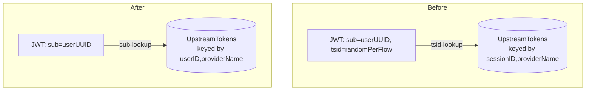

# RFC-0058: Re-key Upstream Token Storage by Stable User Identity

- **Status**: Draft
- **Author(s)**: Jakub Hrozek (@jhrozek)
- **Created**: 2026-04-28
- **Last Updated**: 2026-04-28
- **Target Repository**: toolhive
- **Related Issues**: [toolhive#5046](https://github.com/stacklok/toolhive/issues/5046), [toolhive#5047](https://github.com/stacklok/toolhive/issues/5047)
- **Related RFCs**: THV-0019 (auth server design), THV-0031 (auth server integration), THV-0035 (auth server Redis storage), THV-0052 (multi-upstream IDP)

## Summary

Re-key `UpstreamTokenStorage` from `(SessionID, providerName)` to `(UserID, providerName)`. Switch the JWT lookup from the custom `tsid` claim to the standard `sub` claim, then drop `tsid` from newly-issued JWTs after a bounded transition window. Fix the callback's overwrite-with-empty-refresh-token bug atomically inside the storage layer. Address newly-discovered `User.ID` stability gaps amplified by the rekey.

## Problem Statement

Two bugs share one structural cause:

- **toolhive#5046** — Tokens from providers that omit `expires_in` (GitHub PATs, Vault, service tokens) were given a fabricated 1h expiry, then evicted, triggering refresh attempts on tokens that have no refresh capability. The provider was omitted from downstream responses every hour. *Fixed in branch `upstream-expiring-issues`, ships separately as a focused PR.*
- **toolhive#5047** — A fresh `/authorize` mints a new SessionID via `rand.Text()` (`pkg/authserver/server/handlers/authorize.go:91`). The previous session's upstream tokens — including a working refresh token — become unreachable from the new JWT's `tsid` claim. Acutely visible with Google IdP, which only re-issues `refresh_token` on first consent without `prompt=consent`.

The structural cause is that `UpstreamTokens` carry **user-lifetime semantics** (a Google refresh token is valid for ~6 months) but are stored under a **flow-scoped key** that rotates on every authorize call. The stable identifier (`User.ID`, resolved from `(providerID, providerSubject)` in `pkg/authserver/server/handlers/user.go`) exists on the row but is never used as a lookup key.

Affected users: anyone using ToolHive with an IdP that omits `refresh_token` on re-auth (notably Google), and anyone whose access pattern triggers a fresh `/authorize` rather than a `grant_type=refresh_token` flow.

## Goals

- Eliminate orphaning of valid upstream refresh tokens on re-authentication.
- Make storage lookups deterministic for a returning user across `/authorize` calls.
- Retire the `tsid` claim cleanly (it is purely a lookup index, not load-bearing for security — see investigation in §References).
- Fix the callback's verbatim overwrite of an empty `refresh_token` (toolhive#5047 root cause B) atomically.
- Address `User.ID` stability gaps that the rekey amplifies (chain reordering, missing subsequent-leg identity links).
- Implement the dormant `ErrInvalidBinding` defence-in-depth check that has been designed but never wired up.

## Non-Goals

- **Account linking across providers.** Alice via Google ≠ Alice via GitHub remains true; auto-linking is deferred per existing `pkg/authserver/storage/types.go:284-288` TODO.
- **RFC 7009 upstream refresh-token revocation on AS logout.** Separate workstream.
- **JWE encryption of stored tokens at rest.** Orthogonal hardening.
- **MCP transport-layer session IDs.** ToolHive has at least four "session" concepts (MCP transport session via `Mcp-Session-Id`, Fosite OAuth session, AS upstream-storage session, transport proxy session). Only the third is in scope.
- **Renaming the upstream provider in config.** Reflects an orphaned-data trade-off documented as a known limitation.

## Proposed Solution

### High-Level Design



The JWT already carries `User.ID` in `sub`. The read path switch is a one-line change in `pkg/auth/token.go:1190`. The interface and backend changes are internal to `pkg/authserver`. Most external consumers only touch `Identity.UpstreamTokens` (a map) and are unaffected.

### Detailed Design

#### Storage Interface Change

```go
// Before
StoreUpstreamTokens(ctx, sessionID, providerName, tokens) error
GetUpstreamTokens(ctx, sessionID, providerName)         (*UpstreamTokens, error)
GetAllUpstreamTokens(ctx, sessionID)                    (map[string]*UpstreamTokens, error)
DeleteUpstreamTokens(ctx, sessionID)                    error

// After
StoreUpstreamTokens(ctx, userID, providerName, tokens)  error  // merging semantics built in
GetUpstreamTokens(ctx, userID, providerName)            (*UpstreamTokens, error)
GetAllUpstreamTokens(ctx, userID)                       (map[string]*UpstreamTokens, error)
DeleteUpstreamTokens(ctx, userID, providerName)         error  // gain providerName
DeleteAllForUser(ctx, userID)                           error  // user deletion / "sign out everywhere"
```

`Store` gains atomic merge semantics: if the inbound `RefreshToken` is empty and an existing record has a non-empty one, the storage layer (Lua script in Redis, mutex-guarded read-then-write in memory) preserves the existing refresh token. This fixes toolhive#5047 root cause B without introducing application-layer races.

#### JWT Changes

- Read path (`pkg/auth/token.go:1190`) reads `claims["sub"]` instead of `claims["tsid"]`.
- Write path (`pkg/authserver/server/session/session.go:120-123`) stops emitting `tsid` after the transition window.
- **No fallback to `tsid`-keyed lookup.** A read fallback is a downgrade-attack vector; a JWT carrying only `tsid` (issued before cutover) must fail validation and trigger re-auth.

To bound the in-flight pool: rotate the AS signing key on cutover, or reduce access-token lifespan to <1h ahead of the migration so the in-flight pool drains within hours.

#### Storage Field Rename: `SessionExpiresAt` → `LastAccessedAt`

Field rename with semantic change: sliding-window timestamp updated by both `Get` (read-bump) and `Store`. Backends derive eviction as `LastAccessedAt + idleTTL` (default 24h, configurable).

Optimization: only update on `Get` if the remaining TTL is below a threshold (e.g., 50%) to avoid every read becoming a write.

#### Multi-Upstream Chain Handling

`SessionID` (from `authorize.go:91`) stays as the **chain correlation key** in `PendingAuthorization`. It no longer flows into upstream token storage. `UserID` (resolved on leg 1's callback) is threaded through subsequent legs via `pending.ResolvedUserID` (current behavior) and is now the storage key.

#### User.ID Stability Fixes

Investigation found `User.ID` is stable for the common case but unstable in three scenarios that the rekey newly amplifies:

1. **Chain reordering**. The first leg is hardcoded as `h.upstreams[0]`. Reordering config produces a different `User.ID` for the same human.
2. **Subsequent legs don't auto-link**. `UpdateLastAuthenticated` returns `ErrNotFound` if the `(providerID, providerSubject)` row doesn't exist; the caller only logs a warning. The provider identity for legs 2+ is never persisted.
3. **Different providers, no linking**. Alice via Google → User.ID = X; Alice via GitHub → User.ID = Y. Auto-linking is explicitly out of scope per `types.go:284-288` TODO.

The rekey adds:

- **Chain-reorder warning**. On startup, persist the first-leg `providerName`. If it changes between runs, log a loud warning that returning users will resolve to fresh User.IDs.
- **Subsequent-leg auto-linking**. `UpdateLastAuthenticated` upserts: if `(providerID, providerSubject)` doesn't exist, create the `ProviderIdentity` row and link it to `pending.ResolvedUserID`. This is not "account linking" in the security-sensitive sense — it happens inside an authenticated chain where consent is implicit by chain completion.
- **Identity-mismatch check runs on every callback**, not only when `len(h.upstreams) > 1`. After rekey, single-leg flows write to a globally-readable slot; the cross-check is now load-bearing in single-leg too.

Cross-provider auto-linking remains out of scope.

#### Multi-IDP Authorization Scoping

Under user-keying, an attacker who logs in via a "weak" linked provider could request `(UserID, "atlassian")` and pull tokens issued by a "strong" provider. The fix: the read path filters by the provider authorized in the current AS session. Add an `auth_provider` JWT claim or scope-based gating (e.g., `upstream:atlassian` granted at auth time). Refuse cross-provider reads.

For ToolHive's current single-provider deployments this is dormant. For vMCP multi-upstream scenarios (THV-0052) it is load-bearing.

#### `ErrInvalidBinding` Implementation

The binding infrastructure (`UpstreamTokens.ClientID`, `UpstreamTokens.UpstreamSubject`, the `ErrInvalidBinding` sentinel) was designed in PR #3358 as defence-in-depth and never wired up. Investigation confirms `ErrInvalidBinding` is defined but never returned by any code path.

On `Get`, the storage layer should compare:

- `claims["client_id"]` vs `tokens.ClientID` — catches tokens being read from the wrong client's session.

`tokens.UserID` vs `claims["sub"]` becomes tautological after the rekey (the lookup key is the same value), so that check disappears naturally.

This is technically separate hardening, but the rekey is the moment we reread this code anyway. ~20 LOC across two backends.

#### Logout Semantics

Logout terminates the AS session only. Upstream tokens persist (other devices keep working). "Sign out everywhere" becomes an explicit user action that calls `DeleteAllForUser` and best-effort revokes upstream RTs via RFC 7009. **This is a behaviour change** — today's `DeleteUpstreamTokens(sessionID)` evicts the user's tokens on logout because per-session keying made one row equal one session.

#### Redis Schema Changes

Existing layout:

```
{prefix}upstream:{sessionID}:{providerName}                  # primary
{prefix}upstream:idx:{sessionID}                              # session index set
{prefix}user:upstream:{userID}                                # user reverse index
```

New layout:

```
{prefix}upstream:{userID}:{providerName}                     # primary (was idx member)
{prefix}user:upstream:{userID}                                # promoted to primary index
```

The `user:upstream:{userID}` index already exists and is currently used only for `DeleteUser` cascade — promoting it is a small change, not a new build.

The hash tag `{<ns>:<name>}` is unchanged → cluster slot routing unchanged. Do **not** introduce `{userID}` as a new hash tag (would scatter different users across slots and break per-tenant batch operations).

The new Lua script is ~60 lines (smaller than current ~80) because the old-vs-new userID compare/repair logic disappears (userID is structural, not payload).

```lua
-- Pseudocode for new storeUpstreamTokensScript (atomicity-critical)
KEYS[1] = "{prefix}upstream:<userID>:<providerName>"
KEYS[2] = "{prefix}user:upstream:<userID>"
ARGV[1] = newTokenJSON
ARGV[2] = ttlMs

existing = GET KEYS[1]
new = cjson.decode(ARGV[1])
if existing and existing != "null":
    old = cjson.decode(existing)
    if isEmpty(new.refresh_token) and notEmpty(old.refresh_token):
        new.refresh_token = old.refresh_token  -- toolhive#5047 fix B

if ttlMs > 0:
    SET KEYS[1] cjson.encode(new) PX ttlMs
else:
    SET KEYS[1] cjson.encode(new)

SADD KEYS[2] KEYS[1]
if ttlMs > 0:
    if PTTL(KEYS[2]) < ttlMs: PEXPIRE KEYS[2] ttlMs
else:
    PERSIST KEYS[2]
```

#### Migration Strategy: Big-Bang

No dual-write, no online migration. Old keys self-evict via TTL within `max(refresh-token-TTL)` (typically minutes to hours).

Justification: upstream tokens are bounded-lifetime caches, not durable user state. The worst-case user experience at cutover is one OAuth re-consent on the next downstream request — no worse than what users hit when an IdP revokes a refresh token (already a normal event). Dual-write trades complexity (extra Lua, dual indices, longer rollback rehearsal) for a UX outcome the system already handles gracefully.

PR #4198 previously re-keyed Redis storage from `upstream:{sessionID}` to `upstream:{sessionID}:{providerName}` and shipped one-shot startup migration code. The precedent exists if a migration approach proves needed, but for this RFC the trade-off favours big-bang.

## Security Considerations

### Threat Model

Attackers in scope:
- A user holding an old (pre-cutover) JWT.
- A user with multiple linked providers attempting to read across providers.
- A malicious or compromised IdP returning empty `refresh_token` on re-auth.
- Concurrent re-auths racing to overwrite the same user's tokens.
- An adversary attempting to enumerate or guess storage keys.

### Authentication and Authorization

- JWT signature validation remains the trust root.
- The lookup key changes from `tsid` (per-flow random, ~130 bits) to `User.ID` (UUIDv4, ~122 bits). Both far exceed brute-force reach. Forging requires breaking JWT signing, at which point all claims are forgeable regardless.
- The dormant `ErrInvalidBinding` check is wired up: `claims["client_id"]` vs `tokens.ClientID` becomes a hard read-side check.
- Multi-IDP scoping (see §Detailed Design): an `auth_provider` claim or scope gates which provider's tokens a session can read.

### Data Security

- Eliminates orphaned-token leakage class. Today, post-re-auth refresh tokens sit unreachable in storage with TTL until they age out. Post-rekey: single row per `(UserID, providerName)`, overwritten in place.
- GDPR right-to-erasure becomes one DELETE per user, deterministic. With SessionID keying erasure required scanning by `UserID` field — slower and error-prone.
- Bug B fix preserves an upstream `refresh_token` when the IdP omits it on re-auth. Failure mode: if the IdP just revoked the RT (e.g., user clicked "Revoke app" on Google), the AS keeps using a now-invalid RT until the next refresh attempt. Mitigation: on `invalid_grant` from upstream, the storage row MUST be deleted or dead-marked, forcing re-auth.

### Input Validation

- `providerID` (used as part of the storage key and identity lookup) is the **logical** ToolHive upstream name from config, not an upstream-asserted value. Renaming the upstream in config orphans data — documented as a known limitation.
- `providerSubject` is asserted by the upstream IdP. Trust in `(providerID, providerSubject)` uniqueness is the foundational assumption.
- `User.ID` is generated by `uuid.New()` (UUIDv4 from `crypto/rand`-backed `google/uuid`). Birthday-bound collision probability is negligible.

### Secrets Management

- Refresh tokens are stored in Redis (or memory). The rekey does not change the at-rest threat model — JWE encryption is out of scope.
- The merge-on-empty pattern for refresh tokens MUST happen inside the Lua script, not in Go application code, to be safe under concurrent `Store` for the same user.

### Audit and Logging

- `tsid` was useful as per-flow correlation in logs. Replace with a dedicated `jti` (JWT ID) claim or `flow_id` claim, logged but not used as a storage key.
- Audit log field rename: `session_id` → `user_id` in upstream-token-service log lines. Release-note item.

### Mitigations

| Threat | Mitigation |
|--------|------------|
| `tsid` fallback as downgrade vector | Hard switch: no fallback. JWT-version-claim-gated. Bounded JWT drainage. |
| Multi-IDP cross-provider read | `auth_provider` JWT claim or scope; storage read filtered by authorized provider. |
| Stale RT after revocation | `invalid_grant` from upstream MUST delete the row and force re-auth. |
| Concurrent `Store` race | Atomic Lua merge; mutex in memory backend. |
| Concurrent `ResolveUser` race | Atomic upsert (`INSERT ... ON CONFLICT DO NOTHING + re-read`). |

## Alternatives Considered

### Alternative 1: Reuse SessionID across authorize calls for the same user

- Description: Don't mint fresh SessionID on every `/authorize`. Look up the user's existing SessionID from a side index and reuse it.
- Pros: Minimal interface change.
- Cons: User.ID isn't known at `/authorize` time. Breaks chain-leg routing (legs lookup by SessionID). Regresses multi-device (devices compete for same row).
- Why not chosen: Not viable. Contorts the auth flow to dodge a storage problem.

### Alternative 2: Side index `(userID, providerID) → currentSessionID`

- Description: Keep storage keyed by SessionID. Add a side index that maps stable `(userID, providerID)` to the current SessionID. Callback merges old→new at the index pointer.
- Pros: No primary-key change. JWT `tsid` continues to work.
- Cons: Lua CAS complexity for an index that should just be the primary key. Eviction-window hole (if old SessionID's row was already TTL'd, merge is a no-op and refresh token is lost). Stale rows linger until TTL.
- Why not chosen: Adds Lua atomicity surface area for the index-that-should-be-primary. Worst of both worlds.

### Alternative 3: Half-rekey: `GetByUser` on top of session-keyed storage

- Description: Add `GetByUser(userID, providerID)` method that reads the side index, then fetches by SessionID. Read path switches to `sub`, write path unchanged.
- Pros: Backwards compat for in-flight JWTs (still readable via `tsid` if needed).
- Cons: Once `sub` is the read key, the primary `SessionID` key is dead weight. Pays most of the rekey cost without the structural cleanup.
- Why not chosen: A half-step that would need a follow-up cleanup that "won't happen."

### Alternative 4: Callback-only merge (Bug B fix without rekey)

- Description: Apply the refresher's preserve-RT-on-empty pattern to the callback. Don't rekey.
- Pros: Tiny change.
- Cons: Doesn't fix root cause A. Old tokens still orphan on every re-auth.
- Why not chosen: Solves the visible Google symptom without solving the structural problem.

### Alternative 5: OIDC `id_token_hint` carrying old tsid

- Description: Client includes `id_token_hint` on `/authorize`. Server validates and reuses old SessionID.
- Pros: Standards-aligned mechanism.
- Cons: Most callers won't send `id_token_hint`. Hostile clients could collide sessions. Only optimisation on top of a real solution.
- Why not chosen: Not standalone.

### Alternative 6: Explicit session merge

- Description: Like Alternative 4 but with audit logging and explicit merge semantics.
- Pros: Cleaner code review story.
- Cons: Same shortcomings as Alt 4 — write-side only, doesn't fix Bug A.
- Why not chosen: Same.

## Compatibility

### Backward Compatibility

- **JWT format**: `sub` claim was always populated. Old JWTs containing only `tsid` (issued pre-cutover) will not resolve under new code → re-auth required. Bound the in-flight window via short access-token lifespan or signing-key rotation.
- **Storage data**: old `(SessionID, providerName)` keys are not migrated. They self-evict via TTL within `max(refresh-token-TTL)`. Worst case at cutover: every active user re-auths once on their next downstream request.
- **External consumers of `tsid`**: Investigation found only three production usages — `pkg/auth/token.go:1190` (read path, switching), `pkg/authserver/server/session/session.go:120-123` (write site, stopping), `pkg/auth/context.go:99` (filter, harmless to leave). No external operators or sidecars should depend on the claim. Verify before PR 7.
- **Audit log field name** changes from `session_id` to `user_id` in upstream-token-service log lines. Release-note item; dashboards greppping for `session_id=` need updating.
- **Logout semantics change** (AS session only, upstream tokens persist) — release-note item; behaviour change.

### Forward Compatibility

- Account linking across providers is enabled by the data model but not the workflow. A future RFC can build on `User.ID` as the unified identity without further storage changes.
- Multi-client per user (`(userID, clientID, providerName)` keying) is a clean follow-up if scenarios warrant — additive.
- ID-JAG / token exchange flows (memory: XAA PoC) get `User.ID` as the obvious identity anchor instead of session-scoped state.

## Implementation Plan

### Phase 0: Ship `upstream-expiring-issues` standalone (current branch)

Per PR-creation rules, the existing branch ships as its own focused PR for toolhive#5046. Independent of this RFC.

### Phase 1: Storage interface refactor

- Rename `sessionID` → `userID` parameter throughout `UpstreamTokenStorage`.
- Rename `SessionExpiresAt` → `LastAccessedAt`.
- Add `DeleteAllForUser`.
- Add atomic merge semantics to `Store` (Lua script for Redis, mutex-guarded RMW for memory).
- Backends keep current Redis keys internally — no behaviour change yet.
- ~250 LOC. Reversible.

### Phase 2: Big-bang cutover

- Switch read path to `claims["sub"]`.
- Switch write path to `userID`.
- New Lua script.
- Drop `upstream:idx:{sessionID}` set; promote `user:upstream:{userID}` to primary index.
- Multi-IDP scoping enforced.
- Identity-mismatch check runs single-leg too.
- ~200 LOC. Medium risk.

### Phase 3: User.ID stability fixes

- Subsequent-leg auto-linking (`UpdateLastAuthenticated` upserts).
- Chain-reorder startup warning.
- Document config rename / `sub` rotation as known limitations.
- ~80 LOC.

### Phase 4: Logout semantics change

- Stop deleting upstream tokens on AS session logout.
- Add admin "Delete all tokens for user" surface.
- Release note.
- ~50 LOC.

### Phase 5: Concurrency hardening (independent)

- Atomic `ResolveUser`: `INSERT ... ON CONFLICT DO NOTHING + re-read`.
- Regression test for concurrent identical callbacks.
- Can land in parallel with Phase 1.

### Phase 6: `ErrInvalidBinding` implementation

- `claims["client_id"]` vs `tokens.ClientID` check on `Get`.
- ~20 LOC across two backends.

### Phase 7: Drop `tsid` (one release after Phase 2)

- Stop populating in JWT.
- Remove constant and `internalClaims` filter entry.
- ~30 LOC.

### Dependencies

- Phase 1 must land first. Phases 2–4 serialize. Phase 5 is independent. Phase 6 is independent of the rekey but logically grouped. Phase 7 lands one release after Phase 2.

## Testing Strategy

### Unit Tests

- `Store` merge matrix: fresh has RT × existing has RT, fresh has RT × existing empty, fresh empty × existing RT, fresh empty × existing empty, no existing record.
- Idle-TTL eviction: store, advance clock, verify eviction; sliding-window keep-alive on `Get`.
- `DeleteAllForUser` removes all of a user's records, none of another user's.
- Concurrent `Store` for same `(UserID, providerName)`: refresh-token preservation invariant under contention.
- Concurrent `ResolveUser` for same `(providerID, providerSubject)`: exactly one User row created.
- Non-expiring token (`ExpiresAt.IsZero()`) retained until idle timeout (regression for existing #5046 fix).

### Integration Tests

- The toolhive#5047 regression: same client re-runs full authorize flow; tokens remain retrievable.
- Two distinct users, same provider — no cross-contamination.
- Same user, parallel chains — concurrent Store + per-chain Delete.
- Refresh-token-rotation cross-flow.
- Logout on device A leaves device B's access intact.
- Multi-IDP scoping: JWT auth'd via provider X cannot read `(UserID, providerY)`.
- Chain reorder produces different User.IDs (regression for known limitation).
- JWT with only `tsid` (issued pre-cutover, post-cutover validation) fails closed.

### Real-Redis Integration

- Sentinel failover during write: no torn writes, no lost user-index entries.
- Cluster slot routing: hash tag `{<ns>:<name>}` keeps everything in one slot; Lua script does not raise `CROSSSLOT`.
- Post-migration coexistence: pre-seed old-layout keys, verify reads return `ErrNotFound` and writes go to new layout.

## Documentation

- `docs/middleware.md` lines 169-209: replace "extracts `tsid`" with "extracts `sub`".
- `docs/arch/11-auth-server-storage.md`: describe the rekey, the chain-correlation vs storage-key separation, idle-TTL eviction.
- `pkg/authserver/server/doc.go:76` and `pkg/authserver/storage/doc.go:113`: update claim references.
- Operator advisory comments at `cmd/thv-operator/api/v1beta1/virtualmcpserver_types.go:358` and `cmd/thv-operator/controllers/virtualmcpserver_controller.go:507`: drop `tsid` from claim-namespace warning.
- Release notes: logout semantics change, `tsid` removal, audit log field rename.

## Open Questions

1. **Chain-reorder handling**: warning-only (cheap) or explicit `primaryIdentityProvider` config field (cleaner)? Current proposal: warning-only; promote to explicit field if reorder scenarios prove common.
2. **Composite key dimensions**: `(userID, providerName)` is the simple proposal. Other dimensions that could legitimately differentiate stored tokens for the same user+provider:
   - **`clientID`**: same user logging in from multiple OAuth clients. Each gets its own session today; under the rekey they share a row.
   - **Scope set**: re-auth with broader scopes typically issues a token covering the union, so overwriting is usually correct — but providers that don't combine scopes would silently lose access.
   - **Audience / RFC 8707 `resource`**: if ToolHive ever passes `resource` upstream, tokens with different audiences should not share a row.

   Oathkeeper's `MutatorIDToken` cache key (`pipeline/mutate/mutator_id_token.go:82`) hashes five dimensions (`IssuerURL | TTL | JWKSURL | claims | subject`) precisely to avoid this class of leak. Current proposal: `(userID, providerName)` only, with all three additional dimensions deferred until concrete evidence requires them.
3. **Idle TTL default value and config surface**: 24h matches the current `SessionExpiresAt` cap, but it's now a separate knob. Default and config surface (env var? CRD field?) need product input.
4. **Does anything outside this repo read `tsid`?** External operators, sidecars, observability — verify before Phase 7.
5. **`UpstreamTokenRefresher.RefreshAndStore(sessionID, ...)` interface**: signature must change to `userID`. Confirm no external implementations exist outside `pkg/authserver`.
6. **Cluster mode usage**: codebase uses `redis.UniversalClient` but configured `redis.NewFailoverClient` (Sentinel). Verify whether any tenant runs against Cluster mode; if not, hash-tag analysis is precautionary.

## References

- toolhive#5046 — fabricated 1h expiry on non-expiring upstream tokens
- toolhive#5047 — orphaned upstream refresh tokens on re-authorization
- THV-0019 — original auth server design (defines session-scoped storage model)
- THV-0031 — auth server integration
- THV-0035 — auth server Redis storage
- THV-0052 — multi-upstream IDP authserver
- Hydra reference: `flow/consent_types.go`, `persistence/sql/persister_consent.go` — subject-keyed indexes pattern; `LoginSession` UPSERT-by-cookie-id at `persister_consent.go:217-228`; `FindGrantedAndRememberedConsentRequest` keyed by `(subject, client_id, nid)` at `persister_consent.go:286-331`.
- Oathkeeper reference: `pipeline/mutate/mutator_id_token.go:82` — cache key hashes `IssuerURL | TTL | JWKSURL | claims | session.Subject`, the closest structural analog to our problem; `pipeline/authn/authenticator_oauth2_client_credentials.go:180-194` — `TTL = min(configuredTTL, time.Until(token.Expiry))` pattern. Both Ory products independently picked subject-stable keying for caches that must survive across requests for the same user.
- Prior commits: `86ebd0f49` (`tsid` introduction), `2613d6e7f` (JWT binding security rationale), `bbaee66bf`/PR #3358 (`UserID` field added as metadata), `f52b6d075`/PR #4198 (Redis migration precedent), `e73512271`/PR #4283 (multi-leg chain SessionID threading)

---

## RFC Lifecycle

### Review History

| Date | Reviewer | Decision | Notes |
|------|----------|----------|-------|
| 2026-04-28 | @jhrozek | Draft | Initial submission, not yet pushed |

### Implementation Tracking

| Repository | PR | Status |
|------------|-----|--------|
| toolhive | (TBD Phase 0 — `upstream-expiring-issues`) | In review |
| toolhive | (TBD Phase 1) | Not started |
