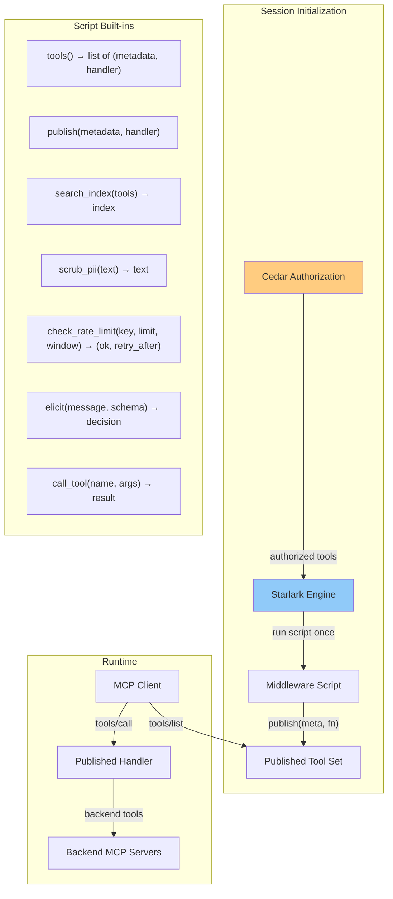
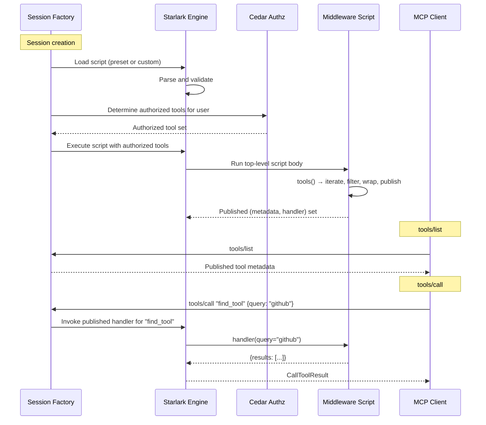

# THV-0059: Starlark as Programmable Middleware for vMCP

- **Status**: Draft
- **Author(s)**: Jeremy Drouillard (@jerm-dro)
- **Created**: 2026-03-24
- **Last Updated**: 2026-03-24
- **Target Repository**: toolhive
- **Related Issues**: [stacklok-epics#213](https://github.com/stacklok/stacklok-epics/issues/213)
- **Supersedes**: [THV-0051 (Starlark Scripted Tools)](./THV-0051-starlark-scripted-tools.md) — this RFC extends THV-0051's scope from composite tool replacement to a unified middleware programming model

## Summary

Extend vMCP's Starlark engine from a composite-tool-only scripting layer into a general-purpose programmable middleware surface. A single Starlark script runs once per session. It receives the list of authorized backend tools as `(metadata, handler)` tuples and calls `publish()` to declare what the agent sees — optionally wrapping handlers with additional logic. This replaces the trajectory of adding independent config knobs for each new behavior — knobs that interact in ways that are difficult to predict, test, and explain.

## Problem Statement

### Config knob proliferation

vMCP's feature set is growing. Each feature has arrived with its own configuration surface:

| Feature | Config surface | Introduced in |
|---------|---------------|---------------|
| Tool advertising filter | `aggregation.tools[].filter`, `excludeAll` | THV-0008 |
| Tool renaming / overrides | `aggregation.tools[].overrides` | THV-0008 |
| Conflict resolution | `aggregation.conflictResolution` | THV-0008 |
| Composite tools | `compositeTools[]`, `compositeToolRefs[]` | THV-0008 |
| Optimizer | `optimizer` (embedding service URL, thresholds, max results) | THV-0022 |
| Starlark scripted tools | `scriptedTools[]`, `scriptedToolRefs[]` | THV-0051 |
| Rate limiting | `rateLimiting.perUser`, `rateLimiting.global`, `rateLimiting.tools[]` | THV-0057 |
| Dynamic webhooks | `validating_webhooks[]`, `mutating_webhooks[]` | THV-0017 |

Each knob is individually reasonable. The problem is their **interaction**. Today:

- The optimizer replaces the entire tool list with `find_tool` / `call_tool`, but `find_tool`'s description is static and doesn't reflect the actual tools available — agents don't know what to search for (see [Slack thread](https://stacklok.slack.com/archives/C09L9QF47EU/p1774392171855569)).
- The advertising filter runs before composite tools, causing a [type coercion bug](https://github.com/stacklok/toolhive/issues/4287) (RFC-0058 fixes the ordering, but the fact that the bug existed shows how opaque the interaction is).
- Rate limiting (THV-0057) adds per-tool limits via yet another config block that must reference the same tool names that may have been renamed by overrides.
- There is no mechanism to express cross-cutting policies like "tools without a `readOnly` annotation must only be invokable via a composite tool that includes an elicitation step."

Every new capability doubles the interaction matrix. Administrators who need non-trivial configurations must understand the ordering and interaction of all these knobs — a burden that scales poorly.

### The optimizer discoverability problem

The Slack thread on optimizer quality highlights a concrete symptom: agents don't use `find_tool` because its description doesn't tell them what tools are available behind it. The proposed fix — dynamically generating `find_tool`'s description based on available tools — is a special case of a general need: the ability to programmatically control what the agent sees and how it's described.

A config knob for "optimizer description template" would fix this one case. But the next request will be "I want the optimizer to group tools by category" or "I want different descriptions per persona." Each becomes another knob.

### Who is affected

- **Platform administrators** who configure vMCP for multi-tenant deployments and need predictable behavior from feature combinations.
- **Enterprise integrators** who need custom policies (PII scrubbing, approval workflows, tool restrictions) but don't want to fork ToolHive or maintain webhook services for simple logic.
- **The vMCP development team** who must reason about the interaction of every new feature with every existing feature.

### Why this is worth solving now

THV-0051 already introduces Starlark for composite tools. Before that engine ships, we should decide whether Starlark is *only* for composite tools or whether it's the foundation for a unified middleware model. Shipping THV-0051 as-is and then later expanding scope would mean a second migration.

## Goals

- Define a Starlark-based programming model that subsumes tool advertising, renaming, optimizer behavior, and composite tool workflows into a single script that runs once per session
- Provide built-in functions for capabilities that would otherwise be config knobs: search indexing, PII scrubbing, rate limiting checks
- Maintain the invariant that **Starlark never sees tools the user is not authorized to use** — Cedar authorization remains the access control boundary
- Make the system accessible to non-power-users via built-in presets that replicate today's config-driven behavior
- Enable policies that span multiple features (e.g., "non-readonly tools require elicitation")

## Non-Goals

- Replacing Cedar for authorization decisions — Cedar remains the policy engine for access control
- A general-purpose plugin system for ToolHive beyond vMCP session behavior
- Replacing dynamic webhooks (THV-0017) — webhooks serve the external integration use case; Starlark serves the internal configuration use case
- Moving authentication or transport-level concerns into Starlark
- Supporting multiple scripting languages

## Proposed Solution

### High-Level Design

A vMCP persona runs a single Starlark **middleware script** once per session. The script receives authorized backend tools as `(metadata, handler)` tuples via `tools()`, and calls `publish()` to declare what the agent sees.



**Key invariant**: `tools()` returns only tools the current user is authorized to use. Cedar policies are evaluated *before* the Starlark script runs. The script operates within the authorization boundary, not outside it.

### The Programming Model

The script runs once when a session is created. `tools()` returns a list of tuples. Each tuple is `(metadata, handler)`:

- **`metadata`** is a struct with `name`, `description`, `parameters` (JSON Schema), `annotations` (dict), and `backend_id`
- **`handler`** is a callable `fn(**args) → result` that invokes the backend tool

`publish(metadata, handler)` adds a tool to the set the agent sees. The handler is called when the agent invokes that tool.

#### Simplest possible script

```python
# Publish everything the user is authorized to use. No modification.
for meta, fn in tools():
    publish(meta, fn)
```

#### Filtering tools

```python
for meta, fn in tools():
    if not meta.name.startswith("internal_"):
        publish(meta, fn)
```

#### Renaming tools

`metadata` is a simple struct. Create a new one with different fields:

```python
for meta, fn in tools():
    if meta.name == "pg_query":
        publish(
            metadata(name="database_query", description="Query the production database",
                     parameters=meta.parameters, annotations=meta.annotations),
            fn,
        )
    else:
        publish(meta, fn)
```

#### Decorating handlers

Since handlers are just functions, decoration is plain function wrapping:

```python
def with_pii_scrubbing(fn):
    """Wrap a handler to scrub PII from responses."""
    def wrapper(**args):
        result = fn(**args)
        if "text" in result:
            result["text"] = scrub_pii(result["text"])
        return result
    return wrapper

for meta, fn in tools():
    publish(meta, with_pii_scrubbing(fn))
```

Decorators compose naturally:

```python
for meta, fn in tools():
    wrapped = fn
    wrapped = with_rate_limit(wrapped, meta.name)
    wrapped = with_pii_scrubbing(wrapped)

    if not meta.annotations.get("readOnly", False):
        wrapped = with_approval_gate(wrapped, meta.name)

    publish(meta, wrapped)
```

The outermost wrapper runs first. This is just function composition — no special framework.

#### Defining new tools

Scripts can create entirely new tools by publishing a `metadata` with a Starlark handler function:

```python
publish(
    metadata(
        name="find_tool",
        description="Search for tools. Available: " + summary,
        parameters=FIND_TOOL_SCHEMA,
    ),
    lambda query: {"results": index.search(query)},
)
```

### Motivating Use Cases

#### Use Case 1: Dynamic optimizer descriptions

**Problem**: Agents don't use `find_tool` because its static description doesn't tell them what's available.

**Today's solution**: Manual description override or hope the agent figures it out.

**With programmable middleware**:

```python
all_tools = tools()
index = search_index(all_tools)

# Build a dynamic description from actual available tools
by_server = {}
for meta, fn in all_tools:
    server = meta.backend_id or "local"
    if server not in by_server:
        by_server[server] = 0
    by_server[server] += 1

desc_parts = ["%s (%d)" % (s, n) for s, n in by_server.items()]
summary = "Search for tools. Available servers: " + ", ".join(desc_parts)

publish(
    metadata(name="find_tool", description=summary, parameters=FIND_TOOL_SCHEMA),
    lambda query: {"results": index.search(query)},
)

publish(
    metadata(name="call_tool", description="Call a tool by name.",
             parameters=CALL_TOOL_SCHEMA),
    lambda tool_name, arguments: call_tool(tool_name, arguments),
)
```

When backends change and the session is recreated, the script re-runs and the description updates. A `tools/list_changed` notification is sent to clients that support it.

#### Use Case 2: Elicitation gate for write operations

**Problem**: An administrator wants to ensure that tools capable of mutation are never called without human confirmation.

**Today's solution**: Not possible without writing a custom composite tool wrapper for every write tool.

**With programmable middleware**:

```python
def with_approval_gate(fn, tool_name):
    def wrapper(**args):
        decision = elicit(
            "Tool '%s' may modify data. Approve?" % tool_name,
            schema={"type": "object", "properties": {"reason": {"type": "string"}}},
        )
        if decision.action != "accept":
            return {"error": "Declined by user"}
        return fn(**args)
    return wrapper

for meta, fn in tools():
    if not meta.annotations.get("readOnly", False):
        fn = with_approval_gate(fn, meta.name)
    publish(meta, fn)
```

A single policy, applied once, covering all tools.

#### Use Case 3: PII scrubbing

**Problem**: Tool responses may contain PII that should be redacted before reaching the agent.

**Today's solution**: Requires a mutating webhook (THV-0017) calling an external service.

**With programmable middleware**:

```python
def with_pii_scrubbing(fn):
    def wrapper(**args):
        result = fn(**args)
        if "text" in result:
            result["text"] = scrub_pii(result["text"])
        return result
    return wrapper

for meta, fn in tools():
    publish(meta, with_pii_scrubbing(fn))
```

`scrub_pii()` is a Go-implemented built-in that applies regex-based and NER-based entity detection. It handles common patterns (emails, phone numbers, SSNs, credit cards) without requiring an external service.

#### Use Case 4: Tool aggregation and renaming

**Problem**: An administrator wants to present a curated set of tools — renaming some, hiding others, grouping related tools under a single facade.

**Today's solution**: `aggregation.tools[].overrides` for renaming, `aggregation.tools[].filter` / `excludeAll` for hiding.

**With programmable middleware**:

```python
for meta, fn in tools():
    # Hide internal tools
    if meta.name.startswith("internal_"):
        continue

    # Rename for clarity
    if meta.name == "pg_query":
        publish(
            metadata(name="database_query", description="Query the production database",
                     parameters=meta.parameters, annotations=meta.annotations),
            fn,
        )
        continue

    # Skip Jira tools — we'll group them below
    if meta.name in ["jira_create", "jira_update", "jira_search"]:
        continue

    publish(meta, fn)

# Publish a composite Jira tool
def jira_handler(action, **args):
    if action == "create":
        return call_tool("jira_create", args)
    elif action == "update":
        return call_tool("jira_update", args)
    elif action == "search":
        return call_tool("jira_search", args)

publish(
    metadata(name="jira", description="Manage Jira issues: create, update, or search",
             parameters=JIRA_SCHEMA),
    jira_handler,
)
```

#### Use Case 5: Rate limiting with context-aware policies

**Problem**: Rate limits need to vary by tool sensitivity and user role.

**Today's solution**: THV-0057 provides static `requestsPerWindow` / `windowSeconds` per tool.

**With programmable middleware**:

```python
LIMITS = {
    "admin":    {"default": 1000, "expensive_search": 100},
    "standard": {"default": 100,  "expensive_search": 10},
}

def with_rate_limit(fn, tool_name):
    def wrapper(**args):
        user = current_user()
        role = user.groups[0] if user.groups else "standard"
        role_limits = LIMITS.get(role, LIMITS["standard"])
        limit = role_limits.get(tool_name, role_limits["default"])

        allowed, retry_after = check_rate_limit(
            key=user.sub + ":" + tool_name, limit=limit, window=60,
        )
        if not allowed:
            return {"error": "Rate limited", "retry_after": retry_after}
        return fn(**args)
    return wrapper

for meta, fn in tools():
    publish(meta, with_rate_limit(fn, meta.name))
```

`check_rate_limit()` is backed by the same Redis token bucket from THV-0057. The *policy* is expressed in Starlark; the *mechanism* lives in Go.

#### Use Case 6: Composing multiple concerns

A single script handles optimizer + elicitation gate + PII scrubbing + rate limiting — behaviors that today require four different config surfaces:

```python
all_tools = tools()
index = search_index(all_tools)
desc = build_summary(all_tools)

# Compose decorators for the call_tool dispatch path
def dispatch(tool_name, arguments):
    user = current_user()

    # Rate limit
    allowed, retry_after = check_rate_limit(
        key=user.sub + ":" + tool_name, limit=100, window=60,
    )
    if not allowed:
        return {"error": "Rate limited", "retry_after": retry_after}

    # Elicitation gate for non-readonly tools
    t = get_tool(tool_name)
    if t and not t.annotations.get("readOnly", False):
        decision = elicit("Approve call to '%s'?" % tool_name)
        if decision.action != "accept":
            return {"error": "Declined"}

    # Execute and scrub
    result = call_tool(tool_name, arguments)
    if "text" in result:
        result["text"] = scrub_pii(result["text"])
    return result

publish(
    metadata(name="find_tool", description=desc, parameters=FIND_TOOL_SCHEMA),
    lambda query: {"results": index.search(query)},
)

publish(
    metadata(name="call_tool", description="Call a tool by name.",
             parameters=CALL_TOOL_SCHEMA),
    dispatch,
)

def build_summary(tool_list):
    cats = {}
    for meta, fn in tool_list:
        cat = meta.annotations.get("category", "general")
        if cat not in cats:
            cats[cat] = []
        cats[cat].append(meta.name)
    return "Search for tools across: " + ", ".join(
        "%s (%d tools)" % (c, len(ns)) for c, ns in cats.items()
    )
```

The ordering is explicit. The interactions are visible. There are no surprising feature interactions because the administrator wrote the interaction.

### Built-in Functions

These are Go-implemented functions exposed to Starlark scripts.

#### Tool enumeration and publishing

| Built-in | Signature | Description |
|----------|-----------|-------------|
| `tools()` | `tools() → list[(metadata, handler)]` | Returns all authorized backend tools as `(metadata, handler)` tuples. `metadata` is a struct with `name`, `description`, `parameters`, `annotations`, `backend_id`. `handler` is a callable that invokes the backend. |
| `publish(meta, handler)` | `publish(metadata, callable) → None` | Adds a tool to the set visible to the agent. |
| `metadata(...)` | `metadata(name, description, parameters=None, annotations=None) → metadata` | Creates a new metadata struct. Used when renaming or defining new tools. |
| `get_tool(name)` | `get_tool(name) → metadata or None` | Looks up a specific authorized tool's metadata by name. |

#### Tool call execution

| Built-in | Signature | Description |
|----------|-----------|-------------|
| `call_tool(name, args)` | `call_tool(name, dict) → dict` | Calls a backend tool by name. Halts on error. |
| `try_call_tool(name, args)` | `try_call_tool(name, dict) → struct(ok, error, output)` | Calls a backend tool. Returns error info instead of halting. |
| `retry(fn, max_attempts, delay)` | `retry(fn, max_attempts=3, delay="1s") → any` | Retries a callable with exponential backoff. |
| `parallel(fns)` | `parallel(fns) → list` | Executes zero-argument callables concurrently. |

#### Middleware capabilities

| Built-in | Signature | Description |
|----------|-----------|-------------|
| `search_index(tools)` | `search_index(list[(metadata, handler)]) → SearchIndex` | Builds a semantic search index over the tool list. Returns an object with `.search(query) → list[dict]`. |
| `scrub_pii(text)` | `scrub_pii(text) → string` | Redacts PII patterns (emails, phones, SSNs, credit cards) from text. |
| `check_rate_limit(key, limit, window)` | `check_rate_limit(key, limit, window) → (bool, int)` | Checks a token bucket counter in Redis. Returns `(allowed, retry_after_seconds)`. |
| `elicit(message, schema)` | `elicit(message, schema={}) → struct(action, content)` | Prompts the user for a decision via MCP elicitation. |
| `current_user()` | `current_user() → struct(sub, email, groups)` | Returns the authenticated user's identity. |
| `log(message)` | `log(message) → None` | Emits a structured audit log entry. |

### Presets: Making it Easy for Non-Power-Users

The critical question is: how do people who don't want to write Starlark still use vMCP?

**Answer: presets.** A preset is a named, built-in Starlark script that replicates the behavior of today's config knobs. Existing config fields become parameters to the preset.

Today's `Config` struct has top-level fields: `aggregation`, `compositeTools`, `compositeToolRefs`, and `optimizer`. The new `middleware` field sits alongside them:

```go
type Config struct {
    // ... existing fields unchanged ...
    Aggregation    *AggregationConfig    `json:"aggregation,omitempty"`
    CompositeTools []CompositeToolConfig `json:"compositeTools,omitempty"`
    Optimizer      *OptimizerConfig      `json:"optimizer,omitempty"`

    // New field
    Middleware     *MiddlewareConfig      `json:"middleware,omitempty"`
}
```

When `middleware` is set, it takes precedence over `aggregation`, `compositeTools`, and `optimizer`. When it is absent, those fields continue to work exactly as today — no behavior change for existing deployments.

#### Config surface

```yaml
# Option 1: Use a preset (maps to existing config patterns)
middleware:
  preset: "standard"

# Option 2: Preset with parameters (replacing today's config knobs)
middleware:
  preset: "optimizer"
  config:
    optimizer:
      embeddingService: "http://embedding-server:8080"
      maxToolsToReturn: 8
      hybridSearchSemanticRatio: "0.5"
    aggregation:
      tools:
        - workload: "backend-a"
          excludeAll: true
        - workload: "backend-b"
          filter: ["search", "query"]
          overrides:
            search:
              name: "global_search"
              description: "Search across all sources"
    piiScrubbing:
      enabled: true
    rateLimiting:
      perUser:
        requestsPerWindow: 100
        windowSeconds: 60

# Option 3: Custom script (power users)
middleware:
  script: |
    for meta, fn in tools():
        publish(meta, fn)

# Option 4: External script file
middleware:
  scriptFile: "middleware/policy.star"
```

The `config` block under a preset accepts the same structure as today's top-level config fields (`aggregation`, `optimizer`) plus new fields (`piiScrubbing`, `rateLimiting`). The preset script reads these via `config()` and translates them into the appropriate `publish()` calls and handler decorations.

#### Built-in presets

| Preset | Behavior | Today's equivalent |
|--------|----------|--------------------|
| `passthrough` | Publishes all authorized tools unmodified. | No `aggregation`, no `optimizer` |
| `standard` | Applies filtering, renaming, conflict resolution, and optional rate limiting from `config`. | `aggregation` + `compositeTools` |
| `optimizer` | Publishes `find_tool` / `call_tool` with dynamic descriptions, applying filtering/renaming from `config`. Supports PII scrubbing and rate limiting. | `aggregation` + `optimizer` |

Users can inspect what a preset does:

```bash
thv vmcp show-preset optimizer
```

This prints the Starlark source, making the preset transparent and forkable. A user who needs 90% of a preset's behavior can copy it and modify the 10% they need.

#### Migration path

When no `middleware` block is present but `aggregation`, `compositeTools`, or `optimizer` fields exist, vMCP behaves exactly as today — the existing code paths run. No deprecation, no behavior change.

When a user wants to adopt programmable middleware, they add a `middleware` block. At that point, `aggregation`, `compositeTools`, and `optimizer` are ignored (if both are present, vMCP logs a warning). A `thv vmcp migrate-config` command generates the equivalent `middleware` block from the existing config.

### Detailed Design

#### Script lifecycle



The script runs **once** per session, not per request. `publish()` calls build up the tool set. Handlers are stored and invoked later when the agent makes `tools/call` requests.

#### Where this fits in the architecture

The Starlark middleware replaces the current decorator stack for tool-level concerns:

```
Current decorator stack:           New model:

  optimizer decorator               Starlark middleware
   filter decorator                   (subsumes all of these)
    composite tools decorator
     base session                    base session
```

The base session's routing table, conflict resolution, and backend name reversal (from RFC-0058) remain unchanged. The Starlark middleware sees post-resolution tool names.

Concretely, the Starlark engine is a single session decorator that:
- Runs the script at session creation, collecting `publish()` calls
- Returns published tool metadata for `Tools()` calls
- Dispatches `CallTool()` to the published handler for the requested tool

#### Interaction with Cedar authorization

Cedar policies operate at the HTTP middleware layer. The Starlark engine receives only authorized tools:

1. Authentication middleware extracts user identity
2. Cedar middleware evaluates policies, determines authorized tools
3. Session layer receives authorized tool set
4. `tools()` returns only tools that passed Cedar
5. `call_tool()` delegates to the base session, which enforces the routing table

If a script attempts `call_tool("secret_admin_tool", ...)` for an unauthorized user, the base session rejects it. The script cannot escalate privileges.

#### Interaction with dynamic webhooks

Webhooks (THV-0017) and Starlark middleware serve different purposes at different layers:

- **Webhooks** integrate **external systems** at the HTTP middleware layer
- **Starlark** configures **vMCP-internal behavior** at the session layer

Both coexist. A request passes through webhooks first (external policy), then reaches the Starlark-published handler (internal routing).

#### Interaction with rate limiting

THV-0057's Redis-backed token bucket is the *mechanism*. `check_rate_limit()` exposes it to scripts. The *policy* can be:

1. **Config-driven**: The `standard` / `optimizer` presets read `rateLimiting` from `config` and call `check_rate_limit()` internally
2. **Script-driven**: Custom scripts implement context-aware rate limiting

### API Changes

#### New config fields

```go
type MiddlewareConfig struct {
    // Preset is a named built-in middleware script.
    // One of: "passthrough", "standard", "optimizer".
    Preset string `json:"preset,omitempty" yaml:"preset,omitempty"`

    // Config is passed to the preset script via config().
    // Accepts the same structure as today's aggregation, optimizer, etc.
    Config *MiddlewarePresetConfig `json:"config,omitempty" yaml:"config,omitempty"`

    // Script is inline Starlark source. Mutually exclusive with Preset and ScriptFile.
    Script string `json:"script,omitempty" yaml:"script,omitempty"`

    // ScriptFile is a path to a .star file. Mutually exclusive with Preset and Script.
    ScriptFile string `json:"scriptFile,omitempty" yaml:"scriptFile,omitempty"`
}

type MiddlewarePresetConfig struct {
    Aggregation  *AggregationConfig `json:"aggregation,omitempty"`
    Optimizer    *OptimizerConfig   `json:"optimizer,omitempty"`
    PIIScrubbing *PIIScrubConfig    `json:"piiScrubbing,omitempty"`
    RateLimiting *RateLimitConfig   `json:"rateLimiting,omitempty"`
}
```

#### Existing config fields: no change

`aggregation`, `compositeTools`, `compositeToolRefs`, and `optimizer` remain on `Config` and work exactly as today when `middleware` is absent. When `middleware` is present, they are ignored (with a warning if both exist).

#### New CRD

`VirtualMCPMiddlewareScript` — references a Starlark middleware script from a ConfigMap:

```yaml
apiVersion: toolhive.stacklok.com/v1alpha1
kind: VirtualMCPMiddlewareScript
metadata:
  name: my-org-middleware
spec:
  configMapRef:
    name: vmcp-middleware-scripts
    key: policy.star
```

## Security Considerations

### Threat Model

| Threat | Description | Severity |
|--------|-------------|----------|
| **Privilege escalation via script** | Script calls `call_tool()` for an unauthorized tool | High |
| **Denial of service via infinite loop** | Script with `while True` or deep recursion | High |
| **Tool list manipulation** | Script publishes tools that shouldn't be visible | Medium |
| **Decorator bypass** | Script omits `scrub_pii()` or `check_rate_limit()` | Medium |
| **Resource exhaustion** | Script builds large data structures | High |

### Authentication and Authorization

**Cedar remains the authorization boundary.** The Starlark engine cannot circumvent it:

- `tools()` returns only Cedar-authorized tools
- `call_tool()` delegates to the base session's `CallTool()`, which checks the routing table built from Cedar-authorized tools only
- `publish()` can publish tools from `tools()` or new tools whose handlers use `call_tool()` — which is Cedar-gated

**Trust model**: Middleware scripts are written by administrators, not end users. An administrator who can write a Starlark script already has the authority to configure vMCP.

### Data Security

- Scripts cannot access filesystem, network, or environment variables (Starlark sandbox)
- `scrub_pii()` operates on the Go side with auditable patterns
- Tool call results transit through handlers; administrators are trusted (same model as webhook config)

### Input Validation

- Scripts are parsed and validated at config load time
- `publish()` validates metadata (non-empty name, valid JSON Schema)
- Built-in arguments are validated in Go

### Secrets Management

Scripts have no access to secrets. Backend authentication is handled below the script's view.

### Audit and Logging

- Each `publish()` logged (tool name, source: backend or script-defined)
- Each handler invocation logged (tool name, duration, outcome)
- Each `check_rate_limit()` logged (key, limit, decision)
- Each `scrub_pii()` logged (redaction count)
- Each `elicit()` logged (prompt, action, duration)

### Mitigations

| Threat | Mitigation |
|--------|-----------|
| Privilege escalation | `tools()` and `call_tool()` are Cedar-gated |
| DoS via loops | Execution step limit (default 1M), context timeout (same as THV-0051) |
| Tool list manipulation | `publish()` only surfaces tools from `tools()` or script-defined tools; audit logs record every call |
| Decorator bypass | Presets include scrubbing/rate limiting when configured; custom scripts are admin's responsibility |
| Resource exhaustion | Execution step limit, memory monitoring (same as THV-0051) |

## Alternatives Considered

### Alternative 1: Keep adding config knobs

- **Pros**: No new concepts for simple cases
- **Cons**: Interaction matrix grows quadratically. Bugs like #4287 from non-obvious interactions. Testing becomes intractable.
- **Why not chosen**: Already causing problems at current feature count.

### Alternative 2: Starlark for composite tools only (THV-0051 as-is)

- **Pros**: Smaller scope
- **Cons**: Misses the opportunity to unify. Interaction problem remains for optimizer + filter + rate limiting. Expanding scope later means a second migration.
- **Why not chosen**: Design for the broader use case from day one.

### Alternative 3: Use webhooks for everything

- **Pros**: Maximum flexibility, language-agnostic
- **Cons**: External services for simple policies. Network latency on every call. Overkill for "hide these tools."
- **Why not chosen**: Webhooks for external integration, Starlark for internal configuration. Both should exist.

### Alternative 4: OPA / Rego instead of Starlark

- **Pros**: Established policy language
- **Cons**: Rego is for boolean decisions (allow/deny), not programmatic composition. Expressing "publish a search tool with a dynamic description" would be extremely awkward. We already use Cedar for authz.
- **Why not chosen**: Wrong abstraction — we need a programming model, not a policy language.

## Compatibility

### Backward Compatibility

All existing config fields continue to work unchanged. `middleware` is a new, optional field. When absent, existing code paths run. No deprecation of existing fields in this RFC — they remain first-class until the ecosystem has adopted programmable middleware.

When `middleware` is present, `aggregation`, `compositeTools`, and `optimizer` are ignored. If both are set, vMCP logs a warning.

### Forward Compatibility

New built-in functions can be added without breaking existing scripts. New presets can be added alongside existing ones. The `config` map on presets uses the same types as existing config, so new config fields are automatically available.

## Implementation Plan

### Phase 1: Core engine — `tools()`, `publish()`, `metadata()`

- Extend the Starlark engine from THV-0051 with `tools()`, `publish()`, `metadata()`, `get_tool()` built-ins
- Implement the session decorator that collects `publish()` calls and dispatches `CallTool()` to handlers
- Implement `passthrough` preset
- Config model: `middleware.preset`, `middleware.script`, `middleware.scriptFile`
- Unit tests, integration test for tool publishing and handler dispatch

### Phase 2: Built-in capabilities and presets

- Port `search_index()` from current optimizer implementation
- Implement `scrub_pii()` built-in
- Implement `check_rate_limit()` built-in (backed by THV-0057's Redis token bucket)
- Implement `standard` and `optimizer` presets with `config` parameter support
- Integration tests for each built-in, E2E tests for presets in K8s

### Phase 3: Migration tooling

- Implement `thv vmcp migrate-config` CLI command
- Implement `thv vmcp show-preset` command
- Port existing tests to validate preset equivalence with old config paths
- Documentation

### Phase 4: Cleanup (future)

- Remove optimizer, filter, and composite tools decorators
- Consolidated test suite

### Dependencies

- THV-0051 (Starlark engine core) — base engine, value converter, `call_tool`, `try_call_tool`, `retry`, `parallel`, `elicit`, `log`
- THV-0058 (aggregator decomposition) — clean base session for the decorator to sit on
- THV-0057 (rate limiting) — Redis token bucket for `check_rate_limit()`

## Testing Strategy

- **Unit tests**: Each built-in in isolation. Handler wrapping / function composition. `publish()` validation. Preset loading and config injection.
- **Integration tests**: Full script execution with mock backends. Decorator chains. Composite tool handlers via `call_tool()`. Optimizer pattern with `search_index()`.
- **E2E tests**: Preset configuration in K8s. Custom scripts via ConfigMap. Old config → middleware migration.
- **Security tests**: `tools()` respects Cedar. `call_tool()` rejects unauthorized tools. Step limits. Memory.
- **Preset equivalence tests**: For each preset, verify behavior matches the old config-driven feature it replaces.

## Documentation

- **User guide**: Writing middleware scripts, built-in reference, decorator patterns
- **Preset reference**: What each preset does, parameters, `show-preset` and forking
- **Migration guide**: From old config knobs to middleware presets or custom scripts
- **Architecture docs**: Updated vMCP architecture with middleware model
- **CRD reference**: `VirtualMCPMiddlewareScript`

## Open Questions

1. **Handler argument passing**: Should handlers receive keyword arguments (`fn(**args)`) or a single dict (`fn(args)`)? Keyword args are more Pythonic but Starlark's `**kwargs` support varies. A single dict matches `call_tool(name, args)` and is simpler.

2. **Should presets be composable?** Could a user layer multiple presets, or is a single preset + config sufficient? Multiple presets add complexity in ordering and config conflicts.

3. **Hot reloading**: Should ConfigMap updates to scripts trigger live session recreation? Convenient but complex (re-validation, in-flight calls).

4. **Interaction with existing `compositeTools` during migration**: Should middleware scripts be able to `load()` composite tool definitions from CRDs, or must everything be consolidated into the script?

5. **Custom PII patterns**: Should `scrub_pii()` accept custom regex patterns (e.g., internal employee ID formats), or is the built-in set sufficient?

6. **Thread safety of `parallel()`**: When `parallel()` invokes handlers that themselves call `call_tool()`, each goroutine needs its own Starlark thread. The engine must ensure published handlers are safe to call concurrently.

## References

- [THV-0051: Starlark Scripted Tools](./THV-0051-starlark-scripted-tools.md) — original Starlark RFC
- [THV-0058: Inline Aggregator, Extract Filter Decorator](./THV-0058-inline-aggregator-filter-decorator.md) — aggregator decomposition
- [THV-0057: Rate Limiting](./THV-0057-rate-limiting.md) — rate limiting mechanism
- [THV-0017: Dynamic Webhook Middleware](./THV-0017-dynamic-webhook-middleware.md) — external webhook integration
- [stacklok-epics#213](https://github.com/stacklok/stacklok-epics/issues/213) — Dynamic Webhook Middleware epic
- [Optimizer discoverability discussion](https://stacklok.slack.com/archives/C09L9QF47EU/p1774392171855569) — Slack thread
- [Starlark Language Specification](https://github.com/bazelbuild/starlark/blob/master/spec.md)
- [starlark-go Implementation](https://github.com/google/starlark-go)

---

## RFC Lifecycle

### Review History

| Date | Reviewer | Decision | Notes |
|------|----------|----------|-------|
| 2026-03-24 | @jerm-dro | Draft | Initial submission |

### Implementation Tracking

| Repository | PR | Status |
|------------|-----|--------|
| toolhive | TBD | Not started |
