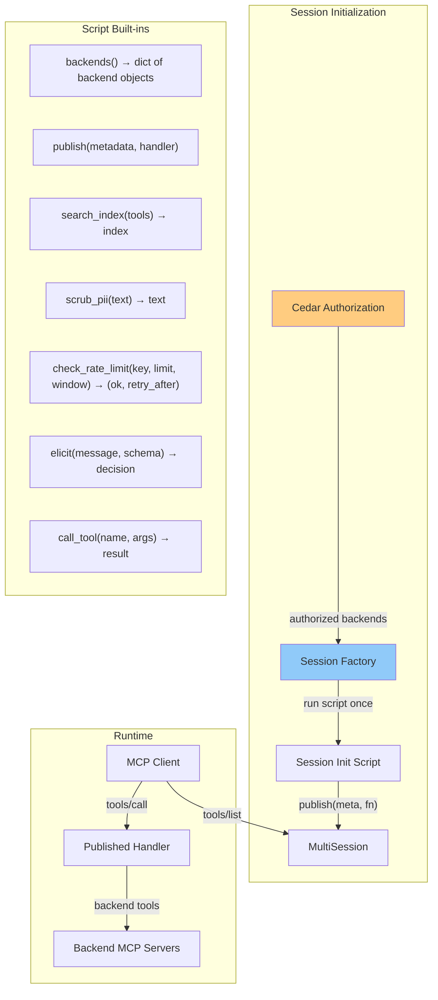
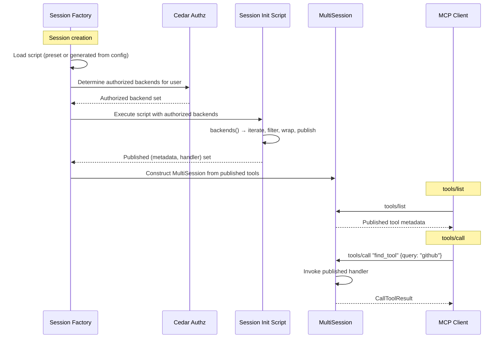

# THV-0059: Starlark Session Initialization for vMCP

- **Status**: Draft
- **Author(s)**: Jeremy Drouillard (@jerm-dro)
- **Created**: 2026-03-24
- **Last Updated**: 2026-03-25
- **Target Repository**: toolhive
- **Related Issues**: [stacklok-epics#213](https://github.com/stacklok/stacklok-epics/issues/213)
- **Related**: [THV-0051 (Starlark Scripted Tools)](./THV-0051-starlark-scripted-tools.md) — this RFC broadens the scope of Starlark in vMCP from composite tool workflows to a unified session initialization model

## Summary

Introduce a Starlark-based session initialization script for vMCP. A single script runs once per session, receives the authorized backends and their capabilities, and calls `publish()` to declare what the agent sees — optionally wrapping handlers with additional logic. This replaces the growing set of independent config knobs (aggregation, optimizer, filtering, rate limiting) whose combinations interact in ways that are difficult to predict, test, and explain.

## Problem Statement

### Config knob combinations

vMCP's feature set is growing. Each feature has arrived with its own configuration surface. The problem is not just the number of knobs, but that they have subtle dependencies on each other: conflict resolution and aggregation change tool names, filtering changes which tools are available at different points in the pipeline, and downstream config blocks (rate limiting, composite tools) must reference tool names that earlier config blocks may have renamed or removed. The result is that configuring one feature correctly requires understanding the side effects of every other feature:

| Feature | Config surface | Introduced in |
|---------|---------------|---------------|
| Tool advertising filter | `aggregation.tools[].filter`, `excludeAll` | THV-0008 |
| Tool renaming / overrides | `aggregation.tools[].overrides` | THV-0008 |
| Conflict resolution | `aggregation.conflictResolution` | THV-0008 |
| Composite tools | `compositeTools[]`, `compositeToolRefs[]` | THV-0008 |
| Optimizer | `optimizer` (embedding service URL, thresholds, max results) | THV-0022 |
| Starlark scripted tools | `scriptedTools[]`, `scriptedToolRefs[]` | THV-0051 (proposed) |
| Rate limiting | `rateLimiting.perUser`, `rateLimiting.global`, `rateLimiting.tools[]` | THV-0057 (proposed) |
| Dynamic webhooks | `validating_webhooks[]`, `mutating_webhooks[]` | THV-0017 (proposed) |

Each knob is individually reasonable. The problem is their **interaction**. Today:

- The optimizer replaces the entire tool list with `find_tool` / `call_tool`, but `find_tool`'s description is static — agents don't know what tools they might find behind it (see [Slack thread](https://stacklok.slack.com/archives/C09L9QF47EU/p1774392171855569)).
- The advertising filter runs before composite tools, causing a [type coercion bug](https://github.com/stacklok/toolhive/issues/4287) (RFC-0058 fixes the ordering, but the fact that the bug existed shows how opaque the interaction is).
- Rate limiting (THV-0057) adds per-tool limits via yet another config block that must reference the same tool names that may have been renamed by overrides.
- There is no mechanism to express cross-cutting policies like "tools without a `readOnly` annotation must only be invokable via a composite tool that includes an elicitation step."

Every new capability doubles the interaction matrix. Administrators who need non-trivial configurations must understand the ordering and interaction of all these knobs — a burden that scales poorly.

### The optimizer discoverability problem

The Slack thread on optimizer quality highlights a concrete symptom: agents don't use `find_tool` because its description doesn't tell them what tools are available behind it. The proposed fix — dynamically generating `find_tool`'s description based on available tools — is a special case of a general need: the ability to programmatically control what the agent sees and how it's described.

A config knob for "optimizer description template" would fix this one case. But the next request will be "I want the optimizer to group tools by category" or "I want different descriptions per persona." Each becomes another knob.

### Who is affected

- **Platform administrators** who configure vMCP for multi-tenant deployments and need predictable behavior from feature combinations.
- **Enterprise integrators** who need custom policies (PII scrubbing, approval workflows, tool restrictions) but don't want to fork ToolHive or maintain webhook services for simple logic.
- **The vMCP development team** who must reason about the interaction of every new feature with every existing feature.

### Why this is worth solving now

THV-0051 proposes Starlark for composite tools. Before that engine ships, we should decide whether Starlark is *only* for composite tools or whether it's the foundation for a unified session initialization model. Shipping THV-0051 as-is and then later expanding scope would mean a second migration.

## Goals

- Define a Starlark-based programming model that subsumes tool advertising, renaming, optimizer behavior, and composite tool workflows into a single script that runs once per session
- Provide built-in functions for capabilities that would otherwise be config knobs: search indexing, PII scrubbing, rate limiting checks
- Maintain the invariant that **Starlark never sees tools the user is not authorized to use** — Cedar authorization remains the access control boundary
- Make the system accessible to non-power-users via built-in presets that replicate today's config-driven behavior
- Enable policies that span multiple features (e.g., "non-readonly tools require elicitation")
- Maintain full backward compatibility with existing config fields — the session initialization script must be able to replicate every behavior currently achievable via `aggregation`, `optimizer`, and related config (except legacy composite tools, which are replaced by Starlark scripts from THV-0051)

## Non-Goals

- Replacing Cedar for authorization decisions — Cedar remains the policy engine for access control
- A general-purpose plugin system for ToolHive beyond vMCP session behavior
- Replacing dynamic webhooks (THV-0017) — webhooks serve the external integration use case; Starlark serves the internal configuration use case
- Moving authentication or transport-level concerns into Starlark
- Supporting multiple scripting languages

## Proposed Solution

### High-Level Design

A vMCP persona runs a single Starlark **session initialization script** once per session. The script receives the authorized backends via `backends()` — a dict keyed by backend name, where each value exposes the backend's tools, resources, and prompts. The script calls `publish()` to declare what the agent sees.



**Key invariant**: `backends()` returns only backends and capabilities the current user is authorized to use. Cedar policies are evaluated *before* the script runs. The script operates within the authorization boundary, not outside it.

### The Programming Model

The script runs once when a session is created. `backends()` returns a dict keyed by backend name. Each backend object exposes:

- **`backend.tools()`** — returns a list of `(metadata, handler)` tuples for the backend's tools
- **`backend.resources()`** — returns the backend's resources (future use)
- **`backend.prompts()`** — returns the backend's prompts (future use)

Each tool tuple is `(metadata, handler)`:

- **`metadata`** is a struct with `name`, `description`, `parameters` (JSON Schema), `annotations` (dict), and `backend_id`
- **`handler`** is a callable `fn(args) → result` that invokes the backend tool. `args` is a dict of named arguments.

`publish(metadata, handler)` adds a tool to the set the agent sees. The handler is called when the agent invokes that tool.

#### Simplest possible script

```python
# Publish everything the user is authorized to use. No modification.
for name, backend in backends().items():
    for meta, fn in backend.tools():
        publish(meta, fn)
```

#### Filtering tools

```python
for name, backend in backends().items():
    for meta, fn in backend.tools():
        if not meta.name.startswith("internal_"):
            publish(meta, fn)
```

#### Handling name collisions across backends

Because the script sees which backend each tool comes from, it can handle collisions explicitly — no need for a separate `conflictResolution` config:

```python
for name, backend in backends().items():
    for meta, fn in backend.tools():
        # Prefix tools from all backends except the primary
        if name != "primary":
            meta = metadata(
                name = name + "_" + meta.name,
                description = meta.description,
                parameters = meta.parameters,
                annotations = meta.annotations,
            )
        publish(meta, fn)
```

#### Renaming tools

`metadata` is a simple struct. To rename, create a new metadata explicitly passing all fields — `annotations` and `parameters` are required to prevent accidentally dropping them:

```python
for name, backend in backends().items():
    for meta, fn in backend.tools():
        if meta.name == "pg_query":
            publish(
                metadata(name="database_query", description="Query the production database",
                         parameters=meta.parameters, annotations=meta.annotations),
                fn,
            )
        else:
            publish(meta, fn)
```

#### Decorating handlers

Since handlers are just functions, decoration is plain function wrapping:

```python
def with_pii_scrubbing(fn):
    """Wrap a handler to scrub PII from responses."""
    def wrapper(args):
        result = fn(args)
        if "text" in result:
            result["text"] = scrub_pii(result["text"])
        return result
    return wrapper

for name, backend in backends().items():
    for meta, fn in backend.tools():
        publish(meta, with_pii_scrubbing(fn))
```

Decorators compose naturally:

```python
for name, backend in backends().items():
    for meta, fn in backend.tools():
        wrapped = fn
        wrapped = with_rate_limit(wrapped, meta.name)
        wrapped = with_pii_scrubbing(wrapped)

        if not meta.annotations.get("readOnly", False):
            wrapped = with_approval_gate(wrapped, meta.name)

        publish(meta, wrapped)
```

The outermost wrapper runs first. This is just function composition — no special framework.

#### Defining new tools

Scripts can create entirely new tools by publishing a `metadata` with a Starlark handler function:

```python
publish(
    metadata(
        name="find_tool",
        description="Search for tools. Available: " + summary,
        parameters=FIND_TOOL_SCHEMA,
        annotations={},
    ),
    lambda args: {"results": index.search(args["query"])},
)
```

### Motivating Use Cases

#### Use Case 1: Dynamic optimizer descriptions

**Problem**: Agents don't use `find_tool` because its static description doesn't tell them what's available.

**Today's solution**: Manual description override or hope the agent figures it out.

**With session initialization script**:

```python
all_tools = []
for name, backend in backends().items():
    all_tools += backend.tools()

index = search_index(all_tools)

# Build a dynamic description from actual available backends
desc_parts = []
for name, backend in backends().items():
    n = len(backend.tools())
    desc_parts.append("%s (%d tools)" % (name, n))

summary = "Search for tools. Available: " + ", ".join(desc_parts)

publish(
    metadata(name="find_tool", description=summary,
             parameters=FIND_TOOL_SCHEMA, annotations={}),
    lambda args: {"results": index.search(args["query"])},
)

publish(
    metadata(name="call_tool", description="Call a tool by name.",
             parameters=CALL_TOOL_SCHEMA, annotations={}),
    lambda args: call_tool(args["tool_name"], args["arguments"]),
)
```

When backends change and the session is recreated, the script re-runs and the description updates. A `tools/list_changed` notification is sent to clients that support it.

#### Use Case 2: Elicitation gate for write operations

**Problem**: An administrator wants to ensure that tools capable of mutation are never called without human confirmation.

**Today's solution**: Not possible without writing a custom composite tool wrapper for every write tool.

**With session initialization script**:

```python
def with_approval_gate(fn, tool_name):
    def wrapper(args):
        decision = elicit(
            "Tool '%s' may modify data. Approve?" % tool_name,
            schema={"type": "object", "properties": {"reason": {"type": "string"}}},
        )
        if decision.action != "accept":
            return {"error": "Declined by user"}
        return fn(args)
    return wrapper

for name, backend in backends().items():
    for meta, fn in backend.tools():
        if not meta.annotations.get("readOnly", False):
            fn = with_approval_gate(fn, meta.name)
        publish(meta, fn)
```

A single policy, applied once, covering all tools.

#### Use Case 3: PII scrubbing

**Problem**: Tool responses may contain PII that should be redacted before reaching the agent.

**Today's solution**: Requires a mutating webhook (THV-0017) calling an external service.

**With session initialization script**:

```python
def with_pii_scrubbing(fn):
    def wrapper(args):
        result = fn(args)
        if "text" in result:
            result["text"] = scrub_pii(result["text"])
        return result
    return wrapper

for name, backend in backends().items():
    for meta, fn in backend.tools():
        publish(meta, with_pii_scrubbing(fn))
```

`scrub_pii()` is a Go-implemented built-in that applies regex-based and NER-based entity detection. It handles common patterns (emails, phone numbers, SSNs, credit cards) without requiring an external service.

#### Use Case 4: Tool aggregation and renaming

**Problem**: An administrator wants to present a curated set of tools — renaming some, hiding others, grouping related tools under a single facade.

**Today's solution**: `aggregation.tools[].overrides` for renaming, `aggregation.tools[].filter` / `excludeAll` for hiding.

**With session initialization script**:

```python
for name, backend in backends().items():
    for meta, fn in backend.tools():
        # Hide internal tools
        if meta.name.startswith("internal_"):
            continue

        # Rename for clarity
        if meta.name == "pg_query":
            publish(
                metadata(name="database_query", description="Query the production database",
                         parameters=meta.parameters, annotations=meta.annotations),
                fn,
            )
            continue

        # Skip Jira tools — we'll group them below
        if meta.name in ["jira_create", "jira_update", "jira_search"]:
            continue

        publish(meta, fn)

# Publish a composite Jira tool
def jira_handler(args):
    action = args["action"]
    if action == "create":
        return call_tool("jira_create", args)
    elif action == "update":
        return call_tool("jira_update", args)
    elif action == "search":
        return call_tool("jira_search", args)

publish(
    metadata(name="jira", description="Manage Jira issues: create, update, or search",
             parameters=JIRA_SCHEMA, annotations={}),
    jira_handler,
)
```

#### Use Case 5: Rate limiting with context-aware policies

**Problem**: Rate limits need to vary by tool sensitivity and user role.

**Today's solution**: THV-0057 provides static `requestsPerWindow` / `windowSeconds` per tool.

**With session initialization script**:

```python
LIMITS = {
    "admin":    {"default": 1000, "expensive_search": 100},
    "standard": {"default": 100,  "expensive_search": 10},
}

def with_rate_limit(fn, tool_name):
    def wrapper(args):
        user = current_user()
        role = user.groups[0] if user.groups else "standard"
        role_limits = LIMITS.get(role, LIMITS["standard"])
        limit = role_limits.get(tool_name, role_limits["default"])

        allowed, retry_after = check_rate_limit(
            key=user.sub + ":" + tool_name, limit=limit, window=60,
        )
        if not allowed:
            return {"error": "Rate limited", "retry_after": retry_after}
        return fn(args)
    return wrapper

for name, backend in backends().items():
    for meta, fn in backend.tools():
        publish(meta, with_rate_limit(fn, meta.name))
```

`check_rate_limit()` is backed by the same Redis token bucket from THV-0057. The *policy* is expressed in Starlark; the *mechanism* lives in Go.

#### Use Case 6: Composing multiple concerns

A single script handles optimizer + elicitation gate + PII scrubbing + rate limiting — behaviors that today require four different config surfaces:

```python
all_tools = []
for name, backend in backends().items():
    all_tools += backend.tools()

index = search_index(all_tools)
desc = build_summary(all_tools)

def dispatch(args):
    tool_name = args["tool_name"]
    arguments = args["arguments"]
    user = current_user()

    # Rate limit
    allowed, retry_after = check_rate_limit(
        key=user.sub + ":" + tool_name, limit=100, window=60,
    )
    if not allowed:
        return {"error": "Rate limited", "retry_after": retry_after}

    # Elicitation gate for non-readonly tools
    t = get_tool(tool_name)
    if t and not t.annotations.get("readOnly", False):
        decision = elicit("Approve call to '%s'?" % tool_name)
        if decision.action != "accept":
            return {"error": "Declined"}

    # Execute and scrub
    result = call_tool(tool_name, arguments)
    if "text" in result:
        result["text"] = scrub_pii(result["text"])
    return result

publish(
    metadata(name="find_tool", description=desc,
             parameters=FIND_TOOL_SCHEMA, annotations={}),
    lambda args: {"results": index.search(args["query"])},
)

publish(
    metadata(name="call_tool", description="Call a tool by name.",
             parameters=CALL_TOOL_SCHEMA, annotations={}),
    dispatch,
)

def build_summary(tool_list):
    cats = {}
    for meta, fn in tool_list:
        cat = meta.annotations.get("category", "general")
        if cat not in cats:
            cats[cat] = []
        cats[cat].append(meta.name)
    return "Search for tools across: " + ", ".join(
        "%s (%d tools)" % (c, len(ns)) for c, ns in cats.items()
    )
```

The ordering is explicit. The interactions are visible. There are no surprising feature interactions because the administrator wrote the interaction.

### Built-in Functions

These are Go-implemented functions exposed to Starlark scripts.

#### Backend enumeration and publishing

| Built-in | Signature | Description |
|----------|-----------|-------------|
| `backends()` | `backends() → dict[string, Backend]` | Returns all authorized backends keyed by name. Each `Backend` object exposes `.tools()` (returns `list[(metadata, handler)]`), `.resources()`, and `.prompts()`. Only backends and capabilities the current user is authorized to use are included. |
| `publish(meta, handler)` | `publish(metadata, callable) → None` | Adds a tool to the set visible to the agent. `handler` receives a single `dict` argument. |
| `metadata(...)` | `metadata(name, description, parameters, annotations) → metadata` | Creates a new metadata struct. All four fields are required — this prevents accidentally dropping `annotations` or `parameters` when renaming. |
| `get_tool(name)` | `get_tool(name) → metadata or None` | Looks up a specific authorized tool's metadata by name. |

#### Tool call execution

| Built-in | Signature | Description |
|----------|-----------|-------------|
| `call_tool(name, args)` | `call_tool(name, dict) → dict` | Calls a backend tool by name. Halts on error. |
| `try_call_tool(name, args)` | `try_call_tool(name, dict) → struct(ok, error, output)` | Calls a backend tool. Returns error info instead of halting. |
| `retry(fn, max_attempts, delay)` | `retry(fn, max_attempts=3, delay="1s") → any` | Retries a callable with exponential backoff. |
| `parallel(fns)` | `parallel(fns) → list` | Executes zero-argument callables concurrently. |

#### Session initialization capabilities

| Built-in | Signature | Description |
|----------|-----------|-------------|
| `search_index(tools)` | `search_index(list[(metadata, handler)]) → SearchIndex` | Builds a semantic search index over the tool list. Returns an object with `.search(query) → list[dict]`. |
| `scrub_pii(text)` | `scrub_pii(text) → string` | Redacts PII patterns (emails, phones, SSNs, credit cards) from text. |
| `check_rate_limit(key, limit, window)` | `check_rate_limit(key, limit, window) → (bool, int)` | Checks a token bucket counter in Redis. Returns `(allowed, retry_after_seconds)`. |
| `elicit(message, schema)` | `elicit(message, schema={}) → struct(action, content)` | Prompts the user for a decision via MCP elicitation. |
| `current_user()` | `current_user() → struct(sub, email, groups)` | Returns the authenticated user's identity. |
| `log(message)` | `log(message) → None` | Emits a structured audit log entry. |

### Presets: Making it Easy for Non-Power-Users

The critical question is: how do people who don't want to write Starlark still use vMCP?

**Answer: presets.** A preset is a named, built-in Starlark script that replicates the behavior of today's config knobs. Presets are transparent — users can inspect the underlying Starlark source and fork it when they need customization:

```bash
thv vmcp show-preset optimizer
```

This prints the Starlark source. A user who needs 90% of a preset's behavior can copy it, modify the 10% they need, and use `sessionInit.script` or `sessionInit.scriptFile` instead.

#### Built-in presets

| Preset | Behavior | Today's equivalent |
|--------|----------|--------------------|
| `passthrough` | Publishes all authorized tools unmodified. | No `aggregation`, no `optimizer` |
| `standard` | Applies filtering, renaming, and conflict resolution from the existing `aggregation` config. | `aggregation` config |
| `optimizer` | Publishes `find_tool` / `call_tool` with dynamic descriptions, applying filtering/renaming from `aggregation`. | `aggregation` + `optimizer` config |

#### Migration path

The existing config fields (`aggregation`, `optimizer`, etc.) are **always** translated into a session initialization script internally. There is no separate legacy code path — the Starlark engine is the single implementation.

When no `sessionInit` block is present, vMCP automatically generates the equivalent session initialization script from the existing config fields. This is the same script a user would get from running:

```bash
thv vmcp migrate-config
```

This command outputs the Starlark script equivalent of the current config, which the user can adopt as their `sessionInit.script` and customize from there.

The only exception is legacy declarative composite tools (`compositeTools`, `compositeToolRefs`), which are not supported in the session initialization script. These are replaced by Starlark scripted tools from THV-0051.

### Detailed Design

#### Script lifecycle



The script runs **once** per session, not per request. `publish()` calls build up the tool set. The resulting `(metadata, handler)` pairs are used to construct the `MultiSession`, which handles all subsequent `tools/list` and `tools/call` requests.

#### Where this fits in the architecture

The session initialization script replaces the current decorator stack for tool-level concerns:

```
Current model:                     New model:

  optimizer decorator               Session factory runs
   filter decorator                   session init script,
    composite tools decorator         constructs MultiSession
     base session                     from publish() results
```

The session initialization script is not a decorator — it is used during session construction. The session factory runs the script, collects `publish()` calls, and uses the resulting `(metadata, handler)` pairs to build the `MultiSession`. The `MultiSession` is the same construct already wired into the server — it handles `Tools()` and `CallTool()` using the published tools and handlers.

#### Interaction with authorization

The session initialization script runs after authorization has determined which backends and tools are available. `backends()` returns only what the user is authorized to use. `call_tool()` delegates to the base session, which enforces the routing table. The script cannot escalate privileges.

The specific mechanism for authorization (Cedar policies at the HTTP middleware layer, or a future alternative) is orthogonal to this design. Additional built-in functions could be added in the future to make the authorization integration more explicit within the script, but that is out of scope for this RFC.

#### Interaction with dynamic webhooks

Webhooks (THV-0017) and Starlark session initialization serve different purposes at different layers:

- **Webhooks** integrate **external systems** at the HTTP middleware layer
- **Starlark** configures **vMCP-internal behavior** at the session layer

Both coexist. A request passes through webhooks first (external policy), then reaches the published handler (internal routing). Additional built-in functions could be added in the future to make the webhook integration more explicit within the script, but that is out of scope for this RFC.

#### Interaction with rate limiting

THV-0057's Redis-backed token bucket is the *mechanism*. `check_rate_limit()` exposes it to scripts. The *policy* can be:

1. **Config-driven**: The `standard` / `optimizer` presets read `rateLimiting` from `config` and call `check_rate_limit()` internally
2. **Script-driven**: Custom scripts implement context-aware rate limiting

### API Changes

#### New config fields

```go
type SessionInitConfig struct {
    // Preset is a named built-in session initialization script.
    // One of: "passthrough", "standard", "optimizer".
    // When empty and no Script/ScriptFile is set, the session init script
    // is auto-generated from the existing aggregation/optimizer config.
    Preset string `json:"preset,omitempty" yaml:"preset,omitempty"`

    // Script is inline Starlark source. Mutually exclusive with Preset and ScriptFile.
    Script string `json:"script,omitempty" yaml:"script,omitempty"`

    // ScriptFile is a path to a .star file. Mutually exclusive with Preset and Script.
    ScriptFile string `json:"scriptFile,omitempty" yaml:"scriptFile,omitempty"`
}
```

#### Existing config fields

`aggregation`, `compositeToolRefs`, and `optimizer` remain on `Config`. When no `sessionInit` block is present, they are used to auto-generate the session initialization script. When `sessionInit` is present, `aggregation` and `optimizer` are ignored (if both are set, vMCP logs a warning).

Legacy declarative composite tools (`compositeTools`, `compositeToolRefs`) are not supported in the session initialization script and will be removed in a future release.

#### New CRD

`VirtualMCPSessionInitScript` — references a Starlark session initialization script from a ConfigMap:

```yaml
apiVersion: toolhive.stacklok.com/v1alpha1
kind: VirtualMCPSessionInitScript
metadata:
  name: my-org-session-init
spec:
  configMapRef:
    name: vmcp-session-init-scripts
    key: init.star
```

## Security Considerations

### Threat Model

| Threat | Description | Severity |
|--------|-------------|----------|
| **Privilege escalation via script** | Script calls `call_tool()` for an unauthorized tool | High |
| **Denial of service via infinite loop** | Script with `while True` or deep recursion | High |
| **Tool list manipulation** | Script publishes tools that shouldn't be visible | Medium |
| **Decorator bypass** | Script omits `scrub_pii()` or `check_rate_limit()` | Medium |
| **Resource exhaustion** | Script builds large data structures | High |

### Authentication and Authorization

**Cedar remains the authorization boundary.** The Starlark engine cannot circumvent it:

- `backends()` returns only authorized backends and tools
- `call_tool()` delegates to the base session's `CallTool()`, which checks the routing table built from authorized tools only
- `publish()` can publish tools from `backends()` or new tools whose handlers use `call_tool()` — which is authorization-gated

**Trust model**: Session initialization scripts are written by administrators, not end users. An administrator who can write a Starlark script already has the authority to configure vMCP.

### Data Security

- Scripts cannot access filesystem, network, or environment variables (Starlark sandbox)
- `scrub_pii()` operates on the Go side with auditable patterns
- Tool call results transit through handlers; administrators are trusted (same model as webhook config)

### Input Validation

- Scripts are parsed and validated at config load time
- `publish()` validates metadata (non-empty name, valid JSON Schema)
- Built-in arguments are validated in Go

### Secrets Management

Scripts have no access to secrets. Backend authentication is handled below the script's view.

### Audit and Logging

- Each `publish()` logged (tool name, source: backend or script-defined)
- Each handler invocation logged (tool name, duration, outcome)
- Each `check_rate_limit()` logged (key, limit, decision)
- Each `scrub_pii()` logged (redaction count)
- Each `elicit()` logged (prompt, action, duration)

### Mitigations

| Threat | Mitigation |
|--------|-----------|
| Privilege escalation | `tools()` and `call_tool()` are Cedar-gated |
| DoS via loops | Execution step limit (default 1M), context timeout (same as THV-0051) |
| Tool list manipulation | `publish()` only surfaces tools from `tools()` or script-defined tools; audit logs record every call |
| Decorator bypass | Presets include scrubbing/rate limiting when configured; custom scripts are admin's responsibility |
| Resource exhaustion | Execution step limit, memory monitoring (same as THV-0051) |

## Alternatives Considered

### Alternative 1: Keep adding config knobs

- **Pros**: No new concepts for simple cases
- **Cons**: Interaction matrix grows quadratically. Bugs like #4287 from non-obvious interactions. Testing becomes intractable.
- **Why not chosen**: Already causing problems at current feature count.

### Alternative 2: Starlark for composite tools only (THV-0051 as-is)

- **Pros**: Smaller scope
- **Cons**: Misses the opportunity to unify. Interaction problem remains for optimizer + filter + rate limiting. Expanding scope later means a second migration.
- **Why not chosen**: Design for the broader use case from day one.

### Alternative 3: Use webhooks for everything

- **Pros**: Maximum flexibility, language-agnostic
- **Cons**: External services for simple policies. Network latency on every call. Overkill for "hide these tools."
- **Why not chosen**: Webhooks for external integration, Starlark for internal configuration. Both should exist.

### Alternative 4: OPA / Rego instead of Starlark

- **Pros**: Established policy language
- **Cons**: Rego is for boolean decisions (allow/deny), not programmatic composition. Expressing "publish a search tool with a dynamic description" would be extremely awkward. We already use Cedar for authz.
- **Why not chosen**: Wrong abstraction — we need a programming model, not a policy language.

## Compatibility

### Backward Compatibility

All existing config fields (`aggregation`, `optimizer`) continue to produce identical behavior. Internally, they are translated into a session initialization script rather than running through a separate legacy code path. Users can run `thv vmcp migrate-config` to see and adopt the generated script.

The exception is legacy declarative composite tools (`compositeTools`, `compositeToolRefs`), which are replaced by Starlark scripted tools from THV-0051.

### Forward Compatibility

New built-in functions can be added without breaking existing scripts. New presets can be added alongside existing ones. The `config` map on presets uses the same types as existing config, so new config fields are automatically available.

## Implementation Plan

### Phase 1: Feature parity — session initialization replaces existing decorators

The first deliverable must produce identical behavior to the existing config-driven system (except for legacy composite tools). This is the critical migration gate.

- Extend the Starlark engine from THV-0051 with `backends()`, `publish()`, `metadata()`, `get_tool()` built-ins
- Session factory runs the script and constructs `MultiSession` from `publish()` results
- Port `search_index()` from current optimizer implementation
- Implement `passthrough`, `standard`, and `optimizer` presets
- Auto-generate session init script from existing `aggregation` / `optimizer` config when no `sessionInit` block is present
- `thv vmcp migrate-config` command to output the generated script
- `thv vmcp show-preset` command to inspect built-in presets
- Config model: `sessionInit.preset`, `sessionInit.script`, `sessionInit.scriptFile`
- Preset equivalence tests: verify every preset produces identical behavior to the old config-driven feature it replaces
- Remove optimizer, filter, and composite tools decorators — the session init script is the single implementation

### Phase 2: New capabilities

These are net-new built-in functions that make new use cases *possible*. The scope of this phase is to add the built-in functions, not to ship fully-featured implementations.

- Implement `scrub_pii()` built-in
- Implement `check_rate_limit()` built-in (backed by THV-0057's Redis token bucket when available)
- E2E tests for custom scripts in K8s via ConfigMap
- Documentation: user guide, built-in reference, migration guide

### Dependencies

- THV-0051 (Starlark engine core) — base engine, value converter, `call_tool`, `try_call_tool`, `retry`, `parallel`, `elicit`, `log`
- THV-0057 (rate limiting) — Redis token bucket for `check_rate_limit()` (Phase 2 only)

## Testing Strategy

- **Unit tests**: Each built-in in isolation. Handler wrapping / function composition. `publish()` validation. Preset loading and config injection.
- **Integration tests**: Full script execution with mock backends. Decorator chains. Composite tool handlers via `call_tool()`. Optimizer pattern with `search_index()`.
- **E2E tests**: Preset configuration in K8s. Custom scripts via ConfigMap. Old config → session init migration.
- **Security tests**: `tools()` respects Cedar. `call_tool()` rejects unauthorized tools. Step limits. Memory.
- **Preset equivalence tests**: For each preset, verify behavior matches the old config-driven feature it replaces.

## Documentation

- **User guide**: Writing session initialization scripts, built-in reference, decorator patterns
- **Preset reference**: What each preset does, `show-preset` and forking
- **Migration guide**: From old config knobs to session init presets or custom scripts
- **Architecture docs**: Updated vMCP architecture with session initialization model
- **CRD reference**: `VirtualMCPSessionInitScript`

## Open Questions

1. **Should presets be composable?** Could a user layer multiple presets, or is a single preset sufficient? Multiple presets add complexity in ordering and config conflicts.

2. **Hot reloading**: Should ConfigMap updates to scripts trigger live session recreation? Convenient but complex (re-validation, in-flight calls).

3. **Custom PII patterns**: Should `scrub_pii()` accept custom regex patterns (e.g., internal employee ID formats), or is the built-in set sufficient?

4. **Error handling in handler functions**: When a handler function calls `call_tool()` and it fails, the script halts and the agent receives an error. How should administrators configure error handling behavior? Options include: (a) `try_call_tool()` for opt-in error handling (already in THV-0051), (b) a `with_fallback(fn, fallback_fn)` pattern for decorator-style error recovery, (c) preset parameters for common error policies (retry N times, fall back to a default response).

## References

- [THV-0051: Starlark Scripted Tools](./THV-0051-starlark-scripted-tools.md) — original Starlark RFC
- [THV-0057: Rate Limiting](./THV-0057-rate-limiting.md) — rate limiting mechanism
- [THV-0017: Dynamic Webhook Middleware](./THV-0017-dynamic-webhook-middleware.md) — external webhook integration
- [stacklok-epics#213](https://github.com/stacklok/stacklok-epics/issues/213) — Dynamic Webhook Middleware epic
- [Optimizer discoverability discussion](https://stacklok.slack.com/archives/C09L9QF47EU/p1774392171855569) — Slack thread
- [Starlark Language Specification](https://github.com/bazelbuild/starlark/blob/master/spec.md)
- [starlark-go Implementation](https://github.com/google/starlark-go)

---

## RFC Lifecycle

### Review History

| Date | Reviewer | Decision | Notes |
|------|----------|----------|-------|
| 2026-03-24 | @jerm-dro | Draft | Initial submission |

### Implementation Tracking

| Repository | PR | Status |
|------------|-----|--------|
| toolhive | TBD | Not started |
