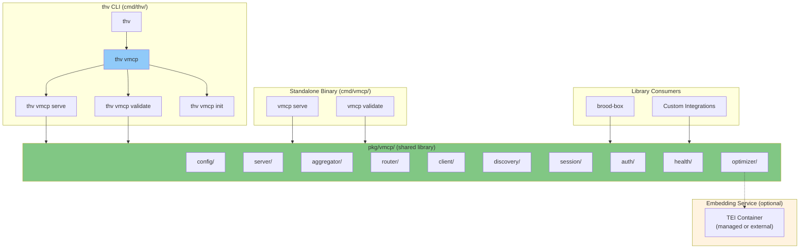
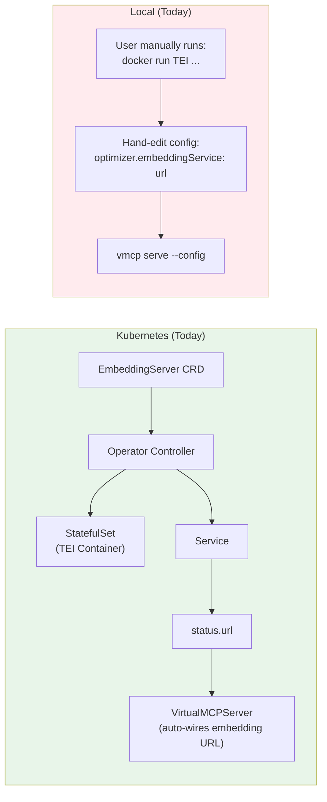
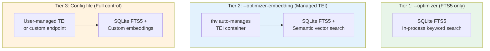
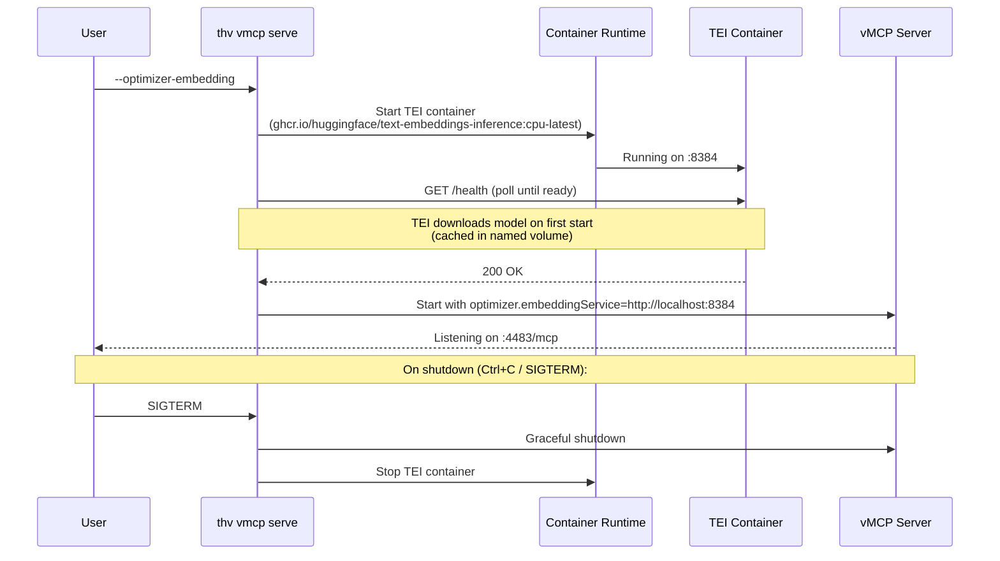
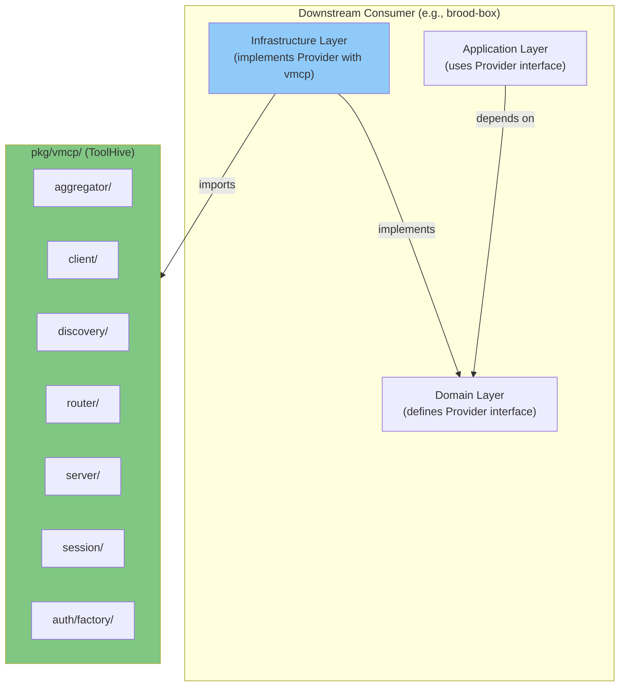

# RFC-0059: First-Class vMCP Support in the Local CLI Experience

- **Status**: Draft
- **Author(s)**: Juan Antonio Osorio (@JAORMX)
- **Created**: 2026-03-24
- **Last Updated**: 2026-03-24
- **Target Repository**: toolhive
- **Related Issues**: N/A

## Summary

This RFC proposes integrating the Virtual MCP Server (vMCP) into the main `thv` CLI as a `thv vmcp` subcommand, elevating it from a standalone binary to a first-class feature of the local ToolHive experience. It also brings the vMCP optimizer — including managed lifecycle for the embedding service container — to the local developer workflow. Additionally, it formalizes the library usage path pioneered by brood-box, enabling downstream consumers to embed vMCP as a Go library for advanced integration scenarios.

## Problem Statement

vMCP is one of ToolHive's most powerful capabilities — it aggregates multiple backend MCP servers into a single unified endpoint, handles conflict resolution, supports composite tool workflows, and manages per-backend authentication. However, its current integration story has several gaps:

- **Separate binary, separate experience**: vMCP ships as a standalone `vmcp` binary (`cmd/vmcp/`) with its own CLI, completely separate from the `thv` command users interact with daily. Users must discover, install, and manage a second binary. The `vmcp` binary is not included in goreleaser releases — users must build it manually or pull the container image.

- **No discoverability**: Running `thv --help` gives no indication that vMCP exists. Users must read documentation to learn about the separate `vmcp` binary. This is at odds with ToolHive's goal of being a batteries-included MCP management platform.

- **Inconsistent local experience**: `thv run` manages individual MCP servers, `thv group` organizes them, but there is no `thv` command to aggregate them. The logical workflow of "create group, add servers, aggregate via vMCP" breaks at the final step, requiring a context switch to a different binary.

- **No official library usage guidance**: brood-box has successfully embedded vMCP as a Go library (using `pkg/vmcp/` packages directly), but this usage pattern is undocumented. Other downstream consumers who want to embed vMCP (e.g., IDE plugins, platform integrations) have no reference architecture to follow.

- **Configuration fragmentation**: The standalone `vmcp` binary requires a full YAML config file even for simple local scenarios. Users who just want to aggregate their running group into a single endpoint must author a config file from scratch.

- **Optimizer has no local story**: In Kubernetes, the vMCP optimizer is fully managed — the operator provisions an `EmbeddingServer` CRD that deploys the HuggingFace Text Embeddings Inference (TEI) container, wires the URL into the vMCP config, and gates readiness on the embedding service. Locally, users who want semantic tool search must manually `docker run` the TEI container and hand-wire the URL into a config file. There is no `thv` command to manage this lifecycle.

All ToolHive users who manage more than one MCP server locally are affected. The lack of a unified CLI experience makes vMCP feel like an advanced/experimental feature rather than a core capability.

## Goals

- Add a `thv vmcp` subcommand with `serve`, `validate`, and `init` sub-commands that integrate vMCP into the main CLI
- Support a zero-config quickstart: `thv vmcp serve --group <name>` should work without a config file for simple aggregation
- Bring the optimizer to the local experience with managed embedding service lifecycle (`--optimizer` flag auto-manages a TEI container)
- Maintain full feature parity with the standalone `vmcp` binary for users who need advanced configuration
- Include vMCP in goreleaser so it ships with every ToolHive release (embedded in `thv` as a subcommand)
- Document the library embedding pattern used by brood-box as an officially supported integration path
- Ensure the standalone `vmcp` binary continues to work for backwards compatibility and Kubernetes deployments

## Non-Goals

- Removing the standalone `vmcp` binary (it remains the deployment target for Kubernetes via the operator)
- Changes to the vMCP protocol, aggregation logic, or core architecture
- Kubernetes-specific features (operator, CRD-based discovery, dynamic backend watching)
- Integration with the long-running local server architecture (RFC-0034) — that is a natural follow-up but out of scope here
- Desktop UI integration for vMCP management
- Changes to composite tool workflows or the DAG execution engine

## Proposed Solution

### High-Level Design

The `thv vmcp` subcommand wraps the existing vMCP server packages (`pkg/vmcp/`) behind a thin CLI layer, following ToolHive's established pattern where CLI commands in `cmd/thv/app/` are thin wrappers over `pkg/` logic.



Three integration paths converge on the same `pkg/vmcp/` library:

1. **`thv vmcp` subcommand** (this RFC) — first-class local experience for end users
2. **Standalone `vmcp` binary** (existing) — Kubernetes deployment target, backwards compatibility
3. **Library embedding** (formalized by this RFC) — downstream consumers like brood-box

### Detailed Design

#### Component Changes

##### New CLI Commands

###### `thv vmcp serve`

Starts a local vMCP server that aggregates MCP servers from a ToolHive group.

```
thv vmcp serve [flags]

Flags:
  -c, --config string            Path to vMCP configuration file (optional)
  -g, --group string             ToolHive group to aggregate (default: "default")
      --host string              Host to bind to (default: "127.0.0.1")
  -p, --port int                 Port to listen on (default: 4483)
      --enable-audit             Enable audit logging
      --optimizer                Enable the tool optimizer (FTS5 keyword search)
      --optimizer-embedding      Enable the optimizer with semantic search (auto-manages TEI container)
      --embedding-model string   HuggingFace model for semantic search (default: "BAAI/bge-small-en-v1.5")
      --embedding-port int       Port for the embedding service container (default: 8384)
```

Two modes of operation:

1. **Quick mode** (no config file): When `--config` is omitted, the command auto-generates a minimal configuration using `--group` as the `groupRef`. This provides a zero-config quickstart for the common case of "aggregate everything in my group."

2. **Config mode**: When `--config` is provided, the command loads the full YAML configuration, supporting all advanced features (aggregation policies, composite tools, auth, telemetry, etc.). This is identical to the standalone `vmcp serve` behavior.

Note that `groupRef` is a **required field** in the vMCP config (see `pkg/vmcp/config/config.go`). In quick mode, `--group` populates this field in the auto-generated config. In config mode, the group comes from the config file's `groupRef` field. If both `--config` and `--group` are provided, the CLI flag overrides the config file's `groupRef`, which is useful for reusing a config template across multiple groups.

Quick mode generates the equivalent of:

```yaml
name: "thv-vmcp-<group>"
groupRef: "<group>"
aggregation:
  conflictResolution: prefix
outgoingAuth:
  source: inline
  default:
    type: unauthenticated
```

When `--optimizer` is added, an empty `optimizer: {}` section is included (FTS5-only). When `--optimizer-embedding` is used, the embedding service URL is auto-populated after the managed TEI container starts.

###### `thv vmcp validate`

Validates a vMCP configuration file without starting the server.

```
thv vmcp validate --config <path>
```

###### `thv vmcp init`

Generates a starter vMCP configuration file for a given group, pre-populated with discovered backends.

```
thv vmcp init [flags]

Flags:
  -g, --group string    ToolHive group to generate config for (default: "default")
  -o, --output string   Output file path (default: stdout)
      --conflict-resolution string   Conflict resolution strategy: prefix|priority (default: "prefix")
```

This command:
1. Discovers all running workloads in the specified group via `groups.NewCLIManager()` and `workloads.NewManager()`
2. Generates a YAML config with backends pre-populated from the discovered workloads
3. Includes commented-out sections for advanced features (auth, composite tools, telemetry) as a starting point

Example output:

```yaml
# Generated by: thv vmcp init --group engineering
# Edit this file to customize your vMCP configuration.
name: "engineering-vmcp"
groupRef: "engineering"

# Backends discovered from group "engineering":
# (These are auto-discovered at runtime from the group.
#  Uncomment and modify only if you need static overrides.)
# backends:
#   - name: "github"
#     url: "http://localhost:8080/mcp"
#     transport: "streamable-http"
#   - name: "jira"
#     url: "http://localhost:8081/mcp"
#     transport: "streamable-http"

aggregation:
  conflictResolution: prefix
  # tools:
  #   - workload: "github"
  #     filter: ["create_pr", "list_issues"]

# Uncomment to configure authentication:
# incomingAuth:
#   type: anonymous
# outgoingAuth:
#   source: inline
#   default:
#     type: unauthenticated

# Uncomment to define composite tool workflows:
# compositeTools:
#   - name: "my_workflow"
#     description: "A multi-step workflow"
#     parameters:
#       type: object
#       properties: {}
#     steps: []

# Uncomment to enable telemetry:
# telemetry:
#   tracingEnabled: false
#   metricsEnabled: false
```

##### File-Level Changes

**`cmd/thv/app/vmcp.go`** (new file)

A new file following the constructor pattern (consistent with `mcp.go`, `export.go`):

```go
// SPDX-FileCopyrightText: Copyright 2025 Stacklok, Inc.
// SPDX-License-Identifier: Apache-2.0

package app

func newVMCPCommand() *cobra.Command {
    cmd := &cobra.Command{
        Use:   "vmcp",
        Short: "Virtual MCP Server - aggregate multiple MCP servers into one",
        Long: `Start, validate, and manage a Virtual MCP Server that aggregates
multiple backend MCP servers from a ToolHive group into a single
unified MCP endpoint.`,
    }
    cmd.AddCommand(newVMCPServeCmd())
    cmd.AddCommand(newVMCPValidateCmd())
    cmd.AddCommand(newVMCPInitCmd())
    return cmd
}
```

**`cmd/thv/app/commands.go`** (modified)

Register the new command in `NewRootCmd()`:

```go
rootCmd.AddCommand(newVMCPCommand())
```

Add `"vmcp"` to the informational commands map so the CLI skips container runtime checks (vMCP is a proxy that connects to already-running backends):

```go
var informationalCommands = map[string]bool{
    "version":    true,
    "search":     true,
    "completion": true,
    "registry":   true,
    "mcp":        true,
    "skill":      true,
    "vmcp":       true, // new
}
```

**`pkg/vmcp/cli/`** (new package)

Extract the core serve logic from `cmd/vmcp/app/commands.go` (~350 lines of `runServe` and helpers) into a reusable package. This avoids duplicating business logic between the standalone binary and the `thv` subcommand.

```go
// SPDX-FileCopyrightText: Copyright 2025 Stacklok, Inc.
// SPDX-License-Identifier: Apache-2.0

package cli

// ServeConfig holds the parameters for starting a vMCP server.
type ServeConfig struct {
    ConfigPath  string
    Host        string
    Port        int
    EnableAudit bool

    // Quick mode fields (used when ConfigPath is empty)
    GroupRef           string
    ConflictResolution string

    // Optimizer fields
    Optimizer          bool   // Enable FTS5-only optimizer
    OptimizerEmbedding bool   // Enable optimizer with managed TEI container
    EmbeddingModel     string // HuggingFace model ID (default: BAAI/bge-small-en-v1.5)
    EmbeddingPort      int    // TEI container port (default: 8384)
}

// Serve starts a vMCP server with the given configuration.
// If cfg.ConfigPath is empty, it auto-generates a minimal config
// from the specified group (quick mode).
func Serve(ctx context.Context, cfg ServeConfig) error { ... }

// Validate validates a vMCP configuration file.
func Validate(configPath string) error { ... }

// InitConfig holds the parameters for generating a starter config.
type InitConfig struct {
    GroupRef           string
    ConflictResolution string
}

// Init generates a starter vMCP configuration for a group.
func Init(ctx context.Context, cfg InitConfig) ([]byte, error) { ... }
```

Both `cmd/thv/app/vmcp.go` and `cmd/vmcp/app/commands.go` become thin wrappers that parse flags and delegate to `pkg/vmcp/cli/`.

#### Local Optimizer Support

##### Background: How the Optimizer Works

The vMCP optimizer is a context-window reduction system. When enabled, instead of exposing all aggregated tools to the LLM client (which can consume enormous token budgets), vMCP exposes only two meta-tools:

- **`find_tool`** — Semantic and keyword search over the full tool set
- **`call_tool`** — Dynamic invocation of any backend tool by name

The optimizer uses an in-memory SQLite FTS5 index for keyword search (BM25 ranking) and optionally an external embedding service for semantic vector search. The SQLite store runs inside the vMCP process — no additional infrastructure is needed for keyword-only mode. For hybrid search (keyword + semantic), an external HuggingFace Text Embeddings Inference (TEI) service provides vector embeddings.

##### Kubernetes vs. Local Today

In Kubernetes, the operator fully manages the optimizer lifecycle:



The gap is clear: Kubernetes has a managed lifecycle (create CRD, operator handles the rest), while local requires manual container management and config wiring.

##### Proposed: Three Optimizer Tiers for Local



**Tier 1: Keyword-only optimizer (`--optimizer`)**

Zero dependencies. The optimizer runs entirely in-process using SQLite FTS5 for keyword search. No embedding service needed.

```bash
thv vmcp serve --group default --optimizer
```

This enables `find_tool`/`call_tool` with BM25 keyword ranking. Effective for exact and partial tool name matches. No semantic understanding, but dramatically reduces token usage for large tool sets.

Equivalent config:

```yaml
optimizer: {}
```

**Tier 2: Managed semantic search (`--optimizer-embedding`)**

`thv vmcp serve` automatically manages a TEI container via the local container runtime (Docker/Podman), the same runtime ToolHive already uses for MCP servers. The container is started before the vMCP server and its URL is auto-wired into the optimizer config.

```bash
thv vmcp serve --group default --optimizer-embedding

# With custom model:
thv vmcp serve --group default --optimizer-embedding \
  --embedding-model BAAI/bge-small-en-v1.5 \
  --embedding-port 8384
```

Lifecycle:



Implementation details:

- **Container image**: `ghcr.io/huggingface/text-embeddings-inference:cpu-latest` (same image the K8s `EmbeddingServer` CRD uses)
- **Container name**: `thv-embedding-<group>` (predictable, enables idempotent start/stop)
- **Model cache**: Named volume `thv-embedding-model-cache` mounted at `/data` with `HF_HOME=/data`. This avoids re-downloading the model on every start (~130MB for `bge-small-en-v1.5`).
- **Health check**: Poll `GET /health` with backoff until the TEI server reports ready. TEI must download and load the model on first start, which can take 30-60 seconds.
- **Port binding**: Default `127.0.0.1:8384`. Chosen to avoid conflicting with the vMCP port (4483) or common dev ports.
- **Lifecycle coupling**: The TEI container is started before the vMCP server and stopped after it shuts down. If the TEI container fails to start or becomes unhealthy, vMCP falls back to FTS5-only mode with a warning.
- **Idempotent start**: If a `thv-embedding-<group>` container is already running (e.g., from a previous invocation), reuse it rather than creating a new one.
- **Platform considerations**: The TEI CPU image is amd64. On ARM64 hosts (Apple Silicon), the container runs under emulation. A future enhancement could detect architecture and select an appropriate image variant.

**Tier 3: Full config control**

Users with advanced requirements (custom embedding endpoint, GPU-accelerated TEI, external service) can configure the optimizer directly in the config file:

```yaml
optimizer:
  embeddingService: "http://my-custom-tei:8080"
  embeddingServiceTimeout: "30s"
  maxToolsToReturn: 10
  hybridSearchSemanticRatio: "0.6"
  semanticDistanceThreshold: "0.8"
```

This is the existing behavior, unchanged.

##### `thv vmcp init` Optimizer Section

When `thv vmcp init` generates a config file, include a commented-out optimizer section:

```yaml
# Uncomment to enable the optimizer (reduces token usage for large tool sets):
# optimizer:
#   # Leave embeddingService empty for keyword-only search (FTS5).
#   # Set to a TEI endpoint URL for hybrid semantic + keyword search.
#   # embeddingService: "http://localhost:8384"
#   # maxToolsToReturn: 8
#   # hybridSearchSemanticRatio: "0.5"
#   # semanticDistanceThreshold: "1.0"
```

##### `pkg/vmcp/cli/` Embedding Service Manager

A new component in `pkg/vmcp/cli/` manages the TEI container lifecycle:

```go
// EmbeddingServiceConfig holds parameters for the managed embedding container.
type EmbeddingServiceConfig struct {
    Image    string // default: ghcr.io/huggingface/text-embeddings-inference:cpu-latest
    Model    string // default: BAAI/bge-small-en-v1.5
    Port     int    // default: 8384
    GroupRef string // used in container name: thv-embedding-<group>
}

// EmbeddingServiceManager manages the lifecycle of a local TEI container.
type EmbeddingServiceManager struct { ... }

// Start launches (or reuses) the TEI container and waits for readiness.
// Returns the embedding service URL.
func (m *EmbeddingServiceManager) Start(ctx context.Context) (string, error) { ... }

// Stop gracefully stops the TEI container.
func (m *EmbeddingServiceManager) Stop(ctx context.Context) error { ... }
```

This uses ToolHive's existing container runtime abstraction (`pkg/container/`) to manage the TEI container, keeping it consistent with how `thv run` manages MCP server containers.

#### API Changes

No REST API changes. The `thv vmcp` subcommand operates independently of the ToolHive API server (`thv serve`). vMCP exposes its own HTTP endpoint (default `127.0.0.1:4483/mcp`) using the Streamable HTTP transport for MCP protocol communication.

Existing health/metrics endpoints are preserved:

| Endpoint | Purpose |
|----------|---------|
| `/mcp` | MCP protocol endpoint (Streamable HTTP) |
| `/health` | Health check |
| `/readyz` | Readiness probe |
| `/status` | Operational status |
| `/api/backends/health` | Per-backend health |
| `/metrics` | Prometheus metrics |

#### Configuration Changes

No changes to the existing vMCP config format (`pkg/vmcp/config/`). The `thv vmcp init` command generates configs in the existing format. The only new behavior is the **quick mode** in `thv vmcp serve`, which auto-generates a config when `--config` is omitted. This uses the existing `config.Config` struct internally.

#### Data Model Changes

No data model changes.

#### Release and Distribution Changes

The `thv` binary already ships via goreleaser. Since `thv vmcp` is a subcommand of `thv`, no additional binary needs to be added to goreleaser. The standalone `vmcp` binary remains a separate build target for container images (Kubernetes deployment).

### Library Embedding Pattern (Reference Architecture)

brood-box has established a proven pattern for embedding vMCP as a Go library. This section formalizes it as the officially supported approach for downstream consumers.

#### Architecture



#### Key Principles

1. **Handler-only mode**: Use `vmcpserver.Server.Handler(ctx)` to get an `http.Handler` without starting a TCP listener. The consumer manages its own listener. This is the pattern brood-box uses to serve vMCP over go-microvm's hosted network.

2. **Anti-corruption layer**: Define domain-specific config types and translate them to vmcp types in the infrastructure layer. This insulates the consumer from vmcp API changes. brood-box demonstrates this in `internal/infra/mcp/translate.go`.

3. **Infrastructure encapsulation**: All vmcp imports should be confined to a single infrastructure package (e.g., `internal/infra/mcp/`). The rest of the consumer codebase interacts only with the domain interface.

4. **Forced CLI discovery**: When embedding for local use, force `groups.NewCLIManager()` to avoid accidental Kubernetes mode detection on machines with a kubeconfig.

5. **Logger isolation**: Redirect toolhive's global loggers (zap + slog) to prevent vmcp diagnostics from corrupting the consumer's output. brood-box redirects them to a log file.

#### Initialization Pipeline

The recommended initialization sequence for library consumers:

```go
// 1. Discover backends from a ToolHive group
groupsMgr, _ := groups.NewCLIManager()
wlMgr, _ := workloads.NewManager(ctx)
discoverer := aggregator.NewUnifiedBackendDiscoverer(
    workloads.NewDiscovererAdapter(wlMgr), groupsMgr, nil,
)
backends, _ := discoverer.Discover(ctx, groupName)

// 2. Create auth registry for outgoing backend auth
authRegistry, _ := vmcpauthfactory.NewOutgoingAuthRegistry(ctx, &env.OSReader{})

// 3. Create backend HTTP client
backendClient, _ := vmcpclient.NewHTTPBackendClient(authRegistry)

// 4. Set up aggregation with conflict resolution
conflictResolver, _ := aggregator.NewConflictResolver(aggConfig)
agg := aggregator.NewDefaultAggregator(
    backendClient, conflictResolver, aggConfig, nil,
)

// 5. Create discovery manager and backend registry
discoveryMgr, _ := discovery.NewManager(agg)
backendRegistry := vmcp.NewImmutableRegistry(backends)

// 6. Create router and session factory
rt := router.NewDefaultRouter()
sessionFactory := vmcpsession.NewSessionFactory(
    authRegistry, vmcpsession.WithAggregator(agg),
)

// 7. Create server and extract handler (no TCP listener)
srv, _ := vmcpserver.New(ctx, serverConfig, rt, backendClient,
    discoveryMgr, backendRegistry, nil)
handler, _ := srv.Handler(ctx)

// handler is a standard http.Handler — mount it on your own server
```

#### Stability Guarantees

The following `pkg/vmcp/` packages are considered stable for library consumers:

| Package | Stability | Notes |
|---------|-----------|-------|
| `pkg/vmcp` (root) | Stable | `BackendRegistry`, `ImmutableRegistry`, core types |
| `pkg/vmcp/config` | Stable | Config loading and validation |
| `pkg/vmcp/server` | Stable | `New()`, `Handler()`, `Config` struct |
| `pkg/vmcp/aggregator` | Stable | Aggregator, conflict resolver, discoverer factories |
| `pkg/vmcp/client` | Stable | `NewHTTPBackendClient` |
| `pkg/vmcp/router` | Stable | `NewDefaultRouter` |
| `pkg/vmcp/session` | Stable | `NewSessionFactory` |
| `pkg/vmcp/discovery` | Stable | `NewManager` |
| `pkg/vmcp/auth/factory` | Stable | `NewOutgoingAuthRegistry`, `NewIncomingAuthMiddleware` |
| `pkg/vmcp/composer` | Beta | Workflow engine APIs may change |
| `pkg/vmcp/optimizer` | Beta | Semantic search APIs may change |
| `pkg/vmcp/health` | Beta | Health monitoring APIs may change |
| `pkg/vmcp/k8s` | Internal | Not intended for library consumers |

#### brood-box as Reference Implementation

brood-box (`github.com/stacklok/brood-box`) provides the canonical reference for library embedding. Key implementation details:

- **Single integration point**: All vmcp imports are in `internal/infra/mcp/provider.go` (~10 vmcp package imports). No vmcp types leak into domain or application layers.
- **Config translation**: `internal/infra/mcp/translate.go` converts domain config types (`MCPAggregationConfig`, `MCPAuthzConfig`) to vmcp config types. This anti-corruption layer ensures brood-box's domain model is independent of vmcp API evolution.
- **Authorization profiles**: brood-box wraps Cedar policies behind named profiles (`observe`, `safe-tools`, `full-access`, `custom`), making policy management user-friendly while delegating enforcement to vmcp's Cedar middleware via `vmcpauthfactory.NewIncomingAuthMiddleware()`.
- **Handler-only usage**: brood-box calls `srv.Handler(ctx)` to get an `http.Handler` and mounts it on go-microvm's hosted network provider. The vmcp server never starts its own TCP listener.
- **Tighten-only security**: Authorization can only be made stricter through config merging, never more permissive. Custom Cedar policies from untrusted sources (workspace config) are blocked.

## Security Considerations

### Threat Model

The `thv vmcp` subcommand introduces no new attack surface beyond what the standalone `vmcp` binary already exposes. The threats are identical:

| Threat | Description | Likelihood | Impact |
|--------|-------------|------------|--------|
| Unauthorized tool invocation | Attacker gains access to the vMCP endpoint and invokes tools on backend servers | Medium (local-only binding mitigates) | High |
| Backend impersonation | Malicious process registers as a backend in a ToolHive group | Low (requires container runtime access) | High |
| Config file tampering | Attacker modifies the vMCP config to redirect backends or weaken auth | Low (file system permissions) | High |
| Session hijacking | Attacker steals a vMCP session token | Low (local-only, HMAC binding) | Medium |
| Quick mode auth bypass | Quick mode defaults to anonymous/unauthenticated, may surprise users who expect auth | Medium (documentation mitigates) | Medium |
| Embedding service container escape | TEI container could be exploited to access host resources | Low (container isolation, local-only binding) | Medium |
| Model supply chain | Malicious or tampered model downloaded by TEI | Low (HuggingFace verified models) | Medium |

### Authentication and Authorization

- **Local binding**: `thv vmcp serve` defaults to `127.0.0.1`, preventing remote access. Users must explicitly set `--host 0.0.0.0` to expose the endpoint.
- **Incoming auth**: Supports OIDC and anonymous modes via config. Quick mode defaults to anonymous, which is appropriate for local single-user scenarios.
- **Outgoing auth**: Per-backend authentication strategies (header injection, token exchange, unauthenticated) configured via the config file. Quick mode defaults to unauthenticated.
- **Cedar authorization**: When configured, Cedar policies gate access to individual tools and resources. The library embedding path (brood-box) demonstrates this with `observe`, `safe-tools`, and `full-access` profiles.
- **No privilege escalation**: The `thv vmcp` subcommand runs with the same privileges as the invoking user. No root or elevated permissions required.

### Data Security

- vMCP proxies MCP protocol messages between clients and backends. It does not persist tool call results or resource contents.
- Session state is held in-memory and is node-local. Sessions cannot be serialized or migrated.
- HMAC-SHA256 token binding (configurable via `VMCP_SESSION_HMAC_SECRET` env var) protects session tokens from tampering.
- The managed TEI container only receives tool names and descriptions for embedding generation. No tool call results or user data are sent to the embedding service.
- The TEI model cache volume (`thv-embedding-model-cache`) contains only the downloaded model weights, not user data.

### Input Validation

- Config files are loaded with strict YAML unmarshalling (`KnownFields(true)`), rejecting unknown fields.
- JSON Schema validation is applied to composite tool parameter definitions.
- Template expansion in composite tool workflows uses Go's `text/template` with a restricted function set (no shell execution).
- CLI flags (`--group`, `--host`, `--port`) are validated by Cobra's built-in type checking and custom validators.

### Secrets Management

- Backend auth secrets (API tokens, OAuth client secrets) are referenced via environment variable names in the config file (e.g., `headerValueEnv: "GITHUB_API_TOKEN"`). They are never stored in the config file itself.
- The `thv vmcp init` command generates config templates with `Env` suffixed fields, guiding users toward the env-var pattern.
- OIDC client secrets follow the same `clientSecretEnv` pattern.

### Audit and Logging

- vMCP supports audit logging via the `--enable-audit` flag, recording tool invocations, backend routing decisions, and auth events.
- Health endpoints (`/health`, `/readyz`, `/status`) expose operational state without sensitive configuration.
- The `/metrics` endpoint provides Prometheus metrics for monitoring.

### Mitigations

- Local-only binding by default eliminates remote attack vectors for the typical use case.
- Strict config parsing prevents injection via malformed YAML.
- HMAC session binding prevents session token forgery.
- Quick mode generates a conservative default config (anonymous auth, prefix conflict resolution) that is safe for local single-user scenarios.
- Library consumers are guided toward infrastructure encapsulation and anti-corruption layers, reducing the risk of misusing internal vmcp APIs.
- The managed TEI container binds to `127.0.0.1` only, uses the same container isolation as other ToolHive workloads, and downloads models exclusively from HuggingFace Hub (verified models).
- If the TEI container becomes unhealthy, vMCP degrades gracefully to FTS5-only search rather than failing entirely.

## Alternatives Considered

### Alternative 1: Ship `vmcp` as a Companion Binary via Goreleaser

- **Description**: Keep `vmcp` as a separate binary but include it in goreleaser releases alongside `thv`.
- **Pros**: No changes to `thv` CLI; minimal implementation effort; clear binary separation.
- **Cons**: Users still must discover and learn a separate command; no zero-config quickstart; inconsistent UX; doesn't solve the discoverability problem.
- **Why not chosen**: This addresses distribution but not UX. Users should not need to know about a separate binary for a core ToolHive feature.

### Alternative 2: Embed vMCP into `thv serve` (API Server)

- **Description**: Make vMCP a built-in component of the long-running local server (RFC-0034), started automatically when groups are configured.
- **Pros**: Fully integrated; no separate process; could auto-discover and aggregate groups without user intervention.
- **Cons**: RFC-0034 is not yet implemented; couples vMCP availability to the server architecture; users who want vMCP without the full server have no option; harder to reason about lifecycle.
- **Why not chosen**: This is a natural evolution but should not block first-class vMCP support. The `thv vmcp` subcommand can later delegate to the local server when one is running. This RFC establishes the foundation; RFC-0034 integration is a follow-up.

### Alternative 3: `thv group serve` Instead of `thv vmcp`

- **Description**: Add a `serve` subcommand under `thv group` that starts a vMCP endpoint for a group.
- **Pros**: Conceptually clean — "serve a group as a single endpoint"; fewer top-level commands.
- **Cons**: Hides the vMCP concept, making it harder to find advanced features (composite tools, auth, optimization); `thv group` commands are all instant CRUD operations, adding a long-running server breaks the pattern; no natural place for `validate` or `init` subcommands.
- **Why not chosen**: vMCP is a distinct concept with its own configuration, lifecycle, and feature set. It deserves its own command namespace. A convenience alias could be added later if user research supports it.

## Compatibility

### Backward Compatibility

- **Standalone `vmcp` binary**: Fully preserved. The `cmd/vmcp/` binary continues to exist and work identically. Both entry points delegate to the same `pkg/vmcp/` packages.
- **Config format**: No changes. Existing vMCP config files work with `thv vmcp serve --config`.
- **Library API**: No breaking changes to `pkg/vmcp/` packages. The new `pkg/vmcp/cli/` package is additive.

### Forward Compatibility

- **RFC-0034 integration**: When the long-running local server is implemented, `thv vmcp serve` can detect a running server and delegate vMCP management to it, or the server can subsume vMCP entirely. The subcommand namespace is preserved either way.
- **Desktop UI**: `thv vmcp init` generates config files that could be consumed by a Desktop UI vMCP management interface.
- **Future transports**: The vMCP server already supports Streamable HTTP; adding stdio transport for IDE integration would be a natural extension.
- **Extensibility**: The `pkg/vmcp/cli/` package provides clean extension points for future subcommands (e.g., `thv vmcp status`, `thv vmcp inspect`).

## Implementation Plan

### Phase 1: Extract Shared Logic

- Extract `cmd/vmcp/app/commands.go` serve logic into `pkg/vmcp/cli/serve.go`
- Extract validate logic into `pkg/vmcp/cli/validate.go`
- Refactor `cmd/vmcp/app/commands.go` to be a thin wrapper over `pkg/vmcp/cli/`
- Add unit tests for the new `pkg/vmcp/cli/` package

### Phase 2: `thv vmcp serve` and `thv vmcp validate`

- Create `cmd/thv/app/vmcp.go` with `serve` and `validate` subcommands
- Register `vmcp` in `commands.go` and `IsInformationalCommand()`
- Wire up flags (mirroring standalone binary flags plus `--group` for quick mode)
- Add E2E tests for `thv vmcp serve` and `thv vmcp validate`

### Phase 3: Quick Mode and `thv vmcp init`

- Implement quick mode config generation in `pkg/vmcp/cli/`
- Implement `thv vmcp init` with group discovery and template generation
- Add E2E tests for quick mode and init

### Phase 4: Local Optimizer Support

- Implement `--optimizer` flag (FTS5-only, no container management — config wiring only)
- Implement `EmbeddingServiceManager` in `pkg/vmcp/cli/` for TEI container lifecycle
- Implement `--optimizer-embedding` flag with container start/stop, health polling, and graceful fallback
- Add `--embedding-model` and `--embedding-port` flags
- Add named volume management for model caching
- Add E2E tests for optimizer tiers (FTS5-only, managed TEI, config-file TEI)

### Phase 5: Documentation and Library Guidance

- Add `docs/arch/vmcp-local.md` documenting the local vMCP experience including optimizer tiers
- Add `docs/arch/vmcp-library.md` documenting the library embedding pattern
- Update `README.md` and user-facing docs with `thv vmcp` quickstart
- Add examples to `examples/` directory

### Dependencies

- No external dependencies. All required packages already exist in `pkg/vmcp/`.
- Phase 2 depends on Phase 1 (shared logic extraction).
- Phase 3 depends on Phase 2 (`thv vmcp` command structure).
- Phase 4 depends on Phase 2 (`thv vmcp serve` must exist before adding optimizer flags). Phase 4 can proceed in parallel with Phase 3.
- Phase 5 can proceed in parallel with Phases 3-4.

## Testing Strategy

- **Unit tests**: `pkg/vmcp/cli/` — test config generation (quick mode), validation, init template rendering. Test that the extracted serve logic preserves all existing behavior.
- **Integration tests**: Start `thv vmcp serve` with a test config and verify that tool aggregation, routing, and conflict resolution work correctly through the `thv` entry point. Reuse existing `test/integration/vmcp/` test helpers.
- **E2E tests**: Full lifecycle tests in `test/e2e/`:
  - `thv group create` -> `thv run ... --group` -> `thv vmcp serve --group` -> MCP client connects and calls tools
  - `thv vmcp init --group` generates valid config -> `thv vmcp validate --config` passes -> `thv vmcp serve --config` starts successfully
  - Quick mode (no config): `thv vmcp serve --group default` aggregates running servers
- **Optimizer tests**:
  - FTS5-only: `thv vmcp serve --group default --optimizer` -> client sees only `find_tool`/`call_tool` -> `find_tool` discovers backend tools by keyword
  - Managed TEI: `thv vmcp serve --group default --optimizer-embedding` -> TEI container starts -> `find_tool` performs semantic search -> on shutdown, TEI container stops
  - Fallback: TEI container fails to start -> vMCP falls back to FTS5-only with warning
  - Idempotent: Running `thv vmcp serve --optimizer-embedding` twice reuses the existing TEI container
- **Regression tests**: Verify that the standalone `vmcp serve` command still works identically after the refactor.
- **Security tests**: Verify that quick mode binds to `127.0.0.1` only, that strict YAML parsing rejects unknown fields, and that HMAC session binding is enforced when configured.

## Documentation

- **User documentation**: Quickstart guide for `thv vmcp` (zero-config and config-file modes), command reference
- **Architecture documentation**: `docs/arch/vmcp-local.md` covering local deployment, `docs/arch/vmcp-library.md` covering the library embedding pattern with brood-box as reference
- **Examples**: `examples/vmcp-local-quickstart/` with a minimal setup, `examples/vmcp-advanced/` with auth, composite tools, and telemetry
- **Existing docs updates**: Update `docs/arch/10-virtual-mcp-architecture.md` to reference the new CLI integration and library embedding path

## Open Questions

1. **Should quick mode support additional flags?** Quick mode currently defaults to `prefix` conflict resolution. Should users be able to override this without a full config file (e.g., `thv vmcp serve --group eng --conflict-resolution priority`)?

2. **Should `thv vmcp serve` register with client configuration files?** When the long-running server starts, it writes to IDE config files. Should `thv vmcp serve` do the same (write the vMCP endpoint into Claude Code, VS Code, etc. config files)?

3. **Should we add `thv vmcp status`?** A command to query the health and capabilities of a running vMCP instance (list aggregated tools, backend health) using the existing `/status` and `/api/backends/health` endpoints.

4. **Stability level annotations for library packages**: The stability table in this RFC assigns levels based on current usage patterns. Should these be formalized with `doc.go` annotations in each package?

5. **Quick mode auth defaults**: Quick mode defaults to `anonymous` incoming auth and `unauthenticated` outgoing auth. Is this appropriate, or should it attempt to detect backend auth requirements from the group's workload configurations?

6. **TEI container lifecycle on crash**: If `thv vmcp serve` is killed ungracefully (SIGKILL, OOM), the TEI container will be left running. Should a cleanup mechanism be added (e.g., check for orphaned `thv-embedding-*` containers on startup)?

7. **GPU support for TEI**: The default `cpu-latest` image works everywhere but is slower. Should `--optimizer-embedding` detect GPU availability and select a GPU-accelerated TEI image variant (e.g., `ghcr.io/huggingface/text-embeddings-inference:latest` for CUDA)?

8. **Embedding model recommendations**: Should `thv vmcp init` or docs recommend specific models for different use cases (small/fast vs. large/accurate)?

## References

- [THV-0022: Optimizer Migration to vMCP](https://github.com/stacklok/toolhive-rfcs/blob/main/rfcs/THV-0022-optimizer-migration-to-vmcp.md) — Optimizer architecture (SQLite FTS5, TEI embeddings, session-scoped indexing)
- [THV-0008: Virtual MCP Server](https://github.com/stacklok/toolhive-rfcs/blob/main/rfcs/THV-0008-virtual-mcp-server.md) — Original vMCP design
- [THV-0014: K8s-Aware vMCP with Dynamic Backend Discovery](https://github.com/stacklok/toolhive-rfcs/blob/main/rfcs/THV-0014-vmcp-k8s-aware-refactor.md) — K8s discovery mode
- [THV-0034: Local Long-Running Server Architecture](https://github.com/stacklok/toolhive-rfcs/blob/main/rfcs/THV-0034-long-running-local-server.md) — Future integration point
- [THV-0047: vMCP/ProxyRunner Horizontal Scaling](https://github.com/stacklok/toolhive-rfcs/blob/main/rfcs/THV-0047-vmcp-proxyrunner-horizontal-scaling.md) — Scaling considerations
- [brood-box vMCP integration](https://github.com/stacklok/brood-box/tree/main/internal/infra/mcp) — Reference implementation of library embedding pattern
- [ToolHive vMCP architecture docs](https://github.com/stacklok/toolhive/blob/main/docs/arch/10-virtual-mcp-architecture.md) — Architecture documentation
- [vMCP package documentation](https://github.com/stacklok/toolhive/blob/main/pkg/vmcp/doc.go) — Package-level docs

---

## RFC Lifecycle

<!-- This section is maintained by RFC reviewers -->

### Review History

| Date | Reviewer | Decision | Notes |
|------|----------|----------|-------|
| 2026-03-24 | @JAORMX | Draft | Initial submission |

### Implementation Tracking

| Repository | PR | Status |
|------------|-----|--------|
| toolhive | TBD | Not started |
