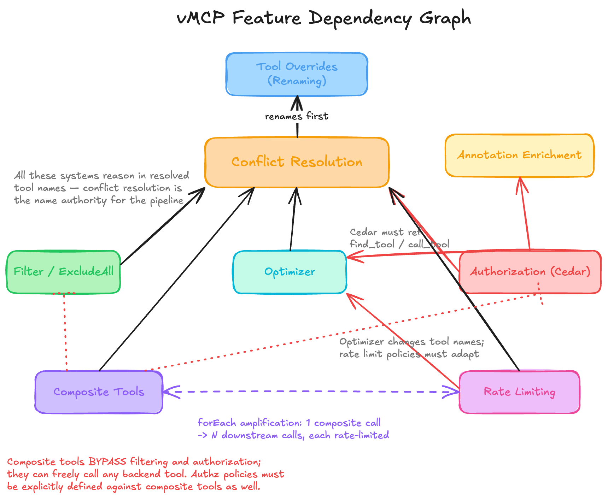
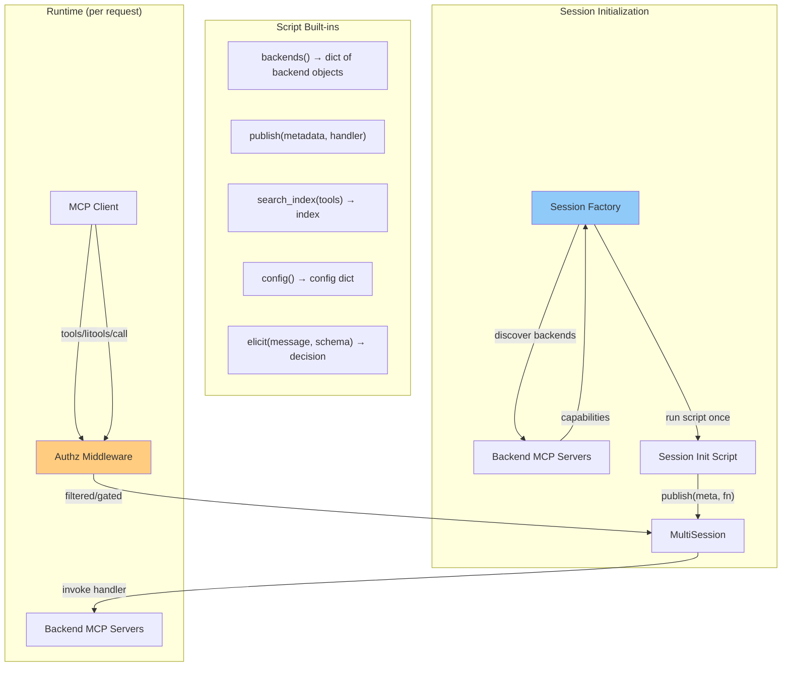
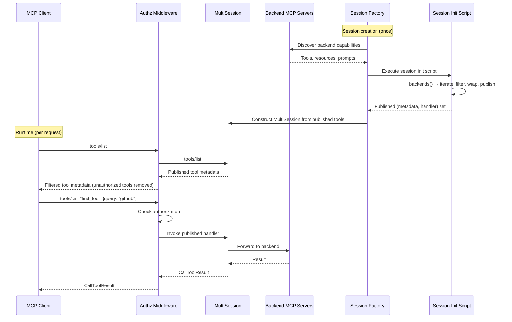

# THV-0060: Starlark Session Initialization for vMCP

- **Status**: Draft
- **Author(s)**: Jeremy Drouillard (@jerm-dro)
- **Created**: 2026-03-24
- **Last Updated**: 2026-03-27
- **Target Repository**: toolhive
- **Related Issues**: [stacklok-epics#213](https://github.com/stacklok/stacklok-epics/issues/213)
- **Related**: [THV-0051 (Starlark Scripted Tools)](./THV-0051-starlark-scripted-tools.md) — this RFC broadens the scope of Starlark in vMCP from composite tool workflows to a unified session initialization model

## Summary

Introduce a Starlark-based session initialization script for vMCP. A single script runs once per session, receives discovered backends and their capabilities, and calls `publish()` to declare what the agent sees — optionally wrapping handlers with additional logic. Existing config knobs remain fully supported, but customization of vMCP behavior can now be exactly tailored to the use case without adding more knobs. Increasing configurability no longer means decreasing maintainability — new capabilities ship as simple built-in functions instead of config knobs that must reason about every other knob.

## Problem Statement

vMCP's feature set is growing, and two forces are pulling against each other: users want more configurability, but increasing configurability decreases maintainability.

### The configurability problem

Users want to combine features in ways that make sense for their deployment. But each feature has its own config surface, and the interactions between them are implicit and surprising. Configuring one feature correctly requires understanding the side effects of every other feature:

- The optimizer replaces the entire tool list with `find_tool` / `call_tool`, but `find_tool`'s description is static. We've discussed many solutions on [this issue](https://github.com/stacklok/toolhive/issues/4357). To support them all, we'd have to add many more config knobs. As Alejandro's comment points out, we'd also like the solutions to not be one-size-fits-all — but each option is another knob.
- Rate limiting (THV-0057) adds per-tool limits that must reference tool names — but those names may have been renamed by overrides in a different config block. Users also have to know that limits apply to post-resolution names. What happens when a rate-limited tool is called inside a composite tool, potentially many times? Is it still rate limited? What if an administrator wants different limits for groups of tools or entire backends? Each question either becomes another knob or hard-coded behavior that needs documentation — and users reading that documentation.
- There is no mechanism to express policies that span features, like "tools without a `readOnly` annotation must require an elicitation step."

### The maintainability problem

Every new feature enters a web of dependencies with existing features. As we add to this web, we have to think carefully about how each addition interacts with everything else ([excalidraw source](https://excalidraw.com/#json=C3Co-yHQMwzjrJptY7Qmv,mCqdzvMmerb6yZ0_gmt24g)):



The cost is concrete — implicit interactions produce bugs:

- **Filter × composite tools**: The advertising filter runs before composite tools, causing a [type coercion bug](https://github.com/stacklok/toolhive/issues/4287). RFC-0058 fixes the ordering, but the fact that the bug existed shows how opaque the interaction is.
- **Optimizer × authorization**: The optimizer wasn't tested with Cedar authz due to time constraints. The result: enabling the optimizer silently breaks Cedar policies that reference real tool names ([#4373](https://github.com/stacklok/toolhive/issues/4373)), and `find_tool` returns tools the caller isn't authorized to use ([#4374](https://github.com/stacklok/toolhive/issues/4374)).

In practice, it's infeasible to always test all feature combinations and remain aware of their interactions. The interaction matrix grows quadratically — and so does the time to ship new features and the cost of getting it wrong. Instead, the relationships between features should be flexible but explicit.

### Why this is worth solving now

THV-0051 proposes Starlark for composite tools. Before that engine ships, we should decide whether Starlark is *only* for composite tools or whether it's the foundation for a unified session initialization model. Shipping THV-0051 as-is and then later expanding scope would mean a second migration.

The cost equation favors acting now. As more capabilities land, the cost of retrofitting a composable system increases — more code to replace, more interactions to preserve. Meanwhile, the cost of building each new config knob is *also* increasing, because each knob must reason about its interactions with every existing knob. A session initialization model inverts this: new capabilities ship as simple built-in functions, and administrators compose them explicitly. The longer we wait, the more expensive both paths become.

## Goals

- Define a Starlark-based programming model that subsumes tool advertising, renaming, optimizer behavior, and composite tool workflows into a single script that runs once per session
- Make it easy to add new capabilities (search indexing, PII scrubbing, rate limiting) as simple built-in functions rather than config knobs with complex interactions
- Preserve the existing authorization boundary — Cedar authz middleware continues to filter `tools/list` and gate `tools/call` at runtime, independent of what the script publishes
- Make the system accessible to non-power-users by preserving the configuration that we have today.
- Enable policies that span multiple features (e.g., "non-readonly tools require elicitation")
- Maintain full backward compatibility with existing config fields — the session initialization script must be able to replicate every behavior currently achievable via `aggregation`, `optimizer`, and related config (except legacy composite tools, which are replaced by Starlark scripts). The plan for legacy composite tools is discussed in the implementation plan below.

## Non-Goals

- Replacing Cedar for authorization decisions — Cedar remains the policy engine for access control
- A general-purpose plugin system for ToolHive beyond vMCP session behavior
- Replacing dynamic webhooks (THV-0017) — webhooks serve the external integration use case; Starlark serves the internal configuration use case
- Moving authentication or transport-level concerns into Starlark
- Supporting multiple scripting languages

## Proposed Solution

### Background

#### Prior art: gateway configurability patterns

**[Envoy Proxy](https://www.envoyproxy.io/)** faces the same configurability spectrum. Its declarative config handles routing well, but complex use cases require escape hatches: a minimal [Lua filter](https://www.envoyproxy.io/docs/envoy/latest/configuration/http/http_filters/lua_filter), [WASM filters](https://www.envoyproxy.io/docs/envoy/latest/configuration/http/http_filters/wasm_filter), and native C++ filters, each trading simplicity for power. Envoy keeps authorization architecturally separate from routing via its [ext_authz filter](https://www.envoyproxy.io/docs/envoy/latest/configuration/http/http_filters/ext_authz_filter), with shared context flowing between them through dynamic metadata — authorization and configuration are separate concerns connected through a shared namespace, not unified into one layer. Envoy's Lua filter exposes built-in functions for request/response manipulation ([docs](https://www.envoyproxy.io/docs/envoy/latest/configuration/http/http_filters/lua_filter)):

```lua
-- Envoy Lua filter (from docs)
function envoy_on_request(request_handle)
  request_handle:headers():add("request_body_size", request_handle:body():length())
end

function envoy_on_response(response_handle)
  response_handle:headers():add("response_body_size", response_handle:body():length())
  response_handle:headers():remove("foo")
end
```

**[Kong Gateway](https://docs.konghq.com/gateway/latest/)** built its plugin architecture on Lua lifecycle callbacks with a [Plugin Development Kit](https://docs.konghq.com/gateway/latest/plugin-development/pdk/) exposing built-in functions for request inspection and response control. The pattern — built-in functions as mechanism, user scripts as policy — directly informs vMCP's `publish()` + handler model ([docs](https://developer.konghq.com/custom-plugins/handler.lua/)):

```lua
-- Kong plugin handler (from docs)
local CustomHandler = {
  VERSION  = "1.0.0",
  PRIORITY = 10,
}

function CustomHandler:access(config)
  kong.log("access")
end

function CustomHandler:header_filter(config)
  kong.log("header_filter")
end

function CustomHandler:body_filter(config)
  kong.log("body_filter")
end

return CustomHandler
```

**[The Configuration Complexity Clock](https://mikehadlow.blogspot.com/2012/05/configuration-complexity-clock.html)** (Hadlow, 2012) describes the lifecycle this RFC interrupts: hard-coded values → config file → complex config → rules engine → DSL → "essentially a programming language, except crappier." vMCP's config knob interactions are at the "complex config" stage. The session initialization model jumps to a real programming language with proper semantics, rather than waiting for the config surface to accumulate ad-hoc conditionals that amount to a worse one.

#### How authorization works today

Authorization in vMCP is enforced by authz middleware that sits between the client and the session:

- For **`tools/list`** (and other list methods): the authz middleware filters the response, removing items the caller isn't authorized to use.
- For **`tools/call`** (and other action methods): the authz middleware gates the request, returning 403 if the caller isn't authorized.

Critically, the authz middleware operates on the *final published tool set* — it does not restrict which tools are visible during session construction. The session initialization script runs during session construction, so it sees all tools from all backends the persona is configured to use. Authorization is applied afterward at request time.

**Implication for this RFC**: Because the script sees all tools regardless of the caller's authorization:

1. `backends()` returns all backends configured for the persona, not filtered by user authorization.
2. Published tools are still subject to authz filtering/gating at runtime — publishing a tool does not bypass authorization.
3. A handler could dispatch to any discovered tool via saved references, including tools the current user isn't authorized to use. This is the same trust model as composite tools today — see [Interaction with authorization](#interaction-with-authorization).

Modifying the authz boundary is out of scope for this RFC.

### High-Level Design

A vMCP caller runs a single Starlark **session initialization script** once per session. The script receives discovered backends via `backends()` — a dict keyed by backend name, where each value exposes the backend's tools, resources, and prompts. The script calls `publish()` to declare what the agent sees.



**Key invariant**: `backends()` returns all backends configured. The script publishes tools, and the authz middleware filters `tools/list` responses and gates `tools/call` requests at runtime. Publishing a tool does not bypass authorization.

### The Programming Model

The script runs once when a session is created. `backends()` returns a dict keyed by backend name. Each backend object exposes:

- **`backend.tools()`** — returns a list of `(metadata, handler)` tuples for the backend's tools
- **`backend.resources()`** — returns the backend's resources
- **`backend.prompts()`** — returns the backend's prompts

**Resources and prompts in v0**: Today, vMCP aggregates resources and prompts from all backends and passes them through unmodified — no conflict resolution, renaming, or filtering is applied (unlike tools). In v0, the session initialization script only controls tools via `publish()`. Resources and prompts continue to be passed through from backends unchanged. Future versions may add `publish_resource()` and `publish_prompt()` to give scripts control over these capabilities as well.

Each tool tuple is `(metadata, handler)`:

- **`metadata`** is a struct with `name`, `description`, `parameters` (JSON Schema), `annotations` (dict), and `backend_id`
- **`handler`** is a callable `fn(args) → result` that invokes the backend tool. `args` is a dict of named arguments.

`publish(metadata, handler)` adds a tool to the set the agent sees. The handler is called when the agent invokes that tool.

#### Simplest possible script

```python
# Publish everything from all backends. No modification.
for name, backend in backends().items():
    for meta, fn in backend.tools():
        publish(meta, fn)
```

**Note on authorization**: Handlers returned from `backend.tools()` dispatch directly to the backend, bypassing Cedar authz middleware. This means a handler saved in a dict (as in the optimizer pattern) can invoke tools the current user isn't authorized to use — the same root cause as [#4374](https://github.com/stacklok/toolhive/issues/4374). See [Interaction with authorization](#interaction-with-authorization) for details. The implementation plan addresses this by shipping optimizer + authz integration together in Phase 3.

#### Handling name collisions across backends

Because the script sees which backend each tool comes from, it can handle collisions explicitly:

```python
for name, backend in backends().items():
    for meta, fn in backend.tools():
        # Prefix tools from all backends except the primary
        if name != "primary":
            meta = metadata(
                name = name + "_" + meta.name,
                description = meta.description,
                parameters = meta.parameters,
                annotations = meta.annotations,
            )
        publish(meta, fn)
```

#### Error handling

When a handler invokes a backend tool and it fails, the Go engine catches the error and returns an MCP-standard `isError` response dict: `{"isError": true, "content": [{"type": "text", "text": "..."}]}`. The script is not halted — the error is a value the script can inspect and react to. This enables decorator-style error recovery as plain Starlark:

```python
def with_fallback(fn, fallback_fn):
    def wrapper(args):
        result = fn(args)
        if result.get("isError"):
            return fallback_fn(args)
        return result
    return wrapper
```

Retry wrappers, default responses, and other error policies are all expressible as userland decorators using the same mechanism.

#### Decorating handlers

Since handlers are just functions, decoration is plain function wrapping:

```python
def with_logging(fn, tool_name):
    """Wrap a handler to log calls."""
    def wrapper(args):
        log("calling %s" % tool_name)
        result = fn(args)
        log("finished %s" % tool_name)
        return result
    return wrapper

for name, backend in backends().items():
    for meta, fn in backend.tools():
        publish(meta, with_logging(fn, meta.name))
```


#### Defining new tools

Scripts can create entirely new tools by publishing a `metadata` with a Starlark handler function:

```python
publish(
    metadata(
        name="find_tool",
        description="Search for tools. Available: " + summary,
        parameters=FIND_TOOL_SCHEMA,
        annotations={},
    ),
    lambda args: {"results": index.search(args["query"])},
)
```

For detailed use case examples showing these patterns in practice, see [Appendix A: Motivating Use Cases](#appendix-a-motivating-use-cases).

### Built-in Functions

These are Go-implemented functions exposed to Starlark scripts.

#### Backend enumeration and publishing

| Built-in | Signature | Description |
|----------|-----------|-------------|
| `backends()` | `backends() → dict[string, Backend]` | Returns all backends configured, keyed by name. Each `Backend` object exposes `.tools()` (returns `list[(metadata, handler)]`), `.resources()`, and `.prompts()`. |
| `publish(meta, handler)` | `publish(metadata, callable) → None` | Adds a tool to the set visible to the agent. `handler` receives a single `dict` argument. Authz middleware still filters/gates at runtime. |
| `metadata(...)` | `metadata(name, description, parameters, annotations) → metadata` | Creates a new metadata struct. All four fields are required — this prevents accidentally dropping `annotations` or `parameters` when renaming. |

#### Session initialization capabilities

| Built-in | Signature | Description |
|----------|-----------|-------------|
| `search_index(tools)` | `search_index(list[(metadata, handler)]) → SearchIndex` | Builds a semantic search index over the tool list. Returns an object with `.search(query) → list[dict]`. |
| `elicit(message, schema, when_unavailable)` | `elicit(message, schema={}, when_unavailable) → struct(action, content)` | Prompts the user for a decision via MCP elicitation. `when_unavailable` is required and controls behavior when the client doesn't support elicitation: `"accept"` (permit the operation), `"reject"` (deny it), or `"error"` (halt the script). |
| `config()` | `config() → dict` | Returns the vMCP config fields (`aggregation`, `optimizer`, etc.) as a read-only dict. Used by the `default` preset. |
| `log(message)` | `log(message) → None` | Emits a structured audit log entry. |

#### Handler options

Handlers returned from `backend.tools()` accept an optional `timeout` keyword argument to control backend call timeouts:

```python
# Default timeout (inherited from backend config)
result = fn(args)

# Custom timeout
result = fn(args, timeout=10)  # 10 second timeout
```

This is useful for handlers that wrap expensive backend calls or for scripts that need tighter latency guarantees.

#### Future built-ins (examples)

The programming model makes it straightforward to add new capabilities as simple built-in functions. These are examples of what could be added — they are **not** in scope for this RFC:

| Built-in | Signature | Description |
|----------|-----------|-------------|
| `current_user()` | `current_user() → struct(sub, email, groups)` | Returns the authenticated user's identity. The user is known at init time, but this built-in is deferred to a future version. |
| `scrub_pii(text)` | `scrub_pii(text) → string` | Redacts PII patterns (emails, phones, SSNs, credit cards) from text. |
| `check_rate_limit(key, limit, window)` | `check_rate_limit(key, limit, window) → (bool, int)` | Checks a token bucket counter in Redis. Returns `(allowed, retry_after_seconds)`. |

### Presets: Making it Easy for Non-Power-Users

An important question is: how do people who don't want to write Starlark still use vMCP?

**Answer: presets.** A preset is a named, built-in Starlark script that replicates the behavior of today's config knobs. Presets are transparent — users can inspect the underlying Starlark source and fork it when they need customization:

```bash
thv vmcp list-presets
thv vmcp show-preset default
```

`list-presets` shows available presets. `show-preset` prints the Starlark source for a given preset. A user who needs 90% of a preset's behavior can copy it, modify the 10% they need, and use `sessionInit.script` or `sessionInit.scriptFile` instead.

#### Built-in presets

| Preset | Behavior | Today's equivalent |
|--------|----------|--------------------|
| `default` | Reads existing config knobs (`aggregation`, `optimizer`, etc.) and produces identical behavior to the current config-driven system. Applies filtering, renaming, conflict resolution, and optimizer behavior based on what's configured. | All existing config |

A single `default` preset handles all existing config knobs. When no `sessionInit` block is present, vMCP uses the `default` preset, which reads the existing config fields and produces identical behavior. There is no separate legacy code path — the Starlark engine is the single implementation.

#### Sketch of the `default` preset

The `default` preset is the most complex part of this RFC — it must faithfully replicate the behavior of the existing config-driven system. The sketch below shows what we're aiming for. The exact nature of the built-ins — particularly for more distant phases like authz integration — is open to discussion and doesn't need to be resolved in this RFC.

```python
# --- Optimizer tool schemas (used when optimizer mode is enabled) ---
FIND_TOOL_SCHEMA = {
    "type": "object",
    "properties": {
        "tool_description": {
            "type": "string",
            "description": "Description of the task or capability needed (e.g. 'web search', 'analyze CSV file'). Used for semantic similarity matching.",
        },
        "tool_keywords": {
            "type": "array",
            "items": {"type": "string"},
            "description": "Optional keywords for BM25 text search to narrow results. Combined with tool_description for hybrid search.",
        },
    },
    "required": ["tool_description"],
}

CALL_TOOL_SCHEMA = {
    "type": "object",
    "properties": {
        "tool_name": {
            "type": "string",
            "description": "The name of the tool to execute (obtain from find_tool results).",
        },
        "parameters": {
            "type": "object",
            "description": "Arguments required by the tool. Must match the tool's input schema from find_tool.",
        },
    },
    "required": ["tool_name", "parameters"],
}

cfg = config()
agg = cfg.get("aggregation", {})
opt = cfg.get("optimizer", None)

# --- Conflict resolution strategy ---
strategy = agg.get("conflictResolution", "prefix")
prefix_format = "{workload}_"
priority_order = []
cr_config = agg.get("conflictResolutionConfig", {})
if cr_config:
    prefix_format = cr_config.get("prefixFormat", "{workload}_")
    priority_order = cr_config.get("priorityOrder", [])

# --- Collect tools per backend, applying filtering and overrides ---
tool_configs = {}
for tc in agg.get("tools", []):
    tool_configs[tc["workload"]] = tc

all_published = []  # track names for conflict detection
seen_names = {}     # name → backend for collision detection

for backend_name, backend in backends().items():
    tc = tool_configs.get(backend_name, {})

    # ExcludeAll: skip entire backend
    if agg.get("excludeAllTools", False) or tc.get("excludeAll", False):
        continue

    allowed = tc.get("filter", None)  # None = allow all
    overrides = tc.get("overrides", {})

    for meta, fn in backend.tools():
        # Apply filter (allow-list)
        if allowed and meta.name not in allowed:
            continue

        # Apply overrides (renaming, description changes)
        override = overrides.get(meta.name, None)
        if override:
            meta = metadata(
                name = override.get("name", meta.name),
                description = override.get("description", meta.description),
                parameters = meta.parameters,
                annotations = meta.annotations,
            )

        # Apply conflict resolution
        if meta.name in seen_names:
            if strategy == "prefix":
                prefix = prefix_format.replace("{workload}", backend_name)
                meta = metadata(
                    name = prefix + meta.name,
                    description = meta.description,
                    parameters = meta.parameters,
                    annotations = meta.annotations,
                )
            elif strategy == "priority":
                existing_backend = seen_names[meta.name]
                if backend_name not in priority_order or existing_backend not in priority_order:
                    continue  # unranked backends don't win collisions
                if priority_order.index(backend_name) > priority_order.index(existing_backend):
                    continue  # lower priority, skip
                # else: higher priority, will overwrite

        seen_names[meta.name] = backend_name
        all_published.append((meta, fn))

# --- Enforce Cedar authorization policies (Phase 3) ---
# Filters the tool set so handlers can only dispatch to authorized tools.
# This ensures the optimizer pattern doesn't bypass authz (#4374).
all_published = enforce_cedar_policies(all_published)

# --- Optimizer mode: publish find_tool/call_tool instead of raw tools ---
if opt:
    index = search_index(all_published)

    desc_parts = []
    for backend_name, backend in backends().items():
        n = len(backend.tools())
        desc_parts.append("%s (%d tools)" % (backend_name, n))
    summary = "Search for tools. Available: " + ", ".join(desc_parts)

    tool_handlers = {}
    for m, f in all_published:
        tool_handlers[m.name] = f

    publish(
        metadata(name="find_tool", description=summary,
                 parameters=FIND_TOOL_SCHEMA, annotations={}),
        lambda args: {"results": index.search(args["query"])},
    )
    publish(
        metadata(name="call_tool", description="Call a tool by name.",
                 parameters=CALL_TOOL_SCHEMA, annotations={}),
        lambda args: tool_handlers[args["tool_name"]](args["arguments"]),
    )
else:
    # Standard mode: publish tools directly
    for m, f in all_published:
        publish(m, f)
```

This is approximately 80 lines of Starlark. It replaces ~2000 lines of Go across the aggregator, optimizer, and decorator stack. The POC will validate whether this sketch is complete and correct.

### Detailed Design

#### Script lifecycle



The script runs **once** per session — either when a session is created or when it's restored from Redis. The Starlark state is in-memory and not serialized, but can be recreated by re-running the script. Even though the script output could technically be shared across sessions today, running it once per session is a deliberate choice — it enables safe adoption of user-centric built-ins like `current_user()` in the future without requiring an architectural change. `publish()` calls build up the tool set. The resulting `(metadata, handler)` pairs are used to construct the `MultiSession`, which handles all subsequent `tools/list` and `tools/call` requests. The authz middleware sits between the agent and the session, filtering and gating requests at runtime.

#### Where this fits in the architecture

The session initialization script replaces the current decorator stack for tool-level concerns:

```
Current model:                     New model:

  optimizer decorator               Session factory runs
   filter decorator                   session init script,
    composite tools decorator         constructs MultiSession
     base session                     from publish() results
```

The session initialization script is not a decorator — it is used during session construction. The session factory runs the script, collects `publish()` calls, and uses the resulting `(metadata, handler)` pairs to build the `MultiSession`. The `MultiSession` is the same construct already wired into the server — it handles `Tools()` and `CallTool()` using the published tools and handlers.

#### Interaction with authorization

As described in [How authorization works today](#how-authorization-works-today), the session initialization script runs during session construction — before the authz middleware. `backends()` returns all backends configured, regardless of the current user's authorization.

The authz middleware continues to enforce authorization at runtime:

- `tools/list` responses are filtered to remove tools the caller isn't authorized to use
- `tools/call` requests are gated — unauthorized calls return 403

This means publishing a tool via `publish()` does not bypass authorization. The script controls *what tools exist and how they behave*; the authz middleware controls *who can see and use them*.

**Note**: Because the script sees all discovered tools, a handler could dispatch to tools the current user isn't authorized to use by saving handler references into a dict. This is the same trust model as composite tools today — administrators who write composite tool configurations can already wire calls to any backend tool. Fixing this boundary (moving authz before session construction) is out of scope for this RFC.

#### Interaction with dynamic webhooks

Webhooks (THV-0017) and Starlark session initialization serve different purposes at different layers:

- **Webhooks** integrate **external systems** at the HTTP middleware layer
- **Starlark** configures **vMCP-internal behavior** at the session layer

Both coexist. A request passes through webhooks first (external policy), then reaches the published handler (internal routing). Additional built-in functions could be added in the future to make the webhook integration more explicit within the script, but that is out of scope for this RFC.

#### Interaction with rate limiting

THV-0057's Redis-backed token bucket is the *mechanism*. A future `check_rate_limit()` built-in could expose it to scripts. Once available, the *policy* could be:

1. **Config-driven**: The `default` preset reads `rateLimiting` from config and applies limits internally
2. **Script-driven**: Custom scripts implement context-aware rate limiting using the built-in

### API Changes

#### New config fields

```go
type SessionInitConfig struct {
    // Preset is a named built-in session initialization script.
    // Currently only "default" is supported (reads existing config knobs).
    // When empty and no Script/ScriptFile is set, the "default" preset is used.
    Preset string `json:"preset,omitempty" yaml:"preset,omitempty"`

    // Script is inline Starlark source. Mutually exclusive with Preset and ScriptFile.
    Script string `json:"script,omitempty" yaml:"script,omitempty"`

    // ScriptFile is a path to a .star file. Mutually exclusive with Preset and Script.
    ScriptFile string `json:"scriptFile,omitempty" yaml:"scriptFile,omitempty"`
}
```

#### Existing config fields

`aggregation`, `compositeToolRefs`, and `optimizer` remain on `Config`. The `default` preset reads these fields and produces identical behavior. When a custom `sessionInit.script` or `sessionInit.scriptFile` is set, these fields are ignored. Setting more than one of `preset`, `script`, or `scriptFile` is a validation error — vMCP rejects the configuration at load time.


## Security Considerations

### Threat Model

| Threat | Description | Severity |
|--------|-------------|----------|
| **Privilege escalation via script** | Script handler dispatches to an unauthorized tool via saved references | Medium |
| **Denial of service via infinite loop** | Script with `while True` or deep recursion | High |
| **Tool list manipulation** | Script publishes tools that shouldn't be visible | Medium |
| **Decorator bypass** | Script omits expected handler wrappers (e.g., scrubbing, rate limiting) | Medium |
| **Resource exhaustion** | Script builds large data structures | High |

### Authentication and Authorization

**Cedar remains the authorization boundary at runtime.** The authz middleware filters `tools/list` and gates `tools/call`:

- `backends()` returns all backends configured for the persona (not filtered by user authorization)
- `publish()` declares tools visible to the session, but the authz middleware filters/gates them at runtime
- Handlers can dispatch to any discovered tool via saved references — same trust model as composite tools today

**Trust model**: Session initialization scripts are written by administrators, not end users. An administrator who can write a Starlark script already has the authority to configure vMCP.

### Data Security

- Scripts cannot access filesystem, network, or environment variables (Starlark sandbox)
- Tool call results transit through handlers; administrators are trusted (same model as webhook config)

### Input Validation

- Scripts are parsed and validated at config load time
- `publish()` validates metadata (non-empty name, valid JSON Schema)
- Built-in arguments are validated in Go

### Secrets Management

Scripts have no access to secrets. Backend authentication is handled below the script's view.

### Audit and Logging

- Each `publish()` logged (tool name, source: backend or script-defined)
- Each handler invocation logged (tool name, duration, outcome)
- Each built-in function invocation logged with relevant parameters
- Each `elicit()` logged (prompt, action, duration)

### Mitigations

| Threat | Mitigation |
|--------|-----------|
| Privilege escalation | Authz middleware filters `tools/list` and gates `tools/call` at runtime; scripts are admin-authored |
| DoS via loops | Execution step limit (default 1M), context timeout (same as THV-0051) |
| Tool list manipulation | `publish()` declares tools but authz middleware still filters at runtime; audit logs record every call |
| Decorator bypass | Custom scripts are admin's responsibility; presets include expected wrappers |
| Resource exhaustion | Execution step limit, memory monitoring (same as THV-0051) |

## Alternatives Considered

### Configuration approaches

#### Alternative 1: Keep adding config knobs

- **Pros**: No new concepts for simple cases
- **Cons**: Interaction matrix grows quadratically. Bugs like #4287 from non-obvious interactions. Testing becomes intractable.
- **Why not chosen**: Already causing problems at current feature count.

#### Alternative 2: Refactor the existing Go code

Invest in better code organization — clearer interfaces between features, a well-defined internal pipeline, better test coverage for combinations.

- **Pros**: No new language or dependency. Directly improves code quality and maintainability.
- **Cons**: Addresses maintainability but not configurability — every new behavior still requires a code change and release. Code organization works best when concerns have clean boundaries, but vMCP's concerns are cross-cutting: the optimizer rewrites tool names that authorization policies reference, rate limiting must track names after conflict resolution, and an elicitation gate needs annotations that aggregation doesn't surface. These concerns cut across module boundaries rather than fitting neatly within them. Additionally, with AI-driven development, code quality in a complex, cross-cutting codebase is harder to police. A model where new capabilities ship as isolated built-in functions is more resistant to quality erosion — each built-in has a single, self-contained implementation.
- **Why not chosen**: Refactoring is valuable and should continue regardless, but it doesn't address the configurability gap. Administrators who need deployment-specific policies are still waiting for ToolHive to build them.

#### Alternative 3: Declarative pipeline (ordered stages)

Instead of a scripting language, make the config ordering explicit — a pipeline of named stages (like Envoy filter chains or Traefik middleware stacks).

- **Pros**: Declarative, no scripting language to learn, explicit ordering solves the interaction problem.
- **Cons**: A declarative pipeline can express ordering and filtering, but cannot express computed values (dynamic descriptions based on available tools), conditional logic (different behavior based on annotations), or new synthetic tools (a `find_tool` with a generated description). Every new behavior still requires a new stage type implemented in Go.
- **Why not chosen**: The problem isn't just ordering — it's that administrators need to express logic that varies per deployment. A pipeline makes ordering explicit but keeps the "new knob per behavior" problem.

#### Alternative 4: Starlark for composite tools only (THV-0051 as-is)

- **Pros**: Smaller scope
- **Cons**: Misses the opportunity to unify. Interaction problem remains for optimizer + filter + rate limiting. Expanding scope later means a second migration.
- **Why not chosen**: Design for the broader use case from day one.

#### Alternative 5: Use webhooks for everything

- **Pros**: Maximum flexibility, language-agnostic
- **Cons**: External services for simple policies. Network latency on every call. Overkill for "hide these tools."
- **Why not chosen**: Webhooks for external integration, Starlark for internal configuration. Both should exist.

### Language considerations

#### Why Starlark

[Starlark](https://github.com/bazelbuild/starlark/blob/master/spec.md) is a Python-like language designed for embedding in Go applications. It was created for Bazel's build configuration and is used by Buck2, Tilt, Drone CI, and other infrastructure tools. Key properties:

- **Deterministic**: No I/O, no threads, no randomness. The only side effects are the built-ins we provide.
- **Sandboxed**: No filesystem, network, or environment variable access by design.
- **Familiar syntax**: Python-like, readable by anyone who's seen Python.
- **Mature Go implementation**: [google/starlark-go](https://github.com/google/starlark-go) is well-maintained and battle-tested.
- **Resource limits**: Execution step limits prevent infinite loops.

#### Alternative: OPA / Rego

- **Pros**: Established policy language
- **Cons**: Rego is for boolean decisions (allow/deny), not programmatic composition. Expressing "publish a search tool with a dynamic description" would be extremely awkward. We already use Cedar for authz.
- **Why not chosen**: Wrong abstraction — we need a programming model, not a policy language.

#### Alternative: Risor

[Risor](https://risor.io/) is a Go-native scripting language with richer features (try/catch, goroutines, Go stdlib access).

- **Pros**: More expressive, has exception handling, familiar Go-like stdlib.
- **Cons**: Go stdlib access is a security risk requiring extensive auditing. Younger project with smaller community. Extra features (goroutines, classes) are unnecessary complexity. Less battle-tested for embedded sandboxed use.
- **Why not chosen**: Starlark's restrictions are features for our use case. We want a language where the only side effects are the built-ins we provide.

#### Alternative: WebAssembly (Wasm) plugins

- **Pros**: Language-agnostic, strong sandboxing via Wasm runtime.
- **Cons**: Massive complexity increase (Wasm runtime, host function bindings, memory management). Poor developer experience (compile step, no REPL, opaque errors). Overkill for tool orchestration scripts.
- **Why not chosen**: The problem is configuring tool behavior, not running arbitrary compute. Starlark is the right level of abstraction.

#### Alternative: Lua (OpenResty / Envoy model)

- **Pros**: Proven in proxy scripting (Nginx/OpenResty, Kong, Envoy). Large ecosystem.
- **Cons**: Lua has mutable global state, unrestricted I/O by default — sandboxing requires careful auditing. `1`-indexed arrays are a footgun. Go bindings (gopher-lua) are less mature than starlark-go. Not deterministic without effort.
- **Why not chosen**: Starlark provides sandboxing and determinism by default. Lua requires building those guarantees on top.

## Compatibility

### Backward Compatibility

All existing config fields (`aggregation`, `optimizer`) continue to produce identical behavior. The `default` preset reads these fields and produces the same behavior as the current config-driven system. There is no separate legacy code path.

Legacy declarative composite tools (`compositeTools`, `compositeToolRefs`) could be supported by having the `default` preset interpret them, but this is not required. If we want to cut scope, composite tools can be deprecated directly and users migrated to Starlark scripts (THV-0051).

### Forward Compatibility

New built-in functions can be added without breaking existing scripts. New presets can be added alongside existing ones.

## Implementation Plan

### Phase 1: Proof of concept

A fast, rough POC to validate the high-level design. The goal is to prove the programming model works end-to-end and surface any surprises before committing to a production implementation.

- Implement `backends()`, `publish()`, `metadata()` built-ins in the Starlark engine
- Session factory runs the script and constructs `MultiSession` from `publish()` results
- Implement the `default` preset that reads existing config knobs (`aggregation`, `optimizer`, etc.)
- Run the Starlark engine alongside existing decorators for comparison testing
- All existing tests must pass **except** those that test legacy composite tools (`compositeTools`, `compositeToolRefs`)
- Update this RFC with any findings — design changes, missing built-ins, edge cases discovered

### Phase 2: Safe capabilities

Ship the capabilities that don't interact with the authz boundary. These are the "safe" features that can be validated independently.

- Production-quality `backends()`, `publish()`, `metadata()` built-ins
- Name resolution, filtering, and overrides via the `default` preset
- Rate limiting integration
- `thv vmcp show-preset` command to inspect built-in presets
- Config model: `sessionInit.preset`, `sessionInit.script`, `sessionInit.scriptFile`
- Preset equivalence tests for the capabilities in scope
- Remove the decorator code for features replaced in this phase

### Phase 3: Optimizer + authz integration

Ship the optimizer and authz capabilities together so the relationship between them is explicit. Today, the optimizer bypasses Cedar because handlers dispatch directly to backends ([#4374](https://github.com/stacklok/toolhive/issues/4374), interim fix in [PR #4385](https://github.com/stacklok/toolhive/pull/4385)). By shipping them together, the script can enforce Cedar policies on the tool set before the optimizer builds its dispatch table (e.g. `enforce_cedar_policies(all_published)`).

- `search_index()` built-in ported from current optimizer implementation
- Authz built-in (e.g. `enforce_cedar_policies()`) that filters the `(metadata, handler)` list
- Updated `default` preset with optimizer + authz integration
- Preset equivalence tests for optimizer behavior
- Remove remaining decorator code
- The exact design of the authz built-ins will be detailed in a follow-up RFC

### Phase 4: Deprecate composite tools, ship and document

- Mark `compositeTools` and `compositeToolRefs` as deprecated
- Log deprecation warnings when these fields are used
- Document migration path from declarative composite tools to Starlark scripts
- E2E tests for custom scripts in K8s via ConfigMap
- Documentation: user guide, built-in reference, migration guide, advanced use cases

New built-in functions like `scrub_pii()` and `check_rate_limit()` are out of scope for this RFC. The programming model makes them straightforward to add as follow-up work.


## Testing Strategy

- **Unit tests**: Each built-in in isolation. Handler wrapping / function composition. `publish()` validation. Preset loading and config injection.
- **Integration tests**: Full script execution with mock backends. Handler wrapping chains. Composite tool handlers via saved references. Optimizer pattern with `search_index()`.
- **E2E tests**: Preset configuration in K8s. Custom scripts via ConfigMap.
- **Security tests**: Authz middleware filters published tools correctly. Step limits. Memory.
- **Preset equivalence tests**: Verify the `default` preset produces identical behavior to the old config-driven system.

## Documentation

- **User guide**: Writing session initialization scripts, built-in reference, decorator patterns
- **Preset reference**: What each preset does, `show-preset` and forking
- **Migration guide**: From old config knobs to session init presets or custom scripts
- **Architecture docs**: Updated vMCP architecture with session initialization model

## Open Questions

1. **Sessionless MCP requests**: What happens when MCP supports requests without sessions? Do we have to run this heavy script on every request? We could actually run the script once at startup, since it does not depend on request-time information. However, if we fold in authz concerns from above, then `current_user()` will be request-time information. We could cheat around this by recommending all logic which depends on `current_user()` be placed at the end of the script. When that's encountered during startup, we block and restore the state on each request. Alternatively, we could support two different scripts. One for initialization and one per-request.

## References

- [THV-0051: Starlark Scripted Tools](./THV-0051-starlark-scripted-tools.md) — original Starlark RFC
- [THV-0057: Rate Limiting](./THV-0057-rate-limiting.md) — rate limiting mechanism
- [THV-0017: Dynamic Webhook Middleware](./THV-0017-dynamic-webhook-middleware.md) — external webhook integration
- [stacklok-epics#213](https://github.com/stacklok/stacklok-epics/issues/213) — Dynamic Webhook Middleware epic
- [stacklok/toolhive#4385](https://github.com/stacklok/toolhive/pull/4385) — Interim fix for optimizer + authz bypass (#4374)
- [Optimizer discoverability discussion](https://stacklok.slack.com/archives/C09L9QF47EU/p1774392171855569) — Slack thread
- [Starlark Language Specification](https://github.com/bazelbuild/starlark/blob/master/spec.md)
- [starlark-go Implementation](https://github.com/google/starlark-go)

---

## Appendix A: Motivating Use Cases

The following use cases illustrate what the programming model enables. Use Cases 1, 2, and 4 are achievable with the v0 built-ins. Use Cases 3, 5, and 6 depend on future built-ins (`current_user()`, `scrub_pii()`, `check_rate_limit()`) that are not in scope for this RFC but demonstrate why the model is worth building.

### Use Case 1: Dynamic optimizer descriptions

**Problem**: Agents don't use `find_tool` because its static description doesn't tell them what's available.

**Today's solution**: Manual description override or hope the agent figures it out.

**With session initialization script**:

```python
all_tools = []
for name, backend in backends().items():
    all_tools += backend.tools()

index = search_index(all_tools)

# Build a dynamic description from actual available backends
desc_parts = []
for name, backend in backends().items():
    n = len(backend.tools())
    desc_parts.append("%s (%d tools)" % (name, n))

summary = "Search for tools. Available: " + ", ".join(desc_parts)

publish(
    metadata(name="find_tool", description=summary,
             parameters=FIND_TOOL_SCHEMA, annotations={}),
    lambda args: {"results": index.search(args["query"])},
)

# Save handlers by name for dispatch
tool_handlers = {}
for name, backend in backends().items():
    for meta, fn in backend.tools():
        tool_handlers[meta.name] = fn

publish(
    metadata(name="call_tool", description="Call a tool by name.",
             parameters=CALL_TOOL_SCHEMA, annotations={}),
    lambda args: tool_handlers[args["tool_name"]](args["arguments"]),
)
```

The value here is that the administrator defines the policy that works best for their use case. ToolHive doesn't need to build one-size-fits-all solutions for optimizer behavior — the script is the policy.

### Use Case 2: Elicitation gate for write operations

**Problem**: An administrator wants to ensure that tools capable of mutation are never called without human confirmation.

**Today's solution**: Not possible without writing a custom composite tool wrapper for every write tool.

**With session initialization script**:

```python
def with_approval_gate(fn, tool_name):
    def wrapper(args):
        decision = elicit(
            "Tool '%s' may modify data. Approve?" % tool_name,
            schema={"type": "object", "properties": {"reason": {"type": "string"}}},
            when_unavailable="reject",
        )
        if decision.action != "accept":
            return {"error": "Declined by user"}
        return fn(args)
    return wrapper

for name, backend in backends().items():
    for meta, fn in backend.tools():
        if not meta.annotations.get("readOnly", False):
            fn = with_approval_gate(fn, meta.name)
        publish(meta, fn)
```

A single policy, applied once, covering all tools.

### Use Case 3: PII scrubbing

**Problem**: Tool responses may contain PII that should be redacted before reaching the agent.

**Today's solution**: Requires a mutating webhook (THV-0017) calling an external service.

**With session initialization script**:

```python
def with_pii_scrubbing(fn):
    def wrapper(args):
        result = fn(args)
        if "text" in result:
            result["text"] = scrub_pii(result["text"])
        return result
    return wrapper

for name, backend in backends().items():
    for meta, fn in backend.tools():
        publish(meta, with_pii_scrubbing(fn))
```

`scrub_pii()` is an example of a future built-in (not in scope for this RFC) that could handle common patterns (emails, phone numbers, SSNs, credit cards). Users can also write their own scrubbing decorators — the programming model makes this natural without needing ToolHive to explicitly support every scrubbing pattern.

### Use Case 4: Tool aggregation and renaming

**Problem**: An administrator wants to present a curated set of tools — renaming some, hiding others, grouping related tools under a single facade.

**Today's solution**: `aggregation.tools[].overrides` for renaming, `aggregation.tools[].filter` / `excludeAll` for hiding.

**With session initialization script**:

```python
jira_handlers = {}

for name, backend in backends().items():
    for meta, fn in backend.tools():
        # Hide internal tools
        if meta.name.startswith("internal_"):
            continue

        # Rename for clarity
        if meta.name == "pg_query":
            publish(
                metadata(name="database_query", description="Query the production database",
                         parameters=meta.parameters, annotations=meta.annotations),
                fn,
            )
            continue

        # Save Jira tools — we'll group them below
        if meta.name in ["jira_create", "jira_update", "jira_search"]:
            jira_handlers[meta.name] = fn
            continue

        publish(meta, fn)

# Publish a composite Jira tool using saved handlers
def jira_handler(args):
    action = args["action"]
    return jira_handlers["jira_" + action](args)

publish(
    metadata(name="jira", description="Manage Jira issues: create, update, or search",
             parameters=JIRA_SCHEMA, annotations={}),
    jira_handler,
)
```

### Use Case 5: Rate limiting with context-aware policies

**Problem**: Rate limits need to vary by tool sensitivity and user role.

**Today's solution**: THV-0057 provides static `requestsPerWindow` / `windowSeconds` per tool.

**With session initialization script**:

```python
LIMITS = {
    "admin":    {"default": 1000, "expensive_search": 100},
    "standard": {"default": 100,  "expensive_search": 10},
}

def with_rate_limit(fn, tool_name):
    def wrapper(args):
        user = current_user()
        role = user.groups[0] if user.groups else "standard"
        role_limits = LIMITS.get(role, LIMITS["standard"])
        limit = role_limits.get(tool_name, role_limits["default"])

        allowed, retry_after = check_rate_limit(
            key=user.sub + ":" + tool_name, limit=limit, window=60,
        )
        if not allowed:
            return {"error": "Rate limited", "retry_after": retry_after}
        return fn(args)
    return wrapper

for name, backend in backends().items():
    for meta, fn in backend.tools():
        publish(meta, with_rate_limit(fn, meta.name))
```

`check_rate_limit()` is backed by the same Redis token bucket from THV-0057. The *policy* is expressed in Starlark; the *mechanism* lives in Go. This allows users to define rate limiting that meets the needs of their use case without ToolHive needing to explicitly support every rate limiting pattern.

### Use Case 6: Composing multiple concerns

A single script handles optimizer + elicitation gate + PII scrubbing + rate limiting — behaviors that today require four different config surfaces:

```python
def build_summary(tool_list):
    cats = {}
    for meta, fn in tool_list:
        cat = meta.annotations.get("category", "general")
        if cat not in cats:
            cats[cat] = []
        cats[cat].append(meta.name)
    return "Search for tools across: " + ", ".join(
        "%s (%d tools)" % (c, len(ns)) for c, ns in cats.items()
    )

all_tools = []
tool_handlers = {}
tool_metadata = {}

for name, backend in backends().items():
    for meta, fn in backend.tools():
        all_tools.append((meta, fn))
        tool_handlers[meta.name] = fn
        tool_metadata[meta.name] = meta

index = search_index(all_tools)
desc = build_summary(all_tools)

def dispatch(args):
    tool_name = args["tool_name"]
    arguments = args["arguments"]
    user = current_user()

    # Rate limit
    allowed, retry_after = check_rate_limit(
        key=user.sub + ":" + tool_name, limit=100, window=60,
    )
    if not allowed:
        return {"error": "Rate limited", "retry_after": retry_after}

    # Elicitation gate for non-readonly tools
    meta = tool_metadata.get(tool_name)
    if meta and not meta.annotations.get("readOnly", False):
        decision = elicit("Approve call to '%s'?" % tool_name, when_unavailable="reject")
        if decision.action != "accept":
            return {"error": "Declined"}

    # Execute and scrub
    result = tool_handlers[tool_name](arguments)
    if "text" in result:
        result["text"] = scrub_pii(result["text"])
    return result

publish(
    metadata(name="find_tool", description=desc,
             parameters=FIND_TOOL_SCHEMA, annotations={}),
    lambda args: {"results": index.search(args["query"])},
)

publish(
    metadata(name="call_tool", description="Call a tool by name.",
             parameters=CALL_TOOL_SCHEMA, annotations={}),
    dispatch,
)
```

The ordering is explicit. The interactions are visible. There are no surprising feature interactions because the administrator wrote the interaction.

---

## RFC Lifecycle

### Review History

| Date | Reviewer | Decision | Notes |
|------|----------|----------|-------|
| 2026-03-24 | @jerm-dro | Draft | Initial submission |

### Implementation Tracking

| Repository | PR | Status |
|------------|-----|--------|
| toolhive | TBD | Not started |
