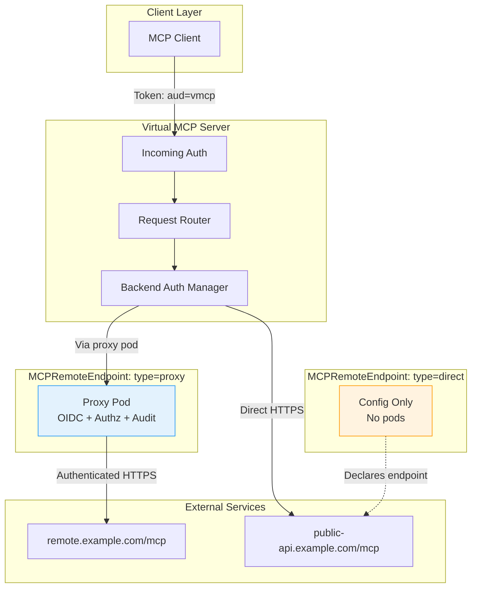
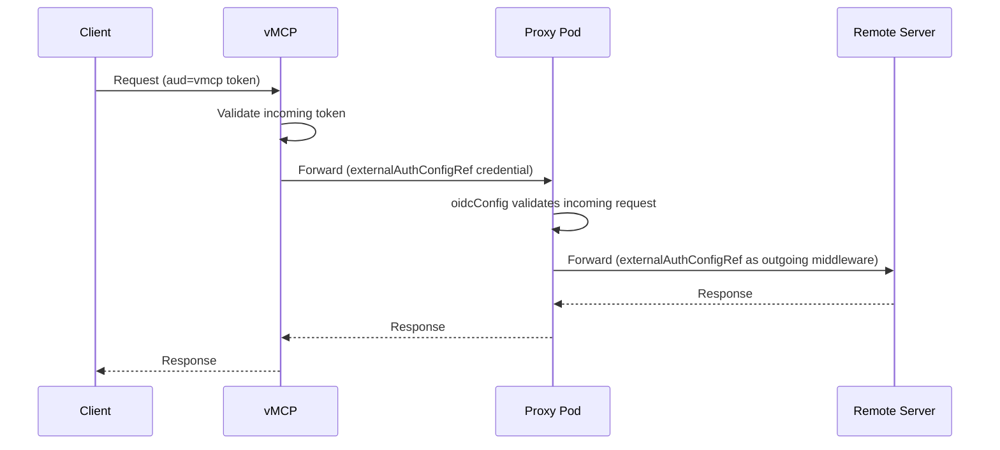
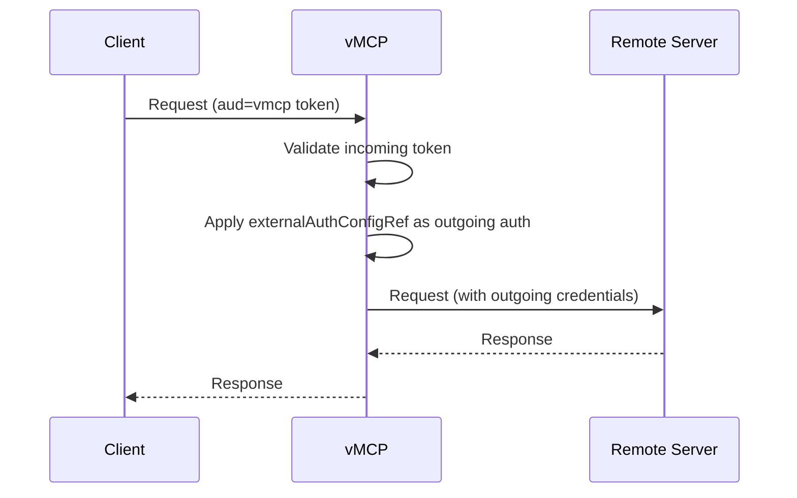

# THV-XXXX: MCPRemoteEndpoint CRD — Unified Remote MCP Server Connectivity

- **Status**: Draft
- **Author(s)**: @ChrisJBurns, @jaosorior
- **Created**: 2026-03-18
- **Last Updated**: 2026-04-07
- **Target Repository**: toolhive
- **Supersedes**: [THV-0055](./THV-0055-mcpserverentry-direct-remote-backends.md) (MCPServerEntry CRD). MCPServerEntry ships first as a near-term solution; this RFC defines its long-term replacement.
- **Related Issues**: [toolhive#3104](https://github.com/stacklok/toolhive/issues/3104), [toolhive#4109](https://github.com/stacklok/toolhive/issues/4109)

## Summary

Introduce a new `MCPRemoteEndpoint` CRD that unifies remote MCP server
connectivity under a single resource with two explicit modes:

- **`type: proxy`** — deploys a proxy pod with full auth middleware, authz
  policy, and audit logging. Functionally equivalent to `MCPRemoteProxy` and
  replaces it.
- **`type: direct`** — no pod deployed; VirtualMCPServer connects directly to
  the remote URL. Resolves forced-auth on public remotes
  ([#3104](https://github.com/stacklok/toolhive/issues/3104)) and eliminates
  unnecessary infrastructure for simple remote backends.

`MCPRemoteProxy` is deprecated in favour of `MCPRemoteEndpoint` with
`type: proxy`. Existing `MCPRemoteProxy` resources continue to function during
the deprecation window with no immediate migration required.

## Problem Statement

### 1. Forced Authentication on Public Remotes (Issue #3104)

`MCPRemoteProxy` requires OIDC authentication configuration even when
VirtualMCPServer already handles client authentication at its own boundary.
This blocks unauthenticated public remote MCP servers (e.g., context7, public
API gateways) from being placed behind vMCP without configuring unnecessary
auth on the proxy layer.

### 2. Resource Waste

Every remote MCP server behind vMCP requires a full Deployment + Service + Pod
just to forward HTTP requests that vMCP could make directly. For organisations
with many remote MCP backends, this creates unnecessary infrastructure cost and
operational overhead.

### 3. CRD Proliferation and Overlapping Goals

The original THV-0055 proposed `MCPServerEntry` as a companion resource to
`MCPRemoteProxy`. Both resources would have existed to serve the same
high-level user goal: connecting to a remote MCP server. Both reference a
`remoteURL`, join a `groupRef`, and support `externalAuthConfigRef`. The only
difference is whether a proxy pod is deployed.

Having two separate CRDs for the same goal — differing only in their mechanism
— increases the API surface users must learn and makes the right choice
non-obvious before writing any YAML. The goal (`connect to a remote server`)
should be the abstraction; the mechanism (`via a proxy pod` vs `directly`)
should be a configuration choice within it.

### Who Is Affected

- **Platform teams** deploying vMCP with remote MCP backends in Kubernetes
- **Product teams** wanting to register external MCP services behind vMCP
- **Existing `MCPRemoteProxy` users** who will migrate to
  `MCPRemoteEndpoint` with `type: proxy`

## Goals

- Provide a single, purpose-built CRD for all remote MCP server connectivity
- Enable vMCP to connect directly to remote MCP servers without a proxy pod
  for simple use cases
- Allow unauthenticated remote MCP servers behind vMCP without workarounds
- Retain the full feature set of `MCPRemoteProxy` (auth middleware, authz,
  audit logging) under `type: proxy`
- Deprecate `MCPRemoteProxy` with a clear migration path
- Reduce long-term CRD surface area rather than growing it

## Non-Goals

- **Removing `MCPRemoteProxy` immediately**: It remains functional during the
  deprecation window. Removal is a follow-up once adoption of
  `MCPRemoteEndpoint` is confirmed.
- **Adding health probing from the operator**: The controller should NOT probe
  remote URLs. Health checking belongs in vMCP's existing runtime
  infrastructure (`healthCheckInterval`, circuit breaker).
- **Cross-namespace references**: `MCPRemoteEndpoint` follows the same
  namespace-scoped patterns as other ToolHive CRDs.
- **Supporting stdio or container-based transports**: `MCPRemoteEndpoint` is
  exclusively for remote HTTP-based MCP servers.
- **CLI mode support**: `MCPRemoteEndpoint` is a Kubernetes-only CRD.
- **Multi-replica vMCP with `type: direct`**: Session state is in-process only.
  See [Session Constraints](#session-constraints-in-direct-mode).

## Mode Selection Guide

| Scenario | Recommended Mode | Why |
|---|---|---|
| Public, unauthenticated remote (e.g., context7) | `direct` | No auth middleware needed; no pod required |
| Remote with outgoing auth handled by vMCP (token exchange, header injection, etc.) | `direct` | vMCP applies outgoing auth directly; one fewer hop |
| Remote requiring its own OIDC validation boundary | `proxy` | Proxy pod validates tokens independently |
| Remote requiring Cedar authz policies per-endpoint | `proxy` | Authz policies run in the proxy pod |
| Remote needing audit logging at the endpoint level | `proxy` | Proxy pod has its own audit middleware |
| Standalone use without VirtualMCPServer | `proxy` | Direct mode requires vMCP to function |
| Many remotes where pod-per-remote is too costly | `direct` | No Deployment/Service/Pod per remote |

**Rule of thumb:** Use `direct` for simple, public remotes or any remote
fronted by vMCP where vMCP handles outgoing auth. Use `proxy` when you need an
independent auth/authz/audit boundary per remote, or when the backend needs to
be accessible standalone.

## Proposed Solution

### High-Level Design

`MCPRemoteEndpoint` is a single CRD with a `type` discriminator field. Shared
fields sit at the top level. Fields only applicable to the proxy pod are grouped
under `proxyConfig`.



### Mode Comparison

| Capability | `type: proxy` | `type: direct` |
|---|---|---|
| Deploys proxy pod | Yes | No |
| Own OIDC validation | Yes | No (vMCP handles this) |
| Own authz policy | Yes | No |
| Own audit logging | Yes (proxy-level) | No (vMCP's audit middleware; see [Audit Limitations](#audit-limitations-in-direct-mode)) |
| Standalone use (without vMCP) | Yes | No |
| Outgoing auth to remote | Yes (`externalAuthConfigRef`) | Yes (`externalAuthConfigRef`) |
| Header forwarding | Yes (`headerForward`) | Yes (`headerForward`) |
| Custom CA bundle | Yes (`caBundleRef`) | Yes (`caBundleRef`) |
| Tool filtering | Yes (`toolConfigRef`) | Yes (`toolConfigRef`) |
| GroupRef support | Yes | Yes |
| Multi-replica vMCP | Yes | No — see [Session Constraints](#session-constraints-in-direct-mode) |
| Credential blast radius | Isolated per proxy pod | All credentials in vMCP pod — see [Security Considerations](#security-considerations) |

### Auth Flow Comparison

**`type: proxy` — two independent auth legs:**



`externalAuthConfigRef` on a `type: proxy` endpoint is read by two separate
consumers:

1. **vMCP** reads it at backend discovery time (`discoverRemoteProxyAuthConfig()`
   in `pkg/vmcp/workloads/k8s.go`). The resolved strategy is applied by vMCP's
   `authRoundTripper` when making outgoing calls **to the proxy pod**.
2. **The proxy pod** reads the same field via the operator-generated RunConfig
   (`AddExternalAuthConfigOptions()` in `mcpremoteproxy_runconfig.go`). The pod
   applies it as outgoing middleware when forwarding requests **to the remote server**.

In direct mode, only consumer 1 applies — there is no proxy pod.

`proxyConfig.oidcConfig` is a third, separate concern — it validates tokens
arriving at the proxy pod from vMCP. It is entirely independent of
`externalAuthConfigRef`.

**`type: direct` — single auth boundary:**



vMCP reads `externalAuthConfigRef` and applies it when calling the remote
server directly. For `type: tokenExchange`, the client's validated incoming
token is used as the RFC 8693 `subject_token` to obtain a service token for
the remote. The token exchange server must trust the IdP that issued the
client's token.

**Token exchange operational requirements (`type: direct`):**
- The STS must be configured to accept subject tokens from vMCP's IdP.
- Configure `audience` in the `MCPExternalAuthConfig` to match the remote
  server's expected audience claim.

**Unsupported `externalAuthConfigRef` types for `type: direct`:**

The following types are **not valid** when `type: direct`:

- **`embeddedAuthServer`**: Requires a running pod to host the OAuth2 server.
  No pod exists in direct mode.
- **`awsSts`**: No converter is registered in vMCP's DefaultRegistry
  (`pkg/vmcp/auth/converters`). The registry only registers `tokenExchange`,
  `headerInjection`, and `unauthenticated`. Using `awsSts` in direct mode will
  cause backend discovery to fail at runtime.

The controller MUST reject these combinations and set ConfigurationValid=False with reason UnsupportedAuthTypeForDirectMode.

### Detailed Design

#### CRD Validation Rules

CEL `XValidation` rules in Kubebuilder are **struct-level** markers — placed on
the type being validated, not on a field within it. The pattern (from
`virtualmcpserver_types.go:88`):

```go
// +kubebuilder:validation:XValidation:rule="...",message="..."
type StructName struct { ... }
```

The four rules for `MCPRemoteEndpoint`, placed on their correct owning types:

```go
// MCPRemoteEndpointSpec struct-level rules:
//
// +kubebuilder:validation:XValidation:rule="self.type != 'direct' || !has(self.proxyConfig)",message="spec.proxyConfig must not be set when type is direct"
// +kubebuilder:validation:XValidation:rule="self.type != 'proxy' || has(self.proxyConfig)",message="spec.proxyConfig is required when type is proxy"
// +kubebuilder:validation:XValidation:rule="oldSelf == null || self.type == oldSelf.type",message="spec.type is immutable after creation"
//
//nolint:lll
type MCPRemoteEndpointSpec struct { ... }

// MCPRemoteEndpointProxyConfig — oidcConfig uses standard required marker:
type MCPRemoteEndpointProxyConfig struct {
    // +kubebuilder:validation:Required
    OIDCConfig OIDCConfigRef `json:"oidcConfig"`
    // ...
}
```

**Important:** The `oldSelf == null` guard is required so the immutability rule
passes on object creation (when no previous state exists). Without it, the rule
will panic or be silently skipped on create depending on Kubernetes version.


#### MCPRemoteEndpoint CRD

```yaml
apiVersion: toolhive.stacklok.dev/v1alpha1
kind: MCPRemoteEndpoint
metadata:
  name: context7
  namespace: default
spec:
  # REQUIRED: Connectivity mode — IMMUTABLE after creation.
  # Delete and recreate to change type.
  # +kubebuilder:validation:Enum=proxy;direct
  # +kubebuilder:default=proxy
  # (immutability enforced by struct-level CEL rule, not here)
  type: direct

  # REQUIRED: URL of the remote MCP server.
  # +kubebuilder:validation:Pattern=`^https?://`
  remoteURL: https://mcp.context7.com/mcp

  # REQUIRED: Transport protocol.
  # streamable-http is RECOMMENDED. sse is the legacy 2024-11-05 transport,
  # retained for backwards compatibility with servers that have not yet migrated.
  # +kubebuilder:validation:Enum=streamable-http;sse
  transport: streamable-http

  # REQUIRED: Group membership. MCPRemoteEndpoint only functions as part of
  # an MCPGroup (aggregated by VirtualMCPServer), so groupRef is always required.
  groupRef: engineering-team

  # OPTIONAL: Auth for outgoing requests to the remote server.
  # In proxy mode: vMCP reads this for vMCP->proxy auth AND the proxy pod
  # reads it for proxy->remote auth (two separate consumers, same field).
  # In direct mode: vMCP reads this for vMCP->remote auth only.
  # Omit for unauthenticated public remotes.
  # NOT valid in direct mode: embeddedAuthServer, awsSts (see Auth Flow section).
  externalAuthConfigRef:
    name: salesforce-auth

  # OPTIONAL: Header forwarding. Applies to both modes.
  headerForward:
    addPlaintextHeaders:
      # WARNING: values stored in plaintext in etcd and visible via kubectl.
      # Never put API keys, tokens, or secrets here.
      # Use addHeadersFromSecret for sensitive values.
      X-Tenant-ID: "tenant-123"
    addHeadersFromSecret:
      - headerName: X-API-Key
        valueSecretRef:
          name: remote-api-credentials
          key: api-key

  # OPTIONAL: Custom CA bundle (ConfigMap) for private remote servers.
  # NOTE: CA bundle ConfigMaps are trust anchors. Protect them with RBAC —
  # anyone with ConfigMap write access in the namespace can inject a malicious
  # CA and intercept TLS traffic to this backend.
  caBundleRef:
    name: internal-ca-bundle
    key: ca.crt

  # OPTIONAL: Tool filtering. Applies to both modes.
  toolConfigRef:
    name: my-tool-config

  # OPTIONAL: Proxy pod configuration.
  # REQUIRED when type: proxy. MUST NOT be set when type: direct.
  # Validation is enforced by struct-level CEL rules on MCPRemoteEndpointSpec
  # and MCPRemoteEndpointProxyConfig — not by field-level markers here.
  proxyConfig:
    oidcConfig:         # REQUIRED within proxyConfig
      type: kubernetes
    authzConfig:
      type: inline
      inline:
        policies: [...]
    audit:
      enabled: true
    telemetry:
      openTelemetry:
        enabled: true
    resources:
      limits:
        cpu: "500m"
        memory: "128Mi"
    serviceAccount: my-service-account
    # +kubebuilder:default=8080
    proxyPort: 8080
    # +kubebuilder:validation:Enum=ClientIP;None
    # +kubebuilder:default=ClientIP
    # NOTE: ClientIP affinity is a rough approximation; Mcp-Session-Id
    # header-based affinity is spec-correct but requires an ingress controller.
    sessionAffinity: ClientIP
    # +kubebuilder:default=false
    trustProxyHeaders: false
    endpointPrefix: ""
    resourceOverrides: {}
```

**Example: Unauthenticated public remote (direct mode):**

```yaml
apiVersion: toolhive.stacklok.dev/v1alpha1
kind: MCPRemoteEndpoint
metadata:
  name: context7
spec:
  type: direct
  remoteURL: https://mcp.context7.com/mcp
  transport: streamable-http
  groupRef: engineering-team
```

**Example: Token exchange auth (direct mode):**

```yaml
apiVersion: toolhive.stacklok.dev/v1alpha1
kind: MCPRemoteEndpoint
metadata:
  name: salesforce-mcp
spec:
  type: direct
  remoteURL: https://mcp.salesforce.com
  transport: streamable-http
  groupRef: engineering-team
  externalAuthConfigRef:
    name: salesforce-token-exchange  # type: tokenExchange
```

**Example: Standalone proxy with auth middleware (proxy mode):**

```yaml
apiVersion: toolhive.stacklok.dev/v1alpha1
kind: MCPRemoteEndpoint
metadata:
  name: internal-api-mcp
spec:
  type: proxy
  remoteURL: https://internal-mcp.corp.example.com/mcp
  transport: streamable-http
  groupRef: engineering-team
  proxyConfig:
    oidcConfig:
      type: kubernetes
    authzConfig:
      type: inline
      inline:
        policies: ["permit(principal, action, resource);"]
    audit:
      enabled: true
```

#### CRD Metadata

```go
// +kubebuilder:resource:shortName=mcpre
// +kubebuilder:printcolumn:name="Type",type="string",JSONPath=".spec.type"
// +kubebuilder:printcolumn:name="Phase",type="string",JSONPath=".status.phase"
// +kubebuilder:printcolumn:name="Remote URL",type="string",JSONPath=".spec.remoteURL"
// +kubebuilder:printcolumn:name="URL",type="string",JSONPath=".status.url"
// +kubebuilder:printcolumn:name="Age",type="date",JSONPath=".metadata.creationTimestamp"
```

Short name: `mcpre` (consistent with `mcpg` for MCPGroup, `vmcp` for
VirtualMCPServer, `extauth` for MCPExternalAuthConfig).

#### Spec Fields

**Top-level (both modes):**

| Field | Type | Required | Description |
|---|---|---|---|
| `type` | enum | Yes | `proxy` or `direct`. Default: `proxy`. **Immutable after creation.** |
| `remoteURL` | string | Yes | URL of the remote MCP server. |
| `transport` | enum | Yes | `streamable-http` (recommended) or `sse` (legacy 2024-11-05 transport). |
| `groupRef` | string | Yes | Name of the MCPGroup. |
| `externalAuthConfigRef` | object | No | Outgoing auth config. In proxy mode: read by both vMCP (vMCP→proxy) and the proxy pod (proxy→remote). In direct mode: read by vMCP only (vMCP→remote). Types `embeddedAuthServer` and `awsSts` are invalid in direct mode. |
| `headerForward` | object | No | Header injection. `addPlaintextHeaders` values are stored in plaintext in etcd — use `addHeadersFromSecret` for secrets. |
| `caBundleRef` | object | No | ConfigMap containing a custom CA bundle. Protect with RBAC — write access enables MITM. |
| `toolConfigRef` | object | No | Tool filtering. |

**`proxyConfig` (only when `type: proxy`):**

| Field | Type | Required | Description |
|---|---|---|---|
| `oidcConfig` | object | Yes | Validates tokens arriving at the proxy pod. |
| `authzConfig` | object | No | Cedar authorization policy. |
| `audit` | object | No | Audit logging for the proxy pod. |
| `telemetry` | object | No | Observability configuration. |
| `resources` | object | No | Container resource limits. |
| `serviceAccount` | string | No | Existing SA to use; auto-created if unset. |
| `proxyPort` | int | No | Port to expose. Default: 8080. |
| `sessionAffinity` | enum | No | `ClientIP` (default) or `None`. |
| `trustProxyHeaders` | bool | No | Trust X-Forwarded-* headers. Default: false. |
| `endpointPrefix` | string | No | Path prefix for ingress routing. |
| `resourceOverrides` | object | No | Metadata overrides for created resources. |

#### Status Fields

| Field | Type | Description |
|---|---|---|
| `conditions` | []Condition | Standard Kubernetes conditions. |
| `phase` | string | `Pending`, `Ready`, `Failed`, `Terminating`. |
| `url` | string | For `type: proxy`: cluster-internal Service URL (set once Deployment is ready). For `type: direct`: set to `spec.remoteURL` immediately upon validation. |
| `observedGeneration` | int64 | Most recent generation reconciled. |

**`status.url` lifecycle note:** For `type: proxy`, `status.url` is empty until
the proxy Deployment becomes ready. Backend discoverers (static and dynamic)
MUST treat an empty `status.url` as "backend not yet available" and skip the
backend — not remove it from the registry. For `type: direct`, `status.url` is
set immediately after validation, so this race does not apply.

**Condition types:**

| Type | Purpose | When Set |
|---|---|---|
| `Ready` | Overall readiness | Always |
| `GroupRefValid` | MCPGroup exists | Always |
| `AuthConfigValid` | MCPExternalAuthConfig exists | When `externalAuthConfigRef` is set |
| `CABundleValid` | CA bundle ConfigMap exists | When `caBundleRef` is set |
| `DeploymentReady` | Proxy deployment healthy | Only when `type: proxy` |
| `ConfigurationValid` | All validation checks passed | Always |

No `RemoteReachable` condition — the controller never probes remote URLs.

#### Component Changes

##### Operator: MCPRemoteEndpoint Controller

**Pre-requisite: extract shared proxy logic.** `mcpremoteproxy_controller.go`
is ~1,125 lines with all proxy reconciliation logic bound to
`*mcpv1alpha1.MCPRemoteProxy` methods. Before Phase 1, extract the
Deployment/Service/ServiceAccount/RBAC creation functions into a shared
`pkg/operator/remoteproxy/` package that accepts an interface rather than the
concrete type. `MCPRemoteProxyReconciler` is then refactored to use it.
This is a refactoring-only step with no API changes — all existing tests must
pass unchanged. This is scoped as Phase 0 step 4.

**`type: proxy` path** — uses the extracted shared package:
1. Validates spec (OIDC config, group ref, auth config ref, CA bundle ref)
2. Ensures Deployment, Service, ServiceAccount, RBAC
3. Monitors deployment health, updates `Ready` condition
4. Sets `status.url` to the cluster-internal Service URL

**`type: direct` path** — validation only, no infrastructure:
1. Validates MCPGroup exists; sets `GroupRefValid`
2. If `externalAuthConfigRef` set, validates it exists; sets `AuthConfigValid`
3. If `externalAuthConfigRef` type is `embeddedAuthServer` or `awsSts`, sets
   `ConfigurationValid=False` with reason `UnsupportedAuthTypeForDirectMode`
4. If `caBundleRef` set, validates ConfigMap exists; sets `CABundleValid`
5. Sets `Ready=True` and `status.url = spec.remoteURL`

No finalizers for `type: direct`. `type: proxy` uses the same finalizer pattern
as the existing MCPRemoteProxy controller.

##### Operator: MCPGroup Controller Update

The MCPGroup controller currently watches MCPServer and MCPRemoteProxy. It must
be updated to also watch MCPRemoteEndpoint. The following changes are required
(this is not a single bullet point):

1. Register a field indexer for `MCPRemoteEndpoint.spec.groupRef` in
   `SetupFieldIndexers()` at manager startup — without this, `MatchingFields`
   queries for MCPRemoteEndpoint silently return empty results.
2. Add `findReferencingMCPRemoteEndpoints()` mirroring the existing
   `findReferencingMCPRemoteProxies()`.
3. Add `findMCPGroupForMCPRemoteEndpoint()` watch mapper.
4. Register the watch in `SetupWithManager()` via
   `Watches(&mcpv1alpha1.MCPRemoteEndpoint{}, ...)`.
5. Update `updateGroupMemberStatus()` to call the new function and populate
   new status fields.
6. Update `handleListFailure()` and `handleDeletion()` for MCPRemoteEndpoint
   membership.
7. Add RBAC markers — without these the operator gets a Forbidden error at
   runtime:
   ```
   // +kubebuilder:rbac:groups=toolhive.stacklok.dev,resources=mcpremoteendpoints,verbs=get;list;watch
   // +kubebuilder:rbac:groups=toolhive.stacklok.dev,resources=mcpremoteendpoints/status,verbs=get;update;patch
   ```

**Status fields (additive — no renames):** New fields `status.remoteEndpoints`
and `status.remoteEndpointCount` are added alongside the existing
`status.remoteProxies` and `status.remoteProxyCount`. Both are populated during
the deprecation window. Old fields are removed only when MCPRemoteProxy is
removed. This preserves backward compatibility for existing jsonpath queries
and monitoring dashboards.

##### Operator: VirtualMCPServer Controller Update

**`StaticBackendConfig` schema change required.** The current
`StaticBackendConfig` struct in `pkg/vmcp/config/config.go` has only `Name`,
`URL`, `Transport`, and `Metadata`. The vMCP binary uses `KnownFields(true)`
strict YAML parsing. Writing new fields (`Type`, `CABundlePath`, `Headers`)
to the ConfigMap before updating the vMCP binary will cause a startup failure.

Implementation order:
1. Add `Type`, `CABundlePath`, and `HeaderEnvVars` fields to `StaticBackendConfig`
2. Update the vMCP binary and the roundtrip test in
   `pkg/vmcp/config/crd_cli_roundtrip_test.go`
3. Deploy the updated vMCP image **before** the operator starts writing these
   fields — co-ordinate Helm chart version bumping accordingly

Additional touch points:
- `listMCPRemoteEndpointsAsMap()` — new function for ConfigMap generation
- `getExternalAuthConfigNameFromWorkload()` — add MCPRemoteEndpoint case
- Deployment volume mount logic for `caBundleRef` ConfigMaps

**Header secret handling in static mode:** Secret values MUST NOT be inlined
into the backend ConfigMap. Instead, the operator uses the same `SecretKeyRef`
pattern that MCPRemoteProxy already uses:

1. For each `type: direct` endpoint with `addHeadersFromSecret` entries, the
   operator adds `SecretKeyRef` environment variables to the **vMCP Deployment**
   (e.g. `TOOLHIVE_SECRET_HEADER_FORWARD_X_API_KEY_<ENDPOINT_NAME>`).
2. The static backend ConfigMap stores only the env var names — never the
   secret values themselves.
3. At runtime, vMCP resolves header values via the existing
   `secrets.EnvironmentProvider`, identical to how MCPRemoteProxy pods handle
   this today.

This ensures no key material is written to ConfigMaps or stored in etcd in
plaintext. The trade-off is that adding or removing `addHeadersFromSecret`
entries on a direct endpoint triggers a vMCP Deployment update (and therefore
a pod restart), consistent with how CA bundle changes already behave in static
mode.

**CA bundle in static mode:** The operator mounts the `caBundleRef` ConfigMap
as a volume into the vMCP pod at `/etc/toolhive/ca-bundles/<endpoint-name>/ca.crt`.
The generated backend ConfigMap includes the mount path so vMCP can construct
the correct `tls.Config`. Pod restart is required when a CA bundle changes in
static mode.

##### vMCP: Backend Discovery Update

Add `WorkloadTypeMCPRemoteEndpoint` to `pkg/vmcp/workloads/discoverer.go`.

Extend `ListWorkloadsInGroup()` and `GetWorkloadAsVMCPBackend()` in
`pkg/vmcp/workloads/k8s.go`. For MCPRemoteEndpoint:
- `type: proxy` — uses `status.url` (proxy Service URL), same as MCPRemoteProxy
- `type: direct` — uses `spec.remoteURL` directly

**Name collision prevention:** The MCPRemoteEndpoint controller MUST reject
creation if an MCPServer or MCPRemoteProxy with the same name already exists in
the namespace, setting `ConfigurationValid=False` with reason
`NameCollision`. Likewise, the MCPServer and MCPRemoteProxy controllers MUST
be updated to reject collisions with MCPRemoteEndpoint. This prevents
surprising fallback behaviour where deleting one resource type silently
activates a different resource with the same name.

`fetchBackendResource()` in `pkg/vmcp/k8s/backend_reconciler.go` retains its
existing resolution order (MCPServer → MCPRemoteProxy → MCPRemoteEndpoint) as
a defensive fallback, but the admission-time rejection above makes same-name
collisions a user error rather than an implicit resolution policy.

##### vMCP: HTTP Client for Direct Mode

For `type: direct` backends:
1. Use system CA pool by default; optionally append `caBundleRef` CA bundle
2. Enforce TLS 1.2 minimum
3. Apply `externalAuthConfigRef` credentials via `authRoundTripper`
4. Inject `MCP-Protocol-Version: <negotiated-version>` on every HTTP request
   after initialization — this is a MUST per MCP spec 2025-11-25 and applies
   to both POST (tool calls) and GET (server notification stream) requests

##### vMCP: Reconnection Handling for Direct Mode

When a `type: direct` backend connection drops, vMCP follows this sequence
per MCP spec 2025-11-25:

1. **Attempt stream resumption (SHOULD).** If the backend previously issued SSE
   event IDs, vMCP SHOULD issue an HTTP GET with `Last-Event-ID` set to the
   last received event ID before re-initializing. If the connection recovers
   and the session remains valid, no re-initialization is needed.

2. **Exponential backoff.** Initial: 1s, cap: 30s, jitter recommended.
   If the backend sends a `retry` field in an SSE event, that value overrides
   the local backoff for that attempt.

3. **Full re-initialization on HTTP 404 or session loss.** If HTTP 404 is
   returned on a request carrying an `MCP-Session-Id`, discard all session state
   and execute the full handshake:
   ```
   POST initialize request → InitializeResult (new MCP-Session-Id)
   POST notifications/initialized
   ```
   After initialization, re-discover ALL capabilities advertised in the new
   `InitializeResult` (tools, resources, prompts as applicable). Results from
   the prior session MUST NOT be reused.

4. **Re-establish GET stream.** See section below.

5. **Circuit breaker.** After 5 consecutive failed attempts, mark the backend
   `unavailable` and open the circuit breaker. The resource transitions to the
   `Failed` phase. A half-open probe at 60-second intervals tests recovery.

##### vMCP: Server-Initiated Notifications in Direct Mode

vMCP acts as an MCP **client** toward each `type: direct` backend and MUST
maintain a persistent HTTP GET SSE stream to each backend for server-initiated
messages.

After initialization (after sending `notifications/initialized`), vMCP MUST
issue:
```
GET <mcp-endpoint>
Accept: text/event-stream
MCP-Session-Id: <session-id>        (if the server issued one)
MCP-Protocol-Version: 2025-11-25    (MUST be included per spec)
```

Notifications vMCP MUST handle:

| Notification | Action |
|---|---|
| `notifications/tools/list_changed` | Re-fetch `tools/list`, update routing table |
| `notifications/resources/list_changed` | Re-fetch `resources/list`, update routing table |
| `notifications/prompts/list_changed` | Re-fetch `prompts/list`, update routing table |

vMCP MUST only act on notifications for capabilities advertised with
`listChanged: true` in the `InitializeResult`. Other notifications should be
logged and discarded.

The GET stream MUST be re-established as step 4 of the reconnection sequence
above. If it cannot be established, the backend follows the circuit breaker path.

##### vMCP: Dynamic Mode Reconciler Update

Extend `BackendReconciler` in `pkg/vmcp/k8s/backend_reconciler.go` to watch
MCPRemoteEndpoint using the same `EnqueueRequestsFromMapFunc` pattern.
`fetchBackendResource()` gains a third type to try (see resolution order above).

##### Session Constraints in Direct Mode

**Why multi-replica fails.** The MCP `Mcp-Session-Id` is stored in
`LocalStorage`, which is a `sync.Map` held entirely in process memory
(`pkg/transport/session/storage_local.go`). A second vMCP replica has no
knowledge of sessions established by the first, causing HTTP 400 or 404 errors
on routed requests.

**Single-replica is the only supported constraint.** `type: direct` endpoints
MUST be deployed with `replicas: 1` on the VirtualMCPServer Deployment.

**No distributed session backend exists.** `pkg/transport/session/storage.go`
defines a `Storage` interface that is Redis-compatible. The serialization
helpers in `serialization.go` are explicitly marked
`// nolint:unused // Will be used in Phase 4 for Redis/Valkey storage`. However,
no Redis implementation of `session.Storage` exists in the codebase — the Redis
code in `pkg/authserver/storage/redis.go` is for a different purpose (OAuth
server state via fosite) and is unrelated. A distributed session backend would
need to be built from scratch as a new `session.Storage` implementation and is
out of scope for this RFC.

## Security Considerations

### Threat Model

| Threat | Description | Mitigation |
|---|---|---|
| MITM on remote connection | Attacker intercepts vMCP-to-remote traffic | HTTPS required by default; custom CA bundles for private CAs |
| Credential exposure | Auth secrets visible in CRD manifest | Credentials stored in K8s Secrets; never inline. `addPlaintextHeaders` stores values in plaintext in etcd — use `addHeadersFromSecret` for sensitive values |
| SSRF via remoteURL | Compromised workload with CRD write access sets `remoteURL` to internal targets | RBAC + NetworkPolicy (see below) |
| Auth config confusion | Wrong credentials sent to wrong backend | Eliminated in direct mode: `externalAuthConfigRef` has one purpose (vMCP→remote). In proxy mode: see Auth Flow for the dual-consumer behaviour |
| Operator probing external URLs | Controller makes network requests to untrusted URLs | Eliminated: validation only, no probing |
| Expanded vMCP egress | vMCP pod makes outbound calls in direct mode | Acknowledged trade-off. See Credential Blast Radius below |
| Trust store injection | ConfigMap write access allows injecting malicious CA | CA bundle ConfigMaps are trust anchors; protect with RBAC |
| Token audience confusion | Exchanged token has broader scope than intended | Post-exchange audience validation MUST be implemented — see Phase 2 |

### SSRF Mitigation

When threat actors include compromised workloads with CRD write access. The following are required:

1. **RBAC (REQUIRED):** Only cluster administrators or trusted platform service
   accounts should have `create`/`update` permissions on MCPRemoteEndpoint.

### Credential Blast Radius in Direct Mode

In `type: proxy` mode, each proxy pod holds credentials for exactly one backend.
A compromised proxy pod yields credentials for one service.

In `type: direct` mode, the vMCP pod holds credentials for every direct backend
simultaneously. A compromised vMCP pod yields credentials for all backends.

**Recommendation for high-security environments:** Use `type: proxy` for
sensitive-credential backends. Reserve `type: direct` for unauthenticated or
low-sensitivity backends. Consider dedicated VirtualMCPServer instances (and
therefore dedicated MCPGroups) to isolate high-sensitivity backends.

### CA Bundle Trust Store Considerations

CA bundle ConfigMaps are trust anchors, not merely public data. Anyone with
`configmaps:update` in the namespace can inject a malicious CA certificate,
enabling MITM attacks against all `type: direct` backends referencing that
ConfigMap. CA bundle ConfigMaps MUST be protected with the same RBAC rigour as
the MCPRemoteEndpoint resource itself.

### Audit Limitations in Direct Mode

In `type: proxy` mode, the proxy pod logs: incoming request details, outgoing
URL, auth outcome, and remote response status.

In `type: direct` mode, vMCP's existing audit middleware logs incoming client
requests but does **not** currently log: the remote URL contacted, outgoing auth
outcome, or remote HTTP response status. This is a known gap.

**Required enhancement (Phase 2):** vMCP's audit middleware must be extended for
`type: direct` backends to log the remote URL, auth method, and remote HTTP
status code.

### Secrets Management

- **Dynamic mode**: vMCP reads secrets at runtime via K8s API.
- **Static mode**: Credentials mounted as environment variables; CA bundles
  mounted as volumes.
- **Routine secret rotation** (static mode): Deployment rollout — old pods
  continue serving until replaced.
- **Emergency revocation** (compromised credential): Use `strategy: Recreate`
  on the VirtualMCPServer Deployment, or trigger `kubectl rollout restart`
  immediately. RollingUpdate leaves old pods running with the revoked credential
  until replacement completes.

### Authentication and Authorization

- **No new auth primitives**: Reuses existing `MCPExternalAuthConfig` CRD.
- **Direct mode**: vMCP validates incoming client tokens; `externalAuthConfigRef`
  handles outgoing auth to the remote. Single, unambiguous boundary.
- **Proxy mode**: Two independent boundaries — see Auth Flow Comparison for
  the dual-consumer behaviour of `externalAuthConfigRef`.
- **Post-exchange audience validation**: The current token exchange implementation
  (`pkg/auth/tokenexchange/exchange.go`) does not validate the `aud` claim of
  the returned token against the configured `audience` parameter. This MUST be
  implemented before `type: direct` is considered secure for multi-backend
  deployments. Scoped to Phase 2.

## Deprecation

Both `MCPRemoteProxy` and `MCPServerEntry` (THV-0055) are deprecated as of
this RFC. MCPServerEntry ships first as a near-term solution; once
MCPRemoteEndpoint reaches GA, MCPServerEntry's `type: direct` mode provides
equivalent functionality and MCPServerEntry enters its deprecation window.

**Note on deprecation mechanism:** `+kubebuilder:deprecatedversion` only
deprecates API versions within the same CRD. It cannot deprecate one CRD in
favour of a different CRD. The deprecation is communicated via:
1. Warning events emitted on every MCPRemoteProxy and MCPServerEntry
   `Reconcile()` call
2. A `deprecated: "true"` field in the CRD description
3. Documentation updates

**Timeline:**

| Phase | Trigger | What Happens |
|---|---|---|
| MCPServerEntry ships | THV-0055 merges | MCPServerEntry available for near-term direct remote use cases |
| Announced | This RFC merges | Warning events on MCPRemoteProxy reconcile; CRD description updated |
| Feature freeze | MCPRemoteEndpoint Phase 1 merged | Bug fixes and security patches only for MCPRemoteProxy and MCPServerEntry |
| Migration window | MCPRemoteEndpoint reaches GA | Minimum 2 minor ToolHive operator releases |
| Removal | After migration window | MCPRemoteProxy, MCPServerEntry CRDs, controllers, Helm templates, RBAC removed |

### Migration: MCPRemoteProxy → MCPRemoteEndpoint

| `MCPRemoteProxy` field | `MCPRemoteEndpoint` equivalent | Notes |
|---|---|---|
| `spec.remoteURL` | `spec.remoteURL` | |
| `spec.port` (deprecated) | `spec.proxyConfig.proxyPort` | Use `proxyPort` |
| `spec.proxyPort` | `spec.proxyConfig.proxyPort` | |
| `spec.transport` | `spec.transport` | |
| `spec.groupRef` | `spec.groupRef` | |
| `spec.externalAuthConfigRef` | `spec.externalAuthConfigRef` | See Auth Flow — dual-consumer behaviour preserved |
| `spec.headerForward` | `spec.headerForward` | |
| `spec.toolConfigRef` | `spec.toolConfigRef` | |
| `spec.oidcConfig` | `spec.proxyConfig.oidcConfig` | |
| `spec.authzConfig` | `spec.proxyConfig.authzConfig` | |
| `spec.audit` | `spec.proxyConfig.audit` | |
| `spec.telemetry` | `spec.proxyConfig.telemetry` | |
| `spec.resources` | `spec.proxyConfig.resources` | |
| `spec.serviceAccount` | `spec.proxyConfig.serviceAccount` | |
| `spec.sessionAffinity` | `spec.proxyConfig.sessionAffinity` | |
| `spec.trustProxyHeaders` | `spec.proxyConfig.trustProxyHeaders` | |
| `spec.endpointPrefix` | `spec.proxyConfig.endpointPrefix` | |
| `spec.resourceOverrides` | `spec.proxyConfig.resourceOverrides` | |
| *(not present)* | `spec.type` | Set to `proxy` |
| *(not present)* | `spec.caBundleRef` | New field; not on MCPRemoteProxy |

### Migration: MCPServerEntry → MCPRemoteEndpoint

| `MCPServerEntry` field | `MCPRemoteEndpoint` equivalent | Notes |
|---|---|---|
| `spec.remoteURL` | `spec.remoteURL` | |
| `spec.transport` | `spec.transport` | |
| `spec.groupRef` | `spec.groupRef` | |
| `spec.externalAuthConfigRef` | `spec.externalAuthConfigRef` | |
| `spec.headerForward` | `spec.headerForward` | |
| `spec.caBundleRef` | `spec.caBundleRef` | |
| *(not present)* | `spec.type` | Set to `direct` |
| *(not present)* | `spec.toolConfigRef` | New field; not on MCPServerEntry |

## Alternatives Considered

### Alternative 1: Keep MCPServerEntry Permanently Alongside MCPRemoteProxy (THV-0055)

MCPServerEntry (THV-0055) ships first as a near-term solution for direct
remote backends behind vMCP. However, keeping both MCPServerEntry and
MCPRemoteProxy permanently means two CRDs with overlapping goals
(`remoteURL`, `groupRef`, `externalAuthConfigRef`, `headerForward` on both),
increasing cognitive load and long-term CRD surface area.
MCPRemoteEndpoint unifies both under a single resource, with MCPServerEntry's
`type: direct` mode covering the same use case. MCPServerEntry will enter a
deprecation window once MCPRemoteEndpoint reaches GA.

### Alternative 2: `direct: true` Flag on MCPRemoteProxy

**Why not chosen:** MCPRemoteProxy has ~9 pod-deployment-specific fields
that become inapplicable and confusing with a direct flag. Field pollution is
too high. The typed `proxyConfig` sub-object in MCPRemoteEndpoint solves this
cleanly.

### Alternative 3: Inline Remote Backends in VirtualMCPServer

**Why not chosen:** Prevents RBAC separation (only VirtualMCPServer editors
can manage backends) and couples backend lifecycle to vMCP reconciliation.

## Compatibility

### Backward Compatibility

- `MCPRemoteProxy` continues to function during the deprecation window
- `MCPServer` is unchanged
- `VirtualMCPServer`, `MCPGroup`, `MCPExternalAuthConfig` receive additive
  changes only (new watches, new status fields alongside existing ones)

### Forward Compatibility

- Starts at `v1alpha1`, graduation path to `v1beta1` as part of broader CRD
  revamp
- `type` field and typed sub-configs allow future modes without breaking changes

## Implementation Plan

### Phase 0: MCPRemoteProxy Deprecation + Controller Refactoring

1. Add `deprecated: "true"` to MCPRemoteProxy CRD description
2. Emit Warning events on every MCPRemoteProxy `Reconcile()` call
3. Update documentation
4. Extract shared proxy reconciliation logic from `mcpremoteproxy_controller.go`
   into `pkg/operator/remoteproxy/` — refactoring only, no API changes,
   all existing MCPRemoteProxy tests must pass

### Phase 1: CRD and Controller

1. Define `MCPRemoteEndpoint` CRD types with struct-level CEL rules (see CRD
   Validation Rules section for correct placement)
2. Implement controller with both code paths using the Phase 0 shared package
3. Generate CRD manifests; update Helm chart with default NetworkPolicy
4. Update MCPGroup controller — all 7 code changes listed above, including
   field indexer registration and RBAC markers
5. Unit tests for both controller paths; CEL rule tests

### Phase 2: Static Mode Integration

1. Add `Type`, `CABundlePath`, `HeaderEnvVars` fields to `StaticBackendConfig`;
   update vMCP binary and roundtrip test BEFORE operator starts writing them
2. Update VirtualMCPServer controller: `listMCPRemoteEndpointsAsMap()`,
   `getExternalAuthConfigNameFromWorkload()`, ConfigMap generation
3. Add `SecretKeyRef` env vars to vMCP Deployment for `addHeadersFromSecret`
   entries on `type: direct` endpoints; store env var names (not values) in
   backend ConfigMap
4. Mount CA bundle ConfigMaps as volumes
5. Implement post-exchange audience validation in token exchange strategy
6. Extend vMCP audit middleware for `type: direct` (remote URL, auth outcome,
   remote HTTP status)
7. Integration tests with envtest

### Phase 3: Dynamic Mode Integration

1. Add `WorkloadTypeMCPRemoteEndpoint` to `pkg/vmcp/workloads/discoverer.go`
2. Extend `BackendReconciler` and `ListWorkloadsInGroup()` / `GetWorkloadAsVMCPBackend()`
3. Implement `MCP-Protocol-Version` header injection for direct mode HTTP client
4. Implement reconnection handling (stream resumption, full re-init on 404,
   circuit breaker)
5. Implement persistent GET stream for server-initiated notifications
6. Integration tests for dynamic discovery

### Phase 4: Documentation and E2E

1. CRD reference documentation
2. Migration guide: MCPRemoteProxy → MCPRemoteEndpoint
3. User guide with mode selection guidance
4. Document single-replica constraint for `type: direct`
5. E2E Chainsaw tests for both modes and mixed groups

### Dependencies

- THV-0014 (K8s-Aware vMCP) — already merged; dynamic mode (Phase 3) is unblocked

## Open Questions

1. **`groupRef` required?** Resolved: Yes. Follow-up: consider requiring it on
   MCPServer and MCPRemoteProxy too for consistency.

2. **MCPRemoteProxy removal timing?** Resolved: After two minor releases
   post-MCPRemoteEndpoint GA.

3. **`toolConfigRef` placement?** Resolved: Shared top-level field.

4. **`disabled` field?** Deferred. `groupRef` is required; disabling an endpoint
   requires deletion. A `disabled: true` field can be added additively later if
   post-implementation feedback shows deletion is too disruptive.

5. **Multi-replica for `type: direct`?** Resolved as out-of-scope. Single-replica
   is the constraint. Redis session storage is a future follow-up requiring a new
   `session.Storage` implementation.

## References

- [THV-0055: MCPServerEntry CRD](./THV-0055-mcpserverentry-direct-remote-backends.md) — near-term solution for direct remote backends; superseded by this RFC once MCPRemoteEndpoint reaches GA
- [THV-0008: Virtual MCP Server](./THV-0008-virtual-mcp-server.md)
- [THV-0009: Remote MCP Server Proxy](./THV-0009-remote-mcp-proxy.md)
- [THV-0010: MCPGroup CRD](./THV-0010-kubernetes-mcpgroup-crd.md)
- [THV-0014: K8s-Aware vMCP](./THV-0014-vmcp-k8s-aware-refactor.md) (merged)
- [THV-0026: Header Passthrough](./THV-0026-header-passthrough.md)
- [MCP Specification 2025-11-25: Transports](https://modelcontextprotocol.io/specification/2025-11-25/basic/transports)
- [MCP Specification 2025-11-25: Lifecycle](https://modelcontextprotocol.io/specification/2025-11-25/basic/lifecycle)
- [RFC 8693: OAuth 2.0 Token Exchange](https://datatracker.ietf.org/doc/html/rfc8693)
- [Kubernetes API Conventions](https://github.com/kubernetes/community/blob/master/contributors/devel/sig-architecture/api-conventions.md)
- [toolhive#3104](https://github.com/stacklok/toolhive/issues/3104)
- [toolhive#4109](https://github.com/stacklok/toolhive/issues/4109)

---

## RFC Lifecycle

| Date | Reviewer | Decision | Notes |
|---|---|---|---|
| 2026-03-18 | @ChrisJBurns, @jaosorior | Draft | Initial submission |
| 2026-03-18 | Review agents | Revision 1 | Addressed: CEL rules, type immutability, auth flows, session constraints, security hardening |
| 2026-03-18 | Review agents | Revision 2 | Fixed: CEL placement, auth flow accuracy, Redis claim, reconnection protocol, GET stream, embeddedAuthServer/awsSts restriction, MCPGroup RBAC markers, audience validation, broken anchors, CA bundle warning, emergency rotation, short name |
| 2026-04-07 | @jaosorior | Revision 3 | Split into separate RFC; MCPServerEntry (THV-0055) ships first as near-term solution |
