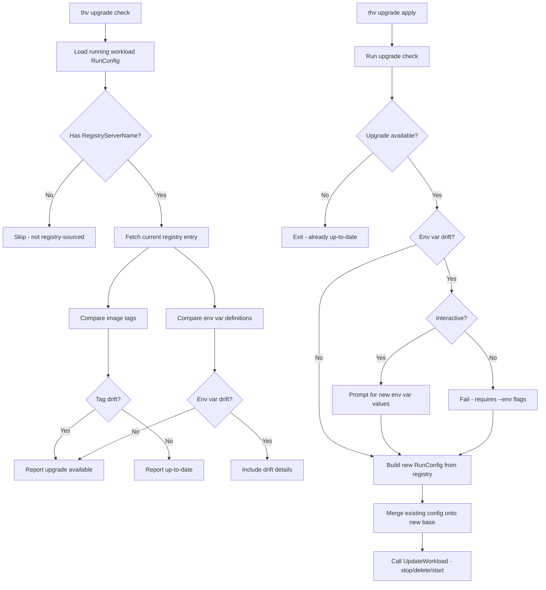

# RFC-0068: Workload Upgrade

- **Status**: Draft
- **Author(s)**: Juan Antonio Osorio (@jaosorior)
- **Created**: 2026-04-09
- **Last Updated**: 2026-04-09
- **Target Repository**: multiple
- **Related Issues**: None

## Summary

Add server-side upgrade detection and application for MCP server workloads. Users should be able to discover when a newer version of a registry-sourced MCP server is available and apply the upgrade from the CLI (`thv upgrade`) or API, preserving existing configuration. This moves drift detection logic out of the Studio frontend into the ToolHive backend where all clients can benefit.

## Problem Statement

When the ToolHive registry publishes a new version of an MCP server (e.g., a new image tag), users have no way to discover or act on that from the CLI or API. The only path today is through ToolHive Studio, which implements image tag drift detection entirely in its frontend — comparing the running workload's image tag against the registry's current entry.

This creates several problems:

- **CLI users are blind to updates.** There is no `thv upgrade` or equivalent. Users must manually check the registry, note the new tag, and call `thv run` with a fresh image — losing their existing configuration.
- **Duplicated logic.** Studio reimplements registry lookup and tag comparison in TypeScript. Any new client (cloud UI, CI integrations, MCP-based management) would need to reimplement the same logic.
- **No programmatic access.** Automation and CI/CD pipelines cannot query whether running workloads are up-to-date.
- **Environment variable drift is invisible.** New server versions may introduce required environment variables or deprecate old ones. Studio detects this, but nothing else does.

## Goals

- Expose upgrade availability checks through the ToolHive REST API
- Add `thv upgrade` CLI commands for checking and applying upgrades
- Detect image tag drift between running workloads and their registry entries
- Detect environment variable drift (added/removed variables between versions)
- Preserve existing workload configuration (env vars, secrets, permissions, volumes, transport) across upgrades
- Enable Studio and other clients to consume server-side upgrade checks instead of reimplementing detection

## Non-Goals

- **Auto-upgrade for local workloads.** Upgrades remain user-initiated. Automatic upgrade policies are a future concern for the Kubernetes operator.
- **Kubernetes operator upgrade policies.** The operator story (auto/manual/notify MCPServer upgrade policies) is deferred to a follow-up RFC.
- **Downgrade support.** Rolling back to a previous version is out of scope.
- **Cross-registry migration.** Moving a workload from one registry to another is not covered.
- **Remote server upgrades.** Remote (URL-based) MCP servers have no container image to upgrade. If the registry URL changes, that is a reconfiguration, not an upgrade.

## Terminology

- **Tag drift**: The running workload's image tag differs from the registry's current image tag for the same server entry.
- **Env var drift**: The set of environment variables defined in the registry entry has changed relative to the running workload's configuration (variables added or removed).
- **Registry entry name**: The human-readable key used to look up a server in the registry (e.g., `"github-mcp-server"`).

## Proposed Solution

### High-Level Design



### Detailed Design

#### Prerequisite: Store Registry Entry Name on RunConfig

A new `RegistryServerName` field on `RunConfig` stores the registry entry name used during the initial `thv run` lookup. This is the key that enables reliable mapping from a running workload back to its registry entry — without it, the system would need to fuzzy-match by stripping tags from image references, which is fragile.

This field is populated alongside the existing `RegistryAPIURL` and `RegistryURL` fields (added in [PR #4677](https://github.com/stacklok/toolhive/pull/4677)) and follows the same wiring pattern through the three call sites (CLI, API, MCP handler).

```go
// In pkg/runner/config.go, added to RunConfig struct:

// RegistryServerName is the registry entry name used to look up this
// server's metadata. Empty when the server was not discovered via
// registry lookup (direct image reference or protocol scheme).
RegistryServerName string `json:"registry_server_name,omitempty" yaml:"registry_server_name,omitempty"`
```

Existing workloads that were created before this field existed will have an empty `RegistryServerName`. The upgrade check gracefully skips these workloads (same as workloads created from direct image references or protocol schemes).

#### Component Changes

##### 1. Upgrade Check Logic (`pkg/workloads/upgrade/`)

New package containing the core detection logic:

```go
package upgrade

// CheckResult contains the result of an upgrade availability check.
type CheckResult struct {
    // ServerName is the registry entry name.
    ServerName string `json:"server_name"`

    // HasUpgrade is true when the registry has a newer version.
    HasUpgrade bool `json:"has_upgrade"`

    // CurrentImage is the image reference the workload is running.
    CurrentImage string `json:"current_image"`

    // AvailableImage is the image reference from the registry.
    AvailableImage string `json:"available_image,omitempty"`

    // CurrentTag is the tag extracted from CurrentImage.
    CurrentTag string `json:"current_tag"`

    // AvailableTag is the tag extracted from AvailableImage.
    AvailableTag string `json:"available_tag,omitempty"`

    // EnvVarDrift describes environment variable changes between versions.
    EnvVarDrift *EnvVarDrift `json:"env_var_drift,omitempty"`

    // Skipped is true when upgrade check was not possible (e.g., not registry-sourced).
    Skipped bool `json:"skipped,omitempty"`

    // SkipReason explains why the check was skipped.
    SkipReason string `json:"skip_reason,omitempty"`
}

// EnvVarDrift describes changes in environment variable definitions.
type EnvVarDrift struct {
    // Added lists env vars present in the registry but not in the workload.
    Added []EnvVarInfo `json:"added,omitempty"`

    // Removed lists env vars present in the workload but not in the registry.
    Removed []EnvVarInfo `json:"removed,omitempty"`
}

// EnvVarInfo describes a single environment variable.
type EnvVarInfo struct {
    Name     string `json:"name"`
    Required bool   `json:"required"`
    IsSecret bool   `json:"is_secret"`
}
```

The `Checker` struct performs the comparison:

```go
// Checker performs upgrade availability checks against the registry.
type Checker struct {
    registryProvider registry.Provider
}

// Check determines whether a workload has an upgrade available.
func (c *Checker) Check(ctx context.Context, rc *runner.RunConfig) (*CheckResult, error) {
    // 1. Skip if not registry-sourced
    if rc.RegistryServerName == "" {
        return &CheckResult{Skipped: true, SkipReason: "not from registry"}, nil
    }

    // 2. Look up current registry entry by name
    // 3. Extract and compare image tags
    // 4. Compare env var definitions
    // 5. Return structured result
}

// CheckAll checks all workloads and returns results keyed by name.
func (c *Checker) CheckAll(ctx context.Context, workloads map[string]*runner.RunConfig) (map[string]*CheckResult, error)
```

**Tag comparison strategy:**
- Parse image references using `go-containerregistry/pkg/name`
- If both tags are valid semver, use `golang.org/x/mod/semver` for comparison (determines ordering)
- Otherwise, use string inequality (detects change but cannot determine direction)
- For `:latest` tags, compare digests by querying the container registry (using `go-containerregistry/pkg/v1/remote`)

##### 2. API Endpoints

Two new endpoints on the workloads router:

```
GET /api/v1beta/workloads/upgrade-check
GET /api/v1beta/workloads/{name}/upgrade-check
```

**Single workload response:**

```json
{
  "name": "github-mcp-server",
  "has_upgrade": true,
  "current_image": "ghcr.io/stacklok/dockyard/github-mcp-server:0.3.1",
  "available_image": "ghcr.io/stacklok/dockyard/github-mcp-server:0.3.2",
  "current_tag": "0.3.1",
  "available_tag": "0.3.2",
  "env_var_drift": {
    "added": [
      {"name": "GITHUB_ENTERPRISE_URL", "required": false, "is_secret": false}
    ],
    "removed": []
  }
}
```

**Batch response:**

```json
{
  "results": [
    {"name": "github-mcp-server", "has_upgrade": true, "current_tag": "0.3.1", "available_tag": "0.3.2", ...},
    {"name": "filesystem-server", "has_upgrade": false, "current_tag": "1.0.0", "available_tag": "1.0.0"},
    {"name": "custom-server", "skipped": true, "skip_reason": "not from registry"}
  ]
}
```

The batch endpoint loads all workload RunConfigs from state, creates a registry provider from configuration, and calls `Checker.CheckAll`. The registry provider's existing cache (1h in-memory TTL) prevents redundant fetches.

##### 3. CLI Commands

New `upgrade` command group under `thv`:

```
thv upgrade check [name]     Check one or all workloads for available upgrades
thv upgrade apply <name>     Apply an upgrade to a workload
```

**`thv upgrade check`** (no name = all workloads):

```
$ thv upgrade check
NAME                   STATUS    CURRENT   AVAILABLE
github-mcp-server      upgrade   0.3.1     0.3.2
filesystem-server      current   1.0.0     1.0.0
custom-server          skipped   -         -         (not from registry)
```

**`thv upgrade check <name>`** (single workload, verbose):

```
$ thv upgrade check github-mcp-server
Upgrade available: github-mcp-server
  Current:   ghcr.io/stacklok/dockyard/github-mcp-server:0.3.1
  Available: ghcr.io/stacklok/dockyard/github-mcp-server:0.3.2

  Environment variable changes:
    + GITHUB_ENTERPRISE_URL (optional, env)
```

**`thv upgrade apply <name>`**:

```
$ thv upgrade apply github-mcp-server
Upgrade available: 0.3.1 → 0.3.2

New environment variable: GITHUB_ENTERPRISE_URL (optional)
  Enter value (or press Enter to skip):

Upgrading github-mcp-server...
  ✓ Stopped old workload
  ✓ Pulled new image
  ✓ Started upgraded workload
  ✓ Server is healthy

github-mcp-server upgraded to 0.3.2
```

**Flags:**

| Flag | Description |
|------|-------------|
| `--dry-run` | Show what would change without applying |
| `--env KEY=VALUE` | Provide values for new environment variables (repeatable) |
| `--secret KEY=VALUE` | Provide values for new secret variables (repeatable) |
| `--yes` / `-y` | Skip confirmation prompt |
| `--json` | Output in JSON format (for scripting) |

**Non-interactive mode** (for CI/automation):

When stdin is not a terminal or `--yes` is passed, `thv upgrade apply` requires all new required env vars to be provided via `--env`/`--secret` flags. It fails with a clear error if required values are missing rather than silently skipping them.

##### 4. Upgrade Application Logic

The apply path reuses the existing `UpdateWorkload` flow (`pkg/workloads/manager.go`), which already performs stop → delete → save → start. The new code only needs to:

1. Run the upgrade check to get the available image and env var drift
2. Load the existing `RunConfig` from state
3. Build a new `RunConfig`:
   - Start from the current registry entry (new image, new env var definitions)
   - Overlay the existing workload's configuration (user-set env var values, secrets, permissions, volumes, transport, proxy settings, tools filter/override, group)
   - Merge new env var values provided by the user (from prompts or flags)
4. Pass the merged config to `UpdateWorkload`

```go
// pkg/workloads/upgrade/apply.go

// Apply performs the upgrade for a single workload.
func (a *Applier) Apply(ctx context.Context, name string, opts ApplyOptions) error {
    // 1. Load existing RunConfig from state
    // 2. Run upgrade check
    // 3. Fetch fresh registry metadata
    // 4. Build new RunConfig, merging existing user config
    // 5. Handle env var drift (prompt or flags)
    // 6. Call workloadManager.UpdateWorkload(ctx, name, newConfig)
}
```

**Configuration merge rules:**

| Field | Behavior |
|-------|----------|
| `Image` | Replaced with registry's current image |
| `RegistryServerName` | Preserved (same entry) |
| `RegistryAPIURL` / `RegistryURL` | Re-resolved from current app config |
| `EnvVars` (existing) | Preserved — user-set values carry forward |
| `EnvVars` (new in registry) | Added with user-provided or empty values |
| `EnvVars` (removed from registry) | Preserved with a warning — user may still need them |
| `Secrets` | Preserved — secret references carry forward |
| `PermissionProfile` | Preserved unless user opts to reset |
| `Volumes` | Preserved |
| `Transport` | Preserved (change would be breaking) |
| `CmdArgs` | Preserved |
| `ToolsFilter` / `ToolsOverride` | Preserved |
| `Group` | Preserved |
| `ProxyMode` / `ProxyPort` | Preserved |
| `NetworkIsolation` | Preserved |
| `Name` / `ContainerName` | Preserved (identity) |

##### 5. Upgrade Indicator in `thv list`

An optional `--check-upgrades` flag on `thv list` adds an upgrade status column:

```
$ thv list --check-upgrades
NAME                   IMAGE                                              STATUS    UPGRADE
github-mcp-server      ghcr.io/.../github-mcp-server:0.3.1               running   0.3.2 available
filesystem-server      ghcr.io/.../filesystem-server:1.0.0                running   up-to-date
custom-server          my-registry.io/custom:latest                       running   -
```

This is opt-in because it adds a registry fetch. The default `thv list` behavior is unchanged.

#### API Changes

| Method | Path | Description |
|--------|------|-------------|
| `GET` | `/api/v1beta/workloads/upgrade-check` | Batch upgrade check for all workloads |
| `GET` | `/api/v1beta/workloads/{name}/upgrade-check` | Single workload upgrade check |

No changes to existing endpoints. The existing `POST /api/v1beta/workloads/{name}/edit` continues to work as-is. Studio can replace its frontend drift detection with `GET .../upgrade-check` and continue to call `edit` for the actual apply (or a new dedicated endpoint could be added later).

#### Configuration Changes

No new configuration fields. The upgrade check uses the existing registry configuration (`RegistryApiUrl`, `RegistryUrl`) to determine which registry to query.

#### Data Model Changes

| Struct | Field | Change |
|--------|-------|--------|
| `RunConfig` | `RegistryServerName` | **New** — stores the registry entry name at creation time |

The `core.Workload` struct is intentionally not modified. Upgrade information is returned via dedicated endpoints, not embedded in the list response (unless `--check-upgrades` is used).

## Security Considerations

### Threat Model

- **Registry spoofing**: An attacker could stand up a fake registry that advertises malicious image upgrades. Mitigated by the existing provenance verification (Sigstore) which runs during image pull regardless of whether it is an initial run or upgrade.
- **Downgrade attacks**: An attacker with registry write access could publish an older, vulnerable version with a higher tag number. Mitigated by Sigstore verification and by preserving the user's confirmation step before any upgrade is applied.
- **Env var injection**: A malicious registry entry could add environment variables designed to alter server behavior. Mitigated by requiring user confirmation for env var drift and by the existing permission profile system.

### Authentication and Authorization

- Upgrade checks use the same registry authentication as normal registry lookups (OAuth PKCE flow via `thv registry login`, token cached locally).
- The API endpoints inherit the same authentication middleware as other workload endpoints.
- No new authentication mechanisms are introduced.

### Data Security

- No new sensitive data is stored. `RegistryServerName` is a non-sensitive identifier.
- Existing secrets handling is unchanged — secret references carry forward across upgrades without exposing values.

### Input Validation

- `RegistryServerName` is validated as a non-empty string matching registry naming conventions when populated.
- Image references from the registry are parsed and validated using `go-containerregistry/pkg/name` before use.
- User-provided `--env` and `--secret` values go through the existing `EnvVarValidator`.

### Secrets Management

- Existing secret references in the workload config are preserved across upgrades without re-prompting.
- New secrets introduced by env var drift require explicit user input (interactive prompt or `--secret` flag) — they are never auto-populated.
- No secrets are logged or included in upgrade check responses.

### Audit and Logging

- Upgrade checks are logged at INFO level with the workload name and result (upgrade available / up-to-date / skipped).
- Upgrade applications are logged at INFO level with before/after image references.
- The existing audit middleware captures the edit API call that the upgrade ultimately delegates to.

### Mitigations

- All image pulls during upgrade go through the existing provenance verification pipeline (Sigstore signature check when provenance metadata is available).
- The upgrade never runs automatically for local workloads — user confirmation is always required.
- `--dry-run` allows inspecting changes before applying.
- The `PolicyGate` extension point (from [PR #4614](https://github.com/stacklok/toolhive/pull/4614)) is invoked during the upgrade apply path, giving enterprise deployments a hook to enforce upgrade policies.

## Alternatives Considered

### Alternative 1: Client-Side Detection Only (Status Quo for Studio)

Keep upgrade detection in each client (Studio frontend, hypothetical CLI scripts, etc.).

- **Pros**: No backend changes needed.
- **Cons**: Every client reimplements the same logic. CLI users get nothing. No single source of truth. Env var drift detection must be duplicated.
- **Why not chosen**: Violates the principle that business logic belongs in the backend. The number of clients is growing (Studio, cloud UI, CI integrations, MCP-based management).

### Alternative 2: Image Digest Comparison Only

Compare digests instead of tags to detect changes.

- **Pros**: Works for `:latest` tags. More precise — detects rebuilds of the same tag.
- **Cons**: Requires querying the container registry for every check (network cost). Does not tell the user what version they are upgrading to (digests are opaque). Cannot determine upgrade direction.
- **Why not chosen as primary**: Tag-based comparison is the common case and is cheap (local comparison against cached registry data). Digest comparison is added as a secondary mechanism for `:latest` tags specifically.

### Alternative 3: Fuzzy Image Matching (No RegistryServerName)

Match running workloads to registry entries by stripping the tag from the image reference and comparing repositories.

- **Pros**: Works for existing workloads without any new fields.
- **Cons**: Fragile — different registries can host the same repository path. Multiple registry entries could map to the same image repository. Does not work if the image was renamed across versions.
- **Why not chosen**: The `RegistryServerName` field provides a reliable, explicit mapping. Fuzzy matching can be offered as a best-effort fallback for legacy workloads that lack the field.

## Compatibility

### Backward Compatibility

- Existing workloads created before `RegistryServerName` was added will have an empty field. These are gracefully skipped by upgrade checks with a clear "not from registry" skip reason.
- No changes to existing CLI commands or API endpoints. The `thv upgrade` command group is purely additive.
- The `RunConfig` JSON schema gains one new optional field (`registry_server_name`). Older readers ignore unknown fields.

### Forward Compatibility

- The `CheckResult` struct is designed to be extensible — new drift types (permission changes, transport changes) can be added as additional optional fields without breaking existing consumers.
- The batch endpoint returns a list of results, allowing future filtering/sorting parameters.

## Implementation Plan

### Phase 1: Registry Entry Name Tracking

Add `RegistryServerName` to `RunConfig`, following the exact pattern of `RegistryAPIURL`/`RegistryURL` (PR #4677):
- Add field to `RunConfig`
- Add `WithRegistryServerName` builder option
- Add resolver helper extracting name from `ServerMetadata`
- Wire through CLI, API, and MCP handler call sites
- Regenerate OpenAPI docs
- Unit tests

**Estimated size**: ~150 lines, 1 PR.

### Phase 2: Upgrade Check Logic and API

Implement the core detection package and API endpoints:
- `pkg/workloads/upgrade/` package with `Checker` and types
- Tag comparison (semver-aware with string fallback)
- Env var drift detection
- `GET /api/v1beta/workloads/upgrade-check` (batch)
- `GET /api/v1beta/workloads/{name}/upgrade-check` (single)
- Unit tests for comparison logic
- Integration tests for API endpoints

**Estimated size**: ~400 lines, 1-2 PRs.

### Phase 3: CLI Commands

Implement `thv upgrade check` and `thv upgrade apply`:
- `cmd/thv/app/upgrade.go` — command group
- `cmd/thv/app/upgrade_check.go` — check subcommand with table/JSON output
- `cmd/thv/app/upgrade_apply.go` — apply subcommand with interactive prompts
- Config merge logic
- `--dry-run`, `--env`, `--secret`, `--yes`, `--json` flags
- `--check-upgrades` flag on `thv list`
- Unit and integration tests

**Estimated size**: ~500 lines, 1-2 PRs.

### Dependencies

- Phase 2 depends on Phase 1 (`RegistryServerName` must exist to map workloads to registry entries)
- Phase 3 depends on Phase 2 (CLI commands consume the check logic)
- No external dependencies — all required libraries (`go-containerregistry`, `x/mod/semver`) are already in `go.mod`

## Testing Strategy

- **Unit tests**: Tag comparison logic (semver, non-semver, latest), env var drift detection, config merge rules, edge cases (empty fields, missing registry entries, non-registry workloads).
- **Integration tests**: API endpoint round-trips (check returns correct results, check with no upgradeable workloads, check with mixed workloads).
- **End-to-end tests**: Full `thv upgrade check` and `thv upgrade apply` flow against a real registry with a test MCP server at two different tags. Verify the workload is running the new image after apply, and that existing env vars are preserved.
- **Security tests**: Verify that upgrade apply still triggers Sigstore verification. Verify that the PolicyGate is invoked during upgrade.

## Documentation

- **CLI reference**: New `thv upgrade check` and `thv upgrade apply` commands with examples.
- **API reference**: OpenAPI spec updated with new endpoints (auto-generated via swag).
- **Architecture docs**: Update `docs/arch/08-workloads-lifecycle.md` to describe the upgrade state transition.
- **User guide**: How-to for checking and applying upgrades, including non-interactive usage for CI.

## Open Questions

1. **Should Studio migrate to the new API?** Studio currently implements drift detection in its frontend. Should it switch to consuming `GET /api/v1beta/workloads/upgrade-check`, or keep its own logic for now?
2. **Fallback for legacy workloads**: Should we offer fuzzy image-repo matching as a best-effort fallback for workloads that predate `RegistryServerName`? Or is "skipped — not from registry" acceptable?
3. **Digest-based checks for `:latest`**: Should the initial implementation include digest comparison for `:latest` tags (requires network call to container registry), or defer that to a follow-up?
4. **`thv upgrade apply --all`**: Should batch apply be supported in the initial release, or only single-workload apply?

## References

- [PR #4677: Add RegistrySourceURL to RunConfig](https://github.com/stacklok/toolhive/pull/4677) — pattern for registry provenance fields
- [PR #4614: Add PolicyGate extension point](https://github.com/stacklok/toolhive/pull/4614) — enterprise policy hook
- [PR #4200: Resolve plain skill names from registry](https://github.com/stacklok/toolhive/pull/4200) — digest-based upgrade pattern for skills
- [ToolHive Architecture: Workloads Lifecycle](https://github.com/stacklok/toolhive/blob/main/docs/arch/08-workloads-lifecycle.md)
- [ToolHive Architecture: Registry System](https://github.com/stacklok/toolhive/blob/main/docs/arch/06-registry-system.md)

---

## RFC Lifecycle

### Review History

| Date | Reviewer | Decision | Notes |
|------|----------|----------|-------|
| 2026-04-09 | @jaosorior | Draft | Initial submission |

### Implementation Tracking

| Repository | PR | Status |
|------------|-----|--------|
| toolhive | TBD | Phase 1: RegistryServerName |
| toolhive | TBD | Phase 2: Upgrade check logic + API |
| toolhive | TBD | Phase 3: CLI commands |
