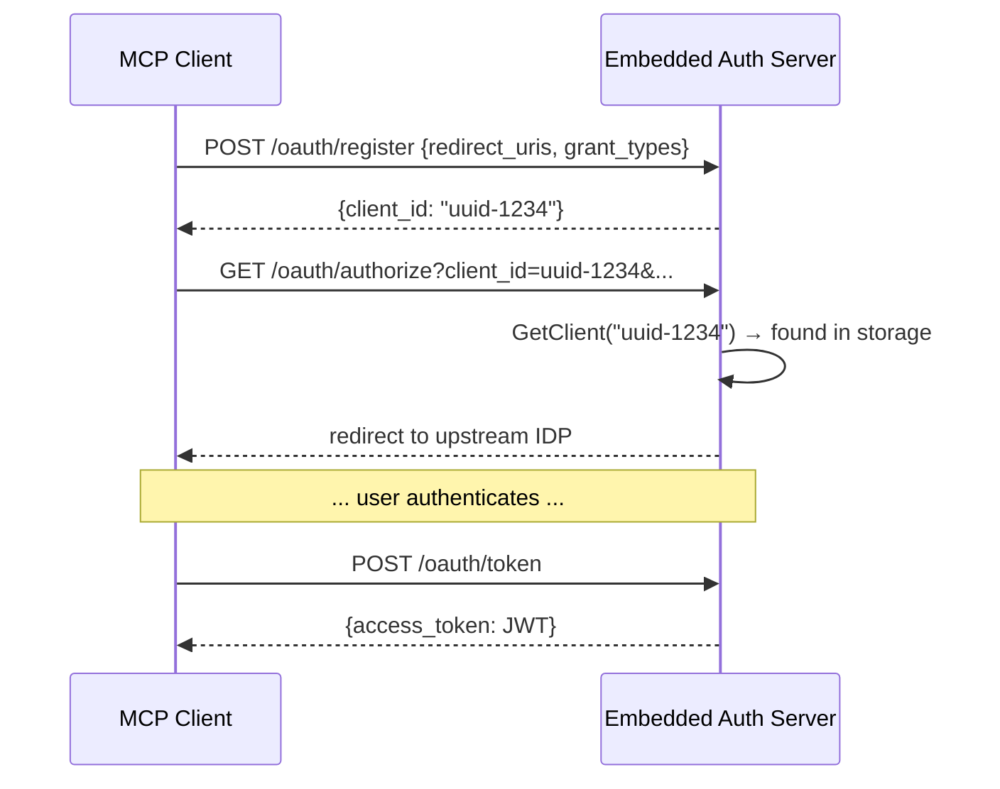
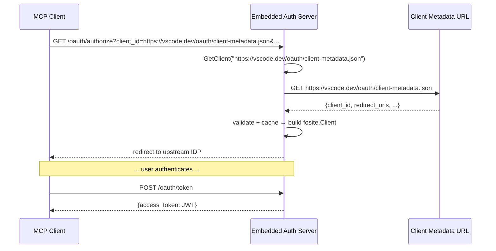

# RFC-0071: Client ID Metadata Document (CIMD) Support

- **Status**: Draft
- **Author(s)**: Muhammad Amir Ejaz (@amirejaz)
- **Created**: 2026-04-22
- **Last Updated**: 2026-04-23
- **Target Repository**: toolhive
- **Related Issues**: [toolhive#2728](https://github.com/stacklok/toolhive/issues/2728), [toolhive#4825](https://github.com/stacklok/toolhive/issues/4825), [toolhive#4826](https://github.com/stacklok/toolhive/issues/4826)

## Summary

The MCP specification (2025-11-25) defines a clear client registration priority: pre-registered credentials → CIMD → DCR → user prompt. The spec says clients supporting all options SHOULD follow this order. ToolHive currently supports only DCR. CIMD is the spec-preferred mechanism and eliminates the registration round-trip that DCR requires. This RFC adds CIMD support on both sides of the ToolHive proxy: as an authorization server accepting CIMD from MCP clients, and as an OAuth client preferring CIMD when connecting to remote MCP servers.

## Problem Statement

ToolHive currently relies exclusively on Dynamic Client Registration (RFC 7591) for OAuth client registration in two contexts:

- **Embedded authorization server**: MCP clients (VS Code, Claude Code) must call `/oauth/register` before initiating an authorization flow. This is a synchronous DCR round-trip that CIMD would eliminate entirely.
- **`thv run` as OAuth client**: When `thv run` connects to a remote MCP server requiring authentication, it always performs a DCR call to the remote authorization server. If that server supports CIMD but not DCR, `thv run` cannot connect at all.

This is both a **spec-alignment** issue and a **friction-reduction** issue:

1. **Spec divergence**: MCP 2025-11-25 defines CIMD as the preferred registration mechanism. ToolHive skips straight to DCR, the third option in the priority chain.
2. **Registration round-trip**: DCR requires a network call before authorization can begin. CIMD eliminates this step — the client's metadata URL *is* the client identifier.
3. **AS compatibility**: Authorization servers that support CIMD but not DCR would block `thv run` from connecting to those servers entirely under the current implementation.

CIMD resolves these by letting the client host its own metadata at a public HTTPS URL and present that URL as its `client_id`. The authorization server fetches the document on demand — no registration endpoint, no round-trip.

## Goals

- Implement CIMD as the primary OAuth client registration method in ToolHive.
- Allow the embedded authorization server to accept HTTPS URLs as `client_id` values and automatically resolve them to CIMD documents without requiring a prior `/oauth/register` call.
- Allow `thv run` to prefer CIMD over DCR when connecting to a remote MCP server whose authorization server advertises CIMD support.
- Maintain full DCR backward compatibility as a fallback; existing deployments require no changes.
- Enforce mandatory security controls: HTTPS-only, SSRF protection, response size limits, and TTL-based metadata caching.

## Non-Goals

- Replacing DCR entirely — DCR remains a fully supported fallback for authorization servers that do not advertise CIMD support.
- Implementing CIMD for non-HTTP transports (stdio-based MCP servers).
- Client metadata document rotation, versioning, or revocation.
- Multi-tenant metadata document hosting — ToolHive serves a single static document representing itself as an OAuth client.
- Supporting `http://` CIMD URLs in production (only `https://` is permitted; `http://localhost` is allowed in test environments).

## Proposed Solution

### High-Level Design

The implementation is delivered in two sequential phases:

- **Phase 1** — `thv run` acts as a CIMD-aware OAuth client: when the remote authorization server advertises CIMD support, `thv run` presents its hosted metadata URL as the `client_id` instead of performing a DCR round-trip.
- **Phase 2** — The embedded authorization server accepts CIMD: MCP clients (VS Code, Claude Code) can present an HTTPS URL as `client_id` and complete the full authorization flow without calling `/oauth/register`.

**Registration priority (`thv run`)**: `stored credentials → CIMD → DCR`

**Registration on the embedded server side**: when a client presents an HTTPS URL as `client_id`, the server fetches the CIMD document on demand and proceeds — no prior `/oauth/register` call needed.

### Detailed Design

#### Phase 1 — `thv run` CIMD client

**`pkg/auth/oauth/cimd.go`** (new file):

Phase 1 introduces the file with only what `thv run` needs — the URL constant and a helper to detect CIMD `client_id` values. The fetch and validate logic is added in Phase 2.

```go
// ToolHiveClientMetadataDocumentURL is the stable HTTPS URL where ToolHive's
// client metadata document is hosted. This URL is the client_id ToolHive
// presents to remote authorization servers that support CIMD.
const ToolHiveClientMetadataDocumentURL = "https://toolhive.dev/oauth/client-metadata.json"

// IsClientIDMetadataDocumentURL returns true if clientID is an HTTPS URL,
// indicating it should be treated as a CIMD client_id rather than a DCR-issued UUID.
func IsClientIDMetadataDocumentURL(clientID string) bool
```

**`pkg/auth/discovery/discovery.go`** (modified):

`AuthServerInfo` gains a new field populated when the remote AS discovery document is parsed:

```go
type AuthServerInfo struct {
    Issuer                            string
    AuthorizationURL                  string
    TokenURL                          string
    RegistrationEndpoint              string
    ClientIDMetadataDocumentSupported bool // parsed from AS metadata
}
```

`PerformOAuthFlow` is updated to follow the new registration priority. All CIMD flows must use PKCE with `code_challenge_method=S256` — PKCE is mandatory per MCP 2025-11-25 and is orthogonal to the client registration method:

```go
switch {
case hasCachedCredentials(config):
    // reuse stored client_id and refresh token — no registration needed

case info.ClientIDMetadataDocumentSupported:
    // CIMD: use our metadata URL as client_id directly; no registration call needed
    config.ClientID = cimd.ToolHiveClientMetadataDocumentURL
    // PKCE (S256) is required regardless of registration method

default:
    // DCR fallback
    if err := handleDynamicRegistration(ctx, issuer, config); err != nil {
        return nil, err
    }
}
```

`client_id_metadata_document_supported` is parsed from the AS discovery document regardless of which discovery format was used to locate the AS (RFC 8414 or OIDC `.well-known/openid-configuration`).

**`pkg/auth/remote/handler.go`** (modified):

If the AS rejects the CIMD `client_id` at the authorization request stage, the handler retries using DCR. The retry triggers on any of the following conditions: an `invalid_client` or `unauthorized_client` OAuth error code, an `invalid_request` error, or a raw HTTP 400/401 with no parseable error body. The fallback does not trigger at the token exchange stage — if authorization succeeds but token exchange fails, that is a separate error condition.

**`pkg/auth/remote/config.go`** (modified):

```go
CachedCIMDClientID string // set when CIMD was used; avoids re-detection on restart
```

**`toolhive-client-metadata.json`** (new static file, checked into repo):

```json
{
  "client_id": "https://toolhive.dev/oauth/client-metadata.json",
  "client_name": "ToolHive MCP Client",
  "client_uri": "https://github.com/stacklok/toolhive",
  "application_type": "native",
  "redirect_uris": [
    "http://localhost:8666/callback"
  ],
  "grant_types": ["authorization_code", "refresh_token"],
  "response_types": ["code"],
  "token_endpoint_auth_method": "none"
}
```

`application_type: "native"` correctly classifies ToolHive as a native CLI application. The redirect URI uses port 8666, which is the default callback port defined in `pkg/auth/remote/config.go` (`DefaultCallbackPort = 8666`) and configurable via `--remote-auth-callback-port`. The redirect URI registered during the OAuth flow is constructed as `http://localhost:8666/callback`.

#### Hosting the Client Metadata Document

The document above must be publicly reachable at `https://toolhive.dev/oauth/client-metadata.json` **before Phase 1 ships**. This is a hard infrastructure prerequisite — `thv run` cannot use CIMD until the URL is live.

**Serving requirements:**

- `https` scheme only — HTTP is not permitted
- Valid TLS certificate — self-signed is not acceptable; third-party authorization servers will verify it
- HTTP 200 OK on success — any other status code is treated as an error by the fetching server
- Response body must be valid JSON containing at least `client_id` and `redirect_uris`
- `client_id` in the document must exactly equal the serving URL — strict string comparison, no normalization
- URL must contain a path component (e.g. `/oauth/client-metadata.json`), not a bare domain
- `Content-Type: application/json` — `application/<custom>+json` variants are also acceptable per spec, but `application/json` is the conventional choice
- High availability — this URL is on the authorization hot path; downtime blocks `thv run` from authenticating against any CIMD-supporting server

**Note on response size:** The IETF draft recommends document producers keep responses under 5 KB. As a consumer, ToolHive's fetch code enforces a 10 KB hard cap as a defense-in-depth measure to reject maliciously large responses — these are distinct limits with different purposes.

**Note on `Cache-Control`:** The IETF draft says authorization servers SHOULD respect HTTP cache headers when present, but does not mandate any specific `Cache-Control` directive from the server side. The toolhive.dev hosting should set a reasonable `Cache-Control: max-age` (e.g. 300–3600 seconds) to reduce fetch frequency from authorization servers that honour it.

**Permanence constraint:**

The URL is compiled into the `thv run` binary as `ToolHiveClientMetadataDocumentURL`. Changing the URL at any point after release is a **breaking change**: authorization servers that have associated sessions or persisted state with the old URL will treat the new URL as a completely different, unknown client. This URL must be treated as permanent from the moment of first release.

**Scope of this RFC:**

The specific hosting mechanism (static site, CDN, GitHub Pages, object storage) is an infrastructure decision out of scope for this RFC. What this RFC commits to is the URL path and document contents. A separate infrastructure ticket must be opened and resolved before Phase 1 can ship.

#### Phase 2 — Embedded authorization server

The key change in Phase 2 is eliminating the DCR round-trip. The diagrams below show the before and after for a client starting an authorization flow.

**Before (DCR required):**



**After (CIMD — no registration step):**



The interception happens at `GetClient` — the point fosite calls into storage to validate the client during the authorize request. The `CIMDStorageDecorator` wraps this call: if the `client_id` is an HTTPS URL and CIMD is enabled, it fetches the document instead of looking up a registered UUID.

**`pkg/auth/oauth/cimd.go`** (extended from Phase 1):

Phase 2 adds the document type, fetch, and validation logic — only needed when ToolHive acts as the authorization server that receives CIMD `client_id` values from connecting clients.

```go
// ClientMetadataDocument represents a Client ID Metadata Document per
// draft-ietf-oauth-client-id-metadata-document.
//
// Required: ClientID, RedirectURIs.
// Recommended: ClientName, LogoURI, ClientURI.
type ClientMetadataDocument struct {
    // Required
    ClientID     string   `json:"client_id"`     // must exactly equal the URL this document is served from
    RedirectURIs []string `json:"redirect_uris"` // exact URIs only; no wildcards permitted

    // Recommended
    ClientName string `json:"client_name,omitempty"`
    LogoURI    string `json:"logo_uri,omitempty"`
    ClientURI  string `json:"client_uri,omitempty"`

    // Optional
    TosURI                  string   `json:"tos_uri,omitempty"`
    PolicyURI               string   `json:"policy_uri,omitempty"`
    GrantTypes              []string `json:"grant_types,omitempty"`
    ResponseTypes           []string `json:"response_types,omitempty"`
    Scope                   string   `json:"scope,omitempty"`
    TokenEndpointAuthMethod string   `json:"token_endpoint_auth_method,omitempty"`
    ApplicationType         string   `json:"application_type,omitempty"`
    PostLogoutRedirectURIs  []string `json:"post_logout_redirect_uris,omitempty"`
}

// FetchClientMetadataDocument fetches and parses a CIMD document from rawURL.
// Security controls enforced: HTTPS-only, 10 KB body cap, 5-second timeout,
// SSRF protection via post-DNS IP validation, one-hop redirect limit.
func FetchClientMetadataDocument(ctx context.Context, rawURL string) (*ClientMetadataDocument, error)

// ValidateClientMetadataDocument validates required fields, redirect_uri schemes,
// and enforces self-referential binding: doc.ClientID must equal fetchedFrom after
// RFC 3986 canonical normalization (lowercase scheme/host, decode unreserved chars,
// strip default ports).
func ValidateClientMetadataDocument(doc *ClientMetadataDocument, fetchedFrom string) error
```

**`pkg/auth/oauth/ssrf.go`** (new file):

Extracts SSRF protection as a reusable utility. Rather than maintaining a blocklist, the implementation uses `net.IP.IsGlobalUnicast()` as the primary allowlist — only globally routable IPs are permitted. This automatically covers all current and future special-use ranges without needing exhaustive enumeration. For completeness, the following ranges are explicitly blocked: RFC 1918 (10.0.0.0/8, 172.16.0.0/12, 192.168.0.0/16), loopback (127.0.0.0/8, ::1), link-local (169.254.0.0/16, fe80::/10), IPv6 ULA (fc00::/7), shared address space (100.64.0.0/10), IPv4-mapped IPv6 addresses (::ffff:0:0/96), and documentation ranges (192.0.2.0/24, 198.51.100.0/24, 203.0.113.0/24).

The check is enforced via a custom `http.Transport` with a `DialContext` hook that validates the resolved IP before completing the connection — this is the IP actually used for the connection, not a separately-resolved address. Two additional transport settings are required: `DisableKeepAlives: true` to prevent pooled connections from bypassing the check on subsequent fetches, and the dual-stack awareness that Go's Happy Eyeballs may attempt IPv4 and IPv6 in parallel — the `DialContext` hook validates whichever IP is received before completing the dial.

A one-hop redirect limit applies; redirect destinations are subject to the same IP validation.

**`pkg/authserver/storage/cimd_decorator.go`** (new file):

A storage decorator wraps the existing `ClientRegistry` (fosite's `ClientManager` interface) to transparently intercept `GetClient` calls. It checks the inner storage first and fetches a CIMD document only on a miss:

```go
// CIMDStorageDecorator wraps ClientRegistry and handles CIMD client_id values.
// Results are cached in an LRU cache with TTL derived from the Cache-Control
// response header, falling back to a configurable default.
type CIMDStorageDecorator struct {
    base    ClientRegistry
    cache   *lru.Cache[string, cacheEntry] // LRU-bounded; TTL per entry from Cache-Control
    maxSize int                            // default: 256 entries
    ttl     time.Duration                  // fallback TTL when Cache-Control is absent
    enabled bool
    mu      sync.RWMutex
}

func (d *CIMDStorageDecorator) GetClient(ctx context.Context, id string) (fosite.Client, error) {
    if !d.enabled || !cimd.IsClientIDMetadataDocumentURL(id) {
        return d.base.GetClient(ctx, id)
    }
    return d.fetchOrCached(ctx, id)
}

// RegisterClient always delegates to base — DCR clients continue to work.
func (d *CIMDStorageDecorator) RegisterClient(ctx context.Context, client fosite.Client) error {
    return d.base.RegisterClient(ctx, client)
}
```

The decorator constructs a `fosite.DefaultClient` from the fetched `ClientMetadataDocument`. For documents containing `http://localhost` redirect URIs, it wraps the result in the existing `LoopbackClient` (`pkg/authserver/server/registration/client.go`) to enable port-agnostic loopback matching per RFC 8252 §7.3.

**`pkg/authserver/server/handlers/discovery.go`** (modified):

Both well-known endpoints advertise the new capability when `CIMDEnabled: true`:

```go
// Added to AuthorizationServerMetadata (served at both
// /.well-known/oauth-authorization-server and /.well-known/openid-configuration)
ClientIDMetadataDocumentSupported bool `json:"client_id_metadata_document_supported,omitempty"`
```

Advertising in both endpoints ensures clients using either RFC 8414 or OIDC discovery can detect CIMD support and skip the DCR step automatically.

**Embedded auth server configuration** (new opt-in field, default disabled):

```yaml
authServer:
  cimd:
    enabled: false        # opt-in; set to true to accept HTTPS URLs as client_id
    cacheMaxSize: 256     # max number of cached CIMD entries (LRU eviction)
    cacheFallbackTTL: 5m  # TTL used when response carries no Cache-Control header
    cacheMinTTL: 60s      # floor TTL — applied even if Cache-Control: no-store or max-age=0
    cacheMaxTTL: 24h      # ceiling TTL — prevents stale metadata from persisting indefinitely
```

`Cache-Control: no-store` on a CIMD response is ignored — public client metadata is not a secret and the embedded server must cache it to function. The floor TTL prevents cache stampedes; the ceiling prevents indefinitely stale entries.

**Known limitation — air-gapped environments (Phase 2):**

When the embedded authorization server has CIMD enabled and a connecting client presents `https://toolhive.dev/oauth/client-metadata.json` as its `client_id` (i.e., `thv run` connecting to its own embedded AS), the server will attempt to fetch that document from the public internet. In air-gapped environments this fetch will fail. Operators in air-gapped environments should either disable `authServer.cimd.enabled` or pre-register ToolHive's own `client_id` via DCR.

#### API Changes

None. The `client_id` field on OAuth requests is already a string; CIMD URLs are valid string values. No new endpoints are added.

#### Configuration Changes

Phase 1 requires no new configuration — CIMD is activated automatically when the remote AS advertises support. Phase 2 adds the opt-in `authServer.cimd.enabled` setting to the embedded auth server config (see above).

#### Data Model Changes

**Phase 1** — `pkg/auth/remote/config.go` gains:

```go
CachedCIMDClientID string // set when CIMD was used; avoids re-detection on restart
```

This follows the existing persistence pattern for `CachedClientID` (DCR client ID) and `CachedRefreshTokenRef`. It is non-sensitive (a public URL).

**Refresh token behavior**: during token refresh, `client_id=https://toolhive.dev/oauth/client-metadata.json` is sent to the token endpoint as required by RFC 6749. The CIMD document is not re-fetched on refresh — the client identity from the original authorization flow is reused. If the document has changed since the access token was issued, the change takes effect only on the next full authorization flow.

**Phase 2** — no new data model changes; the CIMD cache is in-memory within the storage decorator and is not persisted.

## Security Considerations

### Threat Model

Threats marked **Phase 2** apply only when the embedded authorization server fetches CIMD documents from connecting clients. Phase 1 (`thv run`) does not fetch any CIMD documents — it only presents its own URL as a `client_id`.

| Threat | Phase | Description | Mitigation |
|--------|-------|-------------|------------|
| SSRF via CIMD URL | Phase 2 | Attacker presents a CIMD `client_id` that resolves to an internal service | DNS-after-resolve check blocks RFC 1918, loopback, and link-local addresses |
| DoS via large response | Phase 2 | Attacker's metadata server returns an oversized response body | 10 KB body cap via `io.LimitReader` before JSON parsing |
| DoS via slow metadata server | Phase 2 | Attacker serves metadata very slowly to tie up connections | 5-second HTTP timeout on all CIMD fetch requests |
| Metadata spoofing | Phase 2 | Attacker serves a document claiming to be a different client | `client_id` in the document must equal the URL it was fetched from (self-referential binding) |
| Cache poisoning | Phase 2 | Malicious metadata persists in cache too long | LRU cache with TTL from `Cache-Control` header; bounded entry count prevents unbounded growth |
| DNS rebinding | Phase 2 | Domain resolves to public IP for the SSRF check, then re-resolves to private IP for the actual connection | SSRF check performed on the IP used for the actual connection via custom `http.Transport` |
| SSRF via redirect chain | Phase 2 | Metadata server issues redirects to an internal target | One-hop redirect limit; redirect destination subject to the same SSRF IP validation |
| Scope escalation | Phase 2 | CIMD document claims broader scopes than server policy allows | Scopes intersected with server-configured allowed scopes at token issuance |
| Client impersonation | Phase 1 & 2 | Attacker hosts a CIMD document mimicking a legitimate client | `client_id` self-referential binding + TLS certificate validation |
| LRU cache flooding | Phase 2 | Attacker submits many distinct CIMD URLs to fill the 256-entry LRU, evicting legitimate entries and triggering repeated outbound fetches | LRU eviction bounds memory; consider per-source-IP rate limiting at the authorization endpoint as a follow-up hardening measure |
| Compromised hosting | Phase 1 & 2 | Attacker gains control of the HTTPS origin serving a CIMD document (CDN, GitHub Pages, object storage) and replaces the metadata | **Accepted residual risk** — CIMD client trust is equivalent to controlling the HTTPS URL. TLS ensures transport integrity but does not prevent the legitimate host from being compromised. This is a fundamental property of the CIMD trust model. |

### Authentication and Authorization

CIMD documents are intentionally public — they contain no credentials. Trust is established through:

1. **TLS certificate validation** (Phase 2): All CIMD fetches use standard Go TLS verification; self-signed certificates are rejected.
2. **Self-referential binding** (Phase 2): The `client_id` field inside the fetched document must equal the URL from which it was fetched after RFC 3986 normalization (lowercase scheme and host, decode unreserved percent-encoded characters, strip default ports). A document hosted at `https://example.com/client.json` claiming `"client_id": "https://attacker.com/client.json"` is rejected.
3. **Redirect URI validation** (Phase 2): Before issuing tokens, the redirect URI in the authorization request is validated against the `redirect_uris` in the fetched metadata. The embedded server does not issue tokens to URIs not listed in the document.
4. **Scope enforcement** (Phase 2): The server enforces its own scope policy at token issuance; the CIMD document cannot grant a client access to scopes beyond what the server allows.

### Data Security

- CIMD documents contain only public client metadata. No credentials, secrets, or PII are stored.
- The `CachedCIMDClientID` value (Phase 1) is a public HTTPS URL, treated equivalently to the existing `CachedClientID` (a public DCR-issued client ID).
- The in-memory CIMD cache (Phase 2) stores only the parsed `ClientMetadataDocument` struct — no tokens, no secrets.

### Input Validation

- CIMD URLs must use the `https` scheme. `http://` is rejected except for `http://localhost` in test/development environments.
- ToolHive may follow an HTTP redirect from the metadata URL, but only up to one hop. Only the final response is parsed or cached, and it must be HTTP 200; if the redirect limit is exceeded or the final response is non-200, the fetch fails.
- The response `Content-Type` header must be `application/json` (or an `application/*+json` variant) before parsing begins — this rejects HTML login redirects and JSONP payloads before any JSON decoding occurs.
- Response bodies are capped at 10 KB before any parsing occurs. The spec recommends document producers stay under 5 KB; our 10 KB cap is a consumer-side defense-in-depth measure.
- `client_id` in the fetched document must equal the URL it was fetched from after RFC 3986 canonical normalization of both sides: lowercase scheme and host, decode unreserved percent-encoded characters, remove default ports (443 for HTTPS). A document at `https://EXAMPLE.COM/client.json` with `"client_id": "https://example.com/client.json"` is valid.
- JSON deserialization uses `encoding/json`; unknown fields are silently ignored.
- `redirect_uris` must use `http://localhost`, `http://127.0.0.1`, `http://[::1]`, or `https://` schemes. Other schemes are rejected.
- `grant_types` and `response_types` must be non-empty subsets of server-supported values.

### Secrets Management

No new secrets are introduced by this RFC.

### Audit and Logging

The following log events are emitted:

- `DEBUG` — CIMD fetch initiated (URL only, not full document)
- `DEBUG` — CIMD fetch succeeded (URL, cached=true/false)
- `WARN` — CIMD fetch failed (URL, error); execution continues to DCR fallback
- `WARN` — CIMD `client_id` rejected by remote AS; retrying with DCR
- `INFO` — CIMD used successfully as registration method (URL)

The full CIMD document is never logged; it may contain sensitive contact or policy URIs.

### Mitigations

The SSRF protection logic is extracted into `pkg/auth/oauth/ssrf.go` (introduced in Phase 2) as a standalone utility so it can be reused by any future HTTP-fetching code in the auth layer without duplicating the IP range checks.

## Compatibility

### Backward Compatibility

- DCR remains fully functional as a fallback for both the embedded server and the proxy. No existing configuration or deployments require changes.
- The embedded server: CIMD is opt-in (`enabled: false` by default). Existing DCR clients connecting to the embedded server are completely unaffected.
- The proxy: CIMD is used only when the remote AS explicitly advertises `client_id_metadata_document_supported: true` in its metadata. For all other authorization servers, the existing DCR path runs unchanged.
- The `CachedCIMDClientID` field added to `RemoteConfig` is additive; existing persisted configs without this field are loaded without error.

### Forward Compatibility

- `client_id_metadata_document_supported` is a standard field from draft-ietf-oauth-client-id-metadata-document. As the draft progresses to RFC, field names are not expected to change; we will track the draft and update if needed.
- The `ToolHiveClientMetadataDocumentURL` constant is a single point of change; updating the hosted URL requires only a constant change and a new ToolHive release.

## Implementation Plan

### Phase 1: `thv run` CIMD client support — closes #4826

Delivers complete CIMD support for `thv run` as a self-contained track. ToolHive acts as an OAuth client that prefers CIMD when the remote authorization server advertises support, falling back to DCR otherwise.

> **Infrastructure prerequisite**: `https://toolhive.dev/oauth/client-metadata.json` must be live and serving the correct document before this phase ships. Track via a separate infra ticket opened alongside this RFC.

- New: `pkg/auth/oauth/cimd.go` — `ToolHiveClientMetadataDocumentURL` constant and `IsClientIDMetadataDocumentURL` helper
- New: `toolhive-client-metadata.json` — static metadata document, served from toolhive.dev
- Modified: `pkg/auth/discovery/discovery.go` — add `ClientIDMetadataDocumentSupported bool` to `AuthServerInfo`; parse it from both RFC 8414 and OIDC discovery documents; update `PerformOAuthFlow` registration priority to prefer CIMD; enforce PKCE S256 on CIMD flows
- Modified: `pkg/auth/remote/config.go` — add `CachedCIMDClientID`
- Modified: `pkg/auth/remote/handler.go` — graceful fallback to DCR on `invalid_client`, `unauthorized_client`, `invalid_request`, or raw HTTP 400/401 at the authorization request stage

### Phase 2: Embedded auth server CIMD support — closes #4825

Begins after Phase 1 ships. Adds the server-side counterpart so MCP clients (VS Code, Claude Code) connecting to ToolHive-managed servers can use an HTTPS URL as `client_id` and complete the full auth flow without a prior DCR call.

This phase introduces the shared CIMD fetch and validation logic (not needed by Phase 1) alongside the embedded server integration:

- New: `pkg/auth/oauth/cimd.go` — extend with `FetchClientMetadataDocument`, `ValidateClientMetadataDocument`
- New: `pkg/auth/oauth/ssrf.go` — SSRF protection utility shared across auth layer
- New: `pkg/authserver/storage/cimd_decorator.go` — storage decorator wrapping `GetClient`
- Modified: `pkg/authserver/server/handlers/discovery.go` — advertise `client_id_metadata_document_supported` in both well-known endpoints
- Modified: embedded auth server config — add `CIMDEnabled` flag (default false)

### Dependencies

Phase 2 begins after Phase 1 is complete.

## Testing Strategy

- **Unit tests** (Phase 1): AS metadata parsing with/without `client_id_metadata_document_supported`, `PerformOAuthFlow` priority chain, graceful fallback trigger on `invalid_client`, `CachedCIMDClientID` persistence.
- **Unit tests** (Phase 2): CIMD fetch with mocked HTTP server, HTTPS enforcement, oversized body rejection, timeout, SSRF payloads (private IPs, loopback, link-local, DNS rebinding), self-referential binding check; storage decorator — cache hit/miss, TTL expiry, CIMD disabled path, DCR client unaffected.
- **Integration tests**: Full authorization code + PKCE flow through the embedded server where the client presents an HTTPS URL as `client_id` — verify no `/oauth/register` call is made and tokens are issued.
- **E2E tests**: `thv run` against a mock remote MCP server whose AS advertises CIMD support — verify ToolHive uses the metadata URL as `client_id` and completes the authorization flow.

## Documentation

- New: `docs/auth/cimd.md` — operator guide covering CIMD configuration for the embedded auth server, how CIMD auto-detection works for the proxy, and the static metadata document.
- Updated: `thv run` CLI reference — note that CIMD is used automatically when the remote AS supports it.
- Updated: `docs/arch/` — update the authentication sequence diagram to show the CIMD path.

## References

- [draft-ietf-oauth-client-id-metadata-document](https://datatracker.ietf.org/doc/draft-ietf-oauth-client-id-metadata-document/) — the CIMD specification this RFC implements (draft-01 published March 2026; field names unchanged from draft-00 which MCP 2025-11-25 pins to)
- [MCP Authorization Specification 2025-11-25](https://modelcontextprotocol.io/specification/2025-11-25/basic/authorization) — MCP spec that designates CIMD as the preferred registration mechanism
- [RFC 7591 — OAuth 2.0 Dynamic Client Registration Protocol](https://www.rfc-editor.org/rfc/rfc7591) — DCR, retained as fallback
- [RFC 8252 — OAuth 2.0 for Native Apps](https://www.rfc-editor.org/rfc/rfc8252) — loopback redirect URI matching (§7.3)
- [RFC 8414 — OAuth 2.0 Authorization Server Metadata](https://www.rfc-editor.org/rfc/rfc8414) — AS discovery document format
- [RFC 9728 — OAuth 2.0 Protected Resource Metadata](https://www.rfc-editor.org/rfc/rfc9728) — protected resource metadata (already implemented in ToolHive)
- [toolhive#2728](https://github.com/stacklok/toolhive/issues/2728) — umbrella issue
- [toolhive#4825](https://github.com/stacklok/toolhive/issues/4825) — embedded server CIMD support
- [toolhive#4826](https://github.com/stacklok/toolhive/issues/4826) — proxy CIMD client

## RFC Lifecycle

### Review History

| Date | Reviewer | Decision | Notes |
|------|----------|----------|-------|
| — | — | — | — |

### Implementation Tracking

| Repository | PR | Status |
|------------|-----|--------|
| toolhive | TBD (Phase 1 — `thv run` CIMD client) | Not started |
| toolhive | TBD (Phase 2 — embedded auth server) | Not started |
