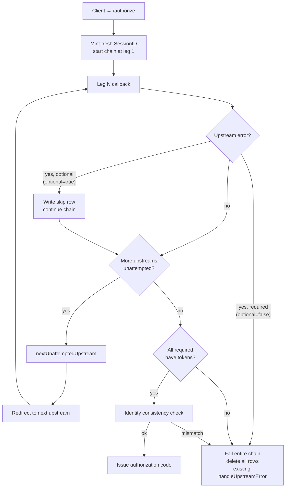

# RFC-0072: Graceful Degradation for Multi-Upstream OAuth in vMCP

- **Status**: Draft
- **Author(s)**: TBD (@github-handle)
- **Created**: 2026-05-13
- **Last Updated**: 2026-05-13
- **Target Repository**: toolhive
- **Related Issues**: [toolhive#5162](https://github.com/stacklok/toolhive/issues/5162)

## Summary

When a VirtualMCPServer's embedded authorization server fronts multiple upstream
Identity Providers, today's chain is all-or-nothing: any one failure invalidates
every collected upstream token and locks the user out of every backend, even
backends that depend only on the upstreams that already succeeded. This RFC
introduces opt-in partial-completion semantics, controlled by a single
`optional` flag (default `false`) on each upstream provider. Marking any
provider `optional: true` opts the deployment into partial completion for
that provider; leaving every provider at the default reproduces today's
all-or-nothing behavior exactly. Backends whose required upstream is missing
are filtered out of the vMCP's exposed catalog and refused at request time;
re-authentication is restart-all, with full identity-consistency checks
preserved.

## Problem Statement

The embedded auth server walks `EmbeddedAuthServerConfig.UpstreamProviders` in
order. After each upstream callback, the handler calls `nextMissingUpstream`
(pkg/authserver/server/handlers/handler.go:118-133)
to redirect to the next provider without a stored token, and only issues an
authorization code when every upstream has one
(pkg/authserver/server/handlers/callback.go:368-478).
If any upstream returns an error or the user declines a consent screen,
`handleUpstreamError`
(pkg/authserver/server/handlers/callback.go:325-362)
calls `DeleteUpstreamTokens` and the client receives a generic
`access_denied` with the hint `"upstream authentication failed"`.

- **Current behavior**: one upstream IdP outage or one declined consent screen
  blocks every backend on a vMCP — even backends with no dependency on the
  failed upstream.
- **Affected users**: operators running vMCPs that aggregate backends across
  multiple SaaS IdPs (e.g. `github` + `slack` + `google`). End users see "the
  whole thing is down" when only one provider has a problem.
- **Worth solving**: vMCP's value proposition is composition across
  heterogeneous backends; the auth layer should fail in proportion to what is
  actually broken, not collapse the whole surface.

The system already knows which backends bind to which upstream — the strategy
configs name them directly via `UpstreamInjectConfig.ProviderName`,
`TokenExchangeConfig.SubjectProviderName`, and
`AwsStsConfig.SubjectProviderName`
(pkg/vmcp/auth/types/types.go). That
information is just not consulted when deciding how to fail.

## Goals

- Let the chain complete when only a subset of upstreams succeed, when the
  operator opts in.
- Preserve today's all-or-nothing semantics as the default so existing
  deployments are unaffected.
- Keep the cross-leg identity-consistency invariant
  (pkg/authserver/server/handlers/callback.go:387-410)
  intact under partial completion and under re-authentication.
- Filter backends whose required upstream is missing out of the vMCP's
  exposed tool/resource/prompt catalog, with a defense-in-depth refusal at
  dispatch time.
- Define a single, well-specified path for recovering filtered backends:
  client-driven `/authorize` restart-all.
- Handle RFC 6749 §4.1.2.1 upstream errors (`access_denied`,
  `invalid_request`, `server_error`, `temporarily_unavailable`, …) cleanly:
  optional upstreams are skipped, required upstreams fail the chain.

## Non-Goals

- **Per-upstream retry.** This RFC does not add a "retry just provider X"
  path. Recovery is restart-all. See *Alternatives Considered*.
- **MCP-protocol-level signaling of filtered state.** The vMCP server does
  not advertise to clients that *additional* tools would exist if more
  upstreams were authorized; capability listings simply omit them. The
  protocol has no field for "tool exists but is unauthorized" and we will
  not add one.
- **Silent backend dropping on refresh-token expiry.** When a previously
  satisfied upstream's refresh token expires, the affected backend's next
  call surfaces an auth error that the client converts into a fresh
  `/authorize` flow. We do not quietly remove the backend mid-session.
- **Dynamic addition of upstreams at runtime.** `UpstreamProviders` is still
  reconciled from the CRD.
- **Changing the chain-walk order or making it parallel.** Sequential
  walk is preserved; only the completion predicate and the failure path
  change.

## Proposed Solution

### High-Level Design

Three concrete changes, all driven by a new per-upstream `optional` flag
(default `false`):

1. **Required vs. optional upstreams.** `UpstreamProviderConfig` gains an
   `optional` bool (default `false`). An upstream with `optional: false` is
   required; one with `optional: true` may be skipped. The provider named
   by `authzConfig.inline.primaryUpstreamProvider` (explicit or
   auto-selected) is *always* required — admission rejects a configuration
   that sets `optional: true` on the primary, and runtime treats the
   primary as required regardless of the field. Existing manifests that
   never set `optional` reproduce today's behavior exactly: every upstream
   defaults to required, so the chain is all-or-nothing.
2. **Skip-and-continue on optional-upstream failure.** When an upstream
   marked `optional: true` returns an RFC 6749 §4.1.2.1 error (including
   user-declined `access_denied`), the chain records the upstream as
   *skipped for this session* and advances to the next missing upstream
   instead of tearing the whole flow down. The auth code is issued when
   every upstream has been attempted and every required upstream has a
   token.
3. **Backend filtering, fail-closed.** vMCP aggregates capabilities
   once per MCP session, at `initialize` time, and freezes the result
   on the session value
   (pkg/vmcp/session/factory.go:478-506);
   `tools/list`, `resources/list`, `resources/templates/list`, and
   `prompts/list` later replay that cached snapshot. The filter
   therefore runs inside the aggregation step at session creation,
   reading the per-session set of available upstream tokens from
   storage — looked up by the `tsid` claim on the incoming bearer
   token, exactly as the existing TokenValidator middleware does at
   pkg/auth/token.go:1184-1200 — and
   excluding any backend whose required upstream is missing. Upstream
   tokens themselves never ride in the bearer token. The dispatcher
   re-checks per request and refuses `tools/call`, `resources/read`,
   and `prompts/get` invocations against unavailable backends with a
   structured `unauthorized_backend` error, so a stale or misbehaving
   client (or an out-of-band revocation between session creation and
   dispatch) cannot bypass the filter. Recovery against a degraded
   session is whole-session: the client re-runs `/authorize` for a
   new JWT and reconnects, which produces a fresh `initialize` and a
   re-aggregated capability snapshot.

Recovery is "restart-all" from the *user's* perspective — they re-walk
the chain end-to-end — but there is no special server-side restart
branch. Every `/authorize` already mints a fresh `SessionID` via
`rand.Text()`
(pkg/authserver/server/handlers/authorize.go:73-93),
so re-running `/authorize` simply creates a brand-new session and walks
the chain from leg one against that new session. Prior sessions (with
real tokens, skip rows, or a mix) sit untouched in storage and expire
on their normal session-end paths; nothing in the server needs to
reach across the two sessions. The identity-consistency check applies
across legs *within* a single session's walk — its job is to catch a
divergent upstream identity mid-chain, not to bridge two `/authorize`
invocations.



### Detailed Design

#### Component Changes

##### Operator: CRD additions

One new field on an existing type in
cmd/thv-operator/api/v1beta1/mcpexternalauthconfig_types.go:

```go
// UpstreamProviderConfig gains an Optional flag.
type UpstreamProviderConfig struct {
    // ... existing fields (Name, Type, OIDCConfig, OAuth2Config) ...

    // Optional marks this upstream as eligible to be skipped during chain
    // completion. When false (the default), the upstream is required: any
    // failure tears the chain down with today's all-or-nothing semantics.
    // When true, an RFC 6749 §4.1.2.1 error from the upstream (or a user
    // declining consent) is recorded as a per-session skip and the chain
    // continues; backends that depend on this upstream are filtered from
    // the vMCP catalog for that session.
    //
    // The provider named by spec.incomingAuth.authzConfig.inline.primaryUpstreamProvider
    // (or, when unset, the first listed upstream) is always required
    // regardless of this field; the admission webhook rejects a
    // configuration that sets the primary upstream's Optional to true.
    //
    // Leaving Optional unset on every upstream reproduces today's
    // all-or-nothing behavior exactly — existing manifests need no change.
    //
    // +kubebuilder:default=false
    // +optional
    Optional bool `json:"optional,omitempty"`
}
```

Validation extension to `MCPExternalAuthConfig` and `VirtualMCPServer`
admission webhooks:

- Reject configurations where the primary upstream (resolved via
  `AuthzConfigRef.ExplicitPrimaryUpstreamProvider()` —
  cmd/thv-operator/api/v1beta1/mcpserver_types.go:657-668,
  falling back to `upstreamProviders[0].Name`) has `Optional: true`.
- No advisory status condition is needed; rejection at admission is the
  right level — degrading silently here would let a misconfigured policy
  authorize against missing claims.

A new validation rule on `MCPExternalAuthConfig.validateUpstreamProvider`
(cmd/thv-operator/api/v1beta1/mcpexternalauthconfig_types.go:1124)
is not required — `Optional` is a leaf bool with no cross-field semantics
at the per-provider level. Cross-field validation lives on the parent.

##### Auth server: chain completion logic

Three changes in
pkg/authserver/server/handlers/:

1. **`nextMissingUpstream` → `nextUnattemptedUpstream`**
   (pkg/authserver/server/handlers/handler.go:118-133).
   A single `GetAllUpstreamTokens(sessionID)` call returns every row the
   session has — real tokens and skip rows alike — and the helper walks
   the configured `UpstreamProviders` in order, returning the first
   provider with no row at all. Chain completion is a two-part predicate
   evaluated after each successful leg: `nextUnattemptedUpstream` returns
   empty *and* every required upstream (i.e. every upstream with
   `Optional == false`) has a stored, non-skipped token. Optional
   upstreams are still walked so the user has a chance to authorize
   them; only after they have been attempted (and either succeeded or
   been recorded as skipped) does the chain consider itself complete.
   When every upstream is required — the default for unchanged manifests
   — the predicate reduces to "every upstream has a non-skipped token",
   identical to today's `nextMissingUpstream` behavior, and the storage
   call shape is the same single bulk read.

2. **Skipped-upstream record reuses the existing row.**
   `storage.UpstreamTokens`
   (pkg/authserver/storage/types.go:55-97)
   gains two fields — `Skipped bool` and `SkippedReason string` — and a
   "skip" is just an existing-shape row written via the existing
   `StoreUpstreamTokens` API with `Skipped: true`, `SkippedReason` set
   to the RFC 6749 error code (or `chain_failed`), empty token material,
   and the same `UserID` / `UpstreamSubject` / `ClientID` binding fields
   the row would have carried on success. No new storage-interface
   methods are needed, the in-memory and Redis backends store the two
   new fields as part of the row's normal serialization, and the
   required-upstream-failure path is unchanged:
   `handleUpstreamError`'s existing call to `DeleteUpstreamTokens`
   already wipes every row for the session, skip rows included.

   Read-path call sites are updated to filter skipped rows out of any
   map intended for token use:

   - `InProcessService.GetAllValidTokens`
     (pkg/auth/upstreamtoken/service.go:83-125)
     skips rows where `Skipped == true` when building its
     `map[string]string` of provider → access token. The hydration
     downstream of this — `TokenValidator.loadUpstreamTokens` /
     `Middleware` populating `identity.UpstreamTokens`
     (pkg/auth/token.go:1184-1248)
     — therefore never sees a skip entry, so the inject, token-exchange,
     and AWS STS strategies (and Cedar's primary-upstream binding) work
     unchanged.
   - `InProcessService.GetValidToken` (and the singular
     `UpstreamTokenStorage.GetUpstreamTokens` path it sits over) treats a
     skip row as `ErrNotFound` for callers that want token material,
     matching the existing "row absent" contract.
   - The chain handler is the one deliberate consumer of skip state: it
     calls `GetAllUpstreamTokens` directly and inspects `.Skipped` on the
     returned rows.

3. **`handleUpstreamError` per-upstream branch**
   (pkg/authserver/server/handlers/callback.go:325-362).
   Look up the current upstream (carried on the pending authorization via
   `PendingAuthorization.UpstreamProviderName` —
   pkg/authserver/storage/types.go:397-453)
   and decide:

   - If the upstream has `Optional == false` (including the primary):
     preserve today's behavior — `DeleteUpstreamTokens`, write generic
     `access_denied` to the client.
   - If the upstream has `Optional == true`: write a skip row via
     `StoreUpstreamTokens` with `Skipped: true`, `SkippedReason` set to
     the upstream's RFC 6749 error code (or `chain_failed` for
     transport-level failures), and the session's existing identity
     binding fields populated; then invoke `continueChainOrComplete`
     exactly as the success path does. The user is redirected onward to
     the next upstream or, if none remains, sees a successful
     authorization at the client.

   The handler is the single place that classifies §4.1.2.1 error codes;
   we do not propagate distinct codes to the downstream client (the
   existing generic `access_denied` posture is preserved for the
   required-upstream path).

4. **Identity consistency on completion**
   (pkg/authserver/server/handlers/callback.go:387-410)
   is unchanged in shape. It still walks every stored upstream row and
   verifies the resolved subject matches; the walk learns to ignore rows
   with `Skipped == true` (no token material to compare against) so the
   subset under consistency check is exactly the set of required, real
   upstream tokens. Skip rows still carry the session's `UserID` /
   `UpstreamSubject` binding so the row is auditable on its own merits.

##### Auth server: re-authorization is a fresh session

`/authorize` requires no changes for this RFC. The existing handler
already generates a fresh `SessionID` for every call
(pkg/authserver/server/handlers/authorize.go:73-93)
and does not correlate the incoming request to any prior session — the
client supplies its own `client_id`, `state`, and PKCE challenge, none
of which name a server-side session. A user retrying after a failed or
declined upstream therefore lands in a brand-new session and walks the
full chain from leg one against rows that did not exist a moment ago.

Whatever the prior session held — real tokens, skip rows, or both —
stays in storage at its old `SessionID` key and ages out under the
existing TTL and `cleanupExpired` paths
(pkg/authserver/storage/types.go:55-97,
the existing `SessionExpiresAt` lifetime). Because the new walk never
sees the prior session, no `DeleteUpstreamTokens` step is needed at
`/authorize` entry, and there is no cross-session identity-takeover
surface to defend against: the same `client_id` coming back as a
different upstream identity simply opens a fresh session that walks
the chain afresh, exactly as if it were a first-time client.

The identity-consistency check
(pkg/authserver/server/handlers/callback.go:387-410)
remains a *within-session* invariant — it catches a divergent upstream
identity across legs of the same walk. It is not asked to bridge two
`/authorize` invocations.

##### vMCP: backend → upstream binding

Add a helper in
pkg/vmcp/auth/types/types.go:

```go
// RequiredUpstreamProvider returns the upstream provider that this backend
// auth strategy requires a valid token from, or empty if the strategy is
// independent of the embedded auth server's upstream chain (e.g. service
// account, anonymous).
func (s *BackendAuthStrategy) RequiredUpstreamProvider() string {
    switch {
    case s.UpstreamInject != nil:
        return s.UpstreamInject.ProviderName
    case s.TokenExchange != nil:
        return s.TokenExchange.SubjectProviderName
    case s.AwsSts != nil:
        return s.AwsSts.SubjectProviderName
    default:
        return ""
    }
}
```

Backends whose strategy returns empty are always available — they have no
upstream dependency.

##### vMCP: backend filtering at session creation and dispatch

A per-session filter applied at two points in the vMCP lifecycle:
once when capabilities are aggregated and frozen onto the MCP
session, and again on every dispatched call against a backend.

Both checks read the per-session upstream-token set from upstream token
storage; the bearer token's `tsid` claim names the session, but the
tokens themselves are loaded from storage by the existing
`TokenValidator` middleware
(pkg/auth/token.go:1184-1248)
and hydrated onto `identity.UpstreamTokens` before any vMCP handler
runs. The filter therefore consults `IdentityFromContext(ctx).UpstreamTokens`
— a storage-backed view, not a claim-derived one — and never decodes
or trusts upstream-token state out of the JWT itself.

1. **Capability snapshot at session creation.** vMCP aggregates and
   freezes the per-session capability set at MCP `initialize` time —
   the session factory's `makeBaseSession` calls the aggregator once
   via `buildRoutingTableWithAggregator`
   (pkg/vmcp/session/factory.go:478-506)
   and stores the resulting tools / resources / prompts on the
   `defaultMultiSession` value
   (pkg/vmcp/session/factory.go:496-506).
   Those slices are read-only thereafter; subsequent `tools/list`,
   `resources/list`, `resources/templates/list`, and `prompts/list`
   calls replay the snapshot rather than re-aggregating, and the
   per-session tool set is also registered with the underlying SDK's
   tool store during `OnRegisterSession`
   (pkg/vmcp/server/server.go:1158-1195).
   The filter therefore has to run *inside* the aggregation step at
   session creation, not by wrapping list-method responses. Wrapping
   list handlers would either fight the SDK's per-session store or
   degrade to a no-op against the cached snapshot.

   The session factory already threads `*auth.Identity` into
   `makeBaseSession`
   (pkg/vmcp/session/factory.go:351-375, 423-446),
   and the `TokenValidator` middleware has hydrated
   `identity.UpstreamTokens` from storage before the session factory
   runs. The aggregator (or a thin filter sitting between
   `buildRoutingTableWithAggregator` and the `defaultMultiSession`
   assignment) drops any tool / resource / prompt whose owning backend
   reports a non-empty `RequiredUpstreamProvider()` not present in
   `identity.UpstreamTokens`. The routing table, advertised tool set,
   and per-session SDK tool registration all see the filtered view
   uniformly.

2. **Dispatch refusal.** Before the dispatcher routes `tools/call`,
   `resources/read`, `resources/subscribe`, or `prompts/get` to a
   backend, it re-checks `RequiredUpstreamProvider()` against the
   session's upstream-token map (same storage-backed source as above).
   A miss produces a structured JSON-RPC error with `code: -32001`
   (server-defined) and a message naming the missing upstream. This
   is defense-in-depth: under normal flow the cached `tools/list`
   already omits the backend, but a misbehaving client could fabricate
   a call against a tool name it should not have, and an out-of-band
   revocation (refresh-token expiry, IdP admin revoke) could clear an
   upstream token in storage *after* the session snapshot was taken.
   Dispatch reads `identity.UpstreamTokens` per request, so it catches
   both cases.

Filtering is structurally invisible to the MCP protocol: the client just
sees a smaller capability set, exactly as if those backends were never
configured. We do not extend the protocol to signal degraded state. End
users discover what they cannot do by trying to use it; the failing
tool/resource error includes the missing upstream's name for self-service
re-auth.

##### Recovery requires a fresh MCP session

Because capabilities are snapshotted at `initialize`, a client cannot
see new capabilities (e.g. a previously-filtered backend coming back
after the user authorizes its upstream) within the same vMCP session.
Recovery therefore requires the client to open a *new* MCP session.
This is naturally consistent with the re-`/authorize` flow: a fresh
`/authorize` produces a new JWT carrying a new `tsid` (see
*Auth server: re-authorization is a fresh session*), and changing the
bearer token forces the client to open a new MCP session, which
triggers a fresh `initialize`, which re-runs the aggregator with the
new session's `identity.UpstreamTokens` view. The recovery sequence
the user experiences is therefore: re-`/authorize` → exchange for new
JWT at `/token` → reconnect to vMCP with the new bearer → fresh
`initialize` → filtered capability set is recomputed against the new
upstream-token state. No in-session capability refresh is offered.

##### Refresh-token expiry and out-of-band revocation

The same recovery flow covers two distinct events: an upstream refresh
token expires, or an operator revokes a stored upstream token
out-of-band (e.g. via the IdP admin UI). In both cases the auth server
detects the problem *reactively*, on the next backend call that needs
the token — there is no server-side introspection poller. The flow:

1. The dependent backend's strategy fails to mint or use a fresh access
   token (the IdP rejects refresh or returns an unauthorized response).
2. The vMCP returns a structured auth error to the client (existing
   path).
3. The client re-runs `/authorize`. The handler mints a fresh
   `SessionID` and the user walks every upstream again against that
   new session — the user re-consents across the chain. Identity
   consistency is verified within the new walk. The prior session's
   stored rows are left in place and age out under their existing TTL.
4. The client exchanges the new code at `/token` for a new JWT (with
   a new `tsid` claim naming the new session) and reconnects to vMCP
   with the new bearer. The new MCP connection triggers a fresh
   `initialize`, which re-aggregates capabilities against the new
   session's `identity.UpstreamTokens` view. The previously-filtered
   backend reappears in the new session's capability snapshot.

This is intentionally heavier than per-upstream refresh because we do not
want a single upstream RT expiry or revocation to silently degrade the
user's capability surface mid-conversation, and because partial re-walks
re-introduce the identity-binding hazards that we deliberately avoid
elsewhere in this RFC. Operators with stricter freshness requirements
(e.g. compliance-driven sub-minute revocation detection) are out of
scope for this RFC and would be addressed by a follow-up proposal for
proactive introspection.

#### API Changes

No external HTTP API or MCP protocol changes, and the
`UpstreamTokenStorage` interface
(pkg/authserver/storage/types.go:495-516)
is unchanged. Skip rows ride on the existing `StoreUpstreamTokens` /
`GetUpstreamTokens` / `GetAllUpstreamTokens` / `DeleteUpstreamTokens`
methods. The only persistence-shape change is two new fields on the
already-stored row:

```go
// UpstreamTokens (pkg/authserver/storage/types.go:55-97) gains:
type UpstreamTokens struct {
    // ... existing fields (ProviderID, AccessToken, RefreshToken, IDToken,
    // ExpiresAt, SessionExpiresAt, UserID, UpstreamSubject, ClientID) ...

    // Skipped marks this row as a tombstone for an optional upstream that
    // was attempted for the session and either returned an RFC 6749
    // §4.1.2.1 error or had its consent screen declined by the user.
    // When true, AccessToken / RefreshToken / IDToken / ExpiresAt are
    // zero and read paths that build a live-token view (notably
    // upstreamtoken.InProcessService.GetAllValidTokens) must skip the
    // row. Binding fields (UserID, UpstreamSubject, ClientID) carry the
    // session's identity so the row is auditable on its own merits.
    Skipped bool

    // SkippedReason records why the upstream was skipped. Sourced from
    // RFC 6749 §4.1.2.1 error codes (`access_denied`, `invalid_request`,
    // `server_error`, `temporarily_unavailable`, …) plus a small
    // internal allowlist (`chain_failed`, `network_error`). Empty when
    // Skipped is false. Never set to upstream `error_description` text.
    SkippedReason string
}
```

In-memory and Redis backends serialise the two new fields as part of
the row's existing encoding; no new keys, no new TTL semantics. Read
call sites are updated so the skip flag is observed exactly where it
matters:

- `InProcessService.GetAllValidTokens`
  (pkg/auth/upstreamtoken/service.go:83-125)
  drops rows with `Skipped == true` from the `map[string]string` it
  returns to `TokenValidator.loadUpstreamTokens` — so
  `identity.UpstreamTokens` (the storage-backed view consumed by every
  backend auth strategy, by the vMCP filter, and by Cedar) only ever
  contains real, live tokens.
- The singular `GetValidToken` path treats a skip row as not-present,
  matching its existing contract.
- The chain handler queries `GetAllUpstreamTokens` directly and
  inspects `.Skipped` on each row to make the
  `nextUnattemptedUpstream` and "every required upstream satisfied"
  decisions in a single storage call per leg.

#### Configuration Changes

Example `MCPExternalAuthConfig` for a vMCP fronting github, slack, and
google backends, where github carries primary identity and slack and
google are best-effort:

```yaml
apiVersion: toolhive.stacklok.dev/v1beta1
kind: MCPExternalAuthConfig
metadata:
  name: vmcp-multi-idp
spec:
  type: embedded
  embeddedAuthServer:
    issuer: https://vmcp.example.com
    upstreamProviders:
      - name: github
        type: oidc
        # optional: false (default) — primary identity, must always succeed
        oidcConfig: { ... }
      - name: slack
        type: oauth2
        optional: true      # slack outage filters slack-mcp only
        oauth2Config: { ... }
      - name: google
        type: oidc
        optional: true      # declined google consent filters gdrive-mcp only
        oidcConfig: { ... }
```

A manifest that leaves `optional` unset on every provider behaves
identically to today: every upstream is required, and a single failure
tears down the whole chain.

And on the `VirtualMCPServer`:

```yaml
spec:
  incomingAuth:
    authzConfig:
      inline:
        primaryUpstreamProvider: github     # webhook enforces github.optional==false
        policies: [ ... ]
```

#### Data Model Changes

The only persistence-shape change is the two new fields on
`storage.UpstreamTokens` described in *API Changes* above: `Skipped
bool` and `SkippedReason string`. A skipped upstream is just an
existing-shape row at the existing `(sessionID, providerName)` key with
`Skipped == true` and empty token material; no new map, hash, key
space, or storage object is introduced. Both backends gain the two
fields in their existing serialization path (the in-memory store
already holds `*UpstreamTokens` by reference; the Redis store
serialises the struct as one value per key) and the row's existing TTL
governs its lifetime.

Skip rows have no independent retention: they live with the rest of
the session's upstream rows and share the session's TTL, ageing out
under the existing `cleanupExpired` and `SessionExpiresAt` paths.
Retrying a previously declined upstream requires the client to re-run
`/authorize`, which mints a fresh `SessionID` and walks the full
chain again against a new, empty session — consistent with the
whole-chain recovery model used elsewhere in this RFC.

No changes to `PendingAuthorization`
(pkg/authserver/storage/types.go:397-453).
The chain-leg correlation still uses `UpstreamProviderName` on the
pending record.

## Security Considerations

### Threat Model

- **Threat A — Cross-identity token binding.** A malicious or compromised
  upstream could try to bind tokens for *its* identity into a session
  established under a different identity. Mitigation: the existing
  identity-consistency check
  (pkg/authserver/server/handlers/callback.go:387-410)
  walks every stored upstream token and compares
  `UpstreamTokens.UserID`/`UpstreamSubject` against the resolved subject;
  this check is unchanged. Skipped upstreams contribute no token and so
  cannot inject a divergent identity.
- **Threat B — Cross-session identity adoption on re-`/authorize`.**
  A user (or attacker) running a second `/authorize` flow could in
  principle try to adopt or otherwise reuse the session state of an
  earlier flow. Mitigation: not applicable — the auth server already
  mints a fresh `SessionID` on every `/authorize`
  (pkg/authserver/server/handlers/authorize.go:73-93)
  and never correlates an incoming request to a prior session. The new
  flow's `(sessionID, providerName)` rows are disjoint from any
  earlier session's rows; there is no overlap to attack. The prior
  session's rows age out under their existing TTL. Within the new
  walk, the identity-consistency check
  (pkg/authserver/server/handlers/callback.go:387-410)
  continues to catch a divergent upstream identity across legs of the
  *same* session, which is the property this RFC needs.
- **Threat C — Operator misconfiguration: optional primary.** An operator
  could mark the authz-policy primary upstream as optional, in which case
  Cedar policies would evaluate against an absent or wrong identity.
  Mitigation: admission webhook rejects configurations where the
  `primaryUpstreamProvider` has `optional: true`. Defense-in-depth: at
  runtime, the chain treats the primary as required even if the field is
  somehow `true` on a stored object.
- **Threat D — Stale-session backend invocation.** Because the
  capability snapshot is frozen at session creation, a client that
  enumerated tools at `initialize` could still attempt to invoke a
  tool whose upstream token has since been revoked (refresh-token
  expiry, IdP admin revoke) or otherwise removed from storage.
  Mitigation: dispatcher re-checks `RequiredUpstreamProvider()`
  against the current `identity.UpstreamTokens` (re-hydrated from
  storage on every request) per `tools/call`, `resources/read`,
  `resources/subscribe`, and `prompts/get`; a miss returns a
  structured `unauthorized_backend` error naming the missing
  upstream. The filter is not snapshot-only.
- **Threat E — Information disclosure via filtered listings.** Filtered
  listings reveal which providers a session has not authorized (by
  absence). This is the same disclosure as a session that simply hasn't
  authorized those providers yet — not a new leak.

### Authentication and Authorization

- No change to who can call `/authorize` or how tokens are validated.
- Authz policy evaluation is unchanged: Cedar still binds to claims from
  the primary upstream, which is guaranteed present by the new admission
  rule.
- Backend dispatch is the new authorization gate: a session without the
  required upstream token for a given backend cannot reach that backend.
  This is *stricter* than today — today the session would already have
  failed authorization entirely.

### Data Security

- Skip rows reuse the existing `UpstreamTokens` row at the existing
  `(sessionID, providerName)` key but carry no token material — the
  `AccessToken`, `RefreshToken`, `IDToken`, and `ExpiresAt` fields are
  zero. They retain the session's identity-binding fields (`UserID`,
  `UpstreamSubject`, `ClientID`) for audit and for the runtime guard
  on the consistency check. They live with the rest of the session's
  rows and expire on the same session-end paths (TTL,
  `SessionExpiresAt`, and the existing required-upstream-failure
  `DeleteUpstreamTokens`).
- The existing token-storage interface and its on-disk encoding are
  unchanged in shape; the row simply gains two scalar fields.

### Input Validation

- `Optional` is a leaf bool, kubebuilder-defaulted to `false`.
- Cross-field rule: at admission, verify
  `upstreamProviders[primary].Optional == false`. Implemented in the
  existing `MCPExternalAuthConfig` and `VirtualMCPServer` admission
  paths, with a Go-level guard in the reconciler for defense-in-depth.
- `SkippedReason` values are sourced from RFC 6749 §4.1.2.1 error codes
  and a small allowlist of internal reasons (`chain_failed`,
  `network_error`); we do not echo arbitrary upstream
  `error_description` text into the stored row.

### Secrets Management

- No new secrets. Existing client secrets and signing keys remain
  governed by `SigningKeySecretRefs`/`HMACSecretRefs`.

### Audit and Logging

Emit structured logs for:

- `upstream_skipped` — `{session_id, provider, reason}` at INFO. This is
  load-bearing for debugging — when a user reports a missing backend, the
  log explains which provider was skipped and why.
- `chain_completed_partial` — `{session_id, required_count, skipped_count}`
  at INFO once per chain completion where at least one optional upstream
  was skipped.
- The existing `/authorize` entry log already records each new
  `SessionID`; no separate re-authorization event is needed since
  re-`/authorize` is structurally just "another new session."
- `backend_filtered_for_session` — `{session_id, backend_id, missing_provider}`
  at DEBUG when the filter strips a listing entry. INFO would be too
  noisy: every `tools/list` would emit one per filtered backend.

Metrics (counters, OTEL):

- `authserver_chain_completions_total{mode="full|partial"}`
- `authserver_upstream_skipped_total{provider,reason}`
- `vmcp_backend_filtered_total{backend,missing_provider}`

Cardinality note: `vmcp_backend_filtered_total` carries both `backend`
and `missing_provider` labels. `missing_provider` is bounded by the
upstream count (handful) but `backend` is bounded only by the size of
the vMCP — a deployment aggregating hundreds of backends will produce a
proportionally large series count. Operators running large vMCPs should
drop the `backend` label at scrape time via Prometheus metric_relabel
rules; we document this in the operator runbook rather than enforcing
it server-side, so small-vMCP operators retain the per-backend
breakdown by default.

### Mitigations Summary

| Threat | Mitigation |
|--------|------------|
| Cross-identity token binding | Existing identity-consistency check, unchanged scope |
| Cross-session identity adoption | Fresh `SessionID` on every `/authorize`; no cross-session correlation |
| Optional primary misconfig | Admission webhook rejection + runtime guard |
| Stale-session invocation (snapshot post-revocation) | Dispatcher re-checks storage-backed `identity.UpstreamTokens` per request |
| Information disclosure | No new leak vs. status quo |

## Alternatives Considered

### Alternative 1: Retry-failed-only

The issue described a retry-failed-only mode where the user re-authorizes
only the provider that previously failed, keeping existing tokens.

- **Pros**: Less re-consent for the user; cheaper.
- **Cons**: Introduces a window where the session's stored tokens reflect
  one identity for some legs and a freshly-bound identity for others
  before the consistency check fires. Even with the check, the storage
  schema must explicitly tolerate a transient mixed state, which expands
  the surface for mistakes. Also requires a new endpoint and a way for
  the client to discover *which* provider failed.
- **Why not chosen**: Restart-all only avoids the transient mixed-state
  hazard entirely. The user-visible cost (one extra round-trip through
  already-authorized providers) is small for the IdP counts we expect,
  and the storage and endpoint complexity saved is meaningful.

### Alternative 2: MCP-protocol-level signaling of filtered state

Add a `_meta.unavailable_backends` field to `tools/list` responses, or
publish an MCP notification when backends become unavailable.

- **Pros**: Clients could prompt the user to re-authorize specifically
  for missing upstreams.
- **Cons**: Requires MCP spec extension, client cooperation, and a
  protocol surface for something inherently transient. The current MCP
  spec offers no extensibility point that's both server-pushable and
  client-aware.
- **Why not chosen**: vMCP does not need to communicate filtered state
  via MCP. Self-service re-auth via the client's normal `/authorize`
  flow is sufficient.

### Alternative 3: Implicit primary via "first upstream wins"

Rather than reading
`authzConfig.inline.primaryUpstreamProvider`, treat
`upstreamProviders[0]` as primary unconditionally.

- **Pros**: Less config.
- **Cons**: Reorders sensitive to operator mistakes (someone shuffles the
  YAML list, silently switches the primary). The
  `primaryUpstreamProvider` field already exists for exactly this
  resolution and the operator has already chosen to make it explicit
  (cmd/thv-operator/api/v1beta1/mcpserver_types.go:752-767).
- **Why not chosen**: Reuse the established mechanism. When
  `primaryUpstreamProvider` is unset, *then* fall back to first-listed
  (today's auto-selection — already covered by
  `ConditionReasonAuthzUpstreamAutoSelected`).

### Alternative 4: Implicitly-promote optional primaries instead of rejecting

Instead of admission rejection when
`upstreamProviders[primary].Optional == true`, silently treat the
primary as required at runtime.

- **Pros**: Configs always reconcile.
- **Cons**: Hides operator intent. Operator might have meant to demote
  the primary; either they get an admission error and reconsider, or
  they ship a config that silently behaves differently than written.
- **Why not chosen**: Loud failure at admission is the right level. The
  runtime guard remains as defense-in-depth but is not the primary
  signal.

## Compatibility

### Backward Compatibility

- `Optional` defaults to `false`, so an unchanged manifest treats every
  upstream as required and reproduces today's all-or-nothing chain
  exactly.
- The `UpstreamTokenStorage` interface is unchanged. The new `Skipped`
  / `SkippedReason` fields on `UpstreamTokens` deserialise to their
  zero values from rows written before the upgrade, so existing
  in-memory and Redis data continues to load and existing tests and
  callers continue to compile.
- Existing single-upstream deployments (MCPServer, MCPRemoteProxy) are
  unaffected — there is no second upstream to mark optional, so the
  partial-auth path is unreachable.

### Forward Compatibility

- If more expressive quorum semantics are ever needed (e.g. "any N of
  these M optional upstreams must succeed"), they can be layered on by
  adding a new sibling field — the per-provider `optional` bool stays
  meaningful and existing manifests keep working.
- The `Skipped` / `SkippedReason` field shape on `UpstreamTokens` is
  internal to the auth server; storage backends can evolve the encoding
  freely.
- The vMCP filter runs at the aggregator step during session creation
  and at dispatch time per request — future protocol versions or new
  capability lists slot in without reworking the filter, provided
  they also flow through `buildRoutingTableWithAggregator` and the
  per-session capability snapshot.

## Implementation Plan

The runtime layer is built first and exercised end-to-end via programmatic
configuration; the CRD schema is then bolted on as a translation layer in a
later phase. This lets the chain-logic and filtering work land and be
tested without churning the CRD surface while the design settles.

### Phase 1: Auth server chain logic

- Extend the auth server runtime config (`Handler` constructor and
  `NamedUpstream` struct in `pkg/authserver/server/handlers/`) with a
  per-upstream `Optional` flag (default `false`). The field is populated
  programmatically for now; CRD wiring lands in Phase 4. When every
  upstream's `Optional` is `false` (i.e. unchanged manifests), the
  partial-auth code paths reduce to today's all-or-nothing behavior.
- Extend `storage.UpstreamTokens` with `Skipped bool` and `SkippedReason
  string`; update the in-memory and Redis encodings to round-trip the
  two fields. The `UpstreamTokenStorage` interface itself is unchanged.
- Filter skip rows out of
  `upstreamtoken.InProcessService.GetAllValidTokens` and the singular
  `GetValidToken` so `identity.UpstreamTokens` and existing strategy
  consumers behave exactly as today when no rows are skipped.
- Implement `nextUnattemptedUpstream` on top of a single
  `GetAllUpstreamTokens(sessionID)` call, retiring `nextMissingUpstream`
  (or wrapping it; either way the original is gone after this phase).
- Extend `handleUpstreamError` to branch on per-upstream `Optional`,
  writing a `Skipped: true` row via the existing `StoreUpstreamTokens`
  when the upstream is optional.
- Tests: golden cases for partial-success, all-required-fail,
  optional-fail, identity-consistency under partial completion; round-
  trip tests for the new fields on both storage backends; assertion
  that `identity.UpstreamTokens` never contains skipped providers.

### Phase 2: Re-authorization tests

No new code is needed for re-authorization — the existing `/authorize`
handler already mints a fresh `SessionID` per call and does not
correlate to prior sessions, which is exactly the behavior this RFC
relies on. This phase only adds tests pinning that property so a
future refactor can't quietly introduce session reuse:

- Test that two back-to-back `/authorize` calls from the same client
  produce distinct `SessionID`s in `PendingAuthorization`.
- Test that the second call's chain walk reads zero pre-existing
  upstream rows under its new `SessionID`, even when the first call
  left real tokens or skip rows behind under the old `SessionID`.
- Test that within-session identity consistency still fires when an
  attacker-controlled second leg binds a different upstream subject
  than the first leg of the *same* session.

### Phase 3: vMCP backend filtering

- Add `RequiredUpstreamProvider()` helper on `BackendAuthStrategy`.
- Apply the per-session filter at session-creation time, inside or
  immediately after `buildRoutingTableWithAggregator`
  (pkg/vmcp/session/factory.go:478-506),
  so the routing table, advertised tool set, all-resolved tool set,
  resources, and prompts written onto `defaultMultiSession` already
  exclude any backend whose `RequiredUpstreamProvider()` is not
  present in the session's `identity.UpstreamTokens`. The cached
  snapshot served by `tools/list`, `resources/list`,
  `resources/templates/list`, and `prompts/list` is therefore filtered
  by construction; no separate list-handler wrapper is needed (and
  one would be ineffective, since the SDK serves the cached
  per-session tool store registered during `OnRegisterSession`).
- Add the dispatch-time refusal for `tools/call`, `resources/read`,
  `resources/subscribe`, `prompts/get`. This re-checks
  `RequiredUpstreamProvider()` against the *current*
  `identity.UpstreamTokens` (re-read from storage by `TokenValidator`
  middleware on every request), so it catches both stale-client
  fabrications and tokens that disappeared from storage after the
  session snapshot was taken.
- Tests: session creation under a partially-authorized identity
  produces a `defaultMultiSession` whose `tools`/`resources`/`prompts`
  slices omit unauthorized backends; `tools/list` against that session
  returns the filtered set; stale-client invocation of a filtered tool
  yields the `unauthorized_backend` JSON-RPC error; an out-of-band
  storage delete between session creation and dispatch is caught at
  the dispatcher.

### Phase 4: CRD schema and admission

- Add the `Optional` field to `UpstreamProviderConfig` with kubebuilder
  markers and a `false` default.
- Wire the operator reconciler to translate the new field into the
  auth server runtime config plumbed in Phase 1.
- Extend admission validation for the optional-primary rejection rule.
- Regenerate manifests, deepcopy, and API docs
  (`task operator-generate`, `task operator-manifests`,
  `task crdref-gen`).
- Tests: webhook accepts default, rejects `optional: true` on the
  primary upstream, accepts `optional: true` on a non-primary upstream;
  reconciler end-to-end test confirms field propagation into the
  running auth server.

### Phase 5: Documentation and observability

- New section in operator docs covering the partial-auth model, required
  vs. optional providers, and the re-auth UX.
- Add OTEL metric instrumentation per the audit/logging plan.
- Update `docs/arch/` if any auth-architecture document is impacted.

### Dependencies

- None on other teams; the work is contained in
  `pkg/authserver/`, `pkg/vmcp/`, and `cmd/thv-operator/api/v1beta1/`.
- Documentation regeneration depends on existing `task docs`,
  `task crdref-gen` tooling.

## Testing Strategy

- **Unit tests** (Go, `task test`):
  - Chain completion predicates with mixed required/optional upstreams
    (handler package).
  - `handleUpstreamError` branching: required-fail vs. optional-skip
    against each RFC 6749 §4.1.2.1 error code.
  - Identity-consistency check under partial completion (skipped
    upstream contributes no record; required ones do).
  - vMCP session creation under a synthesised identity whose
    `UpstreamTokens` map is missing one provider: the resulting
    `defaultMultiSession`'s `tools`/`allTools`/`resources`/`prompts`
    slices omit the dependent backend; `routingTable` does not route
    to it.
  - vMCP dispatcher refusal: a `tools/call` against a backend whose
    `RequiredUpstreamProvider()` is absent from the request's
    `identity.UpstreamTokens` yields the structured
    `unauthorized_backend` error, even if the session snapshot was
    built when the token was present (simulates out-of-band
    revocation between `initialize` and the call).
  - `RequiredUpstreamProvider()` over each strategy type and the
    no-binding case.
- **Integration tests**:
  - End-to-end chain walk against fake OIDC/OAuth2 upstreams with one
    declining consent in two configurations: (a) every upstream has
    `optional: false` — entire chain fails, matching today; (b) the
    declining upstream has `optional: true` — chain completes and the
    dependent backend is filtered.
  - Re-`/authorize` after a partial flow: the new call mints a fresh
    `SessionID`, walks the full chain again, and observes no state from
    the prior session (whose rows remain at the old `SessionID` key
    until their TTL).
  - Refresh-token expiry of one provider triggers a backend auth
    error; the client re-runs `/authorize`, exchanges at `/token` for
    a new JWT (new `tsid`), reconnects to vMCP, and the resulting
    fresh `initialize` returns a capability snapshot that includes
    the previously-filtered backend.
- **Admission webhook tests**: `optional: true` on the primary rejected;
  `optional: true` on a non-primary accepted; manifests with no
  `optional` field at all accepted and behave as required.
- **Manual / E2E**:
  - With slack and google configured `optional: true`, user declines
    consent on slack while github + google succeed; vMCP is reachable,
    slack backends omitted from `tools/list`.
  - After slack outage recovers, client re-runs `/authorize`,
    exchanges for a new JWT, and reconnects to vMCP; the new MCP
    session's `tools/list` includes the slack backend. Confirm the
    *original* MCP session (still holding the old JWT) continues to
    see the filtered snapshot — recovery requires a new session.

## Documentation

- New operator-facing guide section: "Partial upstream authorization for
  multi-IdP vMCPs" (motivation, config keys, admission rules,
  troubleshooting).
- CRD reference updates (auto-regenerated): `optional` field
  description on `UpstreamProviderConfig`.
- Runbook update: how to identify which upstream caused a skipped
  backend (log fields, metrics).
- `docs/arch/` update if the embedded auth server has an existing
  architecture doc; otherwise no new arch doc is warranted.

## Open Questions

None.

## References

- [toolhive#5162](https://github.com/stacklok/toolhive/issues/5162) — source issue
- [RFC 6749 §4.1.2.1](https://datatracker.ietf.org/doc/html/rfc6749#section-4.1.2.1) — Authorization Code Grant Error Response
- pkg/authserver/server/handlers/callback.go — chain orchestration
- pkg/authserver/server/handlers/handler.go — `nextMissingUpstream`
- pkg/authserver/storage/types.go — `UpstreamTokens`, `UpstreamTokenStorage`
- pkg/auth/token.go — `loadUpstreamTokens`, `TokenValidator.Middleware` (storage hydration of `identity.UpstreamTokens` via the `tsid` claim)
- pkg/auth/upstreamtoken/service.go — `InProcessService.GetAllValidTokens`, `GetValidToken` (filter skip rows out of the live-token map)
- pkg/vmcp/auth/types/types.go — backend strategy → upstream binding
- pkg/vmcp/auth/strategies/upstream_inject.go — upstream token consumption
- pkg/vmcp/session/factory.go — `makeBaseSession`, `buildRoutingTableWithAggregator` (capability snapshot at session creation; site for the per-session filter)
- pkg/vmcp/server/server.go — `handleSessionRegistrationImpl`, `OnRegisterSession` (where the per-session capability snapshot is registered with the SDK)
- pkg/vmcp/discovery/middleware.go — `handleInitializeRequest` / `handleSubsequentRequest` (capabilities discovered at `initialize`, cached for session lifetime)
- cmd/thv-operator/api/v1beta1/mcpexternalauthconfig_types.go — `EmbeddedAuthServerConfig`, `UpstreamProviderConfig`
- cmd/thv-operator/api/v1beta1/mcpserver_types.go — `AuthzConfigRef.ExplicitPrimaryUpstreamProvider()`

---

## RFC Lifecycle

<!-- This section is maintained by RFC reviewers -->

### Review History

| Date | Reviewer | Decision | Notes |
|------|----------|----------|-------|
| 2026-05-13 | — | Draft | Initial submission |

### Implementation Tracking

| Repository | PR | Status |
|------------|-----|--------|
| toolhive | — | Not started |
