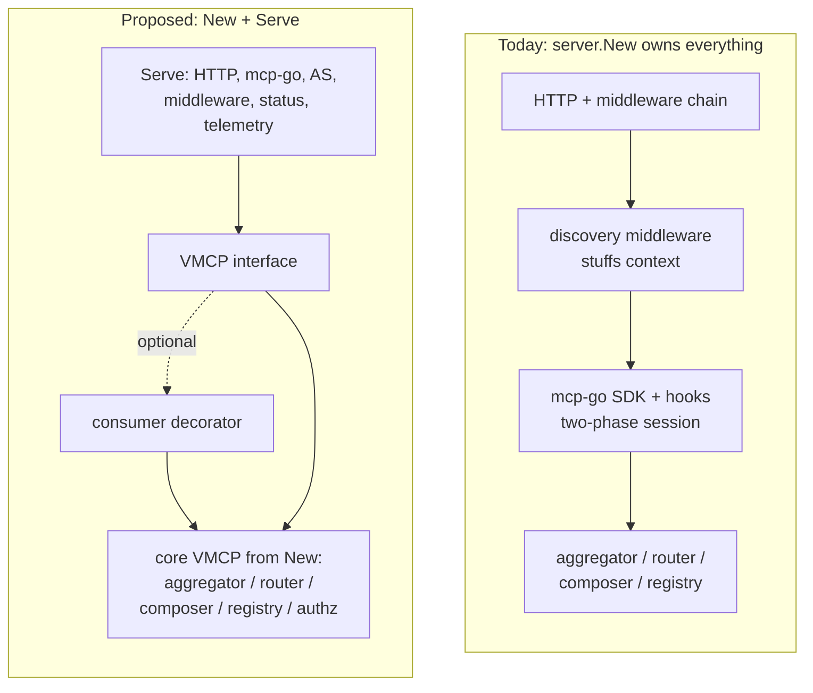

# RFC-0076: vMCP Core Interface — Splitting Domain Logic from Transport

- **Status**: Draft
- **Author(s)**: Trey Grunnagle (@tgrunnagle)
- **Created**: 2026-06-01
- **Last Updated**: 2026-06-01
- **Target Repository**: toolhive
- **Related Issues**: _(none yet)_

## Summary

This RFC proposes extracting a small, identity-parameterized `VMCP` domain
interface from the Virtual MCP Server, paired with a `New(cfg) -> VMCP`
constructor for the core and a `Serve(ctx, VMCP, serverCfg) -> *Server` helper
for the transport layer. Embedders can then wrap the core with their own
decorators to augment behavior — without reimplementing aggregation, routing,
or composition, and without coupling to the mcp-go SDK lifecycle, the HTTP
middleware chain, or request-context contracts. The existing
`server.New(...)` entry point is preserved as a thin wrapper over
`Serve(ctx, New(cfg), serverCfg)` so current embedders are unaffected.

## Problem Statement

The `pkg/vmcp/` packages are designed as an embeddable Go library
(see [`docs/arch/vmcp-library.md`](https://github.com/stacklok/toolhive/blob/main/docs/arch/vmcp-library.md)), intended for
import by downstream projects rather than for internal use alone. Today,
the only way to consume vMCP is:

```go
srv, err := server.New(ctx, cfg, router, backendClient, discoveryMgr, backendRegistry, workflowDefs)
err = srv.Start(ctx)
```

[`server.New`](https://github.com/stacklok/toolhive/blob/main/pkg/vmcp/server/server.go) constructs and owns nearly
everything in one place: the mcp-go `MCPServer`, SDK hooks, two-phase session
creation, the discovery middleware, the embedded authorization-server runner,
the full transport middleware chain (auth, MCP parser, audit, annotation
enrichment, authz, backend enrichment, telemetry, recovery, write-timeout,
heartbeat), the HTTP server lifecycle, the status reporter, the health monitor,
and the optimizer. The protocol path is entirely HTTP-middleware-driven:
incoming requests flow through that chain, the discovery middleware performs
per-request capability aggregation and stuffs results into the request
`context`, and the mcp-go SDK then invokes per-session handlers populated via
SDK hooks (`OnRegisterSession`, `OnBeforeListTools`, `OnBeforeCallTool`).

This creates three concrete problems for anyone who needs to **augment** vMCP
behavior — for example, applying an additional request-scoped capability filter
on top of the aggregated set:

1. **No single domain interface to wrap.** vMCP's domain logic (aggregation,
   conflict resolution, the advertising filter, routing, composition, backend
   auth dispatch) is reachable only by assembling and threading the individual
   collaborators — `aggregator.Aggregator`, `router.Router`,
   `vmcp.BackendRegistry`, `discovery.Manager`, `composer.Composer` — exactly as
   `server.New` does internally. There is no `ListTools(identity) -> tools`
   /`CallTool(identity, name, args)` surface a consumer can call or decorate.
   The closest existing analog is the
   [`MultiSession`](https://github.com/stacklok/toolhive/blob/main/pkg/vmcp/session/types/session.go) interface
   (`CallTool`/`ReadResource`/`GetPrompt` plus `Tools()`/`Resources()`/
   `Prompts()`), but it is *session-scoped* — created by an SDK hook during the
   two-phase `initialize` dance — and is not something an embedder can construct
   or invoke directly with an identity.

2. **Augmentation forces reaching into internals or driving the SDK.** To add
   behavior today, a consumer must either (a) reimplement the wiring — run their
   own aggregator and advertising filter, reach into `DynamicRegistry`, and
   duplicate routing logic — or (b) drive the mcp-go SDK session lifecycle and
   inject a `session.Decorator` at the `MultiSession` level. Both couple the
   consumer to implementation details that the project explicitly tracks as
   anti-patterns: [SDK coupling leaking through abstractions
   (#5)](https://github.com/stacklok/toolhive/blob/main/.claude/rules/vmcp-anti-patterns.md#5-sdk-coupling-leaking-through-abstractions),
   the [god-object server struct
   (#3)](https://github.com/stacklok/toolhive/blob/main/.claude/rules/vmcp-anti-patterns.md#3-god-object-server-struct),
   and [domain data passed through `context`
   (#1)](https://github.com/stacklok/toolhive/blob/main/.claude/rules/vmcp-anti-patterns.md#1-context-variable-coupling).

3. **Identity is threaded inconsistently.** Domain operations on `MultiSession`
   take an explicit `caller *auth.Identity` parameter
   ([`Caller.CallTool`](https://github.com/stacklok/toolhive/blob/main/pkg/vmcp/session/types/session.go)), but the
   discovery/aggregation path pulls identity out of `context` via
   `auth.IdentityFromContext`. A consumer that wants to make a capability or
   routing decision for a given identity has no consistent, explicit entry
   point — the identity-in/tools-out contract only exists implicitly, split
   across a context key and a session object built by the SDK.

**Who is affected:** maintainers of `pkg/vmcp/` (the god-object growth makes
subsystems hard to test in isolation and amplifies change risk) and downstream
embedders who need to extend vMCP without forking it.

**Why it is worth solving:** the codebase has been implicitly moving toward a
clean split between domain logic and transport for some time (the anti-pattern
rules, the `MultiSession`/`Caller` extraction, the decorating factory). Giving
that split a concrete, supported shape lets embedders compose vMCP rather than
reimplement it, and lets the library evolve its transport internals without
breaking consumers.

## Goals

- Define a minimal, identity-parameterized `VMCP` domain interface that exposes
  the MCP capability surface (list/call tools, list/read resources, list/get
  prompts, look up a tool by name) with identity as an **explicit parameter**.
- Provide `New(cfg) -> VMCP` to construct the core domain object (aggregation,
  routing, composition, backend auth dispatch, authorization admission) with no
  transport concerns.
- Provide `Serve(ctx, VMCP, serverCfg) -> *Server` to stand up the full MCP
  server (mcp-go handlers, transport middleware, incoming auth, AS endpoints,
  status, telemetry, health) backed by **any** `VMCP` — including a
  consumer-supplied decorator.
- Make decoration the supported extension mechanism: a consumer wraps the core
  `VMCP`, adds request-scoped behavior, and passes the decorator to `Serve`.
- Preserve the existing `server.New(...)` entry point and its observable
  behavior so existing embedders and `thv vmcp serve` are unaffected.
- Sequence the work as multiple small, independently reviewable PRs with a
  stable `server.New` signature throughout.

## Non-Goals

- **No new end-user features.** This is a structural refactor of the library
  surface; the MCP protocol behavior observed by clients does not change.
- **No change to the CRD / YAML configuration model.** `vmcpconfig.Config` and
  its loaders are inputs to `New`, not redefined here.
- **No change to incoming or outgoing auth strategies.** The OIDC/local/anonymous
  incoming middleware and the `OutgoingAuthRegistry` strategies are reused as-is;
  this RFC only changes *where* the core is invoked from.
- **Not removing `server.New`.** It is retained as a compatibility wrapper, not
  deprecated by this RFC.
- **No multi-tenancy, per-user policy, or quota system.** The interface merely
  takes an identity per call; what an implementation or decorator *does* with
  that identity is out of scope.

## Proposed Solution

### High-Level Design

Split the current `server` package responsibilities along the domain/transport
seam that the codebase already implies:

- **Core (`VMCP`)** — the domain object. Owns aggregation, conflict resolution
  and the advertising filter, routing, composite-tool execution, backend auth
  dispatch, and authorization admission. Stateless with respect to transport;
  every method takes an `*auth.Identity` explicitly.
- **Transport (`Serve`)** — owns the mcp-go `MCPServer`, the HTTP server and its
  lifecycle, the middleware chain, the embedded authorization server, status
  reporting, telemetry, and health endpoints. It translates inbound MCP/HTTP
  traffic into calls against a `VMCP`.



A consumer that needs to augment behavior wraps the core and hands the decorator
to `Serve`:

```go
core, err := vmcp.New(vmcpCfg)            // domain object; aggregation + authz live here
decorated := myFilterVMCP{inner: core}    // adds a request-scoped capability filter
srv, err := vmcp.Serve(ctx, decorated, serverCfg)
go srv.Start(ctx)
```

Because `Serve` accepts the interface, the decorator only ever sees the domain
surface. Transport concerns — backend OAuth challenges, the SDK two-phase
session creation, the middleware chain — fire inside `Serve` and never cross the
library boundary into consumer code.

### Detailed Design

#### Component Changes

**New `VMCP` interface (`pkg/vmcp`).** Defined in the root package alongside the
existing shared domain types so it can reference `vmcp.Tool`, `vmcp.Resource`,
etc. without import cycles. Its shape is a non-session-scoped generalization of
the already-proven [`Caller`/`MultiSession`](https://github.com/stacklok/toolhive/blob/main/pkg/vmcp/session/types/session.go)
interface: those methods already take `caller *auth.Identity` explicitly and
already return `vmcp.ToolCallResult` / `vmcp.ResourceReadResult` /
`vmcp.PromptGetResult`.

**`New` constructor (`pkg/vmcp` or a focused subpackage).** Assembles the
collaborators that `server.New` builds today — aggregator, router, backend
registry, backend client, composer, authorization admission — into a concrete
`VMCP`. This is a relocation of existing wiring, not new domain logic.
`CallTool` on the core encapsulates composite-tool (workflow) execution
end-to-end; because composite steps may require elicitation against the live
mcp-go client session, the core depends on an injected `ElicitationRequester`
interface that `Serve` implements (mirroring today's `SDKElicitationAdapter`).
The core therefore drives workflows without taking a direct dependency on the
mcp-go SDK.

**`Serve` helper (`pkg/vmcp/server`).** Houses everything in today's
`server.New` + `(*Server).Handler` + `(*Server).Start` that is *not* domain
logic: the mcp-go `MCPServer` and hooks, two-phase session creation, the
discovery/auth/audit/authz/annotation/telemetry middleware chain, the embedded
AS runner, the HTTP server lifecycle, the status reporter, the optimizer, and
the health monitor. Instead of the discovery middleware aggregating capabilities
and stuffing them into `context`, the transport layer calls
`v.ListTools(ctx, identity)` (and friends) directly, removing the
context-coupling described in [anti-pattern #1](https://github.com/stacklok/toolhive/blob/main/.claude/rules/vmcp-anti-patterns.md#1-context-variable-coupling).

The core `VMCP` is **stateless with respect to sessions**: it aggregates on
demand and holds no per-session state. `Serve` is therefore responsible for
everything session-scoped. It captures the aggregated capability set once per
MCP session (it already owns the session lifecycle) and reuses it for the life
of that session, preserving today's "capabilities fixed at `initialize`"
consistency guarantee without putting a cache in the core (consistent with
anti-patterns
[#8](https://github.com/stacklok/toolhive/blob/main/.claude/rules/vmcp-anti-patterns.md#8-unnecessary-abstraction--interface-modification)/[#9](https://github.com/stacklok/toolhive/blob/main/.claude/rules/vmcp-anti-patterns.md#9-premature-optimization)).
`Serve` (with the existing `pkg/vmcp/session` layer) likewise retains all
bound-session and token-hijack-prevention logic
(`PreventSessionHijacking`, `MetadataKeyTokenHash`); the core takes an identity
per call and never reasons about sessions, so binding never leaks into the
domain interface.

**`server.New` compatibility wrapper.** Reduced to:

```go
func New(ctx context.Context, cfg *Config, /* existing params */) (*Server, error) {
    core, err := vmcp.New(deriveCoreConfig(cfg /* + collaborators */))
    if err != nil {
        return nil, err
    }
    return Serve(ctx, core, deriveServerConfig(cfg))
}
```

Its signature and observable behavior are unchanged for the duration of the
refactor.

#### API Changes

The proposed core interface (illustrative; method set mirrors the existing
`Caller`/`MultiSession` surface, generalized to be identity-parameterized and
not session-scoped):

```go
// VMCP is the core Virtual MCP domain object. Every method takes the caller's
// identity explicitly; identity is never read from context. Implementations
// must be safe for concurrent use and may be wrapped by decorators.
type VMCP interface {
    ListTools(ctx context.Context, identity *auth.Identity) ([]vmcp.Tool, error)
    CallTool(ctx context.Context, identity *auth.Identity, name string, args map[string]any) (*vmcp.ToolCallResult, error)

    ListResources(ctx context.Context, identity *auth.Identity) ([]vmcp.Resource, error)
    ReadResource(ctx context.Context, identity *auth.Identity, uri string) (*vmcp.ResourceReadResult, error)

    ListPrompts(ctx context.Context, identity *auth.Identity) ([]vmcp.Prompt, error)
    GetPrompt(ctx context.Context, identity *auth.Identity, name string, args map[string]any) (*vmcp.PromptGetResult, error)

    // LookupTool / LookupResource / LookupPrompt resolve an advertised
    // name/URI to the capability (including its BackendID) without invoking it.
    // They give decorators a symmetric way to make a per-call decision before
    // delegating to CallTool / ReadResource / GetPrompt.
    LookupTool(ctx context.Context, identity *auth.Identity, name string) (*vmcp.Tool, error)
    LookupResource(ctx context.Context, identity *auth.Identity, uri string) (*vmcp.Resource, error)
    LookupPrompt(ctx context.Context, identity *auth.Identity, name string) (*vmcp.Prompt, error)

    // Close releases resources held by the core (backend connections, caches).
    Close() error
}

// New constructs the core domain object from vMCP configuration.
func New(cfg *Config) (VMCP, error)

// Serve stands up the full MCP server backed by the given VMCP and starts no
// listener until (*Server).Start is called. Accepts any VMCP, including a
// consumer-supplied decorator.
func Serve(ctx context.Context, v VMCP, cfg *ServerConfig) (*Server, error)

// Handler returns the fully-composed MCP http.Handler (mux + middleware chain)
// without starting a listener, so an embedder can mount it in its own server,
// wrap it with outer middleware, and serve sibling routes. Carried forward from
// today's (*Server).Handler. Start runs the handler on Serve's own listener.
func (*Server) Handler(ctx context.Context) (http.Handler, error)
func (*Server) Start(ctx context.Context) error
```

**Reuse of `Tool.BackendID`.** The interface relies on
[`vmcp.Tool.BackendID`](https://github.com/stacklok/toolhive/blob/main/pkg/vmcp/types.go) so consumers can group, filter,
or short-circuit by backend without parsing aggregated/prefixed tool names or
reaching into routing state. **This field already exists today** (as do
`Resource.BackendID` and `Prompt.BackendID`), so no type change is required —
this RFC only commits to keeping it populated through the advertising filter as
a first-class part of the contract.

**Decorator example.** A consumer-side wrapper adds one concern and delegates
the rest:

```go
type filteringVMCP struct {
    inner  vmcp.VMCP
    policy CapabilityPolicy // consumer-defined
}

func (f *filteringVMCP) ListTools(ctx context.Context, id *auth.Identity) ([]vmcp.Tool, error) {
    tools, err := f.inner.ListTools(ctx, id)
    if err != nil {
        return nil, err
    }
    out := tools[:0]
    for _, t := range tools {
        if f.policy.Allow(id, t.BackendID) {
            out = append(out, t)
        }
    }
    return out, nil
}

func (f *filteringVMCP) CallTool(ctx context.Context, id *auth.Identity, name string, args map[string]any) (*vmcp.ToolCallResult, error) {
    tool, err := f.inner.LookupTool(ctx, id, name) // resolves name -> tool (incl. BackendID)
    if err != nil {
        return nil, err
    }
    if !f.policy.Allow(id, tool.BackendID) {
        return nil, fmt.Errorf("%w: %s", ErrCapabilityNotAllowed, name)
    }
    return f.inner.CallTool(ctx, id, name, args)
}
// ListResources / ReadResource / ListPrompts / GetPrompt follow the same shape.
```

Because both the list path and the call path delegate to the same `inner`
aggregation, a decorator cannot drift between "what is advertised" and "what is
callable" — they share one source of truth.

#### Extending the Transport Layer

Decoration is the extension model for **domain** behavior. The **transport**
layer — the middleware chain, the route mux, the embedded AS, and the mcp-go SDK
integration — is owned by `Serve` and is *not* wrapped behind an interface. This
is deliberate: HTTP middleware is already a composition mechanism, and the SDK
lifecycle is exactly the coupling the refactor hides
([anti-pattern #5](https://github.com/stacklok/toolhive/blob/main/.claude/rules/vmcp-anti-patterns.md#5-sdk-coupling-leaking-through-abstractions)).
Transport augmentation therefore falls into four cases:

1. **Replace a named middleware slot (supported, via config).** `ServerConfig`
   carries the consumer-supplied `AuthMiddleware` / `AuthzMiddleware` funcs (and
   `AuthInfoHandler` / `AuthServer`) that exist on today's `server.Config`. An
   embedder injects its own auth, authz, or AS implementation through these
   slots. This is the bounded, ordering-defined extension surface the library
   commits to.

2. **Add outermost middleware and sibling routes (supported, via `Handler()`).**
   This is a fully supported, first-class pattern. `(*Server).Handler(ctx)`
   returns the fully-composed MCP handler (mux + the entire vMCP middleware
   chain) without starting a listener. An embedder mounts it in its own mux and
   **wraps it with its own outermost middleware** — middleware that runs before
   vMCP's own chain (recovery, auth, discovery, …) on every request to the
   handler. This is the sanctioned home for cross-cutting concerns such as rate
   limiting, request-size limits, tenant resolution, or custom access logging.
   The embedder may also serve its own adjacent routes under its own auth:

   ```go
   srv, _ := vmcp.Serve(ctx, core, serverCfg) // builds, does not listen
   h, _   := srv.Handler(ctx)                 // composed vMCP handler (full chain)

   mux := http.NewServeMux()
   mux.Handle("/mcp", myOutermostMiddleware(h)) // SUPPORTED: wraps the whole vMCP chain
   mux.Handle("/my/routes", myHandler)          // sibling routes, embedder-owned
   http.ListenAndServe(addr, mux)               // embedder owns the listener
   ```

   Because the wrapper sits entirely outside `Handler()`'s output, it cannot
   reorder or bypass vMCP's internal security middleware — it only adds layers in
   front of them. Outermost wrapping is therefore both unrestricted and safe.

3. **Insert middleware *between* internal layers (not supported from outside).**
   The chain order (auth → audit → discovery → authz → … → handler) lives inside
   `Serve`. If the need is domain behavior, it belongs in a `VMCP` decorator
   (case above), not middleware; if it is genuinely transport-level, it requires
   a new `ServerConfig` slot upstreamed into `Serve`. There is no seam for
   arbitrary mid-chain insertion, by design — this keeps the chain order a single
   source of truth rather than a consumer-tunable contract.

4. **Change SDK-level behavior (intentionally closed).** mcp-go hooks, the
   session-ID manager, heartbeat, and two-phase session creation stay inside
   `Serve`/the adapter layer. Exposing them would re-leak the SDK across the
   library boundary, defeating the refactor. Needs here are met by changing
   `Serve` itself, not by composition.

A consequence worth stating: this refactor does not add a new transport
extension mechanism so much as it **reduces the need for one**. Concerns that
today must be implemented as context-stuffing middleware (per-request capability
filtering, authorization shaping) move to `VMCP` decorators, shrinking the
middleware chain toward genuinely cross-cutting concerns (recovery, telemetry,
transport auth) and easing
[anti-pattern #4](https://github.com/stacklok/toolhive/blob/main/.claude/rules/vmcp-anti-patterns.md#4-middleware-overuse).

#### Configuration Changes

No new user-facing configuration, and **no change to any serialized config**.
The split is purely an in-memory restructuring performed at initialization
(the composition root), not a change to the on-disk/wire format:

- `vmcpconfig.Config` — the *serialized* runtime config produced by the YAML
  loader and the CRD conversion — is unchanged. It remains the single serialized
  input and is what `New` consumes.
- `server.Config` is already an *in-memory-only* struct: it holds
  non-serializable runtime objects (e.g. `AuthMiddleware func(http.Handler)
  http.Handler`, `OptimizerFactory`, `*telemetry.Provider`, `StatusReporter`,
  `SessionFactory`, `Watcher`) assembled at the composition root. It is never
  serialized.

Decomposing `server.Config` into a core config and a `ServerConfig` (host, port,
endpoint path, session TTL, incoming auth middleware, AS, telemetry, audit,
health monitor, status reporter, session storage) is therefore an in-memory
split only: `New`/`Serve` derive their respective structs from the unchanged
`vmcpconfig.Config` plus injected runtime dependencies at startup (the
`deriveCoreConfig`/`deriveServerConfig` step in the wrapper above). This gives
the core and the transport each only the fields they need, per
[anti-pattern #6 (configuration object passed everywhere)](https://github.com/stacklok/toolhive/blob/main/.claude/rules/vmcp-anti-patterns.md#6-configuration-object-passed-everywhere),
without touching the serialized schema, CRD, or storage.

#### Data Model Changes

None. The interface is expressed entirely in existing root-package domain types
(`vmcp.Tool`, `vmcp.Resource`, `vmcp.Prompt`, `vmcp.ToolCallResult`,
`vmcp.ResourceReadResult`, `vmcp.PromptGetResult`) and `auth.Identity`. No
schema, CRD, or storage change.

These result types retain their `Meta` field. As today, resource `_meta` may be
nil because the SDK's `resources/read` handler signature cannot forward it; the
interface doc comments state this limitation explicitly rather than implying
otherwise. No behavior change — if the SDK gains support later, the field is
already present.

## Security Considerations

This is a structural refactor; the security posture must be **preserved
exactly**, and the split should make the enforcement points more explicit, not
move them.

### Threat Model

- **Potential threats introduced:** the primary risk is *regression* — a
  capability or call that was previously gated by an authorization or filtering
  step becoming reachable because that step now lives on a different side of the
  domain/transport seam. A decorator that wraps the core could also accidentally
  *widen* access if it forwards calls without re-checking, or *narrow* the list
  path without narrowing the call path (or vice versa).
- **Attackers and capabilities:** an authenticated MCP client attempting to
  invoke a tool it should not see; or a malformed/forged identity attempting to
  bypass the advertising filter. The interface does not change who can present
  an identity — incoming authentication remains in the transport layer.

### Authentication and Authorization

- **Incoming authentication is unchanged** and remains in `Serve`'s middleware
  chain (OIDC/local/anonymous via `pkg/auth`). The core never authenticates a
  caller; it receives an already-authenticated `*auth.Identity`.
- **Authorization admission moves into the core**, behind the interface. Today
  authorization runs as HTTP middleware and the advertising filter runs in the
  aggregator (config-driven). Consolidating admission so that `ListTools` and
  `CallTool` enforce the *same* decision in the core eliminates the "list says
  yes, call says no" divergence class. Decorators layer **additional**
  restrictions on top; they must never be able to *grant* access the core
  denied. This is enforced structurally: a decorator can only filter the core's
  output or refuse a call before delegating — it has no path to the backends
  except through `inner`.
- **Identity is an explicit parameter**, removing the implicit
  `auth.IdentityFromContext` contract ([anti-pattern #1](https://github.com/stacklok/toolhive/blob/main/.claude/rules/vmcp-anti-patterns.md#1-context-variable-coupling)) on the domain path. A
  missing identity becomes a compile-time-visible `nil` argument rather than a
  silently absent context value.

### Data Security

- No new sensitive data is stored. `auth.Identity` already redacts `Token` and
  `UpstreamTokens` in its `String()`/`MarshalJSON()`; the interface passes the
  pointer through unchanged and must not log it.
- Backend addressing (workload IDs, base URLs) stays inside the core and the
  routing table, consistent with `.claude/rules/security.md` ("don't store
  internal addressing in shared state"). `Tool.BackendID` is a logical
  identifier, not an address, and is safe to expose to decorators.

### Input Validation

- The interface accepts a tool/prompt name (`string`), a resource URI
  (`string`), and `args map[string]any`. Validation of these against the
  aggregated capability set and each tool's `InputSchema` continues to live in
  the core (the composer/router already perform name resolution and the
  aggregator owns the advertised set). `LookupTool` returning an error for an
  unknown name is the validation seam for the call path.
- Anonymous vs. bound-session semantics
  (`ShouldAllowAnonymous`, `ErrNilCaller`, `ErrUnauthorizedCaller` in the
  existing `Caller` contract) must be reproduced by the core so a `nil` identity
  is handled identically to today.

### Secrets Management

- No change. Backend credentials are resolved by the existing
  `OutgoingAuthRegistry` strategies inside the core; secrets never cross the
  `VMCP` interface boundary. Header-forwarding secret identifiers
  (`HeaderForwardConfig`) remain runtime-only and are resolved below the
  interface.

### Audit and Logging

- Audit logging stays in the transport layer (`Serve`'s audit middleware), where
  request-level context (method, transport, backend enrichment) is available.
  The core should emit the same structured events it does today. Care is needed
  so that moving discovery off the middleware path does not drop the backend
  enrichment that audit events depend on; the transport layer can derive backend
  identity from `Tool.BackendID` / `LookupTool` instead of from the
  context-injected routing table.

### Mitigations

- **Behavioral parity tests** (see Testing Strategy) asserting that the
  `server.New` wrapper produces byte-for-byte equivalent MCP responses before
  and after the split.
- **One enforcement point per decision:** list and call delegate to the same
  core aggregation, removing skew.
- **Decorators cannot widen access** by construction — they hold only the inner
  `VMCP` and can subtract, not add, reachability.

## Alternatives Considered

### Alternative 1: Keep `server.New`, document the collaborators

- **Description:** Leave the architecture as-is and publish guidance on how to
  assemble the aggregator/router/registry/composer to build a custom server.
- **Pros:** Zero code change; no migration risk.
- **Cons:** Every embedder reimplements the wiring `server.New` already does,
  duplicating the advertising filter and routing logic, and re-deriving the SDK
  hook dance. Couples consumers to internals the project marks as anti-patterns.
- **Why not chosen:** It institutionalizes the duplication and coupling this RFC
  exists to remove.

### Alternative 2: Expose extension via `session.Decorator`

- **Description:** Make the existing
  [`session.Decorator`](https://github.com/stacklok/toolhive/blob/main/pkg/vmcp/session/decorating_factory.go) /
  `NewDecoratingFactory` the public extension point; consumers register a
  decorator that wraps each `MultiSession`.
- **Pros:** Mechanism already exists and is used internally (optimizer,
  hijack-prevention).
- **Cons:** Decoration happens *after* the mcp-go two-phase `initialize`, inside
  an SDK hook — so the consumer is coupled to the SDK lifecycle and to
  session-scoped state. It also operates on a `MultiSession`, which is built from
  context-injected discovery results, dragging in anti-patterns
  [#1](https://github.com/stacklok/toolhive/blob/main/.claude/rules/vmcp-anti-patterns.md#1-context-variable-coupling)
  and [#5](https://github.com/stacklok/toolhive/blob/main/.claude/rules/vmcp-anti-patterns.md#5-sdk-coupling-leaking-through-abstractions).
- **Why not chosen:** It exposes the SDK-coupled seam rather than a clean domain
  seam; the whole point is to give consumers an interface that is *independent*
  of transport.

### Alternative 3: A single "options/hooks" parameter on `server.New`

- **Description:** Add functional options (e.g. `WithToolFilter(fn)`) to
  `server.New` for the known extension points.
- **Pros:** Smaller surface; no new top-level interface.
- **Cons:** Enumerates extension points up front; every new augmentation needs a
  new option and a `server.New` signature change. Hooks that need to filter both
  list and call must be wired in two places, reintroducing skew risk.
- **Why not chosen:** A decorator over a domain interface is open-ended and
  keeps "list" and "call" provably consistent; option callbacks do neither.

## Compatibility

### Backward Compatibility

- **Fully backward compatible at the `server.New` boundary.** `server.New`
  retains its signature and observable behavior, implemented as
  `Serve(ctx, New(cfg), serverCfg)`. Existing embedders and
  `thv vmcp serve` require no changes.
- Per the stability table in [`vmcp-library.md`](https://github.com/stacklok/toolhive/blob/main/docs/arch/vmcp-library.md),
  `pkg/vmcp/server` is **Stable**; this refactor must not break it. The new
  `VMCP` interface, `New`, and `Serve` are **additive**.

### Forward Compatibility

- The decorator pattern is the open-ended extensibility point: new
  request-scoped behavior is a new wrapper, not a library change.
- Keeping `Serve` independent of the concrete core lets the transport internals
  (mcp-go version, middleware ordering, session storage) evolve without
  affecting consumers who depend only on `VMCP`.
- If independent scaling of "list/catalog" reads vs. "call" traffic is ever
  needed, the same core can back two transport surfaces without duplicating
  domain logic.

## Implementation Plan

The refactor is sequenced as multiple small PRs. **`server.New`'s signature
stays stable throughout**; the core/serve split lands behind it.

### Phase 1: Define the interface and constructor

- Add the `VMCP` interface to `pkg/vmcp`.
- Add `New(cfg) -> VMCP` that assembles the existing collaborators (relocating,
  not rewriting, the wiring currently in `server.New`).
- Confirm `Tool.BackendID` / `Resource.BackendID` / `Prompt.BackendID` are
  populated through the advertising filter; add tests pinning this.

### Phase 2: Introduce `Serve`, re-home transport concerns

- Add `Serve(ctx, VMCP, serverCfg) -> *Server`.
- Move the mcp-go server, hooks, middleware chain, AS runner, status reporter,
  optimizer, and health monitor under `Serve`.
- Replace the discovery-middleware-into-context path with direct
  `VMCP.ListTools`/`CallTool` calls from the transport layer.

### Phase 3: Reduce `server.New` to a wrapper

- Reimplement `server.New` as `Serve(ctx, New(cfg), serverCfg)`.
- Decompose `server.Config` into core config and `ServerConfig` ([anti-pattern #6](https://github.com/stacklok/toolhive/blob/main/.claude/rules/vmcp-anti-patterns.md#6-configuration-object-passed-everywhere)).

### Phase 4: Documentation and decorator example

- Update `docs/arch/vmcp-library.md` with the `New`/`Serve` pattern and a
  decorator example.
- Add a runnable example embedder.

### Dependencies

- None external. The work is internal to `pkg/vmcp/`.

## Testing Strategy

- **Unit tests:** core `VMCP` methods with a mock backend client and registry,
  covering nil-identity/anonymous semantics (`ErrNilCaller`,
  `ErrUnauthorizedCaller`), advertising-filter behavior, and `LookupTool`
  resolution of renamed/prefixed names via `GetBackendCapabilityName`.
- **Decorator tests:** a sample filtering decorator proving list and call stay
  consistent and that a decorator cannot widen access.
- **Behavioral parity / integration tests:** drive the `server.New` wrapper and
  assert MCP responses (tools/list, tools/call, resources, prompts, composite
  workflows) are equivalent before and after the split, including session
  lifecycle and cross-pod (Redis) session paths.
- **Security tests:** confirm authorization admission denies in `CallTool` what
  it omits from `ListTools`; confirm identity is never logged.
- **Existing E2E:** `thv vmcp serve` E2E suite must pass unchanged.

## Documentation

- **Architecture documentation:** update
  [`docs/arch/vmcp-library.md`](https://github.com/stacklok/toolhive/blob/main/docs/arch/vmcp-library.md) — add the `VMCP`
  interface, the `New`/`Serve` split, the decorator pattern, and update the
  stability table to mark `VMCP`/`New`/`Serve` as the recommended embedding
  surface.
- **Package docs:** update [`pkg/vmcp/doc.go`](https://github.com/stacklok/toolhive/blob/main/pkg/vmcp/doc.go) to describe
  the core interface and the domain/transport seam.
- **Embedder guide:** a worked decorator example.

## References

- [`docs/arch/vmcp-library.md`](https://github.com/stacklok/toolhive/blob/main/docs/arch/vmcp-library.md) — vMCP library embedding
  and stability table
- [`docs/arch/10-virtual-mcp-architecture.md`](https://github.com/stacklok/toolhive/blob/main/docs/arch/10-virtual-mcp-architecture.md)
  — Virtual MCP architecture
- [`pkg/vmcp/server/server.go`](https://github.com/stacklok/toolhive/blob/main/pkg/vmcp/server/server.go) — current
  `server.New` / `Handler` / `Start`
- [`pkg/vmcp/session/types/session.go`](https://github.com/stacklok/toolhive/blob/main/pkg/vmcp/session/types/session.go)
  — existing `Caller` / `MultiSession` interface (prior art for the proposed shape)
- [`pkg/vmcp/types.go`](https://github.com/stacklok/toolhive/blob/main/pkg/vmcp/types.go) — `Tool.BackendID` and shared
  domain types
- [`pkg/auth/identity.go`](https://github.com/stacklok/toolhive/blob/main/pkg/auth/identity.go) — `auth.Identity`
- [`.claude/rules/vmcp-anti-patterns.md`](https://github.com/stacklok/toolhive/blob/main/.claude/rules/vmcp-anti-patterns.md)
  — anti-patterns
  [#1 (context coupling)](https://github.com/stacklok/toolhive/blob/main/.claude/rules/vmcp-anti-patterns.md#1-context-variable-coupling),
  [#3 (god-object server)](https://github.com/stacklok/toolhive/blob/main/.claude/rules/vmcp-anti-patterns.md#3-god-object-server-struct),
  [#5 (SDK coupling)](https://github.com/stacklok/toolhive/blob/main/.claude/rules/vmcp-anti-patterns.md#5-sdk-coupling-leaking-through-abstractions),
  [#6 (config object)](https://github.com/stacklok/toolhive/blob/main/.claude/rules/vmcp-anti-patterns.md#6-configuration-object-passed-everywhere),
  [#8](https://github.com/stacklok/toolhive/blob/main/.claude/rules/vmcp-anti-patterns.md#8-unnecessary-abstraction--interface-modification)/[#9](https://github.com/stacklok/toolhive/blob/main/.claude/rules/vmcp-anti-patterns.md#9-premature-optimization)
  (unnecessary/premature abstraction) that motivate this split

---

## RFC Lifecycle

<!-- This section is maintained by RFC reviewers -->

### Review History

| Date | Reviewer | Decision | Notes |
|------|----------|----------|-------|
| 2026-06-01 | — | Draft | Initial submission |

### Implementation Tracking

| Repository | PR | Status |
|------------|-----|--------|
| toolhive | TBD | Planned |
