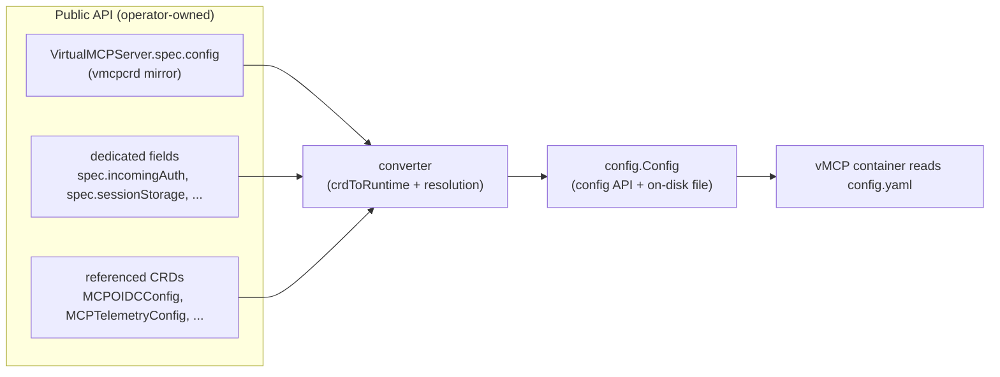

# RFC-0078: Decouple the VirtualMCPServer CRD schema from the vMCP config model

- **Status**: Draft
- **Author(s)**: Chris Burns (@ChrisJBurns)
- **Created**: 2026-06-23
- **Last Updated**: 2026-06-23
- **Target Repository**: toolhive
- **Related Issues**: [toolhive#5238](https://github.com/stacklok/toolhive/pull/5238) (implementation of Phase 1), [toolhive#3125](https://github.com/stacklok/toolhive/issues/3125) (Simplify VMCP Configuration — cited motivation for the original unification)
- **Related RFCs**: [THV-0023](THV-0023-crd-v1beta1-optimization.md) — its "CRD Types and Application Config Relationship" section introduced the unified-types decision this RFC revisits
- **Revisits**: the "CRD Types and Application Config Relationship" recommendation in [THV-0023](THV-0023-crd-v1beta1-optimization.md) (still in Draft; added in [toolhive-rfcs#27](https://github.com/stacklok/toolhive-rfcs/pull/27)) **and the implementation that adopted it** ([toolhive#5238](https://github.com/stacklok/toolhive/pull/5238))

## Summary

The `VirtualMCPServer` CRD's `spec.config` is typed as `pkg/vmcp/config.Config`,
so `controller-gen` walks that entire config tree into the public CRD schema. But
`config.Config` is **itself a public surface** — it is the schema of the on-disk
`config.yaml` and the type that consumers embedding vMCP as a library configure
directly. Embedding it in the CRD welds **two distinct public contracts** (the
Kubernetes CRD and the library/runtime config API) into one Go type, forcing them
to evolve in lockstep: any change to the config API also changes the CRD. This
RFC proposes an **operator-owned mirror type** plus a **converter seam** so the
CRD schema and the config API can evolve independently,
delivered as an **incremental, provably non-breaking migration** guarded by
drift tests. It revisits the unified-types recommendation proposed in
[THV-0023](THV-0023-crd-v1beta1-optimization.md) (which remains in Draft) and the
implementation that adopted it, preserving that proposal's single-source-of-truth
goal while removing the API coupling it introduced.

## Problem Statement

`VirtualMCPServerSpec.Config` is `config.Config` by value. Because they are the
same Go type:

- **Config-API changes leak into the CRD API.** Renaming a field, changing a
  YAML/JSON tag, or adding a validation rule on `config.Config` changes the
  `VirtualMCPServer` CRD schema — a CRD-user-facing change triggered by work on
  the (separately public) library/runtime config API.
- **You cannot add file-only / operator-resolved fields** to the config without
  them appearing in the CRD (the embedding forces it).
- **You cannot change existing fields at all** without leaking, because the file
  field and the CRD field are literally the same type — there is no seam to
  insert behaviour between "what the user declares" and "what gets written to the
  container".

**A concrete, in-flight example.**
[toolhive#4923](https://github.com/stacklok/toolhive/pull/4923) adds a single
operator-resolved field — the in-pod CA-bundle path the operator computes when an
`MCPOIDCConfig` has a ConfigMap-backed `caBundleRef` — to `config.OIDCConfig`.
Because that type is embedded in the CRD, the change **leaked 10 lines into the
public `VirtualMCPServer` CRD schema** (and a line into `crd-api.md`) for a value
no user should ever set by hand. It is exactly the operator-resolved/sidecar case
the decoupling exists to keep out of the public API — the additive subset of it is
also what the write-side `RuntimeConfig` wrapper (Alternative 1) was designed to
absorb. Today there is no seam to put such a field anywhere other than the public
CRD.

**How the coupling was introduced (deliberately).** This is not accidental.
[THV-0023](THV-0023-crd-v1beta1-optimization.md), via
[toolhive-rfcs#27](https://github.com/stacklok/toolhive-rfcs/pull/27), added a
"CRD Types and Application Config Relationship" section recommending that CRD
spec types be **unified** with application config types — embedding the internal
config directly into the CRD spec — to eliminate translation layers. Its
motivation was sound: real silent bugs from broken conversions
([toolhive#3118](https://github.com/stacklok/toolhive/pull/3118)) and
`snake_case`/`camelCase` documentation divergence
([toolhive#3070](https://github.com/stacklok/toolhive/pull/3070)).
`VirtualMCPServerSpec.Config config.Config` is the direct result. (Notably, an
earlier draft of THV-0023 proposed *removing* the embedded `Config` field; #27
reversed that to embed it.) This RFC revisits that tradeoff — see
[Alternative 2](#alternative-2-unified-crdconfig-types-the-status-quo-per-rfc-0023):
it keeps THV-0023's goal of a single, non-divergent schema, but achieves it
without welding the two public contracts into one Go type.

A subsequent attempt ([toolhive#5238](https://github.com/stacklok/toolhive/pull/5238),
original form) introduced a `RuntimeConfig` write-side wrapper. That solved only
the *additive* case (tack new operator-only fields onto a wrapper the CRD does
not reference). It could not decouple or evolve the **existing** embedded fields,
which remained the CRD's schema.

**Who is affected:** operator maintainers (blocked from evolving the config model
or adopting Kubernetes-native config without CRD churn); CRD users (at risk of
unintended CRD changes shipped as a side effect of config work); and **consumers
that embed vMCP as a library**, for whom `config.Config` *is* the configuration
API but who have no public documentation of it distinct from the Kubernetes CRD —
and the CRD is not even 1:1 with the on-disk `config.yaml` (the operator's
converter resolves references, overrides from dedicated fields, and computes
defaults), so following the CRD docs to configure the library is actively
misleading.

**Why it's worth solving:** the CRD and `config.Config` are **two public contracts
with different audiences** — Kubernetes users vs. direct library/CLI consumers —
and different natural shapes (the CRD wants secret/config *references* and CEL; the
config API wants plain, self-contained values). Welding them into one Go type
forces lockstep evolution, pollutes each with the other's concerns, and blocks
Kubernetes-native ergonomics (e.g. references inside `spec.config`). Decoupling
lets each be documented and versioned for its own audience; it does **not** make
either side a throwaway internal detail — both remain public and stable.

## Goals

- The CRD schema is generated **only** from operator-owned types. At the
  end-state (after every embedded subtree is mirrored — Phases 1b/1c), internal
  config changes **categorically cannot** reach the CRD; the no-leak boundary
  widens one package per PR until then.
- The mechanical decoupling is **zero user-facing change** — the generated CRD
  schema is byte-for-byte identical.
- **Structural and value drift** between the two type sets is caught
  automatically (parity, round-trip, and no-leak tests). Validation-rule, default,
  and doc-comment (OpenAPI description) parity is **not** covered by those tests —
  it is accepted residual risk that code generation (Alternative 3) closes; see
  Alternative 2.
- The migration is **incremental** — one config subtree per PR, each provably
  non-breaking via a zero-diff gate — so no single large, hard-to-review change is
  required.
- Establish the foundation for future **Kubernetes-native config** (references
  inside `spec.config`) and for **retiring duplicate dedicated fields**.
- Treat `config.Config` as a **first-class public configuration schema** in its
  own right — documented and versioned for direct library/CLI consumers — rather
  than as a Kubernetes implementation detail (cf. ToolHive's `RunConfig`).

## Non-Goals

- Changing the on-disk config **file format** or any runtime behaviour now.
- Changing the **CLI** config-authoring experience (`thv vmcp serve --config`).
- Adding new Kubernetes-native fields or deprecating today's dedicated top-level
  fields **in this RFC** — that is Phase 2, covered by follow-up RFCs/PRs.
- Migrating shared types owned by *other* CRDs in the first pass (notably
  `RateLimitConfig`, also used by `MCPServer`); handled as a scoped later step
  (Phase 1c) that must cover both CRDs together to avoid transient divergence.

## Proposed Solution

### High-Level Design

Introduce an operator-owned **mirror** of the config schema that the CRD
references instead of the internal type, and make the operator's **converter** the
single bridge that turns CRD input into the internal config file.

`config.Config` (the library/runtime config API) stays exactly as it is.
`controller-gen` can no longer reach it, because nothing in the CRD type graph
references it.

### Detailed Design

#### Component Changes

- **New mirror package** (`cmd/thv-operator/pkg/vmcpcrd`, or under
  `api/v1beta1/` — see Open Questions): a field-for-field duplicate of the
  `pkg/vmcp/config` types, carrying the kubebuilder markers and doc comments so
  the generated CRD schema is identical. Composite-tool validation used by the
  admission webhook is duplicated here too (the API package cannot import the
  internal package or the converter without a cycle).
- **CRD retype:** `VirtualMCPServerSpec.Config` and the
  `VirtualMCPCompositeToolDefinition` embed point at the mirror.
- **Converter as the seam:** the operator's converter builds the internal
  `config.Config` from (a) the inline mirror via a JSON transcode (`crdToRuntime`,
  lossless while the two are identical), then (b) overrides from dedicated fields,
  referenced CRDs, and computed values. This is the same pattern already used for
  telemetry (`MCPTelemetryConfigSpec` → `telemetry.Config` via `spectoconfig`).

#### API Changes

- **None user-facing.** `spec.config` is retyped onto the mirror; the generated
  CRD OpenAPI schema is unchanged (enforced by a zero-diff gate). Existing
  `VirtualMCPServer` resources are unaffected.

#### Configuration Changes

- No new user-facing configuration in Phase 1. Phase 2 may add Kubernetes-native
  reference fields to the inline `spec.config` (covered by future RFCs).

#### Data Model Changes

- `config.Config` (the public library/runtime config API) is **unchanged**. A
  parallel mirror type tree is added on the operator side. The converter maps
  mirror → config API.

## Security Considerations

### Threat Model

This change is structural (type ownership and a conversion step); it introduces
no new runtime data path, endpoint, or trust boundary. The marshaled config file
and its contents are unchanged in Phase 1.

### Authentication and Authorization

No change to authn/authz in Phase 1. Longer term, the decoupling **improves**
posture: it enables Kubernetes-native references (e.g. `SecretKeyRef`) inside the
inline config, reducing the temptation to embed plaintext credentials in
`spec.config`.

### Data Security

No change to data at rest or in transit. Secrets continue to be supplied via
references resolved by the operator into pod environment variables, never written
into the config file. The mirror types carry no secret material.

### Input Validation

CRD validation (kubebuilder markers, CEL rules) is reproduced verbatim on the
mirror, so admission-time validation is unchanged. Composite-tool validation is
duplicated into the mirror package and kept in lock-step with the internal copy
by the drift tests.

### Secrets Management

Unchanged. Secret references remain on dedicated fields / referenced CRDs and are
resolved by the operator; no secrets are stored in the CRD or the config file.

### Audit and Logging

No change.

### Mitigations

The no-leak guarantee is enforced by a reflection test that fails if any type
reachable from the CRD spec originates in a not-yet-decoupled internal package.
After Phase 1a it bars `pkg/vmcp/config`; each subsequent PR widens it to the
package it mirrors (`pkg/audit`, `pkg/ratelimit/types`, `pkg/telemetry`,
`pkg/vmcp/auth/types`), so the guarantee is *fully* categorical only at the
end-state. Until a package is mirrored, `controller-gen` still walks it and a
change there can still reach the CRD.

## Alternatives Considered

### Alternative 1: `RuntimeConfig` write-side wrapper

Embed `config.Config` in a wrapper that holds operator-only fields and is not
referenced by the CRD (the original #5238 design). **Rejected** because it only
addresses additive operator-only fields; it cannot decouple or evolve the
existing embedded fields, which remain the CRD schema.

### Alternative 2: Unified CRD/config types (the status quo, per RFC-0023)

This is the current design and the explicit recommendation of
[THV-0023](THV-0023-crd-v1beta1-optimization.md)'s "CRD Types and Application
Config Relationship" section ([toolhive-rfcs#27](https://github.com/stacklok/toolhive-rfcs/pull/27)):
use one Go type for both the CRD spec and the application config.

**Its motivation is legitimate.** Translation layers between distinct types have
caused real, silent bugs (telemetry conversion breaking; `on_error.action:
continue` dropped, [toolhive#3118](https://github.com/stacklok/toolhive/pull/3118)),
documentation divergence (`snake_case` vs `camelCase`,
[toolhive#3070](https://github.com/stacklok/toolhive/pull/3070)), and integration
tests that bypass the converter and miss plumbing bugs. A single type yields one
schema, one validation implementation, and one documented format.

**Why this RFC revisits it.** The recommendation conflates *"single source of
truth"* with *"single Go type."* Those are separable. The real requirement is
that the CRD schema and the config must not silently diverge, and the
enforced-equivalence tests in this RFC cover most of that risk — **structural
drift** (parity) and **value-loss drift** (round-trip) — without the cost type
identity imposes: welding two public contracts with different audiences into one
Go type, so every config-API change is forced to also be a CRD change.

There is, however, an honest gap. Those tests do **not** compare the
kubebuilder/CEL markers, enums, defaults, or doc comments, which become the
OpenAPI validation and description. A maintainer who edits an enum, CEL rule,
default, or comment on one side but not the other passes all the tests while
CRD-admission validation drifts from runtime validation — a hole that type
identity (one struct, one set of markers) does **not** have. We accept this as
residual risk with two mitigations: the mirror's markers are the **single source
of truth** for the CRD's validation/description, and **code generation
(Alternative 3)** — generating the mirror from the internal source — closes the
gap completely, which is the strongest reason to adopt it as the end-state.

The unified approach also did not actually eliminate translation — its own
example resolves a `TelemetryRef` into a `Telemetry` literal in the controller,
which *is* a conversion step — so in practice `VirtualMCPServer` ended up carrying
both the coupling and a converter.

**Decision.** Keep THV-0023's goal (no silent divergence; one schema, validation,
and documented format; identical field names) but **revise its mechanism**:
separate the types and enforce equivalence with tests (plus code generation at
the end-state) rather than type identity. This preserves the unification's
benefits while removing the API coupling and unblocking Kubernetes-native config.

### Alternative 3: Code-generate the mirror from the internal type (recommended end-state)

Generate the mirror (and/or the conversion functions) from the internal types so
the copy — **including kubebuilder/CEL markers, enums, defaults, and doc
comments** — is mechanical and drift is **impossible by construction**. This is
the only option that closes the marker/validation-parity gap called out in
Alternative 2 (the reflection tests cannot see comment-based markers). It is
**recommended as the end-state**, deliberately sequenced *after* Phase 1: the
hand-written mirror + drift tests are sufficient to land the decoupling
incrementally and prove the pattern, and code generation can be layered on
without changing the architecture. Until then, marker parity is accepted residual
risk per Alternative 2.

### Alternative 4: Composable shared components (deliberate granular sharing)

Rather than sharing the whole config tree (Alternative 2) or duplicating it whole
(this RFC's mirror), factor the config into shared **component** types (e.g.
`OIDCConfig`, `AggregationConfig`, `TimeoutConfig`) reused verbatim by both the CRD
spec and the internal config, and let only the larger **assembling** structs differ
— each adding or omitting fields. So the shared `OIDCConfig` is the same type on
both sides; the CRD assembly adds an `oidcConfigRef`, and the internal assembly
adds an operator-resolved `caBundlePath`. The translation layer then shrinks to
only the fields that genuinely differ (refs in, resolved values out); the shared
components need no conversion and cannot suffer a marker-parity gap (same type,
same markers). (Raised by the THV-0023 author during review.)

**Pros:** minimal translation; far less duplication than a full mirror; preserves
a single source of truth for the shared components — which are also the public
library config API that direct consumers (e.g. the vMCP library) depend on; no
marker gap for shared parts; cleanly keeps *additive* operator-resolved fields
(e.g. the [toolhive#4923](https://github.com/stacklok/toolhive/pull/4923) CA path)
off the CRD by composing them onto the internal assembly rather than the shared
leaf.

**Cons:** it is **not categorical**. A shared leaf type embedded in the CRD is
still walked by `controller-gen`, so a change to a shared component still reaches
the CRD schema — the no-leak boundary test would (correctly) fail for shared
leaves. It delivers "no *unnecessary* translation" but not "the internal config is
never embedded in the CRD."

**Status: under active consideration — largely compatible with this RFC, not
opposed to it.** The additive-field technique (compose operator-resolved fields
onto the internal struct, never the shared leaf) should be adopted regardless. The
likely end-state is a **hybrid**: share deliberately-public, stable component
types, but give the CRD its own assembly carrying the Kubernetes-native fields
(refs, secrets) and keep operator-resolved fields off it. The choice between this
and a full mirror hinges on the first Open Question below.

## Compatibility

### Backward Compatibility

The generated CRD is byte-for-byte identical (zero-diff gate). Existing
`VirtualMCPServer` and `VirtualMCPCompositeToolDefinition` resources continue to
work without change. The on-disk config format is unchanged.

### Forward Compatibility

The mirror is a free-standing API type, so future Kubernetes-native fields can be
added additively, and duplicate dedicated fields can be deprecated through normal
Kubernetes API-evolution discipline (additive → deprecate → remove, or a new
`v1beta2` with a conversion webhook for breaking restructures).

## Implementation Plan

### Phase 1: Mechanical decoupling (non-breaking, incremental)

Each step ends with **zero CRD-manifest diff** and passes the drift tests; CI
enforces it, so every step is provably non-breaking.

- **1a — config-owned tree** (DONE; [toolhive#5238](https://github.com/stacklok/toolhive/pull/5238)):
  mirror the `pkg/vmcp/config`-owned types, retype the CRDs, add the converter
  transcode, add parity / round-trip / no-leak tests.
- **1b — external types**, one PR each: mirror `audit`, `vmcp/auth/types`, and
  `telemetry` into the mirror; extend the no-leak boundary to each package.
- **1c — `RateLimitConfig` (cross-CRD, single PR)**: this type is embedded by
  **both** `VirtualMCPServer` and `MCPServer`. Mirroring it for vMCP alone would
  leave the two CRDs generating the same schema from two sources — a *new*
  transient divergence that per-CRD drift tests cannot detect. So cut over
  **both** CRDs' rate-limit subtree in the **same** PR (or, if they must be
  split, add a cross-CRD parity test holding the two schemas identical until both
  are mirrored).
- **1d — docs**: make `crd-ref-docs` render the mirror so `crd-api.md` is clean.

### Phase 2: API evolution (deliberate, separate RFCs/PRs)

- Add Kubernetes-native reference fields to the inline `spec.config` (with the
  converter resolving them, mirroring the telemetry pattern).
- Deprecate the duplicate dedicated top-level fields whose inline equivalents are
  currently dead weight (`incomingAuth`, `outgoingAuth`, `sessionStorage`,
  `passthroughHeaders`).
- Introduce `v1beta2` + conversion webhook if any change is genuinely breaking.

### Dependencies

`controller-gen` (schema + deepcopy), `crd-ref-docs` (API docs), and
`sigs.k8s.io/randfill` / apimachinery round-trip (fuzz testing) — all already in
the toolchain.

## Testing Strategy

- **Structural parity:** the mirror and internal type must have identical JSON
  leaf-path sets; failures name the drifted field. (Covers field names/shape, not
  markers/validation — see Alternative 2.)
- **Round-trip transcode fuzz:** randomly populate the mirror, transcode to the
  internal type and back, assert value preservation (catches converter loss).
- **No-leak boundary:** reflection walk asserting no CRD-reachable type lives in
  a not-yet-decoupled internal package (widens one package per PR; see Goals).
- **Zero-diff gate:** `task operator-manifests` + `task operator-generate`
  (deepcopy) + `task crdref-gen` must produce no diff. This proves **schema +
  generated-code** stability — a mis-tagged mirror field can deepcopy wrong
  without changing the OpenAPI, so deepcopy must be in the gate — but it does
  **not** prove **converter behaviour** (covered by the round-trip fuzz and
  envtest/e2e). Note the manifest diff is marker-order-sensitive, so
  semantically-null reorders also trip it (acceptable: it errs toward catching
  changes).
- **Not yet covered (residual risk):** marker/CEL/enum/default/doc-comment parity
  between the two type sets — closed by code generation (Alternative 3).
- Existing operator unit and envtest/e2e suites continue to gate behaviour.

## Documentation

- Update `docs/arch/` (operator and Virtual MCP architecture) to describe the
  CRD-mirror / converter seam.
- Publish the field-by-field mapping of `spec.config` + dedicated fields →
  internal config file (already drafted) as a maintainer reference.

## Open Questions

- **Zero coupling vs. zero *unintentional* coupling (the central decision).** This
  RFC's "categorical no-leak" goal assumes the CRD should embed *nothing* from the
  config package. Alternative 4 instead treats shared component types as a
  *deliberate joint public contract* and forbids only *accidental* leaks
  (operator-resolved / sidecar fields). Which is the real goal? If the shared
  components are genuinely a public config API that library consumers depend on
  (they are), then "zero unintentional coupling" via a **hybrid** (Alternative 4)
  may be a better end-state than a full mirror — less duplication, fewer
  translation layers, one documented schema for the shared parts — at the cost of
  the strict guarantee. This decision drives whether the end-state is the full
  mirror or the hybrid.
- **Mirror location:** `cmd/thv-operator/pkg/vmcpcrd` vs a sub-package under
  `api/v1beta1/`. The mirror is CRD API surface, which argues for under `api/`;
  current placement is a leftover from a `crd-ref-docs` rendering experiment.
- **Generate vs hand-write the mirror:** should we adopt code generation
  (Alternative 3) to make drift impossible by construction, given the
  fully-categorical end state?
- **Deprecation strategy** for the duplicate dedicated fields (Phase 2): timeline,
  warnings, and whether a `v1beta2` is warranted.
- **Scope of "fully categorical":** how far to chase shared types owned by other
  CRDs (`RateLimitConfig`) vs treating them as a separate cross-cutting effort.

## References

- [toolhive#5238](https://github.com/stacklok/toolhive/pull/5238) — Phase 1
  implementation.
- [toolhive#4923](https://github.com/stacklok/toolhive/pull/4923) — concrete,
  in-flight example of the problem: an operator-resolved CA-bundle path added to
  `config.OIDCConfig` leaks straight into the public `VirtualMCPServer` CRD schema.
- [THV-0023](THV-0023-crd-v1beta1-optimization.md) — "CRD Types and Application
  Config Relationship" (added in [toolhive-rfcs#27](https://github.com/stacklok/toolhive-rfcs/pull/27));
  origin of the unified-types decision this RFC revisits.
- [toolhive#3125](https://github.com/stacklok/toolhive/issues/3125),
  [toolhive#3118](https://github.com/stacklok/toolhive/pull/3118),
  [toolhive#3070](https://github.com/stacklok/toolhive/pull/3070) — the
  configuration-pipeline bugs and documentation divergence that motivated the
  original unification.
- `cmd/thv-operator/pkg/spectoconfig` — the **precise in-repo precedent**: an
  existing CRD-spec → runtime-config converter (`MCPTelemetryConfigSpec` →
  `telemetry.Config`) with a drift test. This design generalizes it.
- Kubernetes internal-vs-versioned API types (conversion + round-trip fuzz) —
  **loosely analogous**: that machinery converts between API *versions* of one
  object via `conversion-gen`, whereas here the two types are the same version in
  different ownership domains (public API vs on-disk file) bridged by a
  hand-written transcode. The round-trip-fuzz *methodology* is borrowed from there.

## RFC Lifecycle

### Review History

| Date | Reviewer | Notes |
|------|----------|-------|
| TBD  | TBD      | Initial draft |

### Implementation Tracking

- Phase 1a: [toolhive#5238](https://github.com/stacklok/toolhive/pull/5238)
- Phases 1b–1d, Phase 2: to be linked as PRs land.
