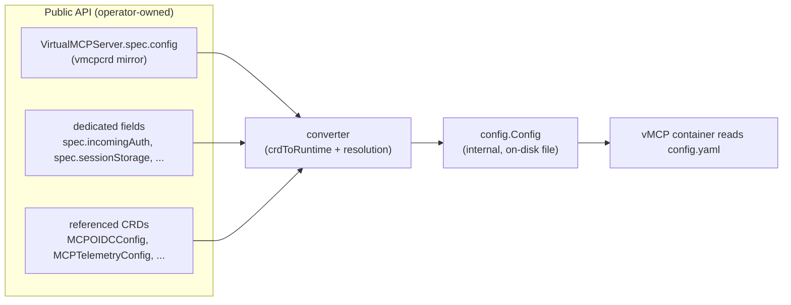

# RFC-0078: Decouple the VirtualMCPServer CRD schema from the internal vMCP config model

- **Status**: Draft
- **Author(s)**: Chris Burns (@ChrisJBurns)
- **Created**: 2026-06-23
- **Last Updated**: 2026-06-23
- **Target Repository**: toolhive
- **Related Issues**: [toolhive#5238](https://github.com/stacklok/toolhive/pull/5238) (implementation of Phase 1), [toolhive#3125](https://github.com/stacklok/toolhive/issues/3125) (Simplify VMCP Configuration — cited motivation for the original unification)
- **Related RFCs**: [THV-0023](THV-0023-crd-v1beta1-optimization.md) — its "CRD Types and Application Config Relationship" section introduced the unified-types decision this RFC revisits
- **Supersedes**: the "CRD Types and Application Config Relationship" recommendation in [THV-0023](THV-0023-crd-v1beta1-optimization.md) (added in [toolhive-rfcs#27](https://github.com/stacklok/toolhive-rfcs/pull/27))

## Summary

The `VirtualMCPServer` CRD's `spec.config` is currently typed as the internal
`pkg/vmcp/config.Config` Go struct, so `controller-gen` walks the entire
internal config tree into the public CRD schema. This welds the public API to an
implementation type: any change to the on-disk/runtime config model leaks into
the CRD. This RFC proposes an **operator-owned mirror type** plus a **converter
seam** so the CRD schema and the internal config can evolve independently,
delivered as an **incremental, provably non-breaking migration** guarded by
drift tests. It revisits and supersedes the unified-types recommendation from
[THV-0023](THV-0023-crd-v1beta1-optimization.md), preserving that proposal's
single-source-of-truth goal while removing the API coupling it introduced.

## Problem Statement

`VirtualMCPServerSpec.Config` is `config.Config` by value. Because they are the
same Go type:

- **Internal changes leak into the public API.** Renaming a field, changing a
  YAML/JSON tag, or adding a validation rule on `config.Config` changes the
  `VirtualMCPServer` CRD schema — a user-facing change triggered by an internal
  refactor.
- **You cannot add file-only / operator-resolved fields** to the config without
  them appearing in the CRD (the embedding forces it).
- **You cannot change existing fields at all** without leaking, because the file
  field and the CRD field are literally the same type — there is no seam to
  insert behaviour between "what the user declares" and "what gets written to the
  container".

**How the coupling was introduced (deliberately).** This is not accidental.
[THV-0023](THV-0023-crd-v1beta1-optimization.md), via
[toolhive-rfcs#27](https://github.com/stacklok/toolhive-rfcs/pull/27), added a
"CRD Types and Application Config Relationship" section recommending that CRD
spec types be **unified** with application config types — embedding the internal
config directly into the CRD spec — to eliminate translation layers. Its
motivation was sound: real silent bugs from broken conversions
([toolhive#3118](https://github.com/stacklok/toolhive/pull/3118)) and
`snake_case`/`camelCase` documentation divergence
([toolhive#3070](https://github.com/stacklok/toolhive/pull/3070)).
`VirtualMCPServerSpec.Config config.Config` is the direct result. (Notably, an
earlier draft of THV-0023 proposed *removing* the embedded `Config` field; #27
reversed that to embed it.) This RFC revisits that tradeoff — see
[Alternative 2](#alternative-2-unified-crdconfig-types-the-status-quo-per-rfc-0023):
it keeps THV-0023's goal of a single, non-divergent schema, but achieves it
without welding the public API to the implementation type.

A subsequent attempt ([toolhive#5238](https://github.com/stacklok/toolhive/pull/5238),
original form) introduced a `RuntimeConfig` write-side wrapper. That solved only
the *additive* case (tack new operator-only fields onto a wrapper the CRD does
not reference). It could not decouple or evolve the **existing** embedded fields,
which remained the CRD's schema.

**Who is affected:** operator maintainers (blocked from evolving the config
model or adopting Kubernetes-native config without API churn), and users (at risk
of unintended CRD changes shipped as a side effect of internal work).

**Why it's worth solving:** the CRD is a stability-gated public API. The internal
config is an implementation detail that should be free to change. Coupling them
makes both harder to evolve and blocks Kubernetes-native ergonomics (e.g.
secret/config references inside `spec.config`).

## Goals

- The CRD schema is generated **only** from operator-owned types; internal config
  changes **categorically cannot** reach the CRD.
- The mechanical decoupling is **zero user-facing change** — the generated CRD
  schema is byte-for-byte identical.
- Divergence between the two type sets is **caught automatically** (parity,
  round-trip, and no-leak tests), never silent.
- The migration is **incremental** — one config subtree per PR, each provably
  non-breaking via a zero-diff gate — so no single large, hard-to-review change is
  required.
- Establish the foundation for future **Kubernetes-native config** (references
  inside `spec.config`) and for **retiring duplicate dedicated fields**.

## Non-Goals

- Changing the on-disk config **file format** or any runtime behaviour now.
- Changing the **CLI** config-authoring experience (`thv vmcp serve --config`).
- Adding new Kubernetes-native fields or deprecating today's dedicated top-level
  fields **in this RFC** — that is Phase 2, covered by follow-up RFCs/PRs.
- Migrating shared types owned by *other* CRDs in the first pass (notably
  `RateLimitConfig`, also used by `MCPServer`); handled as a scoped later step.

## Proposed Solution

### High-Level Design

Introduce an operator-owned **mirror** of the config schema that the CRD
references instead of the internal type, and make the operator's **converter** the
single bridge that turns CRD input into the internal config file.

The internal `config.Config` stays exactly as it is. `controller-gen` can no
longer reach it, because nothing in the CRD type graph references it.

### Detailed Design

#### Component Changes

- **New mirror package** (`cmd/thv-operator/pkg/vmcpcrd`, or under
  `api/v1beta1/` — see Open Questions): a field-for-field duplicate of the
  `pkg/vmcp/config` types, carrying the kubebuilder markers and doc comments so
  the generated CRD schema is identical. Composite-tool validation used by the
  admission webhook is duplicated here too (the API package cannot import the
  internal package or the converter without a cycle).
- **CRD retype:** `VirtualMCPServerSpec.Config` and the
  `VirtualMCPCompositeToolDefinition` embed point at the mirror.
- **Converter as the seam:** the operator's converter builds the internal
  `config.Config` from (a) the inline mirror via a JSON transcode (`crdToRuntime`,
  lossless while the two are identical), then (b) overrides from dedicated fields,
  referenced CRDs, and computed values. This is the same pattern already used for
  telemetry (`MCPTelemetryConfigSpec` → `telemetry.Config` via `spectoconfig`).

#### API Changes

- **None user-facing.** `spec.config` is retyped onto the mirror; the generated
  CRD OpenAPI schema is unchanged (enforced by a zero-diff gate). Existing
  `VirtualMCPServer` resources are unaffected.

#### Configuration Changes

- No new user-facing configuration in Phase 1. Phase 2 may add Kubernetes-native
  reference fields to the inline `spec.config` (covered by future RFCs).

#### Data Model Changes

- `config.Config` (internal) is **unchanged**. A parallel mirror type tree is
  added on the operator side. The converter maps mirror → internal.

## Security Considerations

### Threat Model

This change is structural (type ownership and a conversion step); it introduces
no new runtime data path, endpoint, or trust boundary. The marshaled config file
and its contents are unchanged in Phase 1.

### Authentication and Authorization

No change to authn/authz in Phase 1. Longer term, the decoupling **improves**
posture: it enables Kubernetes-native references (e.g. `SecretKeyRef`) inside the
inline config, reducing the temptation to embed plaintext credentials in
`spec.config`.

### Data Security

No change to data at rest or in transit. Secrets continue to be supplied via
references resolved by the operator into pod environment variables, never written
into the config file. The mirror types carry no secret material.

### Input Validation

CRD validation (kubebuilder markers, CEL rules) is reproduced verbatim on the
mirror, so admission-time validation is unchanged. Composite-tool validation is
duplicated into the mirror package and kept in lock-step with the internal copy
by the drift tests.

### Secrets Management

Unchanged. Secret references remain on dedicated fields / referenced CRDs and are
resolved by the operator; no secrets are stored in the CRD or the config file.

### Audit and Logging

No change.

### Mitigations

The categorical no-leak guarantee is enforced by a reflection test that fails if
any type reachable from the CRD spec originates in `pkg/vmcp/config`.

## Alternatives Considered

### Alternative 1: `RuntimeConfig` write-side wrapper

Embed `config.Config` in a wrapper that holds operator-only fields and is not
referenced by the CRD (the original #5238 design). **Rejected** because it only
addresses additive operator-only fields; it cannot decouple or evolve the
existing embedded fields, which remain the CRD schema.

### Alternative 2: Unified CRD/config types (the status quo, per RFC-0023)

This is the current design and the explicit recommendation of
[THV-0023](THV-0023-crd-v1beta1-optimization.md)'s "CRD Types and Application
Config Relationship" section ([toolhive-rfcs#27](https://github.com/stacklok/toolhive-rfcs/pull/27)):
use one Go type for both the CRD spec and the application config.

**Its motivation is legitimate.** Translation layers between distinct types have
caused real, silent bugs (telemetry conversion breaking; `on_error.action:
continue` dropped, [toolhive#3118](https://github.com/stacklok/toolhive/pull/3118)),
documentation divergence (`snake_case` vs `camelCase`,
[toolhive#3070](https://github.com/stacklok/toolhive/pull/3070)), and integration
tests that bypass the converter and miss plumbing bugs. A single type yields one
schema, one validation implementation, and one documented format.

**Why this RFC revisits it.** The recommendation conflates *"single source of
truth"* with *"single Go type."* Those are separable. The real requirement is
that the CRD schema and the config must not silently diverge — and **enforced
equivalence** (the parity + round-trip + zero-diff tests in this RFC) guarantees
that just as well as type identity, without the cost type identity imposes:
welding a stability-gated public API to an implementation type, so every internal
change becomes a public API change. The unified approach also did not actually
eliminate translation — its own example resolves a `TelemetryRef` into a
`Telemetry` literal in the controller, which *is* a conversion step — so in
practice `VirtualMCPServer` ended up carrying both the coupling and a converter.

**Decision.** Keep THV-0023's goal (no silent divergence; one schema, validation,
and documented format; identical field names) but **supersede its mechanism**:
separate the types and enforce equivalence with tests rather than type identity.
This preserves the unification's benefits while removing the API coupling and
unblocking Kubernetes-native config.

### Alternative 3: Code-generate the mirror from the internal type

Generate the mirror (and/or the conversion functions) so the copy is mechanical
and drift is impossible by construction. **Deferred, not rejected** — it is the
strongest anti-drift option and can be layered on later without changing the
architecture (see Open Questions). Phase 1 hand-writes the mirror and relies on
drift tests.

## Compatibility

### Backward Compatibility

The generated CRD is byte-for-byte identical (zero-diff gate). Existing
`VirtualMCPServer` and `VirtualMCPCompositeToolDefinition` resources continue to
work without change. The on-disk config format is unchanged.

### Forward Compatibility

The mirror is a free-standing API type, so future Kubernetes-native fields can be
added additively, and duplicate dedicated fields can be deprecated through normal
Kubernetes API-evolution discipline (additive → deprecate → remove, or a new
`v1beta2` with a conversion webhook for breaking restructures).

## Implementation Plan

### Phase 1: Mechanical decoupling (non-breaking, incremental)

Each step ends with **zero CRD-manifest diff** and passes the drift tests; CI
enforces it, so every step is provably non-breaking.

- **1a — config-owned tree** (DONE; [toolhive#5238](https://github.com/stacklok/toolhive/pull/5238)):
  mirror the `pkg/vmcp/config`-owned types, retype the CRDs, add the converter
  transcode, add parity / round-trip / no-leak tests.
- **1b — external types**, one PR each: mirror `audit`, `ratelimit/types`,
  `vmcp/auth/types`, and `telemetry` into the mirror; extend the no-leak boundary
  to each package.
- **1c — cross-CRD `RateLimitConfig`**: reconcile the type shared with
  `MCPServer` so it is decoupled consistently across both CRDs.
- **1d — docs**: make `crd-ref-docs` render the mirror so `crd-api.md` is clean.

### Phase 2: API evolution (deliberate, separate RFCs/PRs)

- Add Kubernetes-native reference fields to the inline `spec.config` (with the
  converter resolving them, mirroring the telemetry pattern).
- Deprecate the duplicate dedicated top-level fields whose inline equivalents are
  currently dead weight (`incomingAuth`, `outgoingAuth`, `sessionStorage`,
  `passthroughHeaders`).
- Introduce `v1beta2` + conversion webhook if any change is genuinely breaking.

### Dependencies

`controller-gen` (schema + deepcopy), `crd-ref-docs` (API docs), and
`sigs.k8s.io/randfill` / apimachinery round-trip (fuzz testing) — all already in
the toolchain.

## Testing Strategy

- **Structural parity:** the mirror and internal type must have identical JSON
  leaf-path sets; failures name the drifted field.
- **Round-trip transcode fuzz:** randomly populate the mirror, transcode to the
  internal type and back, assert value preservation (catches converter loss).
- **No-leak boundary:** reflection walk asserting no CRD-reachable type lives in
  `pkg/vmcp/config`.
- **Zero-diff gate:** `task operator-manifests` + `task crdref-gen` must produce
  no diff — the per-PR non-breaking guarantee.
- Existing operator unit and envtest/e2e suites continue to gate behaviour.

## Documentation

- Update `docs/arch/` (operator and Virtual MCP architecture) to describe the
  CRD-mirror / converter seam.
- Publish the field-by-field mapping of `spec.config` + dedicated fields →
  internal config file (already drafted) as a maintainer reference.

## Open Questions

- **Mirror location:** `cmd/thv-operator/pkg/vmcpcrd` vs a sub-package under
  `api/v1beta1/`. The mirror is CRD API surface, which argues for under `api/`;
  current placement is a leftover from a `crd-ref-docs` rendering experiment.
- **Generate vs hand-write the mirror:** should we adopt code generation
  (Alternative 3) to make drift impossible by construction, given the
  fully-categorical end state?
- **Deprecation strategy** for the duplicate dedicated fields (Phase 2): timeline,
  warnings, and whether a `v1beta2` is warranted.
- **Scope of "fully categorical":** how far to chase shared types owned by other
  CRDs (`RateLimitConfig`) vs treating them as a separate cross-cutting effort.

## References

- [toolhive#5238](https://github.com/stacklok/toolhive/pull/5238) — Phase 1
  implementation.
- [THV-0023](THV-0023-crd-v1beta1-optimization.md) — "CRD Types and Application
  Config Relationship" (added in [toolhive-rfcs#27](https://github.com/stacklok/toolhive-rfcs/pull/27));
  origin of the unified-types decision this RFC revisits and supersedes.
- [toolhive#3125](https://github.com/stacklok/toolhive/issues/3125),
  [toolhive#3118](https://github.com/stacklok/toolhive/pull/3118),
  [toolhive#3070](https://github.com/stacklok/toolhive/pull/3070) — the
  configuration-pipeline bugs and documentation divergence that motivated the
  original unification.
- Kubernetes internal-vs-versioned API types + `conversion-gen` + round-trip fuzz
  — the established precedent this design follows.
- `cmd/thv-operator/pkg/spectoconfig` — existing CRD-spec → runtime-config
  conversion with a drift test (telemetry), the template for this approach.

## RFC Lifecycle

### Review History

| Date | Reviewer | Notes |
|------|----------|-------|
| TBD  | TBD      | Initial draft |

### Implementation Tracking

- Phase 1a: [toolhive#5238](https://github.com/stacklok/toolhive/pull/5238)
- Phases 1b–1d, Phase 2: to be linked as PRs land.
