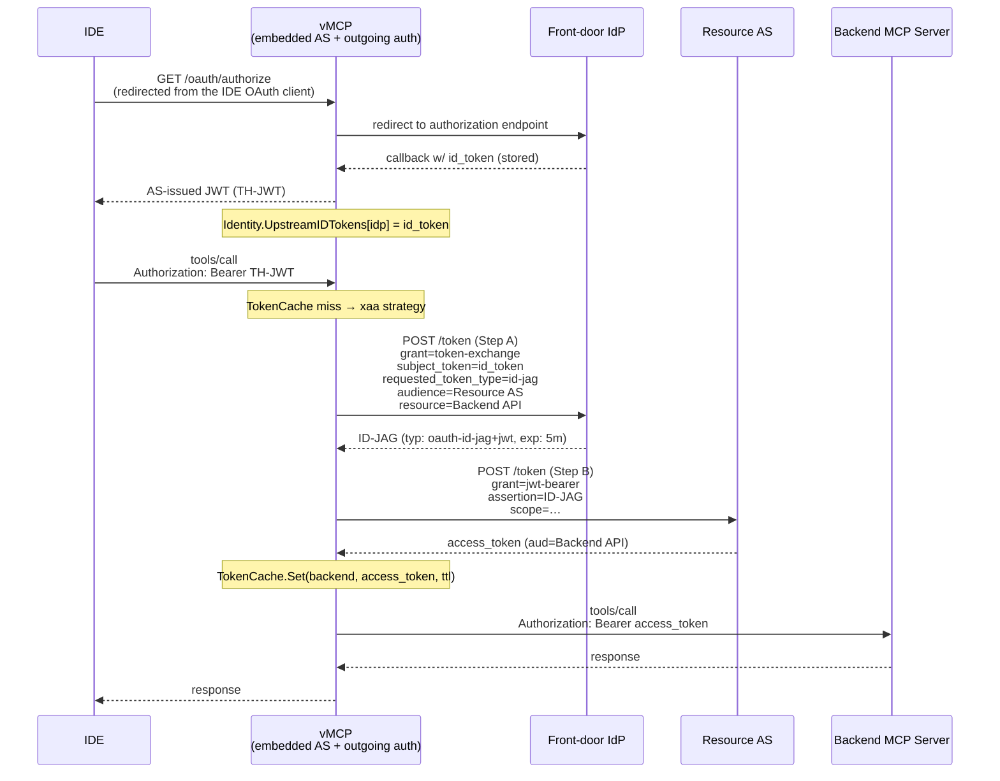
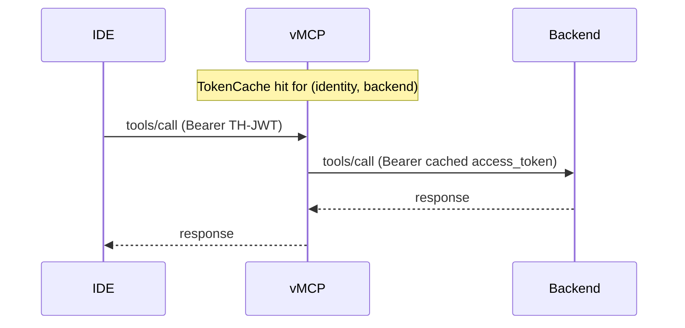

# RFC-0079: Identity-Assertion JWT Authorization Grant (ID-JAG) Support

- **Status**: Draft
- **Author(s)**: Jakub Hrozek (@jhrozek)
- **Created**: 2026-04-28
- **Last Updated**: 2026-06-26
- **Target Repository**: toolhive
- **Related Issues**: [stacklok/toolhive#5218](https://github.com/stacklok/toolhive/issues/5218)

## Summary

This RFC adds first-class support for the IETF OAuth WG draft *Identity Assertion JWT Authorization Grant* (`draft-ietf-oauth-identity-assertion-authz-grant-04`, revised May 2026) — also known as **cross-application access (XAA)** — to ToolHive. **ID-JAG** is a two-step composition of RFC 8693 (token exchange) and RFC 7523 (JWT bearer grant) that lets one application obtain an access token at a *second* application's resource authorization server by presenting an identity assertion (ID token) issued by a third party — the user's IdP — that *both* applications already trust for SSO. It is the standard OAuth answer for the cross-domain backend-auth case in which the backend's resource AS does not trust the caller's front-door IdP and the user has not authenticated against the resource AS during login.

The RFC 7523 JWT bearer grant package (`pkg/oauthproto/jwtbearer`) that implements Step B is already merged to main. This RFC builds on that foundation to add three things: (1) plumbing for the upstream ID token through `Identity.UpstreamIDTokens` so the auth middleware surfaces it to outgoing strategies; (2) a new `xaa` outgoing-auth strategy in the Virtual MCP Server that performs the two-step ID-JAG flow end to end; and (3) full operator/CRD support via a new `xaa` type on `MCPExternalAuthConfig`. The vMCP is a natural first home because the embedded auth server ([THV-0053](./THV-0053-vmcp-embedded-authserver.md)) already captures the upstream ID token during the user's SSO login — the input that ID-JAG Step A requires.

---

## 1. Background

This section describes what exists in ToolHive and in the OAuth ecosystem today. It contains no proposal content.

### 1.1 vMCP Outgoing-Auth Strategies Today

In a vMCP deployment with the embedded auth server ([THV-0053](./THV-0053-vmcp-embedded-authserver.md)), the user authenticates *once* against an enterprise identity provider — the **front-door IdP** — and receives an AS-issued JWT used to call vMCP. vMCP fronts one or more backend MCP servers, each of which is itself protected by its *own* OAuth resource authorization server — the **resource AS** — that does **not** trust the front-door IdP directly. Examples are an internal todos service, a corporate Atlassian instance, or a SaaS app with its own authorization server. The backend wants an access token issued by *its* AS, scoped to its API, for the specific user.

The job of the outgoing-auth layer is to materialise that backend access token, per request, given only the front-door identity. vMCP registers named strategies in a registry and selects one per backend via `BackendAuthStrategy`. The strategies that exist today are:

| Strategy | What it does | Trust requirement |
|----------|--------------|-------------------|
| `header_injection` | Forwards the front-door JWT verbatim | Backend trusts the front-door IdP — the trivial case |
| `token_exchange` ([THV-0007](./THV-0007-token-exchange-middleware.md)) | Swaps the front-door JWT at a single external STS via RFC 8693 | The STS trusts the front-door issuer |
| `upstream_inject` ([THV-0054](./THV-0054-vmcp-upstream-inject-strategy.md)) | Injects a per-upstream access token already acquired during login | The user consented to that upstream at login time |

The outgoing-auth layer also provides three pieces of shared plumbing that any new strategy reuses:

- **Strategy registry.** Named strategies are registered in the vMCP auth factory; per-backend config in `BackendAuthStrategy` selects which one runs.
- **Identity enrichment.** The auth middleware loads `Identity.UpstreamTokens map[string]string` (provider → access token) before the strategy runs. Strategies are stateless reads against the identity.
- **Token cache.** Backend access tokens obtained by a strategy are cached *outside* the strategy in `TokenCache`, keyed by identity + backend name.
- **CRD plumbing.** Each strategy has a converter under `pkg/vmcp/auth/converters/` that maps an `MCPExternalAuthConfig` to a `BackendAuthStrategy`, plus a `ResolveSecrets` step that pulls client secrets from Kubernetes into the proxy runner pod's environment.

### 1.2 The Eager-Chaining Problem

None of the existing strategies covers the cross-domain case. `header_injection` only works when the backend trusts the front-door IdP. `token_exchange` requires the backend's STS to trust the front-door issuer, which it usually does not across domains. `upstream_inject` requires the upstream provider to be *the resource AS itself*, and requires the user to have already authenticated with it during login.

`upstream_inject` is the closest fit, and its limitation is the practical blocker. To inject a per-upstream token, that token must have been acquired *eagerly*, during the user's login flow. If a user logs into a vMCP that fronts five backends and they only need two of them today, they must still walk through five consent screens for the remaining three — or the deployment must drop those backends. This is the **eager-chaining** problem described in [THV-0053](./THV-0053-vmcp-embedded-authserver.md): the per-backend interaction cost is paid up front, at login, regardless of whether the user will ever exercise a given backend.

There is no current strategy that says "the user has the front-door identity; obtain a backend access token *only when first needed*, mediated by the user's IdP, with no extra browser interaction."

### 1.3 How ID-JAG Composes RFC 8693 and RFC 7523

The IETF OAuth WG draft *Identity Assertion JWT Authorization Grant* (formerly *OAuth Identity Chaining for Multi-Domain Flows*) standardises exactly this pattern. It does not invent new wire formats; it composes two existing grants and adds an `id-jag` token-type URN.

**Step A — RFC 8693 token exchange at the IdP.** The Client (in our case, vMCP) presents the user's ID token to the IdP Authorization Server and asks for an *ID-JAG*: a short-lived, signed JWT scoped to a specific Resource Authorization Server. The request is a standard token-exchange request with a new `requested_token_type`:

```
POST /token HTTP/1.1
Host: idp.example.com
Authorization: Basic <Client credentials>
Content-Type: application/x-www-form-urlencoded

grant_type=urn:ietf:params:oauth:grant-type:token-exchange
&subject_token=<user ID token>
&subject_token_type=urn:ietf:params:oauth:token-type:id_token
&requested_token_type=urn:ietf:params:oauth:token-type:id-jag
&audience=https://auth.resource.example.com
&resource=https://api.resource.example.com/
&scope=todos.read
```

The IdP, which already knows that the Client is allowed to access the resource application (per cross-app consent and admin policy), returns the ID-JAG inside a normal RFC 8693 response. Per the draft (§5.2), `token_type` **MUST** be `N_A` — the JWT is not a bearer token to be presented to the IdP itself — and `issued_token_type` **MUST** be the id-jag URN. Only `access_token` (containing the ID-JAG) and `expires_in` are meaningful. The ID-JAG itself is a signed JWT:

```
Header: { "alg": "RS256", "typ": "oauth-id-jag+jwt" }
Claims: { jti, iss, sub, aud, resource, iat, exp, client_id, scope }
```

**Step B — RFC 7523 JWT bearer grant at the resource AS.** The Client presents the ID-JAG as the `assertion` parameter:

```
POST /token HTTP/1.1
Host: auth.resource.example.com
Authorization: Basic <Step B client credentials>
Content-Type: application/x-www-form-urlencoded

grant_type=urn:ietf:params:oauth:grant-type:jwt-bearer
&assertion=<ID-JAG>
&scope=todos.read
```

The resource AS validates the ID-JAG's signature against the IdP's JWKS, validates `aud` is itself, validates `resource` is one of its configured APIs, applies its own consent/admin policy, and returns a standard access token whose `aud` is the API URL chosen via the Step A `resource` parameter. That access token is what flows on the eventual MCP request.

The result is a *cross-domain* per-backend access token whose issuer is the resource AS and whose audience is the backend API — exactly what the backend wants. There is no extra browser redirect: Step A and Step B both happen as back-channel HTTP calls between vMCP and the IdP/resource AS.

### 1.4 Where ID-JAG Sits Relative to Other Grants

| Grant | What it does | Trust requirement |
|-------|--------------|-------------------|
| RFC 6749 `authorization_code` | User-driven login at one AS | Client + AS in same trust domain |
| RFC 8693 `token-exchange` | Swap one token for another at an STS | STS trusts the input token's issuer |
| RFC 7523 `jwt-bearer` | Use a signed assertion as a grant | AS trusts the assertion's signer |
| RFC 7521 / RFC 7522 SAML2-bearer | Same idea, SAML payloads | AS trusts the IdP's SAML signer |
| **ID-JAG (this RFC)** | Two-step: get a per-resource assertion from the IdP, then redeem at the resource AS | IdP trusts the client-resource pair; resource AS trusts the IdP |

The trust direction matters. ID-JAG works *exactly* when the resource AS already trusts the IdP for SSO purposes — the dominant shape in enterprise deployments — without requiring the resource AS to implement RFC 8693 or to accept the front-door JWT.

### 1.5 Vocabulary

This RFC uses the following terms consistently. They match the IETF draft where the spec defines them, and the existing [THV-0053](./THV-0053-vmcp-embedded-authserver.md) / [THV-0054](./THV-0054-vmcp-upstream-inject-strategy.md) vocabulary for ToolHive concepts.

Terms drawn from the IETF draft are marked **(draft)**; terms that are
ToolHive's own config/CRD surface or shorthand are marked **(ToolHive)**.

| Term | Source | Meaning |
|------|--------|---------|
| **Client** | draft | The application that obtains an access token on behalf of a signed-in user — it performs both Step A and Step B. In a vMCP deployment the Client is the vMCP instance, acting on the user's behalf. |
| **IdP Authorization Server** | draft | The authorization server at the front-door IdP that issues the ID-JAG. It is the Step A token endpoint. |
| **Resource Authorization Server** | draft | The authorization server that issues the backend access token. It is the Step B token endpoint. Trusts the front-door IdP for SSO; does **not** issue tokens to vMCP via a redirect flow. |
| **Resource Server** | draft | The backend that hosts the protected API and validates the access token issued by the Resource Authorization Server. In ToolHive this is the backend MCP server. |
| **Front-door IdP** | ToolHive | The OIDC identity provider the user logs in to at the embedded auth server (e.g., a corporate SSO). The user-facing entry point that hosts the IdP Authorization Server. |
| **Resource API** | ToolHive | The protected API itself, including the MCP server URL. Identified by the `resource` parameter in Step A. |
| **Upstream ID token** | ToolHive | The OIDC ID token captured by the embedded auth server during the user's front-door login. The Step A subject token. |
| **ID-JAG** | draft | The Identity Assertion JWT Authorization Grant issued at Step A. Short-lived signed JWT with `typ: oauth-id-jag+jwt`, scoped to a specific Resource Authorization Server via `aud` and to a Resource API via the `resource` claim. |
| **Backend access token** | ToolHive | The access token returned by Step B. Issued by the Resource Authorization Server, audience-bound to the Resource API, used as `Authorization: Bearer` on the eventual MCP request. |
| **Step B client credentials** | ToolHive | The OAuth client credentials vMCP uses to authenticate the Step B request at the Resource Authorization Server. May be the same credentials used at Step A (the xaa.dev custom-clients case) or distinct credentials when the IdP maps the ID-JAG's `client_id` to a different client. |

This RFC uses "front-door IdP" rather than "user IdP" or "primary IdP" to emphasise that it is the IdP at the user-facing entry to the system — the one that issued the ID token used as Step A's subject.

---

## 2. Design Goals

### 2.1 Goals

- Add an `xaa` outgoing-auth strategy to vMCP that performs the two-step ID-JAG protocol end to end, transparent to the MCP client.
- Reuse the existing `pkg/oauthproto/tokenexchange` package for Step A via its `RequestedTokenType` and `Resource` fields (already present on `main`). No protocol logic is duplicated.
- Reuse the generic `pkg/oauthproto/jwtbearer` package (already merged to `main`) implementing the RFC 7523 grant for Step B, reusable beyond ID-JAG by any future strategy needing JWT bearer.
- Plumb the upstream ID token through `Identity.UpstreamIDTokens map[string]string` (in `pkg/auth/identity.go`) so the strategy can read it without reaching back into storage at request time. Mirror the existing `UpstreamTokens` shape, including redaction in `MarshalJSON`.
- Support both client-mapping shapes: same credentials at Step A and Step B (xaa.dev custom clients), and distinct credentials per step (the cross-domain mapping case, where the IdP maps the ID-JAG's `client_id` to a different Step B client).
- Ship full operator support: an `xaa` `MCPExternalAuthConfig` type (`ExternalAuthTypeXAA`), an `XAASpec`, a converter, and CRD validation.
- Stay strictly additive. Deployments that do not configure `xaa` see no change. Existing `token_exchange`, `header_injection`, `upstream_inject`, `aws_sts`, `obo`, and `unauthenticated` strategies are untouched.

### 2.2 Non-Goals

- **Interactive step-up re-authentication.** The IdP may return `insufficient_user_authentication` from Step A (RFC 8693 §2.2.2.1 / RFC 9470). vMCP detects this error, logs it distinctly, and surfaces it to the IDE as a `401` with an RFC 9470 `WWW-Authenticate: Bearer error="insufficient_user_authentication"` challenge header (including any `acr_values`/`max_age` parameters from the IdP response). The interactive re-auth loop — where the IDE pauses the MCP session, opens a browser redirect, and retries — is out of scope: it requires MCP client support that does not yet exist and MCP spec work to standardise the mid-session re-auth mechanism.
- **`client_assertion` (private_key_jwt) at Step A or Step B.** Both steps use `client_secret_basic` for the initial implementation. The draft explicitly permits both methods and defers the choice to AS policy; some deployments may require `client_assertion`. Adding an `authMethod` field to support it is a known follow-up.
- **Multi-actor chaining (`act.act…`).** Out of scope — this RFC carries one user identity and one agent identity per token, and ID-JAG itself does not specify chained-actor semantics.
- **CLI mode (`thv proxy`, `thv run`).** Like [THV-0053](./THV-0053-vmcp-embedded-authserver.md), ID-JAG is a vMCP feature; the standalone CLI does not run an embedded auth server and has no upstream ID token to start from.
- **Refresh of stored upstream ID tokens.** ID tokens are static artefacts of the original login. Many IdPs do not issue a new ID token on access-token refresh. Re-acquiring an ID token is achieved by a re-login, not a refresh. The strategy treats a missing or expired ID token as terminal.
- **`MCPServer` / `MCPRemoteProxy` integration.** ID-JAG presupposes the embedded auth server captured an ID token. A standalone `MCPServer` receives only an access token from the IDE; there is no ID token to exchange.

---

## 3. Solution Design

### 3.1 Architecture Overview

The front-door identity (a TH-JWT) is validated by the existing auth middleware. The middleware now additionally projects the user's stored upstream **ID token** into `Identity.UpstreamIDTokens[providerName]`. The `xaa` strategy reads it from there. Two RFC 8693 / 7523 round trips later, the strategy has a backend-bound access token; it sets `Authorization: Bearer …` and lets the request proceed. The `TokenCache` caches the final access token so most calls skip both steps entirely.



### 3.2 Primary Cross-App-Access Flow

The "callback w/ id_token (stored)" step is already done by [THV-0053](./THV-0053-vmcp-embedded-authserver.md): the embedded AS captures the ID token from the OIDC callback and persists it against the user's session. All this RFC adds is reading that field through to the strategy.

The end-to-end behaviour was confirmed by a proof of concept driven against the **xaa.dev** sandbox, a hosted testbed that ships with a working IdP, resource AS, and MCP server (`https://idp.xaa.dev`, `https://auth.resource.xaa.dev`, `https://mcp.xaa.dev/mcp`). The findings that shape this RFC:

- The protocol works exactly as specified. The expected access token comes back with `aud` set to the resource (here, the MCP server URL) when the request includes `resource=https://mcp.xaa.dev/mcp` in Step A.
- Both `audience` (the AS URL) **and** `resource` (the API URL) are required at Step A — they are different values, and an earlier design draft that conflated them did not work.
- `client_secret_basic` was sufficient at both steps in the sandbox; the draft explicitly permits both `client_secret_basic` and `client_assertion`, deferring the choice to AS policy.

The PoC also identified a concrete plumbing gap inside ToolHive: the auth-server storage layer already retains the upstream ID token, but the auth middleware only projects the *access* token to `Identity.UpstreamTokens`. Step A of the ID-JAG flow needs the ID token. Closing this gap is §3.4.

### 3.3 Cached-Token Fast Path

The expected steady state, after one initial cold call, is a clean cache hit:



The **`TokenCache`** sits outside the strategy and applies to every strategy that returns an access token. It is keyed by identity + backend and respects the access token's `expires_in` (typically one to two hours). On a miss — access token expired — the strategy runs both Step A and Step B. The two back-channel calls each take tens of milliseconds and fire at most once per backend per active session in every multi-hour access-token cycle, so no intermediate cache is warranted.

### 3.4 ID Token Plumbing (`Identity.UpstreamIDTokens`)

ID-JAG Step A consumes the user's *ID token*. The auth-server storage already retains it, but the in-process token-reader projects only access tokens to the caller. The changes:

- The `TokenReader` interface gains a bulk read for ID tokens, mirroring the existing access-token read.
- The in-process implementation calls the same `GetAllUpstreamCredentials` storage method it already calls and projects the `IDToken` field instead of `AccessToken`.
- `Identity` (in `pkg/auth/identity.go`) gains `UpstreamIDTokens map[string]string`. Its `MarshalJSON` is updated to redact this field exactly the way `UpstreamTokens` is redacted (see §4.1).
- The auth middleware populates both maps. The existing access-token fetch is retained verbatim; the ID-token fetch happens immediately after, and failure of either is non-fatal (logged; identity proceeds with a partial map — the strategy's missing-token branch handles the consequence).

A second parallel `map[string]string` is preferred over folding both tokens into a per-provider struct (e.g. `map[string]UpstreamCredential`). The map shape keeps the change purely additive — no existing reader of `Identity.UpstreamTokens` changes — whereas a struct upgrade would touch every current consumer of the access-token map. If a third per-provider credential ever materialises (refresh token, expiry, scope metadata), the struct consolidation can happen then, behind the same projection step.

ID tokens are *not* refreshed. The strategy treats a missing key in `UpstreamIDTokens` (or an ID token expired by `iat`/`exp`) as terminal: it returns an error, which surfaces as `401 invalid_token` to the IDE and forces a re-login.

### 3.5 OAuth Protocol Primitives

A shared package surface (`pkg/oauthproto`) already holds the URN constants and the RFC 7523 client, so the new strategy and any future grant-related code can share them without circular imports.

The token-type and grant-type URNs already live in `pkg/oauthproto` (`constants.go`); only `TokenTypeIDJAG` is new and is added by this work:

```go
// Token type URNs (RFC 8693, draft-ietf-oauth-identity-assertion-authz-grant).
const (
    TokenTypeAccessToken = "urn:ietf:params:oauth:token-type:access_token"
    TokenTypeIDToken     = "urn:ietf:params:oauth:token-type:id_token"
    TokenTypeJWT         = "urn:ietf:params:oauth:token-type:jwt"
    TokenTypeIDJAG       = "urn:ietf:params:oauth:token-type:id-jag"
)

// Grant type URNs.
const (
    GrantTypeTokenExchange = "urn:ietf:params:oauth:grant-type:token-exchange"
    GrantTypeJWTBearer     = "urn:ietf:params:oauth:grant-type:jwt-bearer"
)
```

**Step A reuses `pkg/oauthproto/tokenexchange`.** The `ExchangeConfig` already supports everything Step A needs, including the `RequestedTokenType` and `Resource` fields (both already on `main`):

```go
type ExchangeConfig struct {
    // existing fields ...

    // RequestedTokenType is the urn:ietf:params:oauth:token-type:* the
    // caller wants back. Empty defaults to access_token (the RFC 8693
    // default), matching today's behaviour.
    RequestedTokenType string

    // Resource is the RFC 8693 resource indicator. Multiple values are
    // not yet supported. Empty omits the parameter.
    Resource string
}
```

The Step A response carries `token_type: N_A` and `issued_token_type` equal to the id-jag URN per the draft (§5.2); the strategy validates both (see §3.6).

**Step B uses the `pkg/oauthproto/jwtbearer` package** (already on `main`) implementing the RFC 7523 client:

```go
// Config describes a JWT Bearer grant exchange (RFC 7523).
type Config struct {
    TokenURL          string
    ClientID          string
    ClientSecret      string
    Scopes            []string
    AssertionProvider func() (string, error)
    HTTPClient        *http.Client
}

// TokenSource returns an oauth2.TokenSource that POSTs the assertion
// at TokenURL and unmarshals the standard token response.
func (c *Config) TokenSource(ctx context.Context) oauth2.TokenSource

// Validate returns an error if required fields are missing.
func (c *Config) Validate() error
```

The implementation mirrors `pkg/oauthproto/tokenexchange`: HTTP Basic client auth, form-encoded body, structured response decode, error mapping. The `AssertionProvider` callback lets the caller (the `xaa` strategy) supply the ID-JAG obtained from Step A without `jwtbearer` needing to know how it was minted. Because `Authenticate` always runs Step A before constructing the `jwtbearer.Config`, the assertion is always fresh for that invocation.

### 3.6 The `xaa` Outgoing-Auth Strategy

The strategy lives in `pkg/vmcp/auth/strategies/xaa.go`. It is a stateless struct — it holds no session state and no intermediate cache:

```go
type XAAStrategy struct {
    envReader env.Reader
}
```

The `Authenticate` algorithm:

1. If the request is a health check, optionally validate Step B client credentials (a cheap probe at the target token URL) and return. This mirrors `token_exchange`'s health-check shape.
2. Parse the per-backend config. Validation rejects missing required fields (`IDPTokenURL`, `TargetTokenURL`, `TargetAudience`, `TargetResource`).
3. Resolve the identity from context and read the upstream ID token:

   ```go
   identity, ok := auth.IdentityFromContext(ctx)
   if !ok { return errNoIdentity }
   idToken, ok := identity.UpstreamIDTokens[cfg.SubjectProviderName]
   if !ok || idToken == "" {
       return fmt.Errorf("xaa: no upstream id_token for provider %q: %w",
           cfg.SubjectProviderName, authtypes.ErrUpstreamTokenNotFound)
   }
   ```

   Reusing the [THV-0054](./THV-0054-vmcp-upstream-inject-strategy.md) sentinel composes with future step-up auth without extra plumbing.
4. **Step A**: build a `tokenexchange.ExchangeConfig` with `SubjectTokenType=config.subjectTokenType` (defaults to `TokenTypeIDToken`), `RequestedTokenType=TokenTypeIDJAG`, `Audience=cfg.TargetAudience`, `Resource=cfg.TargetResource`, `Scopes=cfg.Scopes`, and the IdP credentials. Call `Token()` once; the result's `AccessToken` is the ID-JAG. The strategy enforces the draft §5.2 invariant: a response with `token_type` other than `N_A` is a hard error; a missing or mismatched `typ: oauth-id-jag+jwt` header on the returned assertion is a soft warning.
5. **Step B**: build a `jwtbearer.Config` with `AssertionProvider=func(){ return idJag, nil }`, `Scopes=cfg.Scopes`, and the target credentials. Call `Token()`; the result is the backend access token.
6. Set `Authorization: Bearer <access_token>` on the outgoing request.
7. Return nil. The outer `TokenCache` records the access token under the backend key.

Errors at either step surface the RFC 8693 / 7523 error codes verbatim (`invalid_grant`, `invalid_request`, `insufficient_user_authentication`). Network errors get a wrapped sentinel. The ID-JAG returned by Step A is opaque to vMCP beyond the `token_type`/`typ` checks — vMCP holds no JWKS for the IdP and is not in the trust chain; the resource AS validates the assertion's signature, `aud`, `resource`, `iat`, and `exp`.

### 3.7 Strategy Types and Registration

The strategy type constant `StrategyTypeXAA = "xaa"` and the `XAAConfig` struct are added to the vMCP auth types:

```go
// XAAConfig configures the ID-JAG cross-app access strategy.
// +kubebuilder:object:generate=true
// +gendoc
type XAAConfig struct {
    // Step A: RFC 8693 exchange at the front-door IdP.
    IDPTokenURL        string `json:"idpTokenUrl" yaml:"idpTokenUrl"`
    IDPClientID        string `json:"idpClientId,omitempty" yaml:"idpClientId,omitempty"`
    IDPClientSecret    string `json:"idpClientSecret,omitempty" yaml:"idpClientSecret,omitempty"`
    IDPClientSecretEnv string `json:"idpClientSecretEnv,omitempty" yaml:"idpClientSecretEnv,omitempty"`

    // Step B: RFC 7523 JWT bearer at the resource AS.
    TargetTokenURL        string `json:"targetTokenUrl" yaml:"targetTokenUrl"`
    TargetClientID        string `json:"targetClientId,omitempty" yaml:"targetClientId,omitempty"`
    TargetClientSecret    string `json:"targetClientSecret,omitempty" yaml:"targetClientSecret,omitempty"`
    TargetClientSecretEnv string `json:"targetClientSecretEnv,omitempty" yaml:"targetClientSecretEnv,omitempty"`

    // Step A parameters.
    TargetAudience string   `json:"targetAudience" yaml:"targetAudience"` // resource AS URL
    TargetResource string   `json:"targetResource" yaml:"targetResource"` // resource API URL → access-token aud
    Scopes         []string `json:"scopes,omitempty" yaml:"scopes,omitempty"`

    // Subject selection. Defaults to the configured upstream provider name.
    SubjectProviderName string `json:"subjectProviderName,omitempty" yaml:"subjectProviderName,omitempty"`

    // SubjectTokenType is the token-type URN of the upstream subject token
    // supplied to Step A. Defaults to "urn:ietf:params:oauth:token-type:id_token".
    // Currently only the id_token URN is accepted; the field exists to allow
    // future expansion to SAML upstreams without an API break.
    SubjectTokenType string `json:"subjectTokenType,omitempty" yaml:"subjectTokenType,omitempty"`
}
```

`BackendAuthStrategy` gains an `XAA *XAAConfig` field, and `zz_generated.deepcopy.go` is regenerated. The strategy is registered in the vMCP auth factory alongside the existing entries:

```go
registry.RegisterStrategy(authtypes.StrategyTypeXAA, strategies.NewXAAStrategy(envReader))
```

The vMCP config defaulting is extended to default `XAA.SubjectProviderName` to the configured upstream provider name when empty, mirroring `token_exchange.SubjectProviderName`'s defaulting in the single-upstream case. With one upstream provider — the common case — the operator can omit the field entirely.

When more than one upstream provider is configured under `authServerConfig.upstreamProviders` and `XAA.SubjectProviderName` is omitted, configuration validation fails explicitly, requiring the field to be set — unlike `token_exchange`, which today still silently defaults to the first configured upstream in this case ([toolhive#5687](https://github.com/stacklok/toolhive/issues/5687) tracks consolidating this defaulting behavior across strategies). `xaa` adopts the stricter, fail-closed behavior from the start since it has no existing deployments to break ([toolhive#5697](https://github.com/stacklok/toolhive/issues/5697)).

`SubjectProviderName` is the only field in `XAAConfig` without an equivalent in any other open-source ID-JAG implementation. All other implementations pass the subject token directly; ToolHive's multi-upstream architecture requires a *selector* that identifies which of the configured upstream providers' ID tokens to use as the Step A subject. With a single upstream — the common case — the operator can omit the field and rely on the default.

### 3.8 Operator and CRD Integration

The CRD type lives in `cmd/thv-operator/api/v1beta1/mcpexternalauthconfig_types.go`. It adds the type constant `ExternalAuthTypeXAA = "xaa"` and a spec struct `XAASpec` carrying the same Step A / Step B fields as `XAAConfig`, with secret references (`IDPClientSecretRef`, `TargetClientSecretRef`) instead of inline secrets. The value `"xaa"` is intentionally identical on both the snake_case vMCP strategy surface (`StrategyTypeXAA`) and the camelCase CRD surface (`ExternalAuthTypeXAA`); as an acronym it carries no compound to case-fold, matching the existing `ExternalAuthTypeOBO = "obo"` precedent.

The converter lives in `pkg/vmcp/auth/converters/xaa.go` and implements the standard `StrategyConverter` contract:

- `ConvertToStrategy` builds a `BackendAuthStrategy` from the CRD, emitting env-var names (`*ClientSecretEnv`) for each secret. The proxy runner pod has those env vars populated via `ResolveSecrets`.
- `ResolveSecrets` reads both `IDPClientSecretRef` and `TargetClientSecretRef` from Kubernetes, surfaces errors with the secret name redacted, and returns a `map[string]string` of env-var-name → value.

The converter is registered in the converter registry alongside the existing entries. CRD manifests and API docs are regenerated via the standard operator codegen tasks.

### 3.9 Configuration

A `VirtualMCPServer` configures an upstream front-door IdP and points a backend at an `xaa` `MCPExternalAuthConfig`:

```yaml
# Signing key and MCPOIDCConfig omitted for brevity — see operator docs.
apiVersion: toolhive.stacklok.dev/v1beta1
kind: VirtualMCPServer
metadata:
  name: vmcp-cross-app-demo
  namespace: default
spec:
  # Backend discovery via MCPGroup; the MCPRemoteProxy below joins the group.
  groupRef:
    name: xaa-backends

  # Embedded AS — chains to the front-door IdP for user login.
  authServerConfig:
    issuer: https://auth.example.com/vmcp
    signingKeySecretRefs:
      - name: signing-key
        key: private.pem
    upstreamProviders:
      - name: idenx
        type: oidc
        oidcConfig:
          issuerUrl: https://idp.xaa.dev
          clientId: client_3a2341f833945fbb
          clientSecretRef: { name: xaa-idp, key: client-secret }
          redirectUri: https://auth.example.com/vmcp/oauth/callback
          scopes: [openid, profile, email]

  # Incoming auth: validate tokens issued by the embedded AS.
  incomingAuth:
    type: oidc
    oidcConfigRef:
      name: vmcp-oidc
      audience: https://auth.example.com/vmcp/mcp
      resourceUrl: https://auth.example.com/vmcp/mcp

  # Outgoing auth: discovered from each MCPRemoteProxy's externalAuthConfigRef.
  outgoingAuth:
    source: discovered
---
# The MCPRemoteProxy joins the group and declares its outgoing auth.
apiVersion: toolhive.stacklok.dev/v1beta1
kind: MCPRemoteProxy
metadata:
  name: todo-mcp
  namespace: default
spec:
  remoteUrl: https://mcp.xaa.dev/mcp
  transport: streamable-http
  groupRef:
    name: xaa-backends
  externalAuthConfigRef:
    name: todo-mcp-auth
---
apiVersion: toolhive.stacklok.dev/v1beta1
kind: MCPExternalAuthConfig
metadata:
  name: todo-mcp-auth
  namespace: default
spec:
  type: xaa
  xaa:
    # Step A: front-door IdP exchange.
    idpTokenUrl: https://idp.xaa.dev/token
    idpClientId: client_3a2341f833945fbb
    idpClientSecretRef:
      name: xaa-idp
      key: client-secret

    # Step B: resource AS JWT bearer.
    # Same credentials as Step A — no cross-domain mapping for custom
    # xaa.dev clients. When the IdP maps the ID-JAG client_id to a
    # distinct Step B client, set targetClientSecretRef to those
    # credentials instead.
    targetTokenUrl: https://auth.resource.xaa.dev/token
    targetClientId: client_3a2341f833945fbb
    targetClientSecretRef:
      name: xaa-idp
      key: client-secret

    # Parameters.
    targetAudience: https://auth.resource.xaa.dev   # resource AS
    targetResource: https://mcp.xaa.dev/mcp         # → access-token aud
    scopes: [todos.read]
    # subjectProviderName defaults to "idenx" (single configured upstream)
```

A single MCP request from the IDE produces, internally, two back-channel POSTs. Step A (token exchange at the IdP):

```http
POST /token HTTP/1.1
Host: idp.xaa.dev
Authorization: Basic <Client basic credentials>
Content-Type: application/x-www-form-urlencoded

grant_type=urn%3Aietf%3Aparams%3Aoauth%3Agrant-type%3Atoken-exchange
&subject_token=<id_token>
&subject_token_type=urn%3Aietf%3Aparams%3Aoauth%3Atoken-type%3Aid_token
&requested_token_type=urn%3Aietf%3Aparams%3Aoauth%3Atoken-type%3Aid-jag
&audience=https%3A%2F%2Fauth.resource.xaa.dev
&resource=https%3A%2F%2Fmcp.xaa.dev%2Fmcp
&scope=todos.read
```

Step B (JWT bearer at the resource AS):

```http
POST /token HTTP/1.1
Host: auth.resource.xaa.dev
Authorization: Basic <Step B client basic credentials>
Content-Type: application/x-www-form-urlencoded

grant_type=urn%3Aietf%3Aparams%3Aoauth%3Agrant-type%3Ajwt-bearer
&assertion=<ID-JAG>
&scope=todos.read
```

And the eventual MCP request goes out as:

```http
POST /mcp HTTP/1.1
Host: mcp.xaa.dev
Authorization: Bearer <access_token, aud=https://mcp.xaa.dev/mcp>
Content-Type: application/json
Accept: application/json, text/event-stream

{ "jsonrpc": "2.0", "method": "tools/call", "id": 1, ... }
```

---

## 4. Security Considerations

ID-JAG is a privilege-relevant operation: vMCP asks an external IdP to issue an assertion that another AS will accept as a grant, and ends up holding a backend access token for the user. The flow runs server-to-server, but the consequence is that any mis-validation in the chain turns vMCP into a confused deputy. The subsections below cover the artefacts vMCP handles and the trust assumptions it relies on.

### 4.1 ID Token Exposure and Redaction

The new `Identity.UpstreamIDTokens` field carries the user's upstream ID token in process memory. ID tokens are sensitive — more so than access tokens, because they identify the user directly. The field is redacted in `Identity.MarshalJSON` via the `SafeIdentity` marshalling path, exactly the way `UpstreamTokens` is already redacted. Because every JSON serialisation of an `Identity` goes through `MarshalJSON`, the token value never reaches structured logs, the audit pipeline, or outbound webhooks. The strategy itself never logs the token; it parses the `sub` claim for logging only and discards the rest.

### 4.2 ID-JAG as a Short-Lived Bearer

Both the ID-JAG and the backend access token are bearer credentials, and the design bounds their blast radius by lifetime and by never persisting them.

- The **ID-JAG** is short-lived — 300 s typical in the sandbox — and held only in process memory for the duration of the `Authenticate` call; it is passed directly to Step B and not retained afterward. It is never written to disk, to a ConfigMap, to a RunConfig file, or to operator status.
- The **backend access token** is cached per identity + backend in the existing `TokenCache`, which is in-memory with the access token's own `expires_in` as its TTL.

Neither artefact outlives the process, and both are gated by short TTLs, so a memory-disclosure window is small and self-healing.

Replay prevention within the `exp` window is a trust assumption ToolHive makes on the resource AS implementing `jti` tracking, consistent with RFC 7523's inherent bearer-assertion replay exposure — the draft itself is silent on replay and does not assign this responsibility explicitly. vMCP's own handling (no persistence, direct pass-through to Step B) minimises the interception surface but does not substitute for AS-side `jti` enforcement.

### 4.3 Cross-Domain Client Mapping Risks

When `idpClientId` equals `targetClientId` (the xaa.dev custom-clients case), Step A and Step B authenticate as the same client and there is no mapping to get wrong. When they differ (the cross-domain mapping case, where the IdP maps the ID-JAG's `client_id` to a distinct Step B client), a misconfigured `targetClientSecretRef` or `targetTokenUrl` could deliver a Step B request — carrying a valid ID-JAG — to the wrong resource AS or under the wrong client identity. The mitigating trust assumption is structural: ID-JAG only works when the agent application and the resource application share the *same* front-door IdP for SSO, and the IdP mints the ID-JAG with an `aud` bound to a specific resource AS. A token minted for one resource AS will be rejected by another. The configuration risk is therefore one of *delivery* (wrong endpoint), not of *forgery*; `targetAudience` and `targetResource` are required, validated, and kept as separate fields precisely so the AS-vs-API distinction cannot be conflated.

### 4.4 Scope Enforcement

The `scope` and `resource`/`audience` parameters constrain what Step B is permitted to issue, but vMCP is not the authority that enforces them. The resource AS validates the ID-JAG, applies its own consent and admin policy, and decides which scopes the returned access token carries. vMCP does **not** inspect, parse, or validate the returned access token — it is opaque to vMCP and is validated by the backend, which has its own auth middleware. ToolHive's role is to *materialise* the token, not to second-guess the resource AS's contract. The strategy does flatten and validate the configured scope list against the RFC 6749 scope-token grammar before joining, so a malformed scope value cannot inject form data into the request body.

### 4.5 Upstream ID Token at Rest

This RFC does not introduce new at-rest storage of the ID token. The embedded auth server already captures and persists the upstream `id_token` in `storage.UpstreamTokens` as part of [THV-0053](./THV-0053-vmcp-embedded-authserver.md) / [THV-0031](./THV-0031-auth-server-integration.md); this RFC only adds a read path that projects the already-stored value to request-time code. The at-rest protections are therefore inherited from the existing upstream-token storage: the same backend (in-memory or Redis), the same `SessionExpiresAt` lifetime bound, and the same access scoping that already applies to stored refresh tokens. Two points are worth making explicit:

- The practical sensitivity of that storage is higher than the schema implies. An `id_token` directly identifies the user; it is audience-restricted to the vMCP client, so its blast radius is bounded, but a disclosed ID token paired with the Step A client credentials is a usable Step A subject until it expires. Deployments that persist upstream tokens in Redis should hold that backend to the same encrypted-at-rest and access-scoped bar already expected for refresh tokens.
- ID tokens are bound by `SessionExpiresAt`. An expired or evicted row yields the §3.4 terminal "missing ID token" path and forces a re-login; there is no separate ID-token TTL to tune.

### 4.6 Backend Token Cache Isolation

The `TokenCache` (§3.3) returns a previously issued backend access token without re-running Step A/Step B, so its key must isolate users: an entry minted for one front-door identity must never be served to another. The identity component of the key is the validated `sub` claim (`Identity.Subject`), which ToolHive requires on every token per OIDC Core 1.0 §5.1 — an IdP-assigned, immutable per-user identifier, not a mutable attribute such as email or display name. The cache key is a SHA-256 digest over the subject and the backend identifiers, so raw identity and token values never appear in the key itself. Because the cache is in-memory and process-local, a disclosure is bounded to one proxy runner and one access-token TTL.

### 4.7 Audit Logging of Token Issuance

Materialising a backend credential on the user's behalf is a privilege-relevant event that should be observable independently of debug logging. Each Step A and Step B outcome — success, or failure with its OAuth error code — should emit a structured audit event carrying the front-door identity (`sub`), the target resource AS, the resource API, and the requested scopes, and never the ID token, the ID-JAG, or the access token. This answers "which user obtained a token for which backend, and when" without exposing credential material; because the event is built only from non-secret fields, it cannot leak token bytes even if the sink is misconfigured. This is net-new wiring: today `pkg/audit` runs only as inbound HTTP middleware and no outgoing-auth strategy emits audit events, so `xaa` would be the first consumer on this path — the event must be emitted from within the strategy's `Authenticate` call or from the composition root that invokes it. It is called out here so the work is not assumed to come for free.

### 4.8 Client Secret Handling and Rotation

The Step A (IdP) and Step B (resource AS) client secrets are supplied as Kubernetes secret references and resolved into the proxy runner pod's environment by `ResolveSecrets` (§3.8); they are never written to RunConfig, CRD status, or logs. Secrets are injected as pod environment variables via `SecretKeyRef`, which Kubernetes snapshots at pod start, and neither the `MCPRemoteProxy` nor the `VirtualMCPServer` reconciler watches `Secret` objects or triggers a rollout when a referenced secret changes. Rotating a client secret therefore requires a proxy-runner restart (e.g. `kubectl rollout restart`) before the new value takes effect — the same behaviour as the existing `token_exchange` and OIDC client-secret env injection. Operators should schedule secret rotations accordingly.

### 4.9 Operator-Configured Token Endpoint SSRF Exposure

`idpTokenUrl` and `targetTokenUrl` are operator-supplied endpoints; `xaa` inherits the same SSRF exposure and validation posture as the existing `token_exchange` strategy's `TokenURL` (URL-parse only, no host allow-listing). This is an accepted risk in ToolHive's threat model for admin-supplied configuration, not a `xaa`-specific gap.

---

## 5. Compatibility

### 5.1 Backward Compatibility

This change is strictly additive:

- The `xaa` strategy type is new; no existing `BackendAuthStrategy` uses it. Deployments that do not configure `xaa` are unaffected.
- No existing strategy, CRD field, or default value changes. `token_exchange`, `header_injection`, `upstream_inject`, `aws_sts`, `obo`, and `unauthenticated` are untouched.
- `Identity.UpstreamIDTokens` is a new struct field; existing readers ignore it, and `MarshalJSON` redacts it consistently with `UpstreamTokens`. Existing callers do not break.
- `tokenexchange.ExchangeConfig.RequestedTokenType` and `Resource` are optional fields (already on `main`); empty values preserve the default behaviour (access token, no resource indicator).
- `pkg/oauthproto/jwtbearer` is already on `main`; no existing call site is affected by its use here.
- The `TokenReader` ID-token bulk read is a new interface method; the in-process implementation gains it, mocks regenerate, and no other implementer exists.

### 5.2 Draft Stability and Forward Compatibility

The API is built against `draft-ietf-oauth-identity-assertion-authz-grant`, which has not yet reached RFC status. Field names, semantics, and behavior may change in a future release as the draft evolves; users should watch the IETF datatracker for draft updates. When the draft becomes an RFC, the implementation will be reviewed against the final spec. The design leaves room for forward growth without breaking the per-request fast path:

- A `client_assertion` (private_key_jwt) branch can be added via an `IDPClientAuthMethod` enum on the config, for Okta compatibility.
- `SubjectTokenType` is already in the API surface (single `id_token` value today); expanding the Enum to include SAML URNs requires no breaking change.
- The `IDP*` / `Target*` field separation makes the cross-domain-mapping case a configuration change, not a code change.

---

## 6. Implementation Plan

The work lands as three stacked PRs on the `xaa-test` branch. Each builds on the previous one, and the tree continues to build and pass existing tests at every stage.

### 6.1 PR 1 — Surface Upstream ID Tokens

Branch: `xaa-test-upstream-id-tokens`. Goal: upstream ID tokens reach the strategy layer.

- The `TokenReader` interface gains a bulk ID-token read; the in-process service implements it by projecting the `IDToken` field from the storage read it already performs.
- `Identity.UpstreamIDTokens` field added in `pkg/auth/identity.go`, with `MarshalJSON` / `SafeIdentity` redaction.
- The auth middleware populates both the access-token and ID-token maps; failure of either is non-fatal.

PR size: small, mechanically straightforward, no new external dependencies.

### 6.2 PR 2 — Protocol Primitives and `xaa` Strategy

Branch: `xaa-test-outgoing-strategy`. Goal: end-to-end flow against a fake IdP and fake resource AS.

- `TokenTypeIDJAG` URN constant added to `pkg/oauthproto`. (The other token-type/grant-type URN constants, the `tokenexchange.ExchangeConfig.RequestedTokenType`/`Resource` fields, and the `pkg/oauthproto/jwtbearer` RFC 7523 client are foundation work already merged to `main`; this PR consumes them.)
- `StrategyTypeXAA`, `XAAConfig`, and the new `BackendAuthStrategy.XAA` field; `zz_generated.deepcopy.go` regenerated.
- `pkg/vmcp/auth/strategies/xaa.go` with the two-step flow, validation, and the draft §5.2 `token_type=N_A` / `typ` checks.
- RFC 9470 `insufficient_user_authentication` detection in `performStepA`: distinct WARN log with error code and IdP-supplied `acr_values`/`max_age`; `WWW-Authenticate` challenge header on the resulting 401 so MCP clients that implement RFC 9470 can act on it.
- Strategy registered in the vMCP auth factory; `SubjectProviderName` defaulting added.

### 6.3 PR 3 — CRD and Operator Support

Branch: `xaa-test-crd-support`. Goal: declarative `xaa` config.

- `ExternalAuthTypeXAA` constant and `XAASpec` in `cmd/thv-operator/api/v1beta1/mcpexternalauthconfig_types.go`.
- `pkg/vmcp/auth/converters/xaa.go` with `ConvertToStrategy` and `ResolveSecrets`, registered in the converter registry.
- CRD manifests and API docs regenerated via the standard operator codegen tasks.

### 6.4 Dependencies

- [THV-0031](./THV-0031-auth-server-integration.md) — embedded AS in the proxy runner; accepted, implemented.
- [THV-0053](./THV-0053-vmcp-embedded-authserver.md) — vMCP embedded AS; this RFC is a vMCP feature and does not apply to standalone `MCPServer`. The embedded AS is what captures and persists the upstream ID token.
- [THV-0054](./THV-0054-vmcp-upstream-inject-strategy.md) — `upstream_inject` strategy; reuses the `ErrUpstreamTokenNotFound` sentinel.
- [THV-0007](./THV-0007-token-exchange-middleware.md) — token-exchange middleware; the RFC 8693 foundation reused for Step A.

---

## 7. Testing Strategy

### 7.1 Unit Tests

- `pkg/vmcp/auth/strategies/xaa_test.go` covers the full flow against `httptest` mock IdP and resource AS servers asserting the exact RFC 8693 / RFC 7523 wire shape. The matrix includes both client-mapping shapes (same credentials, and cross-domain mapped credentials), a `token_type=N_A` hard-error case (draft §5.2), a `typ: oauth-id-jag+jwt` header soft-warning case, missing identity, missing ID token, Step A success and errors, Step B success and errors, the health-check probe with and without credentials, and scope / audience / resource propagation.
- The `pkg/oauthproto/jwtbearer` package has its own unit tests: form-encoded body shape, scope joining, HTTP Basic auth header, error surfacing, and network-error wrapping.
- `pkg/oauthproto/tokenexchange` regression tests confirm that existing callers with `Resource` / `RequestedTokenType` zero-valued behave as before, and that both are propagated when set.
- `Identity.UpstreamIDTokens` redaction in `MarshalJSON` is asserted.

### 7.2 Operator / CRD Validation Tests

- The converter mapping (`ConvertToStrategy`) is tested for field-by-field correctness, including env-var-name emission for secrets.
- Secret resolution (`ResolveSecrets`) is tested for both `IDPClientSecretRef` and `TargetClientSecretRef`, including the missing-secret error path with the secret name redacted.

### 7.3 End-to-End Flow

The full Step A + Step B flow is verified against the **xaa.dev** sandbox — a hosted IdP, resource AS, and MCP server at `idp.xaa.dev`, `auth.resource.xaa.dev`, and `mcp.xaa.dev/mcp` — using a kind cluster fronted by ngrok for public HTTPS callback URLs. The test exercises both the same-credentials and cross-domain-mapping shapes and asserts that the issued access token's `aud` equals the configured `targetResource`. Success is confirmed by observing `xaa: Step A succeeded, got ID-JAG` and `xaa: Step B succeeded, setting Bearer token` in the vMCP debug logs.

---

## 8. Alternatives Considered

### 8.1 Extend `upstream_inject` with Lazy Acquisition

Rather than a new strategy, extend `upstream_inject` to acquire the upstream token on first use instead of at login. This does not work because `upstream_inject` relies on the user having authenticated against the upstream provider during the SSO login flow — there is no back-channel path to drive a consent or redirect after login has completed. Deferring the acquisition would require a step-up re-authentication mechanism: an interactive browser redirect mid-session, popping a re-auth tab, and resuming the MCP call afterward. That is a separate, larger problem (and a candidate for its own RFC) and does not address the cross-domain trust gap at all — even with lazy acquisition, `upstream_inject` still presupposes the upstream provider is the resource AS and trusts the user's session directly.

### 8.2 Single-Step RFC 8693 Directly at the Resource AS

Rather than the two-step ID-JAG composition, have vMCP exchange the front-door ID token directly at the backend's resource AS via RFC 8693. The resource AS would reject it: it does not trust the front-door IdP, and it does not implement an RFC 8693 endpoint that accepts a foreign issuer's token. This is precisely the cross-domain trust gap. ID-JAG fills it by routing through an IdP that *both* applications already trust for SSO — the IdP mints a resource-scoped assertion at Step A, and the resource AS accepts that assertion at Step B because it trusts the IdP's signature. Collapsing the two steps into one removes the only party (the shared IdP) that both sides trust.

---

## Open Questions

1. **`client_secret_post` for Okta compatibility.** The initial implementation uses `client_secret_basic` (credentials in the `Authorization` header). Okta's XAA feature uses `client_secret_post` (credentials in the request body). The draft permits both; adding a `clientAuthMethod` enum field (`basic` / `post`) to `IDPClientID` and `TargetClientID` config is a small, self-contained follow-up. Worth pulling forward if Okta is a day-one target.
2. **Should the strategy validate ID-JAG signatures locally before Step B?** Doing so would catch IdP misconfigurations earlier but requires fetching and caching the IdP's JWKS — otherwise unnecessary work since the resource AS validates on its end. Probably no, but worth confirming.

## References

- IETF: *Identity Assertion JWT Authorization Grant*, `draft-ietf-oauth-identity-assertion-authz-grant-04`, revised May 2026. <https://datatracker.ietf.org/doc/draft-ietf-oauth-identity-assertion-authz-grant/>
- [RFC 8693 — OAuth 2.0 Token Exchange](https://datatracker.ietf.org/doc/html/rfc8693) (Step A).
- [RFC 7523 — JWT Profile for OAuth 2.0 Client Authentication and Authorization Grants](https://datatracker.ietf.org/doc/html/rfc7523) (Step B).
- [RFC 7521 — Assertion Framework for OAuth 2.0](https://datatracker.ietf.org/doc/html/rfc7521).
- [RFC 7519 — JSON Web Token](https://datatracker.ietf.org/doc/html/rfc7519).
- [RFC 6749 — OAuth 2.0 Authorization Framework](https://datatracker.ietf.org/doc/html/rfc6749).
- *xaa.dev cross-app access sandbox* — IdP, resource AS, MCP server, and todo API: <https://xaa.dev>.
- *Okta AI Agent docs — cross-app access*: <https://developer.okta.com/docs/guides/configure-cross-app-access/main/>.
- `@modelcontextprotocol/typescript-sdk` PR #1328 (`withCrossAppAccess` middleware reference): <https://github.com/modelcontextprotocol/typescript-sdk/pull/1328>.
- [THV-0007](./THV-0007-token-exchange-middleware.md) — Token-exchange middleware (RFC 8693 outbound, foundation).
- [THV-0031](./THV-0031-auth-server-integration.md) — Embedded Authorization Server in the Proxy Runner.
- [THV-0053](./THV-0053-vmcp-embedded-authserver.md) — vMCP Embedded Authorization Server.
- [THV-0054](./THV-0054-vmcp-upstream-inject-strategy.md) — vMCP `upstream_inject` Outgoing-Auth Strategy (sentinel `ErrUpstreamTokenNotFound`).
- ToolHive code: `pkg/oauthproto/tokenexchange/`, `pkg/oauthproto/jwtbearer/`, `pkg/auth/identity.go`, `pkg/vmcp/auth/strategies/xaa.go`, `pkg/vmcp/auth/converters/xaa.go`, `cmd/thv-operator/api/v1beta1/mcpexternalauthconfig_types.go`.
