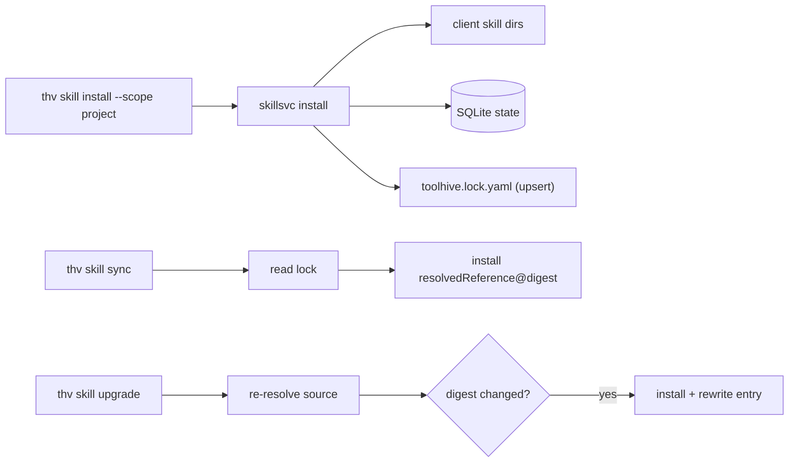

# RFC-0080: Project-Level Skills Lock File

- **Status**: Draft
- **Author(s)**: Samuele Verzi (@samuv)
- **Created**: 2026-07-03
- **Last Updated**: 2026-07-03
- **Target Repository**: toolhive
- **Related Issues**: [toolhive#5715](https://github.com/stacklok/toolhive/pull/5715)

## Summary

Add a project-level skills lock file (`toolhive.lock.yaml`) that pins the name, version, source, resolved reference, and digest of every project-scoped skill install, plus `thv skill sync` and `thv skill upgrade` commands to restore pinned state and pull newer content from the catalog. This brings to skills the reproducibility guarantees that `package-lock.json`, `Cargo.lock`, and `go.sum` provide for other ecosystems.

## Problem Statement

- **Current behavior:** `thv skill install --scope project` writes files to client skill dirs and a SQLite record, but nothing pins *which* content was installed in a shareable, version-controlled form. Two teammates cloning the same repo get whatever the catalog currently serves, not what the original installer intended.
- **Who is affected:** any team using project-scoped skills for shared workflows (code-review conventions, testing skills, org-specific instructions). Reproducibility and controlled upgrades are both missing.
- **Why worth solving:** skills are supply-chain artifacts (instructions an AI assistant follows). Unpinned installs mean silent drift across machines and no auditable path from "what we agreed to use" to "what's actually installed". Every comparable package manager solved this with a committed lock file; skills currently have no equivalent.

## Goals

- Pin the exact content digest of every project-scoped skill install in a file committed to the project repo.
- Restore the pinned skill set on any machine via `thv skill sync`.
- Provide a controlled, digest-based upgrade path via `thv skill upgrade`.
- Let CI verify that installed state matches the lock via `thv skill sync --check`.
- Keep the lock client-agnostic by pinning content, not which client apps installed it.
- Stay out of user-scope installs entirely.

## Non-Goals

- Version-constraint resolution or manifest-driven installs. There is no `toolhive.yaml` with `^1.0.0` ranges in this proposal. The lock file is the declaration of intent; sync installs exactly what's pinned.
- Per-client pinning. The lock pins content; sync installs for all detected clients, overridable with `--clients`.
- A dependency resolver or transitive dependency graph for skill-on-skill dependencies.
- Lock-file entries for user-scope installs.

## Proposed Solution

Use a single lock file written by install commands. `--scope project` installs upsert an entry; uninstalls remove it. `sync` reinstalls at the pinned `resolvedReference@digest`; `upgrade` re-resolves the original `source` and rewrites the entry if the digest changed.

### High-Level Design



### Detailed Design

`toolhive.lock.yaml` is the general ToolHive project lock file, not a skills-only artifact. Schema version 1 defines only the `skills:` key, but the top-level structure deliberately leaves room for future artifact types (for example a `plugins:` key for the plugins system) to join as sibling keys without a schema break. Loading a lock file with an unknown or newer top-level `version` is a hard error with a clear "upgrade thv" message; it is never silently ignored or partially parsed.

The lock file has a top-level `version: 1` field and a deterministic list of skill entries sorted by name for stable diffs. Entries pin either OCI or git content:

```yaml
version: 1
skills:
  - name: code-review
    version: 1.0.0
    source: code-review
    resolvedReference: ghcr.io/org/code-review:1.0.0
    digest: sha256:9f2b1e...
  - name: testing-conventions
    source: git://github.com/org/skills.git#main/testing-conventions
    resolvedReference: git://github.com/org/skills.git
    digest: 4f0c9a1d2e8b7c6a5f4e3d2c1b0a9f8e7d6c5b4a
```

Each entry stores `name`, optional `version` from `SKILL.md` frontmatter, `source`, `resolvedReference`, and `digest`. `source` is the original user input, such as a plain registry name, OCI reference, or `git://` reference, preserved verbatim so upgrade can re-resolve it. `resolvedReference` is the concrete OCI reference or git URL that source resolved to. `digest` is either an OCI `sha256:...` digest or a git commit hash, as in the two entries above.

The schema deliberately omits `installedAt`. Every major lock file, including npm, pnpm, yarn, Cargo, Go, and Poetry, stores identity, source, and integrity, not chronology. Reproducibility is guaranteed by the digest, not a timestamp; timestamps are environment-local and produce meaningless merge churn on no-op regenerations. "When was this pinned" is answered better by `git blame`, and `git log -p -- toolhive.lock.yaml` serves any recency or audit need.

The lock stays strictly client-agnostic: there is no per-entry `clients` field. Client sets are machine-local (one teammate may not have a given client installed at all), so client targeting is a sync-time concern handled by `--clients` or client auto-detection. If genuine demand for per-client pinning appears, an optional field can be added later with `omitempty` without a schema break.

Skill dependencies (`toolhive.requires` in `SKILL.md` frontmatter, recorded in the SQLite `skill_dependencies` table) are not locked in v1. Dependencies materialized by an install are recorded in SQLite but get no lock entry of their own, so they surface as *unmanaged* in sync reports. Proper dependency locking (entries with a machine-generated provenance marker, or a nested structure) is future work; until then, teams that want dependencies pinned should install them explicitly at project scope.

#### Component Changes

- Add a new `pkg/skills/lockfile` package for schema handling, load/save, and file-locked upsert/remove using `pkg/fileutils.WithFileLock` in the same pattern as config writes. Marshalling is deterministic, with sorted entries. Entry fields are validated at load time (see Input Validation), since the lock file is the one hand-editable input this feature introduces.
- Update `pkg/skills/skillsvc` install and uninstall hooks so project-scope installs upsert a lock entry recording the original `opts.Name` as `Source` before any internal resolution, and uninstalls remove it. Lock write errors never fail the install or uninstall, because the skill's files and DB record are already correct and a subsequent sync or upgrade can repair the lock; however, the failure is not merely logged server-side. It is surfaced as a warning field in the API response and printed by the CLI, so the user knows the committed lock is now stale. User-scope installs never touch the lock.
- Add `Sync`, which reads the lock, compares each entry against `SkillStore` state, installs strictly by pinned `resolvedReference@digest` using OCI pull-by-digest or git clone plus checkout of the pinned commit, and reports unmanaged project-scope skills. A locked skill whose local record has a *different* digest is reinstalled to the pinned digest and reported distinctly as `drifted`, not lumped into `installed`. With `--prune`, it uninstalls unmanaged skills. It never rewrites the lock; it only makes FS/DB match what's pinned.
- Drift detection compares the lock against SQLite install records, not re-hashed file content. If a user hand-edits or deletes installed skill files without going through `thv`, the DB still reports the pinned digest and sync will report `upToDate` without repairing the files. Similarly, a digest match says nothing about which clients hold the files: a client installed after the original install will have an empty skill directory yet the entry still reports `upToDate`. Content-hash verification and per-client file presence checks are noted as future work; the pragmatic remedy today is `thv skill install` of the affected skill.
- Add `--check` to `thv skill sync`: it computes the same diff sync would apply but changes nothing, exiting non-zero if any entry is missing or drifted. This gives CI a cheap gate analogous to `npm ci` or `cargo --locked`.
- Add `Upgrade`, which re-resolves each entry's `source` exactly as a fresh `thv skill install <source>` would. Registry names resolve through the catalog, git branches/tags resolve to current heads, and OCI tags resolve to current digests. If the digest changed, upgrade installs and rewrites the entry. Immutable sources such as OCI `@sha256:` digests or full 40-character git commit hashes are reported as `not-upgradable` without contacting the network. `source` is never rewritten, so future upgrades keep re-resolving the same input.
- Bare `thv skill upgrade` upgrades all lock entries, matching `npm update` and `cargo update` conventions. The safety net is `--dry-run` plus the fact that an upgrade only propagates to teammates once the lock diff is reviewed and committed.
- `--dry-run` prints what would change but is not fully side-effect-free: there is no "peek" API for OCI or git, so dry-run still pulls the artifact into the local cache or clones the repo, skipping only extraction and FS/DB writes.
- `Sync` and `Upgrade` process every entry even when some fail (registry down, digest garbage-collected): failures are reported per skill in the structured report, successful installs stay in place, and the CLI exits non-zero if any entry failed. During upgrade, the lock is rewritten per entry as each upgrade lands; a failure after install but before the lock rewrite leaves lock and reality briefly inconsistent, which the report flags and the next sync or upgrade repairs.
- Have `Sync` and `Upgrade` call `installInternal`, not `Install`, so they do not overwrite the entry's `Source` with an already-resolved reference.

#### API Changes

This proposal is additive, with no breaking HTTP API changes (adding `Sync` and `Upgrade` to the `SkillService` Go interface does break external implementers of that interface, if any exist):

- `POST /skills/sync` with body `{projectRoot, clients, prune, check}` returns a report containing installed, drifted, up-to-date, unmanaged, pruned, and failed skills. With `check: true` the report is computed but nothing is installed or pruned.
- `POST /skills/upgrade` with body `{projectRoot, names, dryRun, clients}` returns per-skill outcomes of upgraded, up-to-date, not-upgradable, or failed, including old and new digests where relevant.
- Install responses gain an optional warning field used when the lock write fails after a successful project-scope install.
- `SkillService` gains `Sync` and `Upgrade` methods, and `pkg/skills/client` gains corresponding HTTP methods.

#### Configuration Changes

None. The lock file is project-level, discovered by auto-detecting the git root from the current working directory, using the nearest enclosing `.git` directory. `--project-root` provides an override. If there is no enclosing git repository and no `--project-root`, the command errors rather than guessing; monorepo sub-projects that want their own lock are supported only via an explicit `--project-root <subdir>` (the lock lives wherever it points). No global config is added.

#### Data Model Changes

No SQLite schema changes are required. The lock file is a new committed YAML artifact at the project root, while the SQLite `installed_skills` table continues to hold runtime install records. The lock is the shareable pin; SQLite is the local install state. `sync` reconciles the two.

## Security Considerations

### Threat Model

A malicious or compromised lock file, such as one introduced through a tampered PR, could pin a skill to a known-bad digest. The threat is an attacker committing a lock entry pointing to malicious skill content that teammates then sync. The relevant attacker capabilities are write access to the project repo or the ability to submit a PR that is merged. `sync` amplifies this threat compared to manual installs: it turns "review what you install" into "run one command after `git pull`", silently installing instructions an AI assistant will follow, which is why lock diffs deserve the same review scrutiny as code.

Two related considerations:

- The two pin types do not carry equal integrity guarantees. OCI `sha256:` digests are content-addressed and collision-resistant; git commit hashes are SHA-1 for most repositories, where collisions have been demonstrated. This is an accepted trade-off inherited from git itself; future skill signing (e.g. Sigstore, as floated in THV-0030) would mitigate it.
- `sync --prune` is a destructive operation driven by a committed file: a tampered lock that *removes* entries, combined with a habitual `sync --prune`, deletes legitimate skills. Prune therefore stays opt-in and pruned skills are itemized in the report.

### Authentication and Authorization

Lock-file writes happen server-side in `skillsvc`, gated by the same API auth as existing skill install/uninstall operations. This proposal introduces no new auth surface. `sync` and `upgrade` reuse the existing OCI Docker credential chain and git token auth paths, with no new credential handling.

### Data Security

The lock file contains no secrets, only public references and content digests. It is committed to git by design. No sensitive data is stored or transmitted beyond what `thv skill install` already transmits.

### Input Validation

The lock file is the one hand-editable input this feature introduces, so entries are validated at the trust boundary: `lockfile.Load` validates entry names via the same `ValidateSkillName` used for installs and rejects malformed digests before any entry is acted on. (The POC instead relies on downstream parsing — `ParseGitReference` and `nameref.ParseReference` during `buildPinnedReference`, plus the full install validation path — which is effective but harder to reason about; load-time validation is the specified design.) Beyond load, `resolvedReference` and `digest` still flow through the existing OCI and git resolution paths, which enforce SSRF guards such as no localhost/private IPs in git refs except dev mode, shell-injection reference validation, and supply-chain checks such as requiring artifact skill names to match OCI repo paths. A tampered lock can only pin references that would also pass a manual `thv skill install`.

The `projectRoot` accepted by the sync/upgrade API bodies is validated the same way existing project-scope install paths are, so the daemon cannot be directed to read or write lock files in arbitrary unrelated locations.

### Secrets Management

None. The lock stores no tokens. Registry and git authentication use the existing per-process credential chain.

### Audit and Logging

Lock upsert/remove errors are logged via `slog.Warn` with skill name and project root, and additionally surfaced to the caller as a warning in the API response and CLI output. `sync` and `upgrade` return structured reports covering installed, drifted, up-to-date, unmanaged, pruned, failed, upgraded, and not-upgradable states suitable for audit. The lock file itself, being git-committed, gives a full history of what was pinned when, which is stronger cross-machine provenance than DB-only audit.

### Mitigations

- Pinned-digest installs mean `sync` reproduces the exact pinned content, and a merged lock entry is auditable in `git blame`.
- `upgrade` refuses to upgrade entries already pinned to a digest or commit, preventing accidental re-resolution of intentionally locked content.
- Best-effort lock writes mean a failed lock write cannot corrupt an install because files and DB state are already correct; the failure is surfaced to the user, and `sync` can repair drift recorded in the DB (it does not detect manual edits to installed files; see Detailed Design).
- `sync` reports new, drifted, and pruned entries per skill, keeping the "one command after `git pull`" flow observable rather than silent.

## Alternatives Considered

### Alternative 1: Separate manifest and lock file

- **Description:** A hand-edited `toolhive.yaml` declares desired skills with version constraints, and the lock resolves them.
- **Pros:** Supports `^1.0.0` ranges; upgrade is "re-resolve constraints".
- **Cons:** Requires building a dependency resolver; doubles the surface area with two files to keep in sync; skills do not have a rich enough versioning or constraint ecosystem to justify it yet.
- **Why not chosen:** The POC scope is narrower. The single-lock model delivers reproducibility now and leaves the door open to a manifest layer later without rework.

### Alternative 2: Store pin data only in the SQLite store

- **Description:** No committed file; sync reads from a shared or replicated DB.
- **Pros:** No new file format.
- **Cons:** Not portable across machines; cannot be reviewed in a PR; no `git blame` provenance; defeats the committed, auditable pin goal entirely.
- **Why not chosen:** This approach fundamentally does not meet the reproducibility and audit goals.

### Alternative 3: Per-client lock entries

- **Description:** Pin which client apps each skill installs into.
- **Pros:** Precise per-client control.
- **Cons:** Couples the lock to the local client set; bloats entries; one teammate without Cursor installed cannot sync cleanly.
- **Why not chosen:** Content pinning is the real need; client targeting is a local concern handled at sync time by `--clients` or detected clients.

## Compatibility

### Backward Compatibility

This change is fully backward compatible. Existing project-scope installs simply start writing a lock file. Pre-existing installs without a lock entry still work; sync reports them as unmanaged and does not touch them unless `--prune` is set. No migration is required because the lock file is additive. User-scope installs are entirely unchanged.

### Forward Compatibility

The top-level `version: 1` schema field allows future schema evolution; readers hard-error on unknown versions rather than misinterpreting them. Because `toolhive.lock.yaml` is the general project lock, future artifact types such as plugins (THV-0077) can add sibling top-level keys (e.g. `plugins:`) next to `skills:` without a version bump. The `source` field is the extensibility hook for a future manifest/resolver layer; a v2 schema could add constraint expressions alongside `source` without breaking v1 readers. New entry fields can be added with `omitempty`.

## Implementation Plan

A POC implementation already exists in [toolhive#5715](https://github.com/stacklok/toolhive/pull/5715). Post-RFC acceptance, split it into reviewable PRs.

### Phase 1: Lock file package

- Add the `pkg/skills/lockfile` schema and file-locked operations.

### Phase 2: Install/uninstall hooks

- Add project-scope install upsert and uninstall remove behavior.

### Phase 3: Sync

- Add the `Sync` service method, API, and `thv skill sync` CLI.

### Phase 4: Upgrade

- Add the `Upgrade` service method, API, and `thv skill upgrade` CLI.

### Phase 5: Docs

- Update `docs/arch/12-skills-system.md`, CLI docs, and swagger.

### Dependencies

None blocking. This proposal relies on existing `gitresolver` commit checkout and `ociskills.RegistryClient` digest pulls, both of which are already capable of supporting the design.

## Testing Strategy

- **Unit tests:** `lockfile` package round-trip, upsert/remove, missing-file behavior, load-time validation of names and digests, and unknown-version rejection; skillsvc hooks for project versus user scope; non-fatal lock write failures surfacing warnings; `Sync` drift detection (including the `drifted` report category), `--check` exit codes, unmanaged reports, prune behavior, and continue-on-partial-failure semantics; `Upgrade` digest changes, immutable sources, upgrade-all default, and dry-run behavior; API routes; CLI helpers.
- **E2E tests:** `thv skill install --scope project`, then `sync` on a clean tree, then `sync --check` (clean and after inducing drift), then `upgrade` after a catalog bump, against real GHCR artifacts.
- **Security tests:** confirm a tampered lock can only pin to references that pass existing supply-chain validation, and that malformed lock entries are rejected at load time.

## Documentation

- Update `docs/arch/12-skills-system.md` with a new "Project Lock File" section, as done in the POC PR.
- Regenerate CLI docs via `task docs`.
- Add a short user-facing guide on committing `toolhive.lock.yaml` and running `sync` after pull.

## Open Questions

All questions raised in earlier drafts have been resolved during design review; the outcomes live in the relevant design sections above.

1. ~~Sync behavior on digest drift~~ → **Resolved: reinstall to the pinned digest, reported distinctly as `drifted`** (see Detailed Design).
2. ~~Optional per-entry `clients` field~~ → **Resolved: the lock stays strictly client-agnostic; targeting is a sync-time local concern** (see Detailed Design).
3. ~~`upgrade` default target selection~~ → **Resolved: bare `upgrade` upgrades all entries, matching npm/cargo conventions, with `--dry-run` and the committed lock diff as safety nets** (see Detailed Design).
4. ~~Future manifest naming and lock file name~~ → **Resolved: the lock name stays `toolhive.lock.yaml` since it is the general project lock; manifest naming is deferred to a future manifest RFC** (see Forward Compatibility).

## References

- POC PR: <https://github.com/stacklok/toolhive/pull/5715>
- Research note that motivated this: <https://github.com/stacklok/notes/blob/093fc48edbc6631ef9373cc1c35581a343ac2af5/docs/joes-research/tessl-skills-package-managers.md>
- [THV-0030: Skills Lifecycle Management in ToolHive CLI](./THV-0030-skills-lifecycle-management.md)
- [THV-0041: SQLite-Based State Management](./THV-0041-sqlite-state-management.md)
- Prior art: npm `package-lock.json`, pnpm `pnpm-lock.yaml`, `Cargo.lock`, `go.sum`, `poetry.lock`
- oras-go cross-origin redirect auth guard, relevant to pinned-digest pulls: GHSA-vh4v-2xq2-g5cg

---

## RFC Lifecycle

<!-- This section is maintained by RFC reviewers -->

### Review History

| Date | Reviewer | Decision | Notes |
|------|----------|----------|-------|
| YYYY-MM-DD | @reviewer | Under Review | Initial submission |

### Implementation Tracking

| Repository | PR | Status |
|------------|----|--------|
| toolhive | [#5715](https://github.com/stacklok/toolhive/pull/5715) | POC |
