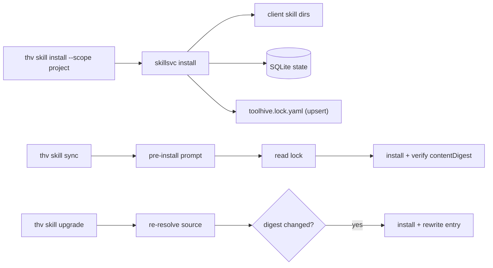

# RFC-0080: Project-Level Skills Lock File

- **Status**: Draft
- **Author(s)**: Samuele Verzi (@samuv)
- **Created**: 2026-07-03
- **Last Updated**: 2026-07-07
- **Target Repository**: toolhive
- **Related Issues**: [toolhive#5715](https://github.com/stacklok/toolhive/pull/5715)

## Summary

Add a project-level lock file (`toolhive.lock.yaml`) that pins the name, version, source, resolved reference, checkout digest, and content digest of every project-scoped skill install (including transitively materialized dependencies), plus `thv skill sync` and `thv skill upgrade` commands to restore pinned state and pull newer content from the catalog. The lock borrows the *shape* of `package-lock.json`, `Cargo.lock`, and `go.sum` (identity, source, integrity in a committed file) but does **not** claim their external trust roots in v1: the trust root for a committed pin is PR review of the lock diff, with a v2 milestone for Sigstore signing (per THV-0030) and transparency-log-style source-to-digest binding.

## Problem Statement

- **Current behavior:** `thv skill install --scope project` writes files to client skill dirs and a SQLite record, but nothing pins *which* content was installed in a shareable, version-controlled form. Two teammates cloning the same repo get whatever the catalog currently serves, not what the original installer intended.
- **Who is affected:** any team using project-scoped skills for shared workflows (code-review conventions, testing skills, org-specific instructions). Reproducibility and controlled upgrades are both missing.
- **Why worth solving:** skills are supply-chain artifacts (instructions an AI assistant follows). Unpinned installs mean silent drift across machines and no auditable path from "what we agreed to use" to "what's actually installed". Every comparable package manager solved this with a committed lock file; skills currently have no equivalent.

## Goals

- Pin the exact content of every project-scoped skill install (including transitive `toolhive.requires` dependencies) in a file committed to the project repo, with a deterministic `contentDigest` for integrity verification.
- Restore the pinned skill set on any machine via `thv skill sync`, with a pre-install confirmation gate on interactive terminals.
- Provide a controlled, digest-based upgrade path via `thv skill upgrade`.
- Let CI verify that installed on-disk content matches the lock via `thv skill sync --check` (content re-hash, not SQLite records alone).
- Keep the lock client-agnostic by pinning content, not which client apps installed it.
- Stay out of user-scope installs entirely.

## Non-Goals

- Version-constraint resolution or manifest-driven installs. There is no `toolhive.yaml` with `^1.0.0` ranges in this proposal. The lock file is the declaration of intent; sync installs exactly what's pinned.
- Per-client pinning. The lock pins content; sync installs for all detected clients, overridable with `--clients`.
- A dependency *resolver* or version-constraint graph for skill-on-skill dependencies. Transitive deps are *recorded* in the lock (Cargo-style), not re-resolved from constraints.
- Lock-file entries for user-scope installs.
- External trust roots in v1 (GOSUMDB-style transparency logs, mandatory Sigstore verification). These are named as a v2 milestone.

## Proposed Solution

Use a single lock file written by install commands. `--scope project` installs upsert an entry (and entries for transitively materialized dependencies); uninstalls remove them. `sync` reinstalls at the pinned `resolvedReference@digest` and verifies `contentDigest` on disk; `upgrade` re-resolves the original `source` and rewrites the entry if the digest changed.

### High-Level Design



### Detailed Design

`toolhive.lock.yaml` is proposed as the ToolHive project lock file name. **This RFC owns only the `version` and `skills:` keys.** Reserving sibling top-level keys (for example `plugins:` for the plugins system in THV-0077) is a *contract proposal* that a future plugins or artifacts RFC must ratify; THV-0077 does not currently specify a lock schema. Loading a lock file with an unknown or newer top-level `version` is a hard error with a clear "upgrade thv" message; it is never silently ignored or partially parsed.

The lock file has a top-level `version: 1` field and a deterministic list of skill entries sorted by name for stable diffs. Entries pin either OCI or git content:

```yaml
version: 1
skills:
  - name: code-review
    version: 1.0.0
    source: code-review
    resolvedReference: ghcr.io/org/code-review:1.0.0
    digest: sha256:9f2b1e...
    contentDigest: sha256:a1b2c3d4...
  - name: testing-conventions
    source: git://github.com/org/skills.git#main/testing-conventions
    resolvedReference: git://github.com/org/skills.git
    digest: 4f0c9a1d2e8b7c6a5f4e3d2c1b0a9f8e7d6c5b4a
    contentDigest: sha256:e5f6a7b8...
    requiredBy:
      - code-review
```

Each entry stores:

- `name`, optional `version` from `SKILL.md` frontmatter
- `source`: the original user input (registry name, OCI reference, or `git://` reference), preserved verbatim so upgrade can re-resolve it
- `resolvedReference`: the concrete OCI reference or git URL that source resolved to
- `digest`: the checkout pin — OCI manifest digest or git commit hash used to fetch the artifact
- `contentDigest`: a deterministic SHA-256 dirhash of the materialized skill file set (the integrity primitive for `--check` and always-on verification). This closes the gap where a git commit hash pins history, not the skill subdirectory's content, and avoids relying on SHA-1 as the content-integrity anchor.
- `requiredBy` (optional): parent skill names for transitively materialized dependencies

`source` is never rewritten, so future upgrades keep re-resolving the same input.

The schema deliberately omits `installedAt`. Every major lock file, including npm, pnpm, yarn, Cargo, Go, and Poetry, stores identity, source, and integrity, not chronology. Reproducibility is guaranteed by the digest, not a timestamp; timestamps are environment-local and produce meaningless merge churn on no-op regenerations. "When was this pinned" is answered better by `git blame`; `git log -p -- toolhive.lock.yaml` serves any recency or audit need. The CLI `--help` for sync points operators to that command for pin history.

The lock stays strictly client-agnostic: there is no per-entry `clients` field. Client sets are machine-local, so client targeting is a sync-time concern handled by `--clients` or client auto-detection.

#### Trust model (v1 vs v2)

In v1, a committed lock entry is an **assertion**, not an externally verified fact. The `digest` and `contentDigest` are verified against themselves at install and sync time (reproducing the pinned bytes and re-hashing on disk), but there is no GOSUMDB, transparency log, or signature that binds `source` to `digest` independently of the lock author. The trust root is **PR review of the lock diff**, the same model teams use for any committed dependency pin before external attestation exists. Re-deriving digests from `source` at sync time would defeat pinning (two machines would diverge whenever the catalog moves); sync therefore installs exactly what the lock says.

v2 (out of scope for this RFC, tracked as a follow-on milestone) adds an external trust layer: Sigstore verification per THV-0030, and/or transparency-log-style source-to-digest binding so a tampered lock entry can be checked against a record outside the repo.

#### Transitive dependencies

Skills declaring `toolhive.requires` in frontmatter materialize dependencies at install time. Project-scope installs **record** transitively materialized skills in the lock (Cargo.lock model: record what was installed, do not build a resolver). Each dependency entry includes `requiredBy: [parent]`. `sync` installs them at their pinned digest and `contentDigest`; they are never `--prune` candidates while a parent in the lock still requires them. Constraint-based resolution (`^1.0.0` ranges, dependency graphs) remains a non-goal.

#### Component Changes

- Add a new `pkg/skills/lockfile` package for schema handling, load/save, and file-locked upsert/remove using `pkg/fileutils.WithFileLock` in the same pattern as config writes. Marshalling is deterministic, with sorted entries. Entry fields are validated at load time (see Input Validation).
- Update `pkg/skills/skillsvc` install and uninstall hooks so project-scope installs upsert lock entries (including transitive deps with `requiredBy`), recording the original `opts.Name` as `Source` before any internal resolution, and uninstalls remove them. **A failed lock write on project-scope install exits non-zero** with a clear message ("skill installed but lock NOT updated — do not commit; re-run or fix permissions"). Files and DB records stay in place (no rollback), but the command fails so CI and humans cannot miss a stale lock. User-scope installs never touch the lock.
- Set a `managed: true` marker on SQLite install records created by project-scope locked installs. `--prune` removes only skills previously lock-managed that are no longer in the lock (`removed-from-lock`); out-of-band installs (`never-managed`) are reported but never pruned.
- Add `Sync`, which reads the lock, compares each entry against on-disk content (via `contentDigest`) and `SkillStore` state, installs strictly by pinned `resolvedReference@digest`, and reports unmanaged project-scope skills split into `never-managed` vs `removed-from-lock`. A locked skill whose local `contentDigest` differs is reinstalled and reported as `drifted`. Digest verification is **always-on on every install path**, including OCI cache hits. With `--prune`, it uninstalls only `removed-from-lock` skills (listed in the pre-flight prompt). It never rewrites the lock.
- **Pre-install gate:** on an interactive TTY, `sync` prints a pre-flight summary (name, source, digest, and contentDigest for entries to install, drift, or prune) and asks `Install? [y/N]` defaulting to **No**. `--yes` skips the prompt for scripts; non-interactive without `--yes` fails closed. This gates the "one command after `git pull`" flow before AI-followed instructions land on disk.
- Add `--check` to `thv skill sync`: computes whether installed on-disk content matches the lock by **re-hashing skill files against `contentDigest`** in every detected client directory, plus file-presence checks. Changes nothing. Exits non-zero if any entry is missing, drifted, or has absent client files. This verifies *installed state matches the lock*; it is not a stale-lock freshness gate (see Upgrade below).
- Add `--adopt` to `thv skill sync`: writes lock entries for existing project-scope installs using their current digests and contentDigests. On first run with no lock entries but existing installs, the CLI prints: *"No lock entries yet, but N skills are installed locally. They are unmanaged. To pin them, run `thv skill sync --adopt` or `thv skill install --scope project` each."*
- Add `Upgrade`, which re-resolves each entry's `source` exactly as a fresh `thv skill install <source>` would. If the digest changed, upgrade installs and rewrites the entry. If re-resolution yields a **different `resolvedReference`** (not merely a new digest for the same ref), upgrade refuses without `--allow-ref-change` and highlights the change in the report — mitigating catalog-redirect and typosquat TOCTOU. Teams should prefer fully-qualified OCI refs in `source` for security-sensitive skills. Immutable sources (OCI `@sha256:` digests, full commit hashes) are `not-upgradable` without network contact. `source` is never rewritten.
- Bare `thv skill upgrade` upgrades all lock entries. Use `thv skill upgrade --preview --fail-on-changes` as an optional CI **freshness** gate: exits non-zero if any mutable source would re-resolve to a new digest (distinct from `--check`'s integrity gate).
- `--preview` (formerly `--dry-run`) prints what would change. **It is not side-effect-free:** there is no peek API for OCI or git, so preview still fetches artifacts into the local cache or clones repos, skipping only extraction and FS/DB writes. `--help` and startup banner state this explicitly. Fetches are bounded (max body size, context timeout). `--check` does not populate the cache.
- `Sync` and `Upgrade` process every entry even when some fail: failures carry a typed `reason` (see API Changes); successes stay; CLI exits non-zero on any failure. During upgrade, per-entry lock rewrite means a failure after install but before lock write leaves brief inconsistency, flagged in the report.
- Sync and upgrade installs use a public `PreserveSource` install option so the entry's `Source` is not overwritten with an already-resolved reference (replacing the unexported `installInternal` pattern).

#### API Changes

HTTP API changes are additive. Go changes introduce a **new interface** without breaking existing implementers:

- `POST /skills/sync` with body `{projectRoot, clients, prune, check, adopt, yes}` returns a report with installed, drifted, upToDate, neverManaged, removedFromLock, pruned, and failed skills. With `check: true`, nothing is installed or pruned.
- `POST /skills/upgrade` with body `{projectRoot, names, preview, failOnChanges, allowRefChange, clients}` returns per-skill outcomes (upgraded, upToDate, notUpgradable, refChangeBlocked, failed) with old/new digests where relevant.
- Project-scope install responses exit non-zero (HTTP 500 or equivalent) when the lock write fails after a successful install.
- Define a new **`SkillLockService`** interface with `Sync` and `Upgrade` methods; `skillsvc` satisfies both `SkillService` and `SkillLockService`. The existing `SkillService` interface is **unchanged**, preserving compile compatibility for external implementers in `toolhive-git-skills` and `stacklok-enterprise-platform`. `pkg/skills/client` gains HTTP methods for the new endpoints.
- Per-entry failures include a typed `reason` enum: `registry-unreachable`, `digest-missing`, `validation-rejected`, `lock-write-failed`, `ref-change-blocked`, `unknown`, plus a human-readable `error` string.
- **Exit codes:** `0` clean; `2` drift or check failure; `3` partial failure (see report); `4` validation or policy rejection.

#### Configuration Changes

None beyond lock discovery. The lock file is project-level, discovered using **`git rev-parse --show-toplevel` semantics** (handles worktrees where `.git` is a file, not a directory). `--project-root` provides an override. If there is no enclosing git repository and no `--project-root`, the command errors with: *"no git repository found (or not inside one); pass --project-root <dir> to specify the project root"*. Monorepo sub-projects use explicit `--project-root <subdir>`. No global config is added.

#### Data Model Changes

The SQLite `installed_skills` table gains a boolean `managed` column (or equivalent flag) set `true` for project-scope locked installs. No other schema changes. The lock file is a committed YAML artifact; SQLite holds runtime install state. `sync` reconciles lock, DB, and on-disk content. This coexists with [THV-0041](./THV-0041-sqlite-state-management.md): SQLite remains the unified *local runtime* store; the lock is the shareable, reviewable *committed pin*. Drift between them is expected transiently and is what `sync` repairs.

## Security Considerations

### Threat Model

A malicious or compromised lock file, such as one introduced through a tampered PR, could pin a skill to a known-bad digest. The threat is an attacker committing a lock entry pointing to malicious skill content that teammates then sync. Attacker capabilities: write access to the project repo or ability to merge a PR.

**v1 trust boundary:** a committed digest is an assertion verified against itself at install time, not against an external record. PR review of the lock diff is the primary control until v2 adds Sigstore (THV-0030) and/or transparency-log binding.

`sync` amplifies this threat: it can turn "review what you install" into "run one command after `git pull`". The pre-install confirmation gate (default `[y/N]`) mitigates this for interactive use; `--yes` is required for scripted/CI sync.

Additional considerations:

- OCI `sha256:` digests and `contentDigest` dirhashes are collision-resistant; git commit hashes remain SHA-1 on most hosts and pin history, not content — `contentDigest` is the content-integrity anchor.
- `sync --prune` is destructive: a tampered lock removing entries combined with `--prune --yes` deletes previously lock-managed skills. Prune is opt-in, gated by the pre-flight prompt, and limited to `removed-from-lock` (never out-of-band installs).
- Upgrade re-resolution of bare registry names is a TOCTOU vector; `--allow-ref-change` gates reference changes.

### Authentication and Authorization

Lock-file writes happen server-side in `skillsvc`, gated by the same API auth as existing skill install/uninstall. `sync` and `upgrade` reuse the existing OCI Docker credential chain and git token auth paths (transport auth, not catalog mapping auth).

### Data Security

The lock file contains no secrets, only public references and content digests. It is committed to git by design.

### Input Validation

The lock file is the one hand-editable input this feature introduces. `lockfile.Load` validates entry names via `ValidateSkillName`, rejects malformed `digest` and `contentDigest` formats, and validates `requiredBy` references before any entry is acted on.

Beyond load, `resolvedReference` and `digest` flow through existing OCI and git resolution paths (SSRF guards, shell-injection ref validation, supply-chain name checks). A tampered lock can only pin references that would pass a manual `thv skill install`; it cannot be independently proven correct without v2 attestation.

**`projectRoot` validation (CWE-22):** the API body field must be (1) absolute, (2) canonicalized with symlinks resolved, (3) within a git-rooted tree matching auto-detection rules. For the HTTP API, `projectRoot` must fall under a daemon-configured `--serve-root`; callers cannot direct the daemon to arbitrary filesystem locations.

### Secrets Management

None. The lock stores no tokens.

### Audit and Logging

Lock upsert/remove errors are logged via `slog.Warn`. Failed project-scope lock writes fail the command (non-zero exit). `sync` and `upgrade` return structured reports with typed failure reasons suitable for audit. The git-committed lock provides cross-machine provenance via `git blame` and `git log -p -- toolhive.lock.yaml`.

### Mitigations

- `contentDigest` plus always-on verification and `--check` re-hashing detect on-disk tamper and cache substitution.
- Pre-install confirmation gate (interactive default No) before sync installs AI-followed instructions.
- `upgrade` refuses reference changes without `--allow-ref-change`; immutable pins cannot be re-resolved.
- Failed lock writes fail the install command for project scope.
- Transitive deps are locked with `requiredBy` provenance; prune cannot delete out-of-band or required skills.
- v2 milestone: Sigstore verification and source-to-digest transparency binding.

## Alternatives Considered

### Alternative 1: Separate manifest and lock file

- **Description:** A hand-edited `toolhive.yaml` declares desired skills with version constraints, and the lock resolves them.
- **Pros:** Supports `^1.0.0` ranges; upgrade is "re-resolve constraints".
- **Cons:** Requires building a dependency resolver; doubles the surface area with two files to keep in sync.
- **Why not chosen:** The single-lock model delivers reproducibility now and leaves the door open to a manifest layer later.

### Alternative 2: Store pin data only in the SQLite store

- **Description:** No committed file; sync reads from a shared or replicated DB.
- **Pros:** No new file format.
- **Cons:** Not portable; cannot be reviewed in a PR; defeats the committed pin goal.
- **Why not chosen:** Fundamentally does not meet reproducibility and audit goals.

### Alternative 3: Per-client lock entries

- **Description:** Pin which client apps each skill installs into.
- **Pros:** Precise per-client control.
- **Cons:** Couples the lock to the local client set; bloats entries.
- **Why not chosen:** Content pinning is the real need; client targeting is a sync-time local concern.

### Alternative 4: Re-derive digests from source at sync time

- **Description:** On sync, re-resolve each entry's `source` and verify the committed digest matches the currently-resolved digest.
- **Pros:** Binds source to digest without an external trust root.
- **Cons:** Defeats pinning — sync would install whatever the catalog serves today, not what the lock author intended. Two machines diverge whenever the catalog moves.
- **Why not chosen:** Contradicts the core reproducibility goal. External attestation (v2) is the correct fix for unauthenticated digests.

## Compatibility

### Backward Compatibility

HTTP API changes are additive. The existing `SkillService` Go interface is unchanged (new `SkillLockService` carries sync/upgrade). Existing project-scope installs start writing a lock file on next install. Pre-existing installs without lock entries work; sync reports them as `never-managed` and offers `--adopt`. User-scope installs are unchanged.

**Not fully backward compatible:** project-scope installs now fail non-zero when the lock write fails (previously best-effort warn). POC consumers must update to handle the new exit semantics.

### Forward Compatibility

Readers hard-error on unknown lock `version`. This RFC proposes the `toolhive.lock.yaml` filename and owns `version` + `skills:` only; sibling keys such as `plugins:` are a contract proposal for THV-0077 or a dedicated project-lock RFC to ratify. The `source` field is the extensibility hook for a future manifest layer. New entry fields use `omitempty`.

## Implementation Plan

A POC implementation exists in [toolhive#5715](https://github.com/stacklok/toolhive/pull/5715). Post-RFC acceptance, split and extend it into reviewable PRs.

### Phase 1: Lock file package

- `pkg/skills/lockfile` schema (`contentDigest`, `requiredBy`), load-time validation, file-locked ops.

### Phase 2: Install/uninstall hooks

- Project-scope upsert (including transitive deps), uninstall remove, fail-on-lock-write, `managed` SQLite flag.

### Phase 3: Sync

- `SkillLockService.Sync`, content re-hash, pre-install gate, `--check`, `--adopt`, prune hardening, API + CLI.

### Phase 4: Upgrade

- `SkillLockService.Upgrade`, `--preview`, `--fail-on-changes`, `--allow-ref-change`, API + CLI.

### Phase 5: Docs

- `docs/arch/12-skills-system.md`, CLI docs, swagger, exit-code table.

### Phase 6: v2 trust layer (follow-on, out of scope here)

- Sigstore verification per THV-0030; optional transparency-log source-to-digest binding.

### Dependencies

None blocking. Relies on existing `gitresolver`, `ociskills.RegistryClient`, and THV-0041 SQLite store.

## Testing Strategy

- **Unit tests:** lockfile round-trip, validation, `contentDigest` computation, transitive `requiredBy` entries; fail-on-lock-write; managed marker and prune semantics (`never-managed` vs `removed-from-lock`); sync pre-install gate, content re-hash in `--check`, `--adopt`; upgrade ref-change blocking, `--preview`, `--fail-on-changes`; typed failure reasons and exit codes; `SkillLockService` separate from `SkillService`.
- **E2E tests:** install → sync → `--check` (clean, after on-disk tamper, after missing client files) → `--adopt` first-run → upgrade with ref change blocked → `--preview --fail-on-changes` against real GHCR artifacts.
- **Security tests:** malformed lock rejected at load; `projectRoot` path traversal rejected; tampered lock installs only pass existing supply-chain validation; sync gate requires confirmation on TTY.

## Documentation

- Update `docs/arch/12-skills-system.md` with "Project Lock File" section (trust model, contentDigest, transitive deps).
- Regenerate CLI docs via `task docs` (`--preview`, `--check`, `--adopt`, exit codes, pin history pointer).
- User guide: committing `toolhive.lock.yaml`, running `sync` after pull, CI patterns for `--check` vs `upgrade --preview --fail-on-changes`.

## Open Questions

Resolved during design and panel review; outcomes live in the design sections above.

1. ~~Sync drift behavior~~ → reinstall, report `drifted`, verify via `contentDigest` re-hash.
2. ~~Per-entry `clients` field~~ → lock stays client-agnostic.
3. ~~Upgrade default target~~ → upgrade all; `--preview --fail-on-changes` for CI freshness.
4. ~~Lock file naming / general lock~~ → `toolhive.lock.yaml` proposed; this RFC owns `skills:` only; sibling keys are a contract proposal.
5. ~~v1 trust root~~ → PR review of lock diff; v2 adds Sigstore / transparency binding.
6. ~~Transitive dependencies~~ → record in lock with `requiredBy`; no resolver.

## References

- POC PR: <https://github.com/stacklok/toolhive/pull/5715>
- Research note: <https://github.com/stacklok/notes/blob/093fc48edbc6631ef9373cc1c35581a343ac2af5/docs/joes-research/tessl-skills-package-managers.md>
- [THV-0030: Skills Lifecycle Management in ToolHive CLI](./THV-0030-skills-lifecycle-management.md)
- [THV-0041: SQLite-Based State Management](./THV-0041-sqlite-state-management.md)
- [THV-0077: Plugin lifecycle management](./THV-0077-plugins-lifecycle-management.md)
- Prior art (shape, not v1 trust parity): npm `package-lock.json`, pnpm `pnpm-lock.yaml`, `Cargo.lock`, `go.sum`, `poetry.lock`
- oras-go cross-origin redirect auth guard: GHSA-vh4v-2xq2-g5cg

---

## RFC Lifecycle

<!-- This section is maintained by RFC reviewers -->

### Review History

| Date | Reviewer | Decision | Notes |
|------|----------|----------|-------|
| YYYY-MM-DD | @reviewer | Under Review | Initial submission |
| 2026-07-07 | @JAORMX | Commented | Panel review; RFC revised to address findings |

### Implementation Tracking

| Repository | PR | Status |
|------------|----|--------|
| toolhive | [#5715](https://github.com/stacklok/toolhive/pull/5715) | POC |
