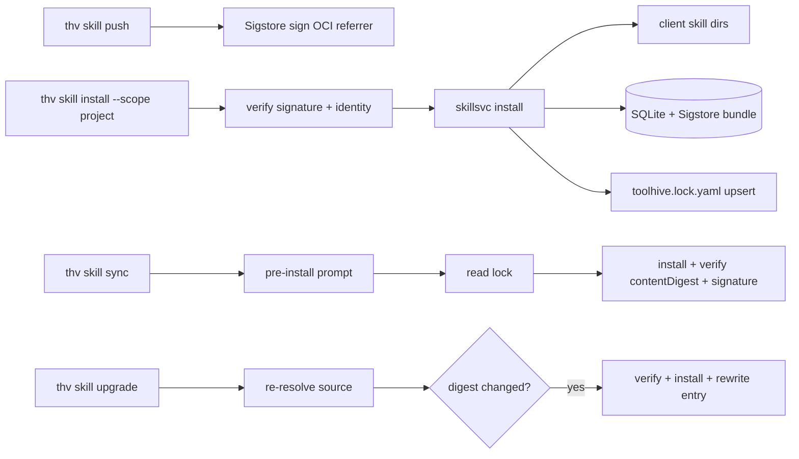

# RFC-0080: Project-Level Skills Lock File

- **Status**: Draft
- **Author(s)**: Samuele Verzi (@samuv)
- **Created**: 2026-07-03
- **Last Updated**: 2026-07-08
- **Target Repository**: toolhive
- **Related Issues**: [toolhive#5715](https://github.com/stacklok/toolhive/pull/5715)

## Summary

Add a project-level lock file (`toolhive.lock.yaml`) that pins the name, version, source, resolved reference, checkout digest, content digest, and **Sigstore signer identity** of every project-scoped skill install (including transitively materialized dependencies), plus `thv skill sync` and `thv skill upgrade` commands to restore pinned state and pull newer content from the catalog. **v1 ships Sigstore signing and verification end-to-end**: `thv skill push` signs OCI artifacts (keyless by default), install/sync/upgrade verify signatures and pinned publisher identity, and `sync --check` re-verifies offline from stored Sigstore bundles. This delivers the Sigstore integration [THV-0030](./THV-0030-skills-lifecycle-management.md) deferred as "future work" and closes the panel-review finding that a committed digest alone is an unauthenticated trust root.

## Problem Statement

- **Current behavior:** `thv skill install --scope project` writes files to client skill dirs and a SQLite record, but nothing pins *which* content was installed in a shareable, version-controlled form. Two teammates cloning the same repo get whatever the catalog currently serves, not what the original installer intended. No signature verification exists for skill artifacts.
- **Who is affected:** any team using project-scoped skills for shared workflows (code-review conventions, testing skills, org-specific instructions). Reproducibility, controlled upgrades, and supply-chain attestation are all missing.
- **Why worth solving:** skills are supply-chain artifacts (instructions an AI assistant follows). Unpinned installs mean silent drift across machines and no auditable path from "what we agreed to use" to "what's actually installed". Every comparable package manager solved this with a committed lock file; skills currently have no equivalent.

## Goals

- Pin the exact content and **publisher identity** of every project-scoped skill install (including transitive `toolhive.requires` dependencies) in a file committed to the project repo, with a deterministic `contentDigest` for integrity verification.
- **Sign on publish, verify on consume:** `thv skill push` produces keyless Sigstore signatures (OCI referrers); install/sync/upgrade verify signatures and locked signer identity by default.
- Restore the pinned skill set on any machine via `thv skill sync`, with a pre-install confirmation gate on interactive terminals.
- Provide a controlled, digest-based upgrade path via `thv skill upgrade`.
- Let CI verify that installed on-disk content **and signatures** match the lock via `thv skill sync --check` (content re-hash + offline Sigstore bundle re-verification).
- Keep the lock client-agnostic by pinning content, not which client apps installed it.
- Stay out of user-scope installs entirely.

## Non-Goals

- Version-constraint resolution or manifest-driven installs. There is no `toolhive.yaml` with `^1.0.0` ranges in this proposal. The lock file is the declaration of intent; sync installs exactly what's pinned.
- Per-client pinning. The lock pins content; sync installs for all detected clients, overridable with `--clients`.
- A dependency *resolver* or version-constraint graph for skill-on-skill dependencies. Transitive deps are *recorded* in the lock (Cargo-style), not re-resolved from constraints.
- Lock-file entries for user-scope installs.
- Org-wide signer policy files (allow/deny lists of publisher identities). Deferred to future work.

## Proposed Solution

Use a single lock file written by install commands. `--scope project` installs upsert an entry (and entries for transitively materialized dependencies), recording verified Sigstore provenance; uninstalls remove them. `sync` reinstalls at the pinned `resolvedReference@digest`, verifies `contentDigest` and signature offline; `upgrade` re-resolves the original `source`, verifies the new artifact's signature, and rewrites the entry if the digest changed.

### High-Level Design



### Detailed Design

`toolhive.lock.yaml` is proposed as the ToolHive project lock file name. **This RFC owns only the `version` and `skills:` keys.** Reserving sibling top-level keys (for example `plugins:` for the plugins system in THV-0077) is a *contract proposal* that a future plugins or artifacts RFC must ratify; THV-0077 does not currently specify a lock schema. Loading a lock file with an unknown or newer top-level `version` is a hard error with a clear "upgrade thv" message; it is never silently ignored or partially parsed.

The lock file has a top-level `version: 1` field and a deterministic list of skill entries sorted by name for stable diffs. Entries pin either OCI or git content:

```yaml
version: 1
skills:
  - name: code-review
    version: 1.0.0
    source: code-review
    resolvedReference: ghcr.io/org/code-review:1.0.0
    digest: sha256:9f2b1e...
    contentDigest: sha256:a1b2c3d4...
    provenance:
      signerIdentity: "https://github.com/stacklok/toolhive/.github/workflows/release.yaml@refs/heads/main"
      certIssuer: "https://token.actions.githubusercontent.com"
      repositoryUri: "https://github.com/stacklok/toolhive-catalog"
      sigstoreUrl: "https://rekor.sigstore.dev"
  - name: testing-conventions
    source: git://github.com/org/skills.git#main/testing-conventions
    resolvedReference: git://github.com/org/skills.git
    digest: 4f0c9a1d2e8b7c6a5f4e3d2c1b0a9f8e7d6c5b4a
    contentDigest: sha256:e5f6a7b8...
    provenance:
      signerIdentity: "https://github.com/org/skills/.github/workflows/sign.yaml@refs/heads/main"
      certIssuer: "https://token.actions.githubusercontent.com"
    requiredBy:
      - code-review
  - name: legacy-skill
    source: ghcr.io/example/legacy:1.0.0
    resolvedReference: ghcr.io/example/legacy:1.0.0
    digest: sha256:deadbeef...
    contentDigest: sha256:cafebabe...
    unsigned: true
```

Each entry stores:

- `name`, optional `version` from `SKILL.md` frontmatter
- `source`: the original user input (registry name, OCI reference, or `git://` reference), preserved verbatim so upgrade can re-resolve it
- `resolvedReference`: the concrete OCI reference or git URL that source resolved to
- `digest`: the checkout pin — OCI manifest digest or git commit hash used to fetch the artifact
- `contentDigest`: a deterministic SHA-256 dirhash of the materialized skill file set (the integrity primitive for `--check` and always-on verification)
- `provenance` (optional): pinned Sigstore publisher identity — `signerIdentity`, `certIssuer`, and optionally `repositoryUri`, `sigstoreUrl` (mirrors the existing registry provenance shape in `docs/arch/06-registry-system.md`)
- `unsigned: true` (optional): explicit marker when install used `--allow-unsigned`; visible in lock diffs so reviewers see the exception
- `requiredBy` (optional): parent skill names for transitively materialized dependencies

`source` is never rewritten, so future upgrades keep re-resolving the same input.

The schema deliberately omits `installedAt`. Every major lock file stores identity, source, and integrity, not chronology. "When was this pinned" is answered by `git blame`; the CLI `--help` for sync points operators to `git log -p -- toolhive.lock.yaml`.

The lock stays strictly client-agnostic: there is no per-entry `clients` field.

#### Trust model

v1 combines **three layers**:

1. **Sigstore signature verification** — every install/sync/upgrade verifies that the artifact at the pinned digest carries a valid Sigstore signature (Fulcio certificate + Rekor transparency log entry for OCI; gitsign for git commits). Unsigned artifacts are rejected unless `--allow-unsigned` is passed at install time and recorded in the lock.
2. **Pinned publisher identity** — the lock records `provenance.signerIdentity` and `provenance.certIssuer` observed at first install. Subsequent sync/upgrade verifies the signature matches the locked identity; upgrade refuses signer changes without `--allow-signer-change`.
3. **PR review of the lock diff** — teammates review committed lock changes (including `provenance` blocks and any `unsigned: true` markers) before merge, the same way teams review dependency updates.

**First-trust establishment:**

- **Catalog-first:** when a skill resolves through a catalog entry that carries provenance metadata (`signer_identity`, `cert_issuer` in the registry schema), install verifies the artifact signature against that expected identity before writing the lock entry.
- **TOFU fallback:** for direct OCI or git refs with no catalog provenance, the verified signer identity from the first install is recorded in the lock and displayed prominently; sync and upgrade enforce it thereafter.

Re-deriving digests from `source` at sync time would defeat pinning; sync installs exactly what the lock says and verifies signatures against pinned identity.

**Offline verification:** Sigstore bundles (certificate chain + transparency log entry) are stored alongside local install state (SQLite or adjacent state dir). `sync --check` re-hashes on-disk content against `contentDigest` **and** re-verifies the stored bundle + locked identity offline — no network, suitable for hermetic CI. Rekor is consulted online only at install/upgrade time when fetching new artifacts.

#### Signing on publish

`thv skill push` signs the pushed OCI artifact after upload:

- **Keyless by default:** Fulcio short-lived certificate + Rekor transparency log entry, using ambient OIDC in CI (GitHub Actions) or browser-based flow for local pushes. Signature stored as an OCI referrer attached to the artifact digest.
- **`--key`:** optional key-based signing (cosign key pair) for air-gapped or key-managed setups.
- Implementation extends toolhive-core's existing `container/verifier` package (`sigstore-go`, already used for MCP image verification in `thv run --image-verification`) for skill OCI referrers.

Stacklok catalog skills are signed in CI as a coordinated workstream (not a blocker for this RFC's acceptance).

#### Verification on consume

Install, sync, and upgrade verify signatures **by default**:

- **OCI skills:** fetch Sigstore bundle from OCI referrer (or Rekor by digest); verify certificate chain and transparency log entry; check signer identity against catalog provenance (first install) or locked `provenance` block (subsequent operations).
- **Git skills:** verify gitsign signature on the pinned commit; check signer identity the same way. Unsigned git commits require `--allow-unsigned`.
- **Enforcement:** signed skills that fail verification are rejected (`reason: signature-invalid` or `signer-mismatch`). Unsigned skills are rejected unless `--allow-unsigned` at install (recorded as `unsigned: true` in lock; sync inherits the exception).

#### Transitive dependencies

Skills declaring `toolhive.requires` in frontmatter materialize dependencies at install time. Project-scope installs **record** transitively materialized skills in the lock (Cargo.lock model) with `requiredBy: [parent]` and full provenance. `sync` installs them at their pinned digest, `contentDigest`, and verified identity; they are never `--prune` candidates while a parent requires them.

#### Component Changes

- Add `pkg/skills/lockfile` for schema handling (`provenance`, `unsigned`, `contentDigest`, `requiredBy`), load/save, file-locked upsert/remove. Entry fields validated at load time.
- Extend toolhive-core `container/verifier` (or a thin `pkg/skills/verifier` wrapper) for OCI referrer verification and gitsign commit verification, reusing `sigstore-go`.
- **`thv skill push`:** after OCI upload, sign artifact (keyless default; `--key` optional); store signature as OCI referrer.
- Project-scope install/uninstall hooks upsert lock entries (including transitive deps), record verified `provenance`, fail non-zero on lock write failure. Store Sigstore bundle with install state for offline re-verification.
- **`managed: true`** SQLite marker for lock-managed installs; `--prune` only removes `removed-from-lock` skills.
- **`Sync`:** content re-hash, offline signature re-verification, pre-install gate (interactive `[y/N]`), `--check`, `--adopt`, prune hardening.
- **`Upgrade`:** re-resolve `source`, verify new artifact signature, refuse ref changes without `--allow-ref-change`, refuse signer changes without `--allow-signer-change`.
- **`--preview`** (not side-effect-free; fetches to cache). **`--preview --fail-on-changes`** as optional CI freshness gate.
- Typed failure `reason` enum includes `signature-invalid`, `signer-mismatch`, `unsigned-rejected`.
- Public `PreserveSource` install option; separate `SkillLockService` interface.

#### API Changes

HTTP API changes are additive. Go: new `SkillLockService` interface; `SkillService` unchanged.

- `POST /skills/sync` body `{projectRoot, clients, prune, check, adopt, yes}`.
- `POST /skills/upgrade` body `{projectRoot, names, preview, failOnChanges, allowRefChange, allowSignerChange, clients}`.
- `POST /skills/push` gains signing options `{keyless, key}` (or CLI-only if push stays CLI-direct).
- Project-scope install: non-zero on lock write failure; body gains `allowUnsigned`.
- Failure `reason` enum: `registry-unreachable`, `digest-missing`, `validation-rejected`, `lock-write-failed`, `ref-change-blocked`, `signature-invalid`, `signer-mismatch`, `unsigned-rejected`, `unknown`.
- **Exit codes:** `0` clean; `2` drift or check failure; `3` partial failure; `4` validation or policy rejection (includes signature failures).

#### Configuration Changes

Lock discovery via `git rev-parse --show-toplevel` semantics. `--project-root` override. No global config added.

#### Data Model Changes

SQLite `installed_skills` gains `managed` flag. Sigstore bundles stored per install (adjacent blob or dedicated column/table). Lock file is committed YAML; SQLite is local runtime state. Reconciled with [THV-0041](./THV-0041-sqlite-state-management.md).

## Security Considerations

### Threat Model

Primary threat: a tampered lock entry (via merged PR) pins malicious skill content or a malicious publisher identity that teammates then sync.

**v1 controls:**

- Sigstore signature verification binds artifact bytes to a publisher identity independently of the lock author.
- Locked `provenance` block prevents identity substitution on sync/upgrade without `--allow-signer-change`.
- `unsigned: true` markers are visible in lock diffs for reviewer scrutiny.
- Pre-install confirmation gate (interactive default No) before AI-followed instructions land on disk.
- PR review of lock diff remains the human gate for accepting new pins and identity changes.

Residual risks: `--allow-unsigned` and `--allow-signer-change` are explicit escape hatches; catalog compromise could supply wrong expected identity on first install (mitigated by catalog curation).

### Authentication and Authorization

Lock-file writes gated by existing API auth. Sigstore verification uses Fulcio/Rekor public infrastructure (no new credential handling for verification). Signing uses ambient OIDC (CI) or browser flow (local).

### Data Security

Lock file contains no secrets — public references, digests, and publisher identities only. Sigstore bundles stored locally contain public certificate chains.

### Input Validation

`lockfile.Load` validates names, digest formats, `provenance` fields, `requiredBy` references. `projectRoot` validation (CWE-22): absolute, symlink-canonicalized, git-rooted; HTTP API constrained under daemon `--serve-root`.

### Secrets Management

None in the lock. Signing keys managed by Sigstore keyless flow or user-supplied `--key`.

### Audit and Logging

Structured reports with typed failure reasons including signature outcomes. Git-committed lock provides provenance history. Rekor provides public transparency log for signatures.

### Mitigations

- Sigstore verification + pinned identity closes the unauthenticated-digest finding.
- `contentDigest` re-hash + offline bundle re-verification in `--check`.
- Pre-install gate, ref-change and signer-change gates on upgrade.
- Transitive deps locked with `requiredBy`; prune limited to `removed-from-lock`.
- gitsign for git sources; `--allow-unsigned` recorded explicitly in lock.

## Alternatives Considered

### Alternative 1: Separate manifest and lock file

- **Why not chosen:** Single-lock model delivers reproducibility now; manifest layer can be added later.

### Alternative 2: Store pin data only in SQLite

- **Why not chosen:** Not portable or reviewable in PRs.

### Alternative 3: Per-client lock entries

- **Why not chosen:** Content pinning is the need; client targeting is sync-time local.

### Alternative 4: Re-derive digests from source at sync time

- **Why not chosen:** Defeats pinning. Sigstore identity pinning (v1) is the correct binding mechanism.

### Alternative 5: Defer signing to v2

- **Why not chosen:** Skills are AI-executed instructions; shipping without signature verification repeats the panel review's core finding. toolhive-core already has sigstore-go verification for MCP images; extending to skills is incremental.

## Compatibility

### Backward Compatibility

HTTP API additive. `SkillService` unchanged (`SkillLockService` is new). Existing unsigned skills in the wild require `--allow-unsigned` at first project-scope install (recorded in lock). Stacklok catalog signing rollout is coordinated separately.

**Behavior changes from POC:** lock write failure exits non-zero; unsigned skills rejected by default.

### Forward Compatibility

Unknown lock `version` hard-errors. This RFC owns `skills:` only; sibling keys are a contract proposal. New entry fields use `omitempty`.

## Implementation Plan

POC in [toolhive#5715](https://github.com/stacklok/toolhive/pull/5715); extend and split post-acceptance.

### Phase 1: Lock file package

- Schema (`provenance`, `unsigned`, `contentDigest`, `requiredBy`), validation, file-locked ops.

### Phase 2: Install/uninstall hooks

- Upsert with provenance, fail-on-lock-write, `managed` flag, Sigstore bundle storage.

### Phase 3: Sync

- Content re-hash, offline signature verify, pre-install gate, `--check`, `--adopt`, prune hardening.

### Phase 4: Upgrade

- `--preview`, `--fail-on-changes`, `--allow-ref-change`, `--allow-signer-change`.

### Phase 5: Signing and verification

- `thv skill push` keyless signing; OCI referrer + gitsign verification on consume; extend `container/verifier`; catalog CI signing (coordinated).

### Phase 6: Docs

- `docs/arch/12-skills-system.md`, CLI docs, swagger, signing/verification guide.

### Dependencies

- toolhive-core `container/verifier` (`sigstore-go`)
- Existing `gitresolver`, `ociskills.RegistryClient`, THV-0041 SQLite store
- Sigstore staging infrastructure for E2E tests

## Testing Strategy

- **Unit tests:** lockfile schema including `provenance`/`unsigned`; signature verification (valid, invalid, wrong identity); gitsign commit verification; offline bundle re-verification in `--check`; push signing (keyless mock, `--key`); all existing sync/upgrade/prune tests.
- **E2E tests:** signed catalog skill install → sync → `--check` (content + signature offline) → upgrade with signer-change blocked → `--preview --fail-on-changes`; unsigned skill rejected then `--allow-unsigned` recorded; gitsign-signed git skill path. Fixtures against Sigstore staging.
- **Security tests:** tampered lock with wrong identity rejected; `unsigned: true` visible in diff; sync gate on TTY; `projectRoot` traversal rejected.

## Documentation

- `docs/arch/12-skills-system.md`: lock file, trust model, signing, verification, gitsign.
- CLI docs: `--allow-unsigned`, `--allow-signer-change`, push signing, `--check` offline semantics.
- User guide: committing lock, CI patterns (`--check` integrity vs `upgrade --preview --fail-on-changes` freshness).
- Note in THV-0030 tracking: this RFC delivers the Sigstore integration 0030 listed as future work.

## Future Work

- Org-wide signer policy files (allow/deny publisher identity lists).
- Catalog-level trust roots binding registry name to expected signer without per-lock TOFU.

## Open Questions

Resolved during design and review:

1. ~~Sync drift~~ → reinstall, report `drifted`, verify via `contentDigest` re-hash.
2. ~~Per-entry `clients`~~ → client-agnostic lock.
3. ~~Upgrade default~~ → upgrade all; `--preview --fail-on-changes` for CI freshness.
4. ~~Lock naming~~ → `toolhive.lock.yaml`; this RFC owns `skills:` only.
5. ~~Trust root / signing timing~~ → **Sigstore signing and verification ship in v1**; identity pinned in lock; PR review of lock diff remains human gate.
6. ~~Transitive deps~~ → record in lock with `requiredBy`.
7. ~~v1 vs v2 trust layer~~ → collapsed; v2 milestone removed.

## References

- POC PR: <https://github.com/stacklok/toolhive/pull/5715>
- Research note: <https://github.com/stacklok/notes/blob/093fc48edbc6631ef9373cc1c35581a343ac2af5/docs/joes-research/tessl-skills-package-managers.md>
- [THV-0030: Skills Lifecycle Management in ToolHive CLI](./THV-0030-skills-lifecycle-management.md) — Sigstore integration deferred there; delivered by this RFC
- [THV-0041: SQLite-Based State Management](./THV-0041-sqlite-state-management.md)
- [THV-0077: Plugin lifecycle management](./THV-0077-plugins-lifecycle-management.md)
- toolhive-core `container/verifier` (sigstore-go): MCP image verification precedent
- Prior art (shape): npm `package-lock.json`, `Cargo.lock`, `go.sum`
- oras-go cross-origin redirect auth guard: GHSA-vh4v-2xq2-g5cg

---

## RFC Lifecycle

<!-- This section is maintained by RFC reviewers -->

### Review History

| Date | Reviewer | Decision | Notes |
|------|----------|----------|-------|
| YYYY-MM-DD | @reviewer | Under Review | Initial submission |
| 2026-07-07 | @JAORMX | Commented | Panel review; RFC revised |
| 2026-07-08 | @JAORMX | Commented | Requested v1 signing; RFC updated |

### Implementation Tracking

| Repository | PR | Status |
|------------|----|--------|
| toolhive | [#5715](https://github.com/stacklok/toolhive/pull/5715) | POC |
